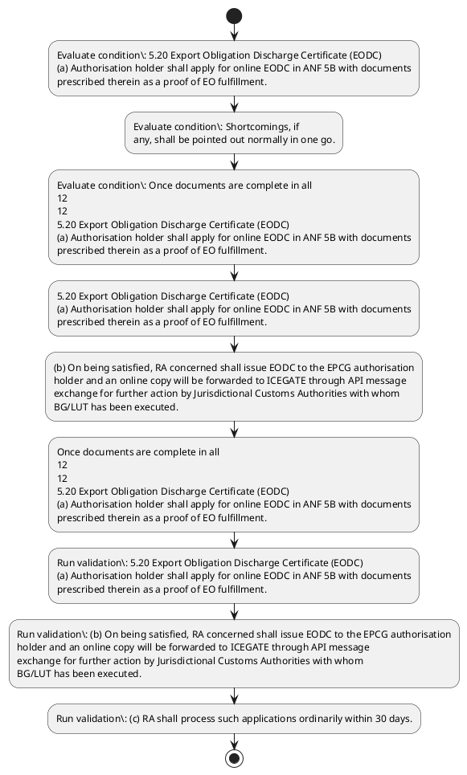

# Chapter 5 / Section 5.20: Export Obligation Discharge Certificate (EODC)

**Chapter Title:** Export Promotion Capital Goods (EPCG) Scheme

**Pages:** 12, 13

**Purpose:** 5.20 Export Obligation Discharge Certificate (EODC)
(a) Authorisation holder shall apply for online EODC in ANF 5B with documents
prescribed therein as a proof of EO fulfillment.

**Purpose Thanglish:** Indha Export Obligation Discharge Certificate (EODC) section-la, 5.20 export Obligation Discharge Certificate (EODC)
(a) Authorisation holder kandippa apply for online EODC in ANF 5B with documents
prescribed therein as a proof of EO fulfillment.

**Summary:** 5.20 Export Obligation Discharge Certificate (EODC)
(a) Authorisation holder shall apply for online EODC in ANF 5B with documents
prescribed therein as a proof of EO fulfillment. (b) On being satisfied, RA concerned shall issue EODC to the EPCG authorisation
holder and an online copy will be forwarded to ICEGATE through API message
exchange for further action by Jurisdictional Customs Authorities with whom
BG/LUT has been executed. (c) RA shall process such applications ordinarily within 30 days.

**Business Meaning:** Export Obligation Discharge Certificate (EODC) governs how DGFT business controls should be applied, validated, and enforced.

**Business Explanation:** Export Obligation Discharge Certificate (EODC) explains the operating rule set that DEKAI should enforce. Key control points include 5.20 Export Obligation Discharge Certificate (EODC)
(a) Authorisation holder shall apply for online EODC in ANF 5B with documents
prescribed therein as a proof of EO fulfillment. The section also drives actions such as 5.20 Export Obligation Discharge Certificate (EODC)
(a) Authorisation holder shall apply for online EODC in ANF 5B with documents
prescribed therein as a proof of EO fulfillment..

**Business Explanation Thanglish:** Indha Export Obligation Discharge Certificate (EODC) section-la, export Obligation Discharge Certificate (EODC) explains the operating rule set that DEKAI should enforce. Key control points include 5.20 export Obligation Discharge Certificate (EODC)
(a) Authorisation holder kandippa apply for online EODC in ANF 5B with documents
prescribed therein as a proof of EO fulfillment. The section also drives actions such as 5.20 export Obligation Discharge Certificate (EODC)
(a) Authorisation holder kandippa apply for online EODC in ANF 5B with documents
prescribed therein as a proof of EO fulfillment..

## Business Logic
- 5.20 Export Obligation Discharge Certificate (EODC)
(a) Authorisation holder shall apply for online EODC in ANF 5B with documents
prescribed therein as a proof of EO fulfillment.
- (b) On being satisfied, RA concerned shall issue EODC to the EPCG authorisation
holder and an online copy will be forwarded to ICEGATE through API message
exchange for further action by Jurisdictional Customs Authorities with whom
BG/LUT has been executed.
- (c) RA shall process such applications ordinarily within 30 days.
- Shortcomings, if
any, shall be pointed out normally in one go.
- Once documents are complete in all
12
12
5.20 Export Obligation Discharge Certificate (EODC)
(a) Authorisation holder shall apply for online EODC in ANF 5B with documents
prescribed therein as a proof of EO fulfillment.
- Once documents are complete in all
respects, export obligation shall be discharged within 30 days of receipt of
complete documents /information.

## Business Rules
- rule_id=CH5-SEC5_20-R001, rule_description=5.20 Export Obligation Discharge Certificate (EODC)
(a) Authorisation holder shall apply for online EODC in ANF 5B with documents
prescribed therein as a proof of EO fulfillment., trigger=Export Obligation Discharge Certificate (EODC), condition=5.20 Export Obligation Discharge Certificate (EODC)
(a) Authorisation holder shall apply for online EODC in ANF 5B with documents
prescribed therein as a proof of EO fulfillment., validation=5.20 Export Obligation Discharge Certificate (EODC)
(a) Authorisation holder shall apply for online EODC in ANF 5B with documents
prescribed therein as a proof of EO fulfillment., action=5.20 Export Obligation Discharge Certificate (EODC)
(a) Authorisation holder shall apply for online EODC in ANF 5B with documents
prescribed therein as a proof of EO fulfillment., exception=No explicit exception found in uploaded documents., output=DEKAI should produce a compliance decision for 5.20 - Export Obligation Discharge Certificate (EODC).
- rule_id=CH5-SEC5_20-R002, rule_description=(b) On being satisfied, RA concerned shall issue EODC to the EPCG authorisation
holder and an online copy will be forwarded to ICEGATE through API message
exchange for further action by Jurisdictional Customs Authorities with whom
BG/LUT has been executed., trigger=Export Obligation Discharge Certificate (EODC), condition=any, validation=(b) On being satisfied, RA concerned shall issue EODC to the EPCG authorisation
holder and an online copy will be forwarded to ICEGATE through API message
exchange for further action by Jurisdictional Customs Authorities with whom
BG/LUT has been executed., action=(b) On being satisfied, RA concerned shall issue EODC to the EPCG authorisation
holder and an online copy will be forwarded to ICEGATE through API message
exchange for further action by Jurisdictional Customs Authorities with whom
BG/LUT has been executed., exception=No explicit exception found in uploaded documents., output=DEKAI should produce a compliance decision for 5.20 - Export Obligation Discharge Certificate (EODC).
- rule_id=CH5-SEC5_20-R003, rule_description=(c) RA shall process such applications ordinarily within 30 days., trigger=Export Obligation Discharge Certificate (EODC), condition=Once documents are complete in all
12
12
5.20 Export Obligation Discharge Certificate (EODC)
(a) Authorisation holder shall apply for online EODC in ANF 5B with documents
prescribed therein as a proof of EO fulfillment., validation=(c) RA shall process such applications ordinarily within 30 days., action=Once documents are complete in all
12
12
5.20 Export Obligation Discharge Certificate (EODC)
(a) Authorisation holder shall apply for online EODC in ANF 5B with documents
prescribed therein as a proof of EO fulfillment., exception=No explicit exception found in uploaded documents., output=DEKAI should produce a compliance decision for 5.20 - Export Obligation Discharge Certificate (EODC).
- rule_id=CH5-SEC5_20-R004, rule_description=Shortcomings, if
any, shall be pointed out normally in one go., trigger=Export Obligation Discharge Certificate (EODC), condition=Once documents are complete in all
12
12
5.20 Export Obligation Discharge Certificate (EODC)
(a) Authorisation holder shall apply for online EODC in ANF 5B with documents
prescribed therein as a proof of EO fulfillment., validation=Shortcomings, if
any, shall be pointed out normally in one go., action=Once documents are complete in all
12
12
5.20 Export Obligation Discharge Certificate (EODC)
(a) Authorisation holder shall apply for online EODC in ANF 5B with documents
prescribed therein as a proof of EO fulfillment., exception=No explicit exception found in uploaded documents., output=DEKAI should produce a compliance decision for 5.20 - Export Obligation Discharge Certificate (EODC).
- rule_id=CH5-SEC5_20-R005, rule_description=Once documents are complete in all
12
12
5.20 Export Obligation Discharge Certificate (EODC)
(a) Authorisation holder shall apply for online EODC in ANF 5B with documents
prescribed therein as a proof of EO fulfillment., trigger=Export Obligation Discharge Certificate (EODC), condition=Once documents are complete in all
12
12
5.20 Export Obligation Discharge Certificate (EODC)
(a) Authorisation holder shall apply for online EODC in ANF 5B with documents
prescribed therein as a proof of EO fulfillment., validation=Once documents are complete in all
12
12
5.20 Export Obligation Discharge Certificate (EODC)
(a) Authorisation holder shall apply for online EODC in ANF 5B with documents
prescribed therein as a proof of EO fulfillment., action=Once documents are complete in all
12
12
5.20 Export Obligation Discharge Certificate (EODC)
(a) Authorisation holder shall apply for online EODC in ANF 5B with documents
prescribed therein as a proof of EO fulfillment., exception=No explicit exception found in uploaded documents., output=DEKAI should produce a compliance decision for 5.20 - Export Obligation Discharge Certificate (EODC).
- rule_id=CH5-SEC5_20-R006, rule_description=Once documents are complete in all
respects, export obligation shall be discharged within 30 days of receipt of
complete documents /information., trigger=Export Obligation Discharge Certificate (EODC), condition=Once documents are complete in all
12
12
5.20 Export Obligation Discharge Certificate (EODC)
(a) Authorisation holder shall apply for online EODC in ANF 5B with documents
prescribed therein as a proof of EO fulfillment., validation=Once documents are complete in all
respects, export obligation shall be discharged within 30 days of receipt of
complete documents /information., action=Once documents are complete in all
12
12
5.20 Export Obligation Discharge Certificate (EODC)
(a) Authorisation holder shall apply for online EODC in ANF 5B with documents
prescribed therein as a proof of EO fulfillment., exception=No explicit exception found in uploaded documents., output=DEKAI should produce a compliance decision for 5.20 - Export Obligation Discharge Certificate (EODC).

## Conditions
- 5.20 Export Obligation Discharge Certificate (EODC)
(a) Authorisation holder shall apply for online EODC in ANF 5B with documents
prescribed therein as a proof of EO fulfillment.
- Shortcomings, if
any, shall be pointed out normally in one go.
- Once documents are complete in all
12
12
5.20 Export Obligation Discharge Certificate (EODC)
(a) Authorisation holder shall apply for online EODC in ANF 5B with documents
prescribed therein as a proof of EO fulfillment.

## Condition Logic
- id=5.5.20.1, if=5.20 Export Obligation Discharge Certificate (EODC)
(a) Authorisation holder shall apply for online EODC in ANF 5B with documents
prescribed therein as a proof of EO fulfillment., then=5.20 Export Obligation Discharge Certificate (EODC)
(a) Authorisation holder shall apply for online EODC in ANF 5B with documents
prescribed therein as a proof of EO fulfillment., source=5.20 Export Obligation Discharge Certificate (EODC)
(a) Authorisation holder shall apply for online EODC in ANF 5B with documents
prescribed therein as a proof of EO fulfillment.
- id=5.5.20.2, if=any, then=5.20 Export Obligation Discharge Certificate (EODC)
(a) Authorisation holder shall apply for online EODC in ANF 5B with documents
prescribed therein as a proof of EO fulfillment., source=Shortcomings, if
any, shall be pointed out normally in one go.
- id=5.5.20.3, if=Once documents are complete in all
12
12
5.20 Export Obligation Discharge Certificate (EODC)
(a) Authorisation holder shall apply for online EODC in ANF 5B with documents
prescribed therein as a proof of EO fulfillment., then=5.20 Export Obligation Discharge Certificate (EODC)
(a) Authorisation holder shall apply for online EODC in ANF 5B with documents
prescribed therein as a proof of EO fulfillment., source=Once documents are complete in all
12
12
5.20 Export Obligation Discharge Certificate (EODC)
(a) Authorisation holder shall apply for online EODC in ANF 5B with documents
prescribed therein as a proof of EO fulfillment.

## Validations
- 5.20 Export Obligation Discharge Certificate (EODC)
(a) Authorisation holder shall apply for online EODC in ANF 5B with documents
prescribed therein as a proof of EO fulfillment.
- (b) On being satisfied, RA concerned shall issue EODC to the EPCG authorisation
holder and an online copy will be forwarded to ICEGATE through API message
exchange for further action by Jurisdictional Customs Authorities with whom
BG/LUT has been executed.
- (c) RA shall process such applications ordinarily within 30 days.
- Shortcomings, if
any, shall be pointed out normally in one go.
- Once documents are complete in all
12
12
5.20 Export Obligation Discharge Certificate (EODC)
(a) Authorisation holder shall apply for online EODC in ANF 5B with documents
prescribed therein as a proof of EO fulfillment.
- Once documents are complete in all
respects, export obligation shall be discharged within 30 days of receipt of
complete documents /information.

## Exceptions
- None identified

## Dependencies
- None identified

## Authorities
- RA
- Customs
- Jurisdictional Customs Authorities

## Required Documents
- Export Obligation Discharge Certificate
- (b) On being satisfied, RA concerned shall issue EODC to the EPCG authorisation
holder and an online copy will be forwarded to ICEGATE through API message
exchange for further action by Jurisdictional Customs Authorities with whom
BG/LUT has been executed.
- (c) RA shall process such applications ordinarily within 30 days.
- Once documents are complete in all
respects, export obligation shall be discharged within 30 days of receipt of
complete documents /information.

## Timelines
- (c) RA shall process such applications ordinarily within 30 days.
- Once documents are complete in all
respects, export obligation shall be discharged within 30 days of receipt of
complete documents /information.

## Actions
- 5.20 Export Obligation Discharge Certificate (EODC)
(a) Authorisation holder shall apply for online EODC in ANF 5B with documents
prescribed therein as a proof of EO fulfillment.
- (b) On being satisfied, RA concerned shall issue EODC to the EPCG authorisation
holder and an online copy will be forwarded to ICEGATE through API message
exchange for further action by Jurisdictional Customs Authorities with whom
BG/LUT has been executed.
- Once documents are complete in all
12
12
5.20 Export Obligation Discharge Certificate (EODC)
(a) Authorisation holder shall apply for online EODC in ANF 5B with documents
prescribed therein as a proof of EO fulfillment.

## Workflow
- Evaluate condition: 5.20 Export Obligation Discharge Certificate (EODC)
(a) Authorisation holder shall apply for online EODC in ANF 5B with documents
prescribed therein as a proof of EO fulfillment.
- Evaluate condition: Shortcomings, if
any, shall be pointed out normally in one go.
- Evaluate condition: Once documents are complete in all
12
12
5.20 Export Obligation Discharge Certificate (EODC)
(a) Authorisation holder shall apply for online EODC in ANF 5B with documents
prescribed therein as a proof of EO fulfillment.
- 5.20 Export Obligation Discharge Certificate (EODC)
(a) Authorisation holder shall apply for online EODC in ANF 5B with documents
prescribed therein as a proof of EO fulfillment.
- (b) On being satisfied, RA concerned shall issue EODC to the EPCG authorisation
holder and an online copy will be forwarded to ICEGATE through API message
exchange for further action by Jurisdictional Customs Authorities with whom
BG/LUT has been executed.
- Once documents are complete in all
12
12
5.20 Export Obligation Discharge Certificate (EODC)
(a) Authorisation holder shall apply for online EODC in ANF 5B with documents
prescribed therein as a proof of EO fulfillment.
- Run validation: 5.20 Export Obligation Discharge Certificate (EODC)
(a) Authorisation holder shall apply for online EODC in ANF 5B with documents
prescribed therein as a proof of EO fulfillment.
- Run validation: (b) On being satisfied, RA concerned shall issue EODC to the EPCG authorisation
holder and an online copy will be forwarded to ICEGATE through API message
exchange for further action by Jurisdictional Customs Authorities with whom
BG/LUT has been executed.
- Run validation: (c) RA shall process such applications ordinarily within 30 days.

## Workflow ASCII
```text
Export Obligation Discharge Certificate (EODC)
Evaluate condition: 5.20 Export Obligation Discharge Certificate (EODC)
(a) Authorisation holder shall apply for online EODC in ANF 5B with documents
prescribed therein as a proof of EO fulfillment.
   |
   v
Evaluate condition: Shortcomings, if
any, shall be pointed out normally in one go.
   |
   v
Evaluate condition: Once documents are complete in all
12
12
5.20 Export Obligation Discharge Certificate (EODC)
(a) Authorisation holder shall apply for online EODC in ANF 5B with documents
prescribed therein as a proof of EO fulfillment.
   |
   v
5.20 Export Obligation Discharge Certificate (EODC)
(a) Authorisation holder shall apply for online EODC in ANF 5B with documents
prescribed therein as a proof of EO fulfillment.
   |
   v
(b) On being satisfied, RA concerned shall issue EODC to the EPCG authorisation
holder and an online copy will be forwarded to ICEGATE through API message
exchange for further action by Jurisdictional Customs Authorities with whom
BG/LUT has been executed.
   |
   v
Once documents are complete in all
12
12
5.20 Export Obligation Discharge Certificate (EODC)
(a) Authorisation holder shall apply for online EODC in ANF 5B with documents
prescribed therein as a proof of EO fulfillment.
   |
   v
Run validation: 5.20 Export Obligation Discharge Certificate (EODC)
(a) Authorisation holder shall apply for online EODC in ANF 5B with documents
prescribed therein as a proof of EO fulfillment.
   |
   v
Run validation: (b) On being satisfied, RA concerned shall issue EODC to the EPCG authorisation
holder and an online copy will be forwarded to ICEGATE through API message
exchange for further action by Jurisdictional Customs Authorities with whom
BG/LUT has been executed.
   |
   v
Run validation: (c) RA shall process such applications ordinarily within 30 days.
```

## Decision Tree
- IF 5.20 Export Obligation Discharge Certificate (EODC)
(a) Authorisation holder shall apply for online EODC in ANF 5B with documents
prescribed therein as a proof of EO fulfillment. THEN 5.20 Export Obligation Discharge Certificate (EODC)
(a) Authorisation holder shall apply for online EODC in ANF 5B with documents
prescribed therein as a proof of EO fulfillment.
- IF Shortcomings, if
any, shall be pointed out normally in one go. THEN 5.20 Export Obligation Discharge Certificate (EODC)
(a) Authorisation holder shall apply for online EODC in ANF 5B with documents
prescribed therein as a proof of EO fulfillment.
- IF Once documents are complete in all
12
12
5.20 Export Obligation Discharge Certificate (EODC)
(a) Authorisation holder shall apply for online EODC in ANF 5B with documents
prescribed therein as a proof of EO fulfillment. THEN 5.20 Export Obligation Discharge Certificate (EODC)
(a) Authorisation holder shall apply for online EODC in ANF 5B with documents
prescribed therein as a proof of EO fulfillment.

## Decision Tree ASCII
```text
Export Obligation Discharge Certificate (EODC) Decision
IF 5.20 Export Obligation Discharge Certificate (EODC)
(a) Authorisation holder shall apply for online EODC in ANF 5B with documents
prescribed therein as a proof of EO fulfillment. THEN 5.20 Export Obligation Discharge Certificate (EODC)
(a) Authorisation holder shall apply for online EODC in ANF 5B with documents
prescribed therein as a proof of EO fulfillment.
   |
   v
IF Shortcomings, if
any, shall be pointed out normally in one go. THEN 5.20 Export Obligation Discharge Certificate (EODC)
(a) Authorisation holder shall apply for online EODC in ANF 5B with documents
prescribed therein as a proof of EO fulfillment.
   |
   v
IF Once documents are complete in all
12
12
5.20 Export Obligation Discharge Certificate (EODC)
(a) Authorisation holder shall apply for online EODC in ANF 5B with documents
prescribed therein as a proof of EO fulfillment. THEN 5.20 Export Obligation Discharge Certificate (EODC)
(a) Authorisation holder shall apply for online EODC in ANF 5B with documents
prescribed therein as a proof of EO fulfillment.
```

## Examples
- User asks to process Export Obligation Discharge Certificate (EODC); the platform checks conditions, validations, and documents before action.

**Real-world Example:** Example: an importer or exporter invokes Export Obligation Discharge Certificate (EODC), submits Export Obligation Discharge Certificate, (b) On being satisfied, RA concerned shall issue EODC to the EPCG authorisation
holder and an online copy will be forwarded to ICEGATE through API message
exchange for further action by Jurisdictional Customs Authorities with whom
BG/LUT has been executed., (c) RA shall process such applications ordinarily within 30 days., and DEKAI uses the extracted rules to 5.20 export obligation discharge certificate (eodc)
(a) authorisation holder shall apply for online eodc in anf 5b with documents
prescribed therein as a proof of eo fulfillment..

**Real-world Example Thanglish:** Indha Export Obligation Discharge Certificate (EODC) section-la, Example: an importer or exporter invokes export Obligation Discharge Certificate (EODC), submits export Obligation Discharge Certificate, (b) On being satisfied, RA concerned kandippa issue EODC to the EPCG authorisation
holder and an online copy will be forwarded to ICEGATE through API message
exchange for further action by Jurisdictional Customs Authorities with whom
BG/LUT has been executed., (c) RA kandippa process such applications ordinarily within 30 days., and DEKAI uses the extracted rules to 5.20 export obligation discharge certificate (eodc)
(a) authorisation holder kandippa apply for online eodc in anf 5b with documents
prescribed therein as a proof of eo fulfillment..

## AI Rules
- IF detected context matches section rule THEN enforce: 5.20 Export Obligation Discharge Certificate (EODC)
(a) Authorisation holder shall apply for online EODC in ANF 5B with documents
prescribed therein as a proof of EO fulfillment.
- IF detected context matches section rule THEN enforce: (b) On being satisfied, RA concerned shall issue EODC to the EPCG authorisation
holder and an online copy will be forwarded to ICEGATE through API message
exchange for further action by Jurisdictional Customs Authorities with whom
BG/LUT has been executed.
- IF detected context matches section rule THEN enforce: (c) RA shall process such applications ordinarily within 30 days.
- IF detected context matches section rule THEN enforce: Shortcomings, if
any, shall be pointed out normally in one go.
- IF detected context matches section rule THEN enforce: Once documents are complete in all
12
12
5.20 Export Obligation Discharge Certificate (EODC)
(a) Authorisation holder shall apply for online EODC in ANF 5B with documents
prescribed therein as a proof of EO fulfillment.
- IF detected context matches section rule THEN enforce: Once documents are complete in all
respects, export obligation shall be discharged within 30 days of receipt of
complete documents /information.
- IF validations pass THEN recommend action: 5.20 Export Obligation Discharge Certificate (EODC)
(a) Authorisation holder shall apply for online EODC in ANF 5B with documents
prescribed therein as a proof of EO fulfillment.

## Database Fields
- name=section_code, type=string, required=True, source=parsed_section_heading
- name=section_title, type=string, required=True, source=parsed_section_heading
- name=for_flag, type=boolean, required=False, source=keyword:for
- name=anf_flag, type=boolean, required=False, source=keyword:ANF
- name=the_flag, type=boolean, required=False, source=keyword:the
- name=and_flag, type=boolean, required=False, source=keyword:and
- name=api_flag, type=boolean, required=False, source=keyword:API
- name=has_flag, type=boolean, required=False, source=keyword:has
- name=any_flag, type=boolean, required=False, source=keyword:any
- name=out_flag, type=boolean, required=False, source=keyword:out
- name=document_1_submitted, type=boolean, required=True, source=Export Obligation Discharge Certificate
- name=document_2_submitted, type=boolean, required=True, source=(b) On being satisfied, RA concerned shall issue EODC to the EPCG authorisation
holder and an online copy will be forwarded to ICEGATE through API message
exchange for further action by Jurisdictional Customs Authorities with whom
BG/LUT has been executed.
- name=document_3_submitted, type=boolean, required=True, source=(c) RA shall process such applications ordinarily within 30 days.
- name=document_4_submitted, type=boolean, required=True, source=Once documents are complete in all
respects, export obligation shall be discharged within 30 days of receipt of
complete documents /information.

## API Requirements
- method=GET, path=/api/dgft/sections/5.20, purpose=Retrieve knowledge payload for section 5.20, query_params=['include=workflow,decision_tree,validations'], response_fields=['section', 'title', 'summary', 'conditions', 'validations', 'exceptions', 'workflow', 'decision_tree']
- method=POST, path=/api/dgft/Export-Obligation-Discharge-Certificate-EODC/validate, purpose=Validate inputs and documents for Export Obligation Discharge Certificate (EODC), request_fields=['section_code', 'section_title', 'document_1_submitted', 'document_2_submitted', 'document_3_submitted', 'document_4_submitted'], response_fields=['status', 'errors', 'warnings', 'next_actions']
- method=POST, path=/api/dgft/Export-Obligation-Discharge-Certificate-EODC/execute, purpose=Trigger business action for 5.20 Export Obligation Discharge Certificate (EODC)
(a) Authorisation holder shall apply for online EODC in ANF 5B with documents
prescribed therein as a proof of EO fulfillment., request_fields=['section_code', 'section_title', 'document_1_submitted', 'document_2_submitted', 'document_3_submitted', 'document_4_submitted'], response_fields=['reference_id', 'status', 'authority', 'timeline']

## UI Screens
- screen_id=Export_Obligation_Discharge_Certificate_EODC_overview, name=Export Obligation Discharge Certificate (EODC) Overview, purpose=Show section summary, authority, timeline, and eligibility cues., widgets=['summary_card', 'conditions_table', 'authority_badges', 'timeline_panel']
- screen_id=Export_Obligation_Discharge_Certificate_EODC_submission, name=Export Obligation Discharge Certificate (EODC) Submission, purpose=Capture applicant data and supporting documents., widgets=['dynamic_form', 'document_uploader', 'validation_panel', 'next_action_footer'], fields=['section_code', 'section_title', 'for_flag', 'anf_flag', 'the_flag', 'and_flag', 'api_flag', 'has_flag']

## Error Messages
- Validation failed because the section requirements were not fully met.

## FAQ
- question_en=What is the purpose of section 5.20?, answer_en=Export Obligation Discharge Certificate (EODC) explains the operating rule set that DEKAI should enforce. Key control points include 5.20 Export Obligation Discharge Certificate (EODC)
(a) Authorisation holder shall apply for online EODC in ANF 5B with documents
prescribed therein as a proof of EO fulfillment. The section also drives actions such as 5.20 Export Obligation Discharge Certificate (EODC)
(a) Authorisation holder shall apply for online EODC in ANF 5B with documents
prescribed therein as a proof of EO fulfillment.., question_thanglish=Indha Export Obligation Discharge Certificate (EODC) section-la, What is the purpose of section 5.20?, answer_thanglish=Indha Export Obligation Discharge Certificate (EODC) section-la, export Obligation Discharge Certificate (EODC) explains the operating rule set that DEKAI should enforce. Key control points include 5.20 export Obligation Discharge Certificate (EODC)
(a) Authorisation holder kandippa apply for online EODC in ANF 5B with documents
prescribed therein as a proof of EO fulfillment. The section also drives actions such as 5.20 export Obligation Discharge Certificate (EODC)
(a) Authorisation holder kandippa apply for online EODC in ANF 5B with documents
prescribed therein as a proof of EO fulfillment..
- question_en=What documents are required under Export Obligation Discharge Certificate (EODC)?, answer_en=Export Obligation Discharge Certificate, (b) On being satisfied, RA concerned shall issue EODC to the EPCG authorisation
holder and an online copy will be forwarded to ICEGATE through API message
exchange for further action by Jurisdictional Customs Authorities with whom
BG/LUT has been executed., (c) RA shall process such applications ordinarily within 30 days., Once documents are complete in all
respects, export obligation shall be discharged within 30 days of receipt of
complete documents /information., question_thanglish=Indha Export Obligation Discharge Certificate (EODC) section-la, What documents are required under export Obligation Discharge Certificate (EODC)?, answer_thanglish=Indha Export Obligation Discharge Certificate (EODC) section-la, export Obligation Discharge Certificate, (b) On being satisfied, RA concerned kandippa issue EODC to the EPCG authorisation
holder and an online copy will be forwarded to ICEGATE through API message
exchange for further action by Jurisdictional Customs Authorities with whom
BG/LUT has been executed., (c) RA kandippa process such applications ordinarily within 30 days., Once documents are complete in all
respects, export obligation kandippa be discharged within 30 days of receipt of
complete documents /information.
- question_en=Which authority handles Export Obligation Discharge Certificate (EODC)?, answer_en=RA, Customs, Jurisdictional Customs Authorities, question_thanglish=Indha Export Obligation Discharge Certificate (EODC) section-la, Which authority handles export Obligation Discharge Certificate (EODC)?, answer_thanglish=Indha Export Obligation Discharge Certificate (EODC) section-la, RA, Customs, Jurisdictional Customs Authorities

## Questions Users May Ask
- What does Export Obligation Discharge Certificate (EODC) require?
- Which documents are needed for Export Obligation Discharge Certificate (EODC)?
- How does DEKAI validate Export Obligation Discharge Certificate (EODC) requests?
- What action should be taken for Export Obligation Discharge Certificate (EODC)?

## Expected AI Answers
- Export Obligation Discharge Certificate (EODC) requires the platform to interpret the section text, apply the extracted business rules, and present the correct next action.
- Required documents are inferred from the section text: Export Obligation Discharge Certificate, (b) On being satisfied, RA concerned shall issue EODC to the EPCG authorisation
holder and an online copy will be forwarded to ICEGATE through API message
exchange for further action by Jurisdictional Customs Authorities with whom
BG/LUT has been executed., (c) RA shall process such applications ordinarily within 30 days., Once documents are complete in all
respects, export obligation shall be discharged within 30 days of receipt of
complete documents /information.
- DEKAI validates Export Obligation Discharge Certificate (EODC) by checking conditions, required documents, authority references, and exception clauses before recommending an outcome.
- The primary extracted action is: 5.20 Export Obligation Discharge Certificate (EODC)
(a) Authorisation holder shall apply for online EODC in ANF 5B with documents
prescribed therein as a proof of EO fulfillment.

## AI Q&A Examples
- question_en=User asks: How do I comply with Export Obligation Discharge Certificate (EODC)?, answer_en=AI answers: DEKAI should evaluate section 5.20, apply the extracted rules, and guide the user through Evaluate condition: 5.20 Export Obligation Discharge Certificate (EODC)
(a) Authorisation holder shall apply for online EODC in ANF 5B with documents
prescribed therein as a proof of EO fulfillment.., question_thanglish=Indha Export Obligation Discharge Certificate (EODC) section-la, User asks: How do I comply with export Obligation Discharge Certificate (EODC)?, answer_thanglish=Indha Export Obligation Discharge Certificate (EODC) section-la, AI answers: DEKAI should evaluate section 5.20, apply the extracted rules, and guide the user through Evaluate condition: 5.20 export Obligation Discharge Certificate (EODC)
(a) Authorisation holder kandippa apply for online EODC in ANF 5B with documents
prescribed therein as a proof of EO fulfillment..
- question_en=User asks: Which validations apply to Export Obligation Discharge Certificate (EODC)?, answer_en=AI answers: Applicable validations are 5.20 Export Obligation Discharge Certificate (EODC)
(a) Authorisation holder shall apply for online EODC in ANF 5B with documents
prescribed therein as a proof of EO fulfillment., (b) On being satisfied, RA concerned shall issue EODC to the EPCG authorisation
holder and an online copy will be forwarded to ICEGATE through API message
exchange for further action by Jurisdictional Customs Authorities with whom
BG/LUT has been executed., (c) RA shall process such applications ordinarily within 30 days., question_thanglish=Indha Export Obligation Discharge Certificate (EODC) section-la, User asks: Which validations apply to export Obligation Discharge Certificate (EODC)?, answer_thanglish=Indha Export Obligation Discharge Certificate (EODC) section-la, AI answers: Applicable validations are 5.20 export Obligation Discharge Certificate (EODC)
(a) Authorisation holder kandippa apply for online EODC in ANF 5B with documents
prescribed therein as a proof of EO fulfillment., (b) On being satisfied, RA concerned kandippa issue EODC to the EPCG authorisation
holder and an online copy will be forwarded to ICEGATE through API message
exchange for further action by Jurisdictional Customs Authorities with whom
BG/LUT has been executed., (c) RA kandippa process such applications ordinarily within 30 days.

## DEKAI AI Implementation Notes
- Capture chapter 5, section 5.20, title, and page references as immutable knowledge metadata.
- Bind validations for Export Obligation Discharge Certificate (EODC) into a rule engine keyed by the rule IDs extracted for this section.
- Expose document upload controls for: Export Obligation Discharge Certificate, (b) On being satisfied, RA concerned shall issue EODC to the EPCG authorisation
holder and an online copy will be forwarded to ICEGATE through API message
exchange for further action by Jurisdictional Customs Authorities with whom
BG/LUT has been executed., (c) RA shall process such applications ordinarily within 30 days., Once documents are complete in all
respects, export obligation shall be discharged within 30 days of receipt of
complete documents /information..
- Route escalations or approvals to: RA, Customs, Jurisdictional Customs Authorities.

## DEKAI AI Implementation Notes Thanglish
- Indha Export Obligation Discharge Certificate (EODC) section-la, Capture chapter 5, section 5.20, title, and page references as immutable knowledge metadata.
- Indha Export Obligation Discharge Certificate (EODC) section-la, Bind validations for export Obligation Discharge Certificate (EODC) into a rule engine keyed by the rule IDs extracted for this section.
- Indha Export Obligation Discharge Certificate (EODC) section-la, Expose document upload controls for: export Obligation Discharge Certificate, (b) On being satisfied, RA concerned kandippa issue EODC to the EPCG authorisation
holder and an online copy will be forwarded to ICEGATE through API message
exchange for further action by Jurisdictional Customs Authorities with whom
BG/LUT has been executed., (c) RA kandippa process such applications ordinarily within 30 days., Once documents are complete in all
respects, export obligation kandippa be discharged within 30 days of receipt of
complete documents /information..
- Indha Export Obligation Discharge Certificate (EODC) section-la, Route escalations or approvals to: RA, Customs, Jurisdictional Customs Authorities.

## AI Metadata
- Keywords: for, ANF, the, and, API, has, any, out, one, are, all, EODC, with, EPCG, copy, will, whom, been, such, days
- Search Keywords: for, ANF, the, and, API, has, any, out, one, are, all, EODC, with, EPCG, copy, will, whom, been, such, days
- Intent: Support Export Obligation Discharge Certificate (EODC) processing and compliance validation.
- Tags: 5.20, Export Obligation Discharge Certificate (EODC), business-rule, document-driven, dgft
- Related Sections: 
- Related Chapters: 
- Related Rules: 5.20 Export Obligation Discharge Certificate (EODC)
(a) Authorisation holder shall apply for online EODC in ANF 5B with documents
prescribed therein as a proof of EO fulfillment., (b) On being satisfied, RA concerned shall issue EODC to the EPCG authorisation
holder and an online copy will be forwarded to ICEGATE through API message
exchange for further action by Jurisdictional Customs Authorities with whom
BG/LUT has been executed., (c) RA shall process such applications ordinarily within 30 days., Shortcomings, if
any, shall be pointed out normally in one go., Once documents are complete in all
12
12
5.20 Export Obligation Discharge Certificate (EODC)
(a) Authorisation holder shall apply for online EODC in ANF 5B with documents
prescribed therein as a proof of EO fulfillment.

## Mermaid

```mermaid
flowchart TD
    S1["Evaluate condition: 5.20 Export Obligation Discharge Certificate (EODC)
(a) Authorisation holder shall apply for online EODC in ANF 5B with documents
prescribed therein as a proof of EO fulfillment."]
    S2["Evaluate condition: Shortcomings, if
any, shall be pointed out normally in one go."]
    S1 --> S2
    S3["Evaluate condition: Once documents are complete in all
12
12
5.20 Export Obligation Discharge Certificate (EODC)
(a) Authorisation holder shall apply for online EODC in ANF 5B with documents
prescribed therein as a proof of EO fulfillment."]
    S2 --> S3
    S4["5.20 Export Obligation Discharge Certificate (EODC)
(a) Authorisation holder shall apply for online EODC in ANF 5B with documents
prescribed therein as a proof of EO fulfillment."]
    S3 --> S4
    S5["(b) On being satisfied, RA concerned shall issue EODC to the EPCG authorisation
holder and an online copy will be forwarded to ICEGATE through API message
exchange for further action by Jurisdictional Customs Authorities with whom
BG/LUT has been executed."]
    S4 --> S5
    S6["Once documents are complete in all
12
12
5.20 Export Obligation Discharge Certificate (EODC)
(a) Authorisation holder shall apply for online EODC in ANF 5B with documents
prescribed therein as a proof of EO fulfillment."]
    S5 --> S6
    S7["Run validation: 5.20 Export Obligation Discharge Certificate (EODC)
(a) Authorisation holder shall apply for online EODC in ANF 5B with documents
prescribed therein as a proof of EO fulfillment."]
    S6 --> S7
    S8["Run validation: (b) On being satisfied, RA concerned shall issue EODC to the EPCG authorisation
holder and an online copy will be forwarded to ICEGATE through API message
exchange for further action by Jurisdictional Customs Authorities with whom
BG/LUT has been executed."]
    S7 --> S8
    S9["Run validation: (c) RA shall process such applications ordinarily within 30 days."]
    S8 --> S9
```


## PlantUML

