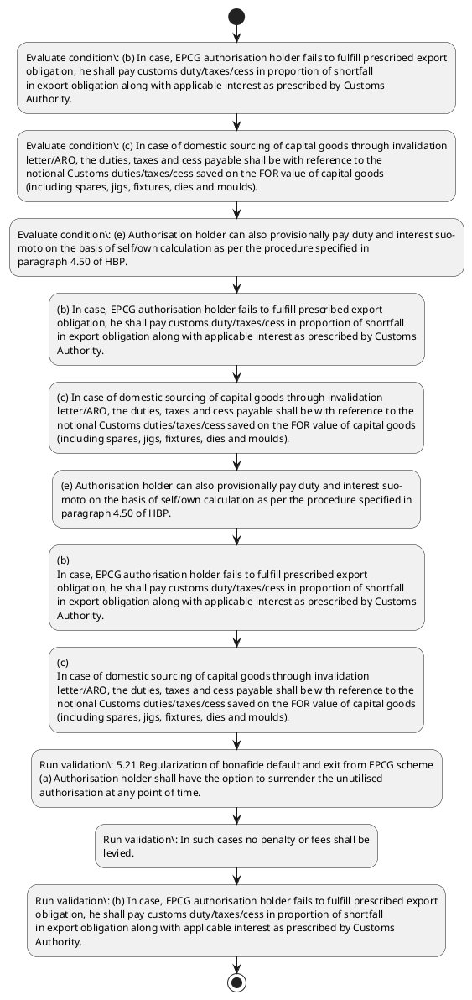

# Chapter 5 / Section 5.21: Regularization of bonafide default and exit from EPCG scheme

**Chapter Title:** Export Promotion Capital Goods (EPCG) Scheme

**Pages:** 13

**Purpose:** 5.21 Regularization of bonafide default and exit from EPCG scheme
(a) Authorisation holder shall have the option to surrender the unutilised
authorisation at any point of time.

**Purpose Thanglish:** Indha Regularization of bonafide default and exit from EPCG scheme section-la, 5.21 Regularization of bonafide default and exit from EPCG scheme
(a) Authorisation holder kandippa have the option to surrender the unutilised
authorisation at any point of time.

**Summary:** 5.21 Regularization of bonafide default and exit from EPCG scheme
(a) Authorisation holder shall have the option to surrender the unutilised
authorisation at any point of time. In such cases no penalty or fees shall be
levied. (b) In case, EPCG authorisation holder fails to fulfill prescribed export
obligation, he shall pay customs duty/taxes/cess in proportion of shortfall
in export obligation along with applicable interest as prescribed by Customs
Authority.

**Business Meaning:** Regularization of bonafide default and exit from EPCG scheme governs how DGFT business controls should be applied, validated, and enforced.

**Business Explanation:** Regularization of bonafide default and exit from EPCG scheme explains the operating rule set that DEKAI should enforce. Key control points include 5.21 Regularization of bonafide default and exit from EPCG scheme
(a) Authorisation holder shall have the option to surrender the unutilised
authorisation at any point of time. The section also drives actions such as (b) In case, EPCG authorisation holder fails to fulfill prescribed export
obligation, he shall pay customs duty/taxes/cess in proportion of shortfall
in export obligation along with applicable interest as prescribed by Customs
Authority..

**Business Explanation Thanglish:** Indha Regularization of bonafide default and exit from EPCG scheme section-la, Regularization of bonafide default and exit from EPCG scheme explains the operating rule set that DEKAI should enforce. Key control points include 5.21 Regularization of bonafide default and exit from EPCG scheme
(a) Authorisation holder kandippa have the option to surrender the unutilised
authorisation at any point of time. The section also drives actions such as (b) In case, EPCG authorisation holder fails to fulfill prescribed export
obligation, he kandippa pay customs duty/taxes/cess in proportion of shortfall
in export obligation along with applicable interest as prescribed by Customs
authority..

## Business Logic
- 5.21 Regularization of bonafide default and exit from EPCG scheme
(a) Authorisation holder shall have the option to surrender the unutilised
authorisation at any point of time.
- In such cases no penalty or fees shall be
levied.
- (b) In case, EPCG authorisation holder fails to fulfill prescribed export
obligation, he shall pay customs duty/taxes/cess in proportion of shortfall
in export obligation along with applicable interest as prescribed by Customs
Authority.
- (c) In case of domestic sourcing of capital goods through invalidation
letter/ARO, the duties, taxes and cess payable shall be with reference to the
notional Customs duties/taxes/cess saved on the FOR value of capital goods
(including spares, jigs, fixtures, dies and moulds).
- 5.21 Regularization of bonafide default and exit from EPCG scheme
(a)
Authorisation holder shall have the option to surrender the unutilised
authorisation at any point of time.
- (b)
In case, EPCG authorisation holder fails to fulfill prescribed export
obligation, he shall pay customs duty/taxes/cess in proportion of shortfall
in export obligation along with applicable interest as prescribed by Customs
Authority.
- (c)
In case of domestic sourcing of capital goods through invalidation
letter/ARO, the duties, taxes and cess payable shall be with reference to the
notional Customs duties/taxes/cess saved on the FOR value of capital goods
(including spares, jigs, fixtures, dies and moulds).

## Business Rules
- rule_id=CH5-SEC5_21-R001, rule_description=5.21 Regularization of bonafide default and exit from EPCG scheme
(a) Authorisation holder shall have the option to surrender the unutilised
authorisation at any point of time., trigger=Regularization of bonafide default and exit from EPCG scheme, condition=(b) In case, EPCG authorisation holder fails to fulfill prescribed export
obligation, he shall pay customs duty/taxes/cess in proportion of shortfall
in export obligation along with applicable interest as prescribed by Customs
Authority., validation=5.21 Regularization of bonafide default and exit from EPCG scheme
(a) Authorisation holder shall have the option to surrender the unutilised
authorisation at any point of time., action=(b) In case, EPCG authorisation holder fails to fulfill prescribed export
obligation, he shall pay customs duty/taxes/cess in proportion of shortfall
in export obligation along with applicable interest as prescribed by Customs
Authority., exception=No explicit exception found in uploaded documents., output=DEKAI should produce a compliance decision for 5.21 - Regularization of bonafide default and exit from EPCG scheme.
- rule_id=CH5-SEC5_21-R002, rule_description=In such cases no penalty or fees shall be
levied., trigger=Regularization of bonafide default and exit from EPCG scheme, condition=(c) In case of domestic sourcing of capital goods through invalidation
letter/ARO, the duties, taxes and cess payable shall be with reference to the
notional Customs duties/taxes/cess saved on the FOR value of capital goods
(including spares, jigs, fixtures, dies and moulds)., validation=In such cases no penalty or fees shall be
levied., action=(c) In case of domestic sourcing of capital goods through invalidation
letter/ARO, the duties, taxes and cess payable shall be with reference to the
notional Customs duties/taxes/cess saved on the FOR value of capital goods
(including spares, jigs, fixtures, dies and moulds)., exception=No explicit exception found in uploaded documents., output=DEKAI should produce a compliance decision for 5.21 - Regularization of bonafide default and exit from EPCG scheme.
- rule_id=CH5-SEC5_21-R003, rule_description=(b) In case, EPCG authorisation holder fails to fulfill prescribed export
obligation, he shall pay customs duty/taxes/cess in proportion of shortfall
in export obligation along with applicable interest as prescribed by Customs
Authority., trigger=Regularization of bonafide default and exit from EPCG scheme, condition=(e) Authorisation holder can also provisionally pay duty and interest suo-
moto on the basis of self/own calculation as per the procedure specified in
paragraph 4.50 of HBP., validation=(b) In case, EPCG authorisation holder fails to fulfill prescribed export
obligation, he shall pay customs duty/taxes/cess in proportion of shortfall
in export obligation along with applicable interest as prescribed by Customs
Authority., action=(e) Authorisation holder can also provisionally pay duty and interest suo-
moto on the basis of self/own calculation as per the procedure specified in
paragraph 4.50 of HBP., exception=No explicit exception found in uploaded documents., output=DEKAI should produce a compliance decision for 5.21 - Regularization of bonafide default and exit from EPCG scheme.
- rule_id=CH5-SEC5_21-R004, rule_description=(c) In case of domestic sourcing of capital goods through invalidation
letter/ARO, the duties, taxes and cess payable shall be with reference to the
notional Customs duties/taxes/cess saved on the FOR value of capital goods
(including spares, jigs, fixtures, dies and moulds)., trigger=Regularization of bonafide default and exit from EPCG scheme, condition=(b)
In case, EPCG authorisation holder fails to fulfill prescribed export
obligation, he shall pay customs duty/taxes/cess in proportion of shortfall
in export obligation along with applicable interest as prescribed by Customs
Authority., validation=(c) In case of domestic sourcing of capital goods through invalidation
letter/ARO, the duties, taxes and cess payable shall be with reference to the
notional Customs duties/taxes/cess saved on the FOR value of capital goods
(including spares, jigs, fixtures, dies and moulds)., action=(b)
In case, EPCG authorisation holder fails to fulfill prescribed export
obligation, he shall pay customs duty/taxes/cess in proportion of shortfall
in export obligation along with applicable interest as prescribed by Customs
Authority., exception=No explicit exception found in uploaded documents., output=DEKAI should produce a compliance decision for 5.21 - Regularization of bonafide default and exit from EPCG scheme.
- rule_id=CH5-SEC5_21-R005, rule_description=5.21 Regularization of bonafide default and exit from EPCG scheme
(a)
Authorisation holder shall have the option to surrender the unutilised
authorisation at any point of time., trigger=Regularization of bonafide default and exit from EPCG scheme, condition=(c)
In case of domestic sourcing of capital goods through invalidation
letter/ARO, the duties, taxes and cess payable shall be with reference to the
notional Customs duties/taxes/cess saved on the FOR value of capital goods
(including spares, jigs, fixtures, dies and moulds)., validation=5.21 Regularization of bonafide default and exit from EPCG scheme
(a)
Authorisation holder shall have the option to surrender the unutilised
authorisation at any point of time., action=(c)
In case of domestic sourcing of capital goods through invalidation
letter/ARO, the duties, taxes and cess payable shall be with reference to the
notional Customs duties/taxes/cess saved on the FOR value of capital goods
(including spares, jigs, fixtures, dies and moulds)., exception=No explicit exception found in uploaded documents., output=DEKAI should produce a compliance decision for 5.21 - Regularization of bonafide default and exit from EPCG scheme.
- rule_id=CH5-SEC5_21-R006, rule_description=(b)
In case, EPCG authorisation holder fails to fulfill prescribed export
obligation, he shall pay customs duty/taxes/cess in proportion of shortfall
in export obligation along with applicable interest as prescribed by Customs
Authority., trigger=Regularization of bonafide default and exit from EPCG scheme, condition=(c)
In case of domestic sourcing of capital goods through invalidation
letter/ARO, the duties, taxes and cess payable shall be with reference to the
notional Customs duties/taxes/cess saved on the FOR value of capital goods
(including spares, jigs, fixtures, dies and moulds)., validation=(b)
In case, EPCG authorisation holder fails to fulfill prescribed export
obligation, he shall pay customs duty/taxes/cess in proportion of shortfall
in export obligation along with applicable interest as prescribed by Customs
Authority., action=(c)
In case of domestic sourcing of capital goods through invalidation
letter/ARO, the duties, taxes and cess payable shall be with reference to the
notional Customs duties/taxes/cess saved on the FOR value of capital goods
(including spares, jigs, fixtures, dies and moulds)., exception=No explicit exception found in uploaded documents., output=DEKAI should produce a compliance decision for 5.21 - Regularization of bonafide default and exit from EPCG scheme.
- rule_id=CH5-SEC5_21-R007, rule_description=(c)
In case of domestic sourcing of capital goods through invalidation
letter/ARO, the duties, taxes and cess payable shall be with reference to the
notional Customs duties/taxes/cess saved on the FOR value of capital goods
(including spares, jigs, fixtures, dies and moulds)., trigger=Regularization of bonafide default and exit from EPCG scheme, condition=(c)
In case of domestic sourcing of capital goods through invalidation
letter/ARO, the duties, taxes and cess payable shall be with reference to the
notional Customs duties/taxes/cess saved on the FOR value of capital goods
(including spares, jigs, fixtures, dies and moulds)., validation=(c)
In case of domestic sourcing of capital goods through invalidation
letter/ARO, the duties, taxes and cess payable shall be with reference to the
notional Customs duties/taxes/cess saved on the FOR value of capital goods
(including spares, jigs, fixtures, dies and moulds)., action=(c)
In case of domestic sourcing of capital goods through invalidation
letter/ARO, the duties, taxes and cess payable shall be with reference to the
notional Customs duties/taxes/cess saved on the FOR value of capital goods
(including spares, jigs, fixtures, dies and moulds)., exception=No explicit exception found in uploaded documents., output=DEKAI should produce a compliance decision for 5.21 - Regularization of bonafide default and exit from EPCG scheme.

## Conditions
- (b) In case, EPCG authorisation holder fails to fulfill prescribed export
obligation, he shall pay customs duty/taxes/cess in proportion of shortfall
in export obligation along with applicable interest as prescribed by Customs
Authority.
- (c) In case of domestic sourcing of capital goods through invalidation
letter/ARO, the duties, taxes and cess payable shall be with reference to the
notional Customs duties/taxes/cess saved on the FOR value of capital goods
(including spares, jigs, fixtures, dies and moulds).
- (e) Authorisation holder can also provisionally pay duty and interest suo-
moto on the basis of self/own calculation as per the procedure specified in
paragraph 4.50 of HBP.
- (b)
In case, EPCG authorisation holder fails to fulfill prescribed export
obligation, he shall pay customs duty/taxes/cess in proportion of shortfall
in export obligation along with applicable interest as prescribed by Customs
Authority.
- (c)
In case of domestic sourcing of capital goods through invalidation
letter/ARO, the duties, taxes and cess payable shall be with reference to the
notional Customs duties/taxes/cess saved on the FOR value of capital goods
(including spares, jigs, fixtures, dies and moulds).

## Condition Logic
- id=5.5.21.1, if=(b) In case, EPCG authorisation holder fails to fulfill prescribed export
obligation, he shall pay customs duty/taxes/cess in proportion of shortfall
in export obligation along with applicable interest as prescribed by Customs
Authority., then=(b) In case, EPCG authorisation holder fails to fulfill prescribed export
obligation, he shall pay customs duty/taxes/cess in proportion of shortfall
in export obligation along with applicable interest as prescribed by Customs
Authority., source=(b) In case, EPCG authorisation holder fails to fulfill prescribed export
obligation, he shall pay customs duty/taxes/cess in proportion of shortfall
in export obligation along with applicable interest as prescribed by Customs
Authority.
- id=5.5.21.2, if=(c) In case of domestic sourcing of capital goods through invalidation
letter/ARO, the duties, taxes and cess payable shall be with reference to the
notional Customs duties/taxes/cess saved on the FOR value of capital goods
(including spares, jigs, fixtures, dies and moulds)., then=(b) In case, EPCG authorisation holder fails to fulfill prescribed export
obligation, he shall pay customs duty/taxes/cess in proportion of shortfall
in export obligation along with applicable interest as prescribed by Customs
Authority., source=(c) In case of domestic sourcing of capital goods through invalidation
letter/ARO, the duties, taxes and cess payable shall be with reference to the
notional Customs duties/taxes/cess saved on the FOR value of capital goods
(including spares, jigs, fixtures, dies and moulds).
- id=5.5.21.3, if=(e) Authorisation holder can also provisionally pay duty and interest suo-
moto on the basis of self/own calculation as per the procedure specified in
paragraph 4.50 of HBP., then=(b) In case, EPCG authorisation holder fails to fulfill prescribed export
obligation, he shall pay customs duty/taxes/cess in proportion of shortfall
in export obligation along with applicable interest as prescribed by Customs
Authority., source=(e) Authorisation holder can also provisionally pay duty and interest suo-
moto on the basis of self/own calculation as per the procedure specified in
paragraph 4.50 of HBP.
- id=5.5.21.4, if=(b)
In case, EPCG authorisation holder fails to fulfill prescribed export
obligation, he shall pay customs duty/taxes/cess in proportion of shortfall
in export obligation along with applicable interest as prescribed by Customs
Authority., then=(b) In case, EPCG authorisation holder fails to fulfill prescribed export
obligation, he shall pay customs duty/taxes/cess in proportion of shortfall
in export obligation along with applicable interest as prescribed by Customs
Authority., source=(b)
In case, EPCG authorisation holder fails to fulfill prescribed export
obligation, he shall pay customs duty/taxes/cess in proportion of shortfall
in export obligation along with applicable interest as prescribed by Customs
Authority.
- id=5.5.21.5, if=(c)
In case of domestic sourcing of capital goods through invalidation
letter/ARO, the duties, taxes and cess payable shall be with reference to the
notional Customs duties/taxes/cess saved on the FOR value of capital goods
(including spares, jigs, fixtures, dies and moulds)., then=(b) In case, EPCG authorisation holder fails to fulfill prescribed export
obligation, he shall pay customs duty/taxes/cess in proportion of shortfall
in export obligation along with applicable interest as prescribed by Customs
Authority., source=(c)
In case of domestic sourcing of capital goods through invalidation
letter/ARO, the duties, taxes and cess payable shall be with reference to the
notional Customs duties/taxes/cess saved on the FOR value of capital goods
(including spares, jigs, fixtures, dies and moulds).

## Validations
- 5.21 Regularization of bonafide default and exit from EPCG scheme
(a) Authorisation holder shall have the option to surrender the unutilised
authorisation at any point of time.
- In such cases no penalty or fees shall be
levied.
- (b) In case, EPCG authorisation holder fails to fulfill prescribed export
obligation, he shall pay customs duty/taxes/cess in proportion of shortfall
in export obligation along with applicable interest as prescribed by Customs
Authority.
- (c) In case of domestic sourcing of capital goods through invalidation
letter/ARO, the duties, taxes and cess payable shall be with reference to the
notional Customs duties/taxes/cess saved on the FOR value of capital goods
(including spares, jigs, fixtures, dies and moulds).
- 5.21 Regularization of bonafide default and exit from EPCG scheme
(a)
Authorisation holder shall have the option to surrender the unutilised
authorisation at any point of time.
- (b)
In case, EPCG authorisation holder fails to fulfill prescribed export
obligation, he shall pay customs duty/taxes/cess in proportion of shortfall
in export obligation along with applicable interest as prescribed by Customs
Authority.
- (c)
In case of domestic sourcing of capital goods through invalidation
letter/ARO, the duties, taxes and cess payable shall be with reference to the
notional Customs duties/taxes/cess saved on the FOR value of capital goods
(including spares, jigs, fixtures, dies and moulds).

## Exceptions
- None identified

## Dependencies
- 4.50

## Authorities
- customs

## Required Documents
- None identified

## Timelines
- None identified

## Actions
- (b) In case, EPCG authorisation holder fails to fulfill prescribed export
obligation, he shall pay customs duty/taxes/cess in proportion of shortfall
in export obligation along with applicable interest as prescribed by Customs
Authority.
- (c) In case of domestic sourcing of capital goods through invalidation
letter/ARO, the duties, taxes and cess payable shall be with reference to the
notional Customs duties/taxes/cess saved on the FOR value of capital goods
(including spares, jigs, fixtures, dies and moulds).
- (e) Authorisation holder can also provisionally pay duty and interest suo-
moto on the basis of self/own calculation as per the procedure specified in
paragraph 4.50 of HBP.
- (b)
In case, EPCG authorisation holder fails to fulfill prescribed export
obligation, he shall pay customs duty/taxes/cess in proportion of shortfall
in export obligation along with applicable interest as prescribed by Customs
Authority.
- (c)
In case of domestic sourcing of capital goods through invalidation
letter/ARO, the duties, taxes and cess payable shall be with reference to the
notional Customs duties/taxes/cess saved on the FOR value of capital goods
(including spares, jigs, fixtures, dies and moulds).

## Workflow
- Evaluate condition: (b) In case, EPCG authorisation holder fails to fulfill prescribed export
obligation, he shall pay customs duty/taxes/cess in proportion of shortfall
in export obligation along with applicable interest as prescribed by Customs
Authority.
- Evaluate condition: (c) In case of domestic sourcing of capital goods through invalidation
letter/ARO, the duties, taxes and cess payable shall be with reference to the
notional Customs duties/taxes/cess saved on the FOR value of capital goods
(including spares, jigs, fixtures, dies and moulds).
- Evaluate condition: (e) Authorisation holder can also provisionally pay duty and interest suo-
moto on the basis of self/own calculation as per the procedure specified in
paragraph 4.50 of HBP.
- (b) In case, EPCG authorisation holder fails to fulfill prescribed export
obligation, he shall pay customs duty/taxes/cess in proportion of shortfall
in export obligation along with applicable interest as prescribed by Customs
Authority.
- (c) In case of domestic sourcing of capital goods through invalidation
letter/ARO, the duties, taxes and cess payable shall be with reference to the
notional Customs duties/taxes/cess saved on the FOR value of capital goods
(including spares, jigs, fixtures, dies and moulds).
- (e) Authorisation holder can also provisionally pay duty and interest suo-
moto on the basis of self/own calculation as per the procedure specified in
paragraph 4.50 of HBP.
- (b)
In case, EPCG authorisation holder fails to fulfill prescribed export
obligation, he shall pay customs duty/taxes/cess in proportion of shortfall
in export obligation along with applicable interest as prescribed by Customs
Authority.
- (c)
In case of domestic sourcing of capital goods through invalidation
letter/ARO, the duties, taxes and cess payable shall be with reference to the
notional Customs duties/taxes/cess saved on the FOR value of capital goods
(including spares, jigs, fixtures, dies and moulds).
- Run validation: 5.21 Regularization of bonafide default and exit from EPCG scheme
(a) Authorisation holder shall have the option to surrender the unutilised
authorisation at any point of time.
- Run validation: In such cases no penalty or fees shall be
levied.
- Run validation: (b) In case, EPCG authorisation holder fails to fulfill prescribed export
obligation, he shall pay customs duty/taxes/cess in proportion of shortfall
in export obligation along with applicable interest as prescribed by Customs
Authority.

## Workflow ASCII
```text
Regularization of bonafide default and exit from EPCG scheme
Evaluate condition: (b) In case, EPCG authorisation holder fails to fulfill prescribed export
obligation, he shall pay customs duty/taxes/cess in proportion of shortfall
in export obligation along with applicable interest as prescribed by Customs
Authority.
   |
   v
Evaluate condition: (c) In case of domestic sourcing of capital goods through invalidation
letter/ARO, the duties, taxes and cess payable shall be with reference to the
notional Customs duties/taxes/cess saved on the FOR value of capital goods
(including spares, jigs, fixtures, dies and moulds).
   |
   v
Evaluate condition: (e) Authorisation holder can also provisionally pay duty and interest suo-
moto on the basis of self/own calculation as per the procedure specified in
paragraph 4.50 of HBP.
   |
   v
(b) In case, EPCG authorisation holder fails to fulfill prescribed export
obligation, he shall pay customs duty/taxes/cess in proportion of shortfall
in export obligation along with applicable interest as prescribed by Customs
Authority.
   |
   v
(c) In case of domestic sourcing of capital goods through invalidation
letter/ARO, the duties, taxes and cess payable shall be with reference to the
notional Customs duties/taxes/cess saved on the FOR value of capital goods
(including spares, jigs, fixtures, dies and moulds).
   |
   v
(e) Authorisation holder can also provisionally pay duty and interest suo-
moto on the basis of self/own calculation as per the procedure specified in
paragraph 4.50 of HBP.
   |
   v
(b)
In case, EPCG authorisation holder fails to fulfill prescribed export
obligation, he shall pay customs duty/taxes/cess in proportion of shortfall
in export obligation along with applicable interest as prescribed by Customs
Authority.
   |
   v
(c)
In case of domestic sourcing of capital goods through invalidation
letter/ARO, the duties, taxes and cess payable shall be with reference to the
notional Customs duties/taxes/cess saved on the FOR value of capital goods
(including spares, jigs, fixtures, dies and moulds).
   |
   v
Run validation: 5.21 Regularization of bonafide default and exit from EPCG scheme
(a) Authorisation holder shall have the option to surrender the unutilised
authorisation at any point of time.
   |
   v
Run validation: In such cases no penalty or fees shall be
levied.
   |
   v
Run validation: (b) In case, EPCG authorisation holder fails to fulfill prescribed export
obligation, he shall pay customs duty/taxes/cess in proportion of shortfall
in export obligation along with applicable interest as prescribed by Customs
Authority.
```

## Decision Tree
- IF (b) In case, EPCG authorisation holder fails to fulfill prescribed export
obligation, he shall pay customs duty/taxes/cess in proportion of shortfall
in export obligation along with applicable interest as prescribed by Customs
Authority. THEN (b) In case, EPCG authorisation holder fails to fulfill prescribed export
obligation, he shall pay customs duty/taxes/cess in proportion of shortfall
in export obligation along with applicable interest as prescribed by Customs
Authority.
- IF (c) In case of domestic sourcing of capital goods through invalidation
letter/ARO, the duties, taxes and cess payable shall be with reference to the
notional Customs duties/taxes/cess saved on the FOR value of capital goods
(including spares, jigs, fixtures, dies and moulds). THEN (b) In case, EPCG authorisation holder fails to fulfill prescribed export
obligation, he shall pay customs duty/taxes/cess in proportion of shortfall
in export obligation along with applicable interest as prescribed by Customs
Authority.
- IF (e) Authorisation holder can also provisionally pay duty and interest suo-
moto on the basis of self/own calculation as per the procedure specified in
paragraph 4.50 of HBP. THEN (b) In case, EPCG authorisation holder fails to fulfill prescribed export
obligation, he shall pay customs duty/taxes/cess in proportion of shortfall
in export obligation along with applicable interest as prescribed by Customs
Authority.
- IF (b)
In case, EPCG authorisation holder fails to fulfill prescribed export
obligation, he shall pay customs duty/taxes/cess in proportion of shortfall
in export obligation along with applicable interest as prescribed by Customs
Authority. THEN (b) In case, EPCG authorisation holder fails to fulfill prescribed export
obligation, he shall pay customs duty/taxes/cess in proportion of shortfall
in export obligation along with applicable interest as prescribed by Customs
Authority.
- IF (c)
In case of domestic sourcing of capital goods through invalidation
letter/ARO, the duties, taxes and cess payable shall be with reference to the
notional Customs duties/taxes/cess saved on the FOR value of capital goods
(including spares, jigs, fixtures, dies and moulds). THEN (b) In case, EPCG authorisation holder fails to fulfill prescribed export
obligation, he shall pay customs duty/taxes/cess in proportion of shortfall
in export obligation along with applicable interest as prescribed by Customs
Authority.

## Decision Tree ASCII
```text
Regularization of bonafide default and exit from EPCG scheme Decision
IF (b) In case, EPCG authorisation holder fails to fulfill prescribed export
obligation, he shall pay customs duty/taxes/cess in proportion of shortfall
in export obligation along with applicable interest as prescribed by Customs
Authority. THEN (b) In case, EPCG authorisation holder fails to fulfill prescribed export
obligation, he shall pay customs duty/taxes/cess in proportion of shortfall
in export obligation along with applicable interest as prescribed by Customs
Authority.
   |
   v
IF (c) In case of domestic sourcing of capital goods through invalidation
letter/ARO, the duties, taxes and cess payable shall be with reference to the
notional Customs duties/taxes/cess saved on the FOR value of capital goods
(including spares, jigs, fixtures, dies and moulds). THEN (b) In case, EPCG authorisation holder fails to fulfill prescribed export
obligation, he shall pay customs duty/taxes/cess in proportion of shortfall
in export obligation along with applicable interest as prescribed by Customs
Authority.
   |
   v
IF (e) Authorisation holder can also provisionally pay duty and interest suo-
moto on the basis of self/own calculation as per the procedure specified in
paragraph 4.50 of HBP. THEN (b) In case, EPCG authorisation holder fails to fulfill prescribed export
obligation, he shall pay customs duty/taxes/cess in proportion of shortfall
in export obligation along with applicable interest as prescribed by Customs
Authority.
   |
   v
IF (b)
In case, EPCG authorisation holder fails to fulfill prescribed export
obligation, he shall pay customs duty/taxes/cess in proportion of shortfall
in export obligation along with applicable interest as prescribed by Customs
Authority. THEN (b) In case, EPCG authorisation holder fails to fulfill prescribed export
obligation, he shall pay customs duty/taxes/cess in proportion of shortfall
in export obligation along with applicable interest as prescribed by Customs
Authority.
   |
   v
IF (c)
In case of domestic sourcing of capital goods through invalidation
letter/ARO, the duties, taxes and cess payable shall be with reference to the
notional Customs duties/taxes/cess saved on the FOR value of capital goods
(including spares, jigs, fixtures, dies and moulds). THEN (b) In case, EPCG authorisation holder fails to fulfill prescribed export
obligation, he shall pay customs duty/taxes/cess in proportion of shortfall
in export obligation along with applicable interest as prescribed by Customs
Authority.
```

## Examples
- User asks to process Regularization of bonafide default and exit from EPCG scheme; the platform checks conditions, validations, and documents before action.

**Real-world Example:** Example: an importer or exporter invokes Regularization of bonafide default and exit from EPCG scheme, submits the prescribed DGFT records, and DEKAI uses the extracted rules to (b) in case, epcg authorisation holder fails to fulfill prescribed export
obligation, he shall pay customs duty/taxes/cess in proportion of shortfall
in export obligation along with applicable interest as prescribed by customs
authority..

**Real-world Example Thanglish:** Indha Regularization of bonafide default and exit from EPCG scheme section-la, Example: an importer or exporter invokes Regularization of bonafide default and exit from EPCG scheme, submits the prescribed DGFT records, and DEKAI uses the extracted rules to (b) in case, epcg authorisation holder fails to fulfill prescribed export
obligation, he kandippa pay customs duty/taxes/cess in proportion of shortfall
in export obligation along with applicable interest as prescribed by customs
authority..

## AI Rules
- IF detected context matches section rule THEN enforce: 5.21 Regularization of bonafide default and exit from EPCG scheme
(a) Authorisation holder shall have the option to surrender the unutilised
authorisation at any point of time.
- IF detected context matches section rule THEN enforce: In such cases no penalty or fees shall be
levied.
- IF detected context matches section rule THEN enforce: (b) In case, EPCG authorisation holder fails to fulfill prescribed export
obligation, he shall pay customs duty/taxes/cess in proportion of shortfall
in export obligation along with applicable interest as prescribed by Customs
Authority.
- IF detected context matches section rule THEN enforce: (c) In case of domestic sourcing of capital goods through invalidation
letter/ARO, the duties, taxes and cess payable shall be with reference to the
notional Customs duties/taxes/cess saved on the FOR value of capital goods
(including spares, jigs, fixtures, dies and moulds).
- IF detected context matches section rule THEN enforce: 5.21 Regularization of bonafide default and exit from EPCG scheme
(a)
Authorisation holder shall have the option to surrender the unutilised
authorisation at any point of time.
- IF detected context matches section rule THEN enforce: (b)
In case, EPCG authorisation holder fails to fulfill prescribed export
obligation, he shall pay customs duty/taxes/cess in proportion of shortfall
in export obligation along with applicable interest as prescribed by Customs
Authority.
- IF validations pass THEN recommend action: (b) In case, EPCG authorisation holder fails to fulfill prescribed export
obligation, he shall pay customs duty/taxes/cess in proportion of shortfall
in export obligation along with applicable interest as prescribed by Customs
Authority.

## Database Fields
- name=section_code, type=string, required=True, source=parsed_section_heading
- name=section_title, type=string, required=True, source=parsed_section_heading
- name=and_flag, type=boolean, required=False, source=keyword:and
- name=the_flag, type=boolean, required=False, source=keyword:the
- name=any_flag, type=boolean, required=False, source=keyword:any
- name=pay_flag, type=boolean, required=False, source=keyword:pay
- name=can_flag, type=boolean, required=False, source=keyword:can
- name=his_flag, type=boolean, required=False, source=keyword:his
- name=for_flag, type=boolean, required=False, source=keyword:FOR
- name=suo_flag, type=boolean, required=False, source=keyword:suo

## API Requirements
- method=GET, path=/api/dgft/sections/5.21, purpose=Retrieve knowledge payload for section 5.21, query_params=['include=workflow,decision_tree,validations'], response_fields=['section', 'title', 'summary', 'conditions', 'validations', 'exceptions', 'workflow', 'decision_tree']
- method=POST, path=/api/dgft/Regularization-of-bonafide-default-and-exit-from-EPCG-scheme/validate, purpose=Validate inputs and documents for Regularization of bonafide default and exit from EPCG scheme, request_fields=['section_code', 'section_title'], response_fields=['status', 'errors', 'warnings', 'next_actions']
- method=POST, path=/api/dgft/Regularization-of-bonafide-default-and-exit-from-EPCG-scheme/execute, purpose=Trigger business action for (b) In case, EPCG authorisation holder fails to fulfill prescribed export
obligation, he shall pay customs duty/taxes/cess in proportion of shortfall
in export obligation along with applicable interest as prescribed by Customs
Authority., request_fields=['section_code', 'section_title'], response_fields=['reference_id', 'status', 'authority', 'timeline']

## UI Screens
- screen_id=Regularization_of_bonafide_default_and_exit_from_EPCG_scheme_overview, name=Regularization of bonafide default and exit from EPCG scheme Overview, purpose=Show section summary, authority, timeline, and eligibility cues., widgets=['summary_card', 'conditions_table', 'authority_badges', 'timeline_panel']
- screen_id=Regularization_of_bonafide_default_and_exit_from_EPCG_scheme_submission, name=Regularization of bonafide default and exit from EPCG scheme Submission, purpose=Capture applicant data and supporting documents., widgets=['dynamic_form', 'document_uploader', 'validation_panel', 'next_action_footer'], fields=['section_code', 'section_title', 'and_flag', 'the_flag', 'any_flag', 'pay_flag', 'can_flag', 'his_flag']

## Error Messages
- Validation failed because the section requirements were not fully met.

## FAQ
- question_en=What is the purpose of section 5.21?, answer_en=Regularization of bonafide default and exit from EPCG scheme explains the operating rule set that DEKAI should enforce. Key control points include 5.21 Regularization of bonafide default and exit from EPCG scheme
(a) Authorisation holder shall have the option to surrender the unutilised
authorisation at any point of time. The section also drives actions such as (b) In case, EPCG authorisation holder fails to fulfill prescribed export
obligation, he shall pay customs duty/taxes/cess in proportion of shortfall
in export obligation along with applicable interest as prescribed by Customs
Authority.., question_thanglish=Indha Regularization of bonafide default and exit from EPCG scheme section-la, What is the purpose of section 5.21?, answer_thanglish=Indha Regularization of bonafide default and exit from EPCG scheme section-la, Regularization of bonafide default and exit from EPCG scheme explains the operating rule set that DEKAI should enforce. Key control points include 5.21 Regularization of bonafide default and exit from EPCG scheme
(a) Authorisation holder kandippa have the option to surrender the unutilised
authorisation at any point of time. The section also drives actions such as (b) In case, EPCG authorisation holder fails to fulfill prescribed export
obligation, he kandippa pay customs duty/taxes/cess in proportion of shortfall
in export obligation along with applicable interest as prescribed by Customs
authority..
- question_en=What documents are required under Regularization of bonafide default and exit from EPCG scheme?, answer_en=Not explicitly covered in uploaded documents., question_thanglish=Indha Regularization of bonafide default and exit from EPCG scheme section-la, What documents are required under Regularization of bonafide default and exit from EPCG scheme?, answer_thanglish=Indha Regularization of bonafide default and exit from EPCG scheme section-la, Not explicitly covered in uploaded documents.
- question_en=Which authority handles Regularization of bonafide default and exit from EPCG scheme?, answer_en=customs, question_thanglish=Indha Regularization of bonafide default and exit from EPCG scheme section-la, Which authority handles Regularization of bonafide default and exit from EPCG scheme?, answer_thanglish=Indha Regularization of bonafide default and exit from EPCG scheme section-la, customs

## Questions Users May Ask
- What does Regularization of bonafide default and exit from EPCG scheme require?
- Which documents are needed for Regularization of bonafide default and exit from EPCG scheme?
- How does DEKAI validate Regularization of bonafide default and exit from EPCG scheme requests?
- What action should be taken for Regularization of bonafide default and exit from EPCG scheme?

## Expected AI Answers
- Regularization of bonafide default and exit from EPCG scheme requires the platform to interpret the section text, apply the extracted business rules, and present the correct next action.
- Required documents are inferred from the section text: no explicit documents were detected.
- DEKAI validates Regularization of bonafide default and exit from EPCG scheme by checking conditions, required documents, authority references, and exception clauses before recommending an outcome.
- The primary extracted action is: (b) In case, EPCG authorisation holder fails to fulfill prescribed export
obligation, he shall pay customs duty/taxes/cess in proportion of shortfall
in export obligation along with applicable interest as prescribed by Customs
Authority.

## AI Q&A Examples
- question_en=User asks: How do I comply with Regularization of bonafide default and exit from EPCG scheme?, answer_en=AI answers: DEKAI should evaluate section 5.21, apply the extracted rules, and guide the user through Evaluate condition: (b) In case, EPCG authorisation holder fails to fulfill prescribed export
obligation, he shall pay customs duty/taxes/cess in proportion of shortfall
in export obligation along with applicable interest as prescribed by Customs
Authority.., question_thanglish=Indha Regularization of bonafide default and exit from EPCG scheme section-la, User asks: How do I comply with Regularization of bonafide default and exit from EPCG scheme?, answer_thanglish=Indha Regularization of bonafide default and exit from EPCG scheme section-la, AI answers: DEKAI should evaluate section 5.21, apply the extracted rules, and guide the user through Evaluate condition: (b) In case, EPCG authorisation holder fails to fulfill prescribed export
obligation, he kandippa pay customs duty/taxes/cess in proportion of shortfall
in export obligation along with applicable interest as prescribed by Customs
authority..
- question_en=User asks: Which validations apply to Regularization of bonafide default and exit from EPCG scheme?, answer_en=AI answers: Applicable validations are 5.21 Regularization of bonafide default and exit from EPCG scheme
(a) Authorisation holder shall have the option to surrender the unutilised
authorisation at any point of time., In such cases no penalty or fees shall be
levied., (b) In case, EPCG authorisation holder fails to fulfill prescribed export
obligation, he shall pay customs duty/taxes/cess in proportion of shortfall
in export obligation along with applicable interest as prescribed by Customs
Authority., question_thanglish=Indha Regularization of bonafide default and exit from EPCG scheme section-la, User asks: Which validations apply to Regularization of bonafide default and exit from EPCG scheme?, answer_thanglish=Indha Regularization of bonafide default and exit from EPCG scheme section-la, AI answers: Applicable validations are 5.21 Regularization of bonafide default and exit from EPCG scheme
(a) Authorisation holder kandippa have the option to surrender the unutilised
authorisation at any point of time., In such cases no penalty or fees kandippa be
levied., (b) In case, EPCG authorisation holder fails to fulfill prescribed export
obligation, he kandippa pay customs duty/taxes/cess in proportion of shortfall
in export obligation along with applicable interest as prescribed by Customs
authority.

## DEKAI AI Implementation Notes
- Capture chapter 5, section 5.21, title, and page references as immutable knowledge metadata.
- Bind validations for Regularization of bonafide default and exit from EPCG scheme into a rule engine keyed by the rule IDs extracted for this section.
- Route escalations or approvals to: customs.

## DEKAI AI Implementation Notes Thanglish
- Indha Regularization of bonafide default and exit from EPCG scheme section-la, Capture chapter 5, section 5.21, title, and page references as immutable knowledge metadata.
- Indha Regularization of bonafide default and exit from EPCG scheme section-la, Bind validations for Regularization of bonafide default and exit from EPCG scheme into a rule engine keyed by the rule IDs extracted for this section.
- Indha Regularization of bonafide default and exit from EPCG scheme section-la, Route escalations or approvals to: customs.

## AI Metadata
- Keywords: and, the, any, pay, can, his, FOR, suo, per, HBP, exit, from, EPCG, have, time, such, fees, case, with, also
- Search Keywords: and, the, any, pay, can, his, FOR, suo, per, HBP, exit, from, EPCG, have, time, such, fees, case, with, also
- Intent: Support Regularization of bonafide default and exit from EPCG scheme processing and compliance validation.
- Tags: 5.21, Regularization of bonafide default and exit from EPCG scheme, business-rule, dgft
- Related Sections: 
- Related Chapters: 
- Related Rules: 5.21 Regularization of bonafide default and exit from EPCG scheme
(a) Authorisation holder shall have the option to surrender the unutilised
authorisation at any point of time., In such cases no penalty or fees shall be
levied., (b) In case, EPCG authorisation holder fails to fulfill prescribed export
obligation, he shall pay customs duty/taxes/cess in proportion of shortfall
in export obligation along with applicable interest as prescribed by Customs
Authority., (c) In case of domestic sourcing of capital goods through invalidation
letter/ARO, the duties, taxes and cess payable shall be with reference to the
notional Customs duties/taxes/cess saved on the FOR value of capital goods
(including spares, jigs, fixtures, dies and moulds)., 5.21 Regularization of bonafide default and exit from EPCG scheme
(a)
Authorisation holder shall have the option to surrender the unutilised
authorisation at any point of time.

## Mermaid

```mermaid
flowchart TD
    S1["Evaluate condition: (b) In case, EPCG authorisation holder fails to fulfill prescribed export
obligation, he shall pay customs duty/taxes/cess in proportion of shortfall
in export obligation along with applicable interest as prescribed by Customs
Authority."]
    S2["Evaluate condition: (c) In case of domestic sourcing of capital goods through invalidation
letter/ARO, the duties, taxes and cess payable shall be with reference to the
notional Customs duties/taxes/cess saved on the FOR value of capital goods
(including spares, jigs, fixtures, dies and moulds)."]
    S1 --> S2
    S3["Evaluate condition: (e) Authorisation holder can also provisionally pay duty and interest suo-
moto on the basis of self/own calculation as per the procedure specified in
paragraph 4.50 of HBP."]
    S2 --> S3
    S4["(b) In case, EPCG authorisation holder fails to fulfill prescribed export
obligation, he shall pay customs duty/taxes/cess in proportion of shortfall
in export obligation along with applicable interest as prescribed by Customs
Authority."]
    S3 --> S4
    S5["(c) In case of domestic sourcing of capital goods through invalidation
letter/ARO, the duties, taxes and cess payable shall be with reference to the
notional Customs duties/taxes/cess saved on the FOR value of capital goods
(including spares, jigs, fixtures, dies and moulds)."]
    S4 --> S5
    S6["(e) Authorisation holder can also provisionally pay duty and interest suo-
moto on the basis of self/own calculation as per the procedure specified in
paragraph 4.50 of HBP."]
    S5 --> S6
    S7["(b)
In case, EPCG authorisation holder fails to fulfill prescribed export
obligation, he shall pay customs duty/taxes/cess in proportion of shortfall
in export obligation along with applicable interest as prescribed by Customs
Authority."]
    S6 --> S7
    S8["(c)
In case of domestic sourcing of capital goods through invalidation
letter/ARO, the duties, taxes and cess payable shall be with reference to the
notional Customs duties/taxes/cess saved on the FOR value of capital goods
(including spares, jigs, fixtures, dies and moulds)."]
    S7 --> S8
    S9["Run validation: 5.21 Regularization of bonafide default and exit from EPCG scheme
(a) Authorisation holder shall have the option to surrender the unutilised
authorisation at any point of time."]
    S8 --> S9
    S10["Run validation: In such cases no penalty or fees shall be
levied."]
    S9 --> S10
    S11["Run validation: (b) In case, EPCG authorisation holder fails to fulfill prescribed export
obligation, he shall pay customs duty/taxes/cess in proportion of shortfall
in export obligation along with applicable interest as prescribed by Customs
Authority."]
    S10 --> S11
```


## PlantUML

