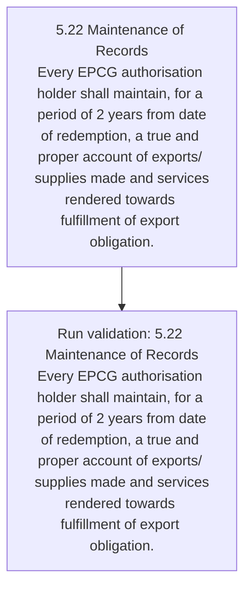
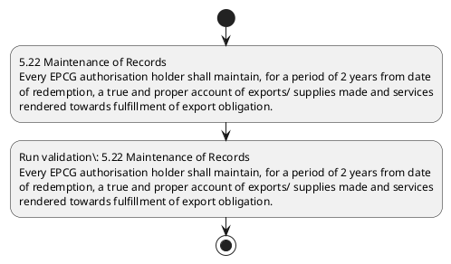

# Chapter 5 / Section 5.22: Maintenance of Records

**Chapter Title:** Export Promotion Capital Goods (EPCG) Scheme

**Pages:** 13

**Purpose:** 5.22 Maintenance of Records
Every EPCG authorisation holder shall maintain, for a period of 2 years from date
of redemption, a true and proper account of exports/ supplies made and services
rendered towards fulfillment of export obligation.

**Purpose Thanglish:** Indha Maintenance of Records section-la, 5.22 Maintenance of Records
Every EPCG authorisation holder kandippa maintain, for a period of 2 years from date
of redemption, a true and proper account of exports/ supplies made and services
rendered towards fulfillment of export obligation.

**Summary:** 5.22 Maintenance of Records
Every EPCG authorisation holder shall maintain, for a period of 2 years from date
of redemption, a true and proper account of exports/ supplies made and services
rendered towards fulfillment of export obligation.

**Business Meaning:** Maintenance of Records governs how DGFT business controls should be applied, validated, and enforced.

**Business Explanation:** Maintenance of Records explains the operating rule set that DEKAI should enforce. Key control points include 5.22 Maintenance of Records
Every EPCG authorisation holder shall maintain, for a period of 2 years from date
of redemption, a true and proper account of exports/ supplies made and services
rendered towards fulfillment of export obligation. The section also drives actions such as 5.22 Maintenance of Records
Every EPCG authorisation holder shall maintain, for a period of 2 years from date
of redemption, a true and proper account of exports/ supplies made and services
rendered towards fulfillment of export obligation..

**Business Explanation Thanglish:** Indha Maintenance of Records section-la, Maintenance of Records explains the operating rule set that DEKAI should enforce. Key control points include 5.22 Maintenance of Records
Every EPCG authorisation holder kandippa maintain, for a period of 2 years from date
of redemption, a true and proper account of exports/ supplies made and services
rendered towards fulfillment of export obligation. The section also drives actions such as 5.22 Maintenance of Records
Every EPCG authorisation holder kandippa maintain, for a period of 2 years from date
of redemption, a true and proper account of exports/ supplies made and services
rendered towards fulfillment of export obligation..

## Business Logic
- 5.22 Maintenance of Records
Every EPCG authorisation holder shall maintain, for a period of 2 years from date
of redemption, a true and proper account of exports/ supplies made and services
rendered towards fulfillment of export obligation.

## Business Rules
- rule_id=CH5-SEC5_22-R001, rule_description=5.22 Maintenance of Records
Every EPCG authorisation holder shall maintain, for a period of 2 years from date
of redemption, a true and proper account of exports/ supplies made and services
rendered towards fulfillment of export obligation., trigger=Maintenance of Records, condition=Section 5.22 is applicable, validation=5.22 Maintenance of Records
Every EPCG authorisation holder shall maintain, for a period of 2 years from date
of redemption, a true and proper account of exports/ supplies made and services
rendered towards fulfillment of export obligation., action=5.22 Maintenance of Records
Every EPCG authorisation holder shall maintain, for a period of 2 years from date
of redemption, a true and proper account of exports/ supplies made and services
rendered towards fulfillment of export obligation., exception=No explicit exception found in uploaded documents., output=DEKAI should produce a compliance decision for 5.22 - Maintenance of Records.

## Conditions
- None identified

## Condition Logic
- id=5.5.22.1, if=Section 5.22 is applicable, then=5.22 Maintenance of Records
Every EPCG authorisation holder shall maintain, for a period of 2 years from date
of redemption, a true and proper account of exports/ supplies made and services
rendered towards fulfillment of export obligation., source=Derived from uploaded documents

## Validations
- 5.22 Maintenance of Records
Every EPCG authorisation holder shall maintain, for a period of 2 years from date
of redemption, a true and proper account of exports/ supplies made and services
rendered towards fulfillment of export obligation.

## Exceptions
- None identified

## Dependencies
- None identified

## Authorities
- None identified

## Required Documents
- None identified

## Timelines
- 5.22 Maintenance of Records
Every EPCG authorisation holder shall maintain, for a period of 2 years from date
of redemption, a true and proper account of exports/ supplies made and services
rendered towards fulfillment of export obligation.

## Actions
- 5.22 Maintenance of Records
Every EPCG authorisation holder shall maintain, for a period of 2 years from date
of redemption, a true and proper account of exports/ supplies made and services
rendered towards fulfillment of export obligation.

## Workflow
- 5.22 Maintenance of Records
Every EPCG authorisation holder shall maintain, for a period of 2 years from date
of redemption, a true and proper account of exports/ supplies made and services
rendered towards fulfillment of export obligation.
- Run validation: 5.22 Maintenance of Records
Every EPCG authorisation holder shall maintain, for a period of 2 years from date
of redemption, a true and proper account of exports/ supplies made and services
rendered towards fulfillment of export obligation.

## Workflow ASCII
```text
Maintenance of Records
5.22 Maintenance of Records
Every EPCG authorisation holder shall maintain, for a period of 2 years from date
of redemption, a true and proper account of exports/ supplies made and services
rendered towards fulfillment of export obligation.
   |
   v
Run validation: 5.22 Maintenance of Records
Every EPCG authorisation holder shall maintain, for a period of 2 years from date
of redemption, a true and proper account of exports/ supplies made and services
rendered towards fulfillment of export obligation.
```

## Decision Tree
- IF section 5.22 applies THEN 5.22 Maintenance of Records
Every EPCG authorisation holder shall maintain, for a period of 2 years from date
of redemption, a true and proper account of exports/ supplies made and services
rendered towards fulfillment of export obligation.

## Decision Tree ASCII
```text
Maintenance of Records Decision
IF section 5.22 applies THEN 5.22 Maintenance of Records
Every EPCG authorisation holder shall maintain, for a period of 2 years from date
of redemption, a true and proper account of exports/ supplies made and services
rendered towards fulfillment of export obligation.
```

## Examples
- User asks to process Maintenance of Records; the platform checks conditions, validations, and documents before action.

**Real-world Example:** Example: an importer or exporter invokes Maintenance of Records, submits the prescribed DGFT records, and DEKAI uses the extracted rules to 5.22 maintenance of records
every epcg authorisation holder shall maintain, for a period of 2 years from date
of redemption, a true and proper account of exports/ supplies made and services
rendered towards fulfillment of export obligation..

**Real-world Example Thanglish:** Indha Maintenance of Records section-la, Example: an importer or exporter invokes Maintenance of Records, submits the prescribed DGFT records, and DEKAI uses the extracted rules to 5.22 maintenance of records
every epcg authorisation holder kandippa maintain, for a period of 2 years from date
of redemption, a true and proper account of exports/ supplies made and services
rendered towards fulfillment of export obligation..

## AI Rules
- IF detected context matches section rule THEN enforce: 5.22 Maintenance of Records
Every EPCG authorisation holder shall maintain, for a period of 2 years from date
of redemption, a true and proper account of exports/ supplies made and services
rendered towards fulfillment of export obligation.
- IF validations pass THEN recommend action: 5.22 Maintenance of Records
Every EPCG authorisation holder shall maintain, for a period of 2 years from date
of redemption, a true and proper account of exports/ supplies made and services
rendered towards fulfillment of export obligation.

## Database Fields
- name=section_code, type=string, required=True, source=parsed_section_heading
- name=section_title, type=string, required=True, source=parsed_section_heading
- name=for_flag, type=boolean, required=False, source=keyword:for
- name=and_flag, type=boolean, required=False, source=keyword:and
- name=epcg_flag, type=boolean, required=False, source=keyword:EPCG
- name=from_flag, type=boolean, required=False, source=keyword:from
- name=date_flag, type=boolean, required=False, source=keyword:date
- name=true_flag, type=boolean, required=False, source=keyword:true
- name=made_flag, type=boolean, required=False, source=keyword:made
- name=every_flag, type=boolean, required=False, source=keyword:Every

## API Requirements
- method=GET, path=/api/dgft/sections/5.22, purpose=Retrieve knowledge payload for section 5.22, query_params=['include=workflow,decision_tree,validations'], response_fields=['section', 'title', 'summary', 'conditions', 'validations', 'exceptions', 'workflow', 'decision_tree']
- method=POST, path=/api/dgft/Maintenance-of-Records/validate, purpose=Validate inputs and documents for Maintenance of Records, request_fields=['section_code', 'section_title'], response_fields=['status', 'errors', 'warnings', 'next_actions']
- method=POST, path=/api/dgft/Maintenance-of-Records/execute, purpose=Trigger business action for 5.22 Maintenance of Records
Every EPCG authorisation holder shall maintain, for a period of 2 years from date
of redemption, a true and proper account of exports/ supplies made and services
rendered towards fulfillment of export obligation., request_fields=['section_code', 'section_title'], response_fields=['reference_id', 'status', 'authority', 'timeline']

## UI Screens
- screen_id=Maintenance_of_Records_overview, name=Maintenance of Records Overview, purpose=Show section summary, authority, timeline, and eligibility cues., widgets=['summary_card', 'conditions_table', 'authority_badges', 'timeline_panel']
- screen_id=Maintenance_of_Records_submission, name=Maintenance of Records Submission, purpose=Capture applicant data and supporting documents., widgets=['dynamic_form', 'document_uploader', 'validation_panel', 'next_action_footer'], fields=['section_code', 'section_title', 'for_flag', 'and_flag', 'epcg_flag', 'from_flag', 'date_flag', 'true_flag']

## Error Messages
- Validation failed because the section requirements were not fully met.

## FAQ
- question_en=What is the purpose of section 5.22?, answer_en=Maintenance of Records explains the operating rule set that DEKAI should enforce. Key control points include 5.22 Maintenance of Records
Every EPCG authorisation holder shall maintain, for a period of 2 years from date
of redemption, a true and proper account of exports/ supplies made and services
rendered towards fulfillment of export obligation. The section also drives actions such as 5.22 Maintenance of Records
Every EPCG authorisation holder shall maintain, for a period of 2 years from date
of redemption, a true and proper account of exports/ supplies made and services
rendered towards fulfillment of export obligation.., question_thanglish=Indha Maintenance of Records section-la, What is the purpose of section 5.22?, answer_thanglish=Indha Maintenance of Records section-la, Maintenance of Records explains the operating rule set that DEKAI should enforce. Key control points include 5.22 Maintenance of Records
Every EPCG authorisation holder kandippa maintain, for a period of 2 years from date
of redemption, a true and proper account of exports/ supplies made and services
rendered towards fulfillment of export obligation. The section also drives actions such as 5.22 Maintenance of Records
Every EPCG authorisation holder kandippa maintain, for a period of 2 years from date
of redemption, a true and proper account of exports/ supplies made and services
rendered towards fulfillment of export obligation..
- question_en=What documents are required under Maintenance of Records?, answer_en=Not explicitly covered in uploaded documents., question_thanglish=Indha Maintenance of Records section-la, What documents are required under Maintenance of Records?, answer_thanglish=Indha Maintenance of Records section-la, Not explicitly covered in uploaded documents.
- question_en=Which authority handles Maintenance of Records?, answer_en=Not explicitly covered in uploaded documents., question_thanglish=Indha Maintenance of Records section-la, Which authority handles Maintenance of Records?, answer_thanglish=Indha Maintenance of Records section-la, Not explicitly covered in uploaded documents.

## Questions Users May Ask
- What does Maintenance of Records require?
- Which documents are needed for Maintenance of Records?
- How does DEKAI validate Maintenance of Records requests?
- What action should be taken for Maintenance of Records?

## Expected AI Answers
- Maintenance of Records requires the platform to interpret the section text, apply the extracted business rules, and present the correct next action.
- Required documents are inferred from the section text: no explicit documents were detected.
- DEKAI validates Maintenance of Records by checking conditions, required documents, authority references, and exception clauses before recommending an outcome.
- The primary extracted action is: 5.22 Maintenance of Records
Every EPCG authorisation holder shall maintain, for a period of 2 years from date
of redemption, a true and proper account of exports/ supplies made and services
rendered towards fulfillment of export obligation.

## AI Q&A Examples
- question_en=User asks: How do I comply with Maintenance of Records?, answer_en=AI answers: DEKAI should evaluate section 5.22, apply the extracted rules, and guide the user through 5.22 Maintenance of Records
Every EPCG authorisation holder shall maintain, for a period of 2 years from date
of redemption, a true and proper account of exports/ supplies made and services
rendered towards fulfillment of export obligation.., question_thanglish=Indha Maintenance of Records section-la, User asks: How do I comply with Maintenance of Records?, answer_thanglish=Indha Maintenance of Records section-la, AI answers: DEKAI should evaluate section 5.22, apply the extracted rules, and guide the user through 5.22 Maintenance of Records
Every EPCG authorisation holder kandippa maintain, for a period of 2 years from date
of redemption, a true and proper account of exports/ supplies made and services
rendered towards fulfillment of export obligation..
- question_en=User asks: Which validations apply to Maintenance of Records?, answer_en=AI answers: Applicable validations are 5.22 Maintenance of Records
Every EPCG authorisation holder shall maintain, for a period of 2 years from date
of redemption, a true and proper account of exports/ supplies made and services
rendered towards fulfillment of export obligation., question_thanglish=Indha Maintenance of Records section-la, User asks: Which validations apply to Maintenance of Records?, answer_thanglish=Indha Maintenance of Records section-la, AI answers: Applicable validations are 5.22 Maintenance of Records
Every EPCG authorisation holder kandippa maintain, for a period of 2 years from date
of redemption, a true and proper account of exports/ supplies made and services
rendered towards fulfillment of export obligation.

## DEKAI AI Implementation Notes
- Capture chapter 5, section 5.22, title, and page references as immutable knowledge metadata.
- Bind validations for Maintenance of Records into a rule engine keyed by the rule IDs extracted for this section.

## DEKAI AI Implementation Notes Thanglish
- Indha Maintenance of Records section-la, Capture chapter 5, section 5.22, title, and page references as immutable knowledge metadata.
- Indha Maintenance of Records section-la, Bind validations for Maintenance of Records into a rule engine keyed by the rule IDs extracted for this section.

## AI Metadata
- Keywords: for, and, EPCG, from, date, true, made, Every, shall, years, holder, period, proper, export, Records, account, exports, towards, maintain, supplies
- Search Keywords: for, and, EPCG, from, date, true, made, Every, shall, years, holder, period, proper, export, Records, account, exports, towards, maintain, supplies
- Intent: Support Maintenance of Records processing and compliance validation.
- Tags: 5.22, Maintenance of Records, business-rule, dgft
- Related Sections: 
- Related Chapters: 
- Related Rules: 5.22 Maintenance of Records
Every EPCG authorisation holder shall maintain, for a period of 2 years from date
of redemption, a true and proper account of exports/ supplies made and services
rendered towards fulfillment of export obligation.

## Mermaid


## PlantUML

