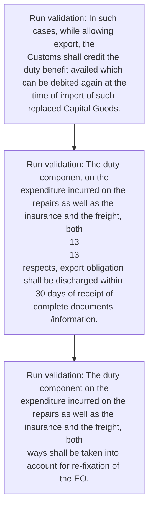
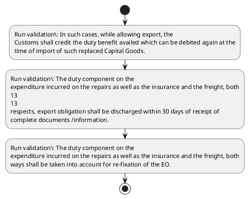

# Chapter 5 / Section 5.23: Re-Export / Repair/Replacement of Capital Goods Imported

**Chapter Title:** Export Promotion Capital Goods (EPCG) Scheme

**Pages:** 13, 14

**Purpose:** 5.23 Re-Export / Repair/Replacement of Capital Goods Imported
under EPCG Scheme
(a) Capital Goods imported under EPCG scheme, which are found defective or
unfit for use, may be re-exported to foreign supplier within three years from the
date of clearance by Customs of such goods, with permission of RA/Customs
Authority.

**Purpose Thanglish:** Indha Re-Export / Repair/Replacement of Capital Goods Imported section-la, 5.23 Re-export / Repair/Replacement of Capital Goods Imported
under EPCG Scheme
(a) Capital Goods imported under EPCG scheme, which are found defective or
unfit for use, may be re-exported to foreign supplier within three years from the
date of clearance by Customs of such goods, with permission of RA/Customs
authority.

**Summary:** 5.23 Re-Export / Repair/Replacement of Capital Goods Imported
under EPCG Scheme
(a) Capital Goods imported under EPCG scheme, which are found defective or
unfit for use, may be re-exported to foreign supplier within three years from the
date of clearance by Customs of such goods, with permission of RA/Customs
Authority. Consequently, EO would be re-fixed. (b) Capital Goods imported and found defective or otherwise unfit for use may be
exported, within two years from the date of clearance by Customs of such goods,
with permission of RA / Customs Authority and Capital Goods in replacement
thereof be imported under EPCG scheme.

**Business Meaning:** Re-Export / Repair/Replacement of Capital Goods Imported governs how DGFT business controls should be applied, validated, and enforced.

**Business Explanation:** Re-Export / Repair/Replacement of Capital Goods Imported explains the operating rule set that DEKAI should enforce. Key control points include In such cases, while allowing export, the
Customs shall credit the duty benefit availed which can be debited again at the
time of import of such replaced Capital Goods.

**Business Explanation Thanglish:** Indha Re-Export / Repair/Replacement of Capital Goods Imported section-la, Re-export / Repair/Replacement of Capital Goods Imported explains the operating rule set that DEKAI should enforce. Key control points include In such cases, while allowing export, the
Customs kandippa credit the duty benefit availed which can be debited again at the
time of import of such replaced Capital Goods.

## Business Logic
- In such cases, while allowing export, the
Customs shall credit the duty benefit availed which can be debited again at the
time of import of such replaced Capital Goods.
- The duty component on the
expenditure incurred on the repairs as well as the insurance and the freight, both
13
13
respects, export obligation shall be discharged within 30 days of receipt of
complete documents /information.
- The duty component on the
expenditure incurred on the repairs as well as the insurance and the freight, both
ways shall be taken into account for re-fixation of the EO.

## Business Rules
- rule_id=CH5-SEC5_23-R001, rule_description=In such cases, while allowing export, the
Customs shall credit the duty benefit availed which can be debited again at the
time of import of such replaced Capital Goods., trigger=Re-Export / Repair/Replacement of Capital Goods Imported, condition=Not explicitly covered in uploaded documents., validation=In such cases, while allowing export, the
Customs shall credit the duty benefit availed which can be debited again at the
time of import of such replaced Capital Goods., action=Manual review required., exception=No explicit exception found in uploaded documents., output=DEKAI should produce a compliance decision for 5.23 - Re-Export / Repair/Replacement of Capital Goods Imported.
- rule_id=CH5-SEC5_23-R002, rule_description=The duty component on the
expenditure incurred on the repairs as well as the insurance and the freight, both
13
13
respects, export obligation shall be discharged within 30 days of receipt of
complete documents /information., trigger=Re-Export / Repair/Replacement of Capital Goods Imported, condition=Not explicitly covered in uploaded documents., validation=The duty component on the
expenditure incurred on the repairs as well as the insurance and the freight, both
13
13
respects, export obligation shall be discharged within 30 days of receipt of
complete documents /information., action=Manual review required., exception=No explicit exception found in uploaded documents., output=DEKAI should produce a compliance decision for 5.23 - Re-Export / Repair/Replacement of Capital Goods Imported.
- rule_id=CH5-SEC5_23-R003, rule_description=The duty component on the
expenditure incurred on the repairs as well as the insurance and the freight, both
ways shall be taken into account for re-fixation of the EO., trigger=Re-Export / Repair/Replacement of Capital Goods Imported, condition=Not explicitly covered in uploaded documents., validation=The duty component on the
expenditure incurred on the repairs as well as the insurance and the freight, both
ways shall be taken into account for re-fixation of the EO., action=Manual review required., exception=No explicit exception found in uploaded documents., output=DEKAI should produce a compliance decision for 5.23 - Re-Export / Repair/Replacement of Capital Goods Imported.

## Conditions
- None identified

## Condition Logic
- None identified

## Validations
- In such cases, while allowing export, the
Customs shall credit the duty benefit availed which can be debited again at the
time of import of such replaced Capital Goods.
- The duty component on the
expenditure incurred on the repairs as well as the insurance and the freight, both
13
13
respects, export obligation shall be discharged within 30 days of receipt of
complete documents /information.
- The duty component on the
expenditure incurred on the repairs as well as the insurance and the freight, both
ways shall be taken into account for re-fixation of the EO.

## Exceptions
- None identified

## Dependencies
- None identified

## Authorities
- RA
- Customs
- RA/Customs
- Customs Authority
- RA / Customs Authority

## Required Documents
- The duty component on the
expenditure incurred on the repairs as well as the insurance and the freight, both
13
13
respects, export obligation shall be discharged within 30 days of receipt of
complete documents /information.

## Timelines
- 5.23 Re-Export / Repair/Replacement of Capital Goods Imported
under EPCG Scheme
(a) Capital Goods imported under EPCG scheme, which are found defective or
unfit for use, may be re-exported to foreign supplier within three years from the
date of clearance by Customs of such goods, with permission of RA/Customs
Authority.
- (b) Capital Goods imported and found defective or otherwise unfit for use may be
exported, within two years from the date of clearance by Customs of such goods,
with permission of RA / Customs Authority and Capital Goods in replacement
thereof be imported under EPCG scheme.
- (c) Capital Goods imported under EPCG scheme, may be re-exported for repairs
abroad within three years from the date of clearance by Customs of such goods,
with permission of RA / Customs Authority.
- The duty component on the
expenditure incurred on the repairs as well as the insurance and the freight, both
13
13
respects, export obligation shall be discharged within 30 days of receipt of
complete documents /information.

## Actions
- None identified

## Workflow
- Run validation: In such cases, while allowing export, the
Customs shall credit the duty benefit availed which can be debited again at the
time of import of such replaced Capital Goods.
- Run validation: The duty component on the
expenditure incurred on the repairs as well as the insurance and the freight, both
13
13
respects, export obligation shall be discharged within 30 days of receipt of
complete documents /information.
- Run validation: The duty component on the
expenditure incurred on the repairs as well as the insurance and the freight, both
ways shall be taken into account for re-fixation of the EO.

## Workflow ASCII
```text
Re-Export / Repair/Replacement of Capital Goods Imported
Run validation: In such cases, while allowing export, the
Customs shall credit the duty benefit availed which can be debited again at the
time of import of such replaced Capital Goods.
   |
   v
Run validation: The duty component on the
expenditure incurred on the repairs as well as the insurance and the freight, both
13
13
respects, export obligation shall be discharged within 30 days of receipt of
complete documents /information.
   |
   v
Run validation: The duty component on the
expenditure incurred on the repairs as well as the insurance and the freight, both
ways shall be taken into account for re-fixation of the EO.
```

## Decision Tree
- IF section 5.23 applies THEN proceed with standard DGFT workflow

## Decision Tree ASCII
```text
Re-Export / Repair/Replacement of Capital Goods Imported Decision
IF section 5.23 applies THEN proceed with standard DGFT workflow
```

## Examples
- User asks to process Re-Export / Repair/Replacement of Capital Goods Imported; the platform checks conditions, validations, and documents before action.

**Real-world Example:** Example: an importer or exporter invokes Re-Export / Repair/Replacement of Capital Goods Imported, submits The duty component on the
expenditure incurred on the repairs as well as the insurance and the freight, both
13
13
respects, export obligation shall be discharged within 30 days of receipt of
complete documents /information., and DEKAI uses the extracted rules to follow the re-export / repair/replacement of capital goods imported process.

**Real-world Example Thanglish:** Indha Re-Export / Repair/Replacement of Capital Goods Imported section-la, Example: an importer or exporter invokes Re-export / Repair/Replacement of Capital Goods Imported, submits The duty component on the
expenditure incurred on the repairs as well as the insurance and the freight, both
13
13
respects, export obligation kandippa be discharged within 30 days of receipt of
complete documents /information., and DEKAI uses the extracted rules to follow the re-export / repair/replacement of capital goods imported process.

## AI Rules
- IF detected context matches section rule THEN enforce: In such cases, while allowing export, the
Customs shall credit the duty benefit availed which can be debited again at the
time of import of such replaced Capital Goods.
- IF detected context matches section rule THEN enforce: The duty component on the
expenditure incurred on the repairs as well as the insurance and the freight, both
13
13
respects, export obligation shall be discharged within 30 days of receipt of
complete documents /information.
- IF detected context matches section rule THEN enforce: The duty component on the
expenditure incurred on the repairs as well as the insurance and the freight, both
ways shall be taken into account for re-fixation of the EO.

## Database Fields
- name=section_code, type=string, required=True, source=parsed_section_heading
- name=section_title, type=string, required=True, source=parsed_section_heading
- name=are_flag, type=boolean, required=False, source=keyword:are
- name=for_flag, type=boolean, required=False, source=keyword:for
- name=use_flag, type=boolean, required=False, source=keyword:use
- name=may_flag, type=boolean, required=False, source=keyword:may
- name=the_flag, type=boolean, required=False, source=keyword:the
- name=and_flag, type=boolean, required=False, source=keyword:and
- name=two_flag, type=boolean, required=False, source=keyword:two
- name=can_flag, type=boolean, required=False, source=keyword:can
- name=document_1_submitted, type=boolean, required=True, source=The duty component on the
expenditure incurred on the repairs as well as the insurance and the freight, both
13
13
respects, export obligation shall be discharged within 30 days of receipt of
complete documents /information.

## API Requirements
- method=GET, path=/api/dgft/sections/5.23, purpose=Retrieve knowledge payload for section 5.23, query_params=['include=workflow,decision_tree,validations'], response_fields=['section', 'title', 'summary', 'conditions', 'validations', 'exceptions', 'workflow', 'decision_tree']
- method=POST, path=/api/dgft/Re-Export-Repair-Replacement-of-Capital-Goods-Imported/validate, purpose=Validate inputs and documents for Re-Export / Repair/Replacement of Capital Goods Imported, request_fields=['section_code', 'section_title', 'document_1_submitted'], response_fields=['status', 'errors', 'warnings', 'next_actions']

## UI Screens
- screen_id=Re_Export_Repair_Replacement_of_Capital_Goods_Imported_overview, name=Re-Export / Repair/Replacement of Capital Goods Imported Overview, purpose=Show section summary, authority, timeline, and eligibility cues., widgets=['summary_card', 'conditions_table', 'authority_badges', 'timeline_panel']
- screen_id=Re_Export_Repair_Replacement_of_Capital_Goods_Imported_submission, name=Re-Export / Repair/Replacement of Capital Goods Imported Submission, purpose=Capture applicant data and supporting documents., widgets=['dynamic_form', 'document_uploader', 'validation_panel', 'next_action_footer'], fields=['section_code', 'section_title', 'are_flag', 'for_flag', 'use_flag', 'may_flag', 'the_flag', 'and_flag']

## Error Messages
- Validation failed because the section requirements were not fully met.

## FAQ
- question_en=What is the purpose of section 5.23?, answer_en=Re-Export / Repair/Replacement of Capital Goods Imported explains the operating rule set that DEKAI should enforce. Key control points include In such cases, while allowing export, the
Customs shall credit the duty benefit availed which can be debited again at the
time of import of such replaced Capital Goods., question_thanglish=Indha Re-Export / Repair/Replacement of Capital Goods Imported section-la, What is the purpose of section 5.23?, answer_thanglish=Indha Re-Export / Repair/Replacement of Capital Goods Imported section-la, Re-export / Repair/Replacement of Capital Goods Imported explains the operating rule set that DEKAI should enforce. Key control points include In such cases, while allowing export, the
Customs kandippa credit the duty benefit availed which can be debited again at the
time of import of such replaced Capital Goods.
- question_en=What documents are required under Re-Export / Repair/Replacement of Capital Goods Imported?, answer_en=The duty component on the
expenditure incurred on the repairs as well as the insurance and the freight, both
13
13
respects, export obligation shall be discharged within 30 days of receipt of
complete documents /information., question_thanglish=Indha Re-Export / Repair/Replacement of Capital Goods Imported section-la, What documents are required under Re-export / Repair/Replacement of Capital Goods Imported?, answer_thanglish=Indha Re-Export / Repair/Replacement of Capital Goods Imported section-la, The duty component on the
expenditure incurred on the repairs as well as the insurance and the freight, both
13
13
respects, export obligation kandippa be discharged within 30 days of receipt of
complete documents /information.
- question_en=Which authority handles Re-Export / Repair/Replacement of Capital Goods Imported?, answer_en=RA, Customs, RA/Customs, Customs Authority, RA / Customs Authority, question_thanglish=Indha Re-Export / Repair/Replacement of Capital Goods Imported section-la, Which authority handles Re-export / Repair/Replacement of Capital Goods Imported?, answer_thanglish=Indha Re-Export / Repair/Replacement of Capital Goods Imported section-la, RA, Customs, RA/Customs, Customs authority, RA / Customs authority

## Questions Users May Ask
- What does Re-Export / Repair/Replacement of Capital Goods Imported require?
- Which documents are needed for Re-Export / Repair/Replacement of Capital Goods Imported?
- How does DEKAI validate Re-Export / Repair/Replacement of Capital Goods Imported requests?

## Expected AI Answers
- Re-Export / Repair/Replacement of Capital Goods Imported requires the platform to interpret the section text, apply the extracted business rules, and present the correct next action.
- Required documents are inferred from the section text: The duty component on the
expenditure incurred on the repairs as well as the insurance and the freight, both
13
13
respects, export obligation shall be discharged within 30 days of receipt of
complete documents /information.
- DEKAI validates Re-Export / Repair/Replacement of Capital Goods Imported by checking conditions, required documents, authority references, and exception clauses before recommending an outcome.

## AI Q&A Examples
- question_en=User asks: How do I comply with Re-Export / Repair/Replacement of Capital Goods Imported?, answer_en=AI answers: DEKAI should evaluate section 5.23, apply the extracted rules, and guide the user through Run validation: In such cases, while allowing export, the
Customs shall credit the duty benefit availed which can be debited again at the
time of import of such replaced Capital Goods.., question_thanglish=Indha Re-Export / Repair/Replacement of Capital Goods Imported section-la, User asks: How do I comply with Re-export / Repair/Replacement of Capital Goods Imported?, answer_thanglish=Indha Re-Export / Repair/Replacement of Capital Goods Imported section-la, AI answers: DEKAI should evaluate section 5.23, apply the extracted rules, and guide the user through Run validation: In such cases, while allowing export, the
Customs kandippa credit the duty benefit availed which can be debited again at the
time of import of such replaced Capital Goods..
- question_en=User asks: Which validations apply to Re-Export / Repair/Replacement of Capital Goods Imported?, answer_en=AI answers: Applicable validations are In such cases, while allowing export, the
Customs shall credit the duty benefit availed which can be debited again at the
time of import of such replaced Capital Goods., The duty component on the
expenditure incurred on the repairs as well as the insurance and the freight, both
13
13
respects, export obligation shall be discharged within 30 days of receipt of
complete documents /information., The duty component on the
expenditure incurred on the repairs as well as the insurance and the freight, both
ways shall be taken into account for re-fixation of the EO., question_thanglish=Indha Re-Export / Repair/Replacement of Capital Goods Imported section-la, User asks: Which validations apply to Re-export / Repair/Replacement of Capital Goods Imported?, answer_thanglish=Indha Re-Export / Repair/Replacement of Capital Goods Imported section-la, AI answers: Applicable validations are In such cases, while allowing export, the
Customs kandippa credit the duty benefit availed which can be debited again at the
time of import of such replaced Capital Goods., The duty component on the
expenditure incurred on the repairs as well as the insurance and the freight, both
13
13
respects, export obligation kandippa be discharged within 30 days of receipt of
complete documents /information., The duty component on the
expenditure incurred on the repairs as well as the insurance and the freight, both
ways kandippa be taken into account for re-fixation of the EO.

## DEKAI AI Implementation Notes
- Capture chapter 5, section 5.23, title, and page references as immutable knowledge metadata.
- Bind validations for Re-Export / Repair/Replacement of Capital Goods Imported into a rule engine keyed by the rule IDs extracted for this section.
- Expose document upload controls for: The duty component on the
expenditure incurred on the repairs as well as the insurance and the freight, both
13
13
respects, export obligation shall be discharged within 30 days of receipt of
complete documents /information..
- Route escalations or approvals to: RA, Customs, RA/Customs, Customs Authority.

## DEKAI AI Implementation Notes Thanglish
- Indha Re-Export / Repair/Replacement of Capital Goods Imported section-la, Capture chapter 5, section 5.23, title, and page references as immutable knowledge metadata.
- Indha Re-Export / Repair/Replacement of Capital Goods Imported section-la, Bind validations for Re-export / Repair/Replacement of Capital Goods Imported into a rule engine keyed by the rule IDs extracted for this section.
- Indha Re-Export / Repair/Replacement of Capital Goods Imported section-la, Expose document upload controls for: The duty component on the
expenditure incurred on the repairs as well as the insurance and the freight, both
13
13
respects, export obligation kandippa be discharged within 30 days of receipt of
complete documents /information..
- Indha Re-Export / Repair/Replacement of Capital Goods Imported section-la, Route escalations or approvals to: RA, Customs, RA/Customs, Customs authority.

## AI Metadata
- Keywords: are, for, use, may, the, and, two, can, EPCG, from, date, such, with, duty, time, well, both, days, ways, into
- Search Keywords: are, for, use, may, the, and, two, can, EPCG, from, date, such, with, duty, time, well, both, days, ways, into
- Intent: Provide knowledge guidance for Re-Export / Repair/Replacement of Capital Goods Imported.
- Tags: 5.23, Re-Export / Repair/Replacement of Capital Goods Imported, business-rule, document-driven, dgft
- Related Sections: 
- Related Chapters: 
- Related Rules: In such cases, while allowing export, the
Customs shall credit the duty benefit availed which can be debited again at the
time of import of such replaced Capital Goods., The duty component on the
expenditure incurred on the repairs as well as the insurance and the freight, both
13
13
respects, export obligation shall be discharged within 30 days of receipt of
complete documents /information., The duty component on the
expenditure incurred on the repairs as well as the insurance and the freight, both
ways shall be taken into account for re-fixation of the EO.

## Mermaid


## PlantUML

