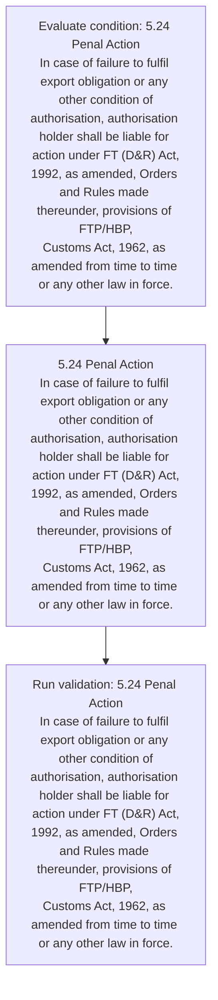
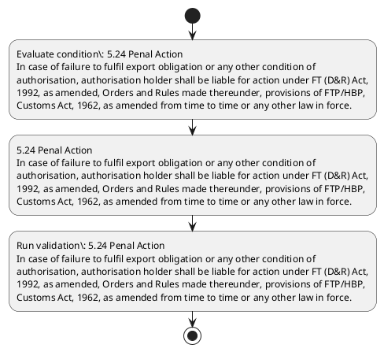

# Chapter 5 / Section 5.24: Penal Action

**Chapter Title:** Export Promotion Capital Goods (EPCG) Scheme

**Pages:** 14

**Purpose:** 5.24 Penal Action
In case of failure to fulfil export obligation or any other condition of
authorisation, authorisation holder shall be liable for action under FT (D&R) Act,
1992, as amended, Orders and Rules made thereunder, provisions of FTP/HBP,
Customs Act, 1962, as amended from time to time or any other law in force.

**Purpose Thanglish:** Indha Penal Action section-la, 5.24 Penal Action
In case of failure to fulfil export obligation or any other condition of
authorisation, authorisation holder kandippa be liable for action under FT (D&R) Act,
1992, as amended, Orders and Rules made thereunder, provisions of FTP/HBP,
Customs Act, 1962, as amended from time to time or any other law in force.

**Summary:** 5.24 Penal Action
In case of failure to fulfil export obligation or any other condition of
authorisation, authorisation holder shall be liable for action under FT (D&R) Act,
1992, as amended, Orders and Rules made thereunder, provisions of FTP/HBP,
Customs Act, 1962, as amended from time to time or any other law in force.

**Business Meaning:** Penal Action governs how DGFT business controls should be applied, validated, and enforced.

**Business Explanation:** Penal Action explains the operating rule set that DEKAI should enforce. Key control points include 5.24 Penal Action
In case of failure to fulfil export obligation or any other condition of
authorisation, authorisation holder shall be liable for action under FT (D&R) Act,
1992, as amended, Orders and Rules made thereunder, provisions of FTP/HBP,
Customs Act, 1962, as amended from time to time or any other law in force. The section also drives actions such as 5.24 Penal Action
In case of failure to fulfil export obligation or any other condition of
authorisation, authorisation holder shall be liable for action under FT (D&R) Act,
1992, as amended, Orders and Rules made thereunder, provisions of FTP/HBP,
Customs Act, 1962, as amended from time to time or any other law in force..

**Business Explanation Thanglish:** Indha Penal Action section-la, Penal Action explains the operating rule set that DEKAI should enforce. Key control points include 5.24 Penal Action
In case of failure to fulfil export obligation or any other condition of
authorisation, authorisation holder kandippa be liable for action under FT (D&R) Act,
1992, as amended, Orders and Rules made thereunder, provisions of FTP/HBP,
Customs Act, 1962, as amended from time to time or any other law in force. The section also drives actions such as 5.24 Penal Action
In case of failure to fulfil export obligation or any other condition of
authorisation, authorisation holder kandippa be liable for action under FT (D&R) Act,
1992, as amended, Orders and Rules made thereunder, provisions of FTP/HBP,
Customs Act, 1962, as amended from time to time or any other law in force..

## Business Logic
- 5.24 Penal Action
In case of failure to fulfil export obligation or any other condition of
authorisation, authorisation holder shall be liable for action under FT (D&R) Act,
1992, as amended, Orders and Rules made thereunder, provisions of FTP/HBP,
Customs Act, 1962, as amended from time to time or any other law in force.

## Business Rules
- rule_id=CH5-SEC5_24-R001, rule_description=5.24 Penal Action
In case of failure to fulfil export obligation or any other condition of
authorisation, authorisation holder shall be liable for action under FT (D&R) Act,
1992, as amended, Orders and Rules made thereunder, provisions of FTP/HBP,
Customs Act, 1962, as amended from time to time or any other law in force., trigger=Penal Action, condition=5.24 Penal Action
In case of failure to fulfil export obligation or any other condition of
authorisation, authorisation holder shall be liable for action under FT (D&R) Act,
1992, as amended, Orders and Rules made thereunder, provisions of FTP/HBP,
Customs Act, 1962, as amended from time to time or any other law in force., validation=5.24 Penal Action
In case of failure to fulfil export obligation or any other condition of
authorisation, authorisation holder shall be liable for action under FT (D&R) Act,
1992, as amended, Orders and Rules made thereunder, provisions of FTP/HBP,
Customs Act, 1962, as amended from time to time or any other law in force., action=5.24 Penal Action
In case of failure to fulfil export obligation or any other condition of
authorisation, authorisation holder shall be liable for action under FT (D&R) Act,
1992, as amended, Orders and Rules made thereunder, provisions of FTP/HBP,
Customs Act, 1962, as amended from time to time or any other law in force., exception=No explicit exception found in uploaded documents., output=DEKAI should produce a compliance decision for 5.24 - Penal Action.

## Conditions
- 5.24 Penal Action
In case of failure to fulfil export obligation or any other condition of
authorisation, authorisation holder shall be liable for action under FT (D&R) Act,
1992, as amended, Orders and Rules made thereunder, provisions of FTP/HBP,
Customs Act, 1962, as amended from time to time or any other law in force.

## Condition Logic
- id=5.5.24.1, if=5.24 Penal Action
In case of failure to fulfil export obligation or any other condition of
authorisation, authorisation holder shall be liable for action under FT (D&R) Act,
1992, as amended, Orders and Rules made thereunder, provisions of FTP/HBP,
Customs Act, 1962, as amended from time to time or any other law in force., then=5.24 Penal Action
In case of failure to fulfil export obligation or any other condition of
authorisation, authorisation holder shall be liable for action under FT (D&R) Act,
1992, as amended, Orders and Rules made thereunder, provisions of FTP/HBP,
Customs Act, 1962, as amended from time to time or any other law in force., source=5.24 Penal Action
In case of failure to fulfil export obligation or any other condition of
authorisation, authorisation holder shall be liable for action under FT (D&R) Act,
1992, as amended, Orders and Rules made thereunder, provisions of FTP/HBP,
Customs Act, 1962, as amended from time to time or any other law in force.

## Validations
- 5.24 Penal Action
In case of failure to fulfil export obligation or any other condition of
authorisation, authorisation holder shall be liable for action under FT (D&R) Act,
1992, as amended, Orders and Rules made thereunder, provisions of FTP/HBP,
Customs Act, 1962, as amended from time to time or any other law in force.

## Exceptions
- None identified

## Dependencies
- None identified

## Authorities
- Customs

## Required Documents
- None identified

## Timelines
- None identified

## Actions
- 5.24 Penal Action
In case of failure to fulfil export obligation or any other condition of
authorisation, authorisation holder shall be liable for action under FT (D&R) Act,
1992, as amended, Orders and Rules made thereunder, provisions of FTP/HBP,
Customs Act, 1962, as amended from time to time or any other law in force.

## Workflow
- Evaluate condition: 5.24 Penal Action
In case of failure to fulfil export obligation or any other condition of
authorisation, authorisation holder shall be liable for action under FT (D&R) Act,
1992, as amended, Orders and Rules made thereunder, provisions of FTP/HBP,
Customs Act, 1962, as amended from time to time or any other law in force.
- 5.24 Penal Action
In case of failure to fulfil export obligation or any other condition of
authorisation, authorisation holder shall be liable for action under FT (D&R) Act,
1992, as amended, Orders and Rules made thereunder, provisions of FTP/HBP,
Customs Act, 1962, as amended from time to time or any other law in force.
- Run validation: 5.24 Penal Action
In case of failure to fulfil export obligation or any other condition of
authorisation, authorisation holder shall be liable for action under FT (D&R) Act,
1992, as amended, Orders and Rules made thereunder, provisions of FTP/HBP,
Customs Act, 1962, as amended from time to time or any other law in force.

## Workflow ASCII
```text
Penal Action
Evaluate condition: 5.24 Penal Action
In case of failure to fulfil export obligation or any other condition of
authorisation, authorisation holder shall be liable for action under FT (D&R) Act,
1992, as amended, Orders and Rules made thereunder, provisions of FTP/HBP,
Customs Act, 1962, as amended from time to time or any other law in force.
   |
   v
5.24 Penal Action
In case of failure to fulfil export obligation or any other condition of
authorisation, authorisation holder shall be liable for action under FT (D&R) Act,
1992, as amended, Orders and Rules made thereunder, provisions of FTP/HBP,
Customs Act, 1962, as amended from time to time or any other law in force.
   |
   v
Run validation: 5.24 Penal Action
In case of failure to fulfil export obligation or any other condition of
authorisation, authorisation holder shall be liable for action under FT (D&R) Act,
1992, as amended, Orders and Rules made thereunder, provisions of FTP/HBP,
Customs Act, 1962, as amended from time to time or any other law in force.
```

## Decision Tree
- IF 5.24 Penal Action
In case of failure to fulfil export obligation or any other condition of
authorisation, authorisation holder shall be liable for action under FT (D&R) Act,
1992, as amended, Orders and Rules made thereunder, provisions of FTP/HBP,
Customs Act, 1962, as amended from time to time or any other law in force. THEN 5.24 Penal Action
In case of failure to fulfil export obligation or any other condition of
authorisation, authorisation holder shall be liable for action under FT (D&R) Act,
1992, as amended, Orders and Rules made thereunder, provisions of FTP/HBP,
Customs Act, 1962, as amended from time to time or any other law in force.

## Decision Tree ASCII
```text
Penal Action Decision
IF 5.24 Penal Action
In case of failure to fulfil export obligation or any other condition of
authorisation, authorisation holder shall be liable for action under FT (D&R) Act,
1992, as amended, Orders and Rules made thereunder, provisions of FTP/HBP,
Customs Act, 1962, as amended from time to time or any other law in force. THEN 5.24 Penal Action
In case of failure to fulfil export obligation or any other condition of
authorisation, authorisation holder shall be liable for action under FT (D&R) Act,
1992, as amended, Orders and Rules made thereunder, provisions of FTP/HBP,
Customs Act, 1962, as amended from time to time or any other law in force.
```

## Examples
- User asks to process Penal Action; the platform checks conditions, validations, and documents before action.

**Real-world Example:** Example: an importer or exporter invokes Penal Action, submits the prescribed DGFT records, and DEKAI uses the extracted rules to 5.24 penal action
in case of failure to fulfil export obligation or any other condition of
authorisation, authorisation holder shall be liable for action under ft (d&r) act,
1992, as amended, orders and rules made thereunder, provisions of ftp/hbp,
customs act, 1962, as amended from time to time or any other law in force..

**Real-world Example Thanglish:** Indha Penal Action section-la, Example: an importer or exporter invokes Penal Action, submits the prescribed DGFT records, and DEKAI uses the extracted rules to 5.24 penal action
in case of failure to fulfil export obligation or any other condition of
authorisation, authorisation holder kandippa be liable for action under ft (d&r) act,
1992, as amended, orders and rules made thereunder, provisions of ftp/hbp,
customs act, 1962, as amended from time to time or any other law in force..

## AI Rules
- IF detected context matches section rule THEN enforce: 5.24 Penal Action
In case of failure to fulfil export obligation or any other condition of
authorisation, authorisation holder shall be liable for action under FT (D&R) Act,
1992, as amended, Orders and Rules made thereunder, provisions of FTP/HBP,
Customs Act, 1962, as amended from time to time or any other law in force.
- IF validations pass THEN recommend action: 5.24 Penal Action
In case of failure to fulfil export obligation or any other condition of
authorisation, authorisation holder shall be liable for action under FT (D&R) Act,
1992, as amended, Orders and Rules made thereunder, provisions of FTP/HBP,
Customs Act, 1962, as amended from time to time or any other law in force.

## Database Fields
- name=section_code, type=string, required=True, source=parsed_section_heading
- name=section_title, type=string, required=True, source=parsed_section_heading
- name=any_flag, type=boolean, required=False, source=keyword:any
- name=for_flag, type=boolean, required=False, source=keyword:for
- name=d&r_flag, type=boolean, required=False, source=keyword:D&R
- name=act_flag, type=boolean, required=False, source=keyword:Act
- name=and_flag, type=boolean, required=False, source=keyword:and
- name=law_flag, type=boolean, required=False, source=keyword:law
- name=case_flag, type=boolean, required=False, source=keyword:case
- name=made_flag, type=boolean, required=False, source=keyword:made

## API Requirements
- method=GET, path=/api/dgft/sections/5.24, purpose=Retrieve knowledge payload for section 5.24, query_params=['include=workflow,decision_tree,validations'], response_fields=['section', 'title', 'summary', 'conditions', 'validations', 'exceptions', 'workflow', 'decision_tree']
- method=POST, path=/api/dgft/Penal-Action/validate, purpose=Validate inputs and documents for Penal Action, request_fields=['section_code', 'section_title'], response_fields=['status', 'errors', 'warnings', 'next_actions']
- method=POST, path=/api/dgft/Penal-Action/execute, purpose=Trigger business action for 5.24 Penal Action
In case of failure to fulfil export obligation or any other condition of
authorisation, authorisation holder shall be liable for action under FT (D&R) Act,
1992, as amended, Orders and Rules made thereunder, provisions of FTP/HBP,
Customs Act, 1962, as amended from time to time or any other law in force., request_fields=['section_code', 'section_title'], response_fields=['reference_id', 'status', 'authority', 'timeline']

## UI Screens
- screen_id=Penal_Action_overview, name=Penal Action Overview, purpose=Show section summary, authority, timeline, and eligibility cues., widgets=['summary_card', 'conditions_table', 'authority_badges', 'timeline_panel']
- screen_id=Penal_Action_submission, name=Penal Action Submission, purpose=Capture applicant data and supporting documents., widgets=['dynamic_form', 'document_uploader', 'validation_panel', 'next_action_footer'], fields=['section_code', 'section_title', 'any_flag', 'for_flag', 'd&r_flag', 'act_flag', 'and_flag', 'law_flag']

## Error Messages
- Validation failed because the section requirements were not fully met.

## FAQ
- question_en=What is the purpose of section 5.24?, answer_en=Penal Action explains the operating rule set that DEKAI should enforce. Key control points include 5.24 Penal Action
In case of failure to fulfil export obligation or any other condition of
authorisation, authorisation holder shall be liable for action under FT (D&R) Act,
1992, as amended, Orders and Rules made thereunder, provisions of FTP/HBP,
Customs Act, 1962, as amended from time to time or any other law in force. The section also drives actions such as 5.24 Penal Action
In case of failure to fulfil export obligation or any other condition of
authorisation, authorisation holder shall be liable for action under FT (D&R) Act,
1992, as amended, Orders and Rules made thereunder, provisions of FTP/HBP,
Customs Act, 1962, as amended from time to time or any other law in force.., question_thanglish=Indha Penal Action section-la, What is the purpose of section 5.24?, answer_thanglish=Indha Penal Action section-la, Penal Action explains the operating rule set that DEKAI should enforce. Key control points include 5.24 Penal Action
In case of failure to fulfil export obligation or any other condition of
authorisation, authorisation holder kandippa be liable for action under FT (D&R) Act,
1992, as amended, Orders and Rules made thereunder, provisions of FTP/HBP,
Customs Act, 1962, as amended from time to time or any other law in force. The section also drives actions such as 5.24 Penal Action
In case of failure to fulfil export obligation or any other condition of
authorisation, authorisation holder kandippa be liable for action under FT (D&R) Act,
1992, as amended, Orders and Rules made thereunder, provisions of FTP/HBP,
Customs Act, 1962, as amended from time to time or any other law in force..
- question_en=What documents are required under Penal Action?, answer_en=Not explicitly covered in uploaded documents., question_thanglish=Indha Penal Action section-la, What documents are required under Penal Action?, answer_thanglish=Indha Penal Action section-la, Not explicitly covered in uploaded documents.
- question_en=Which authority handles Penal Action?, answer_en=Customs, question_thanglish=Indha Penal Action section-la, Which authority handles Penal Action?, answer_thanglish=Indha Penal Action section-la, Customs

## Questions Users May Ask
- What does Penal Action require?
- Which documents are needed for Penal Action?
- How does DEKAI validate Penal Action requests?
- What action should be taken for Penal Action?

## Expected AI Answers
- Penal Action requires the platform to interpret the section text, apply the extracted business rules, and present the correct next action.
- Required documents are inferred from the section text: no explicit documents were detected.
- DEKAI validates Penal Action by checking conditions, required documents, authority references, and exception clauses before recommending an outcome.
- The primary extracted action is: 5.24 Penal Action
In case of failure to fulfil export obligation or any other condition of
authorisation, authorisation holder shall be liable for action under FT (D&R) Act,
1992, as amended, Orders and Rules made thereunder, provisions of FTP/HBP,
Customs Act, 1962, as amended from time to time or any other law in force.

## AI Q&A Examples
- question_en=User asks: How do I comply with Penal Action?, answer_en=AI answers: DEKAI should evaluate section 5.24, apply the extracted rules, and guide the user through Evaluate condition: 5.24 Penal Action
In case of failure to fulfil export obligation or any other condition of
authorisation, authorisation holder shall be liable for action under FT (D&R) Act,
1992, as amended, Orders and Rules made thereunder, provisions of FTP/HBP,
Customs Act, 1962, as amended from time to time or any other law in force.., question_thanglish=Indha Penal Action section-la, User asks: How do I comply with Penal Action?, answer_thanglish=Indha Penal Action section-la, AI answers: DEKAI should evaluate section 5.24, apply the extracted rules, and guide the user through Evaluate condition: 5.24 Penal Action
In case of failure to fulfil export obligation or any other condition of
authorisation, authorisation holder kandippa be liable for action under FT (D&R) Act,
1992, as amended, Orders and Rules made thereunder, provisions of FTP/HBP,
Customs Act, 1962, as amended from time to time or any other law in force..
- question_en=User asks: Which validations apply to Penal Action?, answer_en=AI answers: Applicable validations are 5.24 Penal Action
In case of failure to fulfil export obligation or any other condition of
authorisation, authorisation holder shall be liable for action under FT (D&R) Act,
1992, as amended, Orders and Rules made thereunder, provisions of FTP/HBP,
Customs Act, 1962, as amended from time to time or any other law in force., question_thanglish=Indha Penal Action section-la, User asks: Which validations apply to Penal Action?, answer_thanglish=Indha Penal Action section-la, AI answers: Applicable validations are 5.24 Penal Action
In case of failure to fulfil export obligation or any other condition of
authorisation, authorisation holder kandippa be liable for action under FT (D&R) Act,
1992, as amended, Orders and Rules made thereunder, provisions of FTP/HBP,
Customs Act, 1962, as amended from time to time or any other law in force.

## DEKAI AI Implementation Notes
- Capture chapter 5, section 5.24, title, and page references as immutable knowledge metadata.
- Bind validations for Penal Action into a rule engine keyed by the rule IDs extracted for this section.
- Route escalations or approvals to: Customs.

## DEKAI AI Implementation Notes Thanglish
- Indha Penal Action section-la, Capture chapter 5, section 5.24, title, and page references as immutable knowledge metadata.
- Indha Penal Action section-la, Bind validations for Penal Action into a rule engine keyed by the rule IDs extracted for this section.
- Indha Penal Action section-la, Route escalations or approvals to: Customs.

## AI Metadata
- Keywords: any, for, D&R, Act, and, law, case, made, from, time, Penal, other, shall, under, Rules, force, Action, fulfil, export, holder
- Search Keywords: any, for, D&R, Act, and, law, case, made, from, time, Penal, other, shall, under, Rules, force, Action, fulfil, export, holder
- Intent: Support Penal Action processing and compliance validation.
- Tags: 5.24, Penal Action, business-rule, dgft
- Related Sections: 
- Related Chapters: 
- Related Rules: 5.24 Penal Action
In case of failure to fulfil export obligation or any other condition of
authorisation, authorisation holder shall be liable for action under FT (D&R) Act,
1992, as amended, Orders and Rules made thereunder, provisions of FTP/HBP,
Customs Act, 1962, as amended from time to time or any other law in force.

## Mermaid


## PlantUML

