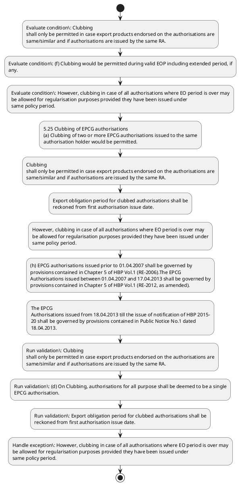

# Chapter 5 / Section 5.25: Clubbing of EPCG authorisations

**Chapter Title:** Export Promotion Capital Goods (EPCG) Scheme

**Pages:** 14, 15

**Purpose:** 5.25 Clubbing of EPCG authorisations
(a) Clubbing of two or more EPCG authorisations issued to the same
authorisation holder would be permitted.

**Purpose Thanglish:** Indha Clubbing of EPCG authorisations section-la, 5.25 Clubbing of EPCG authorisations
(a) Clubbing of two or more EPCG authorisations issued to the same
authorisation holder would be permitted.

**Summary:** 5.25 Clubbing of EPCG authorisations
(a) Clubbing of two or more EPCG authorisations issued to the same
authorisation holder would be permitted. (b) An application for clubbing can be made to RA concerned in ANF 5C. Clubbing
shall only be permitted in case export products endorsed on the authorisations are
same/similar and if authorisations are issued by the same RA.

**Business Meaning:** Clubbing of EPCG authorisations governs how DGFT business controls should be applied, validated, and enforced.

**Business Explanation:** Clubbing of EPCG authorisations explains the operating rule set that DEKAI should enforce. Key control points include Clubbing
shall only be permitted in case export products endorsed on the authorisations are
same/similar and if authorisations are issued by the same RA. The section also drives actions such as 5.25 Clubbing of EPCG authorisations
(a) Clubbing of two or more EPCG authorisations issued to the same
authorisation holder would be permitted..

**Business Explanation Thanglish:** Indha Clubbing of EPCG authorisations section-la, Clubbing of EPCG authorisations explains the operating rule set that DEKAI should enforce. Key control points include Clubbing
kandippa only be permitted in case export products endorsed on the authorisations are
same/similar and if authorisations are issued by the same RA. The section also drives actions such as 5.25 Clubbing of EPCG authorisations
(a) Clubbing of two or more EPCG authorisations issued to the same
authorisation holder would be permitted..

## Business Logic
- Clubbing
shall only be permitted in case export products endorsed on the authorisations are
same/similar and if authorisations are issued by the same RA.
- (d) On Clubbing, authorisations for all purpose shall be deemed to be a single
EPCG authorisation.
- Export obligation period for clubbed authorisations shall be
reckoned from first authorisation issue date.
- (h) EPCG authorisations issued prior to 01.04.2007 shall be governed by
provisions contained in Chapter 5 of HBP Vol.1 (RE-2006).The EPCG
Authorisations issued between 01.04.2007 and 17.04.2013 shall be governed by
provisions contained in Chapter 5 of HBP Vol.1 (RE-2012, as amended).
- The EPCG
Authorisations issued from 18.04.2013 till the issue of notification of HBP 2015-
20 shall be governed by provisions contained in Public Notice No.1 dated
18.04.2013.
- The EPCG Authorisations issued between notification of HBP 2015-
14
14
ways shall be taken into account for re-fixation of the EO.
- (h)
EPCG authorisations issued prior to 01.04.2007 shall be governed by
provisions contained in Chapter 5 of HBP Vol.1 (RE-2006).The EPCG
Authorisations issued between 01.04.2007 and 17.04.2013 shall be governed by
provisions contained in Chapter 5 of HBP Vol.1 (RE-2012, as amended).
- The EPCG Authorisations issued between notification of HBP 2015-
20 till the notification of HBP 2015-20 (RE-2017) shall be governed by provisions
contained in HBP 2015-20.
- The EPCG Authorisations issued between notification
of HBP 2015-20 (RE-2017) till the notification of HBP 2023 shall be governed by
provisions contained in HBP 2015-20 (RE-2017).

## Business Rules
- rule_id=CH5-SEC5_25-R001, rule_description=Clubbing
shall only be permitted in case export products endorsed on the authorisations are
same/similar and if authorisations are issued by the same RA., trigger=Clubbing of EPCG authorisations, condition=Clubbing
shall only be permitted in case export products endorsed on the authorisations are
same/similar and if authorisations are issued by the same RA., validation=Clubbing
shall only be permitted in case export products endorsed on the authorisations are
same/similar and if authorisations are issued by the same RA., action=5.25 Clubbing of EPCG authorisations
(a) Clubbing of two or more EPCG authorisations issued to the same
authorisation holder would be permitted., exception=However, clubbing in case of all authorisations where EO period is over may
be allowed for regularisation purposes provided they have been issued under
same policy period., output=DEKAI should produce a compliance decision for 5.25 - Clubbing of EPCG authorisations.
- rule_id=CH5-SEC5_25-R002, rule_description=(d) On Clubbing, authorisations for all purpose shall be deemed to be a single
EPCG authorisation., trigger=Clubbing of EPCG authorisations, condition=(f) Clubbing would be permitted during valid EOP including extended period, if
any., validation=(d) On Clubbing, authorisations for all purpose shall be deemed to be a single
EPCG authorisation., action=Clubbing
shall only be permitted in case export products endorsed on the authorisations are
same/similar and if authorisations are issued by the same RA., exception=However, clubbing in case of all authorisations where EO period is over may
be allowed for regularisation purposes provided they have been issued under
same policy period., output=DEKAI should produce a compliance decision for 5.25 - Clubbing of EPCG authorisations.
- rule_id=CH5-SEC5_25-R003, rule_description=Export obligation period for clubbed authorisations shall be
reckoned from first authorisation issue date., trigger=Clubbing of EPCG authorisations, condition=However, clubbing in case of all authorisations where EO period is over may
be allowed for regularisation purposes provided they have been issued under
same policy period., validation=Export obligation period for clubbed authorisations shall be
reckoned from first authorisation issue date., action=Export obligation period for clubbed authorisations shall be
reckoned from first authorisation issue date., exception=However, clubbing in case of all authorisations where EO period is over may
be allowed for regularisation purposes provided they have been issued under
same policy period., output=DEKAI should produce a compliance decision for 5.25 - Clubbing of EPCG authorisations.
- rule_id=CH5-SEC5_25-R004, rule_description=(h) EPCG authorisations issued prior to 01.04.2007 shall be governed by
provisions contained in Chapter 5 of HBP Vol.1 (RE-2006).The EPCG
Authorisations issued between 01.04.2007 and 17.04.2013 shall be governed by
provisions contained in Chapter 5 of HBP Vol.1 (RE-2012, as amended)., trigger=Clubbing of EPCG authorisations, condition=(g) In case of clubbing of EPCG authorisations where EO can be fulfilled by export
of alternate product(s)/service(s), the proportion of alternate
product(s)/service(s) for EO fulfillment/ regularization will be restricted to the
lowest of the percentage of alternate product(s)/service(s) allowed in the clubbed
authorisations., validation=(h) EPCG authorisations issued prior to 01.04.2007 shall be governed by
provisions contained in Chapter 5 of HBP Vol.1 (RE-2006).The EPCG
Authorisations issued between 01.04.2007 and 17.04.2013 shall be governed by
provisions contained in Chapter 5 of HBP Vol.1 (RE-2012, as amended)., action=However, clubbing in case of all authorisations where EO period is over may
be allowed for regularisation purposes provided they have been issued under
same policy period., exception=However, clubbing in case of all authorisations where EO period is over may
be allowed for regularisation purposes provided they have been issued under
same policy period., output=DEKAI should produce a compliance decision for 5.25 - Clubbing of EPCG authorisations.
- rule_id=CH5-SEC5_25-R005, rule_description=The EPCG
Authorisations issued from 18.04.2013 till the issue of notification of HBP 2015-
20 shall be governed by provisions contained in Public Notice No.1 dated
18.04.2013., trigger=Clubbing of EPCG authorisations, condition=The EPCG
Authorisations issued from 18.04.2013 till the issue of notification of HBP 2015-
20 shall be governed by provisions contained in Public Notice No.1 dated
18.04.2013., validation=The EPCG
Authorisations issued from 18.04.2013 till the issue of notification of HBP 2015-
20 shall be governed by provisions contained in Public Notice No.1 dated
18.04.2013., action=(h) EPCG authorisations issued prior to 01.04.2007 shall be governed by
provisions contained in Chapter 5 of HBP Vol.1 (RE-2006).The EPCG
Authorisations issued between 01.04.2007 and 17.04.2013 shall be governed by
provisions contained in Chapter 5 of HBP Vol.1 (RE-2012, as amended)., exception=However, clubbing in case of all authorisations where EO period is over may
be allowed for regularisation purposes provided they have been issued under
same policy period., output=DEKAI should produce a compliance decision for 5.25 - Clubbing of EPCG authorisations.
- rule_id=CH5-SEC5_25-R006, rule_description=The EPCG Authorisations issued between notification of HBP 2015-
14
14
ways shall be taken into account for re-fixation of the EO., trigger=Clubbing of EPCG authorisations, condition=The EPCG Authorisations issued between notification of HBP 2015-
14
14
ways shall be taken into account for re-fixation of the EO., validation=The EPCG Authorisations issued between notification of HBP 2015-
14
14
ways shall be taken into account for re-fixation of the EO., action=The EPCG
Authorisations issued from 18.04.2013 till the issue of notification of HBP 2015-
20 shall be governed by provisions contained in Public Notice No.1 dated
18.04.2013., exception=However, clubbing in case of all authorisations where EO period is over may
be allowed for regularisation purposes provided they have been issued under
same policy period., output=DEKAI should produce a compliance decision for 5.25 - Clubbing of EPCG authorisations.
- rule_id=CH5-SEC5_25-R007, rule_description=(h)
EPCG authorisations issued prior to 01.04.2007 shall be governed by
provisions contained in Chapter 5 of HBP Vol.1 (RE-2006).The EPCG
Authorisations issued between 01.04.2007 and 17.04.2013 shall be governed by
provisions contained in Chapter 5 of HBP Vol.1 (RE-2012, as amended)., trigger=Clubbing of EPCG authorisations, condition=(g) In case of clubbing of EPCG authorisations where EO can be fulfilled by export
of
alternate
product(s)/service(s),
the
proportion
of
alternate
product(s)/service(s) for EO fulfillment/ regularization will be restricted to the
lowest of the percentage of alternate product(s)/service(s) allowed in the clubbed
authorisations., validation=(h)
EPCG authorisations issued prior to 01.04.2007 shall be governed by
provisions contained in Chapter 5 of HBP Vol.1 (RE-2006).The EPCG
Authorisations issued between 01.04.2007 and 17.04.2013 shall be governed by
provisions contained in Chapter 5 of HBP Vol.1 (RE-2012, as amended)., action=The EPCG Authorisations issued between notification of HBP 2015-
14
14
ways shall be taken into account for re-fixation of the EO., exception=However, clubbing in case of all authorisations where EO period is over may
be allowed for regularisation purposes provided they have been issued under
same policy period., output=DEKAI should produce a compliance decision for 5.25 - Clubbing of EPCG authorisations.
- rule_id=CH5-SEC5_25-R008, rule_description=The EPCG Authorisations issued between notification of HBP 2015-
20 till the notification of HBP 2015-20 (RE-2017) shall be governed by provisions
contained in HBP 2015-20., trigger=Clubbing of EPCG authorisations, condition=The EPCG Authorisations issued between notification of HBP 2015-
20 till the notification of HBP 2015-20 (RE-2017) shall be governed by provisions
contained in HBP 2015-20., validation=The EPCG Authorisations issued between notification of HBP 2015-
20 till the notification of HBP 2015-20 (RE-2017) shall be governed by provisions
contained in HBP 2015-20., action=(h)
EPCG authorisations issued prior to 01.04.2007 shall be governed by
provisions contained in Chapter 5 of HBP Vol.1 (RE-2006).The EPCG
Authorisations issued between 01.04.2007 and 17.04.2013 shall be governed by
provisions contained in Chapter 5 of HBP Vol.1 (RE-2012, as amended)., exception=However, clubbing in case of all authorisations where EO period is over may
be allowed for regularisation purposes provided they have been issued under
same policy period., output=DEKAI should produce a compliance decision for 5.25 - Clubbing of EPCG authorisations.
- rule_id=CH5-SEC5_25-R009, rule_description=The EPCG Authorisations issued between notification
of HBP 2015-20 (RE-2017) till the notification of HBP 2023 shall be governed by
provisions contained in HBP 2015-20 (RE-2017)., trigger=Clubbing of EPCG authorisations, condition=The EPCG Authorisations issued between notification
of HBP 2015-20 (RE-2017) till the notification of HBP 2023 shall be governed by
provisions contained in HBP 2015-20 (RE-2017)., validation=The EPCG Authorisations issued between notification
of HBP 2015-20 (RE-2017) till the notification of HBP 2023 shall be governed by
provisions contained in HBP 2015-20 (RE-2017)., action=The EPCG Authorisations issued between notification of HBP 2015-
20 till the notification of HBP 2015-20 (RE-2017) shall be governed by provisions
contained in HBP 2015-20., exception=However, clubbing in case of all authorisations where EO period is over may
be allowed for regularisation purposes provided they have been issued under
same policy period., output=DEKAI should produce a compliance decision for 5.25 - Clubbing of EPCG authorisations.

## Conditions
- Clubbing
shall only be permitted in case export products endorsed on the authorisations are
same/similar and if authorisations are issued by the same RA.
- (f) Clubbing would be permitted during valid EOP including extended period, if
any.
- However, clubbing in case of all authorisations where EO period is over may
be allowed for regularisation purposes provided they have been issued under
same policy period.
- (g) In case of clubbing of EPCG authorisations where EO can be fulfilled by export
of alternate product(s)/service(s), the proportion of alternate
product(s)/service(s) for EO fulfillment/ regularization will be restricted to the
lowest of the percentage of alternate product(s)/service(s) allowed in the clubbed
authorisations.
- The EPCG
Authorisations issued from 18.04.2013 till the issue of notification of HBP 2015-
20 shall be governed by provisions contained in Public Notice No.1 dated
18.04.2013.
- The EPCG Authorisations issued between notification of HBP 2015-
14
14
ways shall be taken into account for re-fixation of the EO.
- (g) In case of clubbing of EPCG authorisations where EO can be fulfilled by export
of
alternate
product(s)/service(s),
the
proportion
of
alternate
product(s)/service(s) for EO fulfillment/ regularization will be restricted to the
lowest of the percentage of alternate product(s)/service(s) allowed in the clubbed
authorisations.
- The EPCG Authorisations issued between notification of HBP 2015-
20 till the notification of HBP 2015-20 (RE-2017) shall be governed by provisions
contained in HBP 2015-20.
- The EPCG Authorisations issued between notification
of HBP 2015-20 (RE-2017) till the notification of HBP 2023 shall be governed by
provisions contained in HBP 2015-20 (RE-2017).

## Condition Logic
- id=5.5.25.1, if=Clubbing
shall only be permitted in case export products endorsed on the authorisations are
same/similar and if authorisations are issued by the same RA., then=5.25 Clubbing of EPCG authorisations
(a) Clubbing of two or more EPCG authorisations issued to the same
authorisation holder would be permitted., source=Clubbing
shall only be permitted in case export products endorsed on the authorisations are
same/similar and if authorisations are issued by the same RA.
- id=5.5.25.2, if=(f) Clubbing would be permitted during valid EOP including extended period, if
any., then=5.25 Clubbing of EPCG authorisations
(a) Clubbing of two or more EPCG authorisations issued to the same
authorisation holder would be permitted., source=(f) Clubbing would be permitted during valid EOP including extended period, if
any.
- id=5.5.25.3, if=However, clubbing in case of all authorisations where EO period is over may
be allowed for regularisation purposes provided they have been issued under
same policy period., then=5.25 Clubbing of EPCG authorisations
(a) Clubbing of two or more EPCG authorisations issued to the same
authorisation holder would be permitted., source=However, clubbing in case of all authorisations where EO period is over may
be allowed for regularisation purposes provided they have been issued under
same policy period.
- id=5.5.25.4, if=(g) In case of clubbing of EPCG authorisations where EO can be fulfilled by export
of alternate product(s)/service(s), the proportion of alternate
product(s)/service(s) for EO fulfillment/ regularization will be restricted to the
lowest of the percentage of alternate product(s)/service(s) allowed in the clubbed
authorisations., then=5.25 Clubbing of EPCG authorisations
(a) Clubbing of two or more EPCG authorisations issued to the same
authorisation holder would be permitted., source=(g) In case of clubbing of EPCG authorisations where EO can be fulfilled by export
of alternate product(s)/service(s), the proportion of alternate
product(s)/service(s) for EO fulfillment/ regularization will be restricted to the
lowest of the percentage of alternate product(s)/service(s) allowed in the clubbed
authorisations.
- id=5.5.25.5, if=The EPCG
Authorisations issued from 18.04.2013 till the issue of notification of HBP 2015-
20 shall be governed by provisions contained in Public Notice No.1 dated
18.04.2013., then=5.25 Clubbing of EPCG authorisations
(a) Clubbing of two or more EPCG authorisations issued to the same
authorisation holder would be permitted., source=The EPCG
Authorisations issued from 18.04.2013 till the issue of notification of HBP 2015-
20 shall be governed by provisions contained in Public Notice No.1 dated
18.04.2013.
- id=5.5.25.6, if=The EPCG Authorisations issued between notification of HBP 2015-
14
14
ways shall be taken into account for re-fixation of the EO., then=5.25 Clubbing of EPCG authorisations
(a) Clubbing of two or more EPCG authorisations issued to the same
authorisation holder would be permitted., source=The EPCG Authorisations issued between notification of HBP 2015-
14
14
ways shall be taken into account for re-fixation of the EO.
- id=5.5.25.7, if=(g) In case of clubbing of EPCG authorisations where EO can be fulfilled by export
of
alternate
product(s)/service(s),
the
proportion
of
alternate
product(s)/service(s) for EO fulfillment/ regularization will be restricted to the
lowest of the percentage of alternate product(s)/service(s) allowed in the clubbed
authorisations., then=5.25 Clubbing of EPCG authorisations
(a) Clubbing of two or more EPCG authorisations issued to the same
authorisation holder would be permitted., source=(g) In case of clubbing of EPCG authorisations where EO can be fulfilled by export
of
alternate
product(s)/service(s),
the
proportion
of
alternate
product(s)/service(s) for EO fulfillment/ regularization will be restricted to the
lowest of the percentage of alternate product(s)/service(s) allowed in the clubbed
authorisations.
- id=5.5.25.8, if=The EPCG Authorisations issued between notification of HBP 2015-
20 till the notification of HBP 2015-20 (RE-2017) shall be governed by provisions
contained in HBP 2015-20., then=5.25 Clubbing of EPCG authorisations
(a) Clubbing of two or more EPCG authorisations issued to the same
authorisation holder would be permitted., source=The EPCG Authorisations issued between notification of HBP 2015-
20 till the notification of HBP 2015-20 (RE-2017) shall be governed by provisions
contained in HBP 2015-20.
- id=5.5.25.9, if=The EPCG Authorisations issued between notification
of HBP 2015-20 (RE-2017) till the notification of HBP 2023 shall be governed by
provisions contained in HBP 2015-20 (RE-2017)., then=5.25 Clubbing of EPCG authorisations
(a) Clubbing of two or more EPCG authorisations issued to the same
authorisation holder would be permitted., source=The EPCG Authorisations issued between notification
of HBP 2015-20 (RE-2017) till the notification of HBP 2023 shall be governed by
provisions contained in HBP 2015-20 (RE-2017).

## Validations
- Clubbing
shall only be permitted in case export products endorsed on the authorisations are
same/similar and if authorisations are issued by the same RA.
- (d) On Clubbing, authorisations for all purpose shall be deemed to be a single
EPCG authorisation.
- Export obligation period for clubbed authorisations shall be
reckoned from first authorisation issue date.
- (h) EPCG authorisations issued prior to 01.04.2007 shall be governed by
provisions contained in Chapter 5 of HBP Vol.1 (RE-2006).The EPCG
Authorisations issued between 01.04.2007 and 17.04.2013 shall be governed by
provisions contained in Chapter 5 of HBP Vol.1 (RE-2012, as amended).
- The EPCG
Authorisations issued from 18.04.2013 till the issue of notification of HBP 2015-
20 shall be governed by provisions contained in Public Notice No.1 dated
18.04.2013.
- The EPCG Authorisations issued between notification of HBP 2015-
14
14
ways shall be taken into account for re-fixation of the EO.
- (h)
EPCG authorisations issued prior to 01.04.2007 shall be governed by
provisions contained in Chapter 5 of HBP Vol.1 (RE-2006).The EPCG
Authorisations issued between 01.04.2007 and 17.04.2013 shall be governed by
provisions contained in Chapter 5 of HBP Vol.1 (RE-2012, as amended).
- The EPCG Authorisations issued between notification of HBP 2015-
20 till the notification of HBP 2015-20 (RE-2017) shall be governed by provisions
contained in HBP 2015-20.
- The EPCG Authorisations issued between notification
of HBP 2015-20 (RE-2017) till the notification of HBP 2023 shall be governed by
provisions contained in HBP 2015-20 (RE-2017).

## Exceptions
- However, clubbing in case of all authorisations where EO period is over may
be allowed for regularisation purposes provided they have been issued under
same policy period.

## Dependencies
- 5

## Authorities
- RA
- An application for clubbing can be made to RA

## Required Documents
- (b) An application for clubbing can be made to RA concerned in ANF 5C.

## Timelines
- None identified

## Actions
- 5.25 Clubbing of EPCG authorisations
(a) Clubbing of two or more EPCG authorisations issued to the same
authorisation holder would be permitted.
- Clubbing
shall only be permitted in case export products endorsed on the authorisations are
same/similar and if authorisations are issued by the same RA.
- Export obligation period for clubbed authorisations shall be
reckoned from first authorisation issue date.
- However, clubbing in case of all authorisations where EO period is over may
be allowed for regularisation purposes provided they have been issued under
same policy period.
- (h) EPCG authorisations issued prior to 01.04.2007 shall be governed by
provisions contained in Chapter 5 of HBP Vol.1 (RE-2006).The EPCG
Authorisations issued between 01.04.2007 and 17.04.2013 shall be governed by
provisions contained in Chapter 5 of HBP Vol.1 (RE-2012, as amended).
- The EPCG
Authorisations issued from 18.04.2013 till the issue of notification of HBP 2015-
20 shall be governed by provisions contained in Public Notice No.1 dated
18.04.2013.
- The EPCG Authorisations issued between notification of HBP 2015-
14
14
ways shall be taken into account for re-fixation of the EO.
- (h)
EPCG authorisations issued prior to 01.04.2007 shall be governed by
provisions contained in Chapter 5 of HBP Vol.1 (RE-2006).The EPCG
Authorisations issued between 01.04.2007 and 17.04.2013 shall be governed by
provisions contained in Chapter 5 of HBP Vol.1 (RE-2012, as amended).
- The EPCG Authorisations issued between notification of HBP 2015-
20 till the notification of HBP 2015-20 (RE-2017) shall be governed by provisions
contained in HBP 2015-20.
- The EPCG Authorisations issued between notification
of HBP 2015-20 (RE-2017) till the notification of HBP 2023 shall be governed by
provisions contained in HBP 2015-20 (RE-2017).

## Workflow
- Evaluate condition: Clubbing
shall only be permitted in case export products endorsed on the authorisations are
same/similar and if authorisations are issued by the same RA.
- Evaluate condition: (f) Clubbing would be permitted during valid EOP including extended period, if
any.
- Evaluate condition: However, clubbing in case of all authorisations where EO period is over may
be allowed for regularisation purposes provided they have been issued under
same policy period.
- 5.25 Clubbing of EPCG authorisations
(a) Clubbing of two or more EPCG authorisations issued to the same
authorisation holder would be permitted.
- Clubbing
shall only be permitted in case export products endorsed on the authorisations are
same/similar and if authorisations are issued by the same RA.
- Export obligation period for clubbed authorisations shall be
reckoned from first authorisation issue date.
- However, clubbing in case of all authorisations where EO period is over may
be allowed for regularisation purposes provided they have been issued under
same policy period.
- (h) EPCG authorisations issued prior to 01.04.2007 shall be governed by
provisions contained in Chapter 5 of HBP Vol.1 (RE-2006).The EPCG
Authorisations issued between 01.04.2007 and 17.04.2013 shall be governed by
provisions contained in Chapter 5 of HBP Vol.1 (RE-2012, as amended).
- The EPCG
Authorisations issued from 18.04.2013 till the issue of notification of HBP 2015-
20 shall be governed by provisions contained in Public Notice No.1 dated
18.04.2013.
- Run validation: Clubbing
shall only be permitted in case export products endorsed on the authorisations are
same/similar and if authorisations are issued by the same RA.
- Run validation: (d) On Clubbing, authorisations for all purpose shall be deemed to be a single
EPCG authorisation.
- Run validation: Export obligation period for clubbed authorisations shall be
reckoned from first authorisation issue date.
- Handle exception: However, clubbing in case of all authorisations where EO period is over may
be allowed for regularisation purposes provided they have been issued under
same policy period.

## Workflow ASCII
```text
Clubbing of EPCG authorisations
Evaluate condition: Clubbing
shall only be permitted in case export products endorsed on the authorisations are
same/similar and if authorisations are issued by the same RA.
   |
   v
Evaluate condition: (f) Clubbing would be permitted during valid EOP including extended period, if
any.
   |
   v
Evaluate condition: However, clubbing in case of all authorisations where EO period is over may
be allowed for regularisation purposes provided they have been issued under
same policy period.
   |
   v
5.25 Clubbing of EPCG authorisations
(a) Clubbing of two or more EPCG authorisations issued to the same
authorisation holder would be permitted.
   |
   v
Clubbing
shall only be permitted in case export products endorsed on the authorisations are
same/similar and if authorisations are issued by the same RA.
   |
   v
Export obligation period for clubbed authorisations shall be
reckoned from first authorisation issue date.
   |
   v
However, clubbing in case of all authorisations where EO period is over may
be allowed for regularisation purposes provided they have been issued under
same policy period.
   |
   v
(h) EPCG authorisations issued prior to 01.04.2007 shall be governed by
provisions contained in Chapter 5 of HBP Vol.1 (RE-2006).The EPCG
Authorisations issued between 01.04.2007 and 17.04.2013 shall be governed by
provisions contained in Chapter 5 of HBP Vol.1 (RE-2012, as amended).
   |
   v
The EPCG
Authorisations issued from 18.04.2013 till the issue of notification of HBP 2015-
20 shall be governed by provisions contained in Public Notice No.1 dated
18.04.2013.
   |
   v
Run validation: Clubbing
shall only be permitted in case export products endorsed on the authorisations are
same/similar and if authorisations are issued by the same RA.
   |
   v
Run validation: (d) On Clubbing, authorisations for all purpose shall be deemed to be a single
EPCG authorisation.
   |
   v
Run validation: Export obligation period for clubbed authorisations shall be
reckoned from first authorisation issue date.
   |
   v
Handle exception: However, clubbing in case of all authorisations where EO period is over may
be allowed for regularisation purposes provided they have been issued under
same policy period.
```

## Decision Tree
- IF Clubbing
shall only be permitted in case export products endorsed on the authorisations are
same/similar and if authorisations are issued by the same RA. THEN 5.25 Clubbing of EPCG authorisations
(a) Clubbing of two or more EPCG authorisations issued to the same
authorisation holder would be permitted.
- IF (f) Clubbing would be permitted during valid EOP including extended period, if
any. THEN 5.25 Clubbing of EPCG authorisations
(a) Clubbing of two or more EPCG authorisations issued to the same
authorisation holder would be permitted.
- IF However, clubbing in case of all authorisations where EO period is over may
be allowed for regularisation purposes provided they have been issued under
same policy period. THEN 5.25 Clubbing of EPCG authorisations
(a) Clubbing of two or more EPCG authorisations issued to the same
authorisation holder would be permitted.
- IF (g) In case of clubbing of EPCG authorisations where EO can be fulfilled by export
of alternate product(s)/service(s), the proportion of alternate
product(s)/service(s) for EO fulfillment/ regularization will be restricted to the
lowest of the percentage of alternate product(s)/service(s) allowed in the clubbed
authorisations. THEN 5.25 Clubbing of EPCG authorisations
(a) Clubbing of two or more EPCG authorisations issued to the same
authorisation holder would be permitted.
- IF The EPCG
Authorisations issued from 18.04.2013 till the issue of notification of HBP 2015-
20 shall be governed by provisions contained in Public Notice No.1 dated
18.04.2013. THEN 5.25 Clubbing of EPCG authorisations
(a) Clubbing of two or more EPCG authorisations issued to the same
authorisation holder would be permitted.
- IF exception applies (However, clubbing in case of all authorisations where EO period is over may
be allowed for regularisation purposes provided they have been issued under
same policy period.) THEN route to manual review

## Decision Tree ASCII
```text
Clubbing of EPCG authorisations Decision
IF Clubbing
shall only be permitted in case export products endorsed on the authorisations are
same/similar and if authorisations are issued by the same RA. THEN 5.25 Clubbing of EPCG authorisations
(a) Clubbing of two or more EPCG authorisations issued to the same
authorisation holder would be permitted.
   |
   v
IF (f) Clubbing would be permitted during valid EOP including extended period, if
any. THEN 5.25 Clubbing of EPCG authorisations
(a) Clubbing of two or more EPCG authorisations issued to the same
authorisation holder would be permitted.
   |
   v
IF However, clubbing in case of all authorisations where EO period is over may
be allowed for regularisation purposes provided they have been issued under
same policy period. THEN 5.25 Clubbing of EPCG authorisations
(a) Clubbing of two or more EPCG authorisations issued to the same
authorisation holder would be permitted.
   |
   v
IF (g) In case of clubbing of EPCG authorisations where EO can be fulfilled by export
of alternate product(s)/service(s), the proportion of alternate
product(s)/service(s) for EO fulfillment/ regularization will be restricted to the
lowest of the percentage of alternate product(s)/service(s) allowed in the clubbed
authorisations. THEN 5.25 Clubbing of EPCG authorisations
(a) Clubbing of two or more EPCG authorisations issued to the same
authorisation holder would be permitted.
   |
   v
IF The EPCG
Authorisations issued from 18.04.2013 till the issue of notification of HBP 2015-
20 shall be governed by provisions contained in Public Notice No.1 dated
18.04.2013. THEN 5.25 Clubbing of EPCG authorisations
(a) Clubbing of two or more EPCG authorisations issued to the same
authorisation holder would be permitted.
   |
   v
IF exception applies (However, clubbing in case of all authorisations where EO period is over may
be allowed for regularisation purposes provided they have been issued under
same policy period.) THEN route to manual review
```

## Examples
- User asks to process Clubbing of EPCG authorisations; the platform checks conditions, validations, and documents before action.

**Real-world Example:** Example: an importer or exporter invokes Clubbing of EPCG authorisations, submits (b) An application for clubbing can be made to RA concerned in ANF 5C., and DEKAI uses the extracted rules to 5.25 clubbing of epcg authorisations
(a) clubbing of two or more epcg authorisations issued to the same
authorisation holder would be permitted..

**Real-world Example Thanglish:** Indha Clubbing of EPCG authorisations section-la, Example: an importer or exporter invokes Clubbing of EPCG authorisations, submits (b) An application for clubbing can be made to RA concerned in ANF 5C., and DEKAI uses the extracted rules to 5.25 clubbing of epcg authorisations
(a) clubbing of two or more epcg authorisations issued to the same
authorisation holder would be permitted..

## AI Rules
- IF detected context matches section rule THEN enforce: Clubbing
shall only be permitted in case export products endorsed on the authorisations are
same/similar and if authorisations are issued by the same RA.
- IF detected context matches section rule THEN enforce: (d) On Clubbing, authorisations for all purpose shall be deemed to be a single
EPCG authorisation.
- IF detected context matches section rule THEN enforce: Export obligation period for clubbed authorisations shall be
reckoned from first authorisation issue date.
- IF detected context matches section rule THEN enforce: (h) EPCG authorisations issued prior to 01.04.2007 shall be governed by
provisions contained in Chapter 5 of HBP Vol.1 (RE-2006).The EPCG
Authorisations issued between 01.04.2007 and 17.04.2013 shall be governed by
provisions contained in Chapter 5 of HBP Vol.1 (RE-2012, as amended).
- IF detected context matches section rule THEN enforce: The EPCG
Authorisations issued from 18.04.2013 till the issue of notification of HBP 2015-
20 shall be governed by provisions contained in Public Notice No.1 dated
18.04.2013.
- IF detected context matches section rule THEN enforce: The EPCG Authorisations issued between notification of HBP 2015-
14
14
ways shall be taken into account for re-fixation of the EO.
- IF validations pass THEN recommend action: 5.25 Clubbing of EPCG authorisations
(a) Clubbing of two or more EPCG authorisations issued to the same
authorisation holder would be permitted.

## Database Fields
- name=section_code, type=string, required=True, source=parsed_section_heading
- name=section_title, type=string, required=True, source=parsed_section_heading
- name=two_flag, type=boolean, required=False, source=keyword:two
- name=the_flag, type=boolean, required=False, source=keyword:the
- name=for_flag, type=boolean, required=False, source=keyword:for
- name=can_flag, type=boolean, required=False, source=keyword:can
- name=anf_flag, type=boolean, required=False, source=keyword:ANF
- name=are_flag, type=boolean, required=False, source=keyword:are
- name=and_flag, type=boolean, required=False, source=keyword:and
- name=all_flag, type=boolean, required=False, source=keyword:all
- name=document_1_submitted, type=boolean, required=True, source=(b) An application for clubbing can be made to RA concerned in ANF 5C.

## API Requirements
- method=GET, path=/api/dgft/sections/5.25, purpose=Retrieve knowledge payload for section 5.25, query_params=['include=workflow,decision_tree,validations'], response_fields=['section', 'title', 'summary', 'conditions', 'validations', 'exceptions', 'workflow', 'decision_tree']
- method=POST, path=/api/dgft/Clubbing-of-EPCG-authorisations/validate, purpose=Validate inputs and documents for Clubbing of EPCG authorisations, request_fields=['section_code', 'section_title', 'document_1_submitted'], response_fields=['status', 'errors', 'warnings', 'next_actions']
- method=POST, path=/api/dgft/Clubbing-of-EPCG-authorisations/execute, purpose=Trigger business action for 5.25 Clubbing of EPCG authorisations
(a) Clubbing of two or more EPCG authorisations issued to the same
authorisation holder would be permitted., request_fields=['section_code', 'section_title', 'document_1_submitted'], response_fields=['reference_id', 'status', 'authority', 'timeline']

## UI Screens
- screen_id=Clubbing_of_EPCG_authorisations_overview, name=Clubbing of EPCG authorisations Overview, purpose=Show section summary, authority, timeline, and eligibility cues., widgets=['summary_card', 'conditions_table', 'authority_badges', 'timeline_panel']
- screen_id=Clubbing_of_EPCG_authorisations_submission, name=Clubbing of EPCG authorisations Submission, purpose=Capture applicant data and supporting documents., widgets=['dynamic_form', 'document_uploader', 'validation_panel', 'next_action_footer'], fields=['section_code', 'section_title', 'two_flag', 'the_flag', 'for_flag', 'can_flag', 'anf_flag', 'are_flag']
- screen_id=Clubbing_of_EPCG_authorisations_exceptions, name=Clubbing of EPCG authorisations Exception Review, purpose=Explain exception handling and manual review triggers., widgets=['exception_banner', 'decision_tree', 'case_notes']

## Error Messages
- Validation failed because the section requirements were not fully met.

## FAQ
- question_en=What is the purpose of section 5.25?, answer_en=Clubbing of EPCG authorisations explains the operating rule set that DEKAI should enforce. Key control points include Clubbing
shall only be permitted in case export products endorsed on the authorisations are
same/similar and if authorisations are issued by the same RA. The section also drives actions such as 5.25 Clubbing of EPCG authorisations
(a) Clubbing of two or more EPCG authorisations issued to the same
authorisation holder would be permitted.., question_thanglish=Indha Clubbing of EPCG authorisations section-la, What is the purpose of section 5.25?, answer_thanglish=Indha Clubbing of EPCG authorisations section-la, Clubbing of EPCG authorisations explains the operating rule set that DEKAI should enforce. Key control points include Clubbing
kandippa only be permitted in case export products endorsed on the authorisations are
same/similar and if authorisations are issued by the same RA. The section also drives actions such as 5.25 Clubbing of EPCG authorisations
(a) Clubbing of two or more EPCG authorisations issued to the same
authorisation holder would be permitted..
- question_en=What documents are required under Clubbing of EPCG authorisations?, answer_en=(b) An application for clubbing can be made to RA concerned in ANF 5C., question_thanglish=Indha Clubbing of EPCG authorisations section-la, What documents are required under Clubbing of EPCG authorisations?, answer_thanglish=Indha Clubbing of EPCG authorisations section-la, (b) An application for clubbing can be made to RA concerned in ANF 5C.
- question_en=Which authority handles Clubbing of EPCG authorisations?, answer_en=RA, An application for clubbing can be made to RA, question_thanglish=Indha Clubbing of EPCG authorisations section-la, Which authority handles Clubbing of EPCG authorisations?, answer_thanglish=Indha Clubbing of EPCG authorisations section-la, RA, An application for clubbing can be made to RA

## Questions Users May Ask
- What does Clubbing of EPCG authorisations require?
- Which documents are needed for Clubbing of EPCG authorisations?
- How does DEKAI validate Clubbing of EPCG authorisations requests?
- What action should be taken for Clubbing of EPCG authorisations?

## Expected AI Answers
- Clubbing of EPCG authorisations requires the platform to interpret the section text, apply the extracted business rules, and present the correct next action.
- Required documents are inferred from the section text: (b) An application for clubbing can be made to RA concerned in ANF 5C.
- DEKAI validates Clubbing of EPCG authorisations by checking conditions, required documents, authority references, and exception clauses before recommending an outcome.
- The primary extracted action is: 5.25 Clubbing of EPCG authorisations
(a) Clubbing of two or more EPCG authorisations issued to the same
authorisation holder would be permitted.

## AI Q&A Examples
- question_en=User asks: How do I comply with Clubbing of EPCG authorisations?, answer_en=AI answers: DEKAI should evaluate section 5.25, apply the extracted rules, and guide the user through Evaluate condition: Clubbing
shall only be permitted in case export products endorsed on the authorisations are
same/similar and if authorisations are issued by the same RA.., question_thanglish=Indha Clubbing of EPCG authorisations section-la, User asks: How do I comply with Clubbing of EPCG authorisations?, answer_thanglish=Indha Clubbing of EPCG authorisations section-la, AI answers: DEKAI should evaluate section 5.25, apply the extracted rules, and guide the user through Evaluate condition: Clubbing
kandippa only be permitted in case export products endorsed on the authorisations are
same/similar and if authorisations are issued by the same RA..
- question_en=User asks: Which validations apply to Clubbing of EPCG authorisations?, answer_en=AI answers: Applicable validations are Clubbing
shall only be permitted in case export products endorsed on the authorisations are
same/similar and if authorisations are issued by the same RA., (d) On Clubbing, authorisations for all purpose shall be deemed to be a single
EPCG authorisation., Export obligation period for clubbed authorisations shall be
reckoned from first authorisation issue date., question_thanglish=Indha Clubbing of EPCG authorisations section-la, User asks: Which validations apply to Clubbing of EPCG authorisations?, answer_thanglish=Indha Clubbing of EPCG authorisations section-la, AI answers: Applicable validations are Clubbing
kandippa only be permitted in case export products endorsed on the authorisations are
same/similar and if authorisations are issued by the same RA., (d) On Clubbing, authorisations for all purpose kandippa be deemed to be a single
EPCG authorisation., export obligation period for clubbed authorisations kandippa be
reckoned from first authorisation issue date.

## DEKAI AI Implementation Notes
- Capture chapter 5, section 5.25, title, and page references as immutable knowledge metadata.
- Bind validations for Clubbing of EPCG authorisations into a rule engine keyed by the rule IDs extracted for this section.
- Expose document upload controls for: (b) An application for clubbing can be made to RA concerned in ANF 5C..
- Route escalations or approvals to: RA, An application for clubbing can be made to RA.
- Trigger manual review when exception clauses are detected.

## DEKAI AI Implementation Notes Thanglish
- Indha Clubbing of EPCG authorisations section-la, Capture chapter 5, section 5.25, title, and page references as immutable knowledge metadata.
- Indha Clubbing of EPCG authorisations section-la, Bind validations for Clubbing of EPCG authorisations into a rule engine keyed by the rule IDs extracted for this section.
- Indha Clubbing of EPCG authorisations section-la, Expose document upload controls for: (b) An application for clubbing can be made to RA concerned in ANF 5C..
- Indha Clubbing of EPCG authorisations section-la, Route escalations or approvals to: RA, An application for clubbing can be made to RA.
- Indha Clubbing of EPCG authorisations section-la, Trigger manual review when exception clauses are detected.

## AI Metadata
- Keywords: two, the, for, can, ANF, are, and, all, EOP, any, may, HBP, Vol, RE-, EPCG, more, same, made, only, case
- Search Keywords: two, the, for, can, ANF, are, and, all, EOP, any, may, HBP, Vol, RE-, EPCG, more, same, made, only, case
- Intent: Support Clubbing of EPCG authorisations processing and compliance validation.
- Tags: 5.25, Clubbing of EPCG authorisations, business-rule, document-driven, dgft
- Related Sections: 
- Related Chapters: 
- Related Rules: Clubbing
shall only be permitted in case export products endorsed on the authorisations are
same/similar and if authorisations are issued by the same RA., (d) On Clubbing, authorisations for all purpose shall be deemed to be a single
EPCG authorisation., Export obligation period for clubbed authorisations shall be
reckoned from first authorisation issue date., (h) EPCG authorisations issued prior to 01.04.2007 shall be governed by
provisions contained in Chapter 5 of HBP Vol.1 (RE-2006).The EPCG
Authorisations issued between 01.04.2007 and 17.04.2013 shall be governed by
provisions contained in Chapter 5 of HBP Vol.1 (RE-2012, as amended)., The EPCG
Authorisations issued from 18.04.2013 till the issue of notification of HBP 2015-
20 shall be governed by provisions contained in Public Notice No.1 dated
18.04.2013.

## Mermaid

```mermaid
flowchart TD
    S1["Evaluate condition: Clubbing
shall only be permitted in case export products endorsed on the authorisations are
same/similar and if authorisations are issued by the same RA."]
    S2["Evaluate condition: (f) Clubbing would be permitted during valid EOP including extended period, if
any."]
    S1 --> S2
    S3["Evaluate condition: However, clubbing in case of all authorisations where EO period is over may
be allowed for regularisation purposes provided they have been issued under
same policy period."]
    S2 --> S3
    S4["5.25 Clubbing of EPCG authorisations
(a) Clubbing of two or more EPCG authorisations issued to the same
authorisation holder would be permitted."]
    S3 --> S4
    S5["Clubbing
shall only be permitted in case export products endorsed on the authorisations are
same/similar and if authorisations are issued by the same RA."]
    S4 --> S5
    S6["Export obligation period for clubbed authorisations shall be
reckoned from first authorisation issue date."]
    S5 --> S6
    S7["However, clubbing in case of all authorisations where EO period is over may
be allowed for regularisation purposes provided they have been issued under
same policy period."]
    S6 --> S7
    S8["(h) EPCG authorisations issued prior to 01.04.2007 shall be governed by
provisions contained in Chapter 5 of HBP Vol.1 (RE-2006).The EPCG
Authorisations issued between 01.04.2007 and 17.04.2013 shall be governed by
provisions contained in Chapter 5 of HBP Vol.1 (RE-2012, as amended)."]
    S7 --> S8
    S9["The EPCG
Authorisations issued from 18.04.2013 till the issue of notification of HBP 2015-
20 shall be governed by provisions contained in Public Notice No.1 dated
18.04.2013."]
    S8 --> S9
    S10["Run validation: Clubbing
shall only be permitted in case export products endorsed on the authorisations are
same/similar and if authorisations are issued by the same RA."]
    S9 --> S10
    S11["Run validation: (d) On Clubbing, authorisations for all purpose shall be deemed to be a single
EPCG authorisation."]
    S10 --> S11
    S12["Run validation: Export obligation period for clubbed authorisations shall be
reckoned from first authorisation issue date."]
    S11 --> S12
    S13["Handle exception: However, clubbing in case of all authorisations where EO period is over may
be allowed for regularisation purposes provided they have been issued under
same policy period."]
    S12 --> S13
```


## PlantUML

