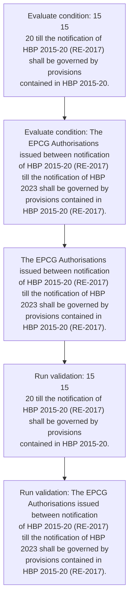
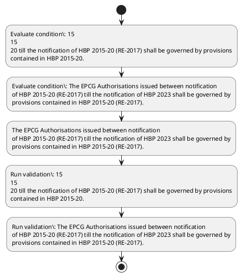

# Chapter 5 / Section 5.26: Green Technology Products

**Chapter Title:** Export Promotion Capital Goods (EPCG) Scheme

**Pages:** 15

**Purpose:** 5.26 Green Technology Products
The Export Products covered under Paragraph 5.10 of FTP which provides for
reduced export obligation of 75% for green technology products are:
(i) Solar Energy Generating Systems and parts/Equipments thereof,
(ii) Wind Energy Generating Systems and parts/equipment thereof,
(iii) LED lights of various kind,
(iv) Vapour Absorption Chillers,
(v) Waste Heat Boiler,
(vi) Waste Heat Recovery Units,
(vii) Unfired Heat Recovery Steam Generators,
(viii) Water Treatment Plants,
(ix) Battery Electric Vehicles (BEV) [other than Hybrid Electric Vehicles
(HEVs) and Plug-in Hybrid Electric Vehicle (PHEV)] of all types,
(x) Vertical Farming equipment,
(xi) Wastewater Treatment and Recycling,
(xii) Rainwater harvesting system and rainwater filters, and
(xiii) Green Hydrogen.

**Purpose Thanglish:** Indha Green Technology Products section-la, 5.26 Green Technology Products
The export Products covered under Paragraph 5.10 of FTP which provides for
reduced export obligation of 75% for green technology products are:
(i) Solar Energy Generating Systems and parts/Equipments thereof,
(ii) Wind Energy Generating Systems and parts/equipment thereof,
(iii) LED lights of various kind,
(iv) Vapour Absorption Chillers,
(v) Waste Heat Boiler,
(vi) Waste Heat Recovery Units,
(vii) Unfired Heat Recovery Steam Generators,
(viii) Water Treatment Plants,
(ix) Battery Electric Vehicles (BEV) [other than Hybrid Electric Vehicles
(HEVs) and Plug-in Hybrid Electric Vehicle (PHEV)] of all types,
(x) Vertical Farming equipment,
(xi) Wastewater Treatment and Recycling,
(xii) Rainwater harvesting system and rainwater filters, and
(xiii) Green Hydrogen.

**Summary:** 5.26 Green Technology Products
The Export Products covered under Paragraph 5.10 of FTP which provides for
reduced export obligation of 75% for green technology products are:
(i) Solar Energy Generating Systems and parts/Equipments thereof,
(ii) Wind Energy Generating Systems and parts/equipment thereof,
(iii) LED lights of various kind,
(iv) Vapour Absorption Chillers,
(v) Waste Heat Boiler,
(vi) Waste Heat Recovery Units,
(vii) Unfired Heat Recovery Steam Generators,
(viii) Water Treatment Plants,
(ix) Battery Electric Vehicles (BEV) [other than Hybrid Electric Vehicles
(HEVs) and Plug-in Hybrid Electric Vehicle (PHEV)] of all types,
(x) Vertical Farming equipment,
(xi) Wastewater Treatment and Recycling,
(xii) Rainwater harvesting system and rainwater filters, and
(xiii) Green Hydrogen. 15
15
20 till the notification of HBP 2015-20 (RE-2017) shall be governed by provisions
contained in HBP 2015-20. The EPCG Authorisations issued between notification
of HBP 2015-20 (RE-2017) till the notification of HBP 2023 shall be governed by
provisions contained in HBP 2015-20 (RE-2017).

**Business Meaning:** Green Technology Products governs how DGFT business controls should be applied, validated, and enforced.

**Business Explanation:** Green Technology Products explains the operating rule set that DEKAI should enforce. Key control points include 15
15
20 till the notification of HBP 2015-20 (RE-2017) shall be governed by provisions
contained in HBP 2015-20. The section also drives actions such as The EPCG Authorisations issued between notification
of HBP 2015-20 (RE-2017) till the notification of HBP 2023 shall be governed by
provisions contained in HBP 2015-20 (RE-2017)..

**Business Explanation Thanglish:** Indha Green Technology Products section-la, Green Technology Products explains the operating rule set that DEKAI should enforce. Key control points include 15
15
20 till the notification of HBP 2015-20 (RE-2017) kandippa be governed by provisions
contained in HBP 2015-20. The section also drives actions such as The EPCG Authorisations issued between notification
of HBP 2015-20 (RE-2017) till the notification of HBP 2023 kandippa be governed by
provisions contained in HBP 2015-20 (RE-2017)..

## Business Logic
- 15
15
20 till the notification of HBP 2015-20 (RE-2017) shall be governed by provisions
contained in HBP 2015-20.
- The EPCG Authorisations issued between notification
of HBP 2015-20 (RE-2017) till the notification of HBP 2023 shall be governed by
provisions contained in HBP 2015-20 (RE-2017).

## Business Rules
- rule_id=CH5-SEC5_26-R001, rule_description=15
15
20 till the notification of HBP 2015-20 (RE-2017) shall be governed by provisions
contained in HBP 2015-20., trigger=Green Technology Products, condition=15
15
20 till the notification of HBP 2015-20 (RE-2017) shall be governed by provisions
contained in HBP 2015-20., validation=15
15
20 till the notification of HBP 2015-20 (RE-2017) shall be governed by provisions
contained in HBP 2015-20., action=The EPCG Authorisations issued between notification
of HBP 2015-20 (RE-2017) till the notification of HBP 2023 shall be governed by
provisions contained in HBP 2015-20 (RE-2017)., exception=No explicit exception found in uploaded documents., output=DEKAI should produce a compliance decision for 5.26 - Green Technology Products.
- rule_id=CH5-SEC5_26-R002, rule_description=The EPCG Authorisations issued between notification
of HBP 2015-20 (RE-2017) till the notification of HBP 2023 shall be governed by
provisions contained in HBP 2015-20 (RE-2017)., trigger=Green Technology Products, condition=The EPCG Authorisations issued between notification
of HBP 2015-20 (RE-2017) till the notification of HBP 2023 shall be governed by
provisions contained in HBP 2015-20 (RE-2017)., validation=The EPCG Authorisations issued between notification
of HBP 2015-20 (RE-2017) till the notification of HBP 2023 shall be governed by
provisions contained in HBP 2015-20 (RE-2017)., action=The EPCG Authorisations issued between notification
of HBP 2015-20 (RE-2017) till the notification of HBP 2023 shall be governed by
provisions contained in HBP 2015-20 (RE-2017)., exception=No explicit exception found in uploaded documents., output=DEKAI should produce a compliance decision for 5.26 - Green Technology Products.

## Conditions
- 15
15
20 till the notification of HBP 2015-20 (RE-2017) shall be governed by provisions
contained in HBP 2015-20.
- The EPCG Authorisations issued between notification
of HBP 2015-20 (RE-2017) till the notification of HBP 2023 shall be governed by
provisions contained in HBP 2015-20 (RE-2017).

## Condition Logic
- id=5.5.26.1, if=15
15
20 till the notification of HBP 2015-20 (RE-2017) shall be governed by provisions
contained in HBP 2015-20., then=The EPCG Authorisations issued between notification
of HBP 2015-20 (RE-2017) till the notification of HBP 2023 shall be governed by
provisions contained in HBP 2015-20 (RE-2017)., source=15
15
20 till the notification of HBP 2015-20 (RE-2017) shall be governed by provisions
contained in HBP 2015-20.
- id=5.5.26.2, if=The EPCG Authorisations issued between notification
of HBP 2015-20 (RE-2017) till the notification of HBP 2023 shall be governed by
provisions contained in HBP 2015-20 (RE-2017)., then=The EPCG Authorisations issued between notification
of HBP 2015-20 (RE-2017) till the notification of HBP 2023 shall be governed by
provisions contained in HBP 2015-20 (RE-2017)., source=The EPCG Authorisations issued between notification
of HBP 2015-20 (RE-2017) till the notification of HBP 2023 shall be governed by
provisions contained in HBP 2015-20 (RE-2017).

## Validations
- 15
15
20 till the notification of HBP 2015-20 (RE-2017) shall be governed by provisions
contained in HBP 2015-20.
- The EPCG Authorisations issued between notification
of HBP 2015-20 (RE-2017) till the notification of HBP 2023 shall be governed by
provisions contained in HBP 2015-20 (RE-2017).

## Exceptions
- None identified

## Dependencies
- 5.10

## Authorities
- None identified

## Required Documents
- None identified

## Timelines
- None identified

## Actions
- The EPCG Authorisations issued between notification
of HBP 2015-20 (RE-2017) till the notification of HBP 2023 shall be governed by
provisions contained in HBP 2015-20 (RE-2017).

## Workflow
- Evaluate condition: 15
15
20 till the notification of HBP 2015-20 (RE-2017) shall be governed by provisions
contained in HBP 2015-20.
- Evaluate condition: The EPCG Authorisations issued between notification
of HBP 2015-20 (RE-2017) till the notification of HBP 2023 shall be governed by
provisions contained in HBP 2015-20 (RE-2017).
- The EPCG Authorisations issued between notification
of HBP 2015-20 (RE-2017) till the notification of HBP 2023 shall be governed by
provisions contained in HBP 2015-20 (RE-2017).
- Run validation: 15
15
20 till the notification of HBP 2015-20 (RE-2017) shall be governed by provisions
contained in HBP 2015-20.
- Run validation: The EPCG Authorisations issued between notification
of HBP 2015-20 (RE-2017) till the notification of HBP 2023 shall be governed by
provisions contained in HBP 2015-20 (RE-2017).

## Workflow ASCII
```text
Green Technology Products
Evaluate condition: 15
15
20 till the notification of HBP 2015-20 (RE-2017) shall be governed by provisions
contained in HBP 2015-20.
   |
   v
Evaluate condition: The EPCG Authorisations issued between notification
of HBP 2015-20 (RE-2017) till the notification of HBP 2023 shall be governed by
provisions contained in HBP 2015-20 (RE-2017).
   |
   v
The EPCG Authorisations issued between notification
of HBP 2015-20 (RE-2017) till the notification of HBP 2023 shall be governed by
provisions contained in HBP 2015-20 (RE-2017).
   |
   v
Run validation: 15
15
20 till the notification of HBP 2015-20 (RE-2017) shall be governed by provisions
contained in HBP 2015-20.
   |
   v
Run validation: The EPCG Authorisations issued between notification
of HBP 2015-20 (RE-2017) till the notification of HBP 2023 shall be governed by
provisions contained in HBP 2015-20 (RE-2017).
```

## Decision Tree
- IF 15
15
20 till the notification of HBP 2015-20 (RE-2017) shall be governed by provisions
contained in HBP 2015-20. THEN The EPCG Authorisations issued between notification
of HBP 2015-20 (RE-2017) till the notification of HBP 2023 shall be governed by
provisions contained in HBP 2015-20 (RE-2017).
- IF The EPCG Authorisations issued between notification
of HBP 2015-20 (RE-2017) till the notification of HBP 2023 shall be governed by
provisions contained in HBP 2015-20 (RE-2017). THEN The EPCG Authorisations issued between notification
of HBP 2015-20 (RE-2017) till the notification of HBP 2023 shall be governed by
provisions contained in HBP 2015-20 (RE-2017).

## Decision Tree ASCII
```text
Green Technology Products Decision
IF 15
15
20 till the notification of HBP 2015-20 (RE-2017) shall be governed by provisions
contained in HBP 2015-20. THEN The EPCG Authorisations issued between notification
of HBP 2015-20 (RE-2017) till the notification of HBP 2023 shall be governed by
provisions contained in HBP 2015-20 (RE-2017).
   |
   v
IF The EPCG Authorisations issued between notification
of HBP 2015-20 (RE-2017) till the notification of HBP 2023 shall be governed by
provisions contained in HBP 2015-20 (RE-2017). THEN The EPCG Authorisations issued between notification
of HBP 2015-20 (RE-2017) till the notification of HBP 2023 shall be governed by
provisions contained in HBP 2015-20 (RE-2017).
```

## Examples
- User asks to process Green Technology Products; the platform checks conditions, validations, and documents before action.

**Real-world Example:** Example: an importer or exporter invokes Green Technology Products, submits the prescribed DGFT records, and DEKAI uses the extracted rules to the epcg authorisations issued between notification
of hbp 2015-20 (re-2017) till the notification of hbp 2023 shall be governed by
provisions contained in hbp 2015-20 (re-2017)..

**Real-world Example Thanglish:** Indha Green Technology Products section-la, Example: an importer or exporter invokes Green Technology Products, submits the prescribed DGFT records, and DEKAI uses the extracted rules to the epcg authorisations issued between notification
of hbp 2015-20 (re-2017) till the notification of hbp 2023 kandippa be governed by
provisions contained in hbp 2015-20 (re-2017)..

## AI Rules
- IF detected context matches section rule THEN enforce: 15
15
20 till the notification of HBP 2015-20 (RE-2017) shall be governed by provisions
contained in HBP 2015-20.
- IF detected context matches section rule THEN enforce: The EPCG Authorisations issued between notification
of HBP 2015-20 (RE-2017) till the notification of HBP 2023 shall be governed by
provisions contained in HBP 2015-20 (RE-2017).
- IF validations pass THEN recommend action: The EPCG Authorisations issued between notification
of HBP 2015-20 (RE-2017) till the notification of HBP 2023 shall be governed by
provisions contained in HBP 2015-20 (RE-2017).

## Database Fields
- name=section_code, type=string, required=True, source=parsed_section_heading
- name=section_title, type=string, required=True, source=parsed_section_heading
- name=the_flag, type=boolean, required=False, source=keyword:The
- name=ftp_flag, type=boolean, required=False, source=keyword:FTP
- name=for_flag, type=boolean, required=False, source=keyword:for
- name=are_flag, type=boolean, required=False, source=keyword:are
- name=and_flag, type=boolean, required=False, source=keyword:and
- name=iii_flag, type=boolean, required=False, source=keyword:iii
- name=led_flag, type=boolean, required=False, source=keyword:LED
- name=vii_flag, type=boolean, required=False, source=keyword:vii

## API Requirements
- method=GET, path=/api/dgft/sections/5.26, purpose=Retrieve knowledge payload for section 5.26, query_params=['include=workflow,decision_tree,validations'], response_fields=['section', 'title', 'summary', 'conditions', 'validations', 'exceptions', 'workflow', 'decision_tree']
- method=POST, path=/api/dgft/Green-Technology-Products/validate, purpose=Validate inputs and documents for Green Technology Products, request_fields=['section_code', 'section_title'], response_fields=['status', 'errors', 'warnings', 'next_actions']
- method=POST, path=/api/dgft/Green-Technology-Products/execute, purpose=Trigger business action for The EPCG Authorisations issued between notification
of HBP 2015-20 (RE-2017) till the notification of HBP 2023 shall be governed by
provisions contained in HBP 2015-20 (RE-2017)., request_fields=['section_code', 'section_title'], response_fields=['reference_id', 'status', 'authority', 'timeline']

## UI Screens
- screen_id=Green_Technology_Products_overview, name=Green Technology Products Overview, purpose=Show section summary, authority, timeline, and eligibility cues., widgets=['summary_card', 'conditions_table', 'authority_badges', 'timeline_panel']
- screen_id=Green_Technology_Products_submission, name=Green Technology Products Submission, purpose=Capture applicant data and supporting documents., widgets=['dynamic_form', 'document_uploader', 'validation_panel', 'next_action_footer'], fields=['section_code', 'section_title', 'the_flag', 'ftp_flag', 'for_flag', 'are_flag', 'and_flag', 'iii_flag']

## Error Messages
- Validation failed because the section requirements were not fully met.

## FAQ
- question_en=What is the purpose of section 5.26?, answer_en=Green Technology Products explains the operating rule set that DEKAI should enforce. Key control points include 15
15
20 till the notification of HBP 2015-20 (RE-2017) shall be governed by provisions
contained in HBP 2015-20. The section also drives actions such as The EPCG Authorisations issued between notification
of HBP 2015-20 (RE-2017) till the notification of HBP 2023 shall be governed by
provisions contained in HBP 2015-20 (RE-2017).., question_thanglish=Indha Green Technology Products section-la, What is the purpose of section 5.26?, answer_thanglish=Indha Green Technology Products section-la, Green Technology Products explains the operating rule set that DEKAI should enforce. Key control points include 15
15
20 till the notification of HBP 2015-20 (RE-2017) kandippa be governed by provisions
contained in HBP 2015-20. The section also drives actions such as The EPCG Authorisations issued between notification
of HBP 2015-20 (RE-2017) till the notification of HBP 2023 kandippa be governed by
provisions contained in HBP 2015-20 (RE-2017)..
- question_en=What documents are required under Green Technology Products?, answer_en=Not explicitly covered in uploaded documents., question_thanglish=Indha Green Technology Products section-la, What documents are required under Green Technology Products?, answer_thanglish=Indha Green Technology Products section-la, Not explicitly covered in uploaded documents.
- question_en=Which authority handles Green Technology Products?, answer_en=Not explicitly covered in uploaded documents., question_thanglish=Indha Green Technology Products section-la, Which authority handles Green Technology Products?, answer_thanglish=Indha Green Technology Products section-la, Not explicitly covered in uploaded documents.

## Questions Users May Ask
- What does Green Technology Products require?
- Which documents are needed for Green Technology Products?
- How does DEKAI validate Green Technology Products requests?
- What action should be taken for Green Technology Products?

## Expected AI Answers
- Green Technology Products requires the platform to interpret the section text, apply the extracted business rules, and present the correct next action.
- Required documents are inferred from the section text: no explicit documents were detected.
- DEKAI validates Green Technology Products by checking conditions, required documents, authority references, and exception clauses before recommending an outcome.
- The primary extracted action is: The EPCG Authorisations issued between notification
of HBP 2015-20 (RE-2017) till the notification of HBP 2023 shall be governed by
provisions contained in HBP 2015-20 (RE-2017).

## AI Q&A Examples
- question_en=User asks: How do I comply with Green Technology Products?, answer_en=AI answers: DEKAI should evaluate section 5.26, apply the extracted rules, and guide the user through Evaluate condition: 15
15
20 till the notification of HBP 2015-20 (RE-2017) shall be governed by provisions
contained in HBP 2015-20.., question_thanglish=Indha Green Technology Products section-la, User asks: How do I comply with Green Technology Products?, answer_thanglish=Indha Green Technology Products section-la, AI answers: DEKAI should evaluate section 5.26, apply the extracted rules, and guide the user through Evaluate condition: 15
15
20 till the notification of HBP 2015-20 (RE-2017) kandippa be governed by provisions
contained in HBP 2015-20..
- question_en=User asks: Which validations apply to Green Technology Products?, answer_en=AI answers: Applicable validations are 15
15
20 till the notification of HBP 2015-20 (RE-2017) shall be governed by provisions
contained in HBP 2015-20., The EPCG Authorisations issued between notification
of HBP 2015-20 (RE-2017) till the notification of HBP 2023 shall be governed by
provisions contained in HBP 2015-20 (RE-2017)., question_thanglish=Indha Green Technology Products section-la, User asks: Which validations apply to Green Technology Products?, answer_thanglish=Indha Green Technology Products section-la, AI answers: Applicable validations are 15
15
20 till the notification of HBP 2015-20 (RE-2017) kandippa be governed by provisions
contained in HBP 2015-20., The EPCG Authorisations issued between notification
of HBP 2015-20 (RE-2017) till the notification of HBP 2023 kandippa be governed by
provisions contained in HBP 2015-20 (RE-2017).

## DEKAI AI Implementation Notes
- Capture chapter 5, section 5.26, title, and page references as immutable knowledge metadata.
- Bind validations for Green Technology Products into a rule engine keyed by the rule IDs extracted for this section.
- Show contextual links to related sections: 5.10.

## DEKAI AI Implementation Notes Thanglish
- Indha Green Technology Products section-la, Capture chapter 5, section 5.26, title, and page references as immutable knowledge metadata.
- Indha Green Technology Products section-la, Bind validations for Green Technology Products into a rule engine keyed by the rule IDs extracted for this section.
- Indha Green Technology Products section-la, Show contextual links to related sections: 5.10.

## AI Metadata
- Keywords: The, FTP, for, are, and, iii, LED, vii, BEV, all, xii, HBP, RE-, Wind, kind, Heat, viii, than, HEVs, PHEV
- Search Keywords: The, FTP, for, are, and, iii, LED, vii, BEV, all, xii, HBP, RE-, Wind, kind, Heat, viii, than, HEVs, PHEV
- Intent: Support Green Technology Products processing and compliance validation.
- Tags: 5.26, Green Technology Products, business-rule, dgft
- Related Sections: 5.10
- Related Chapters: 
- Related Rules: 15
15
20 till the notification of HBP 2015-20 (RE-2017) shall be governed by provisions
contained in HBP 2015-20., The EPCG Authorisations issued between notification
of HBP 2015-20 (RE-2017) till the notification of HBP 2023 shall be governed by
provisions contained in HBP 2015-20 (RE-2017).

## Mermaid


## PlantUML

