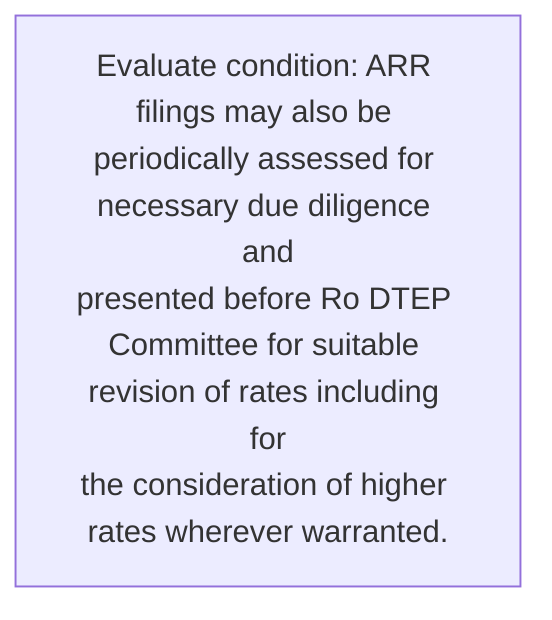
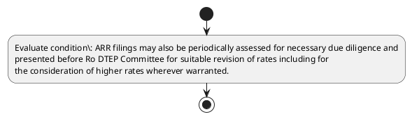

# Chapter 4 / Section 5: ARR filings may also be periodically assessed for necessary due diligence and

**Chapter Title:** Duty Exemption / Remission Schemes

**Pages:** 55

**Purpose:** ARR filings may also be periodically assessed for necessary due diligence and
presented before Ro DTEP Committee for suitable revision of rates including for
the consideration of higher rates wherever warranted.

**Purpose Thanglish:** Indha ARR filings may also be periodically assessed for necessary due diligence and section-la, ARR filings may also be periodically assessed for necessary due diligence and
presented before Ro DTEP Committee for suitable revision of rates including for
the consideration of higher rates wherever warranted.

**Summary:** 5. ARR filings may also be periodically assessed for necessary due diligence and
presented before Ro DTEP Committee for suitable revision of rates including for
the consideration of higher rates wherever warranted.

**Business Meaning:** 5.

**Business Explanation:** 5. ARR filings may also be periodically assessed for necessary due diligence and
presented before Ro DTEP Committee for suitable revision of rates including for
the consideration of higher rates wherever warranted.

**Business Explanation Thanglish:** Indha ARR filings may also be periodically assessed for necessary due diligence and section-la, 5. ARR filings may also be periodically assessed for necessary due diligence and
presented before Ro DTEP Committee for suitable revision of rates including for
the consideration of higher rates wherever warranted.

## Business Logic
- None identified

## Business Rules
- rule_id=CH4-SEC5-R001, rule_description=5. ARR filings may also be periodically assessed for necessary due diligence and
presented before Ro DTEP Committee for suitable revision of rates including for
the consideration of higher rates wherever warranted., trigger=ARR filings may also be periodically assessed for necessary due diligence and, condition=ARR filings may also be periodically assessed for necessary due diligence and
presented before Ro DTEP Committee for suitable revision of rates including for
the consideration of higher rates wherever warranted., validation=Not explicitly covered in uploaded documents., action=Manual review required., exception=No explicit exception found in uploaded documents., output=DEKAI should produce a compliance decision for 5 - ARR filings may also be periodically assessed for necessary due diligence and.

## Conditions
- ARR filings may also be periodically assessed for necessary due diligence and
presented before Ro DTEP Committee for suitable revision of rates including for
the consideration of higher rates wherever warranted.

## Condition Logic
- id=4.5.1, if=ARR filings may also be periodically assessed for necessary due diligence and
presented before Ro DTEP Committee for suitable revision of rates including for
the consideration of higher rates wherever warranted., then=Route for review, source=ARR filings may also be periodically assessed for necessary due diligence and
presented before Ro DTEP Committee for suitable revision of rates including for
the consideration of higher rates wherever warranted.

## Validations
- None identified

## Exceptions
- None identified

## Dependencies
- None identified

## Authorities
- Ro DTEP Committee

## Required Documents
- None identified

## Timelines
- ARR filings may also be periodically assessed for necessary due diligence and
presented before Ro DTEP Committee for suitable revision of rates including for
the consideration of higher rates wherever warranted.

## Actions
- None identified

## Workflow
- Evaluate condition: ARR filings may also be periodically assessed for necessary due diligence and
presented before Ro DTEP Committee for suitable revision of rates including for
the consideration of higher rates wherever warranted.

## Workflow ASCII
```text
ARR filings may also be periodically assessed for necessary due diligence and
Evaluate condition: ARR filings may also be periodically assessed for necessary due diligence and
presented before Ro DTEP Committee for suitable revision of rates including for
the consideration of higher rates wherever warranted.
```

## Decision Tree
- IF section 5 applies THEN proceed with standard DGFT workflow

## Decision Tree ASCII
```text
ARR filings may also be periodically assessed for necessary due diligence and Decision
IF section 5 applies THEN proceed with standard DGFT workflow
```

## Examples
- User asks to process ARR filings may also be periodically assessed for necessary due diligence and; the platform checks conditions, validations, and documents before action.

**Real-world Example:** Example: an importer or exporter invokes ARR filings may also be periodically assessed for necessary due diligence and, submits the prescribed DGFT records, and DEKAI uses the extracted rules to follow the arr filings may also be periodically assessed for necessary due diligence and process.

**Real-world Example Thanglish:** Indha ARR filings may also be periodically assessed for necessary due diligence and section-la, Example: an importer or exporter invokes ARR filings may also be periodically assessed for necessary due diligence and, submits the prescribed DGFT records, and DEKAI uses the extracted rules to follow the arr filings may also be periodically assessed for necessary due diligence and process.

## AI Rules
- None identified

## Database Fields
- name=section_code, type=string, required=True, source=parsed_section_heading
- name=section_title, type=string, required=True, source=parsed_section_heading
- name=arr_flag, type=boolean, required=False, source=keyword:ARR
- name=may_flag, type=boolean, required=False, source=keyword:may
- name=for_flag, type=boolean, required=False, source=keyword:for
- name=due_flag, type=boolean, required=False, source=keyword:due
- name=and_flag, type=boolean, required=False, source=keyword:and
- name=the_flag, type=boolean, required=False, source=keyword:the
- name=also_flag, type=boolean, required=False, source=keyword:also
- name=dtep_flag, type=boolean, required=False, source=keyword:DTEP

## API Requirements
- method=GET, path=/api/dgft/sections/5, purpose=Retrieve knowledge payload for section 5, query_params=['include=workflow,decision_tree,validations'], response_fields=['section', 'title', 'summary', 'conditions', 'validations', 'exceptions', 'workflow', 'decision_tree']
- method=POST, path=/api/dgft/ARR-filings-may-also-be-periodically-assessed-for-necessary-due-diligence-and/validate, purpose=Validate inputs and documents for ARR filings may also be periodically assessed for necessary due diligence and, request_fields=['section_code', 'section_title'], response_fields=['status', 'errors', 'warnings', 'next_actions']

## UI Screens
- screen_id=ARR_filings_may_also_be_periodically_assessed_for_necessary_due_diligence_and_overview, name=ARR filings may also be periodically assessed for necessary due diligence and Overview, purpose=Show section summary, authority, timeline, and eligibility cues., widgets=['summary_card', 'conditions_table', 'authority_badges', 'timeline_panel']
- screen_id=ARR_filings_may_also_be_periodically_assessed_for_necessary_due_diligence_and_submission, name=ARR filings may also be periodically assessed for necessary due diligence and Submission, purpose=Capture applicant data and supporting documents., widgets=['dynamic_form', 'document_uploader', 'validation_panel', 'next_action_footer'], fields=['section_code', 'section_title', 'arr_flag', 'may_flag', 'for_flag', 'due_flag', 'and_flag', 'the_flag']

## Error Messages
- Validation failed because the section requirements were not fully met.

## FAQ
- question_en=What is the purpose of section 5?, answer_en=5. ARR filings may also be periodically assessed for necessary due diligence and
presented before Ro DTEP Committee for suitable revision of rates including for
the consideration of higher rates wherever warranted., question_thanglish=Indha ARR filings may also be periodically assessed for necessary due diligence and section-la, What is the purpose of section 5?, answer_thanglish=Indha ARR filings may also be periodically assessed for necessary due diligence and section-la, 5. ARR filings may also be periodically assessed for necessary due diligence and
presented before Ro DTEP Committee for suitable revision of rates including for
the consideration of higher rates wherever warranted.
- question_en=What documents are required under ARR filings may also be periodically assessed for necessary due diligence and?, answer_en=Not explicitly covered in uploaded documents., question_thanglish=Indha ARR filings may also be periodically assessed for necessary due diligence and section-la, What documents are required under ARR filings may also be periodically assessed for necessary due diligence and?, answer_thanglish=Indha ARR filings may also be periodically assessed for necessary due diligence and section-la, Not explicitly covered in uploaded documents.
- question_en=Which authority handles ARR filings may also be periodically assessed for necessary due diligence and?, answer_en=Ro DTEP Committee, question_thanglish=Indha ARR filings may also be periodically assessed for necessary due diligence and section-la, Which authority handles ARR filings may also be periodically assessed for necessary due diligence and?, answer_thanglish=Indha ARR filings may also be periodically assessed for necessary due diligence and section-la, Ro DTEP Committee

## Questions Users May Ask
- What does ARR filings may also be periodically assessed for necessary due diligence and require?
- Which documents are needed for ARR filings may also be periodically assessed for necessary due diligence and?
- How does DEKAI validate ARR filings may also be periodically assessed for necessary due diligence and requests?

## Expected AI Answers
- ARR filings may also be periodically assessed for necessary due diligence and requires the platform to interpret the section text, apply the extracted business rules, and present the correct next action.
- Required documents are inferred from the section text: no explicit documents were detected.
- DEKAI validates ARR filings may also be periodically assessed for necessary due diligence and by checking conditions, required documents, authority references, and exception clauses before recommending an outcome.

## AI Q&A Examples
- question_en=User asks: How do I comply with ARR filings may also be periodically assessed for necessary due diligence and?, answer_en=AI answers: DEKAI should evaluate section 5, apply the extracted rules, and guide the user through Evaluate condition: ARR filings may also be periodically assessed for necessary due diligence and
presented before Ro DTEP Committee for suitable revision of rates including for
the consideration of higher rates wherever warranted.., question_thanglish=Indha ARR filings may also be periodically assessed for necessary due diligence and section-la, User asks: How do I comply with ARR filings may also be periodically assessed for necessary due diligence and?, answer_thanglish=Indha ARR filings may also be periodically assessed for necessary due diligence and section-la, AI answers: DEKAI should evaluate section 5, apply the extracted rules, and guide the user through Evaluate condition: ARR filings may also be periodically assessed for necessary due diligence and
presented before Ro DTEP Committee for suitable revision of rates including for
the consideration of higher rates wherever warranted..
- question_en=User asks: Which validations apply to ARR filings may also be periodically assessed for necessary due diligence and?, answer_en=AI answers: Applicable validations are not explicitly covered in the uploaded documents., question_thanglish=Indha ARR filings may also be periodically assessed for necessary due diligence and section-la, User asks: Which validations apply to ARR filings may also be periodically assessed for necessary due diligence and?, answer_thanglish=Indha ARR filings may also be periodically assessed for necessary due diligence and section-la, AI answers: Applicable validations are not explicitly covered in the uploaded documents.

## DEKAI AI Implementation Notes
- Capture chapter 4, section 5, title, and page references as immutable knowledge metadata.
- Bind validations for ARR filings may also be periodically assessed for necessary due diligence and into a rule engine keyed by the rule IDs extracted for this section.
- Route escalations or approvals to: Ro DTEP Committee.

## DEKAI AI Implementation Notes Thanglish
- Indha ARR filings may also be periodically assessed for necessary due diligence and section-la, Capture chapter 4, section 5, title, and page references as immutable knowledge metadata.
- Indha ARR filings may also be periodically assessed for necessary due diligence and section-la, Bind validations for ARR filings may also be periodically assessed for necessary due diligence and into a rule engine keyed by the rule IDs extracted for this section.
- Indha ARR filings may also be periodically assessed for necessary due diligence and section-la, Route escalations or approvals to: Ro DTEP Committee.

## AI Metadata
- Keywords: ARR, may, for, due, and, the, also, DTEP, rates, before, higher, filings, assessed, suitable, revision, wherever, necessary, diligence, presented, Committee
- Search Keywords: ARR, may, for, due, and, the, also, DTEP, rates, before, higher, filings, assessed, suitable, revision, wherever, necessary, diligence, presented, Committee
- Intent: Provide knowledge guidance for ARR filings may also be periodically assessed for necessary due diligence and.
- Tags: 5, ARR filings may also be periodically assessed for necessary due diligence and, dgft
- Related Sections: 
- Related Chapters: 
- Related Rules: 

## Mermaid


## PlantUML

