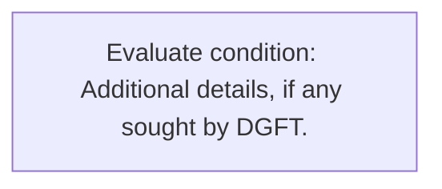
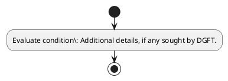

# Chapter 10 / Section 5: Additional details, if any sought by DGFT.

**Chapter Title:** SCOMET: Special Chemicals, Organisms, Materials, Equipment and Technologies

**Pages:** 34

**Purpose:** Defines the operational requirements for Additional details, if any sought by DGFT..

**Purpose Thanglish:** Indha Additional details, if any sought by DGFT. section-la, Defines the operational requirements for Additional details, if any sought by DGFT..

**Summary:** 5. Additional details, if any sought by DGFT.

**Business Meaning:** 5.

**Business Explanation:** 5. Additional details, if any sought by DGFT.

**Business Explanation Thanglish:** Indha Additional details, if any sought by DGFT. section-la, 5. Additional details, if any sought by DGFT.

## Business Logic
- None identified

## Business Rules
- rule_id=CH10-SEC5-R001, rule_description=5. Additional details, if any sought by DGFT., trigger=Additional details, if any sought by DGFT., condition=Additional details, if any sought by DGFT., validation=Not explicitly covered in uploaded documents., action=Manual review required., exception=No explicit exception found in uploaded documents., output=DEKAI should produce a compliance decision for 5 - Additional details, if any sought by DGFT..

## Conditions
- Additional details, if any sought by DGFT.

## Condition Logic
- id=10.5.1, if=Additional details, if any sought by DGFT., then=Route for review, source=Additional details, if any sought by DGFT.

## Validations
- None identified

## Exceptions
- None identified

## Dependencies
- None identified

## Authorities
- DGFT

## Required Documents
- None identified

## Timelines
- None identified

## Actions
- None identified

## Workflow
- Evaluate condition: Additional details, if any sought by DGFT.

## Workflow ASCII
```text
Additional details, if any sought by DGFT.
Evaluate condition: Additional details, if any sought by DGFT.
```

## Decision Tree
- IF section 5 applies THEN proceed with standard DGFT workflow

## Decision Tree ASCII
```text
Additional details, if any sought by DGFT. Decision
IF section 5 applies THEN proceed with standard DGFT workflow
```

## Examples
- User asks to process Additional details, if any sought by DGFT.; the platform checks conditions, validations, and documents before action.

**Real-world Example:** Example: an importer or exporter invokes Additional details, if any sought by DGFT., submits the prescribed DGFT records, and DEKAI uses the extracted rules to follow the additional details, if any sought by dgft. process.

**Real-world Example Thanglish:** Indha Additional details, if any sought by DGFT. section-la, Example: an importer or exporter invokes Additional details, if any sought by DGFT., submits the prescribed DGFT records, and DEKAI uses the extracted rules to follow the additional details, if any sought by dgft. process.

## AI Rules
- None identified

## Database Fields
- name=section_code, type=string, required=True, source=parsed_section_heading
- name=section_title, type=string, required=True, source=parsed_section_heading
- name=any_flag, type=boolean, required=False, source=keyword:any
- name=dgft_flag, type=boolean, required=False, source=keyword:DGFT
- name=sought_flag, type=boolean, required=False, source=keyword:sought
- name=details_flag, type=boolean, required=False, source=keyword:details
- name=additional_flag, type=boolean, required=False, source=keyword:Additional

## API Requirements
- method=GET, path=/api/dgft/sections/5, purpose=Retrieve knowledge payload for section 5, query_params=['include=workflow,decision_tree,validations'], response_fields=['section', 'title', 'summary', 'conditions', 'validations', 'exceptions', 'workflow', 'decision_tree']
- method=POST, path=/api/dgft/Additional-details-if-any-sought-by-DGFT/validate, purpose=Validate inputs and documents for Additional details, if any sought by DGFT., request_fields=['section_code', 'section_title'], response_fields=['status', 'errors', 'warnings', 'next_actions']

## UI Screens
- screen_id=Additional_details_if_any_sought_by_DGFT_overview, name=Additional details, if any sought by DGFT. Overview, purpose=Show section summary, authority, timeline, and eligibility cues., widgets=['summary_card', 'conditions_table', 'authority_badges', 'timeline_panel']
- screen_id=Additional_details_if_any_sought_by_DGFT_submission, name=Additional details, if any sought by DGFT. Submission, purpose=Capture applicant data and supporting documents., widgets=['dynamic_form', 'document_uploader', 'validation_panel', 'next_action_footer'], fields=['section_code', 'section_title', 'any_flag', 'dgft_flag', 'sought_flag', 'details_flag', 'additional_flag']

## Error Messages
- Validation failed because the section requirements were not fully met.

## FAQ
- question_en=What is the purpose of section 5?, answer_en=5. Additional details, if any sought by DGFT., question_thanglish=Indha Additional details, if any sought by DGFT. section-la, What is the purpose of section 5?, answer_thanglish=Indha Additional details, if any sought by DGFT. section-la, 5. Additional details, if any sought by DGFT.
- question_en=What documents are required under Additional details, if any sought by DGFT.?, answer_en=Not explicitly covered in uploaded documents., question_thanglish=Indha Additional details, if any sought by DGFT. section-la, What documents are required under Additional details, if any sought by DGFT.?, answer_thanglish=Indha Additional details, if any sought by DGFT. section-la, Not explicitly covered in uploaded documents.
- question_en=Which authority handles Additional details, if any sought by DGFT.?, answer_en=DGFT, question_thanglish=Indha Additional details, if any sought by DGFT. section-la, Which authority handles Additional details, if any sought by DGFT.?, answer_thanglish=Indha Additional details, if any sought by DGFT. section-la, DGFT

## Questions Users May Ask
- What does Additional details, if any sought by DGFT. require?
- Which documents are needed for Additional details, if any sought by DGFT.?
- How does DEKAI validate Additional details, if any sought by DGFT. requests?

## Expected AI Answers
- Additional details, if any sought by DGFT. requires the platform to interpret the section text, apply the extracted business rules, and present the correct next action.
- Required documents are inferred from the section text: no explicit documents were detected.
- DEKAI validates Additional details, if any sought by DGFT. by checking conditions, required documents, authority references, and exception clauses before recommending an outcome.

## AI Q&A Examples
- question_en=User asks: How do I comply with Additional details, if any sought by DGFT.?, answer_en=AI answers: DEKAI should evaluate section 5, apply the extracted rules, and guide the user through Evaluate condition: Additional details, if any sought by DGFT.., question_thanglish=Indha Additional details, if any sought by DGFT. section-la, User asks: How do I comply with Additional details, if any sought by DGFT.?, answer_thanglish=Indha Additional details, if any sought by DGFT. section-la, AI answers: DEKAI should evaluate section 5, apply the extracted rules, and guide the user through Evaluate condition: Additional details, if any sought by DGFT..
- question_en=User asks: Which validations apply to Additional details, if any sought by DGFT.?, answer_en=AI answers: Applicable validations are not explicitly covered in the uploaded documents., question_thanglish=Indha Additional details, if any sought by DGFT. section-la, User asks: Which validations apply to Additional details, if any sought by DGFT.?, answer_thanglish=Indha Additional details, if any sought by DGFT. section-la, AI answers: Applicable validations are not explicitly covered in the uploaded documents.

## DEKAI AI Implementation Notes
- Capture chapter 10, section 5, title, and page references as immutable knowledge metadata.
- Bind validations for Additional details, if any sought by DGFT. into a rule engine keyed by the rule IDs extracted for this section.
- Route escalations or approvals to: DGFT.

## DEKAI AI Implementation Notes Thanglish
- Indha Additional details, if any sought by DGFT. section-la, Capture chapter 10, section 5, title, and page references as immutable knowledge metadata.
- Indha Additional details, if any sought by DGFT. section-la, Bind validations for Additional details, if any sought by DGFT. into a rule engine keyed by the rule IDs extracted for this section.
- Indha Additional details, if any sought by DGFT. section-la, Route escalations or approvals to: DGFT.

## AI Metadata
- Keywords: any, DGFT, sought, details, Additional
- Search Keywords: any, DGFT, sought, details, Additional
- Intent: Provide knowledge guidance for Additional details, if any sought by DGFT..
- Tags: 5, Additional details, if any sought by DGFT., dgft
- Related Sections: 
- Related Chapters: 
- Related Rules: 

## Mermaid


## PlantUML

