# Chapter 10 / Section 5: Authorized Economic Operator (AEO) Certification along with ICP

**Chapter Title:** SCOMET: Special Chemicals, Organisms, Materials, Equipment and Technologies

**Pages:** 17, 18

**Purpose:** [for re-export to vendors/OEMs]
pg.

**Purpose Thanglish:** Indha Authorized Economic Operator (AEO) Certification along with ICP section-la, [for re-export to vendors/OEMs]
pg.

**Summary:** 5. Authorized Economic Operator (AEO) Certification along with ICP
compliance. [for re-export to vendors/OEMs]
pg.

**Business Meaning:** Authorized Economic Operator (AEO) Certification along with ICP governs how DGFT business controls should be applied, validated, and enforced.

**Business Explanation:** Authorized Economic Operator (AEO) Certification along with ICP explains the operating rule set that DEKAI should enforce. Key control points include That Shipping Bills and Bill of Entry into destination country of subsequent
re-exports and any other information as sought by DGFT shall be submitted to
DGFT on quarterly basis. The section also drives actions such as That Shipping Bills and Bill of Entry into destination country of subsequent
re-exports and any other information as sought by DGFT shall be submitted to
DGFT on quarterly basis..

**Business Explanation Thanglish:** Indha Authorized Economic Operator (AEO) Certification along with ICP section-la, Authorized Economic Operator (AEO) Certification along with ICP explains the operating rule set that DEKAI should enforce. Key control points include That Shipping Bills and Bill of Entry into destination country of subsequent
re-exports and any other information as sought by DGFT kandippa be submitted to
DGFT on quarterly basis. The section also drives actions such as That Shipping Bills and Bill of Entry into destination country of subsequent
re-exports and any other information as sought by DGFT kandippa be submitted to
DGFT on quarterly basis..

## Business Logic
- That Shipping Bills and Bill of Entry into destination country of subsequent
re-exports and any other information as sought by DGFT shall be submitted to
DGFT on quarterly basis.
- The Indian exporter shall submit post-shipment details of each
transfer/consignment of exports of SCOMET items/software/technology
under GAER to the SCOMET Division of DGFT (HQ), New Delhi, via e-mail
(scomet-dgft@nic.in) or a procedure as prescribed by DGFT, on quarterly
basis (March/June/September/December), by the end of subsequent
month of each quarter, in respect of the exports made in the previous
quarter.
- The post-shipment details shall include submission of Bill of Entry
(wherever available), shipping bill details, valid export license copy within
the timelines mentioned above.
- Suspension / Revocation
GAER issued shall be liable to be suspended / revoked by the DGFT on receipt
of an adverse report on proliferation concern or for non-submission of
mandatory reports /documents within the prescribed timelines, or for non-
compliance with the conditions of this Public Notice.
- DGFT shall reserve the right to deny issuance of GAER or recall GAER.
- Applications for grant of General authorizations for export to the same
entity from goods were imported shall be approved by Chairman IMWG,
without any consultation with IMWG members after the first
export/shipment.
- All such authorizations shall be brought before IMWG in its subsequent
meeting for confirmation of approval, on ex-post facto basis.

## Business Rules
- rule_id=CH10-SEC5-R001, rule_description=That Shipping Bills and Bill of Entry into destination country of subsequent
re-exports and any other information as sought by DGFT shall be submitted to
DGFT on quarterly basis., trigger=Authorized Economic Operator (AEO) Certification along with ICP, condition=Authorized Economic Operator (AEO) Certification along with ICP
compliance., validation=That Shipping Bills and Bill of Entry into destination country of subsequent
re-exports and any other information as sought by DGFT shall be submitted to
DGFT on quarterly basis., action=That Shipping Bills and Bill of Entry into destination country of subsequent
re-exports and any other information as sought by DGFT shall be submitted to
DGFT on quarterly basis., exception=In exceptional cases, consultation with IMWG may be done
prior to issuance of GAER, in case required., output=DEKAI should produce a compliance decision for 5 - Authorized Economic Operator (AEO) Certification along with ICP.
- rule_id=CH10-SEC5-R002, rule_description=The Indian exporter shall submit post-shipment details of each
transfer/consignment of exports of SCOMET items/software/technology
under GAER to the SCOMET Division of DGFT (HQ), New Delhi, via e-mail
(scomet-dgft@nic.in) or a procedure as prescribed by DGFT, on quarterly
basis (March/June/September/December), by the end of subsequent
month of each quarter, in respect of the exports made in the previous
quarter., trigger=Authorized Economic Operator (AEO) Certification along with ICP, condition=Details of imported items to be exported after repair along with their
SCOMET Category /Sub-category number(s), quantity, item description and ECCN
of foreign country (if available);
b., validation=Certified/approved Internal Compliance Programme or demonstrating
compliance to the ICP of the foreign company or ICP certified by the compliance
manager of that company., action=Certified/approved Internal Compliance Programme or demonstrating
compliance to the ICP of the foreign company or ICP certified by the compliance
manager of that company., exception=In exceptional cases, consultation with IMWG may be done
prior to issuance of GAER, in case required., output=DEKAI should produce a compliance decision for 5 - Authorized Economic Operator (AEO) Certification along with ICP.
- rule_id=CH10-SEC5-R003, rule_description=The post-shipment details shall include submission of Bill of Entry
(wherever available), shipping bill details, valid export license copy within
the timelines mentioned above., trigger=Authorized Economic Operator (AEO) Certification along with ICP, condition=That
there
has
been
no
change
to
the
original
characteristics/specifications of the item(s) after import and no value addition
has been done during the repair work;
d., validation=The Indian exporter shall submit post-shipment details of each
transfer/consignment of exports of SCOMET items/software/technology
under GAER to the SCOMET Division of DGFT (HQ), New Delhi, via e-mail
(scomet-dgft@nic.in) or a procedure as prescribed by DGFT, on quarterly
basis (March/June/September/December), by the end of subsequent
month of each quarter, in respect of the exports made in the previous
quarter., action=Post reporting for re-export of items/software/technology
under GAER
i., exception=In exceptional cases, consultation with IMWG may be done
prior to issuance of GAER, in case required., output=DEKAI should produce a compliance decision for 5 - Authorized Economic Operator (AEO) Certification along with ICP.
- rule_id=CH10-SEC5-R004, rule_description=Suspension / Revocation
GAER issued shall be liable to be suspended / revoked by the DGFT on receipt
of an adverse report on proliferation concern or for non-submission of
mandatory reports /documents within the prescribed timelines, or for non-
compliance with the conditions of this Public Notice., trigger=Authorized Economic Operator (AEO) Certification along with ICP, condition=Certified/approved Internal Compliance Programme or demonstrating
compliance to the ICP of the foreign company or ICP certified by the compliance
manager of that company., validation=The post-shipment details shall include submission of Bill of Entry
(wherever available), shipping bill details, valid export license copy within
the timelines mentioned above., action=The Indian exporter shall submit post-shipment details of each
transfer/consignment of exports of SCOMET items/software/technology
under GAER to the SCOMET Division of DGFT (HQ), New Delhi, via e-mail
(scomet-dgft@nic.in) or a procedure as prescribed by DGFT, on quarterly
basis (March/June/September/December), by the end of subsequent
month of each quarter, in respect of the exports made in the previous
quarter., exception=In exceptional cases, consultation with IMWG may be done
prior to issuance of GAER, in case required., output=DEKAI should produce a compliance decision for 5 - Authorized Economic Operator (AEO) Certification along with ICP.
- rule_id=CH10-SEC5-R005, rule_description=DGFT shall reserve the right to deny issuance of GAER or recall GAER., trigger=Authorized Economic Operator (AEO) Certification along with ICP, condition=The post-shipment details shall include submission of Bill of Entry
(wherever available), shipping bill details, valid export license copy within
the timelines mentioned above., validation=Suspension / Revocation
GAER issued shall be liable to be suspended / revoked by the DGFT on receipt
of an adverse report on proliferation concern or for non-submission of
mandatory reports /documents within the prescribed timelines, or for non-
compliance with the conditions of this Public Notice., action=Suspension / Revocation
GAER issued shall be liable to be suspended / revoked by the DGFT on receipt
of an adverse report on proliferation concern or for non-submission of
mandatory reports /documents within the prescribed timelines, or for non-
compliance with the conditions of this Public Notice., exception=In exceptional cases, consultation with IMWG may be done
prior to issuance of GAER, in case required., output=DEKAI should produce a compliance decision for 5 - Authorized Economic Operator (AEO) Certification along with ICP.
- rule_id=CH10-SEC5-R006, rule_description=Applications for grant of General authorizations for export to the same
entity from goods were imported shall be approved by Chairman IMWG,
without any consultation with IMWG members after the first
export/shipment., trigger=Authorized Economic Operator (AEO) Certification along with ICP, condition=Suspension / Revocation
GAER issued shall be liable to be suspended / revoked by the DGFT on receipt
of an adverse report on proliferation concern or for non-submission of
mandatory reports /documents within the prescribed timelines, or for non-
compliance with the conditions of this Public Notice., validation=DGFT shall reserve the right to deny issuance of GAER or recall GAER., action=GAER would not be issued in case of items to be used to design, develop,
acquire, manufacture, possess, transport, transfer and/or used for
chemical, biological, nuclear weapons or for missiles capable of delivering
weapons of mass destruction and their delivery system;
ii., exception=In exceptional cases, consultation with IMWG may be done
prior to issuance of GAER, in case required., output=DEKAI should produce a compliance decision for 5 - Authorized Economic Operator (AEO) Certification along with ICP.
- rule_id=CH10-SEC5-R007, rule_description=All such authorizations shall be brought before IMWG in its subsequent
meeting for confirmation of approval, on ex-post facto basis., trigger=Authorized Economic Operator (AEO) Certification along with ICP, condition=GAER would not be issued in case of items to be used to design, develop,
acquire, manufacture, possess, transport, transfer and/or used for
chemical, biological, nuclear weapons or for missiles capable of delivering
weapons of mass destruction and their delivery system;
ii., validation=Applications for grant of General authorizations for export to the same
entity from goods were imported shall be approved by Chairman IMWG,
without any consultation with IMWG members after the first
export/shipment., action=GAER would not be issued for countries or entities covered under UNSC
embargo/sanctions or on assessment of proliferation concerns, or
national security and foreign policy considerations, etc.;
iii., exception=In exceptional cases, consultation with IMWG may be done
prior to issuance of GAER, in case required., output=DEKAI should produce a compliance decision for 5 - Authorized Economic Operator (AEO) Certification along with ICP.

## Conditions
- Authorized Economic Operator (AEO) Certification along with ICP
compliance.
- Details of imported items to be exported after repair along with their
SCOMET Category /Sub-category number(s), quantity, item description and ECCN
of foreign country (if available);
b.
- That
there
has
been
no
change
to
the
original
characteristics/specifications of the item(s) after import and no value addition
has been done during the repair work;
d.
- Certified/approved Internal Compliance Programme or demonstrating
compliance to the ICP of the foreign company or ICP certified by the compliance
manager of that company.
- The post-shipment details shall include submission of Bill of Entry
(wherever available), shipping bill details, valid export license copy within
the timelines mentioned above.
- Suspension / Revocation
GAER issued shall be liable to be suspended / revoked by the DGFT on receipt
of an adverse report on proliferation concern or for non-submission of
mandatory reports /documents within the prescribed timelines, or for non-
compliance with the conditions of this Public Notice.
- GAER would not be issued in case of items to be used to design, develop,
acquire, manufacture, possess, transport, transfer and/or used for
chemical, biological, nuclear weapons or for missiles capable of delivering
weapons of mass destruction and their delivery system;
ii.
- GAER would not be issued for countries or entities covered under UNSC
embargo/sanctions or on assessment of proliferation concerns, or
national security and foreign policy considerations, etc.;
iii.
- Applications for grant of General authorizations for export to the same
entity from goods were imported shall be approved by Chairman IMWG,
without any consultation with IMWG members after the first
export/shipment.
- In exceptional cases, consultation with IMWG may be done
prior to issuance of GAER, in case required.
- All such authorizations shall be brought before IMWG in its subsequent
meeting for confirmation of approval, on ex-post facto basis.

## Condition Logic
- id=10.5.1, if=Authorized Economic Operator (AEO) Certification along with ICP
compliance., then=That Shipping Bills and Bill of Entry into destination country of subsequent
re-exports and any other information as sought by DGFT shall be submitted to
DGFT on quarterly basis., source=Authorized Economic Operator (AEO) Certification along with ICP
compliance.
- id=10.5.2, if=Details of imported items to be exported after repair along with their
SCOMET Category /Sub-category number(s), quantity, item description and ECCN
of foreign country (if available);
b., then=That Shipping Bills and Bill of Entry into destination country of subsequent
re-exports and any other information as sought by DGFT shall be submitted to
DGFT on quarterly basis., source=Details of imported items to be exported after repair along with their
SCOMET Category /Sub-category number(s), quantity, item description and ECCN
of foreign country (if available);
b.
- id=10.5.3, if=That
there
has
been
no
change
to
the
original
characteristics/specifications of the item(s) after import and no value addition
has been done during the repair work;
d., then=That Shipping Bills and Bill of Entry into destination country of subsequent
re-exports and any other information as sought by DGFT shall be submitted to
DGFT on quarterly basis., source=That
there
has
been
no
change
to
the
original
characteristics/specifications of the item(s) after import and no value addition
has been done during the repair work;
d.
- id=10.5.4, if=Certified/approved Internal Compliance Programme or demonstrating
compliance to the ICP of the foreign company or ICP certified by the compliance
manager of that company., then=That Shipping Bills and Bill of Entry into destination country of subsequent
re-exports and any other information as sought by DGFT shall be submitted to
DGFT on quarterly basis., source=Certified/approved Internal Compliance Programme or demonstrating
compliance to the ICP of the foreign company or ICP certified by the compliance
manager of that company.
- id=10.5.5, if=The post-shipment details shall include submission of Bill of Entry
(wherever available), shipping bill details, valid export license copy within
the timelines mentioned above., then=That Shipping Bills and Bill of Entry into destination country of subsequent
re-exports and any other information as sought by DGFT shall be submitted to
DGFT on quarterly basis., source=The post-shipment details shall include submission of Bill of Entry
(wherever available), shipping bill details, valid export license copy within
the timelines mentioned above.
- id=10.5.6, if=Suspension / Revocation
GAER issued shall be liable to be suspended / revoked by the DGFT on receipt
of an adverse report on proliferation concern or for non-submission of
mandatory reports /documents within the prescribed timelines, or for non-
compliance with the conditions of this Public Notice., then=That Shipping Bills and Bill of Entry into destination country of subsequent
re-exports and any other information as sought by DGFT shall be submitted to
DGFT on quarterly basis., source=Suspension / Revocation
GAER issued shall be liable to be suspended / revoked by the DGFT on receipt
of an adverse report on proliferation concern or for non-submission of
mandatory reports /documents within the prescribed timelines, or for non-
compliance with the conditions of this Public Notice.
- id=10.5.7, if=GAER would not be issued in case of items to be used to design, develop,
acquire, manufacture, possess, transport, transfer and/or used for
chemical, biological, nuclear weapons or for missiles capable of delivering
weapons of mass destruction and their delivery system;
ii., then=That Shipping Bills and Bill of Entry into destination country of subsequent
re-exports and any other information as sought by DGFT shall be submitted to
DGFT on quarterly basis., source=GAER would not be issued in case of items to be used to design, develop,
acquire, manufacture, possess, transport, transfer and/or used for
chemical, biological, nuclear weapons or for missiles capable of delivering
weapons of mass destruction and their delivery system;
ii.
- id=10.5.8, if=GAER would not be issued for countries or entities covered under UNSC
embargo/sanctions or on assessment of proliferation concerns, or
national security and foreign policy considerations, etc.;
iii., then=That Shipping Bills and Bill of Entry into destination country of subsequent
re-exports and any other information as sought by DGFT shall be submitted to
DGFT on quarterly basis., source=GAER would not be issued for countries or entities covered under UNSC
embargo/sanctions or on assessment of proliferation concerns, or
national security and foreign policy considerations, etc.;
iii.
- id=10.5.9, if=Applications for grant of General authorizations for export to the same
entity from goods were imported shall be approved by Chairman IMWG,
without any consultation with IMWG members after the first
export/shipment., then=That Shipping Bills and Bill of Entry into destination country of subsequent
re-exports and any other information as sought by DGFT shall be submitted to
DGFT on quarterly basis., source=Applications for grant of General authorizations for export to the same
entity from goods were imported shall be approved by Chairman IMWG,
without any consultation with IMWG members after the first
export/shipment.
- id=10.5.10, if=In exceptional cases, consultation with IMWG may be done
prior to issuance of GAER, in case required., then=That Shipping Bills and Bill of Entry into destination country of subsequent
re-exports and any other information as sought by DGFT shall be submitted to
DGFT on quarterly basis., source=In exceptional cases, consultation with IMWG may be done
prior to issuance of GAER, in case required.
- id=10.5.11, if=All such authorizations shall be brought before IMWG in its subsequent
meeting for confirmation of approval, on ex-post facto basis., then=That Shipping Bills and Bill of Entry into destination country of subsequent
re-exports and any other information as sought by DGFT shall be submitted to
DGFT on quarterly basis., source=All such authorizations shall be brought before IMWG in its subsequent
meeting for confirmation of approval, on ex-post facto basis.

## Validations
- That Shipping Bills and Bill of Entry into destination country of subsequent
re-exports and any other information as sought by DGFT shall be submitted to
DGFT on quarterly basis.
- Certified/approved Internal Compliance Programme or demonstrating
compliance to the ICP of the foreign company or ICP certified by the compliance
manager of that company.
- The Indian exporter shall submit post-shipment details of each
transfer/consignment of exports of SCOMET items/software/technology
under GAER to the SCOMET Division of DGFT (HQ), New Delhi, via e-mail
(scomet-dgft@nic.in) or a procedure as prescribed by DGFT, on quarterly
basis (March/June/September/December), by the end of subsequent
month of each quarter, in respect of the exports made in the previous
quarter.
- The post-shipment details shall include submission of Bill of Entry
(wherever available), shipping bill details, valid export license copy within
the timelines mentioned above.
- Suspension / Revocation
GAER issued shall be liable to be suspended / revoked by the DGFT on receipt
of an adverse report on proliferation concern or for non-submission of
mandatory reports /documents within the prescribed timelines, or for non-
compliance with the conditions of this Public Notice.
- DGFT shall reserve the right to deny issuance of GAER or recall GAER.
- Applications for grant of General authorizations for export to the same
entity from goods were imported shall be approved by Chairman IMWG,
without any consultation with IMWG members after the first
export/shipment.
- In exceptional cases, consultation with IMWG may be done
prior to issuance of GAER, in case required.
- All such authorizations shall be brought before IMWG in its subsequent
meeting for confirmation of approval, on ex-post facto basis.

## Exceptions
- In exceptional cases, consultation with IMWG may be done
prior to issuance of GAER, in case required.

## Dependencies
- 1
- 3
- 4

## Authorities
- DGFT
- GAER to the SCOMET Division of DGFT
- GAER issued shall be liable to be suspended / revoked by the DGFT

## Required Documents
- 185
Contract agreement and/or ‘Statement of Work (SOW)’/ Master Service
agreement (MSA) between Indian exporter and with the entity abroad/Direct
subsidiary/Parent of the Indian Company or another subsidiary of the foreign
parent of the Indian Company/Authorised Vendor/Original Equipment
manufacturer having EMS agreement/Master service agreement/ contract with
Indian Company from (which the goods were imported initially) defining
conditions for undertaking repair in India
3.
- An Undertaking from the Indian exporter;
An Undertaking from the applicant exporter (on the letter head of the firm duly
signed and stamped by the authorized signatory) stating:
a.
- That Shipping Bills and Bill
- That items would not use for military applications or to develop, acquire,
manufacture, possess, transport, transfer or use, chemical, biological, nuclear
weapons or for missile capable of delivering such weapons.
- The post-shipment details shall include submission of Bill
- Suspension / Revocation
GAER issued shall be liable to be suspended / revoked by the DGFT on receipt
of an adverse report on proliferation concern or for non-submission of
mandatory reports /documents within the prescribed timelines, or for non-
compliance with the conditions of this Public Notice.
- Applications for grant of General authorizations for export to the same
entity from goods were imported shall be approved by Chairman IMWG,
without any consultation with IMWG members after the first
export/shipment.

## Timelines
- Details of imported items to be exported after repair along with their
SCOMET Category /Sub-category number(s), quantity, item description and ECCN
of foreign country (if available);
b.
- That
there
has
been
no
change
to
the
original
characteristics/specifications of the item(s) after import and no value addition
has been done during the repair work;
d.
- The post-shipment details shall include submission of Bill of Entry
(wherever available), shipping bill details, valid export license copy within
the timelines mentioned above.
- Suspension / Revocation
GAER issued shall be liable to be suspended / revoked by the DGFT on receipt
of an adverse report on proliferation concern or for non-submission of
mandatory reports /documents within the prescribed timelines, or for non-
compliance with the conditions of this Public Notice.
- Applications for grant of General authorizations for export to the same
entity from goods were imported shall be approved by Chairman IMWG,
without any consultation with IMWG members after the first
export/shipment.
- All such authorizations shall be brought before IMWG in its subsequent
meeting for confirmation of approval, on ex-post facto basis.

## Actions
- That Shipping Bills and Bill of Entry into destination country of subsequent
re-exports and any other information as sought by DGFT shall be submitted to
DGFT on quarterly basis.
- Certified/approved Internal Compliance Programme or demonstrating
compliance to the ICP of the foreign company or ICP certified by the compliance
manager of that company.
- Post reporting for re-export of items/software/technology
under GAER
i.
- The Indian exporter shall submit post-shipment details of each
transfer/consignment of exports of SCOMET items/software/technology
under GAER to the SCOMET Division of DGFT (HQ), New Delhi, via e-mail
(scomet-dgft@nic.in) or a procedure as prescribed by DGFT, on quarterly
basis (March/June/September/December), by the end of subsequent
month of each quarter, in respect of the exports made in the previous
quarter.
- Suspension / Revocation
GAER issued shall be liable to be suspended / revoked by the DGFT on receipt
of an adverse report on proliferation concern or for non-submission of
mandatory reports /documents within the prescribed timelines, or for non-
compliance with the conditions of this Public Notice.
- GAER would not be issued in case of items to be used to design, develop,
acquire, manufacture, possess, transport, transfer and/or used for
chemical, biological, nuclear weapons or for missiles capable of delivering
weapons of mass destruction and their delivery system;
ii.
- GAER would not be issued for countries or entities covered under UNSC
embargo/sanctions or on assessment of proliferation concerns, or
national security and foreign policy considerations, etc.;
iii.
- Applications for grant of General authorizations for export to the same
entity from goods were imported shall be approved by Chairman IMWG,
without any consultation with IMWG members after the first
export/shipment.

## Workflow
- Evaluate condition: Authorized Economic Operator (AEO) Certification along with ICP
compliance.
- Evaluate condition: Details of imported items to be exported after repair along with their
SCOMET Category /Sub-category number(s), quantity, item description and ECCN
of foreign country (if available);
b.
- Evaluate condition: That
there
has
been
no
change
to
the
original
characteristics/specifications of the item(s) after import and no value addition
has been done during the repair work;
d.
- That Shipping Bills and Bill of Entry into destination country of subsequent
re-exports and any other information as sought by DGFT shall be submitted to
DGFT on quarterly basis.
- Certified/approved Internal Compliance Programme or demonstrating
compliance to the ICP of the foreign company or ICP certified by the compliance
manager of that company.
- Post reporting for re-export of items/software/technology
under GAER
i.
- The Indian exporter shall submit post-shipment details of each
transfer/consignment of exports of SCOMET items/software/technology
under GAER to the SCOMET Division of DGFT (HQ), New Delhi, via e-mail
(scomet-dgft@nic.in) or a procedure as prescribed by DGFT, on quarterly
basis (March/June/September/December), by the end of subsequent
month of each quarter, in respect of the exports made in the previous
quarter.
- Suspension / Revocation
GAER issued shall be liable to be suspended / revoked by the DGFT on receipt
of an adverse report on proliferation concern or for non-submission of
mandatory reports /documents within the prescribed timelines, or for non-
compliance with the conditions of this Public Notice.
- GAER would not be issued in case of items to be used to design, develop,
acquire, manufacture, possess, transport, transfer and/or used for
chemical, biological, nuclear weapons or for missiles capable of delivering
weapons of mass destruction and their delivery system;
ii.
- Run validation: That Shipping Bills and Bill of Entry into destination country of subsequent
re-exports and any other information as sought by DGFT shall be submitted to
DGFT on quarterly basis.
- Run validation: Certified/approved Internal Compliance Programme or demonstrating
compliance to the ICP of the foreign company or ICP certified by the compliance
manager of that company.
- Run validation: The Indian exporter shall submit post-shipment details of each
transfer/consignment of exports of SCOMET items/software/technology
under GAER to the SCOMET Division of DGFT (HQ), New Delhi, via e-mail
(scomet-dgft@nic.in) or a procedure as prescribed by DGFT, on quarterly
basis (March/June/September/December), by the end of subsequent
month of each quarter, in respect of the exports made in the previous
quarter.
- Handle exception: In exceptional cases, consultation with IMWG may be done
prior to issuance of GAER, in case required.

## Workflow ASCII
```text
Authorized Economic Operator (AEO) Certification along with ICP
Evaluate condition: Authorized Economic Operator (AEO) Certification along with ICP
compliance.
   |
   v
Evaluate condition: Details of imported items to be exported after repair along with their
SCOMET Category /Sub-category number(s), quantity, item description and ECCN
of foreign country (if available);
b.
   |
   v
Evaluate condition: That
there
has
been
no
change
to
the
original
characteristics/specifications of the item(s) after import and no value addition
has been done during the repair work;
d.
   |
   v
That Shipping Bills and Bill of Entry into destination country of subsequent
re-exports and any other information as sought by DGFT shall be submitted to
DGFT on quarterly basis.
   |
   v
Certified/approved Internal Compliance Programme or demonstrating
compliance to the ICP of the foreign company or ICP certified by the compliance
manager of that company.
   |
   v
Post reporting for re-export of items/software/technology
under GAER
i.
   |
   v
The Indian exporter shall submit post-shipment details of each
transfer/consignment of exports of SCOMET items/software/technology
under GAER to the SCOMET Division of DGFT (HQ), New Delhi, via e-mail
(scomet-dgft@nic.in) or a procedure as prescribed by DGFT, on quarterly
basis (March/June/September/December), by the end of subsequent
month of each quarter, in respect of the exports made in the previous
quarter.
   |
   v
Suspension / Revocation
GAER issued shall be liable to be suspended / revoked by the DGFT on receipt
of an adverse report on proliferation concern or for non-submission of
mandatory reports /documents within the prescribed timelines, or for non-
compliance with the conditions of this Public Notice.
   |
   v
GAER would not be issued in case of items to be used to design, develop,
acquire, manufacture, possess, transport, transfer and/or used for
chemical, biological, nuclear weapons or for missiles capable of delivering
weapons of mass destruction and their delivery system;
ii.
   |
   v
Run validation: That Shipping Bills and Bill of Entry into destination country of subsequent
re-exports and any other information as sought by DGFT shall be submitted to
DGFT on quarterly basis.
   |
   v
Run validation: Certified/approved Internal Compliance Programme or demonstrating
compliance to the ICP of the foreign company or ICP certified by the compliance
manager of that company.
   |
   v
Run validation: The Indian exporter shall submit post-shipment details of each
transfer/consignment of exports of SCOMET items/software/technology
under GAER to the SCOMET Division of DGFT (HQ), New Delhi, via e-mail
(scomet-dgft@nic.in) or a procedure as prescribed by DGFT, on quarterly
basis (March/June/September/December), by the end of subsequent
month of each quarter, in respect of the exports made in the previous
quarter.
   |
   v
Handle exception: In exceptional cases, consultation with IMWG may be done
prior to issuance of GAER, in case required.
```

## Decision Tree
- IF Authorized Economic Operator (AEO) Certification along with ICP
compliance. THEN That Shipping Bills and Bill of Entry into destination country of subsequent
re-exports and any other information as sought by DGFT shall be submitted to
DGFT on quarterly basis.
- IF Details of imported items to be exported after repair along with their
SCOMET Category /Sub-category number(s), quantity, item description and ECCN
of foreign country (if available);
b. THEN That Shipping Bills and Bill of Entry into destination country of subsequent
re-exports and any other information as sought by DGFT shall be submitted to
DGFT on quarterly basis.
- IF That
there
has
been
no
change
to
the
original
characteristics/specifications of the item(s) after import and no value addition
has been done during the repair work;
d. THEN That Shipping Bills and Bill of Entry into destination country of subsequent
re-exports and any other information as sought by DGFT shall be submitted to
DGFT on quarterly basis.
- IF Certified/approved Internal Compliance Programme or demonstrating
compliance to the ICP of the foreign company or ICP certified by the compliance
manager of that company. THEN That Shipping Bills and Bill of Entry into destination country of subsequent
re-exports and any other information as sought by DGFT shall be submitted to
DGFT on quarterly basis.
- IF The post-shipment details shall include submission of Bill of Entry
(wherever available), shipping bill details, valid export license copy within
the timelines mentioned above. THEN That Shipping Bills and Bill of Entry into destination country of subsequent
re-exports and any other information as sought by DGFT shall be submitted to
DGFT on quarterly basis.
- IF exception applies (In exceptional cases, consultation with IMWG may be done
prior to issuance of GAER, in case required.) THEN route to manual review

## Decision Tree ASCII
```text
Authorized Economic Operator (AEO) Certification along with ICP Decision
IF Authorized Economic Operator (AEO) Certification along with ICP
compliance. THEN That Shipping Bills and Bill of Entry into destination country of subsequent
re-exports and any other information as sought by DGFT shall be submitted to
DGFT on quarterly basis.
   |
   v
IF Details of imported items to be exported after repair along with their
SCOMET Category /Sub-category number(s), quantity, item description and ECCN
of foreign country (if available);
b. THEN That Shipping Bills and Bill of Entry into destination country of subsequent
re-exports and any other information as sought by DGFT shall be submitted to
DGFT on quarterly basis.
   |
   v
IF That
there
has
been
no
change
to
the
original
characteristics/specifications of the item(s) after import and no value addition
has been done during the repair work;
d. THEN That Shipping Bills and Bill of Entry into destination country of subsequent
re-exports and any other information as sought by DGFT shall be submitted to
DGFT on quarterly basis.
   |
   v
IF Certified/approved Internal Compliance Programme or demonstrating
compliance to the ICP of the foreign company or ICP certified by the compliance
manager of that company. THEN That Shipping Bills and Bill of Entry into destination country of subsequent
re-exports and any other information as sought by DGFT shall be submitted to
DGFT on quarterly basis.
   |
   v
IF The post-shipment details shall include submission of Bill of Entry
(wherever available), shipping bill details, valid export license copy within
the timelines mentioned above. THEN That Shipping Bills and Bill of Entry into destination country of subsequent
re-exports and any other information as sought by DGFT shall be submitted to
DGFT on quarterly basis.
   |
   v
IF exception applies (In exceptional cases, consultation with IMWG may be done
prior to issuance of GAER, in case required.) THEN route to manual review
```

## Examples
- User asks to process Authorized Economic Operator (AEO) Certification along with ICP; the platform checks conditions, validations, and documents before action.

**Real-world Example:** Example: an importer or exporter invokes Authorized Economic Operator (AEO) Certification along with ICP, submits 185
Contract agreement and/or ‘Statement of Work (SOW)’/ Master Service
agreement (MSA) between Indian exporter and with the entity abroad/Direct
subsidiary/Parent of the Indian Company or another subsidiary of the foreign
parent of the Indian Company/Authorised Vendor/Original Equipment
manufacturer having EMS agreement/Master service agreement/ contract with
Indian Company from (which the goods were imported initially) defining
conditions for undertaking repair in India
3., An Undertaking from the Indian exporter;
An Undertaking from the applicant exporter (on the letter head of the firm duly
signed and stamped by the authorized signatory) stating:
a., That Shipping Bills and Bill, and DEKAI uses the extracted rules to that shipping bills and bill of entry into destination country of subsequent
re-exports and any other information as sought by dgft shall be submitted to
dgft on quarterly basis..

**Real-world Example Thanglish:** Indha Authorized Economic Operator (AEO) Certification along with ICP section-la, Example: an importer or exporter invokes Authorized Economic Operator (AEO) Certification along with ICP, submits 185
Contract agreement and/or ‘Statement of Work (SOW)’/ Master Service
agreement (MSA) between Indian exporter and with the entity abroad/Direct
subsidiary/Parent of the Indian Company or another subsidiary of the foreign
parent of the Indian Company/Authorised Vendor/Original Equipment
manufacturer having EMS agreement/Master service agreement/ contract with
Indian Company from (which the goods were imported initially) defining
conditions for undertaking repair in India
3., An Undertaking from the Indian exporter;
An Undertaking from the applicant exporter (on the letter head of the firm duly
signed and stamped by the authorized signatory) stating:
a., That Shipping Bills and Bill, and DEKAI uses the extracted rules to that shipping bills and bill of entry into destination country of subsequent
re-exports and any other information as sought by dgft kandippa be submitted to
dgft on quarterly basis..

## AI Rules
- IF detected context matches section rule THEN enforce: That Shipping Bills and Bill of Entry into destination country of subsequent
re-exports and any other information as sought by DGFT shall be submitted to
DGFT on quarterly basis.
- IF detected context matches section rule THEN enforce: The Indian exporter shall submit post-shipment details of each
transfer/consignment of exports of SCOMET items/software/technology
under GAER to the SCOMET Division of DGFT (HQ), New Delhi, via e-mail
(scomet-dgft@nic.in) or a procedure as prescribed by DGFT, on quarterly
basis (March/June/September/December), by the end of subsequent
month of each quarter, in respect of the exports made in the previous
quarter.
- IF detected context matches section rule THEN enforce: The post-shipment details shall include submission of Bill of Entry
(wherever available), shipping bill details, valid export license copy within
the timelines mentioned above.
- IF detected context matches section rule THEN enforce: Suspension / Revocation
GAER issued shall be liable to be suspended / revoked by the DGFT on receipt
of an adverse report on proliferation concern or for non-submission of
mandatory reports /documents within the prescribed timelines, or for non-
compliance with the conditions of this Public Notice.
- IF detected context matches section rule THEN enforce: DGFT shall reserve the right to deny issuance of GAER or recall GAER.
- IF detected context matches section rule THEN enforce: Applications for grant of General authorizations for export to the same
entity from goods were imported shall be approved by Chairman IMWG,
without any consultation with IMWG members after the first
export/shipment.
- IF validations pass THEN recommend action: That Shipping Bills and Bill of Entry into destination country of subsequent
re-exports and any other information as sought by DGFT shall be submitted to
DGFT on quarterly basis.

## Database Fields
- name=section_code, type=string, required=True, source=parsed_section_heading
- name=section_title, type=string, required=True, source=parsed_section_heading
- name=aeo_flag, type=boolean, required=False, source=keyword:AEO
- name=icp_flag, type=boolean, required=False, source=keyword:ICP
- name=for_flag, type=boolean, required=False, source=keyword:for
- name=sow_flag, type=boolean, required=False, source=keyword:SOW
- name=msa_flag, type=boolean, required=False, source=keyword:MSA
- name=and_flag, type=boolean, required=False, source=keyword:and
- name=the_flag, type=boolean, required=False, source=keyword:the
- name=ems_flag, type=boolean, required=False, source=keyword:EMS
- name=document_1_submitted, type=boolean, required=True, source=185
Contract agreement and/or ‘Statement of Work (SOW)’/ Master Service
agreement (MSA) between Indian exporter and with the entity abroad/Direct
subsidiary/Parent of the Indian Company or another subsidiary of the foreign
parent of the Indian Company/Authorised Vendor/Original Equipment
manufacturer having EMS agreement/Master service agreement/ contract with
Indian Company from (which the goods were imported initially) defining
conditions for undertaking repair in India
3.
- name=document_2_submitted, type=boolean, required=True, source=An Undertaking from the Indian exporter;
An Undertaking from the applicant exporter (on the letter head of the firm duly
signed and stamped by the authorized signatory) stating:
a.
- name=document_3_submitted, type=boolean, required=True, source=That Shipping Bills and Bill
- name=document_4_submitted, type=boolean, required=True, source=That items would not use for military applications or to develop, acquire,
manufacture, possess, transport, transfer or use, chemical, biological, nuclear
weapons or for missile capable of delivering such weapons.
- name=document_5_submitted, type=boolean, required=True, source=The post-shipment details shall include submission of Bill
- name=document_6_submitted, type=boolean, required=True, source=Suspension / Revocation
GAER issued shall be liable to be suspended / revoked by the DGFT on receipt
of an adverse report on proliferation concern or for non-submission of
mandatory reports /documents within the prescribed timelines, or for non-
compliance with the conditions of this Public Notice.

## API Requirements
- method=GET, path=/api/dgft/sections/5, purpose=Retrieve knowledge payload for section 5, query_params=['include=workflow,decision_tree,validations'], response_fields=['section', 'title', 'summary', 'conditions', 'validations', 'exceptions', 'workflow', 'decision_tree']
- method=POST, path=/api/dgft/Authorized-Economic-Operator-AEO-Certification-along-with-ICP/validate, purpose=Validate inputs and documents for Authorized Economic Operator (AEO) Certification along with ICP, request_fields=['section_code', 'section_title', 'document_1_submitted', 'document_2_submitted', 'document_3_submitted', 'document_4_submitted', 'document_5_submitted', 'document_6_submitted'], response_fields=['status', 'errors', 'warnings', 'next_actions']
- method=POST, path=/api/dgft/Authorized-Economic-Operator-AEO-Certification-along-with-ICP/execute, purpose=Trigger business action for That Shipping Bills and Bill of Entry into destination country of subsequent
re-exports and any other information as sought by DGFT shall be submitted to
DGFT on quarterly basis., request_fields=['section_code', 'section_title', 'document_1_submitted', 'document_2_submitted', 'document_3_submitted', 'document_4_submitted', 'document_5_submitted', 'document_6_submitted'], response_fields=['reference_id', 'status', 'authority', 'timeline']

## UI Screens
- screen_id=Authorized_Economic_Operator_AEO_Certification_along_with_ICP_overview, name=Authorized Economic Operator (AEO) Certification along with ICP Overview, purpose=Show section summary, authority, timeline, and eligibility cues., widgets=['summary_card', 'conditions_table', 'authority_badges', 'timeline_panel']
- screen_id=Authorized_Economic_Operator_AEO_Certification_along_with_ICP_submission, name=Authorized Economic Operator (AEO) Certification along with ICP Submission, purpose=Capture applicant data and supporting documents., widgets=['dynamic_form', 'document_uploader', 'validation_panel', 'next_action_footer'], fields=['section_code', 'section_title', 'aeo_flag', 'icp_flag', 'for_flag', 'sow_flag', 'msa_flag', 'and_flag']
- screen_id=Authorized_Economic_Operator_AEO_Certification_along_with_ICP_exceptions, name=Authorized Economic Operator (AEO) Certification along with ICP Exception Review, purpose=Explain exception handling and manual review triggers., widgets=['exception_banner', 'decision_tree', 'case_notes']

## Error Messages
- Validation failed because the section requirements were not fully met.

## FAQ
- question_en=What is the purpose of section 5?, answer_en=Authorized Economic Operator (AEO) Certification along with ICP explains the operating rule set that DEKAI should enforce. Key control points include That Shipping Bills and Bill of Entry into destination country of subsequent
re-exports and any other information as sought by DGFT shall be submitted to
DGFT on quarterly basis. The section also drives actions such as That Shipping Bills and Bill of Entry into destination country of subsequent
re-exports and any other information as sought by DGFT shall be submitted to
DGFT on quarterly basis.., question_thanglish=Indha Authorized Economic Operator (AEO) Certification along with ICP section-la, What is the purpose of section 5?, answer_thanglish=Indha Authorized Economic Operator (AEO) Certification along with ICP section-la, Authorized Economic Operator (AEO) Certification along with ICP explains the operating rule set that DEKAI should enforce. Key control points include That Shipping Bills and Bill of Entry into destination country of subsequent
re-exports and any other information as sought by DGFT kandippa be submitted to
DGFT on quarterly basis. The section also drives actions such as That Shipping Bills and Bill of Entry into destination country of subsequent
re-exports and any other information as sought by DGFT kandippa be submitted to
DGFT on quarterly basis..
- question_en=What documents are required under Authorized Economic Operator (AEO) Certification along with ICP?, answer_en=185
Contract agreement and/or ‘Statement of Work (SOW)’/ Master Service
agreement (MSA) between Indian exporter and with the entity abroad/Direct
subsidiary/Parent of the Indian Company or another subsidiary of the foreign
parent of the Indian Company/Authorised Vendor/Original Equipment
manufacturer having EMS agreement/Master service agreement/ contract with
Indian Company from (which the goods were imported initially) defining
conditions for undertaking repair in India
3., An Undertaking from the Indian exporter;
An Undertaking from the applicant exporter (on the letter head of the firm duly
signed and stamped by the authorized signatory) stating:
a., That Shipping Bills and Bill, That items would not use for military applications or to develop, acquire,
manufacture, possess, transport, transfer or use, chemical, biological, nuclear
weapons or for missile capable of delivering such weapons., The post-shipment details shall include submission of Bill, Suspension / Revocation
GAER issued shall be liable to be suspended / revoked by the DGFT on receipt
of an adverse report on proliferation concern or for non-submission of
mandatory reports /documents within the prescribed timelines, or for non-
compliance with the conditions of this Public Notice., Applications for grant of General authorizations for export to the same
entity from goods were imported shall be approved by Chairman IMWG,
without any consultation with IMWG members after the first
export/shipment., question_thanglish=Indha Authorized Economic Operator (AEO) Certification along with ICP section-la, What documents are required under Authorized Economic Operator (AEO) Certification along with ICP?, answer_thanglish=Indha Authorized Economic Operator (AEO) Certification along with ICP section-la, 185
Contract agreement and/or ‘Statement of Work (SOW)’/ Master Service
agreement (MSA) between Indian exporter and with the entity abroad/Direct
subsidiary/Parent of the Indian Company or another subsidiary of the foreign
parent of the Indian Company/Authorised Vendor/Original Equipment
manufacturer having EMS agreement/Master service agreement/ contract with
Indian Company from (which the goods were imported initially) defining
conditions for undertaking repair in India
3., An Undertaking from the Indian exporter;
An Undertaking from the applicant exporter (on the letter head of the firm duly
signed and stamped by the authorized signatory) stating:
a., That Shipping Bills and Bill, That items would not use for military applications or to develop, acquire,
manufacture, possess, transport, transfer or use, chemical, biological, nuclear
weapons or for missile capable of delivering such weapons., The post-shipment details kandippa include submission of Bill, Suspension / Revocation
GAER issued kandippa be liable to be suspended / revoked by the DGFT on receipt
of an adverse report on proliferation concern or for non-submission of
mandatory reports /documents within the prescribed timelines, or for non-
compliance with the conditions of this Public Notice., Applications for grant of General authorizations for export to the same
entity from goods were imported kandippa be approved by Chairman IMWG,
without any consultation with IMWG members after the first
export/shipment.
- question_en=Which authority handles Authorized Economic Operator (AEO) Certification along with ICP?, answer_en=DGFT, GAER to the SCOMET Division of DGFT, GAER issued shall be liable to be suspended / revoked by the DGFT, question_thanglish=Indha Authorized Economic Operator (AEO) Certification along with ICP section-la, Which authority handles Authorized Economic Operator (AEO) Certification along with ICP?, answer_thanglish=Indha Authorized Economic Operator (AEO) Certification along with ICP section-la, DGFT, GAER to the SCOMET Division of DGFT, GAER issued kandippa be liable to be suspended / revoked by the DGFT

## Questions Users May Ask
- What does Authorized Economic Operator (AEO) Certification along with ICP require?
- Which documents are needed for Authorized Economic Operator (AEO) Certification along with ICP?
- How does DEKAI validate Authorized Economic Operator (AEO) Certification along with ICP requests?
- What action should be taken for Authorized Economic Operator (AEO) Certification along with ICP?

## Expected AI Answers
- Authorized Economic Operator (AEO) Certification along with ICP requires the platform to interpret the section text, apply the extracted business rules, and present the correct next action.
- Required documents are inferred from the section text: 185
Contract agreement and/or ‘Statement of Work (SOW)’/ Master Service
agreement (MSA) between Indian exporter and with the entity abroad/Direct
subsidiary/Parent of the Indian Company or another subsidiary of the foreign
parent of the Indian Company/Authorised Vendor/Original Equipment
manufacturer having EMS agreement/Master service agreement/ contract with
Indian Company from (which the goods were imported initially) defining
conditions for undertaking repair in India
3., An Undertaking from the Indian exporter;
An Undertaking from the applicant exporter (on the letter head of the firm duly
signed and stamped by the authorized signatory) stating:
a., That Shipping Bills and Bill, That items would not use for military applications or to develop, acquire,
manufacture, possess, transport, transfer or use, chemical, biological, nuclear
weapons or for missile capable of delivering such weapons., The post-shipment details shall include submission of Bill
- DEKAI validates Authorized Economic Operator (AEO) Certification along with ICP by checking conditions, required documents, authority references, and exception clauses before recommending an outcome.
- The primary extracted action is: That Shipping Bills and Bill of Entry into destination country of subsequent
re-exports and any other information as sought by DGFT shall be submitted to
DGFT on quarterly basis.

## AI Q&A Examples
- question_en=User asks: How do I comply with Authorized Economic Operator (AEO) Certification along with ICP?, answer_en=AI answers: DEKAI should evaluate section 5, apply the extracted rules, and guide the user through Evaluate condition: Authorized Economic Operator (AEO) Certification along with ICP
compliance.., question_thanglish=Indha Authorized Economic Operator (AEO) Certification along with ICP section-la, User asks: How do I comply with Authorized Economic Operator (AEO) Certification along with ICP?, answer_thanglish=Indha Authorized Economic Operator (AEO) Certification along with ICP section-la, AI answers: DEKAI should evaluate section 5, apply the extracted rules, and guide the user through Evaluate condition: Authorized Economic Operator (AEO) Certification along with ICP
compliance..
- question_en=User asks: Which validations apply to Authorized Economic Operator (AEO) Certification along with ICP?, answer_en=AI answers: Applicable validations are That Shipping Bills and Bill of Entry into destination country of subsequent
re-exports and any other information as sought by DGFT shall be submitted to
DGFT on quarterly basis., Certified/approved Internal Compliance Programme or demonstrating
compliance to the ICP of the foreign company or ICP certified by the compliance
manager of that company., The Indian exporter shall submit post-shipment details of each
transfer/consignment of exports of SCOMET items/software/technology
under GAER to the SCOMET Division of DGFT (HQ), New Delhi, via e-mail
(scomet-dgft@nic.in) or a procedure as prescribed by DGFT, on quarterly
basis (March/June/September/December), by the end of subsequent
month of each quarter, in respect of the exports made in the previous
quarter., question_thanglish=Indha Authorized Economic Operator (AEO) Certification along with ICP section-la, User asks: Which validations apply to Authorized Economic Operator (AEO) Certification along with ICP?, answer_thanglish=Indha Authorized Economic Operator (AEO) Certification along with ICP section-la, AI answers: Applicable validations are That Shipping Bills and Bill of Entry into destination country of subsequent
re-exports and any other information as sought by DGFT kandippa be submitted to
DGFT on quarterly basis., Certified/approved Internal Compliance Programme or demonstrating
compliance to the ICP of the foreign company or ICP certified by the compliance
manager of that company., The Indian exporter kandippa submit post-shipment details of each
transfer/consignment of exports of SCOMET items/software/technology
under GAER to the SCOMET Division of DGFT (HQ), New Delhi, via e-mail
(scomet-dgft@nic.in) or a procedure as prescribed by DGFT, on quarterly
basis (March/June/September/December), by the end of subsequent
month of each quarter, in respect of the exports made in the previous
quarter.

## DEKAI AI Implementation Notes
- Capture chapter 10, section 5, title, and page references as immutable knowledge metadata.
- Bind validations for Authorized Economic Operator (AEO) Certification along with ICP into a rule engine keyed by the rule IDs extracted for this section.
- Expose document upload controls for: 185
Contract agreement and/or ‘Statement of Work (SOW)’/ Master Service
agreement (MSA) between Indian exporter and with the entity abroad/Direct
subsidiary/Parent of the Indian Company or another subsidiary of the foreign
parent of the Indian Company/Authorised Vendor/Original Equipment
manufacturer having EMS agreement/Master service agreement/ contract with
Indian Company from (which the goods were imported initially) defining
conditions for undertaking repair in India
3., An Undertaking from the Indian exporter;
An Undertaking from the applicant exporter (on the letter head of the firm duly
signed and stamped by the authorized signatory) stating:
a., That Shipping Bills and Bill, That items would not use for military applications or to develop, acquire,
manufacture, possess, transport, transfer or use, chemical, biological, nuclear
weapons or for missile capable of delivering such weapons., The post-shipment details shall include submission of Bill, Suspension / Revocation
GAER issued shall be liable to be suspended / revoked by the DGFT on receipt
of an adverse report on proliferation concern or for non-submission of
mandatory reports /documents within the prescribed timelines, or for non-
compliance with the conditions of this Public Notice..
- Route escalations or approvals to: DGFT, GAER to the SCOMET Division of DGFT, GAER issued shall be liable to be suspended / revoked by the DGFT.
- Trigger manual review when exception clauses are detected.
- Show contextual links to related sections: 1, 3, 4.

## DEKAI AI Implementation Notes Thanglish
- Indha Authorized Economic Operator (AEO) Certification along with ICP section-la, Capture chapter 10, section 5, title, and page references as immutable knowledge metadata.
- Indha Authorized Economic Operator (AEO) Certification along with ICP section-la, Bind validations for Authorized Economic Operator (AEO) Certification along with ICP into a rule engine keyed by the rule IDs extracted for this section.
- Indha Authorized Economic Operator (AEO) Certification along with ICP section-la, Expose document upload controls for: 185
Contract agreement and/or ‘Statement of Work (SOW)’/ Master Service
agreement (MSA) between Indian exporter and with the entity abroad/Direct
subsidiary/Parent of the Indian Company or another subsidiary of the foreign
parent of the Indian Company/Authorised Vendor/Original Equipment
manufacturer having EMS agreement/Master service agreement/ contract with
Indian Company from (which the goods were imported initially) defining
conditions for undertaking repair in India
3., An Undertaking from the Indian exporter;
An Undertaking from the applicant exporter (on the letter head of the firm duly
signed and stamped by the authorized signatory) stating:
a., That Shipping Bills and Bill, That items would not use for military applications or to develop, acquire,
manufacture, possess, transport, transfer or use, chemical, biological, nuclear
weapons or for missile capable of delivering such weapons., The post-shipment details kandippa include submission of Bill, Suspension / Revocation
GAER issued kandippa be liable to be suspended / revoked by the DGFT on receipt
of an adverse report on proliferation concern or for non-submission of
mandatory reports /documents within the prescribed timelines, or for non-
compliance with the conditions of this Public Notice..
- Indha Authorized Economic Operator (AEO) Certification along with ICP section-la, Route escalations or approvals to: DGFT, GAER to the SCOMET Division of DGFT, GAER issued kandippa be liable to be suspended / revoked by the DGFT.
- Indha Authorized Economic Operator (AEO) Certification along with ICP section-la, Trigger manual review when exception clauses are detected.
- Indha Authorized Economic Operator (AEO) Certification along with ICP section-la, Show contextual links to related sections: 1, 3, 4.

## AI Metadata
- Keywords: AEO, ICP, for, SOW, MSA, and, the, EMS, are, was, has, any, not, use, New, via, nic, end, iii, may
- Search Keywords: AEO, ICP, for, SOW, MSA, and, the, EMS, are, was, has, any, not, use, New, via, nic, end, iii, may
- Intent: Support Authorized Economic Operator (AEO) Certification along with ICP processing and compliance validation.
- Tags: 5, Authorized Economic Operator (AEO) Certification along with ICP, business-rule, document-driven, dgft
- Related Sections: 1, 3, 4
- Related Chapters: 
- Related Rules: That Shipping Bills and Bill of Entry into destination country of subsequent
re-exports and any other information as sought by DGFT shall be submitted to
DGFT on quarterly basis., The Indian exporter shall submit post-shipment details of each
transfer/consignment of exports of SCOMET items/software/technology
under GAER to the SCOMET Division of DGFT (HQ), New Delhi, via e-mail
(scomet-dgft@nic.in) or a procedure as prescribed by DGFT, on quarterly
basis (March/June/September/December), by the end of subsequent
month of each quarter, in respect of the exports made in the previous
quarter., The post-shipment details shall include submission of Bill of Entry
(wherever available), shipping bill details, valid export license copy within
the timelines mentioned above., Suspension / Revocation
GAER issued shall be liable to be suspended / revoked by the DGFT on receipt
of an adverse report on proliferation concern or for non-submission of
mandatory reports /documents within the prescribed timelines, or for non-
compliance with the conditions of this Public Notice., DGFT shall reserve the right to deny issuance of GAER or recall GAER.

## Mermaid

```mermaid
flowchart TD
    S1["Evaluate condition: Authorized Economic Operator (AEO) Certification along with ICP
compliance."]
    S2["Evaluate condition: Details of imported items to be exported after repair along with their
SCOMET Category /Sub-category number(s), quantity, item description and ECCN
of foreign country (if available);
b."]
    S1 --> S2
    S3["Evaluate condition: That
there
has
been
no
change
to
the
original
characteristics/specifications of the item(s) after import and no value addition
has been done during the repair work;
d."]
    S2 --> S3
    S4["That Shipping Bills and Bill of Entry into destination country of subsequent
re-exports and any other information as sought by DGFT shall be submitted to
DGFT on quarterly basis."]
    S3 --> S4
    S5["Certified/approved Internal Compliance Programme or demonstrating
compliance to the ICP of the foreign company or ICP certified by the compliance
manager of that company."]
    S4 --> S5
    S6["Post reporting for re-export of items/software/technology
under GAER
i."]
    S5 --> S6
    S7["The Indian exporter shall submit post-shipment details of each
transfer/consignment of exports of SCOMET items/software/technology
under GAER to the SCOMET Division of DGFT (HQ), New Delhi, via e-mail
(scomet-dgft@nic.in) or a procedure as prescribed by DGFT, on quarterly
basis (March/June/September/December), by the end of subsequent
month of each quarter, in respect of the exports made in the previous
quarter."]
    S6 --> S7
    S8["Suspension / Revocation
GAER issued shall be liable to be suspended / revoked by the DGFT on receipt
of an adverse report on proliferation concern or for non-submission of
mandatory reports /documents within the prescribed timelines, or for non-
compliance with the conditions of this Public Notice."]
    S7 --> S8
    S9["GAER would not be issued in case of items to be used to design, develop,
acquire, manufacture, possess, transport, transfer and/or used for
chemical, biological, nuclear weapons or for missiles capable of delivering
weapons of mass destruction and their delivery system;
ii."]
    S8 --> S9
    S10["Run validation: That Shipping Bills and Bill of Entry into destination country of subsequent
re-exports and any other information as sought by DGFT shall be submitted to
DGFT on quarterly basis."]
    S9 --> S10
    S11["Run validation: Certified/approved Internal Compliance Programme or demonstrating
compliance to the ICP of the foreign company or ICP certified by the compliance
manager of that company."]
    S10 --> S11
    S12["Run validation: The Indian exporter shall submit post-shipment details of each
transfer/consignment of exports of SCOMET items/software/technology
under GAER to the SCOMET Division of DGFT (HQ), New Delhi, via e-mail
(scomet-dgft@nic.in) or a procedure as prescribed by DGFT, on quarterly
basis (March/June/September/December), by the end of subsequent
month of each quarter, in respect of the exports made in the previous
quarter."]
    S11 --> S12
    S13["Handle exception: In exceptional cases, consultation with IMWG may be done
prior to issuance of GAER, in case required."]
    S12 --> S13
```


## PlantUML
```plantuml
@startuml
start
:Evaluate condition\: Authorized Economic Operator (AEO) Certification along with ICP
compliance.;
:Evaluate condition\: Details of imported items to be exported after repair along with their
SCOMET Category /Sub-category number(s), quantity, item description and ECCN
of foreign country (if available);
b.;
:Evaluate condition\: That
there
has
been
no
change
to
the
original
characteristics/specifications of the item(s) after import and no value addition
has been done during the repair work;
d.;
:That Shipping Bills and Bill of Entry into destination country of subsequent
re-exports and any other information as sought by DGFT shall be submitted to
DGFT on quarterly basis.;
:Certified/approved Internal Compliance Programme or demonstrating
compliance to the ICP of the foreign company or ICP certified by the compliance
manager of that company.;
:Post reporting for re-export of items/software/technology
under GAER
i.;
:The Indian exporter shall submit post-shipment details of each
transfer/consignment of exports of SCOMET items/software/technology
under GAER to the SCOMET Division of DGFT (HQ), New Delhi, via e-mail
(scomet-dgft@nic.in) or a procedure as prescribed by DGFT, on quarterly
basis (March/June/September/December), by the end of subsequent
month of each quarter, in respect of the exports made in the previous
quarter.;
:Suspension / Revocation
GAER issued shall be liable to be suspended / revoked by the DGFT on receipt
of an adverse report on proliferation concern or for non-submission of
mandatory reports /documents within the prescribed timelines, or for non-
compliance with the conditions of this Public Notice.;
:GAER would not be issued in case of items to be used to design, develop,
acquire, manufacture, possess, transport, transfer and/or used for
chemical, biological, nuclear weapons or for missiles capable of delivering
weapons of mass destruction and their delivery system;
ii.;
:Run validation\: That Shipping Bills and Bill of Entry into destination country of subsequent
re-exports and any other information as sought by DGFT shall be submitted to
DGFT on quarterly basis.;
:Run validation\: Certified/approved Internal Compliance Programme or demonstrating
compliance to the ICP of the foreign company or ICP certified by the compliance
manager of that company.;
:Run validation\: The Indian exporter shall submit post-shipment details of each
transfer/consignment of exports of SCOMET items/software/technology
under GAER to the SCOMET Division of DGFT (HQ), New Delhi, via e-mail
(scomet-dgft@nic.in) or a procedure as prescribed by DGFT, on quarterly
basis (March/June/September/December), by the end of subsequent
month of each quarter, in respect of the exports made in the previous
quarter.;
:Handle exception\: In exceptional cases, consultation with IMWG may be done
prior to issuance of GAER, in case required.;
stop
@enduml
```
