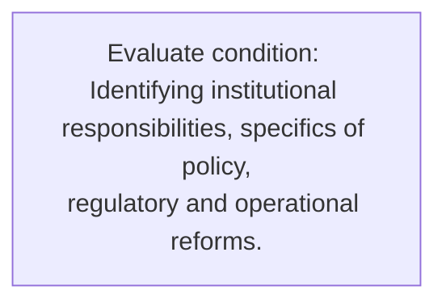
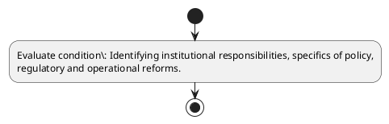

# Chapter 3 / Section 5: Identifying institutional responsibilities, specifics of policy,

**Chapter Title:** Developing Districts as Export Hubs

**Pages:** 5

**Purpose:** Defines the operational requirements for Identifying institutional responsibilities, specifics of policy,.

**Purpose Thanglish:** Indha Identifying institutional responsibilities, specifics of policy, section-la, Defines the operational requirements for Identifying institutional responsibilities, specifics of policy,.

**Summary:** 5. Identifying institutional responsibilities, specifics of policy,
regulatory and operational reforms.

**Business Meaning:** 5.

**Business Explanation:** 5. Identifying institutional responsibilities, specifics of policy,
regulatory and operational reforms.

**Business Explanation Thanglish:** Indha Identifying institutional responsibilities, specifics of policy, section-la, 5. Identifying institutional responsibilities, specifics of policy,
regulatory and operational reforms.

## Business Logic
- None identified

## Business Rules
- rule_id=CH3-SEC5-R001, rule_description=5. Identifying institutional responsibilities, specifics of policy,
regulatory and operational reforms., trigger=Identifying institutional responsibilities, specifics of policy,, condition=Identifying institutional responsibilities, specifics of policy,
regulatory and operational reforms., validation=Not explicitly covered in uploaded documents., action=Manual review required., exception=No explicit exception found in uploaded documents., output=DEKAI should produce a compliance decision for 5 - Identifying institutional responsibilities, specifics of policy,.

## Conditions
- Identifying institutional responsibilities, specifics of policy,
regulatory and operational reforms.

## Condition Logic
- id=3.5.1, if=Identifying institutional responsibilities, specifics of policy,
regulatory and operational reforms., then=Route for review, source=Identifying institutional responsibilities, specifics of policy,
regulatory and operational reforms.

## Validations
- None identified

## Exceptions
- None identified

## Dependencies
- None identified

## Authorities
- None identified

## Required Documents
- None identified

## Timelines
- None identified

## Actions
- None identified

## Workflow
- Evaluate condition: Identifying institutional responsibilities, specifics of policy,
regulatory and operational reforms.

## Workflow ASCII
```text
Identifying institutional responsibilities, specifics of policy,
Evaluate condition: Identifying institutional responsibilities, specifics of policy,
regulatory and operational reforms.
```

## Decision Tree
- IF section 5 applies THEN proceed with standard DGFT workflow

## Decision Tree ASCII
```text
Identifying institutional responsibilities, specifics of policy, Decision
IF section 5 applies THEN proceed with standard DGFT workflow
```

## Examples
- User asks to process Identifying institutional responsibilities, specifics of policy,; the platform checks conditions, validations, and documents before action.

**Real-world Example:** Example: an importer or exporter invokes Identifying institutional responsibilities, specifics of policy,, submits the prescribed DGFT records, and DEKAI uses the extracted rules to follow the identifying institutional responsibilities, specifics of policy, process.

**Real-world Example Thanglish:** Indha Identifying institutional responsibilities, specifics of policy, section-la, Example: an importer or exporter invokes Identifying institutional responsibilities, specifics of policy,, submits the prescribed DGFT records, and DEKAI uses the extracted rules to follow the identifying institutional responsibilities, specifics of policy, process.

## AI Rules
- None identified

## Database Fields
- name=section_code, type=string, required=True, source=parsed_section_heading
- name=section_title, type=string, required=True, source=parsed_section_heading
- name=and_flag, type=boolean, required=False, source=keyword:and
- name=policy_flag, type=boolean, required=False, source=keyword:policy
- name=reforms_flag, type=boolean, required=False, source=keyword:reforms
- name=specifics_flag, type=boolean, required=False, source=keyword:specifics
- name=regulatory_flag, type=boolean, required=False, source=keyword:regulatory
- name=identifying_flag, type=boolean, required=False, source=keyword:Identifying
- name=operational_flag, type=boolean, required=False, source=keyword:operational
- name=institutional_flag, type=boolean, required=False, source=keyword:institutional

## API Requirements
- method=GET, path=/api/dgft/sections/5, purpose=Retrieve knowledge payload for section 5, query_params=['include=workflow,decision_tree,validations'], response_fields=['section', 'title', 'summary', 'conditions', 'validations', 'exceptions', 'workflow', 'decision_tree']
- method=POST, path=/api/dgft/Identifying-institutional-responsibilities-specifics-of-policy/validate, purpose=Validate inputs and documents for Identifying institutional responsibilities, specifics of policy,, request_fields=['section_code', 'section_title'], response_fields=['status', 'errors', 'warnings', 'next_actions']

## UI Screens
- screen_id=Identifying_institutional_responsibilities_specifics_of_policy_overview, name=Identifying institutional responsibilities, specifics of policy, Overview, purpose=Show section summary, authority, timeline, and eligibility cues., widgets=['summary_card', 'conditions_table', 'authority_badges', 'timeline_panel']
- screen_id=Identifying_institutional_responsibilities_specifics_of_policy_submission, name=Identifying institutional responsibilities, specifics of policy, Submission, purpose=Capture applicant data and supporting documents., widgets=['dynamic_form', 'document_uploader', 'validation_panel', 'next_action_footer'], fields=['section_code', 'section_title', 'and_flag', 'policy_flag', 'reforms_flag', 'specifics_flag', 'regulatory_flag', 'identifying_flag']

## Error Messages
- Validation failed because the section requirements were not fully met.

## FAQ
- question_en=What is the purpose of section 5?, answer_en=5. Identifying institutional responsibilities, specifics of policy,
regulatory and operational reforms., question_thanglish=Indha Identifying institutional responsibilities, specifics of policy, section-la, What is the purpose of section 5?, answer_thanglish=Indha Identifying institutional responsibilities, specifics of policy, section-la, 5. Identifying institutional responsibilities, specifics of policy,
regulatory and operational reforms.
- question_en=What documents are required under Identifying institutional responsibilities, specifics of policy,?, answer_en=Not explicitly covered in uploaded documents., question_thanglish=Indha Identifying institutional responsibilities, specifics of policy, section-la, What documents are required under Identifying institutional responsibilities, specifics of policy,?, answer_thanglish=Indha Identifying institutional responsibilities, specifics of policy, section-la, Not explicitly covered in uploaded documents.
- question_en=Which authority handles Identifying institutional responsibilities, specifics of policy,?, answer_en=Not explicitly covered in uploaded documents., question_thanglish=Indha Identifying institutional responsibilities, specifics of policy, section-la, Which authority handles Identifying institutional responsibilities, specifics of policy,?, answer_thanglish=Indha Identifying institutional responsibilities, specifics of policy, section-la, Not explicitly covered in uploaded documents.

## Questions Users May Ask
- What does Identifying institutional responsibilities, specifics of policy, require?
- Which documents are needed for Identifying institutional responsibilities, specifics of policy,?
- How does DEKAI validate Identifying institutional responsibilities, specifics of policy, requests?

## Expected AI Answers
- Identifying institutional responsibilities, specifics of policy, requires the platform to interpret the section text, apply the extracted business rules, and present the correct next action.
- Required documents are inferred from the section text: no explicit documents were detected.
- DEKAI validates Identifying institutional responsibilities, specifics of policy, by checking conditions, required documents, authority references, and exception clauses before recommending an outcome.

## AI Q&A Examples
- question_en=User asks: How do I comply with Identifying institutional responsibilities, specifics of policy,?, answer_en=AI answers: DEKAI should evaluate section 5, apply the extracted rules, and guide the user through Evaluate condition: Identifying institutional responsibilities, specifics of policy,
regulatory and operational reforms.., question_thanglish=Indha Identifying institutional responsibilities, specifics of policy, section-la, User asks: How do I comply with Identifying institutional responsibilities, specifics of policy,?, answer_thanglish=Indha Identifying institutional responsibilities, specifics of policy, section-la, AI answers: DEKAI should evaluate section 5, apply the extracted rules, and guide the user through Evaluate condition: Identifying institutional responsibilities, specifics of policy,
regulatory and operational reforms..
- question_en=User asks: Which validations apply to Identifying institutional responsibilities, specifics of policy,?, answer_en=AI answers: Applicable validations are not explicitly covered in the uploaded documents., question_thanglish=Indha Identifying institutional responsibilities, specifics of policy, section-la, User asks: Which validations apply to Identifying institutional responsibilities, specifics of policy,?, answer_thanglish=Indha Identifying institutional responsibilities, specifics of policy, section-la, AI answers: Applicable validations are not explicitly covered in the uploaded documents.

## DEKAI AI Implementation Notes
- Capture chapter 3, section 5, title, and page references as immutable knowledge metadata.
- Bind validations for Identifying institutional responsibilities, specifics of policy, into a rule engine keyed by the rule IDs extracted for this section.

## DEKAI AI Implementation Notes Thanglish
- Indha Identifying institutional responsibilities, specifics of policy, section-la, Capture chapter 3, section 5, title, and page references as immutable knowledge metadata.
- Indha Identifying institutional responsibilities, specifics of policy, section-la, Bind validations for Identifying institutional responsibilities, specifics of policy, into a rule engine keyed by the rule IDs extracted for this section.

## AI Metadata
- Keywords: and, policy, reforms, specifics, regulatory, Identifying, operational, institutional, responsibilities
- Search Keywords: and, policy, reforms, specifics, regulatory, Identifying, operational, institutional, responsibilities
- Intent: Provide knowledge guidance for Identifying institutional responsibilities, specifics of policy,.
- Tags: 5, Identifying institutional responsibilities, specifics of policy,, dgft
- Related Sections: 
- Related Chapters: 
- Related Rules: 

## Mermaid


## PlantUML

