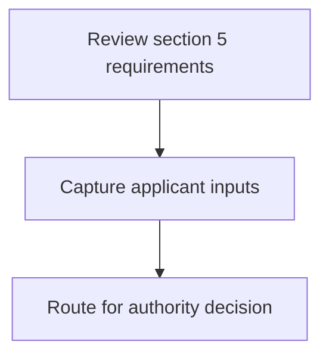
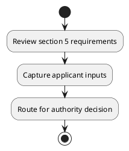

# Chapter 3 / Section 5: Map the existing trade infrastructure available for thrust sector in the

**Chapter Title:** Developing Districts as Export Hubs

**Pages:** 4

**Purpose:** Map the existing trade infrastructure available for thrust sector in the
districts.

**Purpose Thanglish:** Indha Map the existing trade infrastructure available for thrust sector in the section-la, Map the existing trade infrastructure available for thrust sector in the
districts.

**Summary:** 5. Map the existing trade infrastructure available for thrust sector in the
districts.

**Business Meaning:** 5.

**Business Explanation:** 5. Map the existing trade infrastructure available for thrust sector in the
districts.

**Business Explanation Thanglish:** Indha Map the existing trade infrastructure available for thrust sector in the section-la, 5. Map the existing trade infrastructure available for thrust sector in the
districts.

## Business Logic
- None identified

## Business Rules
- rule_id=CH3-SEC5-R001, rule_description=5. Map the existing trade infrastructure available for thrust sector in the
districts., trigger=Map the existing trade infrastructure available for thrust sector in the, condition=Not explicitly covered in uploaded documents., validation=Not explicitly covered in uploaded documents., action=Manual review required., exception=No explicit exception found in uploaded documents., output=DEKAI should produce a compliance decision for 5 - Map the existing trade infrastructure available for thrust sector in the.

## Conditions
- None identified

## Condition Logic
- None identified

## Validations
- None identified

## Exceptions
- None identified

## Dependencies
- None identified

## Authorities
- None identified

## Required Documents
- None identified

## Timelines
- None identified

## Actions
- None identified

## Workflow
- Review section 5 requirements
- Capture applicant inputs
- Route for authority decision

## Workflow ASCII
```text
Map the existing trade infrastructure available for thrust sector in the
Review section 5 requirements
   |
   v
Capture applicant inputs
   |
   v
Route for authority decision
```

## Decision Tree
- IF section 5 applies THEN proceed with standard DGFT workflow

## Decision Tree ASCII
```text
Map the existing trade infrastructure available for thrust sector in the Decision
IF section 5 applies THEN proceed with standard DGFT workflow
```

## Examples
- User asks to process Map the existing trade infrastructure available for thrust sector in the; the platform checks conditions, validations, and documents before action.

**Real-world Example:** Example: an importer or exporter invokes Map the existing trade infrastructure available for thrust sector in the, submits the prescribed DGFT records, and DEKAI uses the extracted rules to follow the map the existing trade infrastructure available for thrust sector in the process.

**Real-world Example Thanglish:** Indha Map the existing trade infrastructure available for thrust sector in the section-la, Example: an importer or exporter invokes Map the existing trade infrastructure available for thrust sector in the, submits the prescribed DGFT records, and DEKAI uses the extracted rules to follow the map the existing trade infrastructure available for thrust sector in the process.

## AI Rules
- None identified

## Database Fields
- name=section_code, type=string, required=True, source=parsed_section_heading
- name=section_title, type=string, required=True, source=parsed_section_heading
- name=map_flag, type=boolean, required=False, source=keyword:Map
- name=the_flag, type=boolean, required=False, source=keyword:the
- name=for_flag, type=boolean, required=False, source=keyword:for
- name=trade_flag, type=boolean, required=False, source=keyword:trade
- name=thrust_flag, type=boolean, required=False, source=keyword:thrust
- name=sector_flag, type=boolean, required=False, source=keyword:sector
- name=existing_flag, type=boolean, required=False, source=keyword:existing
- name=available_flag, type=boolean, required=False, source=keyword:available

## API Requirements
- method=GET, path=/api/dgft/sections/5, purpose=Retrieve knowledge payload for section 5, query_params=['include=workflow,decision_tree,validations'], response_fields=['section', 'title', 'summary', 'conditions', 'validations', 'exceptions', 'workflow', 'decision_tree']
- method=POST, path=/api/dgft/Map-the-existing-trade-infrastructure-available-for-thrust-sector-in-the/validate, purpose=Validate inputs and documents for Map the existing trade infrastructure available for thrust sector in the, request_fields=['section_code', 'section_title'], response_fields=['status', 'errors', 'warnings', 'next_actions']

## UI Screens
- screen_id=Map_the_existing_trade_infrastructure_available_for_thrust_sector_in_the_overview, name=Map the existing trade infrastructure available for thrust sector in the Overview, purpose=Show section summary, authority, timeline, and eligibility cues., widgets=['summary_card', 'conditions_table', 'authority_badges', 'timeline_panel']
- screen_id=Map_the_existing_trade_infrastructure_available_for_thrust_sector_in_the_submission, name=Map the existing trade infrastructure available for thrust sector in the Submission, purpose=Capture applicant data and supporting documents., widgets=['dynamic_form', 'document_uploader', 'validation_panel', 'next_action_footer'], fields=['section_code', 'section_title', 'map_flag', 'the_flag', 'for_flag', 'trade_flag', 'thrust_flag', 'sector_flag']

## Error Messages
- Validation failed because the section requirements were not fully met.

## FAQ
- question_en=What is the purpose of section 5?, answer_en=5. Map the existing trade infrastructure available for thrust sector in the
districts., question_thanglish=Indha Map the existing trade infrastructure available for thrust sector in the section-la, What is the purpose of section 5?, answer_thanglish=Indha Map the existing trade infrastructure available for thrust sector in the section-la, 5. Map the existing trade infrastructure available for thrust sector in the
districts.
- question_en=What documents are required under Map the existing trade infrastructure available for thrust sector in the?, answer_en=Not explicitly covered in uploaded documents., question_thanglish=Indha Map the existing trade infrastructure available for thrust sector in the section-la, What documents are required under Map the existing trade infrastructure available for thrust sector in the?, answer_thanglish=Indha Map the existing trade infrastructure available for thrust sector in the section-la, Not explicitly covered in uploaded documents.
- question_en=Which authority handles Map the existing trade infrastructure available for thrust sector in the?, answer_en=Not explicitly covered in uploaded documents., question_thanglish=Indha Map the existing trade infrastructure available for thrust sector in the section-la, Which authority handles Map the existing trade infrastructure available for thrust sector in the?, answer_thanglish=Indha Map the existing trade infrastructure available for thrust sector in the section-la, Not explicitly covered in uploaded documents.

## Questions Users May Ask
- What does Map the existing trade infrastructure available for thrust sector in the require?
- Which documents are needed for Map the existing trade infrastructure available for thrust sector in the?
- How does DEKAI validate Map the existing trade infrastructure available for thrust sector in the requests?

## Expected AI Answers
- Map the existing trade infrastructure available for thrust sector in the requires the platform to interpret the section text, apply the extracted business rules, and present the correct next action.
- Required documents are inferred from the section text: no explicit documents were detected.
- DEKAI validates Map the existing trade infrastructure available for thrust sector in the by checking conditions, required documents, authority references, and exception clauses before recommending an outcome.

## AI Q&A Examples
- question_en=User asks: How do I comply with Map the existing trade infrastructure available for thrust sector in the?, answer_en=AI answers: DEKAI should evaluate section 5, apply the extracted rules, and guide the user through Review section 5 requirements., question_thanglish=Indha Map the existing trade infrastructure available for thrust sector in the section-la, User asks: How do I comply with Map the existing trade infrastructure available for thrust sector in the?, answer_thanglish=Indha Map the existing trade infrastructure available for thrust sector in the section-la, AI answers: DEKAI should evaluate section 5, apply the extracted rules, and guide the user through Review section 5 requirements.
- question_en=User asks: Which validations apply to Map the existing trade infrastructure available for thrust sector in the?, answer_en=AI answers: Applicable validations are not explicitly covered in the uploaded documents., question_thanglish=Indha Map the existing trade infrastructure available for thrust sector in the section-la, User asks: Which validations apply to Map the existing trade infrastructure available for thrust sector in the?, answer_thanglish=Indha Map the existing trade infrastructure available for thrust sector in the section-la, AI answers: Applicable validations are not explicitly covered in the uploaded documents.

## DEKAI AI Implementation Notes
- Capture chapter 3, section 5, title, and page references as immutable knowledge metadata.
- Bind validations for Map the existing trade infrastructure available for thrust sector in the into a rule engine keyed by the rule IDs extracted for this section.

## DEKAI AI Implementation Notes Thanglish
- Indha Map the existing trade infrastructure available for thrust sector in the section-la, Capture chapter 3, section 5, title, and page references as immutable knowledge metadata.
- Indha Map the existing trade infrastructure available for thrust sector in the section-la, Bind validations for Map the existing trade infrastructure available for thrust sector in the into a rule engine keyed by the rule IDs extracted for this section.

## AI Metadata
- Keywords: Map, the, for, trade, thrust, sector, existing, available, districts, infrastructure
- Search Keywords: Map, the, for, trade, thrust, sector, existing, available, districts, infrastructure
- Intent: Provide knowledge guidance for Map the existing trade infrastructure available for thrust sector in the.
- Tags: 5, Map the existing trade infrastructure available for thrust sector in the, dgft
- Related Sections: 
- Related Chapters: 
- Related Rules: 

## Mermaid


## PlantUML

