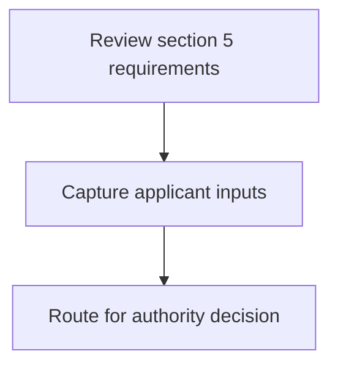
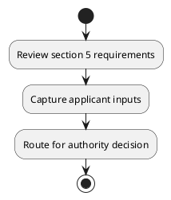

# Chapter 8 / Section 5: Representative of Federation of Indian Exporter Organisation

**Chapter Title:** Quality Complaints and Trade Disputes

**Pages:** 3

**Purpose:** Defines the operational requirements for Representative of Federation of Indian Exporter Organisation.

**Purpose Thanglish:** Indha Representative of Federation of Indian Exporter Organisation section-la, Defines the operational requirements for Representative of Federation of Indian Exporter Organisation.

**Summary:** 5. Representative of Federation of Indian Exporter Organisation
(FIEO)/ and OR Export Promotion Council/Commodity Boards:
Member

**Business Meaning:** 5.

**Business Explanation:** 5. Representative of Federation of Indian Exporter Organisation
(FIEO)/ and OR Export Promotion Council/Commodity Boards:
Member

**Business Explanation Thanglish:** Indha Representative of Federation of Indian Exporter Organisation section-la, 5. Representative of Federation of Indian Exporter Organisation
(FIEO)/ and OR export Promotion Council/Commodity Boards:
Member

## Business Logic
- None identified

## Business Rules
- rule_id=CH8-SEC5-R001, rule_description=5. Representative of Federation of Indian Exporter Organisation
(FIEO)/ and OR Export Promotion Council/Commodity Boards:
Member, trigger=Representative of Federation of Indian Exporter Organisation, condition=Not explicitly covered in uploaded documents., validation=Not explicitly covered in uploaded documents., action=Manual review required., exception=No explicit exception found in uploaded documents., output=DEKAI should produce a compliance decision for 5 - Representative of Federation of Indian Exporter Organisation.

## Conditions
- None identified

## Condition Logic
- None identified

## Validations
- None identified

## Exceptions
- None identified

## Dependencies
- None identified

## Authorities
- None identified

## Required Documents
- None identified

## Timelines
- None identified

## Actions
- None identified

## Workflow
- Review section 5 requirements
- Capture applicant inputs
- Route for authority decision

## Workflow ASCII
```text
Representative of Federation of Indian Exporter Organisation
Review section 5 requirements
   |
   v
Capture applicant inputs
   |
   v
Route for authority decision
```

## Decision Tree
- IF section 5 applies THEN proceed with standard DGFT workflow

## Decision Tree ASCII
```text
Representative of Federation of Indian Exporter Organisation Decision
IF section 5 applies THEN proceed with standard DGFT workflow
```

## Examples
- User asks to process Representative of Federation of Indian Exporter Organisation; the platform checks conditions, validations, and documents before action.

**Real-world Example:** Example: an importer or exporter invokes Representative of Federation of Indian Exporter Organisation, submits the prescribed DGFT records, and DEKAI uses the extracted rules to follow the representative of federation of indian exporter organisation process.

**Real-world Example Thanglish:** Indha Representative of Federation of Indian Exporter Organisation section-la, Example: an importer or exporter invokes Representative of Federation of Indian Exporter Organisation, submits the prescribed DGFT records, and DEKAI uses the extracted rules to follow the representative of federation of indian exporter organisation process.

## AI Rules
- None identified

## Database Fields
- name=section_code, type=string, required=True, source=parsed_section_heading
- name=section_title, type=string, required=True, source=parsed_section_heading
- name=and_flag, type=boolean, required=False, source=keyword:and
- name=fieo_flag, type=boolean, required=False, source=keyword:FIEO
- name=indian_flag, type=boolean, required=False, source=keyword:Indian
- name=export_flag, type=boolean, required=False, source=keyword:Export
- name=boards_flag, type=boolean, required=False, source=keyword:Boards
- name=member_flag, type=boolean, required=False, source=keyword:Member
- name=exporter_flag, type=boolean, required=False, source=keyword:Exporter
- name=promotion_flag, type=boolean, required=False, source=keyword:Promotion

## API Requirements
- method=GET, path=/api/dgft/sections/5, purpose=Retrieve knowledge payload for section 5, query_params=['include=workflow,decision_tree,validations'], response_fields=['section', 'title', 'summary', 'conditions', 'validations', 'exceptions', 'workflow', 'decision_tree']
- method=POST, path=/api/dgft/Representative-of-Federation-of-Indian-Exporter-Organisation/validate, purpose=Validate inputs and documents for Representative of Federation of Indian Exporter Organisation, request_fields=['section_code', 'section_title'], response_fields=['status', 'errors', 'warnings', 'next_actions']

## UI Screens
- screen_id=Representative_of_Federation_of_Indian_Exporter_Organisation_overview, name=Representative of Federation of Indian Exporter Organisation Overview, purpose=Show section summary, authority, timeline, and eligibility cues., widgets=['summary_card', 'conditions_table', 'authority_badges', 'timeline_panel']
- screen_id=Representative_of_Federation_of_Indian_Exporter_Organisation_submission, name=Representative of Federation of Indian Exporter Organisation Submission, purpose=Capture applicant data and supporting documents., widgets=['dynamic_form', 'document_uploader', 'validation_panel', 'next_action_footer'], fields=['section_code', 'section_title', 'and_flag', 'fieo_flag', 'indian_flag', 'export_flag', 'boards_flag', 'member_flag']

## Error Messages
- Validation failed because the section requirements were not fully met.

## FAQ
- question_en=What is the purpose of section 5?, answer_en=5. Representative of Federation of Indian Exporter Organisation
(FIEO)/ and OR Export Promotion Council/Commodity Boards:
Member, question_thanglish=Indha Representative of Federation of Indian Exporter Organisation section-la, What is the purpose of section 5?, answer_thanglish=Indha Representative of Federation of Indian Exporter Organisation section-la, 5. Representative of Federation of Indian Exporter Organisation
(FIEO)/ and OR export Promotion Council/Commodity Boards:
Member
- question_en=What documents are required under Representative of Federation of Indian Exporter Organisation?, answer_en=Not explicitly covered in uploaded documents., question_thanglish=Indha Representative of Federation of Indian Exporter Organisation section-la, What documents are required under Representative of Federation of Indian Exporter Organisation?, answer_thanglish=Indha Representative of Federation of Indian Exporter Organisation section-la, Not explicitly covered in uploaded documents.
- question_en=Which authority handles Representative of Federation of Indian Exporter Organisation?, answer_en=Not explicitly covered in uploaded documents., question_thanglish=Indha Representative of Federation of Indian Exporter Organisation section-la, Which authority handles Representative of Federation of Indian Exporter Organisation?, answer_thanglish=Indha Representative of Federation of Indian Exporter Organisation section-la, Not explicitly covered in uploaded documents.

## Questions Users May Ask
- What does Representative of Federation of Indian Exporter Organisation require?
- Which documents are needed for Representative of Federation of Indian Exporter Organisation?
- How does DEKAI validate Representative of Federation of Indian Exporter Organisation requests?

## Expected AI Answers
- Representative of Federation of Indian Exporter Organisation requires the platform to interpret the section text, apply the extracted business rules, and present the correct next action.
- Required documents are inferred from the section text: no explicit documents were detected.
- DEKAI validates Representative of Federation of Indian Exporter Organisation by checking conditions, required documents, authority references, and exception clauses before recommending an outcome.

## AI Q&A Examples
- question_en=User asks: How do I comply with Representative of Federation of Indian Exporter Organisation?, answer_en=AI answers: DEKAI should evaluate section 5, apply the extracted rules, and guide the user through Review section 5 requirements., question_thanglish=Indha Representative of Federation of Indian Exporter Organisation section-la, User asks: How do I comply with Representative of Federation of Indian Exporter Organisation?, answer_thanglish=Indha Representative of Federation of Indian Exporter Organisation section-la, AI answers: DEKAI should evaluate section 5, apply the extracted rules, and guide the user through Review section 5 requirements.
- question_en=User asks: Which validations apply to Representative of Federation of Indian Exporter Organisation?, answer_en=AI answers: Applicable validations are not explicitly covered in the uploaded documents., question_thanglish=Indha Representative of Federation of Indian Exporter Organisation section-la, User asks: Which validations apply to Representative of Federation of Indian Exporter Organisation?, answer_thanglish=Indha Representative of Federation of Indian Exporter Organisation section-la, AI answers: Applicable validations are not explicitly covered in the uploaded documents.

## DEKAI AI Implementation Notes
- Capture chapter 8, section 5, title, and page references as immutable knowledge metadata.
- Bind validations for Representative of Federation of Indian Exporter Organisation into a rule engine keyed by the rule IDs extracted for this section.

## DEKAI AI Implementation Notes Thanglish
- Indha Representative of Federation of Indian Exporter Organisation section-la, Capture chapter 8, section 5, title, and page references as immutable knowledge metadata.
- Indha Representative of Federation of Indian Exporter Organisation section-la, Bind validations for Representative of Federation of Indian Exporter Organisation into a rule engine keyed by the rule IDs extracted for this section.

## AI Metadata
- Keywords: and, FIEO, Indian, Export, Boards, Member, Exporter, Promotion, Federation, Organisation, Representative, Council/Commodity
- Search Keywords: and, FIEO, Indian, Export, Boards, Member, Exporter, Promotion, Federation, Organisation, Representative, Council/Commodity
- Intent: Provide knowledge guidance for Representative of Federation of Indian Exporter Organisation.
- Tags: 5, Representative of Federation of Indian Exporter Organisation, dgft
- Related Sections: 
- Related Chapters: 
- Related Rules: 

## Mermaid


## PlantUML

