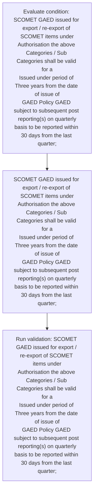
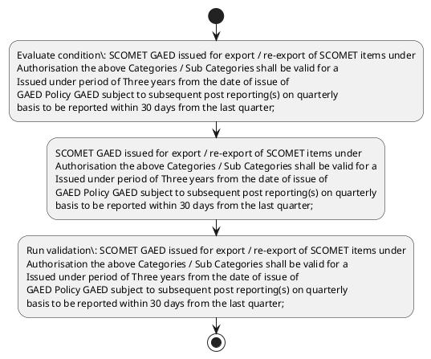

# Chapter 10 / Section 5: SCOMET GAED issued for export / re-export of SCOMET items under

**Chapter Title:** SCOMET: Special Chemicals, Organisms, Materials, Equipment and Technologies

**Pages:** 42

**Purpose:** SCOMET GAED issued for export / re-export of SCOMET items under
Authorisation the above Categories / Sub Categories shall be valid for a
Issued under period of Three years from the date of issue of
GAED Policy GAED subject to subsequent post reporting(s) on quarterly
basis to be reported within 30 days from the last quarter;

**Purpose Thanglish:** Indha SCOMET GAED issued for export / re-export of SCOMET items under section-la, SCOMET GAED issued for export / re-export of SCOMET items under
Authorisation the above Categories / Sub Categories kandippa be valid for a
Issued under period of Three years from the date of issue of
GAED Policy GAED subject to subsequent post reporting(s) on quarterly
basis to be reported within 30 days from the last quarter;

**Summary:** 5. SCOMET GAED issued for export / re-export of SCOMET items under
Authorisation the above Categories / Sub Categories shall be valid for a
Issued under period of Three years from the date of issue of
GAED Policy GAED subject to subsequent post reporting(s) on quarterly
basis to be reported within 30 days from the last quarter;

**Business Meaning:** SCOMET GAED issued for export / re-export of SCOMET items under governs how DGFT business controls should be applied, validated, and enforced.

**Business Explanation:** SCOMET GAED issued for export / re-export of SCOMET items under explains the operating rule set that DEKAI should enforce. Key control points include SCOMET GAED issued for export / re-export of SCOMET items under
Authorisation the above Categories / Sub Categories shall be valid for a
Issued under period of Three years from the date of issue of
GAED Policy GAED subject to subsequent post reporting(s) on quarterly
basis to be reported within 30 days from the last quarter; The section also drives actions such as SCOMET GAED issued for export / re-export of SCOMET items under
Authorisation the above Categories / Sub Categories shall be valid for a
Issued under period of Three years from the date of issue of
GAED Policy GAED subject to subsequent post reporting(s) on quarterly
basis to be reported within 30 days from the last quarter;.

**Business Explanation Thanglish:** Indha SCOMET GAED issued for export / re-export of SCOMET items under section-la, SCOMET GAED issued for export / re-export of SCOMET items under explains the operating rule set that DEKAI should enforce. Key control points include SCOMET GAED issued for export / re-export of SCOMET items under
Authorisation the above Categories / Sub Categories kandippa be valid for a
Issued under period of Three years from the date of issue of
GAED Policy GAED subject to subsequent post reporting(s) on quarterly
basis to be reported within 30 days from the last quarter; The section also drives actions such as SCOMET GAED issued for export / re-export of SCOMET items under
Authorisation the above Categories / Sub Categories kandippa be valid for a
Issued under period of Three years from the date of issue of
GAED Policy GAED subject to subsequent post reporting(s) on quarterly
basis to be reported within 30 days from the last quarter;.

## Business Logic
- SCOMET GAED issued for export / re-export of SCOMET items under
Authorisation the above Categories / Sub Categories shall be valid for a
Issued under period of Three years from the date of issue of
GAED Policy GAED subject to subsequent post reporting(s) on quarterly
basis to be reported within 30 days from the last quarter;

## Business Rules
- rule_id=CH10-SEC5-R001, rule_description=SCOMET GAED issued for export / re-export of SCOMET items under
Authorisation the above Categories / Sub Categories shall be valid for a
Issued under period of Three years from the date of issue of
GAED Policy GAED subject to subsequent post reporting(s) on quarterly
basis to be reported within 30 days from the last quarter;, trigger=SCOMET GAED issued for export / re-export of SCOMET items under, condition=SCOMET GAED issued for export / re-export of SCOMET items under
Authorisation the above Categories / Sub Categories shall be valid for a
Issued under period of Three years from the date of issue of
GAED Policy GAED subject to subsequent post reporting(s) on quarterly
basis to be reported within 30 days from the last quarter;, validation=SCOMET GAED issued for export / re-export of SCOMET items under
Authorisation the above Categories / Sub Categories shall be valid for a
Issued under period of Three years from the date of issue of
GAED Policy GAED subject to subsequent post reporting(s) on quarterly
basis to be reported within 30 days from the last quarter;, action=SCOMET GAED issued for export / re-export of SCOMET items under
Authorisation the above Categories / Sub Categories shall be valid for a
Issued under period of Three years from the date of issue of
GAED Policy GAED subject to subsequent post reporting(s) on quarterly
basis to be reported within 30 days from the last quarter;, exception=No explicit exception found in uploaded documents., output=DEKAI should produce a compliance decision for 5 - SCOMET GAED issued for export / re-export of SCOMET items under.

## Conditions
- SCOMET GAED issued for export / re-export of SCOMET items under
Authorisation the above Categories / Sub Categories shall be valid for a
Issued under period of Three years from the date of issue of
GAED Policy GAED subject to subsequent post reporting(s) on quarterly
basis to be reported within 30 days from the last quarter;

## Condition Logic
- id=10.5.1, if=SCOMET GAED issued for export / re-export of SCOMET items under
Authorisation the above Categories / Sub Categories shall be valid for a
Issued under period of Three years from the date of issue of
GAED Policy GAED subject to subsequent post reporting(s) on quarterly
basis to be reported within 30 days from the last quarter;, then=SCOMET GAED issued for export / re-export of SCOMET items under
Authorisation the above Categories / Sub Categories shall be valid for a
Issued under period of Three years from the date of issue of
GAED Policy GAED subject to subsequent post reporting(s) on quarterly
basis to be reported within 30 days from the last quarter;, source=SCOMET GAED issued for export / re-export of SCOMET items under
Authorisation the above Categories / Sub Categories shall be valid for a
Issued under period of Three years from the date of issue of
GAED Policy GAED subject to subsequent post reporting(s) on quarterly
basis to be reported within 30 days from the last quarter;

## Validations
- SCOMET GAED issued for export / re-export of SCOMET items under
Authorisation the above Categories / Sub Categories shall be valid for a
Issued under period of Three years from the date of issue of
GAED Policy GAED subject to subsequent post reporting(s) on quarterly
basis to be reported within 30 days from the last quarter;

## Exceptions
- None identified

## Dependencies
- 3

## Authorities
- None identified

## Required Documents
- None identified

## Timelines
- SCOMET GAED issued for export / re-export of SCOMET items under
Authorisation the above Categories / Sub Categories shall be valid for a
Issued under period of Three years from the date of issue of
GAED Policy GAED subject to subsequent post reporting(s) on quarterly
basis to be reported within 30 days from the last quarter;

## Actions
- SCOMET GAED issued for export / re-export of SCOMET items under
Authorisation the above Categories / Sub Categories shall be valid for a
Issued under period of Three years from the date of issue of
GAED Policy GAED subject to subsequent post reporting(s) on quarterly
basis to be reported within 30 days from the last quarter;

## Workflow
- Evaluate condition: SCOMET GAED issued for export / re-export of SCOMET items under
Authorisation the above Categories / Sub Categories shall be valid for a
Issued under period of Three years from the date of issue of
GAED Policy GAED subject to subsequent post reporting(s) on quarterly
basis to be reported within 30 days from the last quarter;
- SCOMET GAED issued for export / re-export of SCOMET items under
Authorisation the above Categories / Sub Categories shall be valid for a
Issued under period of Three years from the date of issue of
GAED Policy GAED subject to subsequent post reporting(s) on quarterly
basis to be reported within 30 days from the last quarter;
- Run validation: SCOMET GAED issued for export / re-export of SCOMET items under
Authorisation the above Categories / Sub Categories shall be valid for a
Issued under period of Three years from the date of issue of
GAED Policy GAED subject to subsequent post reporting(s) on quarterly
basis to be reported within 30 days from the last quarter;

## Workflow ASCII
```text
SCOMET GAED issued for export / re-export of SCOMET items under
Evaluate condition: SCOMET GAED issued for export / re-export of SCOMET items under
Authorisation the above Categories / Sub Categories shall be valid for a
Issued under period of Three years from the date of issue of
GAED Policy GAED subject to subsequent post reporting(s) on quarterly
basis to be reported within 30 days from the last quarter;
   |
   v
SCOMET GAED issued for export / re-export of SCOMET items under
Authorisation the above Categories / Sub Categories shall be valid for a
Issued under period of Three years from the date of issue of
GAED Policy GAED subject to subsequent post reporting(s) on quarterly
basis to be reported within 30 days from the last quarter;
   |
   v
Run validation: SCOMET GAED issued for export / re-export of SCOMET items under
Authorisation the above Categories / Sub Categories shall be valid for a
Issued under period of Three years from the date of issue of
GAED Policy GAED subject to subsequent post reporting(s) on quarterly
basis to be reported within 30 days from the last quarter;
```

## Decision Tree
- IF SCOMET GAED issued for export / re-export of SCOMET items under
Authorisation the above Categories / Sub Categories shall be valid for a
Issued under period of Three years from the date of issue of
GAED Policy GAED subject to subsequent post reporting(s) on quarterly
basis to be reported within 30 days from the last quarter; THEN SCOMET GAED issued for export / re-export of SCOMET items under
Authorisation the above Categories / Sub Categories shall be valid for a
Issued under period of Three years from the date of issue of
GAED Policy GAED subject to subsequent post reporting(s) on quarterly
basis to be reported within 30 days from the last quarter;

## Decision Tree ASCII
```text
SCOMET GAED issued for export / re-export of SCOMET items under Decision
IF SCOMET GAED issued for export / re-export of SCOMET items under
Authorisation the above Categories / Sub Categories shall be valid for a
Issued under period of Three years from the date of issue of
GAED Policy GAED subject to subsequent post reporting(s) on quarterly
basis to be reported within 30 days from the last quarter; THEN SCOMET GAED issued for export / re-export of SCOMET items under
Authorisation the above Categories / Sub Categories shall be valid for a
Issued under period of Three years from the date of issue of
GAED Policy GAED subject to subsequent post reporting(s) on quarterly
basis to be reported within 30 days from the last quarter;
```

## Examples
- User asks to process SCOMET GAED issued for export / re-export of SCOMET items under; the platform checks conditions, validations, and documents before action.

**Real-world Example:** Example: an importer or exporter invokes SCOMET GAED issued for export / re-export of SCOMET items under, submits the prescribed DGFT records, and DEKAI uses the extracted rules to scomet gaed issued for export / re-export of scomet items under
authorisation the above categories / sub categories shall be valid for a
issued under period of three years from the date of issue of
gaed policy gaed subject to subsequent post reporting(s) on quarterly
basis to be reported within 30 days from the last quarter;.

**Real-world Example Thanglish:** Indha SCOMET GAED issued for export / re-export of SCOMET items under section-la, Example: an importer or exporter invokes SCOMET GAED issued for export / re-export of SCOMET items under, submits the prescribed DGFT records, and DEKAI uses the extracted rules to scomet gaed issued for export / re-export of scomet items under
authorisation the above categories / sub categories kandippa be valid for a
issued under period of three years from the date of issue of
gaed policy gaed subject to subsequent post reporting(s) on quarterly
basis to be reported within 30 days from the last quarter;.

## AI Rules
- IF detected context matches section rule THEN enforce: SCOMET GAED issued for export / re-export of SCOMET items under
Authorisation the above Categories / Sub Categories shall be valid for a
Issued under period of Three years from the date of issue of
GAED Policy GAED subject to subsequent post reporting(s) on quarterly
basis to be reported within 30 days from the last quarter;
- IF validations pass THEN recommend action: SCOMET GAED issued for export / re-export of SCOMET items under
Authorisation the above Categories / Sub Categories shall be valid for a
Issued under period of Three years from the date of issue of
GAED Policy GAED subject to subsequent post reporting(s) on quarterly
basis to be reported within 30 days from the last quarter;

## Database Fields
- name=section_code, type=string, required=True, source=parsed_section_heading
- name=section_title, type=string, required=True, source=parsed_section_heading
- name=for_flag, type=boolean, required=False, source=keyword:for
- name=the_flag, type=boolean, required=False, source=keyword:the
- name=sub_flag, type=boolean, required=False, source=keyword:Sub
- name=gaed_flag, type=boolean, required=False, source=keyword:GAED
- name=from_flag, type=boolean, required=False, source=keyword:from
- name=date_flag, type=boolean, required=False, source=keyword:date
- name=post_flag, type=boolean, required=False, source=keyword:post
- name=days_flag, type=boolean, required=False, source=keyword:days

## API Requirements
- method=GET, path=/api/dgft/sections/5, purpose=Retrieve knowledge payload for section 5, query_params=['include=workflow,decision_tree,validations'], response_fields=['section', 'title', 'summary', 'conditions', 'validations', 'exceptions', 'workflow', 'decision_tree']
- method=POST, path=/api/dgft/SCOMET-GAED-issued-for-export-re-export-of-SCOMET-items-under/validate, purpose=Validate inputs and documents for SCOMET GAED issued for export / re-export of SCOMET items under, request_fields=['section_code', 'section_title'], response_fields=['status', 'errors', 'warnings', 'next_actions']
- method=POST, path=/api/dgft/SCOMET-GAED-issued-for-export-re-export-of-SCOMET-items-under/execute, purpose=Trigger business action for SCOMET GAED issued for export / re-export of SCOMET items under
Authorisation the above Categories / Sub Categories shall be valid for a
Issued under period of Three years from the date of issue of
GAED Policy GAED subject to subsequent post reporting(s) on quarterly
basis to be reported within 30 days from the last quarter;, request_fields=['section_code', 'section_title'], response_fields=['reference_id', 'status', 'authority', 'timeline']

## UI Screens
- screen_id=SCOMET_GAED_issued_for_export_re_export_of_SCOMET_items_under_overview, name=SCOMET GAED issued for export / re-export of SCOMET items under Overview, purpose=Show section summary, authority, timeline, and eligibility cues., widgets=['summary_card', 'conditions_table', 'authority_badges', 'timeline_panel']
- screen_id=SCOMET_GAED_issued_for_export_re_export_of_SCOMET_items_under_submission, name=SCOMET GAED issued for export / re-export of SCOMET items under Submission, purpose=Capture applicant data and supporting documents., widgets=['dynamic_form', 'document_uploader', 'validation_panel', 'next_action_footer'], fields=['section_code', 'section_title', 'for_flag', 'the_flag', 'sub_flag', 'gaed_flag', 'from_flag', 'date_flag']

## Error Messages
- Validation failed because the section requirements were not fully met.

## FAQ
- question_en=What is the purpose of section 5?, answer_en=SCOMET GAED issued for export / re-export of SCOMET items under explains the operating rule set that DEKAI should enforce. Key control points include SCOMET GAED issued for export / re-export of SCOMET items under
Authorisation the above Categories / Sub Categories shall be valid for a
Issued under period of Three years from the date of issue of
GAED Policy GAED subject to subsequent post reporting(s) on quarterly
basis to be reported within 30 days from the last quarter; The section also drives actions such as SCOMET GAED issued for export / re-export of SCOMET items under
Authorisation the above Categories / Sub Categories shall be valid for a
Issued under period of Three years from the date of issue of
GAED Policy GAED subject to subsequent post reporting(s) on quarterly
basis to be reported within 30 days from the last quarter;., question_thanglish=Indha SCOMET GAED issued for export / re-export of SCOMET items under section-la, What is the purpose of section 5?, answer_thanglish=Indha SCOMET GAED issued for export / re-export of SCOMET items under section-la, SCOMET GAED issued for export / re-export of SCOMET items under explains the operating rule set that DEKAI should enforce. Key control points include SCOMET GAED issued for export / re-export of SCOMET items under
Authorisation the above Categories / Sub Categories kandippa be valid for a
Issued under period of Three years from the date of issue of
GAED Policy GAED subject to subsequent post reporting(s) on quarterly
basis to be reported within 30 days from the last quarter; The section also drives actions such as SCOMET GAED issued for export / re-export of SCOMET items under
Authorisation the above Categories / Sub Categories kandippa be valid for a
Issued under period of Three years from the date of issue of
GAED Policy GAED subject to subsequent post reporting(s) on quarterly
basis to be reported within 30 days from the last quarter;.
- question_en=What documents are required under SCOMET GAED issued for export / re-export of SCOMET items under?, answer_en=Not explicitly covered in uploaded documents., question_thanglish=Indha SCOMET GAED issued for export / re-export of SCOMET items under section-la, What documents are required under SCOMET GAED issued for export / re-export of SCOMET items under?, answer_thanglish=Indha SCOMET GAED issued for export / re-export of SCOMET items under section-la, Not explicitly covered in uploaded documents.
- question_en=Which authority handles SCOMET GAED issued for export / re-export of SCOMET items under?, answer_en=Not explicitly covered in uploaded documents., question_thanglish=Indha SCOMET GAED issued for export / re-export of SCOMET items under section-la, Which authority handles SCOMET GAED issued for export / re-export of SCOMET items under?, answer_thanglish=Indha SCOMET GAED issued for export / re-export of SCOMET items under section-la, Not explicitly covered in uploaded documents.

## Questions Users May Ask
- What does SCOMET GAED issued for export / re-export of SCOMET items under require?
- Which documents are needed for SCOMET GAED issued for export / re-export of SCOMET items under?
- How does DEKAI validate SCOMET GAED issued for export / re-export of SCOMET items under requests?
- What action should be taken for SCOMET GAED issued for export / re-export of SCOMET items under?

## Expected AI Answers
- SCOMET GAED issued for export / re-export of SCOMET items under requires the platform to interpret the section text, apply the extracted business rules, and present the correct next action.
- Required documents are inferred from the section text: no explicit documents were detected.
- DEKAI validates SCOMET GAED issued for export / re-export of SCOMET items under by checking conditions, required documents, authority references, and exception clauses before recommending an outcome.
- The primary extracted action is: SCOMET GAED issued for export / re-export of SCOMET items under
Authorisation the above Categories / Sub Categories shall be valid for a
Issued under period of Three years from the date of issue of
GAED Policy GAED subject to subsequent post reporting(s) on quarterly
basis to be reported within 30 days from the last quarter;

## AI Q&A Examples
- question_en=User asks: How do I comply with SCOMET GAED issued for export / re-export of SCOMET items under?, answer_en=AI answers: DEKAI should evaluate section 5, apply the extracted rules, and guide the user through Evaluate condition: SCOMET GAED issued for export / re-export of SCOMET items under
Authorisation the above Categories / Sub Categories shall be valid for a
Issued under period of Three years from the date of issue of
GAED Policy GAED subject to subsequent post reporting(s) on quarterly
basis to be reported within 30 days from the last quarter;., question_thanglish=Indha SCOMET GAED issued for export / re-export of SCOMET items under section-la, User asks: How do I comply with SCOMET GAED issued for export / re-export of SCOMET items under?, answer_thanglish=Indha SCOMET GAED issued for export / re-export of SCOMET items under section-la, AI answers: DEKAI should evaluate section 5, apply the extracted rules, and guide the user through Evaluate condition: SCOMET GAED issued for export / re-export of SCOMET items under
Authorisation the above Categories / Sub Categories kandippa be valid for a
Issued under period of Three years from the date of issue of
GAED Policy GAED subject to subsequent post reporting(s) on quarterly
basis to be reported within 30 days from the last quarter;.
- question_en=User asks: Which validations apply to SCOMET GAED issued for export / re-export of SCOMET items under?, answer_en=AI answers: Applicable validations are SCOMET GAED issued for export / re-export of SCOMET items under
Authorisation the above Categories / Sub Categories shall be valid for a
Issued under period of Three years from the date of issue of
GAED Policy GAED subject to subsequent post reporting(s) on quarterly
basis to be reported within 30 days from the last quarter;, question_thanglish=Indha SCOMET GAED issued for export / re-export of SCOMET items under section-la, User asks: Which validations apply to SCOMET GAED issued for export / re-export of SCOMET items under?, answer_thanglish=Indha SCOMET GAED issued for export / re-export of SCOMET items under section-la, AI answers: Applicable validations are SCOMET GAED issued for export / re-export of SCOMET items under
Authorisation the above Categories / Sub Categories kandippa be valid for a
Issued under period of Three years from the date of issue of
GAED Policy GAED subject to subsequent post reporting(s) on quarterly
basis to be reported within 30 days from the last quarter;

## DEKAI AI Implementation Notes
- Capture chapter 10, section 5, title, and page references as immutable knowledge metadata.
- Bind validations for SCOMET GAED issued for export / re-export of SCOMET items under into a rule engine keyed by the rule IDs extracted for this section.
- Show contextual links to related sections: 3.

## DEKAI AI Implementation Notes Thanglish
- Indha SCOMET GAED issued for export / re-export of SCOMET items under section-la, Capture chapter 10, section 5, title, and page references as immutable knowledge metadata.
- Indha SCOMET GAED issued for export / re-export of SCOMET items under section-la, Bind validations for SCOMET GAED issued for export / re-export of SCOMET items under into a rule engine keyed by the rule IDs extracted for this section.
- Indha SCOMET GAED issued for export / re-export of SCOMET items under section-la, Show contextual links to related sections: 3.

## AI Metadata
- Keywords: for, the, Sub, GAED, from, date, post, days, last, items, under, above, shall, valid, Three, years, issue, basis, SCOMET, issued
- Search Keywords: for, the, Sub, GAED, from, date, post, days, last, items, under, above, shall, valid, Three, years, issue, basis, SCOMET, issued
- Intent: Support SCOMET GAED issued for export / re-export of SCOMET items under processing and compliance validation.
- Tags: 5, SCOMET GAED issued for export / re-export of SCOMET items under, business-rule, dgft
- Related Sections: 3
- Related Chapters: 
- Related Rules: SCOMET GAED issued for export / re-export of SCOMET items under
Authorisation the above Categories / Sub Categories shall be valid for a
Issued under period of Three years from the date of issue of
GAED Policy GAED subject to subsequent post reporting(s) on quarterly
basis to be reported within 30 days from the last quarter;

## Mermaid


## PlantUML

