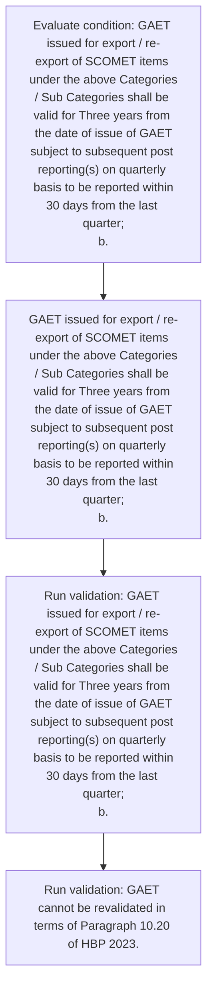

# Chapter 10 / Section 5: Validity

**Chapter Title:** SCOMET: Special Chemicals, Organisms, Materials, Equipment and Technologies

**Pages:** 31, 34

**Purpose:** GAET issued for export / re-export of SCOMET items under the above Categories
/ Sub Categories shall be valid for Three years from the date of issue of GAET
subject to subsequent post reporting(s) on quarterly basis to be reported within
30 days from the last quarter;
b.

**Purpose Thanglish:** Indha Validity section-la, GAET issued for export / re-export of SCOMET items under the above Categories
/ Sub Categories kandippa be valid for Three years from the date of issue of GAET
subject to subsequent post reporting(s) on quarterly basis to be reported within
30 days from the last quarter;
b.

**Summary:** 5. Validity
a. GAET issued for export / re-export of SCOMET items under the above Categories
/ Sub Categories shall be valid for Three years from the date of issue of GAET
subject to subsequent post reporting(s) on quarterly basis to be reported within
30 days from the last quarter;
b.

**Business Meaning:** Validity governs how DGFT business controls should be applied, validated, and enforced.

**Business Explanation:** Validity explains the operating rule set that DEKAI should enforce. Key control points include GAET issued for export / re-export of SCOMET items under the above Categories
/ Sub Categories shall be valid for Three years from the date of issue of GAET
subject to subsequent post reporting(s) on quarterly basis to be reported within
30 days from the last quarter;
b. The section also drives actions such as GAET issued for export / re-export of SCOMET items under the above Categories
/ Sub Categories shall be valid for Three years from the date of issue of GAET
subject to subsequent post reporting(s) on quarterly basis to be reported within
30 days from the last quarter;
b..

**Business Explanation Thanglish:** Indha Validity section-la, Validity explains the operating rule set that DEKAI should enforce. Key control points include GAET issued for export / re-export of SCOMET items under the above Categories
/ Sub Categories kandippa be valid for Three years from the date of issue of GAET
subject to subsequent post reporting(s) on quarterly basis to be reported within
30 days from the last quarter;
b. The section also drives actions such as GAET issued for export / re-export of SCOMET items under the above Categories
/ Sub Categories kandippa be valid for Three years from the date of issue of GAET
subject to subsequent post reporting(s) on quarterly basis to be reported within
30 days from the last quarter;
b..

## Business Logic
- GAET issued for export / re-export of SCOMET items under the above Categories
/ Sub Categories shall be valid for Three years from the date of issue of GAET
subject to subsequent post reporting(s) on quarterly basis to be reported within
30 days from the last quarter;
b.

## Business Rules
- rule_id=CH10-SEC5-R001, rule_description=GAET issued for export / re-export of SCOMET items under the above Categories
/ Sub Categories shall be valid for Three years from the date of issue of GAET
subject to subsequent post reporting(s) on quarterly basis to be reported within
30 days from the last quarter;
b., trigger=Validity, condition=GAET issued for export / re-export of SCOMET items under the above Categories
/ Sub Categories shall be valid for Three years from the date of issue of GAET
subject to subsequent post reporting(s) on quarterly basis to be reported within
30 days from the last quarter;
b., validation=GAET issued for export / re-export of SCOMET items under the above Categories
/ Sub Categories shall be valid for Three years from the date of issue of GAET
subject to subsequent post reporting(s) on quarterly basis to be reported within
30 days from the last quarter;
b., action=GAET issued for export / re-export of SCOMET items under the above Categories
/ Sub Categories shall be valid for Three years from the date of issue of GAET
subject to subsequent post reporting(s) on quarterly basis to be reported within
30 days from the last quarter;
b., exception=No explicit exception found in uploaded documents., output=DEKAI should produce a compliance decision for 5 - Validity.

## Conditions
- GAET issued for export / re-export of SCOMET items under the above Categories
/ Sub Categories shall be valid for Three years from the date of issue of GAET
subject to subsequent post reporting(s) on quarterly basis to be reported within
30 days from the last quarter;
b.

## Condition Logic
- id=10.5.1, if=GAET issued for export / re-export of SCOMET items under the above Categories
/ Sub Categories shall be valid for Three years from the date of issue of GAET
subject to subsequent post reporting(s) on quarterly basis to be reported within
30 days from the last quarter;
b., then=GAET issued for export / re-export of SCOMET items under the above Categories
/ Sub Categories shall be valid for Three years from the date of issue of GAET
subject to subsequent post reporting(s) on quarterly basis to be reported within
30 days from the last quarter;
b., source=GAET issued for export / re-export of SCOMET items under the above Categories
/ Sub Categories shall be valid for Three years from the date of issue of GAET
subject to subsequent post reporting(s) on quarterly basis to be reported within
30 days from the last quarter;
b.

## Validations
- GAET issued for export / re-export of SCOMET items under the above Categories
/ Sub Categories shall be valid for Three years from the date of issue of GAET
subject to subsequent post reporting(s) on quarterly basis to be reported within
30 days from the last quarter;
b.
- GAET cannot be revalidated in terms of Paragraph 10.20 of HBP 2023.

## Exceptions
- None identified

## Dependencies
- 10.20
- 1
- 2
- 3

## Authorities
- None identified

## Required Documents
- None identified

## Timelines
- GAET issued for export / re-export of SCOMET items under the above Categories
/ Sub Categories shall be valid for Three years from the date of issue of GAET
subject to subsequent post reporting(s) on quarterly basis to be reported within
30 days from the last quarter;
b.

## Actions
- GAET issued for export / re-export of SCOMET items under the above Categories
/ Sub Categories shall be valid for Three years from the date of issue of GAET
subject to subsequent post reporting(s) on quarterly basis to be reported within
30 days from the last quarter;
b.

## Workflow
- Evaluate condition: GAET issued for export / re-export of SCOMET items under the above Categories
/ Sub Categories shall be valid for Three years from the date of issue of GAET
subject to subsequent post reporting(s) on quarterly basis to be reported within
30 days from the last quarter;
b.
- GAET issued for export / re-export of SCOMET items under the above Categories
/ Sub Categories shall be valid for Three years from the date of issue of GAET
subject to subsequent post reporting(s) on quarterly basis to be reported within
30 days from the last quarter;
b.
- Run validation: GAET issued for export / re-export of SCOMET items under the above Categories
/ Sub Categories shall be valid for Three years from the date of issue of GAET
subject to subsequent post reporting(s) on quarterly basis to be reported within
30 days from the last quarter;
b.
- Run validation: GAET cannot be revalidated in terms of Paragraph 10.20 of HBP 2023.

## Workflow ASCII
```text
Validity
Evaluate condition: GAET issued for export / re-export of SCOMET items under the above Categories
/ Sub Categories shall be valid for Three years from the date of issue of GAET
subject to subsequent post reporting(s) on quarterly basis to be reported within
30 days from the last quarter;
b.
   |
   v
GAET issued for export / re-export of SCOMET items under the above Categories
/ Sub Categories shall be valid for Three years from the date of issue of GAET
subject to subsequent post reporting(s) on quarterly basis to be reported within
30 days from the last quarter;
b.
   |
   v
Run validation: GAET issued for export / re-export of SCOMET items under the above Categories
/ Sub Categories shall be valid for Three years from the date of issue of GAET
subject to subsequent post reporting(s) on quarterly basis to be reported within
30 days from the last quarter;
b.
   |
   v
Run validation: GAET cannot be revalidated in terms of Paragraph 10.20 of HBP 2023.
```

## Decision Tree
- IF GAET issued for export / re-export of SCOMET items under the above Categories
/ Sub Categories shall be valid for Three years from the date of issue of GAET
subject to subsequent post reporting(s) on quarterly basis to be reported within
30 days from the last quarter;
b. THEN GAET issued for export / re-export of SCOMET items under the above Categories
/ Sub Categories shall be valid for Three years from the date of issue of GAET
subject to subsequent post reporting(s) on quarterly basis to be reported within
30 days from the last quarter;
b.

## Decision Tree ASCII
```text
Validity Decision
IF GAET issued for export / re-export of SCOMET items under the above Categories
/ Sub Categories shall be valid for Three years from the date of issue of GAET
subject to subsequent post reporting(s) on quarterly basis to be reported within
30 days from the last quarter;
b. THEN GAET issued for export / re-export of SCOMET items under the above Categories
/ Sub Categories shall be valid for Three years from the date of issue of GAET
subject to subsequent post reporting(s) on quarterly basis to be reported within
30 days from the last quarter;
b.
```

## Examples
- User asks to process Validity; the platform checks conditions, validations, and documents before action.

**Real-world Example:** Example: an importer or exporter invokes Validity, submits the prescribed DGFT records, and DEKAI uses the extracted rules to gaet issued for export / re-export of scomet items under the above categories
/ sub categories shall be valid for three years from the date of issue of gaet
subject to subsequent post reporting(s) on quarterly basis to be reported within
30 days from the last quarter;
b..

**Real-world Example Thanglish:** Indha Validity section-la, Example: an importer or exporter invokes Validity, submits the prescribed DGFT records, and DEKAI uses the extracted rules to gaet issued for export / re-export of scomet items under the above categories
/ sub categories kandippa be valid for three years from the date of issue of gaet
subject to subsequent post reporting(s) on quarterly basis to be reported within
30 days from the last quarter;
b..

## AI Rules
- IF detected context matches section rule THEN enforce: GAET issued for export / re-export of SCOMET items under the above Categories
/ Sub Categories shall be valid for Three years from the date of issue of GAET
subject to subsequent post reporting(s) on quarterly basis to be reported within
30 days from the last quarter;
b.
- IF validations pass THEN recommend action: GAET issued for export / re-export of SCOMET items under the above Categories
/ Sub Categories shall be valid for Three years from the date of issue of GAET
subject to subsequent post reporting(s) on quarterly basis to be reported within
30 days from the last quarter;
b.

## Database Fields
- name=section_code, type=string, required=True, source=parsed_section_heading
- name=section_title, type=string, required=True, source=parsed_section_heading
- name=for_flag, type=boolean, required=False, source=keyword:for
- name=the_flag, type=boolean, required=False, source=keyword:the
- name=sub_flag, type=boolean, required=False, source=keyword:Sub
- name=hbp_flag, type=boolean, required=False, source=keyword:HBP
- name=gaet_flag, type=boolean, required=False, source=keyword:GAET
- name=from_flag, type=boolean, required=False, source=keyword:from
- name=date_flag, type=boolean, required=False, source=keyword:date
- name=post_flag, type=boolean, required=False, source=keyword:post

## API Requirements
- method=GET, path=/api/dgft/sections/5, purpose=Retrieve knowledge payload for section 5, query_params=['include=workflow,decision_tree,validations'], response_fields=['section', 'title', 'summary', 'conditions', 'validations', 'exceptions', 'workflow', 'decision_tree']
- method=POST, path=/api/dgft/Validity/validate, purpose=Validate inputs and documents for Validity, request_fields=['section_code', 'section_title'], response_fields=['status', 'errors', 'warnings', 'next_actions']
- method=POST, path=/api/dgft/Validity/execute, purpose=Trigger business action for GAET issued for export / re-export of SCOMET items under the above Categories
/ Sub Categories shall be valid for Three years from the date of issue of GAET
subject to subsequent post reporting(s) on quarterly basis to be reported within
30 days from the last quarter;
b., request_fields=['section_code', 'section_title'], response_fields=['reference_id', 'status', 'authority', 'timeline']

## UI Screens
- screen_id=Validity_overview, name=Validity Overview, purpose=Show section summary, authority, timeline, and eligibility cues., widgets=['summary_card', 'conditions_table', 'authority_badges', 'timeline_panel']
- screen_id=Validity_submission, name=Validity Submission, purpose=Capture applicant data and supporting documents., widgets=['dynamic_form', 'document_uploader', 'validation_panel', 'next_action_footer'], fields=['section_code', 'section_title', 'for_flag', 'the_flag', 'sub_flag', 'hbp_flag', 'gaet_flag', 'from_flag']

## Error Messages
- Validation failed because the section requirements were not fully met.

## FAQ
- question_en=What is the purpose of section 5?, answer_en=Validity explains the operating rule set that DEKAI should enforce. Key control points include GAET issued for export / re-export of SCOMET items under the above Categories
/ Sub Categories shall be valid for Three years from the date of issue of GAET
subject to subsequent post reporting(s) on quarterly basis to be reported within
30 days from the last quarter;
b. The section also drives actions such as GAET issued for export / re-export of SCOMET items under the above Categories
/ Sub Categories shall be valid for Three years from the date of issue of GAET
subject to subsequent post reporting(s) on quarterly basis to be reported within
30 days from the last quarter;
b.., question_thanglish=Indha Validity section-la, What is the purpose of section 5?, answer_thanglish=Indha Validity section-la, Validity explains the operating rule set that DEKAI should enforce. Key control points include GAET issued for export / re-export of SCOMET items under the above Categories
/ Sub Categories kandippa be valid for Three years from the date of issue of GAET
subject to subsequent post reporting(s) on quarterly basis to be reported within
30 days from the last quarter;
b. The section also drives actions such as GAET issued for export / re-export of SCOMET items under the above Categories
/ Sub Categories kandippa be valid for Three years from the date of issue of GAET
subject to subsequent post reporting(s) on quarterly basis to be reported within
30 days from the last quarter;
b..
- question_en=What documents are required under Validity?, answer_en=Not explicitly covered in uploaded documents., question_thanglish=Indha Validity section-la, What documents are required under Validity?, answer_thanglish=Indha Validity section-la, Not explicitly covered in uploaded documents.
- question_en=Which authority handles Validity?, answer_en=Not explicitly covered in uploaded documents., question_thanglish=Indha Validity section-la, Which authority handles Validity?, answer_thanglish=Indha Validity section-la, Not explicitly covered in uploaded documents.

## Questions Users May Ask
- What does Validity require?
- Which documents are needed for Validity?
- How does DEKAI validate Validity requests?
- What action should be taken for Validity?

## Expected AI Answers
- Validity requires the platform to interpret the section text, apply the extracted business rules, and present the correct next action.
- Required documents are inferred from the section text: no explicit documents were detected.
- DEKAI validates Validity by checking conditions, required documents, authority references, and exception clauses before recommending an outcome.
- The primary extracted action is: GAET issued for export / re-export of SCOMET items under the above Categories
/ Sub Categories shall be valid for Three years from the date of issue of GAET
subject to subsequent post reporting(s) on quarterly basis to be reported within
30 days from the last quarter;
b.

## AI Q&A Examples
- question_en=User asks: How do I comply with Validity?, answer_en=AI answers: DEKAI should evaluate section 5, apply the extracted rules, and guide the user through Evaluate condition: GAET issued for export / re-export of SCOMET items under the above Categories
/ Sub Categories shall be valid for Three years from the date of issue of GAET
subject to subsequent post reporting(s) on quarterly basis to be reported within
30 days from the last quarter;
b.., question_thanglish=Indha Validity section-la, User asks: How do I comply with Validity?, answer_thanglish=Indha Validity section-la, AI answers: DEKAI should evaluate section 5, apply the extracted rules, and guide the user through Evaluate condition: GAET issued for export / re-export of SCOMET items under the above Categories
/ Sub Categories kandippa be valid for Three years from the date of issue of GAET
subject to subsequent post reporting(s) on quarterly basis to be reported within
30 days from the last quarter;
b..
- question_en=User asks: Which validations apply to Validity?, answer_en=AI answers: Applicable validations are GAET issued for export / re-export of SCOMET items under the above Categories
/ Sub Categories shall be valid for Three years from the date of issue of GAET
subject to subsequent post reporting(s) on quarterly basis to be reported within
30 days from the last quarter;
b., GAET cannot be revalidated in terms of Paragraph 10.20 of HBP 2023., question_thanglish=Indha Validity section-la, User asks: Which validations apply to Validity?, answer_thanglish=Indha Validity section-la, AI answers: Applicable validations are GAET issued for export / re-export of SCOMET items under the above Categories
/ Sub Categories kandippa be valid for Three years from the date of issue of GAET
subject to subsequent post reporting(s) on quarterly basis to be reported within
30 days from the last quarter;
b., GAET cannot be revalidated in terms of Paragraph 10.20 of HBP 2023.

## DEKAI AI Implementation Notes
- Capture chapter 10, section 5, title, and page references as immutable knowledge metadata.
- Bind validations for Validity into a rule engine keyed by the rule IDs extracted for this section.
- Show contextual links to related sections: 1, 2, 3, 10.20.

## DEKAI AI Implementation Notes Thanglish
- Indha Validity section-la, Capture chapter 10, section 5, title, and page references as immutable knowledge metadata.
- Indha Validity section-la, Bind validations for Validity into a rule engine keyed by the rule IDs extracted for this section.
- Indha Validity section-la, Show contextual links to related sections: 1, 2, 3, 10.20.

## AI Metadata
- Keywords: for, the, Sub, HBP, GAET, from, date, post, days, last, items, under, above, shall, valid, Three, years, issue, basis, terms
- Search Keywords: for, the, Sub, HBP, GAET, from, date, post, days, last, items, under, above, shall, valid, Three, years, issue, basis, terms
- Intent: Support Validity processing and compliance validation.
- Tags: 5, Validity, business-rule, dgft
- Related Sections: 1, 2, 3, 10.20
- Related Chapters: 
- Related Rules: GAET issued for export / re-export of SCOMET items under the above Categories
/ Sub Categories shall be valid for Three years from the date of issue of GAET
subject to subsequent post reporting(s) on quarterly basis to be reported within
30 days from the last quarter;
b.

## Mermaid


## PlantUML
```plantuml
@startuml
start
:Evaluate condition\: GAET issued for export / re-export of SCOMET items under the above Categories
/ Sub Categories shall be valid for Three years from the date of issue of GAET
subject to subsequent post reporting(s) on quarterly basis to be reported within
30 days from the last quarter;
b.;
:GAET issued for export / re-export of SCOMET items under the above Categories
/ Sub Categories shall be valid for Three years from the date of issue of GAET
subject to subsequent post reporting(s) on quarterly basis to be reported within
30 days from the last quarter;
b.;
:Run validation\: GAET issued for export / re-export of SCOMET items under the above Categories
/ Sub Categories shall be valid for Three years from the date of issue of GAET
subject to subsequent post reporting(s) on quarterly basis to be reported within
30 days from the last quarter;
b.;
:Run validation\: GAET cannot be revalidated in terms of Paragraph 10.20 of HBP 2023.;
stop
@enduml
```
