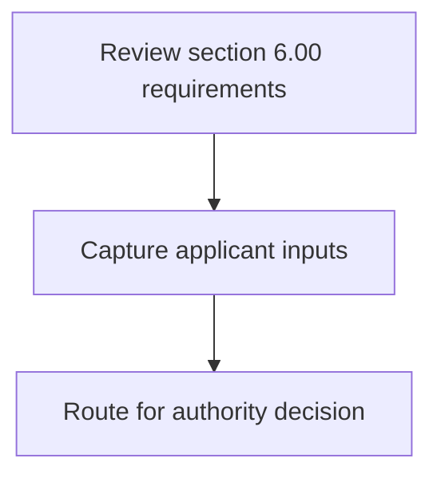
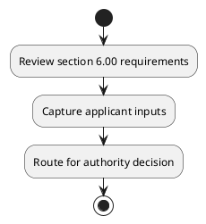

# Chapter 6 / Section 6.00: Scheme

**Chapter Title:** Export Oriented Units (EOUs), Electronics Hardware Technology Parks (EHTPs), Software Technology Parks (STPs) and Bio-Technology

**Pages:** 2

**Purpose:** 6.00 Scheme
Policy relating to EOUs, EHTPs, STPs and BTPs Schemes is given in Chapter 6 of
Foreign Trade Policy (FTP).

**Purpose Thanglish:** Indha Scheme section-la, 6.00 Scheme
Policy relating to EOUs, EHTPs, STPs and BTPs Schemes is given in Chapter 6 of
Foreign Trade Policy (FTP).

**Summary:** 6.00 Scheme
Policy relating to EOUs, EHTPs, STPs and BTPs Schemes is given in Chapter 6 of
Foreign Trade Policy (FTP).

**Business Meaning:** 6.00 Scheme
Policy relating to EOUs, EHTPs, STPs and BTPs Schemes is given in Chapter 6 of
Foreign Trade Policy (FTP).

**Business Explanation:** 6.00 Scheme
Policy relating to EOUs, EHTPs, STPs and BTPs Schemes is given in Chapter 6 of
Foreign Trade Policy (FTP).

**Business Explanation Thanglish:** Indha Scheme section-la, 6.00 Scheme
Policy relating to EOUs, EHTPs, STPs and BTPs Schemes is given in Chapter 6 of
Foreign Trade Policy (FTP).

## Business Logic
- None identified

## Business Rules
- rule_id=CH6-SEC6_00-R001, rule_description=6.00 Scheme
Policy relating to EOUs, EHTPs, STPs and BTPs Schemes is given in Chapter 6 of
Foreign Trade Policy (FTP)., trigger=Scheme, condition=Not explicitly covered in uploaded documents., validation=Not explicitly covered in uploaded documents., action=Manual review required., exception=No explicit exception found in uploaded documents., output=DEKAI should produce a compliance decision for 6.00 - Scheme.

## Conditions
- None identified

## Condition Logic
- None identified

## Validations
- None identified

## Exceptions
- None identified

## Dependencies
- 6

## Authorities
- None identified

## Required Documents
- None identified

## Timelines
- None identified

## Actions
- None identified

## Workflow
- Review section 6.00 requirements
- Capture applicant inputs
- Route for authority decision

## Workflow ASCII
```text
Scheme
Review section 6.00 requirements
   |
   v
Capture applicant inputs
   |
   v
Route for authority decision
```

## Decision Tree
- IF section 6.00 applies THEN proceed with standard DGFT workflow

## Decision Tree ASCII
```text
Scheme Decision
IF section 6.00 applies THEN proceed with standard DGFT workflow
```

## Examples
- User asks to process Scheme; the platform checks conditions, validations, and documents before action.

**Real-world Example:** Example: an importer or exporter invokes Scheme, submits the prescribed DGFT records, and DEKAI uses the extracted rules to follow the scheme process.

**Real-world Example Thanglish:** Indha Scheme section-la, Example: an importer or exporter invokes Scheme, submits the prescribed DGFT records, and DEKAI uses the extracted rules to follow the scheme process.

## AI Rules
- None identified

## Database Fields
- name=section_code, type=string, required=True, source=parsed_section_heading
- name=section_title, type=string, required=True, source=parsed_section_heading
- name=and_flag, type=boolean, required=False, source=keyword:and
- name=ftp_flag, type=boolean, required=False, source=keyword:FTP
- name=eous_flag, type=boolean, required=False, source=keyword:EOUs
- name=stps_flag, type=boolean, required=False, source=keyword:STPs
- name=btps_flag, type=boolean, required=False, source=keyword:BTPs
- name=ehtps_flag, type=boolean, required=False, source=keyword:EHTPs
- name=given_flag, type=boolean, required=False, source=keyword:given
- name=trade_flag, type=boolean, required=False, source=keyword:Trade

## API Requirements
- method=GET, path=/api/dgft/sections/6.00, purpose=Retrieve knowledge payload for section 6.00, query_params=['include=workflow,decision_tree,validations'], response_fields=['section', 'title', 'summary', 'conditions', 'validations', 'exceptions', 'workflow', 'decision_tree']
- method=POST, path=/api/dgft/Scheme/validate, purpose=Validate inputs and documents for Scheme, request_fields=['section_code', 'section_title'], response_fields=['status', 'errors', 'warnings', 'next_actions']

## UI Screens
- screen_id=Scheme_overview, name=Scheme Overview, purpose=Show section summary, authority, timeline, and eligibility cues., widgets=['summary_card', 'conditions_table', 'authority_badges', 'timeline_panel']
- screen_id=Scheme_submission, name=Scheme Submission, purpose=Capture applicant data and supporting documents., widgets=['dynamic_form', 'document_uploader', 'validation_panel', 'next_action_footer'], fields=['section_code', 'section_title', 'and_flag', 'ftp_flag', 'eous_flag', 'stps_flag', 'btps_flag', 'ehtps_flag']

## Error Messages
- Validation failed because the section requirements were not fully met.

## FAQ
- question_en=What is the purpose of section 6.00?, answer_en=6.00 Scheme
Policy relating to EOUs, EHTPs, STPs and BTPs Schemes is given in Chapter 6 of
Foreign Trade Policy (FTP)., question_thanglish=Indha Scheme section-la, What is the purpose of section 6.00?, answer_thanglish=Indha Scheme section-la, 6.00 Scheme
Policy relating to EOUs, EHTPs, STPs and BTPs Schemes is given in Chapter 6 of
Foreign Trade Policy (FTP).
- question_en=What documents are required under Scheme?, answer_en=Not explicitly covered in uploaded documents., question_thanglish=Indha Scheme section-la, What documents are required under Scheme?, answer_thanglish=Indha Scheme section-la, Not explicitly covered in uploaded documents.
- question_en=Which authority handles Scheme?, answer_en=Not explicitly covered in uploaded documents., question_thanglish=Indha Scheme section-la, Which authority handles Scheme?, answer_thanglish=Indha Scheme section-la, Not explicitly covered in uploaded documents.

## Questions Users May Ask
- What does Scheme require?
- Which documents are needed for Scheme?
- How does DEKAI validate Scheme requests?

## Expected AI Answers
- Scheme requires the platform to interpret the section text, apply the extracted business rules, and present the correct next action.
- Required documents are inferred from the section text: no explicit documents were detected.
- DEKAI validates Scheme by checking conditions, required documents, authority references, and exception clauses before recommending an outcome.

## AI Q&A Examples
- question_en=User asks: How do I comply with Scheme?, answer_en=AI answers: DEKAI should evaluate section 6.00, apply the extracted rules, and guide the user through Review section 6.00 requirements., question_thanglish=Indha Scheme section-la, User asks: How do I comply with Scheme?, answer_thanglish=Indha Scheme section-la, AI answers: DEKAI should evaluate section 6.00, apply the extracted rules, and guide the user through Review section 6.00 requirements.
- question_en=User asks: Which validations apply to Scheme?, answer_en=AI answers: Applicable validations are not explicitly covered in the uploaded documents., question_thanglish=Indha Scheme section-la, User asks: Which validations apply to Scheme?, answer_thanglish=Indha Scheme section-la, AI answers: Applicable validations are not explicitly covered in the uploaded documents.

## DEKAI AI Implementation Notes
- Capture chapter 6, section 6.00, title, and page references as immutable knowledge metadata.
- Bind validations for Scheme into a rule engine keyed by the rule IDs extracted for this section.

## DEKAI AI Implementation Notes Thanglish
- Indha Scheme section-la, Capture chapter 6, section 6.00, title, and page references as immutable knowledge metadata.
- Indha Scheme section-la, Bind validations for Scheme into a rule engine keyed by the rule IDs extracted for this section.

## AI Metadata
- Keywords: and, FTP, EOUs, STPs, BTPs, EHTPs, given, Trade, Scheme, Policy, Schemes, Chapter, Foreign, relating
- Search Keywords: and, FTP, EOUs, STPs, BTPs, EHTPs, given, Trade, Scheme, Policy, Schemes, Chapter, Foreign, relating
- Intent: Provide knowledge guidance for Scheme.
- Tags: 6.00, Scheme, dgft
- Related Sections: 
- Related Chapters: 
- Related Rules: 

## Mermaid


## PlantUML

