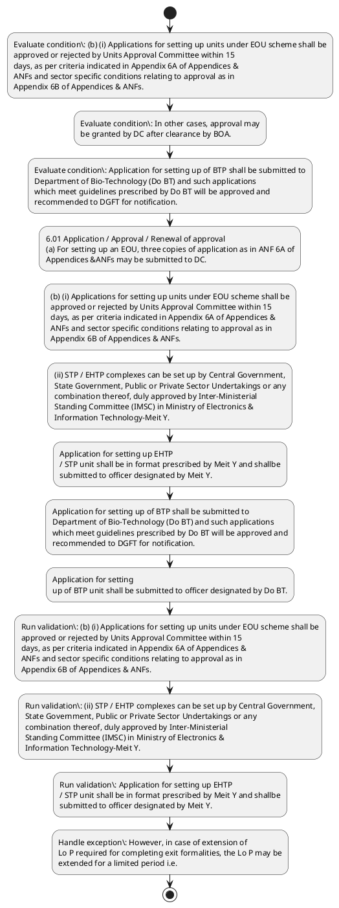

# Chapter 6 / Section 6.01: Application / Approval / Renewal of approval

**Chapter Title:** Export Oriented Units (EOUs), Electronics Hardware Technology Parks (EHTPs), Software Technology Parks (STPs) and Bio-Technology

**Pages:** 2, 3, 4

**Purpose:** 6.01 Application / Approval / Renewal of approval
(a) For setting up an EOU, three copies of application as in ANF 6A of
Appendices &ANFs may be submitted to DC.

**Purpose Thanglish:** Indha Application / Approval / Renewal of approval section-la, 6.01 application / Approval / Renewal of approval
(a) For setting up an EOU, three copies of application as in ANF 6A of
Appendices &ANFs may be submitted to DC.

**Summary:** 6.01 Application / Approval / Renewal of approval
(a) For setting up an EOU, three copies of application as in ANF 6A of
Appendices &ANFs may be submitted to DC. (b) (i) Applications for setting up units under EOU scheme shall be
approved or rejected by Units Approval Committee within 15
days, as per criteria indicated in Appendix 6A of Appendices &
ANFs and sector specific conditions relating to approval as in
Appendix 6B of Appendices & ANFs. In other cases, approval may
be granted by DC after clearance by BOA.

**Business Meaning:** Application / Approval / Renewal of approval governs how DGFT business controls should be applied, validated, and enforced.

**Business Explanation:** Application / Approval / Renewal of approval explains the operating rule set that DEKAI should enforce. Key control points include (b) (i) Applications for setting up units under EOU scheme shall be
approved or rejected by Units Approval Committee within 15
days, as per criteria indicated in Appendix 6A of Appendices &
ANFs and sector specific conditions relating to approval as in
Appendix 6B of Appendices & ANFs. The section also drives actions such as 6.01 Application / Approval / Renewal of approval
(a) For setting up an EOU, three copies of application as in ANF 6A of
Appendices &ANFs may be submitted to DC..

**Business Explanation Thanglish:** Indha Application / Approval / Renewal of approval section-la, application / Approval / Renewal of approval explains the operating rule set that DEKAI should enforce. Key control points include (b) (i) Applications for setting up units under EOU scheme kandippa be
approved or rejected by Units Approval Committee within 15
days, as per criteria indicated in Appendix 6A of Appendices &
ANFs and sector specific conditions relating to approval as in
Appendix 6B of Appendices & ANFs. The section also drives actions such as 6.01 application / Approval / Renewal of approval
(a) For setting up an EOU, three copies of application as in ANF 6A of
Appendices &ANFs may be submitted to DC..

## Business Logic
- (b) (i) Applications for setting up units under EOU scheme shall be
approved or rejected by Units Approval Committee within 15
days, as per criteria indicated in Appendix 6A of Appendices &
ANFs and sector specific conditions relating to approval as in
Appendix 6B of Appendices & ANFs.
- Application for setting up EHTP
/ STP unit shall be in format prescribed by Meit Y and shallbe
submitted to officer designated by Meit Y.
- Application for setting up of BTP shall be submitted to
Department of Bio-Technology (Do BT) and such applications
which meet guidelines prescribed by Do BT will be approved and
recommended to DGFT for notification.
- Application for setting
up of BTP unit shall be submitted to officer designated by Do BT.
- (c) On approval, a Letter of Permission (Lo P) / Letter of Intent (Lo I)
shall be issued by DC / designated officer to EOU/ EHTP /
pg.
- (c)
On approval, a Letter of Permission (Lo P) / Letter of Intent (Lo I)
shall be issued by DC / designated officer to EOU/ EHTP /
STP / BTP unit.
- Lo P / Lo I shall have an initial validity of 2 years
to enable the Unit to construct the plant & install the machinery
and by this time the unit should have commenced production.
- Subsequent
extension of one year may be given by the Unit Approval
Committee subject to condition that two thirds of activities
including construction, relating to the setting upof the Unit are
completed and a Chartered Engineer’s certificate to this effect is
submitted by the Unit.
- Once unit commences
production, Lo P / Lo I issued shall be valid for a period of 5 years
for its activities.
- (e) Lo P / Lo I shall specify item(s) of manufacture / service activity,
annual capacity, projected annual export for first five years in
dollar terms, Net Foreign Exchange (NFE) earnings, limitations,
if any, regarding sale of finished goods, by-products and rejects
in DTA and such other matter as may be necessary and also
impose such conditions as may be required.
- (g) EOUs shall have separate earmarked premises for separate Lo P.
- However, in case lease is obtained from
private parties, it shall have a validity period of five years from
date of LUT and DC shall satisfy himself of genuine nature of
lease.
- (h) On completion of validity of LOP/LOI as provided for in
Paragraph 6.05 of FTP, it shall be open to unit to continue under
pg.
- (e)
Lo P / Lo I shall specify item(s) of manufacture / service activity,
annual capacity, projected annual export for first five years in
dollar terms, Net Foreign Exchange (NFE) earnings, limitations,
if any, regarding sale of finished goods, by-products and rejects
in DTA and such other matter as may be necessary and also
impose such conditions as may be required.
- (g)
EOUs shall have separate earmarked premises for separate Lo P.
- (h)
On completion of validity of LOP/LOI as provided for in
Paragraph 6.05 of FTP, it shall be open to unit to continue under
scheme or opt out of scheme.

## Business Rules
- rule_id=CH6-SEC6_01-R001, rule_description=(b) (i) Applications for setting up units under EOU scheme shall be
approved or rejected by Units Approval Committee within 15
days, as per criteria indicated in Appendix 6A of Appendices &
ANFs and sector specific conditions relating to approval as in
Appendix 6B of Appendices & ANFs., trigger=Application / Approval / Renewal of approval, condition=(b) (i) Applications for setting up units under EOU scheme shall be
approved or rejected by Units Approval Committee within 15
days, as per criteria indicated in Appendix 6A of Appendices &
ANFs and sector specific conditions relating to approval as in
Appendix 6B of Appendices & ANFs., validation=(b) (i) Applications for setting up units under EOU scheme shall be
approved or rejected by Units Approval Committee within 15
days, as per criteria indicated in Appendix 6A of Appendices &
ANFs and sector specific conditions relating to approval as in
Appendix 6B of Appendices & ANFs., action=6.01 Application / Approval / Renewal of approval
(a) For setting up an EOU, three copies of application as in ANF 6A of
Appendices &ANFs may be submitted to DC., exception=However, in case of extension of
Lo P required for completing exit formalities, the Lo P may be
extended for a limited period i.e., output=DEKAI should produce a compliance decision for 6.01 - Application / Approval / Renewal of approval.
- rule_id=CH6-SEC6_01-R002, rule_description=Application for setting up EHTP
/ STP unit shall be in format prescribed by Meit Y and shallbe
submitted to officer designated by Meit Y., trigger=Application / Approval / Renewal of approval, condition=In other cases, approval may
be granted by DC after clearance by BOA., validation=(ii) STP / EHTP complexes can be set up by Central Government,
State Government, Public or Private Sector Undertakings or any
combination thereof, duly approved by Inter-Ministerial
Standing Committee (IMSC) in Ministry of Electronics &
Information Technology-Meit Y., action=(b) (i) Applications for setting up units under EOU scheme shall be
approved or rejected by Units Approval Committee within 15
days, as per criteria indicated in Appendix 6A of Appendices &
ANFs and sector specific conditions relating to approval as in
Appendix 6B of Appendices & ANFs., exception=However, in case lease is obtained from
private parties, it shall have a validity period of five years from
date of LUT and DC shall satisfy himself of genuine nature of
lease., output=DEKAI should produce a compliance decision for 6.01 - Application / Approval / Renewal of approval.
- rule_id=CH6-SEC6_01-R003, rule_description=Application for setting up of BTP shall be submitted to
Department of Bio-Technology (Do BT) and such applications
which meet guidelines prescribed by Do BT will be approved and
recommended to DGFT for notification., trigger=Application / Approval / Renewal of approval, condition=Application for setting up of BTP shall be submitted to
Department of Bio-Technology (Do BT) and such applications
which meet guidelines prescribed by Do BT will be approved and
recommended to DGFT for notification., validation=Application for setting up EHTP
/ STP unit shall be in format prescribed by Meit Y and shallbe
submitted to officer designated by Meit Y., action=(ii) STP / EHTP complexes can be set up by Central Government,
State Government, Public or Private Sector Undertakings or any
combination thereof, duly approved by Inter-Ministerial
Standing Committee (IMSC) in Ministry of Electronics &
Information Technology-Meit Y., exception=However, in case lease is obtained from
private parties, it shall have a validity period of five years from
date of LUT and DC shall satisfy himself of genuine nature of
lease., output=DEKAI should produce a compliance decision for 6.01 - Application / Approval / Renewal of approval.
- rule_id=CH6-SEC6_01-R004, rule_description=Application for setting
up of BTP unit shall be submitted to officer designated by Do BT., trigger=Application / Approval / Renewal of approval, condition=Subsequent
extension of one year may be given by the Unit Approval
Committee subject to condition that two thirds of activities
including construction, relating to the setting upof the Unit are
completed and a Chartered Engineer’s certificate to this effect is
submitted by the Unit., validation=Application for setting up of BTP shall be submitted to
Department of Bio-Technology (Do BT) and such applications
which meet guidelines prescribed by Do BT will be approved and
recommended to DGFT for notification., action=Application for setting up EHTP
/ STP unit shall be in format prescribed by Meit Y and shallbe
submitted to officer designated by Meit Y., exception=However, in case lease is obtained from
private parties, it shall have a validity period of five years from
date of LUT and DC shall satisfy himself of genuine nature of
lease., output=DEKAI should produce a compliance decision for 6.01 - Application / Approval / Renewal of approval.
- rule_id=CH6-SEC6_01-R005, rule_description=(c) On approval, a Letter of Permission (Lo P) / Letter of Intent (Lo I)
shall be issued by DC / designated officer to EOU/ EHTP /
pg., trigger=Application / Approval / Renewal of approval, condition=necessary, validation=Application for setting
up of BTP unit shall be submitted to officer designated by Do BT., action=Application for setting up of BTP shall be submitted to
Department of Bio-Technology (Do BT) and such applications
which meet guidelines prescribed by Do BT will be approved and
recommended to DGFT for notification., exception=However, in case lease is obtained from
private parties, it shall have a validity period of five years from
date of LUT and DC shall satisfy himself of genuine nature of
lease., output=DEKAI should produce a compliance decision for 6.01 - Application / Approval / Renewal of approval.
- rule_id=CH6-SEC6_01-R006, rule_description=(c)
On approval, a Letter of Permission (Lo P) / Letter of Intent (Lo I)
shall be issued by DC / designated officer to EOU/ EHTP /
STP / BTP unit., trigger=Application / Approval / Renewal of approval, condition=However, in case of extension of
Lo P required for completing exit formalities, the Lo P may be
extended for a limited period i.e., validation=(c) On approval, a Letter of Permission (Lo P) / Letter of Intent (Lo I)
shall be issued by DC / designated officer to EOU/ EHTP /
pg., action=Application for setting
up of BTP unit shall be submitted to officer designated by Do BT., exception=However, in case lease is obtained from
private parties, it shall have a validity period of five years from
date of LUT and DC shall satisfy himself of genuine nature of
lease., output=DEKAI should produce a compliance decision for 6.01 - Application / Approval / Renewal of approval.
- rule_id=CH6-SEC6_01-R007, rule_description=Lo P / Lo I shall have an initial validity of 2 years
to enable the Unit to construct the plant & install the machinery
and by this time the unit should have commenced production., trigger=Application / Approval / Renewal of approval, condition=(d) Proposals for setting up an EOU requiring industrial licence may
be granted approval by the concerned DC after clearance of
proposal by BOA (as per Appendix 6C of Appendices & ANFs) and
Department for Promotion of Industry and Internal Trade
(DPIIT) within 45 days., validation=(ii)
STP / EHTP complexes can be set up by Central Government,
State Government, Public or Private Sector Undertakings or any
combination thereof, duly approved by Inter-Ministerial
Standing Committee (IMSC) in Ministry of Electronics &
Information Technology-Meit Y., action=(c) On approval, a Letter of Permission (Lo P) / Letter of Intent (Lo I)
shall be issued by DC / designated officer to EOU/ EHTP /
pg., exception=However, in case lease is obtained from
private parties, it shall have a validity period of five years from
date of LUT and DC shall satisfy himself of genuine nature of
lease., output=DEKAI should produce a compliance decision for 6.01 - Application / Approval / Renewal of approval.
- rule_id=CH6-SEC6_01-R008, rule_description=Subsequent
extension of one year may be given by the Unit Approval
Committee subject to condition that two thirds of activities
including construction, relating to the setting upof the Unit are
completed and a Chartered Engineer’s certificate to this effect is
submitted by the Unit., trigger=Application / Approval / Renewal of approval, condition=any, validation=(c)
On approval, a Letter of Permission (Lo P) / Letter of Intent (Lo I)
shall be issued by DC / designated officer to EOU/ EHTP /
STP / BTP unit., action=134
Chapter-6
Export Oriented Units (EOUs),
Electronics Hardware Technology Parks(EHTPs),
Software Technology Parks (STPs) and
Bio-Technology Parks (BTPs)
6.01 Application / Approval / Renewal of approval
(a)
For setting up an EOU, three copies of application as in ANF 6A of
Appendices &ANFs may be submitted to DC., exception=However, in case lease is obtained from
private parties, it shall have a validity period of five years from
date of LUT and DC shall satisfy himself of genuine nature of
lease., output=DEKAI should produce a compliance decision for 6.01 - Application / Approval / Renewal of approval.
- rule_id=CH6-SEC6_01-R009, rule_description=Once unit commences
production, Lo P / Lo I issued shall be valid for a period of 5 years
for its activities., trigger=Application / Approval / Renewal of approval, condition=However, in case lease is obtained from
private parties, it shall have a validity period of five years from
date of LUT and DC shall satisfy himself of genuine nature of
lease., validation=Lo P / Lo I shall have an initial validity of 2 years
to enable the Unit to construct the plant & install the machinery
and by this time the unit should have commenced production., action=(ii)
STP / EHTP complexes can be set up by Central Government,
State Government, Public or Private Sector Undertakings or any
combination thereof, duly approved by Inter-Ministerial
Standing Committee (IMSC) in Ministry of Electronics &
Information Technology-Meit Y., exception=However, in case lease is obtained from
private parties, it shall have a validity period of five years from
date of LUT and DC shall satisfy himself of genuine nature of
lease., output=DEKAI should produce a compliance decision for 6.01 - Application / Approval / Renewal of approval.
- rule_id=CH6-SEC6_01-R010, rule_description=(e) Lo P / Lo I shall specify item(s) of manufacture / service activity,
annual capacity, projected annual export for first five years in
dollar terms, Net Foreign Exchange (NFE) earnings, limitations,
if any, regarding sale of finished goods, by-products and rejects
in DTA and such other matter as may be necessary and also
impose such conditions as may be required., trigger=Application / Approval / Renewal of approval, condition=(d)
Proposals for setting up an EOU requiring industrial licence may
be granted approval by the concerned DC after clearance of
proposal by BOA (as per Appendix 6C of Appendices & ANFs) and
Department for Promotion of Industry and Internal Trade
(DPIIT) within 45 days., validation=Subsequent
extension of one year may be given by the Unit Approval
Committee subject to condition that two thirds of activities
including construction, relating to the setting upof the Unit are
completed and a Chartered Engineer’s certificate to this effect is
submitted by the Unit., action=(c)
On approval, a Letter of Permission (Lo P) / Letter of Intent (Lo I)
shall be issued by DC / designated officer to EOU/ EHTP /
STP / BTP unit., exception=However, in case lease is obtained from
private parties, it shall have a validity period of five years from
date of LUT and DC shall satisfy himself of genuine nature of
lease., output=DEKAI should produce a compliance decision for 6.01 - Application / Approval / Renewal of approval.
- rule_id=CH6-SEC6_01-R011, rule_description=(g) EOUs shall have separate earmarked premises for separate Lo P., trigger=Application / Approval / Renewal of approval, condition=any, validation=Once unit commences
production, Lo P / Lo I issued shall be valid for a period of 5 years
for its activities., action=Subsequent
extension of one year may be given by the Unit Approval
Committee subject to condition that two thirds of activities
including construction, relating to the setting upof the Unit are
completed and a Chartered Engineer’s certificate to this effect is
submitted by the Unit., exception=However, in case lease is obtained from
private parties, it shall have a validity period of five years from
date of LUT and DC shall satisfy himself of genuine nature of
lease., output=DEKAI should produce a compliance decision for 6.01 - Application / Approval / Renewal of approval.
- rule_id=CH6-SEC6_01-R012, rule_description=However, in case lease is obtained from
private parties, it shall have a validity period of five years from
date of LUT and DC shall satisfy himself of genuine nature of
lease., trigger=Application / Approval / Renewal of approval, condition=Where unit opts to continue,
DC/Designated Officer will extend validity of the LOP/LOI., validation=However, in case of extension of
Lo P required for completing exit formalities, the Lo P may be
extended for a limited period i.e., action=Once unit commences
production, Lo P / Lo I issued shall be valid for a period of 5 years
for its activities., exception=However, in case lease is obtained from
private parties, it shall have a validity period of five years from
date of LUT and DC shall satisfy himself of genuine nature of
lease., output=DEKAI should produce a compliance decision for 6.01 - Application / Approval / Renewal of approval.
- rule_id=CH6-SEC6_01-R013, rule_description=(h) On completion of validity of LOP/LOI as provided for in
Paragraph 6.05 of FTP, it shall be open to unit to continue under
pg., trigger=Application / Approval / Renewal of approval, condition=If no
intimation in this regard is received from unit within a period of
six months of expiry of the validity, DC/Designated Officer will,
suomoto, take action to cancel approval under the scheme and
take further action in this regard., validation=(e) Lo P / Lo I shall specify item(s) of manufacture / service activity,
annual capacity, projected annual export for first five years in
dollar terms, Net Foreign Exchange (NFE) earnings, limitations,
if any, regarding sale of finished goods, by-products and rejects
in DTA and such other matter as may be necessary and also
impose such conditions as may be required., action=(e) Lo P / Lo I shall specify item(s) of manufacture / service activity,
annual capacity, projected annual export for first five years in
dollar terms, Net Foreign Exchange (NFE) earnings, limitations,
if any, regarding sale of finished goods, by-products and rejects
in DTA and such other matter as may be necessary and also
impose such conditions as may be required., exception=However, in case lease is obtained from
private parties, it shall have a validity period of five years from
date of LUT and DC shall satisfy himself of genuine nature of
lease., output=DEKAI should produce a compliance decision for 6.01 - Application / Approval / Renewal of approval.
- rule_id=CH6-SEC6_01-R014, rule_description=(e)
Lo P / Lo I shall specify item(s) of manufacture / service activity,
annual capacity, projected annual export for first five years in
dollar terms, Net Foreign Exchange (NFE) earnings, limitations,
if any, regarding sale of finished goods, by-products and rejects
in DTA and such other matter as may be necessary and also
impose such conditions as may be required., trigger=Application / Approval / Renewal of approval, condition=Where units give their option
to continue after expiry of six months as stipulated above,
DC/Designated Officer will grant extension after obtaining
approval of BOA/IMSC., validation=(g) EOUs shall have separate earmarked premises for separate Lo P., action=(f) Lo P / Lo I issued to EOU / EHTP / STP / BTP units by concerned
authority would be construed as an authorisation for all
purposes., exception=However, in case lease is obtained from
private parties, it shall have a validity period of five years from
date of LUT and DC shall satisfy himself of genuine nature of
lease., output=DEKAI should produce a compliance decision for 6.01 - Application / Approval / Renewal of approval.
- rule_id=CH6-SEC6_01-R015, rule_description=(g)
EOUs shall have separate earmarked premises for separate Lo P., trigger=Application / Approval / Renewal of approval, condition=Where units give their option
to continue after expiry of six months as stipulated above,
DC/Designated Officer will grant extension after obtaining
approval of BOA/IMSC., validation=Similarly, EOUs may be approved on leased premises provided
lease has been obtained from Government Department /
Undertaking / Agency., action=Similarly, EOUs may be approved on leased premises provided
lease has been obtained from Government Department /
Undertaking / Agency., exception=However, in case lease is obtained from
private parties, it shall have a validity period of five years from
date of LUT and DC shall satisfy himself of genuine nature of
lease., output=DEKAI should produce a compliance decision for 6.01 - Application / Approval / Renewal of approval.
- rule_id=CH6-SEC6_01-R016, rule_description=(h)
On completion of validity of LOP/LOI as provided for in
Paragraph 6.05 of FTP, it shall be open to unit to continue under
scheme or opt out of scheme., trigger=Application / Approval / Renewal of approval, condition=Where units give their option
to continue after expiry of six months as stipulated above,
DC/Designated Officer will grant extension after obtaining
approval of BOA/IMSC., validation=However, in case lease is obtained from
private parties, it shall have a validity period of five years from
date of LUT and DC shall satisfy himself of genuine nature of
lease., action=However, in case lease is obtained from
private parties, it shall have a validity period of five years from
date of LUT and DC shall satisfy himself of genuine nature of
lease., exception=However, in case lease is obtained from
private parties, it shall have a validity period of five years from
date of LUT and DC shall satisfy himself of genuine nature of
lease., output=DEKAI should produce a compliance decision for 6.01 - Application / Approval / Renewal of approval.

## Conditions
- (b) (i) Applications for setting up units under EOU scheme shall be
approved or rejected by Units Approval Committee within 15
days, as per criteria indicated in Appendix 6A of Appendices &
ANFs and sector specific conditions relating to approval as in
Appendix 6B of Appendices & ANFs.
- In other cases, approval may
be granted by DC after clearance by BOA.
- Application for setting up of BTP shall be submitted to
Department of Bio-Technology (Do BT) and such applications
which meet guidelines prescribed by Do BT will be approved and
recommended to DGFT for notification.
- Subsequent
extension of one year may be given by the Unit Approval
Committee subject to condition that two thirds of activities
including construction, relating to the setting upof the Unit are
completed and a Chartered Engineer’s certificate to this effect is
submitted by the Unit.
- Further extension, if necessary, will be
granted by the Board of Approval.
- However, in case of extension of
Lo P required for completing exit formalities, the Lo P may be
extended for a limited period i.e.
- (d) Proposals for setting up an EOU requiring industrial licence may
be granted approval by the concerned DC after clearance of
proposal by BOA (as per Appendix 6C of Appendices & ANFs) and
Department for Promotion of Industry and Internal Trade
(DPIIT) within 45 days.
- (e) Lo P / Lo I shall specify item(s) of manufacture / service activity,
annual capacity, projected annual export for first five years in
dollar terms, Net Foreign Exchange (NFE) earnings, limitations,
if any, regarding sale of finished goods, by-products and rejects
in DTA and such other matter as may be necessary and also
impose such conditions as may be required.
- However, in case lease is obtained from
private parties, it shall have a validity period of five years from
date of LUT and DC shall satisfy himself of genuine nature of
lease.
- (d)
Proposals for setting up an EOU requiring industrial licence may
be granted approval by the concerned DC after clearance of
proposal by BOA (as per Appendix 6C of Appendices & ANFs) and
Department for Promotion of Industry and Internal Trade
(DPIIT) within 45 days.
- (e)
Lo P / Lo I shall specify item(s) of manufacture / service activity,
annual capacity, projected annual export for first five years in
dollar terms, Net Foreign Exchange (NFE) earnings, limitations,
if any, regarding sale of finished goods, by-products and rejects
in DTA and such other matter as may be necessary and also
impose such conditions as may be required.
- Where unit opts to continue,
DC/Designated Officer will extend validity of the LOP/LOI.
- If no
intimation in this regard is received from unit within a period of
six months of expiry of the validity, DC/Designated Officer will,
suomoto, take action to cancel approval under the scheme and
take further action in this regard.
- Where units give their option
to continue after expiry of six months as stipulated above,
DC/Designated Officer will grant extension after obtaining
approval of BOA/IMSC.

## Condition Logic
- id=6.6.01.1, if=(b) (i) Applications for setting up units under EOU scheme shall be
approved or rejected by Units Approval Committee within 15
days, as per criteria indicated in Appendix 6A of Appendices &
ANFs and sector specific conditions relating to approval as in
Appendix 6B of Appendices & ANFs., then=6.01 Application / Approval / Renewal of approval
(a) For setting up an EOU, three copies of application as in ANF 6A of
Appendices &ANFs may be submitted to DC., source=(b) (i) Applications for setting up units under EOU scheme shall be
approved or rejected by Units Approval Committee within 15
days, as per criteria indicated in Appendix 6A of Appendices &
ANFs and sector specific conditions relating to approval as in
Appendix 6B of Appendices & ANFs.
- id=6.6.01.2, if=In other cases, approval may
be granted by DC after clearance by BOA., then=6.01 Application / Approval / Renewal of approval
(a) For setting up an EOU, three copies of application as in ANF 6A of
Appendices &ANFs may be submitted to DC., source=In other cases, approval may
be granted by DC after clearance by BOA.
- id=6.6.01.3, if=Application for setting up of BTP shall be submitted to
Department of Bio-Technology (Do BT) and such applications
which meet guidelines prescribed by Do BT will be approved and
recommended to DGFT for notification., then=6.01 Application / Approval / Renewal of approval
(a) For setting up an EOU, three copies of application as in ANF 6A of
Appendices &ANFs may be submitted to DC., source=Application for setting up of BTP shall be submitted to
Department of Bio-Technology (Do BT) and such applications
which meet guidelines prescribed by Do BT will be approved and
recommended to DGFT for notification.
- id=6.6.01.4, if=Subsequent
extension of one year may be given by the Unit Approval
Committee subject to condition that two thirds of activities
including construction, relating to the setting upof the Unit are
completed and a Chartered Engineer’s certificate to this effect is
submitted by the Unit., then=6.01 Application / Approval / Renewal of approval
(a) For setting up an EOU, three copies of application as in ANF 6A of
Appendices &ANFs may be submitted to DC., source=Subsequent
extension of one year may be given by the Unit Approval
Committee subject to condition that two thirds of activities
including construction, relating to the setting upof the Unit are
completed and a Chartered Engineer’s certificate to this effect is
submitted by the Unit.
- id=6.6.01.5, if=necessary, then=6.01 Application / Approval / Renewal of approval
(a) For setting up an EOU, three copies of application as in ANF 6A of
Appendices &ANFs may be submitted to DC., source=Further extension, if necessary, will be
granted by the Board of Approval.
- id=6.6.01.6, if=However, in case of extension of
Lo P required for completing exit formalities, the Lo P may be
extended for a limited period i.e., then=6.01 Application / Approval / Renewal of approval
(a) For setting up an EOU, three copies of application as in ANF 6A of
Appendices &ANFs may be submitted to DC., source=However, in case of extension of
Lo P required for completing exit formalities, the Lo P may be
extended for a limited period i.e.
- id=6.6.01.7, if=(d) Proposals for setting up an EOU requiring industrial licence may
be granted approval by the concerned DC after clearance of
proposal by BOA (as per Appendix 6C of Appendices & ANFs) and
Department for Promotion of Industry and Internal Trade
(DPIIT) within 45 days., then=6.01 Application / Approval / Renewal of approval
(a) For setting up an EOU, three copies of application as in ANF 6A of
Appendices &ANFs may be submitted to DC., source=(d) Proposals for setting up an EOU requiring industrial licence may
be granted approval by the concerned DC after clearance of
proposal by BOA (as per Appendix 6C of Appendices & ANFs) and
Department for Promotion of Industry and Internal Trade
(DPIIT) within 45 days.
- id=6.6.01.8, if=any, then=6.01 Application / Approval / Renewal of approval
(a) For setting up an EOU, three copies of application as in ANF 6A of
Appendices &ANFs may be submitted to DC., source=(e) Lo P / Lo I shall specify item(s) of manufacture / service activity,
annual capacity, projected annual export for first five years in
dollar terms, Net Foreign Exchange (NFE) earnings, limitations,
if any, regarding sale of finished goods, by-products and rejects
in DTA and such other matter as may be necessary and also
impose such conditions as may be required.
- id=6.6.01.9, if=However, in case lease is obtained from
private parties, it shall have a validity period of five years from
date of LUT and DC shall satisfy himself of genuine nature of
lease., then=6.01 Application / Approval / Renewal of approval
(a) For setting up an EOU, three copies of application as in ANF 6A of
Appendices &ANFs may be submitted to DC., source=However, in case lease is obtained from
private parties, it shall have a validity period of five years from
date of LUT and DC shall satisfy himself of genuine nature of
lease.
- id=6.6.01.10, if=(d)
Proposals for setting up an EOU requiring industrial licence may
be granted approval by the concerned DC after clearance of
proposal by BOA (as per Appendix 6C of Appendices & ANFs) and
Department for Promotion of Industry and Internal Trade
(DPIIT) within 45 days., then=6.01 Application / Approval / Renewal of approval
(a) For setting up an EOU, three copies of application as in ANF 6A of
Appendices &ANFs may be submitted to DC., source=(d)
Proposals for setting up an EOU requiring industrial licence may
be granted approval by the concerned DC after clearance of
proposal by BOA (as per Appendix 6C of Appendices & ANFs) and
Department for Promotion of Industry and Internal Trade
(DPIIT) within 45 days.
- id=6.6.01.11, if=any, then=6.01 Application / Approval / Renewal of approval
(a) For setting up an EOU, three copies of application as in ANF 6A of
Appendices &ANFs may be submitted to DC., source=(e)
Lo P / Lo I shall specify item(s) of manufacture / service activity,
annual capacity, projected annual export for first five years in
dollar terms, Net Foreign Exchange (NFE) earnings, limitations,
if any, regarding sale of finished goods, by-products and rejects
in DTA and such other matter as may be necessary and also
impose such conditions as may be required.
- id=6.6.01.12, if=Where unit opts to continue,
DC/Designated Officer will extend validity of the LOP/LOI., then=6.01 Application / Approval / Renewal of approval
(a) For setting up an EOU, three copies of application as in ANF 6A of
Appendices &ANFs may be submitted to DC., source=Where unit opts to continue,
DC/Designated Officer will extend validity of the LOP/LOI.
- id=6.6.01.13, if=If no
intimation in this regard is received from unit within a period of
six months of expiry of the validity, DC/Designated Officer will,
suomoto, take action to cancel approval under the scheme and
take further action in this regard., then=6.01 Application / Approval / Renewal of approval
(a) For setting up an EOU, three copies of application as in ANF 6A of
Appendices &ANFs may be submitted to DC., source=If no
intimation in this regard is received from unit within a period of
six months of expiry of the validity, DC/Designated Officer will,
suomoto, take action to cancel approval under the scheme and
take further action in this regard.
- id=6.6.01.14, if=Where units give their option
to continue after expiry of six months as stipulated above,
DC/Designated Officer will grant extension after obtaining
approval of BOA/IMSC., then=6.01 Application / Approval / Renewal of approval
(a) For setting up an EOU, three copies of application as in ANF 6A of
Appendices &ANFs may be submitted to DC., source=Where units give their option
to continue after expiry of six months as stipulated above,
DC/Designated Officer will grant extension after obtaining
approval of BOA/IMSC.

## Validations
- (b) (i) Applications for setting up units under EOU scheme shall be
approved or rejected by Units Approval Committee within 15
days, as per criteria indicated in Appendix 6A of Appendices &
ANFs and sector specific conditions relating to approval as in
Appendix 6B of Appendices & ANFs.
- (ii) STP / EHTP complexes can be set up by Central Government,
State Government, Public or Private Sector Undertakings or any
combination thereof, duly approved by Inter-Ministerial
Standing Committee (IMSC) in Ministry of Electronics &
Information Technology-Meit Y.
- Application for setting up EHTP
/ STP unit shall be in format prescribed by Meit Y and shallbe
submitted to officer designated by Meit Y.
- Application for setting up of BTP shall be submitted to
Department of Bio-Technology (Do BT) and such applications
which meet guidelines prescribed by Do BT will be approved and
recommended to DGFT for notification.
- Application for setting
up of BTP unit shall be submitted to officer designated by Do BT.
- (c) On approval, a Letter of Permission (Lo P) / Letter of Intent (Lo I)
shall be issued by DC / designated officer to EOU/ EHTP /
pg.
- (ii)
STP / EHTP complexes can be set up by Central Government,
State Government, Public or Private Sector Undertakings or any
combination thereof, duly approved by Inter-Ministerial
Standing Committee (IMSC) in Ministry of Electronics &
Information Technology-Meit Y.
- (c)
On approval, a Letter of Permission (Lo P) / Letter of Intent (Lo I)
shall be issued by DC / designated officer to EOU/ EHTP /
STP / BTP unit.
- Lo P / Lo I shall have an initial validity of 2 years
to enable the Unit to construct the plant & install the machinery
and by this time the unit should have commenced production.
- Subsequent
extension of one year may be given by the Unit Approval
Committee subject to condition that two thirds of activities
including construction, relating to the setting upof the Unit are
completed and a Chartered Engineer’s certificate to this effect is
submitted by the Unit.
- Once unit commences
production, Lo P / Lo I issued shall be valid for a period of 5 years
for its activities.
- However, in case of extension of
Lo P required for completing exit formalities, the Lo P may be
extended for a limited period i.e.
- (e) Lo P / Lo I shall specify item(s) of manufacture / service activity,
annual capacity, projected annual export for first five years in
dollar terms, Net Foreign Exchange (NFE) earnings, limitations,
if any, regarding sale of finished goods, by-products and rejects
in DTA and such other matter as may be necessary and also
impose such conditions as may be required.
- (g) EOUs shall have separate earmarked premises for separate Lo P.
- Similarly, EOUs may be approved on leased premises provided
lease has been obtained from Government Department /
Undertaking / Agency.
- However, in case lease is obtained from
private parties, it shall have a validity period of five years from
date of LUT and DC shall satisfy himself of genuine nature of
lease.
- (h) On completion of validity of LOP/LOI as provided for in
Paragraph 6.05 of FTP, it shall be open to unit to continue under
pg.
- (e)
Lo P / Lo I shall specify item(s) of manufacture / service activity,
annual capacity, projected annual export for first five years in
dollar terms, Net Foreign Exchange (NFE) earnings, limitations,
if any, regarding sale of finished goods, by-products and rejects
in DTA and such other matter as may be necessary and also
impose such conditions as may be required.
- (g)
EOUs shall have separate earmarked premises for separate Lo P.
- (h)
On completion of validity of LOP/LOI as provided for in
Paragraph 6.05 of FTP, it shall be open to unit to continue under
scheme or opt out of scheme.

## Exceptions
- However, in case of extension of
Lo P required for completing exit formalities, the Lo P may be
extended for a limited period i.e.
- However, in case lease is obtained from
private parties, it shall have a validity period of five years from
date of LUT and DC shall satisfy himself of genuine nature of
lease.

## Dependencies
- 6.05

## Authorities
- Units Approval Committee
- Central Government
- State Government
- STP / EHTP complexes can be set up by Central Government
- Standing Committee (IMSC) in Ministry
- A BTP can be set up by Central Government
- DGFT

## Required Documents
- 6.01 Application / Approval / Renewal of approval
(a) For setting up an EOU, three copies of application as in ANF 6A of
Appendices &ANFs may be submitted to DC.
- (b) (i) Applications for setting up units under EOU scheme shall be
approved or rejected by Units Approval Committee within 15
days, as per criteria indicated in Appendix 6A of Appendices &
ANFs and sector specific conditions relating to approval as in
Appendix 6B of Appendices & ANFs.
- (ii) STP / EHTP complexes can be set up by Central Government,
State Government, Public or Private Sector Undertakings or any
combination thereof, duly approved by Inter-Ministerial
Standing Committee (IMSC) in Ministry of Electronics &
Information Technology-Meit Y.
- Application for setting up EHTP
/ STP unit shall be in format prescribed by Meit Y and shallbe
submitted to officer designated by Meit Y.
- (iii) A BTP can be set up by Central Government, State Government,
Public or Private Sector Undertakings or any combination
thereof.
- Application for setting up of BTP shall be submitted to
Department of Bio-Technology (Do BT) and such applications
which meet guidelines prescribed by Do BT will be approved and
recommended to DGFT for notification.
- Application for setting
up of BTP unit shall be submitted to officer designated by Do BT.
- 134
Chapter-6
Export Oriented Units (EOUs),
Electronics Hardware Technology Parks(EHTPs),
Software Technology Parks (STPs) and
Bio-Technology Parks (BTPs)
6.01 Application / Approval / Renewal of approval
(a)
For setting up an EOU, three copies of application as in ANF 6A of
Appendices &ANFs may be submitted to DC.
- (ii)
STP / EHTP complexes can be set up by Central Government,
State Government, Public or Private Sector Undertakings or any
combination thereof, duly approved by Inter-Ministerial
Standing Committee (IMSC) in Ministry of Electronics &
Information Technology-Meit Y.
- (iii)
A BTP can be set up by Central Government, State Government,
Public or Private Sector Undertakings or any combination
thereof.
- Subsequent
extension of one year may be given by the Unit Approval
Committee subject to condition that two thirds of activities
including construction, relating to the setting upof the Unit are
completed and a Chartered Engineer’s certificate to this effect is
submitted by the Unit.
- (d) Proposals for setting up an EOU requiring industrial licence may
be granted approval by the concerned DC after clearance of
proposal by BOA (as per Appendix 6C of Appendices & ANFs) and
Department for Promotion of Industry and Internal Trade
(DPIIT) within 45 days.
- Similarly, EOUs may be approved on leased premises provided
lease has been obtained from Government Department /
Undertaking / Agency.
- (d)
Proposals for setting up an EOU requiring industrial licence may
be granted approval by the concerned DC after clearance of
proposal by BOA (as per Appendix 6C of Appendices & ANFs) and
Department for Promotion of Industry and Internal Trade
(DPIIT) within 45 days.

## Timelines
- (b) (i) Applications for setting up units under EOU scheme shall be
approved or rejected by Units Approval Committee within 15
days, as per criteria indicated in Appendix 6A of Appendices &
ANFs and sector specific conditions relating to approval as in
Appendix 6B of Appendices & ANFs.
- In other cases, approval may
be granted by DC after clearance by BOA.
- Lo P / Lo I shall have an initial validity of 2 years
to enable the Unit to construct the plant & install the machinery
and by this time the unit should have commenced production.
- In
case the unit is not able to commence production in the initial
validity period of 2 years, an extension of one year may be given
by the DC for valid reasons to be recorded in writing.
- Once unit commences
production, Lo P / Lo I issued shall be valid for a period of 5 years
for its activities.
- This period may be extended further by DC for a
period of upto 5 years at a time.
- less than 5 years by the DC.
- (d) Proposals for setting up an EOU requiring industrial licence may
be granted approval by the concerned DC after clearance of
proposal by BOA (as per Appendix 6C of Appendices & ANFs) and
Department for Promotion of Industry and Internal Trade
(DPIIT) within 45 days.
- (e) Lo P / Lo I shall specify item(s) of manufacture / service activity,
annual capacity, projected annual export for first five years in
dollar terms, Net Foreign Exchange (NFE) earnings, limitations,
if any, regarding sale of finished goods, by-products and rejects
in DTA and such other matter as may be necessary and also
impose such conditions as may be required.
- However, in case lease is obtained from
private parties, it shall have a validity period of five years from
date of LUT and DC shall satisfy himself of genuine nature of
lease.
- (d)
Proposals for setting up an EOU requiring industrial licence may
be granted approval by the concerned DC after clearance of
proposal by BOA (as per Appendix 6C of Appendices & ANFs) and
Department for Promotion of Industry and Internal Trade
(DPIIT) within 45 days.
- (e)
Lo P / Lo I shall specify item(s) of manufacture / service activity,
annual capacity, projected annual export for first five years in
dollar terms, Net Foreign Exchange (NFE) earnings, limitations,
if any, regarding sale of finished goods, by-products and rejects
in DTA and such other matter as may be necessary and also
impose such conditions as may be required.
- If no
intimation in this regard is received from unit within a period of
six months of expiry of the validity, DC/Designated Officer will,
suomoto, take action to cancel approval under the scheme and
take further action in this regard.
- Where units give their option
to continue after expiry of six months as stipulated above,
DC/Designated Officer will grant extension after obtaining
approval of BOA/IMSC.

## Actions
- 6.01 Application / Approval / Renewal of approval
(a) For setting up an EOU, three copies of application as in ANF 6A of
Appendices &ANFs may be submitted to DC.
- (b) (i) Applications for setting up units under EOU scheme shall be
approved or rejected by Units Approval Committee within 15
days, as per criteria indicated in Appendix 6A of Appendices &
ANFs and sector specific conditions relating to approval as in
Appendix 6B of Appendices & ANFs.
- (ii) STP / EHTP complexes can be set up by Central Government,
State Government, Public or Private Sector Undertakings or any
combination thereof, duly approved by Inter-Ministerial
Standing Committee (IMSC) in Ministry of Electronics &
Information Technology-Meit Y.
- Application for setting up EHTP
/ STP unit shall be in format prescribed by Meit Y and shallbe
submitted to officer designated by Meit Y.
- Application for setting up of BTP shall be submitted to
Department of Bio-Technology (Do BT) and such applications
which meet guidelines prescribed by Do BT will be approved and
recommended to DGFT for notification.
- Application for setting
up of BTP unit shall be submitted to officer designated by Do BT.
- (c) On approval, a Letter of Permission (Lo P) / Letter of Intent (Lo I)
shall be issued by DC / designated officer to EOU/ EHTP /
pg.
- 134
Chapter-6
Export Oriented Units (EOUs),
Electronics Hardware Technology Parks(EHTPs),
Software Technology Parks (STPs) and
Bio-Technology Parks (BTPs)
6.01 Application / Approval / Renewal of approval
(a)
For setting up an EOU, three copies of application as in ANF 6A of
Appendices &ANFs may be submitted to DC.
- (ii)
STP / EHTP complexes can be set up by Central Government,
State Government, Public or Private Sector Undertakings or any
combination thereof, duly approved by Inter-Ministerial
Standing Committee (IMSC) in Ministry of Electronics &
Information Technology-Meit Y.
- (c)
On approval, a Letter of Permission (Lo P) / Letter of Intent (Lo I)
shall be issued by DC / designated officer to EOU/ EHTP /
STP / BTP unit.
- Subsequent
extension of one year may be given by the Unit Approval
Committee subject to condition that two thirds of activities
including construction, relating to the setting upof the Unit are
completed and a Chartered Engineer’s certificate to this effect is
submitted by the Unit.
- Once unit commences
production, Lo P / Lo I issued shall be valid for a period of 5 years
for its activities.
- (e) Lo P / Lo I shall specify item(s) of manufacture / service activity,
annual capacity, projected annual export for first five years in
dollar terms, Net Foreign Exchange (NFE) earnings, limitations,
if any, regarding sale of finished goods, by-products and rejects
in DTA and such other matter as may be necessary and also
impose such conditions as may be required.
- (f) Lo P / Lo I issued to EOU / EHTP / STP / BTP units by concerned
authority would be construed as an authorisation for all
purposes.
- Similarly, EOUs may be approved on leased premises provided
lease has been obtained from Government Department /
Undertaking / Agency.
- However, in case lease is obtained from
private parties, it shall have a validity period of five years from
date of LUT and DC shall satisfy himself of genuine nature of
lease.
- (e)
Lo P / Lo I shall specify item(s) of manufacture / service activity,
annual capacity, projected annual export for first five years in
dollar terms, Net Foreign Exchange (NFE) earnings, limitations,
if any, regarding sale of finished goods, by-products and rejects
in DTA and such other matter as may be necessary and also
impose such conditions as may be required.
- (f)
Lo P / Lo I issued to EOU / EHTP / STP / BTP units by concerned
authority would be construed as an authorisation for all
purposes.
- Where units give their option
to continue after expiry of six months as stipulated above,
DC/Designated Officer will grant extension after obtaining
approval of BOA/IMSC.

## Workflow
- Evaluate condition: (b) (i) Applications for setting up units under EOU scheme shall be
approved or rejected by Units Approval Committee within 15
days, as per criteria indicated in Appendix 6A of Appendices &
ANFs and sector specific conditions relating to approval as in
Appendix 6B of Appendices & ANFs.
- Evaluate condition: In other cases, approval may
be granted by DC after clearance by BOA.
- Evaluate condition: Application for setting up of BTP shall be submitted to
Department of Bio-Technology (Do BT) and such applications
which meet guidelines prescribed by Do BT will be approved and
recommended to DGFT for notification.
- 6.01 Application / Approval / Renewal of approval
(a) For setting up an EOU, three copies of application as in ANF 6A of
Appendices &ANFs may be submitted to DC.
- (b) (i) Applications for setting up units under EOU scheme shall be
approved or rejected by Units Approval Committee within 15
days, as per criteria indicated in Appendix 6A of Appendices &
ANFs and sector specific conditions relating to approval as in
Appendix 6B of Appendices & ANFs.
- (ii) STP / EHTP complexes can be set up by Central Government,
State Government, Public or Private Sector Undertakings or any
combination thereof, duly approved by Inter-Ministerial
Standing Committee (IMSC) in Ministry of Electronics &
Information Technology-Meit Y.
- Application for setting up EHTP
/ STP unit shall be in format prescribed by Meit Y and shallbe
submitted to officer designated by Meit Y.
- Application for setting up of BTP shall be submitted to
Department of Bio-Technology (Do BT) and such applications
which meet guidelines prescribed by Do BT will be approved and
recommended to DGFT for notification.
- Application for setting
up of BTP unit shall be submitted to officer designated by Do BT.
- Run validation: (b) (i) Applications for setting up units under EOU scheme shall be
approved or rejected by Units Approval Committee within 15
days, as per criteria indicated in Appendix 6A of Appendices &
ANFs and sector specific conditions relating to approval as in
Appendix 6B of Appendices & ANFs.
- Run validation: (ii) STP / EHTP complexes can be set up by Central Government,
State Government, Public or Private Sector Undertakings or any
combination thereof, duly approved by Inter-Ministerial
Standing Committee (IMSC) in Ministry of Electronics &
Information Technology-Meit Y.
- Run validation: Application for setting up EHTP
/ STP unit shall be in format prescribed by Meit Y and shallbe
submitted to officer designated by Meit Y.
- Handle exception: However, in case of extension of
Lo P required for completing exit formalities, the Lo P may be
extended for a limited period i.e.

## Workflow ASCII
```text
Application / Approval / Renewal of approval
Evaluate condition: (b) (i) Applications for setting up units under EOU scheme shall be
approved or rejected by Units Approval Committee within 15
days, as per criteria indicated in Appendix 6A of Appendices &
ANFs and sector specific conditions relating to approval as in
Appendix 6B of Appendices & ANFs.
   |
   v
Evaluate condition: In other cases, approval may
be granted by DC after clearance by BOA.
   |
   v
Evaluate condition: Application for setting up of BTP shall be submitted to
Department of Bio-Technology (Do BT) and such applications
which meet guidelines prescribed by Do BT will be approved and
recommended to DGFT for notification.
   |
   v
6.01 Application / Approval / Renewal of approval
(a) For setting up an EOU, three copies of application as in ANF 6A of
Appendices &ANFs may be submitted to DC.
   |
   v
(b) (i) Applications for setting up units under EOU scheme shall be
approved or rejected by Units Approval Committee within 15
days, as per criteria indicated in Appendix 6A of Appendices &
ANFs and sector specific conditions relating to approval as in
Appendix 6B of Appendices & ANFs.
   |
   v
(ii) STP / EHTP complexes can be set up by Central Government,
State Government, Public or Private Sector Undertakings or any
combination thereof, duly approved by Inter-Ministerial
Standing Committee (IMSC) in Ministry of Electronics &
Information Technology-Meit Y.
   |
   v
Application for setting up EHTP
/ STP unit shall be in format prescribed by Meit Y and shallbe
submitted to officer designated by Meit Y.
   |
   v
Application for setting up of BTP shall be submitted to
Department of Bio-Technology (Do BT) and such applications
which meet guidelines prescribed by Do BT will be approved and
recommended to DGFT for notification.
   |
   v
Application for setting
up of BTP unit shall be submitted to officer designated by Do BT.
   |
   v
Run validation: (b) (i) Applications for setting up units under EOU scheme shall be
approved or rejected by Units Approval Committee within 15
days, as per criteria indicated in Appendix 6A of Appendices &
ANFs and sector specific conditions relating to approval as in
Appendix 6B of Appendices & ANFs.
   |
   v
Run validation: (ii) STP / EHTP complexes can be set up by Central Government,
State Government, Public or Private Sector Undertakings or any
combination thereof, duly approved by Inter-Ministerial
Standing Committee (IMSC) in Ministry of Electronics &
Information Technology-Meit Y.
   |
   v
Run validation: Application for setting up EHTP
/ STP unit shall be in format prescribed by Meit Y and shallbe
submitted to officer designated by Meit Y.
   |
   v
Handle exception: However, in case of extension of
Lo P required for completing exit formalities, the Lo P may be
extended for a limited period i.e.
```

## Decision Tree
- IF (b) (i) Applications for setting up units under EOU scheme shall be
approved or rejected by Units Approval Committee within 15
days, as per criteria indicated in Appendix 6A of Appendices &
ANFs and sector specific conditions relating to approval as in
Appendix 6B of Appendices & ANFs. THEN 6.01 Application / Approval / Renewal of approval
(a) For setting up an EOU, three copies of application as in ANF 6A of
Appendices &ANFs may be submitted to DC.
- IF In other cases, approval may
be granted by DC after clearance by BOA. THEN 6.01 Application / Approval / Renewal of approval
(a) For setting up an EOU, three copies of application as in ANF 6A of
Appendices &ANFs may be submitted to DC.
- IF Application for setting up of BTP shall be submitted to
Department of Bio-Technology (Do BT) and such applications
which meet guidelines prescribed by Do BT will be approved and
recommended to DGFT for notification. THEN 6.01 Application / Approval / Renewal of approval
(a) For setting up an EOU, three copies of application as in ANF 6A of
Appendices &ANFs may be submitted to DC.
- IF Subsequent
extension of one year may be given by the Unit Approval
Committee subject to condition that two thirds of activities
including construction, relating to the setting upof the Unit are
completed and a Chartered Engineer’s certificate to this effect is
submitted by the Unit. THEN 6.01 Application / Approval / Renewal of approval
(a) For setting up an EOU, three copies of application as in ANF 6A of
Appendices &ANFs may be submitted to DC.
- IF Further extension, if necessary, will be
granted by the Board of Approval. THEN 6.01 Application / Approval / Renewal of approval
(a) For setting up an EOU, three copies of application as in ANF 6A of
Appendices &ANFs may be submitted to DC.
- IF exception applies (However, in case of extension of
Lo P required for completing exit formalities, the Lo P may be
extended for a limited period i.e.) THEN route to manual review
- IF exception applies (However, in case lease is obtained from
private parties, it shall have a validity period of five years from
date of LUT and DC shall satisfy himself of genuine nature of
lease.) THEN route to manual review

## Decision Tree ASCII
```text
Application / Approval / Renewal of approval Decision
IF (b) (i) Applications for setting up units under EOU scheme shall be
approved or rejected by Units Approval Committee within 15
days, as per criteria indicated in Appendix 6A of Appendices &
ANFs and sector specific conditions relating to approval as in
Appendix 6B of Appendices & ANFs. THEN 6.01 Application / Approval / Renewal of approval
(a) For setting up an EOU, three copies of application as in ANF 6A of
Appendices &ANFs may be submitted to DC.
   |
   v
IF In other cases, approval may
be granted by DC after clearance by BOA. THEN 6.01 Application / Approval / Renewal of approval
(a) For setting up an EOU, three copies of application as in ANF 6A of
Appendices &ANFs may be submitted to DC.
   |
   v
IF Application for setting up of BTP shall be submitted to
Department of Bio-Technology (Do BT) and such applications
which meet guidelines prescribed by Do BT will be approved and
recommended to DGFT for notification. THEN 6.01 Application / Approval / Renewal of approval
(a) For setting up an EOU, three copies of application as in ANF 6A of
Appendices &ANFs may be submitted to DC.
   |
   v
IF Subsequent
extension of one year may be given by the Unit Approval
Committee subject to condition that two thirds of activities
including construction, relating to the setting upof the Unit are
completed and a Chartered Engineer’s certificate to this effect is
submitted by the Unit. THEN 6.01 Application / Approval / Renewal of approval
(a) For setting up an EOU, three copies of application as in ANF 6A of
Appendices &ANFs may be submitted to DC.
   |
   v
IF Further extension, if necessary, will be
granted by the Board of Approval. THEN 6.01 Application / Approval / Renewal of approval
(a) For setting up an EOU, three copies of application as in ANF 6A of
Appendices &ANFs may be submitted to DC.
   |
   v
IF exception applies (However, in case of extension of
Lo P required for completing exit formalities, the Lo P may be
extended for a limited period i.e.) THEN route to manual review
   |
   v
IF exception applies (However, in case lease is obtained from
private parties, it shall have a validity period of five years from
date of LUT and DC shall satisfy himself of genuine nature of
lease.) THEN route to manual review
```

## Examples
- User asks to process Application / Approval / Renewal of approval; the platform checks conditions, validations, and documents before action.

**Real-world Example:** Example: an importer or exporter invokes Application / Approval / Renewal of approval, submits 6.01 Application / Approval / Renewal of approval
(a) For setting up an EOU, three copies of application as in ANF 6A of
Appendices &ANFs may be submitted to DC., (b) (i) Applications for setting up units under EOU scheme shall be
approved or rejected by Units Approval Committee within 15
days, as per criteria indicated in Appendix 6A of Appendices &
ANFs and sector specific conditions relating to approval as in
Appendix 6B of Appendices & ANFs., (ii) STP / EHTP complexes can be set up by Central Government,
State Government, Public or Private Sector Undertakings or any
combination thereof, duly approved by Inter-Ministerial
Standing Committee (IMSC) in Ministry of Electronics &
Information Technology-Meit Y., and DEKAI uses the extracted rules to 6.01 application / approval / renewal of approval
(a) for setting up an eou, three copies of application as in anf 6a of
appendices &anfs may be submitted to dc..

**Real-world Example Thanglish:** Indha Application / Approval / Renewal of approval section-la, Example: an importer or exporter invokes application / Approval / Renewal of approval, submits 6.01 application / Approval / Renewal of approval
(a) For setting up an EOU, three copies of application as in ANF 6A of
Appendices &ANFs may be submitted to DC., (b) (i) Applications for setting up units under EOU scheme kandippa be
approved or rejected by Units Approval Committee within 15
days, as per criteria indicated in Appendix 6A of Appendices &
ANFs and sector specific conditions relating to approval as in
Appendix 6B of Appendices & ANFs., (ii) STP / EHTP complexes can be set up by Central Government,
State Government, Public or Private Sector Undertakings or any
combination thereof, duly approved by Inter-Ministerial
Standing Committee (IMSC) in Ministry of Electronics &
Information Technology-Meit Y., and DEKAI uses the extracted rules to 6.01 application / approval / renewal of approval
(a) for setting up an eou, three copies of application as in anf 6a of
appendices &anfs may be submitted to dc..

## AI Rules
- IF detected context matches section rule THEN enforce: (b) (i) Applications for setting up units under EOU scheme shall be
approved or rejected by Units Approval Committee within 15
days, as per criteria indicated in Appendix 6A of Appendices &
ANFs and sector specific conditions relating to approval as in
Appendix 6B of Appendices & ANFs.
- IF detected context matches section rule THEN enforce: Application for setting up EHTP
/ STP unit shall be in format prescribed by Meit Y and shallbe
submitted to officer designated by Meit Y.
- IF detected context matches section rule THEN enforce: Application for setting up of BTP shall be submitted to
Department of Bio-Technology (Do BT) and such applications
which meet guidelines prescribed by Do BT will be approved and
recommended to DGFT for notification.
- IF detected context matches section rule THEN enforce: Application for setting
up of BTP unit shall be submitted to officer designated by Do BT.
- IF detected context matches section rule THEN enforce: (c) On approval, a Letter of Permission (Lo P) / Letter of Intent (Lo I)
shall be issued by DC / designated officer to EOU/ EHTP /
pg.
- IF detected context matches section rule THEN enforce: (c)
On approval, a Letter of Permission (Lo P) / Letter of Intent (Lo I)
shall be issued by DC / designated officer to EOU/ EHTP /
STP / BTP unit.
- IF validations pass THEN recommend action: 6.01 Application / Approval / Renewal of approval
(a) For setting up an EOU, three copies of application as in ANF 6A of
Appendices &ANFs may be submitted to DC.

## Database Fields
- name=section_code, type=string, required=True, source=parsed_section_heading
- name=section_title, type=string, required=True, source=parsed_section_heading
- name=for_flag, type=boolean, required=False, source=keyword:For
- name=eou_flag, type=boolean, required=False, source=keyword:EOU
- name=anf_flag, type=boolean, required=False, source=keyword:ANF
- name=may_flag, type=boolean, required=False, source=keyword:may
- name=per_flag, type=boolean, required=False, source=keyword:per
- name=and_flag, type=boolean, required=False, source=keyword:and
- name=boa_flag, type=boolean, required=False, source=keyword:BOA
- name=stp_flag, type=boolean, required=False, source=keyword:STP
- name=document_1_submitted, type=boolean, required=True, source=6.01 Application / Approval / Renewal of approval
(a) For setting up an EOU, three copies of application as in ANF 6A of
Appendices &ANFs may be submitted to DC.
- name=document_2_submitted, type=boolean, required=True, source=(b) (i) Applications for setting up units under EOU scheme shall be
approved or rejected by Units Approval Committee within 15
days, as per criteria indicated in Appendix 6A of Appendices &
ANFs and sector specific conditions relating to approval as in
Appendix 6B of Appendices & ANFs.
- name=document_3_submitted, type=boolean, required=True, source=(ii) STP / EHTP complexes can be set up by Central Government,
State Government, Public or Private Sector Undertakings or any
combination thereof, duly approved by Inter-Ministerial
Standing Committee (IMSC) in Ministry of Electronics &
Information Technology-Meit Y.
- name=document_4_submitted, type=boolean, required=True, source=Application for setting up EHTP
/ STP unit shall be in format prescribed by Meit Y and shallbe
submitted to officer designated by Meit Y.
- name=document_5_submitted, type=boolean, required=True, source=(iii) A BTP can be set up by Central Government, State Government,
Public or Private Sector Undertakings or any combination
thereof.
- name=document_6_submitted, type=boolean, required=True, source=Application for setting up of BTP shall be submitted to
Department of Bio-Technology (Do BT) and such applications
which meet guidelines prescribed by Do BT will be approved and
recommended to DGFT for notification.

## API Requirements
- method=GET, path=/api/dgft/sections/6.01, purpose=Retrieve knowledge payload for section 6.01, query_params=['include=workflow,decision_tree,validations'], response_fields=['section', 'title', 'summary', 'conditions', 'validations', 'exceptions', 'workflow', 'decision_tree']
- method=POST, path=/api/dgft/Application-Approval-Renewal-of-approval/validate, purpose=Validate inputs and documents for Application / Approval / Renewal of approval, request_fields=['section_code', 'section_title', 'document_1_submitted', 'document_2_submitted', 'document_3_submitted', 'document_4_submitted', 'document_5_submitted', 'document_6_submitted'], response_fields=['status', 'errors', 'warnings', 'next_actions']
- method=POST, path=/api/dgft/Application-Approval-Renewal-of-approval/execute, purpose=Trigger business action for 6.01 Application / Approval / Renewal of approval
(a) For setting up an EOU, three copies of application as in ANF 6A of
Appendices &ANFs may be submitted to DC., request_fields=['section_code', 'section_title', 'document_1_submitted', 'document_2_submitted', 'document_3_submitted', 'document_4_submitted', 'document_5_submitted', 'document_6_submitted'], response_fields=['reference_id', 'status', 'authority', 'timeline']

## UI Screens
- screen_id=Application_Approval_Renewal_of_approval_overview, name=Application / Approval / Renewal of approval Overview, purpose=Show section summary, authority, timeline, and eligibility cues., widgets=['summary_card', 'conditions_table', 'authority_badges', 'timeline_panel']
- screen_id=Application_Approval_Renewal_of_approval_submission, name=Application / Approval / Renewal of approval Submission, purpose=Capture applicant data and supporting documents., widgets=['dynamic_form', 'document_uploader', 'validation_panel', 'next_action_footer'], fields=['section_code', 'section_title', 'for_flag', 'eou_flag', 'anf_flag', 'may_flag', 'per_flag', 'and_flag']
- screen_id=Application_Approval_Renewal_of_approval_exceptions, name=Application / Approval / Renewal of approval Exception Review, purpose=Explain exception handling and manual review triggers., widgets=['exception_banner', 'decision_tree', 'case_notes']

## Error Messages
- Validation failed because the section requirements were not fully met.

## FAQ
- question_en=What is the purpose of section 6.01?, answer_en=Application / Approval / Renewal of approval explains the operating rule set that DEKAI should enforce. Key control points include (b) (i) Applications for setting up units under EOU scheme shall be
approved or rejected by Units Approval Committee within 15
days, as per criteria indicated in Appendix 6A of Appendices &
ANFs and sector specific conditions relating to approval as in
Appendix 6B of Appendices & ANFs. The section also drives actions such as 6.01 Application / Approval / Renewal of approval
(a) For setting up an EOU, three copies of application as in ANF 6A of
Appendices &ANFs may be submitted to DC.., question_thanglish=Indha Application / Approval / Renewal of approval section-la, What is the purpose of section 6.01?, answer_thanglish=Indha Application / Approval / Renewal of approval section-la, application / Approval / Renewal of approval explains the operating rule set that DEKAI should enforce. Key control points include (b) (i) Applications for setting up units under EOU scheme kandippa be
approved or rejected by Units Approval Committee within 15
days, as per criteria indicated in Appendix 6A of Appendices &
ANFs and sector specific conditions relating to approval as in
Appendix 6B of Appendices & ANFs. The section also drives actions such as 6.01 application / Approval / Renewal of approval
(a) For setting up an EOU, three copies of application as in ANF 6A of
Appendices &ANFs may be submitted to DC..
- question_en=What documents are required under Application / Approval / Renewal of approval?, answer_en=6.01 Application / Approval / Renewal of approval
(a) For setting up an EOU, three copies of application as in ANF 6A of
Appendices &ANFs may be submitted to DC., (b) (i) Applications for setting up units under EOU scheme shall be
approved or rejected by Units Approval Committee within 15
days, as per criteria indicated in Appendix 6A of Appendices &
ANFs and sector specific conditions relating to approval as in
Appendix 6B of Appendices & ANFs., (ii) STP / EHTP complexes can be set up by Central Government,
State Government, Public or Private Sector Undertakings or any
combination thereof, duly approved by Inter-Ministerial
Standing Committee (IMSC) in Ministry of Electronics &
Information Technology-Meit Y., Application for setting up EHTP
/ STP unit shall be in format prescribed by Meit Y and shallbe
submitted to officer designated by Meit Y., (iii) A BTP can be set up by Central Government, State Government,
Public or Private Sector Undertakings or any combination
thereof., Application for setting up of BTP shall be submitted to
Department of Bio-Technology (Do BT) and such applications
which meet guidelines prescribed by Do BT will be approved and
recommended to DGFT for notification., Application for setting
up of BTP unit shall be submitted to officer designated by Do BT., 134
Chapter-6
Export Oriented Units (EOUs),
Electronics Hardware Technology Parks(EHTPs),
Software Technology Parks (STPs) and
Bio-Technology Parks (BTPs)
6.01 Application / Approval / Renewal of approval
(a)
For setting up an EOU, three copies of application as in ANF 6A of
Appendices &ANFs may be submitted to DC., (ii)
STP / EHTP complexes can be set up by Central Government,
State Government, Public or Private Sector Undertakings or any
combination thereof, duly approved by Inter-Ministerial
Standing Committee (IMSC) in Ministry of Electronics &
Information Technology-Meit Y., (iii)
A BTP can be set up by Central Government, State Government,
Public or Private Sector Undertakings or any combination
thereof., Subsequent
extension of one year may be given by the Unit Approval
Committee subject to condition that two thirds of activities
including construction, relating to the setting upof the Unit are
completed and a Chartered Engineer’s certificate to this effect is
submitted by the Unit., (d) Proposals for setting up an EOU requiring industrial licence may
be granted approval by the concerned DC after clearance of
proposal by BOA (as per Appendix 6C of Appendices & ANFs) and
Department for Promotion of Industry and Internal Trade
(DPIIT) within 45 days., Similarly, EOUs may be approved on leased premises provided
lease has been obtained from Government Department /
Undertaking / Agency., (d)
Proposals for setting up an EOU requiring industrial licence may
be granted approval by the concerned DC after clearance of
proposal by BOA (as per Appendix 6C of Appendices & ANFs) and
Department for Promotion of Industry and Internal Trade
(DPIIT) within 45 days., question_thanglish=Indha Application / Approval / Renewal of approval section-la, What documents are required under application / Approval / Renewal of approval?, answer_thanglish=Indha Application / Approval / Renewal of approval section-la, 6.01 application / Approval / Renewal of approval
(a) For setting up an EOU, three copies of application as in ANF 6A of
Appendices &ANFs may be submitted to DC., (b) (i) Applications for setting up units under EOU scheme kandippa be
approved or rejected by Units Approval Committee within 15
days, as per criteria indicated in Appendix 6A of Appendices &
ANFs and sector specific conditions relating to approval as in
Appendix 6B of Appendices & ANFs., (ii) STP / EHTP complexes can be set up by Central Government,
State Government, Public or Private Sector Undertakings or any
combination thereof, duly approved by Inter-Ministerial
Standing Committee (IMSC) in Ministry of Electronics &
Information Technology-Meit Y., application for setting up EHTP
/ STP unit kandippa be in format prescribed by Meit Y and shallbe
submitted to officer designated by Meit Y., (iii) A BTP can be set up by Central Government, State Government,
Public or Private Sector Undertakings or any combination
thereof., application for setting up of BTP kandippa be submitted to
Department of Bio-Technology (Do BT) and such applications
which meet guidelines prescribed by Do BT will be approved and
recommended to DGFT for notification., application for setting
up of BTP unit kandippa be submitted to officer designated by Do BT., 134
Chapter-6
export Oriented Units (EOUs),
Electronics Hardware Technology Parks(EHTPs),
Software Technology Parks (STPs) and
Bio-Technology Parks (BTPs)
6.01 application / Approval / Renewal of approval
(a)
For setting up an EOU, three copies of application as in ANF 6A of
Appendices &ANFs may be submitted to DC., (ii)
STP / EHTP complexes can be set up by Central Government,
State Government, Public or Private Sector Undertakings or any
combination thereof, duly approved by Inter-Ministerial
Standing Committee (IMSC) in Ministry of Electronics &
Information Technology-Meit Y., (iii)
A BTP can be set up by Central Government, State Government,
Public or Private Sector Undertakings or any combination
thereof., Subsequent
extension of one year may be given by the Unit Approval
Committee subject to condition that two thirds of activities
including construction, relating to the setting upof the Unit are
completed and a Chartered Engineer’s certificate to this effect is
submitted by the Unit., (d) Proposals for setting up an EOU requiring industrial licence may
be granted approval by the concerned DC after clearance of
proposal by BOA (as per Appendix 6C of Appendices & ANFs) and
Department for Promotion of Industry and Internal Trade
(DPIIT) within 45 days., Similarly, EOUs may be approved on leased premises provided
lease has been obtained from Government Department /
Undertaking / Agency., (d)
Proposals for setting up an EOU requiring industrial licence may
be granted approval by the concerned DC after clearance of
proposal by BOA (as per Appendix 6C of Appendices & ANFs) and
Department for Promotion of Industry and Internal Trade
(DPIIT) within 45 days.
- question_en=Which authority handles Application / Approval / Renewal of approval?, answer_en=Units Approval Committee, Central Government, State Government, STP / EHTP complexes can be set up by Central Government, Standing Committee (IMSC) in Ministry, A BTP can be set up by Central Government, DGFT, question_thanglish=Indha Application / Approval / Renewal of approval section-la, Which authority handles application / Approval / Renewal of approval?, answer_thanglish=Indha Application / Approval / Renewal of approval section-la, Units Approval Committee, Central Government, State Government, STP / EHTP complexes can be set up by Central Government, Standing Committee (IMSC) in Ministry, A BTP can be set up by Central Government, DGFT

## Questions Users May Ask
- What does Application / Approval / Renewal of approval require?
- Which documents are needed for Application / Approval / Renewal of approval?
- How does DEKAI validate Application / Approval / Renewal of approval requests?
- What action should be taken for Application / Approval / Renewal of approval?

## Expected AI Answers
- Application / Approval / Renewal of approval requires the platform to interpret the section text, apply the extracted business rules, and present the correct next action.
- Required documents are inferred from the section text: 6.01 Application / Approval / Renewal of approval
(a) For setting up an EOU, three copies of application as in ANF 6A of
Appendices &ANFs may be submitted to DC., (b) (i) Applications for setting up units under EOU scheme shall be
approved or rejected by Units Approval Committee within 15
days, as per criteria indicated in Appendix 6A of Appendices &
ANFs and sector specific conditions relating to approval as in
Appendix 6B of Appendices & ANFs., (ii) STP / EHTP complexes can be set up by Central Government,
State Government, Public or Private Sector Undertakings or any
combination thereof, duly approved by Inter-Ministerial
Standing Committee (IMSC) in Ministry of Electronics &
Information Technology-Meit Y., Application for setting up EHTP
/ STP unit shall be in format prescribed by Meit Y and shallbe
submitted to officer designated by Meit Y., (iii) A BTP can be set up by Central Government, State Government,
Public or Private Sector Undertakings or any combination
thereof.
- DEKAI validates Application / Approval / Renewal of approval by checking conditions, required documents, authority references, and exception clauses before recommending an outcome.
- The primary extracted action is: 6.01 Application / Approval / Renewal of approval
(a) For setting up an EOU, three copies of application as in ANF 6A of
Appendices &ANFs may be submitted to DC.

## AI Q&A Examples
- question_en=User asks: How do I comply with Application / Approval / Renewal of approval?, answer_en=AI answers: DEKAI should evaluate section 6.01, apply the extracted rules, and guide the user through Evaluate condition: (b) (i) Applications for setting up units under EOU scheme shall be
approved or rejected by Units Approval Committee within 15
days, as per criteria indicated in Appendix 6A of Appendices &
ANFs and sector specific conditions relating to approval as in
Appendix 6B of Appendices & ANFs.., question_thanglish=Indha Application / Approval / Renewal of approval section-la, User asks: How do I comply with application / Approval / Renewal of approval?, answer_thanglish=Indha Application / Approval / Renewal of approval section-la, AI answers: DEKAI should evaluate section 6.01, apply the extracted rules, and guide the user through Evaluate condition: (b) (i) Applications for setting up units under EOU scheme kandippa be
approved or rejected by Units Approval Committee within 15
days, as per criteria indicated in Appendix 6A of Appendices &
ANFs and sector specific conditions relating to approval as in
Appendix 6B of Appendices & ANFs..
- question_en=User asks: Which validations apply to Application / Approval / Renewal of approval?, answer_en=AI answers: Applicable validations are (b) (i) Applications for setting up units under EOU scheme shall be
approved or rejected by Units Approval Committee within 15
days, as per criteria indicated in Appendix 6A of Appendices &
ANFs and sector specific conditions relating to approval as in
Appendix 6B of Appendices & ANFs., (ii) STP / EHTP complexes can be set up by Central Government,
State Government, Public or Private Sector Undertakings or any
combination thereof, duly approved by Inter-Ministerial
Standing Committee (IMSC) in Ministry of Electronics &
Information Technology-Meit Y., Application for setting up EHTP
/ STP unit shall be in format prescribed by Meit Y and shallbe
submitted to officer designated by Meit Y., question_thanglish=Indha Application / Approval / Renewal of approval section-la, User asks: Which validations apply to application / Approval / Renewal of approval?, answer_thanglish=Indha Application / Approval / Renewal of approval section-la, AI answers: Applicable validations are (b) (i) Applications for setting up units under EOU scheme kandippa be
approved or rejected by Units Approval Committee within 15
days, as per criteria indicated in Appendix 6A of Appendices &
ANFs and sector specific conditions relating to approval as in
Appendix 6B of Appendices & ANFs., (ii) STP / EHTP complexes can be set up by Central Government,
State Government, Public or Private Sector Undertakings or any
combination thereof, duly approved by Inter-Ministerial
Standing Committee (IMSC) in Ministry of Electronics &
Information Technology-Meit Y., application for setting up EHTP
/ STP unit kandippa be in format prescribed by Meit Y and shallbe
submitted to officer designated by Meit Y.

## DEKAI AI Implementation Notes
- Capture chapter 6, section 6.01, title, and page references as immutable knowledge metadata.
- Bind validations for Application / Approval / Renewal of approval into a rule engine keyed by the rule IDs extracted for this section.
- Expose document upload controls for: 6.01 Application / Approval / Renewal of approval
(a) For setting up an EOU, three copies of application as in ANF 6A of
Appendices &ANFs may be submitted to DC., (b) (i) Applications for setting up units under EOU scheme shall be
approved or rejected by Units Approval Committee within 15
days, as per criteria indicated in Appendix 6A of Appendices &
ANFs and sector specific conditions relating to approval as in
Appendix 6B of Appendices & ANFs., (ii) STP / EHTP complexes can be set up by Central Government,
State Government, Public or Private Sector Undertakings or any
combination thereof, duly approved by Inter-Ministerial
Standing Committee (IMSC) in Ministry of Electronics &
Information Technology-Meit Y., Application for setting up EHTP
/ STP unit shall be in format prescribed by Meit Y and shallbe
submitted to officer designated by Meit Y., (iii) A BTP can be set up by Central Government, State Government,
Public or Private Sector Undertakings or any combination
thereof., Application for setting up of BTP shall be submitted to
Department of Bio-Technology (Do BT) and such applications
which meet guidelines prescribed by Do BT will be approved and
recommended to DGFT for notification..
- Route escalations or approvals to: Units Approval Committee, Central Government, State Government, STP / EHTP complexes can be set up by Central Government.
- Trigger manual review when exception clauses are detected.
- Show contextual links to related sections: 6.05.

## DEKAI AI Implementation Notes Thanglish
- Indha Application / Approval / Renewal of approval section-la, Capture chapter 6, section 6.01, title, and page references as immutable knowledge metadata.
- Indha Application / Approval / Renewal of approval section-la, Bind validations for application / Approval / Renewal of approval into a rule engine keyed by the rule IDs extracted for this section.
- Indha Application / Approval / Renewal of approval section-la, Expose document upload controls for: 6.01 application / Approval / Renewal of approval
(a) For setting up an EOU, three copies of application as in ANF 6A of
Appendices &ANFs may be submitted to DC., (b) (i) Applications for setting up units under EOU scheme kandippa be
approved or rejected by Units Approval Committee within 15
days, as per criteria indicated in Appendix 6A of Appendices &
ANFs and sector specific conditions relating to approval as in
Appendix 6B of Appendices & ANFs., (ii) STP / EHTP complexes can be set up by Central Government,
State Government, Public or Private Sector Undertakings or any
combination thereof, duly approved by Inter-Ministerial
Standing Committee (IMSC) in Ministry of Electronics &
Information Technology-Meit Y., application for setting up EHTP
/ STP unit kandippa be in format prescribed by Meit Y and shallbe
submitted to officer designated by Meit Y., (iii) A BTP can be set up by Central Government, State Government,
Public or Private Sector Undertakings or any combination
thereof., application for setting up of BTP kandippa be submitted to
Department of Bio-Technology (Do BT) and such applications
which meet guidelines prescribed by Do BT will be approved and
recommended to DGFT for notification..
- Indha Application / Approval / Renewal of approval section-la, Route escalations or approvals to: Units Approval Committee, Central Government, State Government, STP / EHTP complexes can be set up by Central Government.
- Indha Application / Approval / Renewal of approval section-la, Trigger manual review when exception clauses are detected.
- Indha Application / Approval / Renewal of approval section-la, Show contextual links to related sections: 6.05.

## AI Metadata
- Keywords: For, EOU, ANF, may, per, and, BOA, STP, can, set, any, iii, BTP, the, not, one, two, are, its, Net
- Search Keywords: For, EOU, ANF, may, per, and, BOA, STP, can, set, any, iii, BTP, the, not, one, two, are, its, Net
- Intent: Support Application / Approval / Renewal of approval processing and compliance validation.
- Tags: 6.01, Application / Approval / Renewal of approval, business-rule, document-driven, dgft
- Related Sections: 6.05
- Related Chapters: 
- Related Rules: (b) (i) Applications for setting up units under EOU scheme shall be
approved or rejected by Units Approval Committee within 15
days, as per criteria indicated in Appendix 6A of Appendices &
ANFs and sector specific conditions relating to approval as in
Appendix 6B of Appendices & ANFs., Application for setting up EHTP
/ STP unit shall be in format prescribed by Meit Y and shallbe
submitted to officer designated by Meit Y., Application for setting up of BTP shall be submitted to
Department of Bio-Technology (Do BT) and such applications
which meet guidelines prescribed by Do BT will be approved and
recommended to DGFT for notification., Application for setting
up of BTP unit shall be submitted to officer designated by Do BT., (c) On approval, a Letter of Permission (Lo P) / Letter of Intent (Lo I)
shall be issued by DC / designated officer to EOU/ EHTP /
pg.

## Mermaid

```mermaid
flowchart TD
    S1["Evaluate condition: (b) (i) Applications for setting up units under EOU scheme shall be
approved or rejected by Units Approval Committee within 15
days, as per criteria indicated in Appendix 6A of Appendices &
ANFs and sector specific conditions relating to approval as in
Appendix 6B of Appendices & ANFs."]
    S2["Evaluate condition: In other cases, approval may
be granted by DC after clearance by BOA."]
    S1 --> S2
    S3["Evaluate condition: Application for setting up of BTP shall be submitted to
Department of Bio-Technology (Do BT) and such applications
which meet guidelines prescribed by Do BT will be approved and
recommended to DGFT for notification."]
    S2 --> S3
    S4["6.01 Application / Approval / Renewal of approval
(a) For setting up an EOU, three copies of application as in ANF 6A of
Appendices &ANFs may be submitted to DC."]
    S3 --> S4
    S5["(b) (i) Applications for setting up units under EOU scheme shall be
approved or rejected by Units Approval Committee within 15
days, as per criteria indicated in Appendix 6A of Appendices &
ANFs and sector specific conditions relating to approval as in
Appendix 6B of Appendices & ANFs."]
    S4 --> S5
    S6["(ii) STP / EHTP complexes can be set up by Central Government,
State Government, Public or Private Sector Undertakings or any
combination thereof, duly approved by Inter-Ministerial
Standing Committee (IMSC) in Ministry of Electronics &
Information Technology-Meit Y."]
    S5 --> S6
    S7["Application for setting up EHTP
/ STP unit shall be in format prescribed by Meit Y and shallbe
submitted to officer designated by Meit Y."]
    S6 --> S7
    S8["Application for setting up of BTP shall be submitted to
Department of Bio-Technology (Do BT) and such applications
which meet guidelines prescribed by Do BT will be approved and
recommended to DGFT for notification."]
    S7 --> S8
    S9["Application for setting
up of BTP unit shall be submitted to officer designated by Do BT."]
    S8 --> S9
    S10["Run validation: (b) (i) Applications for setting up units under EOU scheme shall be
approved or rejected by Units Approval Committee within 15
days, as per criteria indicated in Appendix 6A of Appendices &
ANFs and sector specific conditions relating to approval as in
Appendix 6B of Appendices & ANFs."]
    S9 --> S10
    S11["Run validation: (ii) STP / EHTP complexes can be set up by Central Government,
State Government, Public or Private Sector Undertakings or any
combination thereof, duly approved by Inter-Ministerial
Standing Committee (IMSC) in Ministry of Electronics &
Information Technology-Meit Y."]
    S10 --> S11
    S12["Run validation: Application for setting up EHTP
/ STP unit shall be in format prescribed by Meit Y and shallbe
submitted to officer designated by Meit Y."]
    S11 --> S12
    S13["Handle exception: However, in case of extension of
Lo P required for completing exit formalities, the Lo P may be
extended for a limited period i.e."]
    S12 --> S13
```


## PlantUML

