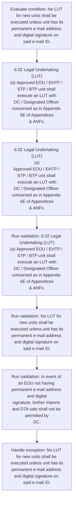
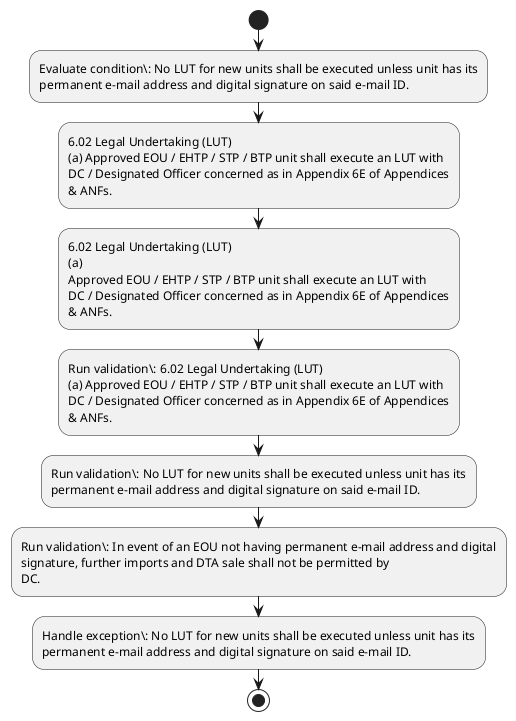

# Chapter 6 / Section 6.02: Legal Undertaking (LUT)

**Chapter Title:** Export Oriented Units (EOUs), Electronics Hardware Technology Parks (EHTPs), Software Technology Parks (STPs) and Bio-Technology

**Pages:** 4

**Purpose:** 6.02 Legal Undertaking (LUT)
(a) Approved EOU / EHTP / STP / BTP unit shall execute an LUT with
DC / Designated Officer concerned as in Appendix 6E of Appendices
& ANFs.

**Purpose Thanglish:** Indha Legal Undertaking (LUT) section-la, 6.02 Legal Undertaking (LUT)
(a) Approved EOU / EHTP / STP / BTP unit kandippa execute an LUT with
DC / Designated Officer concerned as in Appendix 6E of Appendices
& ANFs.

**Summary:** 6.02 Legal Undertaking (LUT)
(a) Approved EOU / EHTP / STP / BTP unit shall execute an LUT with
DC / Designated Officer concerned as in Appendix 6E of Appendices
& ANFs. (b) All EOU / EHTP / STP / BTP units should have permanent e-mail
address. No LUT for new units shall be executed unless unit has its
permanent e-mail address and digital signature on said e-mail ID.

**Business Meaning:** Legal Undertaking (LUT) governs how DGFT business controls should be applied, validated, and enforced.

**Business Explanation:** Legal Undertaking (LUT) explains the operating rule set that DEKAI should enforce. Key control points include 6.02 Legal Undertaking (LUT)
(a) Approved EOU / EHTP / STP / BTP unit shall execute an LUT with
DC / Designated Officer concerned as in Appendix 6E of Appendices
& ANFs. The section also drives actions such as 6.02 Legal Undertaking (LUT)
(a) Approved EOU / EHTP / STP / BTP unit shall execute an LUT with
DC / Designated Officer concerned as in Appendix 6E of Appendices
& ANFs..

**Business Explanation Thanglish:** Indha Legal Undertaking (LUT) section-la, Legal Undertaking (LUT) explains the operating rule set that DEKAI should enforce. Key control points include 6.02 Legal Undertaking (LUT)
(a) Approved EOU / EHTP / STP / BTP unit kandippa execute an LUT with
DC / Designated Officer concerned as in Appendix 6E of Appendices
& ANFs. The section also drives actions such as 6.02 Legal Undertaking (LUT)
(a) Approved EOU / EHTP / STP / BTP unit kandippa execute an LUT with
DC / Designated Officer concerned as in Appendix 6E of Appendices
& ANFs..

## Business Logic
- 6.02 Legal Undertaking (LUT)
(a) Approved EOU / EHTP / STP / BTP unit shall execute an LUT with
DC / Designated Officer concerned as in Appendix 6E of Appendices
& ANFs.
- (b) All EOU / EHTP / STP / BTP units should have permanent e-mail
address.
- No LUT for new units shall be executed unless unit has its
permanent e-mail address and digital signature on said e-mail ID.
- In event of an EOU not having permanent e-mail address and digital
signature, further imports and DTA sale shall not be permitted by
DC.
- 6.02 Legal Undertaking (LUT)
(a)
Approved EOU / EHTP / STP / BTP unit shall execute an LUT with
DC / Designated Officer concerned as in Appendix 6E of Appendices
& ANFs.
- (b)
All EOU / EHTP / STP / BTP units should have permanent e-mail
address.

## Business Rules
- rule_id=CH6-SEC6_02-R001, rule_description=6.02 Legal Undertaking (LUT)
(a) Approved EOU / EHTP / STP / BTP unit shall execute an LUT with
DC / Designated Officer concerned as in Appendix 6E of Appendices
& ANFs., trigger=Legal Undertaking (LUT), condition=No LUT for new units shall be executed unless unit has its
permanent e-mail address and digital signature on said e-mail ID., validation=6.02 Legal Undertaking (LUT)
(a) Approved EOU / EHTP / STP / BTP unit shall execute an LUT with
DC / Designated Officer concerned as in Appendix 6E of Appendices
& ANFs., action=6.02 Legal Undertaking (LUT)
(a) Approved EOU / EHTP / STP / BTP unit shall execute an LUT with
DC / Designated Officer concerned as in Appendix 6E of Appendices
& ANFs., exception=No LUT for new units shall be executed unless unit has its
permanent e-mail address and digital signature on said e-mail ID., output=DEKAI should produce a compliance decision for 6.02 - Legal Undertaking (LUT).
- rule_id=CH6-SEC6_02-R002, rule_description=(b) All EOU / EHTP / STP / BTP units should have permanent e-mail
address., trigger=Legal Undertaking (LUT), condition=No LUT for new units shall be executed unless unit has its
permanent e-mail address and digital signature on said e-mail ID., validation=No LUT for new units shall be executed unless unit has its
permanent e-mail address and digital signature on said e-mail ID., action=6.02 Legal Undertaking (LUT)
(a)
Approved EOU / EHTP / STP / BTP unit shall execute an LUT with
DC / Designated Officer concerned as in Appendix 6E of Appendices
& ANFs., exception=No LUT for new units shall be executed unless unit has its
permanent e-mail address and digital signature on said e-mail ID., output=DEKAI should produce a compliance decision for 6.02 - Legal Undertaking (LUT).
- rule_id=CH6-SEC6_02-R003, rule_description=No LUT for new units shall be executed unless unit has its
permanent e-mail address and digital signature on said e-mail ID., trigger=Legal Undertaking (LUT), condition=No LUT for new units shall be executed unless unit has its
permanent e-mail address and digital signature on said e-mail ID., validation=In event of an EOU not having permanent e-mail address and digital
signature, further imports and DTA sale shall not be permitted by
DC., action=6.02 Legal Undertaking (LUT)
(a)
Approved EOU / EHTP / STP / BTP unit shall execute an LUT with
DC / Designated Officer concerned as in Appendix 6E of Appendices
& ANFs., exception=No LUT for new units shall be executed unless unit has its
permanent e-mail address and digital signature on said e-mail ID., output=DEKAI should produce a compliance decision for 6.02 - Legal Undertaking (LUT).
- rule_id=CH6-SEC6_02-R004, rule_description=In event of an EOU not having permanent e-mail address and digital
signature, further imports and DTA sale shall not be permitted by
DC., trigger=Legal Undertaking (LUT), condition=No LUT for new units shall be executed unless unit has its
permanent e-mail address and digital signature on said e-mail ID., validation=6.02 Legal Undertaking (LUT)
(a)
Approved EOU / EHTP / STP / BTP unit shall execute an LUT with
DC / Designated Officer concerned as in Appendix 6E of Appendices
& ANFs., action=6.02 Legal Undertaking (LUT)
(a)
Approved EOU / EHTP / STP / BTP unit shall execute an LUT with
DC / Designated Officer concerned as in Appendix 6E of Appendices
& ANFs., exception=No LUT for new units shall be executed unless unit has its
permanent e-mail address and digital signature on said e-mail ID., output=DEKAI should produce a compliance decision for 6.02 - Legal Undertaking (LUT).
- rule_id=CH6-SEC6_02-R005, rule_description=6.02 Legal Undertaking (LUT)
(a)
Approved EOU / EHTP / STP / BTP unit shall execute an LUT with
DC / Designated Officer concerned as in Appendix 6E of Appendices
& ANFs., trigger=Legal Undertaking (LUT), condition=No LUT for new units shall be executed unless unit has its
permanent e-mail address and digital signature on said e-mail ID., validation=6.02 Legal Undertaking (LUT)
(a)
Approved EOU / EHTP / STP / BTP unit shall execute an LUT with
DC / Designated Officer concerned as in Appendix 6E of Appendices
& ANFs., action=6.02 Legal Undertaking (LUT)
(a)
Approved EOU / EHTP / STP / BTP unit shall execute an LUT with
DC / Designated Officer concerned as in Appendix 6E of Appendices
& ANFs., exception=No LUT for new units shall be executed unless unit has its
permanent e-mail address and digital signature on said e-mail ID., output=DEKAI should produce a compliance decision for 6.02 - Legal Undertaking (LUT).
- rule_id=CH6-SEC6_02-R006, rule_description=(b)
All EOU / EHTP / STP / BTP units should have permanent e-mail
address., trigger=Legal Undertaking (LUT), condition=No LUT for new units shall be executed unless unit has its
permanent e-mail address and digital signature on said e-mail ID., validation=6.02 Legal Undertaking (LUT)
(a)
Approved EOU / EHTP / STP / BTP unit shall execute an LUT with
DC / Designated Officer concerned as in Appendix 6E of Appendices
& ANFs., action=6.02 Legal Undertaking (LUT)
(a)
Approved EOU / EHTP / STP / BTP unit shall execute an LUT with
DC / Designated Officer concerned as in Appendix 6E of Appendices
& ANFs., exception=No LUT for new units shall be executed unless unit has its
permanent e-mail address and digital signature on said e-mail ID., output=DEKAI should produce a compliance decision for 6.02 - Legal Undertaking (LUT).

## Conditions
- No LUT for new units shall be executed unless unit has its
permanent e-mail address and digital signature on said e-mail ID.

## Condition Logic
- id=6.6.02.1, if=No LUT for new units shall be executed unless unit has its
permanent e-mail address and digital signature on said e-mail ID., then=6.02 Legal Undertaking (LUT)
(a) Approved EOU / EHTP / STP / BTP unit shall execute an LUT with
DC / Designated Officer concerned as in Appendix 6E of Appendices
& ANFs., source=No LUT for new units shall be executed unless unit has its
permanent e-mail address and digital signature on said e-mail ID.

## Validations
- 6.02 Legal Undertaking (LUT)
(a) Approved EOU / EHTP / STP / BTP unit shall execute an LUT with
DC / Designated Officer concerned as in Appendix 6E of Appendices
& ANFs.
- No LUT for new units shall be executed unless unit has its
permanent e-mail address and digital signature on said e-mail ID.
- In event of an EOU not having permanent e-mail address and digital
signature, further imports and DTA sale shall not be permitted by
DC.
- 6.02 Legal Undertaking (LUT)
(a)
Approved EOU / EHTP / STP / BTP unit shall execute an LUT with
DC / Designated Officer concerned as in Appendix 6E of Appendices
& ANFs.

## Exceptions
- No LUT for new units shall be executed unless unit has its
permanent e-mail address and digital signature on said e-mail ID.

## Dependencies
- None identified

## Authorities
- None identified

## Required Documents
- 6.02 Legal Undertaking (LUT)
(a) Approved EOU / EHTP / STP / BTP unit shall execute an LUT with
DC / Designated Officer concerned as in Appendix 6E of Appendices
& ANFs.
- 6.02 Legal Undertaking (LUT)
(a)
Approved EOU / EHTP / STP / BTP unit shall execute an LUT with
DC / Designated Officer concerned as in Appendix 6E of Appendices
& ANFs.

## Timelines
- None identified

## Actions
- 6.02 Legal Undertaking (LUT)
(a) Approved EOU / EHTP / STP / BTP unit shall execute an LUT with
DC / Designated Officer concerned as in Appendix 6E of Appendices
& ANFs.
- 6.02 Legal Undertaking (LUT)
(a)
Approved EOU / EHTP / STP / BTP unit shall execute an LUT with
DC / Designated Officer concerned as in Appendix 6E of Appendices
& ANFs.

## Workflow
- Evaluate condition: No LUT for new units shall be executed unless unit has its
permanent e-mail address and digital signature on said e-mail ID.
- 6.02 Legal Undertaking (LUT)
(a) Approved EOU / EHTP / STP / BTP unit shall execute an LUT with
DC / Designated Officer concerned as in Appendix 6E of Appendices
& ANFs.
- 6.02 Legal Undertaking (LUT)
(a)
Approved EOU / EHTP / STP / BTP unit shall execute an LUT with
DC / Designated Officer concerned as in Appendix 6E of Appendices
& ANFs.
- Run validation: 6.02 Legal Undertaking (LUT)
(a) Approved EOU / EHTP / STP / BTP unit shall execute an LUT with
DC / Designated Officer concerned as in Appendix 6E of Appendices
& ANFs.
- Run validation: No LUT for new units shall be executed unless unit has its
permanent e-mail address and digital signature on said e-mail ID.
- Run validation: In event of an EOU not having permanent e-mail address and digital
signature, further imports and DTA sale shall not be permitted by
DC.
- Handle exception: No LUT for new units shall be executed unless unit has its
permanent e-mail address and digital signature on said e-mail ID.

## Workflow ASCII
```text
Legal Undertaking (LUT)
Evaluate condition: No LUT for new units shall be executed unless unit has its
permanent e-mail address and digital signature on said e-mail ID.
   |
   v
6.02 Legal Undertaking (LUT)
(a) Approved EOU / EHTP / STP / BTP unit shall execute an LUT with
DC / Designated Officer concerned as in Appendix 6E of Appendices
& ANFs.
   |
   v
6.02 Legal Undertaking (LUT)
(a)
Approved EOU / EHTP / STP / BTP unit shall execute an LUT with
DC / Designated Officer concerned as in Appendix 6E of Appendices
& ANFs.
   |
   v
Run validation: 6.02 Legal Undertaking (LUT)
(a) Approved EOU / EHTP / STP / BTP unit shall execute an LUT with
DC / Designated Officer concerned as in Appendix 6E of Appendices
& ANFs.
   |
   v
Run validation: No LUT for new units shall be executed unless unit has its
permanent e-mail address and digital signature on said e-mail ID.
   |
   v
Run validation: In event of an EOU not having permanent e-mail address and digital
signature, further imports and DTA sale shall not be permitted by
DC.
   |
   v
Handle exception: No LUT for new units shall be executed unless unit has its
permanent e-mail address and digital signature on said e-mail ID.
```

## Decision Tree
- IF No LUT for new units shall be executed unless unit has its
permanent e-mail address and digital signature on said e-mail ID. THEN 6.02 Legal Undertaking (LUT)
(a) Approved EOU / EHTP / STP / BTP unit shall execute an LUT with
DC / Designated Officer concerned as in Appendix 6E of Appendices
& ANFs.
- IF exception applies (No LUT for new units shall be executed unless unit has its
permanent e-mail address and digital signature on said e-mail ID.) THEN route to manual review

## Decision Tree ASCII
```text
Legal Undertaking (LUT) Decision
IF No LUT for new units shall be executed unless unit has its
permanent e-mail address and digital signature on said e-mail ID. THEN 6.02 Legal Undertaking (LUT)
(a) Approved EOU / EHTP / STP / BTP unit shall execute an LUT with
DC / Designated Officer concerned as in Appendix 6E of Appendices
& ANFs.
   |
   v
IF exception applies (No LUT for new units shall be executed unless unit has its
permanent e-mail address and digital signature on said e-mail ID.) THEN route to manual review
```

## Examples
- User asks to process Legal Undertaking (LUT); the platform checks conditions, validations, and documents before action.

**Real-world Example:** Example: an importer or exporter invokes Legal Undertaking (LUT), submits 6.02 Legal Undertaking (LUT)
(a) Approved EOU / EHTP / STP / BTP unit shall execute an LUT with
DC / Designated Officer concerned as in Appendix 6E of Appendices
& ANFs., 6.02 Legal Undertaking (LUT)
(a)
Approved EOU / EHTP / STP / BTP unit shall execute an LUT with
DC / Designated Officer concerned as in Appendix 6E of Appendices
& ANFs., and DEKAI uses the extracted rules to 6.02 legal undertaking (lut)
(a) approved eou / ehtp / stp / btp unit shall execute an lut with
dc / designated officer concerned as in appendix 6e of appendices
& anfs..

**Real-world Example Thanglish:** Indha Legal Undertaking (LUT) section-la, Example: an importer or exporter invokes Legal Undertaking (LUT), submits 6.02 Legal Undertaking (LUT)
(a) Approved EOU / EHTP / STP / BTP unit kandippa execute an LUT with
DC / Designated Officer concerned as in Appendix 6E of Appendices
& ANFs., 6.02 Legal Undertaking (LUT)
(a)
Approved EOU / EHTP / STP / BTP unit kandippa execute an LUT with
DC / Designated Officer concerned as in Appendix 6E of Appendices
& ANFs., and DEKAI uses the extracted rules to 6.02 legal undertaking (lut)
(a) approved eou / ehtp / stp / btp unit kandippa execute an lut with
dc / designated officer concerned as in appendix 6e of appendices
& anfs..

## AI Rules
- IF detected context matches section rule THEN enforce: 6.02 Legal Undertaking (LUT)
(a) Approved EOU / EHTP / STP / BTP unit shall execute an LUT with
DC / Designated Officer concerned as in Appendix 6E of Appendices
& ANFs.
- IF detected context matches section rule THEN enforce: (b) All EOU / EHTP / STP / BTP units should have permanent e-mail
address.
- IF detected context matches section rule THEN enforce: No LUT for new units shall be executed unless unit has its
permanent e-mail address and digital signature on said e-mail ID.
- IF detected context matches section rule THEN enforce: In event of an EOU not having permanent e-mail address and digital
signature, further imports and DTA sale shall not be permitted by
DC.
- IF detected context matches section rule THEN enforce: 6.02 Legal Undertaking (LUT)
(a)
Approved EOU / EHTP / STP / BTP unit shall execute an LUT with
DC / Designated Officer concerned as in Appendix 6E of Appendices
& ANFs.
- IF detected context matches section rule THEN enforce: (b)
All EOU / EHTP / STP / BTP units should have permanent e-mail
address.
- IF validations pass THEN recommend action: 6.02 Legal Undertaking (LUT)
(a) Approved EOU / EHTP / STP / BTP unit shall execute an LUT with
DC / Designated Officer concerned as in Appendix 6E of Appendices
& ANFs.

## Database Fields
- name=section_code, type=string, required=True, source=parsed_section_heading
- name=section_title, type=string, required=True, source=parsed_section_heading
- name=lut_flag, type=boolean, required=False, source=keyword:LUT
- name=eou_flag, type=boolean, required=False, source=keyword:EOU
- name=stp_flag, type=boolean, required=False, source=keyword:STP
- name=btp_flag, type=boolean, required=False, source=keyword:BTP
- name=all_flag, type=boolean, required=False, source=keyword:All
- name=for_flag, type=boolean, required=False, source=keyword:for
- name=new_flag, type=boolean, required=False, source=keyword:new
- name=has_flag, type=boolean, required=False, source=keyword:has
- name=document_1_submitted, type=boolean, required=True, source=6.02 Legal Undertaking (LUT)
(a) Approved EOU / EHTP / STP / BTP unit shall execute an LUT with
DC / Designated Officer concerned as in Appendix 6E of Appendices
& ANFs.
- name=document_2_submitted, type=boolean, required=True, source=6.02 Legal Undertaking (LUT)
(a)
Approved EOU / EHTP / STP / BTP unit shall execute an LUT with
DC / Designated Officer concerned as in Appendix 6E of Appendices
& ANFs.

## API Requirements
- method=GET, path=/api/dgft/sections/6.02, purpose=Retrieve knowledge payload for section 6.02, query_params=['include=workflow,decision_tree,validations'], response_fields=['section', 'title', 'summary', 'conditions', 'validations', 'exceptions', 'workflow', 'decision_tree']
- method=POST, path=/api/dgft/Legal-Undertaking-LUT/validate, purpose=Validate inputs and documents for Legal Undertaking (LUT), request_fields=['section_code', 'section_title', 'document_1_submitted', 'document_2_submitted'], response_fields=['status', 'errors', 'warnings', 'next_actions']
- method=POST, path=/api/dgft/Legal-Undertaking-LUT/execute, purpose=Trigger business action for 6.02 Legal Undertaking (LUT)
(a) Approved EOU / EHTP / STP / BTP unit shall execute an LUT with
DC / Designated Officer concerned as in Appendix 6E of Appendices
& ANFs., request_fields=['section_code', 'section_title', 'document_1_submitted', 'document_2_submitted'], response_fields=['reference_id', 'status', 'authority', 'timeline']

## UI Screens
- screen_id=Legal_Undertaking_LUT_overview, name=Legal Undertaking (LUT) Overview, purpose=Show section summary, authority, timeline, and eligibility cues., widgets=['summary_card', 'conditions_table', 'authority_badges', 'timeline_panel']
- screen_id=Legal_Undertaking_LUT_submission, name=Legal Undertaking (LUT) Submission, purpose=Capture applicant data and supporting documents., widgets=['dynamic_form', 'document_uploader', 'validation_panel', 'next_action_footer'], fields=['section_code', 'section_title', 'lut_flag', 'eou_flag', 'stp_flag', 'btp_flag', 'all_flag', 'for_flag']
- screen_id=Legal_Undertaking_LUT_exceptions, name=Legal Undertaking (LUT) Exception Review, purpose=Explain exception handling and manual review triggers., widgets=['exception_banner', 'decision_tree', 'case_notes']

## Error Messages
- Validation failed because the section requirements were not fully met.

## FAQ
- question_en=What is the purpose of section 6.02?, answer_en=Legal Undertaking (LUT) explains the operating rule set that DEKAI should enforce. Key control points include 6.02 Legal Undertaking (LUT)
(a) Approved EOU / EHTP / STP / BTP unit shall execute an LUT with
DC / Designated Officer concerned as in Appendix 6E of Appendices
& ANFs. The section also drives actions such as 6.02 Legal Undertaking (LUT)
(a) Approved EOU / EHTP / STP / BTP unit shall execute an LUT with
DC / Designated Officer concerned as in Appendix 6E of Appendices
& ANFs.., question_thanglish=Indha Legal Undertaking (LUT) section-la, What is the purpose of section 6.02?, answer_thanglish=Indha Legal Undertaking (LUT) section-la, Legal Undertaking (LUT) explains the operating rule set that DEKAI should enforce. Key control points include 6.02 Legal Undertaking (LUT)
(a) Approved EOU / EHTP / STP / BTP unit kandippa execute an LUT with
DC / Designated Officer concerned as in Appendix 6E of Appendices
& ANFs. The section also drives actions such as 6.02 Legal Undertaking (LUT)
(a) Approved EOU / EHTP / STP / BTP unit kandippa execute an LUT with
DC / Designated Officer concerned as in Appendix 6E of Appendices
& ANFs..
- question_en=What documents are required under Legal Undertaking (LUT)?, answer_en=6.02 Legal Undertaking (LUT)
(a) Approved EOU / EHTP / STP / BTP unit shall execute an LUT with
DC / Designated Officer concerned as in Appendix 6E of Appendices
& ANFs., 6.02 Legal Undertaking (LUT)
(a)
Approved EOU / EHTP / STP / BTP unit shall execute an LUT with
DC / Designated Officer concerned as in Appendix 6E of Appendices
& ANFs., question_thanglish=Indha Legal Undertaking (LUT) section-la, What documents are required under Legal Undertaking (LUT)?, answer_thanglish=Indha Legal Undertaking (LUT) section-la, 6.02 Legal Undertaking (LUT)
(a) Approved EOU / EHTP / STP / BTP unit kandippa execute an LUT with
DC / Designated Officer concerned as in Appendix 6E of Appendices
& ANFs., 6.02 Legal Undertaking (LUT)
(a)
Approved EOU / EHTP / STP / BTP unit kandippa execute an LUT with
DC / Designated Officer concerned as in Appendix 6E of Appendices
& ANFs.
- question_en=Which authority handles Legal Undertaking (LUT)?, answer_en=Not explicitly covered in uploaded documents., question_thanglish=Indha Legal Undertaking (LUT) section-la, Which authority handles Legal Undertaking (LUT)?, answer_thanglish=Indha Legal Undertaking (LUT) section-la, Not explicitly covered in uploaded documents.

## Questions Users May Ask
- What does Legal Undertaking (LUT) require?
- Which documents are needed for Legal Undertaking (LUT)?
- How does DEKAI validate Legal Undertaking (LUT) requests?
- What action should be taken for Legal Undertaking (LUT)?

## Expected AI Answers
- Legal Undertaking (LUT) requires the platform to interpret the section text, apply the extracted business rules, and present the correct next action.
- Required documents are inferred from the section text: 6.02 Legal Undertaking (LUT)
(a) Approved EOU / EHTP / STP / BTP unit shall execute an LUT with
DC / Designated Officer concerned as in Appendix 6E of Appendices
& ANFs., 6.02 Legal Undertaking (LUT)
(a)
Approved EOU / EHTP / STP / BTP unit shall execute an LUT with
DC / Designated Officer concerned as in Appendix 6E of Appendices
& ANFs.
- DEKAI validates Legal Undertaking (LUT) by checking conditions, required documents, authority references, and exception clauses before recommending an outcome.
- The primary extracted action is: 6.02 Legal Undertaking (LUT)
(a) Approved EOU / EHTP / STP / BTP unit shall execute an LUT with
DC / Designated Officer concerned as in Appendix 6E of Appendices
& ANFs.

## AI Q&A Examples
- question_en=User asks: How do I comply with Legal Undertaking (LUT)?, answer_en=AI answers: DEKAI should evaluate section 6.02, apply the extracted rules, and guide the user through Evaluate condition: No LUT for new units shall be executed unless unit has its
permanent e-mail address and digital signature on said e-mail ID.., question_thanglish=Indha Legal Undertaking (LUT) section-la, User asks: How do I comply with Legal Undertaking (LUT)?, answer_thanglish=Indha Legal Undertaking (LUT) section-la, AI answers: DEKAI should evaluate section 6.02, apply the extracted rules, and guide the user through Evaluate condition: No LUT for new units kandippa be executed unless unit has its
permanent e-mail address and digital signature on said e-mail ID..
- question_en=User asks: Which validations apply to Legal Undertaking (LUT)?, answer_en=AI answers: Applicable validations are 6.02 Legal Undertaking (LUT)
(a) Approved EOU / EHTP / STP / BTP unit shall execute an LUT with
DC / Designated Officer concerned as in Appendix 6E of Appendices
& ANFs., No LUT for new units shall be executed unless unit has its
permanent e-mail address and digital signature on said e-mail ID., In event of an EOU not having permanent e-mail address and digital
signature, further imports and DTA sale shall not be permitted by
DC., question_thanglish=Indha Legal Undertaking (LUT) section-la, User asks: Which validations apply to Legal Undertaking (LUT)?, answer_thanglish=Indha Legal Undertaking (LUT) section-la, AI answers: Applicable validations are 6.02 Legal Undertaking (LUT)
(a) Approved EOU / EHTP / STP / BTP unit kandippa execute an LUT with
DC / Designated Officer concerned as in Appendix 6E of Appendices
& ANFs., No LUT for new units kandippa be executed unless unit has its
permanent e-mail address and digital signature on said e-mail ID., In event of an EOU not having permanent e-mail address and digital
signature, further imports and DTA sale kandippa not be permitted by
DC.

## DEKAI AI Implementation Notes
- Capture chapter 6, section 6.02, title, and page references as immutable knowledge metadata.
- Bind validations for Legal Undertaking (LUT) into a rule engine keyed by the rule IDs extracted for this section.
- Expose document upload controls for: 6.02 Legal Undertaking (LUT)
(a) Approved EOU / EHTP / STP / BTP unit shall execute an LUT with
DC / Designated Officer concerned as in Appendix 6E of Appendices
& ANFs., 6.02 Legal Undertaking (LUT)
(a)
Approved EOU / EHTP / STP / BTP unit shall execute an LUT with
DC / Designated Officer concerned as in Appendix 6E of Appendices
& ANFs..
- Trigger manual review when exception clauses are detected.

## DEKAI AI Implementation Notes Thanglish
- Indha Legal Undertaking (LUT) section-la, Capture chapter 6, section 6.02, title, and page references as immutable knowledge metadata.
- Indha Legal Undertaking (LUT) section-la, Bind validations for Legal Undertaking (LUT) into a rule engine keyed by the rule IDs extracted for this section.
- Indha Legal Undertaking (LUT) section-la, Expose document upload controls for: 6.02 Legal Undertaking (LUT)
(a) Approved EOU / EHTP / STP / BTP unit kandippa execute an LUT with
DC / Designated Officer concerned as in Appendix 6E of Appendices
& ANFs., 6.02 Legal Undertaking (LUT)
(a)
Approved EOU / EHTP / STP / BTP unit kandippa execute an LUT with
DC / Designated Officer concerned as in Appendix 6E of Appendices
& ANFs..
- Indha Legal Undertaking (LUT) section-la, Trigger manual review when exception clauses are detected.

## AI Metadata
- Keywords: LUT, EOU, STP, BTP, All, for, new, has, its, and, not, DTA, EHTP, unit, with, ANFs, have, said, sale, Legal
- Search Keywords: LUT, EOU, STP, BTP, All, for, new, has, its, and, not, DTA, EHTP, unit, with, ANFs, have, said, sale, Legal
- Intent: Support Legal Undertaking (LUT) processing and compliance validation.
- Tags: 6.02, Legal Undertaking (LUT), business-rule, document-driven, dgft
- Related Sections: 
- Related Chapters: 
- Related Rules: 6.02 Legal Undertaking (LUT)
(a) Approved EOU / EHTP / STP / BTP unit shall execute an LUT with
DC / Designated Officer concerned as in Appendix 6E of Appendices
& ANFs., (b) All EOU / EHTP / STP / BTP units should have permanent e-mail
address., No LUT for new units shall be executed unless unit has its
permanent e-mail address and digital signature on said e-mail ID., In event of an EOU not having permanent e-mail address and digital
signature, further imports and DTA sale shall not be permitted by
DC., 6.02 Legal Undertaking (LUT)
(a)
Approved EOU / EHTP / STP / BTP unit shall execute an LUT with
DC / Designated Officer concerned as in Appendix 6E of Appendices
& ANFs.

## Mermaid


## PlantUML

