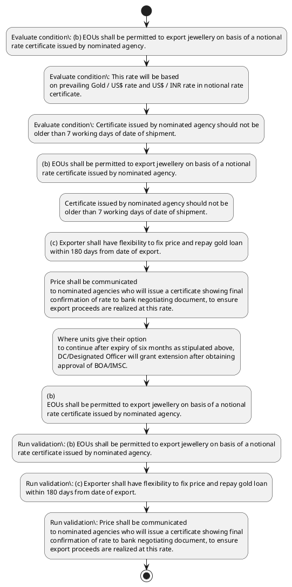

# Chapter 6 / Section 6.03: Export of Goods and Services

**Chapter Title:** Export Oriented Units (EOUs), Electronics Hardware Technology Parks (EHTPs), Software Technology Parks (STPs) and Bio-Technology

**Pages:** 4, 5

**Purpose:** (b) EOUs shall be permitted to export jewellery on basis of a notional
rate certificate issued by nominated agency.

**Purpose Thanglish:** Indha Export of Goods and Services section-la, (b) EOUs kandippa be permitted to export jewellery on basis of a notional
rate certificate issued by nominated agency.

**Summary:** 6.03 Export of Goods and Services
(a) Software units may undertake exports using data communication
links or in form of physical exports (which may be through courier
service also), including export of professional services. (b) EOUs shall be permitted to export jewellery on basis of a notional
rate certificate issued by nominated agency. This rate will be based
on prevailing Gold / US$ rate and US$ / INR rate in notional rate
certificate.

**Business Meaning:** Export of Goods and Services governs how DGFT business controls should be applied, validated, and enforced.

**Business Explanation:** Export of Goods and Services explains the operating rule set that DEKAI should enforce. Key control points include (b) EOUs shall be permitted to export jewellery on basis of a notional
rate certificate issued by nominated agency. The section also drives actions such as (b) EOUs shall be permitted to export jewellery on basis of a notional
rate certificate issued by nominated agency..

**Business Explanation Thanglish:** Indha Export of Goods and Services section-la, export of Goods and Services explains the operating rule set that DEKAI should enforce. Key control points include (b) EOUs kandippa be permitted to export jewellery on basis of a notional
rate certificate issued by nominated agency. The section also drives actions such as (b) EOUs kandippa be permitted to export jewellery on basis of a notional
rate certificate issued by nominated agency..

## Business Logic
- (b) EOUs shall be permitted to export jewellery on basis of a notional
rate certificate issued by nominated agency.
- Certificate issued by nominated agency should not be
older than 7 working days of date of shipment.
- (c) Exporter shall have flexibility to fix price and repay gold loan
within 180 days from date of export.
- Price shall be communicated
to nominated agencies who will issue a certificate showing final
confirmation of rate to bank negotiating document, to ensure
export proceeds are realized at this rate.
- (b)
EOUs shall be permitted to export jewellery on basis of a notional
rate certificate issued by nominated agency.
- (c)
Exporter shall have flexibility to fix price and repay gold loan
within 180 days from date of export.

## Business Rules
- rule_id=CH6-SEC6_03-R001, rule_description=(b) EOUs shall be permitted to export jewellery on basis of a notional
rate certificate issued by nominated agency., trigger=Export of Goods and Services, condition=(b) EOUs shall be permitted to export jewellery on basis of a notional
rate certificate issued by nominated agency., validation=(b) EOUs shall be permitted to export jewellery on basis of a notional
rate certificate issued by nominated agency., action=(b) EOUs shall be permitted to export jewellery on basis of a notional
rate certificate issued by nominated agency., exception=No explicit exception found in uploaded documents., output=DEKAI should produce a compliance decision for 6.03 - Export of Goods and Services.
- rule_id=CH6-SEC6_03-R002, rule_description=Certificate issued by nominated agency should not be
older than 7 working days of date of shipment., trigger=Export of Goods and Services, condition=This rate will be based
on prevailing Gold / US$ rate and US$ / INR rate in notional rate
certificate., validation=(c) Exporter shall have flexibility to fix price and repay gold loan
within 180 days from date of export., action=Certificate issued by nominated agency should not be
older than 7 working days of date of shipment., exception=No explicit exception found in uploaded documents., output=DEKAI should produce a compliance decision for 6.03 - Export of Goods and Services.
- rule_id=CH6-SEC6_03-R003, rule_description=(c) Exporter shall have flexibility to fix price and repay gold loan
within 180 days from date of export., trigger=Export of Goods and Services, condition=Certificate issued by nominated agency should not be
older than 7 working days of date of shipment., validation=Price shall be communicated
to nominated agencies who will issue a certificate showing final
confirmation of rate to bank negotiating document, to ensure
export proceeds are realized at this rate., action=(c) Exporter shall have flexibility to fix price and repay gold loan
within 180 days from date of export., exception=No explicit exception found in uploaded documents., output=DEKAI should produce a compliance decision for 6.03 - Export of Goods and Services.
- rule_id=CH6-SEC6_03-R004, rule_description=Price shall be communicated
to nominated agencies who will issue a certificate showing final
confirmation of rate to bank negotiating document, to ensure
export proceeds are realized at this rate., trigger=Export of Goods and Services, condition=Price shall be communicated
to nominated agencies who will issue a certificate showing final
confirmation of rate to bank negotiating document, to ensure
export proceeds are realized at this rate., validation=(b)
EOUs shall be permitted to export jewellery on basis of a notional
rate certificate issued by nominated agency., action=Price shall be communicated
to nominated agencies who will issue a certificate showing final
confirmation of rate to bank negotiating document, to ensure
export proceeds are realized at this rate., exception=No explicit exception found in uploaded documents., output=DEKAI should produce a compliance decision for 6.03 - Export of Goods and Services.
- rule_id=CH6-SEC6_03-R005, rule_description=(b)
EOUs shall be permitted to export jewellery on basis of a notional
rate certificate issued by nominated agency., trigger=Export of Goods and Services, condition=Where unit opts to continue,
DC/Designated Officer will extend validity of the LOP/LOI., validation=(c)
Exporter shall have flexibility to fix price and repay gold loan
within 180 days from date of export., action=Where units give their option
to continue after expiry of six months as stipulated above,
DC/Designated Officer will grant extension after obtaining
approval of BOA/IMSC., exception=No explicit exception found in uploaded documents., output=DEKAI should produce a compliance decision for 6.03 - Export of Goods and Services.
- rule_id=CH6-SEC6_03-R006, rule_description=(c)
Exporter shall have flexibility to fix price and repay gold loan
within 180 days from date of export., trigger=Export of Goods and Services, condition=If no
intimation in this regard is received from unit within a period of
six months of expiry of the validity, DC/Designated Officer will,
suomoto, take action to cancel approval under the scheme and
take further action in this regard., validation=(c)
Exporter shall have flexibility to fix price and repay gold loan
within 180 days from date of export., action=(b)
EOUs shall be permitted to export jewellery on basis of a notional
rate certificate issued by nominated agency., exception=No explicit exception found in uploaded documents., output=DEKAI should produce a compliance decision for 6.03 - Export of Goods and Services.

## Conditions
- (b) EOUs shall be permitted to export jewellery on basis of a notional
rate certificate issued by nominated agency.
- This rate will be based
on prevailing Gold / US$ rate and US$ / INR rate in notional rate
certificate.
- Certificate issued by nominated agency should not be
older than 7 working days of date of shipment.
- Price shall be communicated
to nominated agencies who will issue a certificate showing final
confirmation of rate to bank negotiating document, to ensure
export proceeds are realized at this rate.
- Where unit opts to continue,
DC/Designated Officer will extend validity of the LOP/LOI.
- If no
intimation in this regard is received from unit within a period of
six months of expiry of the validity, DC/Designated Officer will,
suomoto, take action to cancel approval under the scheme and
take further action in this regard.
- Where units give their option
to continue after expiry of six months as stipulated above,
DC/Designated Officer will grant extension after obtaining
approval of BOA/IMSC.
- (b)
EOUs shall be permitted to export jewellery on basis of a notional
rate certificate issued by nominated agency.

## Condition Logic
- id=6.6.03.1, if=(b) EOUs shall be permitted to export jewellery on basis of a notional
rate certificate issued by nominated agency., then=(b) EOUs shall be permitted to export jewellery on basis of a notional
rate certificate issued by nominated agency., source=(b) EOUs shall be permitted to export jewellery on basis of a notional
rate certificate issued by nominated agency.
- id=6.6.03.2, if=This rate will be based
on prevailing Gold / US$ rate and US$ / INR rate in notional rate
certificate., then=(b) EOUs shall be permitted to export jewellery on basis of a notional
rate certificate issued by nominated agency., source=This rate will be based
on prevailing Gold / US$ rate and US$ / INR rate in notional rate
certificate.
- id=6.6.03.3, if=Certificate issued by nominated agency should not be
older than 7 working days of date of shipment., then=(b) EOUs shall be permitted to export jewellery on basis of a notional
rate certificate issued by nominated agency., source=Certificate issued by nominated agency should not be
older than 7 working days of date of shipment.
- id=6.6.03.4, if=Price shall be communicated
to nominated agencies who will issue a certificate showing final
confirmation of rate to bank negotiating document, to ensure
export proceeds are realized at this rate., then=(b) EOUs shall be permitted to export jewellery on basis of a notional
rate certificate issued by nominated agency., source=Price shall be communicated
to nominated agencies who will issue a certificate showing final
confirmation of rate to bank negotiating document, to ensure
export proceeds are realized at this rate.
- id=6.6.03.5, if=Where unit opts to continue,
DC/Designated Officer will extend validity of the LOP/LOI., then=(b) EOUs shall be permitted to export jewellery on basis of a notional
rate certificate issued by nominated agency., source=Where unit opts to continue,
DC/Designated Officer will extend validity of the LOP/LOI.
- id=6.6.03.6, if=If no
intimation in this regard is received from unit within a period of
six months of expiry of the validity, DC/Designated Officer will,
suomoto, take action to cancel approval under the scheme and
take further action in this regard., then=(b) EOUs shall be permitted to export jewellery on basis of a notional
rate certificate issued by nominated agency., source=If no
intimation in this regard is received from unit within a period of
six months of expiry of the validity, DC/Designated Officer will,
suomoto, take action to cancel approval under the scheme and
take further action in this regard.
- id=6.6.03.7, if=Where units give their option
to continue after expiry of six months as stipulated above,
DC/Designated Officer will grant extension after obtaining
approval of BOA/IMSC., then=(b) EOUs shall be permitted to export jewellery on basis of a notional
rate certificate issued by nominated agency., source=Where units give their option
to continue after expiry of six months as stipulated above,
DC/Designated Officer will grant extension after obtaining
approval of BOA/IMSC.
- id=6.6.03.8, if=(b)
EOUs shall be permitted to export jewellery on basis of a notional
rate certificate issued by nominated agency., then=(b) EOUs shall be permitted to export jewellery on basis of a notional
rate certificate issued by nominated agency., source=(b)
EOUs shall be permitted to export jewellery on basis of a notional
rate certificate issued by nominated agency.

## Validations
- (b) EOUs shall be permitted to export jewellery on basis of a notional
rate certificate issued by nominated agency.
- (c) Exporter shall have flexibility to fix price and repay gold loan
within 180 days from date of export.
- Price shall be communicated
to nominated agencies who will issue a certificate showing final
confirmation of rate to bank negotiating document, to ensure
export proceeds are realized at this rate.
- (b)
EOUs shall be permitted to export jewellery on basis of a notional
rate certificate issued by nominated agency.
- (c)
Exporter shall have flexibility to fix price and repay gold loan
within 180 days from date of export.

## Exceptions
- None identified

## Dependencies
- None identified

## Authorities
- None identified

## Required Documents
- (b) EOUs shall be permitted to export jewellery on basis of a notional
rate certificate issued by nominated agency.
- This rate will be based
on prevailing Gold / US$ rate and US$ / INR rate in notional rate
certificate.
- Certificate issued by nominated agency should not be
older than 7 working days of date of shipment.
- Price shall be communicated
to nominated agencies who will issue a certificate showing final
confirmation of rate to bank negotiating document, to ensure
export proceeds are realized at this rate.
- (b)
EOUs shall be permitted to export jewellery on basis of a notional
rate certificate issued by nominated agency.

## Timelines
- Certificate issued by nominated agency should not be
older than 7 working days of date of shipment.
- (c) Exporter shall have flexibility to fix price and repay gold loan
within 180 days from date of export.
- If no
intimation in this regard is received from unit within a period of
six months of expiry of the validity, DC/Designated Officer will,
suomoto, take action to cancel approval under the scheme and
take further action in this regard.
- Where units give their option
to continue after expiry of six months as stipulated above,
DC/Designated Officer will grant extension after obtaining
approval of BOA/IMSC.
- (c)
Exporter shall have flexibility to fix price and repay gold loan
within 180 days from date of export.

## Actions
- (b) EOUs shall be permitted to export jewellery on basis of a notional
rate certificate issued by nominated agency.
- Certificate issued by nominated agency should not be
older than 7 working days of date of shipment.
- (c) Exporter shall have flexibility to fix price and repay gold loan
within 180 days from date of export.
- Price shall be communicated
to nominated agencies who will issue a certificate showing final
confirmation of rate to bank negotiating document, to ensure
export proceeds are realized at this rate.
- Where units give their option
to continue after expiry of six months as stipulated above,
DC/Designated Officer will grant extension after obtaining
approval of BOA/IMSC.
- (b)
EOUs shall be permitted to export jewellery on basis of a notional
rate certificate issued by nominated agency.
- (c)
Exporter shall have flexibility to fix price and repay gold loan
within 180 days from date of export.
- Besides, supply of unsuitable /
broken cut and polished diamonds, precious and semi-precious
stones upto 5% of value of imported or indigenously procured
goods to DTA against valid Gems & Jewellery REP as applicable on
payment of appropriate duty is also permitted.

## Workflow
- Evaluate condition: (b) EOUs shall be permitted to export jewellery on basis of a notional
rate certificate issued by nominated agency.
- Evaluate condition: This rate will be based
on prevailing Gold / US$ rate and US$ / INR rate in notional rate
certificate.
- Evaluate condition: Certificate issued by nominated agency should not be
older than 7 working days of date of shipment.
- (b) EOUs shall be permitted to export jewellery on basis of a notional
rate certificate issued by nominated agency.
- Certificate issued by nominated agency should not be
older than 7 working days of date of shipment.
- (c) Exporter shall have flexibility to fix price and repay gold loan
within 180 days from date of export.
- Price shall be communicated
to nominated agencies who will issue a certificate showing final
confirmation of rate to bank negotiating document, to ensure
export proceeds are realized at this rate.
- Where units give their option
to continue after expiry of six months as stipulated above,
DC/Designated Officer will grant extension after obtaining
approval of BOA/IMSC.
- (b)
EOUs shall be permitted to export jewellery on basis of a notional
rate certificate issued by nominated agency.
- Run validation: (b) EOUs shall be permitted to export jewellery on basis of a notional
rate certificate issued by nominated agency.
- Run validation: (c) Exporter shall have flexibility to fix price and repay gold loan
within 180 days from date of export.
- Run validation: Price shall be communicated
to nominated agencies who will issue a certificate showing final
confirmation of rate to bank negotiating document, to ensure
export proceeds are realized at this rate.

## Workflow ASCII
```text
Export of Goods and Services
Evaluate condition: (b) EOUs shall be permitted to export jewellery on basis of a notional
rate certificate issued by nominated agency.
   |
   v
Evaluate condition: This rate will be based
on prevailing Gold / US$ rate and US$ / INR rate in notional rate
certificate.
   |
   v
Evaluate condition: Certificate issued by nominated agency should not be
older than 7 working days of date of shipment.
   |
   v
(b) EOUs shall be permitted to export jewellery on basis of a notional
rate certificate issued by nominated agency.
   |
   v
Certificate issued by nominated agency should not be
older than 7 working days of date of shipment.
   |
   v
(c) Exporter shall have flexibility to fix price and repay gold loan
within 180 days from date of export.
   |
   v
Price shall be communicated
to nominated agencies who will issue a certificate showing final
confirmation of rate to bank negotiating document, to ensure
export proceeds are realized at this rate.
   |
   v
Where units give their option
to continue after expiry of six months as stipulated above,
DC/Designated Officer will grant extension after obtaining
approval of BOA/IMSC.
   |
   v
(b)
EOUs shall be permitted to export jewellery on basis of a notional
rate certificate issued by nominated agency.
   |
   v
Run validation: (b) EOUs shall be permitted to export jewellery on basis of a notional
rate certificate issued by nominated agency.
   |
   v
Run validation: (c) Exporter shall have flexibility to fix price and repay gold loan
within 180 days from date of export.
   |
   v
Run validation: Price shall be communicated
to nominated agencies who will issue a certificate showing final
confirmation of rate to bank negotiating document, to ensure
export proceeds are realized at this rate.
```

## Decision Tree
- IF (b) EOUs shall be permitted to export jewellery on basis of a notional
rate certificate issued by nominated agency. THEN (b) EOUs shall be permitted to export jewellery on basis of a notional
rate certificate issued by nominated agency.
- IF This rate will be based
on prevailing Gold / US$ rate and US$ / INR rate in notional rate
certificate. THEN (b) EOUs shall be permitted to export jewellery on basis of a notional
rate certificate issued by nominated agency.
- IF Certificate issued by nominated agency should not be
older than 7 working days of date of shipment. THEN (b) EOUs shall be permitted to export jewellery on basis of a notional
rate certificate issued by nominated agency.
- IF Price shall be communicated
to nominated agencies who will issue a certificate showing final
confirmation of rate to bank negotiating document, to ensure
export proceeds are realized at this rate. THEN (b) EOUs shall be permitted to export jewellery on basis of a notional
rate certificate issued by nominated agency.
- IF Where unit opts to continue,
DC/Designated Officer will extend validity of the LOP/LOI. THEN (b) EOUs shall be permitted to export jewellery on basis of a notional
rate certificate issued by nominated agency.

## Decision Tree ASCII
```text
Export of Goods and Services Decision
IF (b) EOUs shall be permitted to export jewellery on basis of a notional
rate certificate issued by nominated agency. THEN (b) EOUs shall be permitted to export jewellery on basis of a notional
rate certificate issued by nominated agency.
   |
   v
IF This rate will be based
on prevailing Gold / US$ rate and US$ / INR rate in notional rate
certificate. THEN (b) EOUs shall be permitted to export jewellery on basis of a notional
rate certificate issued by nominated agency.
   |
   v
IF Certificate issued by nominated agency should not be
older than 7 working days of date of shipment. THEN (b) EOUs shall be permitted to export jewellery on basis of a notional
rate certificate issued by nominated agency.
   |
   v
IF Price shall be communicated
to nominated agencies who will issue a certificate showing final
confirmation of rate to bank negotiating document, to ensure
export proceeds are realized at this rate. THEN (b) EOUs shall be permitted to export jewellery on basis of a notional
rate certificate issued by nominated agency.
   |
   v
IF Where unit opts to continue,
DC/Designated Officer will extend validity of the LOP/LOI. THEN (b) EOUs shall be permitted to export jewellery on basis of a notional
rate certificate issued by nominated agency.
```

## Examples
- User asks to process Export of Goods and Services; the platform checks conditions, validations, and documents before action.

**Real-world Example:** Example: an importer or exporter invokes Export of Goods and Services, submits (b) EOUs shall be permitted to export jewellery on basis of a notional
rate certificate issued by nominated agency., This rate will be based
on prevailing Gold / US$ rate and US$ / INR rate in notional rate
certificate., Certificate issued by nominated agency should not be
older than 7 working days of date of shipment., and DEKAI uses the extracted rules to (b) eous shall be permitted to export jewellery on basis of a notional
rate certificate issued by nominated agency..

**Real-world Example Thanglish:** Indha Export of Goods and Services section-la, Example: an importer or exporter invokes export of Goods and Services, submits (b) EOUs kandippa be permitted to export jewellery on basis of a notional
rate certificate issued by nominated agency., This rate will be based
on prevailing Gold / US$ rate and US$ / INR rate in notional rate
certificate., Certificate issued by nominated agency should not be
older than 7 working days of date of shipment., and DEKAI uses the extracted rules to (b) eous kandippa be permitted to export jewellery on basis of a notional
rate certificate issued by nominated agency..

## AI Rules
- IF detected context matches section rule THEN enforce: (b) EOUs shall be permitted to export jewellery on basis of a notional
rate certificate issued by nominated agency.
- IF detected context matches section rule THEN enforce: Certificate issued by nominated agency should not be
older than 7 working days of date of shipment.
- IF detected context matches section rule THEN enforce: (c) Exporter shall have flexibility to fix price and repay gold loan
within 180 days from date of export.
- IF detected context matches section rule THEN enforce: Price shall be communicated
to nominated agencies who will issue a certificate showing final
confirmation of rate to bank negotiating document, to ensure
export proceeds are realized at this rate.
- IF detected context matches section rule THEN enforce: (b)
EOUs shall be permitted to export jewellery on basis of a notional
rate certificate issued by nominated agency.
- IF detected context matches section rule THEN enforce: (c)
Exporter shall have flexibility to fix price and repay gold loan
within 180 days from date of export.
- IF validations pass THEN recommend action: (b) EOUs shall be permitted to export jewellery on basis of a notional
rate certificate issued by nominated agency.

## Database Fields
- name=section_code, type=string, required=True, source=parsed_section_heading
- name=section_title, type=string, required=True, source=parsed_section_heading
- name=and_flag, type=boolean, required=False, source=keyword:and
- name=may_flag, type=boolean, required=False, source=keyword:may
- name=inr_flag, type=boolean, required=False, source=keyword:INR
- name=not_flag, type=boolean, required=False, source=keyword:not
- name=fix_flag, type=boolean, required=False, source=keyword:fix
- name=who_flag, type=boolean, required=False, source=keyword:who
- name=are_flag, type=boolean, required=False, source=keyword:are
- name=out_flag, type=boolean, required=False, source=keyword:out
- name=document_1_submitted, type=boolean, required=True, source=(b) EOUs shall be permitted to export jewellery on basis of a notional
rate certificate issued by nominated agency.
- name=document_2_submitted, type=boolean, required=True, source=This rate will be based
on prevailing Gold / US$ rate and US$ / INR rate in notional rate
certificate.
- name=document_3_submitted, type=boolean, required=True, source=Certificate issued by nominated agency should not be
older than 7 working days of date of shipment.
- name=document_4_submitted, type=boolean, required=True, source=Price shall be communicated
to nominated agencies who will issue a certificate showing final
confirmation of rate to bank negotiating document, to ensure
export proceeds are realized at this rate.
- name=document_5_submitted, type=boolean, required=True, source=(b)
EOUs shall be permitted to export jewellery on basis of a notional
rate certificate issued by nominated agency.

## API Requirements
- method=GET, path=/api/dgft/sections/6.03, purpose=Retrieve knowledge payload for section 6.03, query_params=['include=workflow,decision_tree,validations'], response_fields=['section', 'title', 'summary', 'conditions', 'validations', 'exceptions', 'workflow', 'decision_tree']
- method=POST, path=/api/dgft/Export-of-Goods-and-Services/validate, purpose=Validate inputs and documents for Export of Goods and Services, request_fields=['section_code', 'section_title', 'document_1_submitted', 'document_2_submitted', 'document_3_submitted', 'document_4_submitted', 'document_5_submitted'], response_fields=['status', 'errors', 'warnings', 'next_actions']
- method=POST, path=/api/dgft/Export-of-Goods-and-Services/execute, purpose=Trigger business action for (b) EOUs shall be permitted to export jewellery on basis of a notional
rate certificate issued by nominated agency., request_fields=['section_code', 'section_title', 'document_1_submitted', 'document_2_submitted', 'document_3_submitted', 'document_4_submitted', 'document_5_submitted'], response_fields=['reference_id', 'status', 'authority', 'timeline']

## UI Screens
- screen_id=Export_of_Goods_and_Services_overview, name=Export of Goods and Services Overview, purpose=Show section summary, authority, timeline, and eligibility cues., widgets=['summary_card', 'conditions_table', 'authority_badges', 'timeline_panel']
- screen_id=Export_of_Goods_and_Services_submission, name=Export of Goods and Services Submission, purpose=Capture applicant data and supporting documents., widgets=['dynamic_form', 'document_uploader', 'validation_panel', 'next_action_footer'], fields=['section_code', 'section_title', 'and_flag', 'may_flag', 'inr_flag', 'not_flag', 'fix_flag', 'who_flag']

## Error Messages
- Validation failed because the section requirements were not fully met.

## FAQ
- question_en=What is the purpose of section 6.03?, answer_en=Export of Goods and Services explains the operating rule set that DEKAI should enforce. Key control points include (b) EOUs shall be permitted to export jewellery on basis of a notional
rate certificate issued by nominated agency. The section also drives actions such as (b) EOUs shall be permitted to export jewellery on basis of a notional
rate certificate issued by nominated agency.., question_thanglish=Indha Export of Goods and Services section-la, What is the purpose of section 6.03?, answer_thanglish=Indha Export of Goods and Services section-la, export of Goods and Services explains the operating rule set that DEKAI should enforce. Key control points include (b) EOUs kandippa be permitted to export jewellery on basis of a notional
rate certificate issued by nominated agency. The section also drives actions such as (b) EOUs kandippa be permitted to export jewellery on basis of a notional
rate certificate issued by nominated agency..
- question_en=What documents are required under Export of Goods and Services?, answer_en=(b) EOUs shall be permitted to export jewellery on basis of a notional
rate certificate issued by nominated agency., This rate will be based
on prevailing Gold / US$ rate and US$ / INR rate in notional rate
certificate., Certificate issued by nominated agency should not be
older than 7 working days of date of shipment., Price shall be communicated
to nominated agencies who will issue a certificate showing final
confirmation of rate to bank negotiating document, to ensure
export proceeds are realized at this rate., (b)
EOUs shall be permitted to export jewellery on basis of a notional
rate certificate issued by nominated agency., question_thanglish=Indha Export of Goods and Services section-la, What documents are required under export of Goods and Services?, answer_thanglish=Indha Export of Goods and Services section-la, (b) EOUs kandippa be permitted to export jewellery on basis of a notional
rate certificate issued by nominated agency., This rate will be based
on prevailing Gold / US$ rate and US$ / INR rate in notional rate
certificate., Certificate issued by nominated agency should not be
older than 7 working days of date of shipment., Price kandippa be communicated
to nominated agencies who will issue a certificate showing final
confirmation of rate to bank negotiating document, to ensure
export proceeds are realized at this rate., (b)
EOUs kandippa be permitted to export jewellery on basis of a notional
rate certificate issued by nominated agency.
- question_en=Which authority handles Export of Goods and Services?, answer_en=Not explicitly covered in uploaded documents., question_thanglish=Indha Export of Goods and Services section-la, Which authority handles export of Goods and Services?, answer_thanglish=Indha Export of Goods and Services section-la, Not explicitly covered in uploaded documents.

## Questions Users May Ask
- What does Export of Goods and Services require?
- Which documents are needed for Export of Goods and Services?
- How does DEKAI validate Export of Goods and Services requests?
- What action should be taken for Export of Goods and Services?

## Expected AI Answers
- Export of Goods and Services requires the platform to interpret the section text, apply the extracted business rules, and present the correct next action.
- Required documents are inferred from the section text: (b) EOUs shall be permitted to export jewellery on basis of a notional
rate certificate issued by nominated agency., This rate will be based
on prevailing Gold / US$ rate and US$ / INR rate in notional rate
certificate., Certificate issued by nominated agency should not be
older than 7 working days of date of shipment., Price shall be communicated
to nominated agencies who will issue a certificate showing final
confirmation of rate to bank negotiating document, to ensure
export proceeds are realized at this rate., (b)
EOUs shall be permitted to export jewellery on basis of a notional
rate certificate issued by nominated agency.
- DEKAI validates Export of Goods and Services by checking conditions, required documents, authority references, and exception clauses before recommending an outcome.
- The primary extracted action is: (b) EOUs shall be permitted to export jewellery on basis of a notional
rate certificate issued by nominated agency.

## AI Q&A Examples
- question_en=User asks: How do I comply with Export of Goods and Services?, answer_en=AI answers: DEKAI should evaluate section 6.03, apply the extracted rules, and guide the user through Evaluate condition: (b) EOUs shall be permitted to export jewellery on basis of a notional
rate certificate issued by nominated agency.., question_thanglish=Indha Export of Goods and Services section-la, User asks: How do I comply with export of Goods and Services?, answer_thanglish=Indha Export of Goods and Services section-la, AI answers: DEKAI should evaluate section 6.03, apply the extracted rules, and guide the user through Evaluate condition: (b) EOUs kandippa be permitted to export jewellery on basis of a notional
rate certificate issued by nominated agency..
- question_en=User asks: Which validations apply to Export of Goods and Services?, answer_en=AI answers: Applicable validations are (b) EOUs shall be permitted to export jewellery on basis of a notional
rate certificate issued by nominated agency., (c) Exporter shall have flexibility to fix price and repay gold loan
within 180 days from date of export., Price shall be communicated
to nominated agencies who will issue a certificate showing final
confirmation of rate to bank negotiating document, to ensure
export proceeds are realized at this rate., question_thanglish=Indha Export of Goods and Services section-la, User asks: Which validations apply to export of Goods and Services?, answer_thanglish=Indha Export of Goods and Services section-la, AI answers: Applicable validations are (b) EOUs kandippa be permitted to export jewellery on basis of a notional
rate certificate issued by nominated agency., (c) Exporter kandippa have flexibility to fix price and repay gold loan
within 180 days from date of export., Price kandippa be communicated
to nominated agencies who will issue a certificate showing final
confirmation of rate to bank negotiating document, to ensure
export proceeds are realized at this rate.

## DEKAI AI Implementation Notes
- Capture chapter 6, section 6.03, title, and page references as immutable knowledge metadata.
- Bind validations for Export of Goods and Services into a rule engine keyed by the rule IDs extracted for this section.
- Expose document upload controls for: (b) EOUs shall be permitted to export jewellery on basis of a notional
rate certificate issued by nominated agency., This rate will be based
on prevailing Gold / US$ rate and US$ / INR rate in notional rate
certificate., Certificate issued by nominated agency should not be
older than 7 working days of date of shipment., Price shall be communicated
to nominated agencies who will issue a certificate showing final
confirmation of rate to bank negotiating document, to ensure
export proceeds are realized at this rate., (b)
EOUs shall be permitted to export jewellery on basis of a notional
rate certificate issued by nominated agency..

## DEKAI AI Implementation Notes Thanglish
- Indha Export of Goods and Services section-la, Capture chapter 6, section 6.03, title, and page references as immutable knowledge metadata.
- Indha Export of Goods and Services section-la, Bind validations for export of Goods and Services into a rule engine keyed by the rule IDs extracted for this section.
- Indha Export of Goods and Services section-la, Expose document upload controls for: (b) EOUs kandippa be permitted to export jewellery on basis of a notional
rate certificate issued by nominated agency., This rate will be based
on prevailing Gold / US$ rate and US$ / INR rate in notional rate
certificate., Certificate issued by nominated agency should not be
older than 7 working days of date of shipment., Price kandippa be communicated
to nominated agencies who will issue a certificate showing final
confirmation of rate to bank negotiating document, to ensure
export proceeds are realized at this rate., (b)
EOUs kandippa be permitted to export jewellery on basis of a notional
rate certificate issued by nominated agency..

## AI Metadata
- Keywords: and, may, INR, not, fix, who, are, out, cut, opt, the, six, DTA, REP, data, form, also, EOUs, rate, This
- Search Keywords: and, may, INR, not, fix, who, are, out, cut, opt, the, six, DTA, REP, data, form, also, EOUs, rate, This
- Intent: Support Export of Goods and Services processing and compliance validation.
- Tags: 6.03, Export of Goods and Services, business-rule, document-driven, dgft
- Related Sections: 
- Related Chapters: 
- Related Rules: (b) EOUs shall be permitted to export jewellery on basis of a notional
rate certificate issued by nominated agency., Certificate issued by nominated agency should not be
older than 7 working days of date of shipment., (c) Exporter shall have flexibility to fix price and repay gold loan
within 180 days from date of export., Price shall be communicated
to nominated agencies who will issue a certificate showing final
confirmation of rate to bank negotiating document, to ensure
export proceeds are realized at this rate., (b)
EOUs shall be permitted to export jewellery on basis of a notional
rate certificate issued by nominated agency.

## Mermaid

```mermaid
flowchart TD
    S1["Evaluate condition: (b) EOUs shall be permitted to export jewellery on basis of a notional
rate certificate issued by nominated agency."]
    S2["Evaluate condition: This rate will be based
on prevailing Gold / US$ rate and US$ / INR rate in notional rate
certificate."]
    S1 --> S2
    S3["Evaluate condition: Certificate issued by nominated agency should not be
older than 7 working days of date of shipment."]
    S2 --> S3
    S4["(b) EOUs shall be permitted to export jewellery on basis of a notional
rate certificate issued by nominated agency."]
    S3 --> S4
    S5["Certificate issued by nominated agency should not be
older than 7 working days of date of shipment."]
    S4 --> S5
    S6["(c) Exporter shall have flexibility to fix price and repay gold loan
within 180 days from date of export."]
    S5 --> S6
    S7["Price shall be communicated
to nominated agencies who will issue a certificate showing final
confirmation of rate to bank negotiating document, to ensure
export proceeds are realized at this rate."]
    S6 --> S7
    S8["Where units give their option
to continue after expiry of six months as stipulated above,
DC/Designated Officer will grant extension after obtaining
approval of BOA/IMSC."]
    S7 --> S8
    S9["(b)
EOUs shall be permitted to export jewellery on basis of a notional
rate certificate issued by nominated agency."]
    S8 --> S9
    S10["Run validation: (b) EOUs shall be permitted to export jewellery on basis of a notional
rate certificate issued by nominated agency."]
    S9 --> S10
    S11["Run validation: (c) Exporter shall have flexibility to fix price and repay gold loan
within 180 days from date of export."]
    S10 --> S11
    S12["Run validation: Price shall be communicated
to nominated agencies who will issue a certificate showing final
confirmation of rate to bank negotiating document, to ensure
export proceeds are realized at this rate."]
    S11 --> S12
```


## PlantUML

