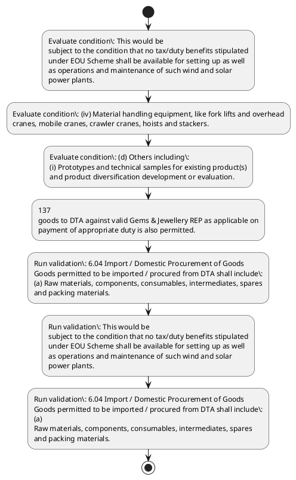

# Chapter 6 / Section 6.04: Import / Domestic Procurement of Goods

**Chapter Title:** Export Oriented Units (EOUs), Electronics Hardware Technology Parks (EHTPs), Software Technology Parks (STPs) and Bio-Technology

**Pages:** 5, 6

**Purpose:** 6.04 Import / Domestic Procurement of Goods
Goods permitted to be imported / procured from DTA shall include:
(a) Raw materials, components, consumables, intermediates, spares
and packing materials.

**Purpose Thanglish:** Indha Import / Domestic Procurement of Goods section-la, 6.04 import / Domestic Procurement of Goods
Goods permitted to be imported / procured from DTA kandippa include:
(a) Raw materials, components, consumables, intermediates, spares
and packing materials.

**Summary:** 6.04 Import / Domestic Procurement of Goods
Goods permitted to be imported / procured from DTA shall include:
(a) Raw materials, components, consumables, intermediates, spares
and packing materials. (b) Capital goods and its spares, whether new or second-hand which
inter-alia includes the following:
(i) Captive power plants (DG Sets, Wind Power, Solar Power),
including transformers and accessories. This would be
subject to the condition that no tax/duty benefits stipulated
under EOU Scheme shall be available for setting up as well
as operations and maintenance of such wind and solar
power plants.

**Business Meaning:** Import / Domestic Procurement of Goods governs how DGFT business controls should be applied, validated, and enforced.

**Business Explanation:** Import / Domestic Procurement of Goods explains the operating rule set that DEKAI should enforce. Key control points include 6.04 Import / Domestic Procurement of Goods
Goods permitted to be imported / procured from DTA shall include:
(a) Raw materials, components, consumables, intermediates, spares
and packing materials. The section also drives actions such as 137
goods to DTA against valid Gems & Jewellery REP as applicable on
payment of appropriate duty is also permitted..

**Business Explanation Thanglish:** Indha Import / Domestic Procurement of Goods section-la, import / Domestic Procurement of Goods explains the operating rule set that DEKAI should enforce. Key control points include 6.04 import / Domestic Procurement of Goods
Goods permitted to be imported / procured from DTA kandippa include:
(a) Raw materials, components, consumables, intermediates, spares
and packing materials. The section also drives actions such as 137
goods to DTA against valid Gems & Jewellery REP as applicable on
payment of appropriate duty is also permitted..

## Business Logic
- 6.04 Import / Domestic Procurement of Goods
Goods permitted to be imported / procured from DTA shall include:
(a) Raw materials, components, consumables, intermediates, spares
and packing materials.
- This would be
subject to the condition that no tax/duty benefits stipulated
under EOU Scheme shall be available for setting up as well
as operations and maintenance of such wind and solar
power plants.
- 6.04 Import / Domestic Procurement of Goods
Goods permitted to be imported / procured from DTA shall include:
(a)
Raw materials, components, consumables, intermediates, spares
and packing materials.

## Business Rules
- rule_id=CH6-SEC6_04-R001, rule_description=6.04 Import / Domestic Procurement of Goods
Goods permitted to be imported / procured from DTA shall include:
(a) Raw materials, components, consumables, intermediates, spares
and packing materials., trigger=Import / Domestic Procurement of Goods, condition=This would be
subject to the condition that no tax/duty benefits stipulated
under EOU Scheme shall be available for setting up as well
as operations and maintenance of such wind and solar
power plants., validation=6.04 Import / Domestic Procurement of Goods
Goods permitted to be imported / procured from DTA shall include:
(a) Raw materials, components, consumables, intermediates, spares
and packing materials., action=137
goods to DTA against valid Gems & Jewellery REP as applicable on
payment of appropriate duty is also permitted., exception=No explicit exception found in uploaded documents., output=DEKAI should produce a compliance decision for 6.04 - Import / Domestic Procurement of Goods.
- rule_id=CH6-SEC6_04-R002, rule_description=This would be
subject to the condition that no tax/duty benefits stipulated
under EOU Scheme shall be available for setting up as well
as operations and maintenance of such wind and solar
power plants., trigger=Import / Domestic Procurement of Goods, condition=(iv) Material handling equipment, like fork lifts and overhead
cranes, mobile cranes, crawler cranes, hoists and stackers., validation=This would be
subject to the condition that no tax/duty benefits stipulated
under EOU Scheme shall be available for setting up as well
as operations and maintenance of such wind and solar
power plants., action=137
goods to DTA against valid Gems & Jewellery REP as applicable on
payment of appropriate duty is also permitted., exception=No explicit exception found in uploaded documents., output=DEKAI should produce a compliance decision for 6.04 - Import / Domestic Procurement of Goods.
- rule_id=CH6-SEC6_04-R003, rule_description=6.04 Import / Domestic Procurement of Goods
Goods permitted to be imported / procured from DTA shall include:
(a)
Raw materials, components, consumables, intermediates, spares
and packing materials., trigger=Import / Domestic Procurement of Goods, condition=(d) Others including:
(i) Prototypes and technical samples for existing product(s)
and product diversification development or evaluation., validation=6.04 Import / Domestic Procurement of Goods
Goods permitted to be imported / procured from DTA shall include:
(a)
Raw materials, components, consumables, intermediates, spares
and packing materials., action=137
goods to DTA against valid Gems & Jewellery REP as applicable on
payment of appropriate duty is also permitted., exception=No explicit exception found in uploaded documents., output=DEKAI should produce a compliance decision for 6.04 - Import / Domestic Procurement of Goods.

## Conditions
- This would be
subject to the condition that no tax/duty benefits stipulated
under EOU Scheme shall be available for setting up as well
as operations and maintenance of such wind and solar
power plants.
- (iv) Material handling equipment, like fork lifts and overhead
cranes, mobile cranes, crawler cranes, hoists and stackers.
- (d) Others including:
(i) Prototypes and technical samples for existing product(s)
and product diversification development or evaluation.
- (iv)
Material handling equipment, like fork lifts and overhead
cranes, mobile cranes, crawler cranes, hoists and stackers.
- (d)
Others including:
(i)
Prototypes and technical samples for existing product(s)
and product diversification development or evaluation.

## Condition Logic
- id=6.6.04.1, if=This would be
subject to the condition that no tax/duty benefits stipulated
under EOU Scheme shall be available for setting up as well
as operations and maintenance of such wind and solar
power plants., then=137
goods to DTA against valid Gems & Jewellery REP as applicable on
payment of appropriate duty is also permitted., source=This would be
subject to the condition that no tax/duty benefits stipulated
under EOU Scheme shall be available for setting up as well
as operations and maintenance of such wind and solar
power plants.
- id=6.6.04.2, if=(iv) Material handling equipment, like fork lifts and overhead
cranes, mobile cranes, crawler cranes, hoists and stackers., then=137
goods to DTA against valid Gems & Jewellery REP as applicable on
payment of appropriate duty is also permitted., source=(iv) Material handling equipment, like fork lifts and overhead
cranes, mobile cranes, crawler cranes, hoists and stackers.
- id=6.6.04.3, if=(d) Others including:
(i) Prototypes and technical samples for existing product(s)
and product diversification development or evaluation., then=137
goods to DTA against valid Gems & Jewellery REP as applicable on
payment of appropriate duty is also permitted., source=(d) Others including:
(i) Prototypes and technical samples for existing product(s)
and product diversification development or evaluation.
- id=6.6.04.4, if=(iv)
Material handling equipment, like fork lifts and overhead
cranes, mobile cranes, crawler cranes, hoists and stackers., then=137
goods to DTA against valid Gems & Jewellery REP as applicable on
payment of appropriate duty is also permitted., source=(iv)
Material handling equipment, like fork lifts and overhead
cranes, mobile cranes, crawler cranes, hoists and stackers.
- id=6.6.04.5, if=(d)
Others including:
(i)
Prototypes and technical samples for existing product(s)
and product diversification development or evaluation., then=137
goods to DTA against valid Gems & Jewellery REP as applicable on
payment of appropriate duty is also permitted., source=(d)
Others including:
(i)
Prototypes and technical samples for existing product(s)
and product diversification development or evaluation.

## Validations
- 6.04 Import / Domestic Procurement of Goods
Goods permitted to be imported / procured from DTA shall include:
(a) Raw materials, components, consumables, intermediates, spares
and packing materials.
- This would be
subject to the condition that no tax/duty benefits stipulated
under EOU Scheme shall be available for setting up as well
as operations and maintenance of such wind and solar
power plants.
- 6.04 Import / Domestic Procurement of Goods
Goods permitted to be imported / procured from DTA shall include:
(a)
Raw materials, components, consumables, intermediates, spares
and packing materials.

## Exceptions
- None identified

## Dependencies
- None identified

## Authorities
- None identified

## Required Documents
- None identified

## Timelines
- (c) Raw materials for making capital goods for use within unit.
- (c)
Raw materials for making capital goods for use within unit.

## Actions
- 137
goods to DTA against valid Gems & Jewellery REP as applicable on
payment of appropriate duty is also permitted.

## Workflow
- Evaluate condition: This would be
subject to the condition that no tax/duty benefits stipulated
under EOU Scheme shall be available for setting up as well
as operations and maintenance of such wind and solar
power plants.
- Evaluate condition: (iv) Material handling equipment, like fork lifts and overhead
cranes, mobile cranes, crawler cranes, hoists and stackers.
- Evaluate condition: (d) Others including:
(i) Prototypes and technical samples for existing product(s)
and product diversification development or evaluation.
- 137
goods to DTA against valid Gems & Jewellery REP as applicable on
payment of appropriate duty is also permitted.
- Run validation: 6.04 Import / Domestic Procurement of Goods
Goods permitted to be imported / procured from DTA shall include:
(a) Raw materials, components, consumables, intermediates, spares
and packing materials.
- Run validation: This would be
subject to the condition that no tax/duty benefits stipulated
under EOU Scheme shall be available for setting up as well
as operations and maintenance of such wind and solar
power plants.
- Run validation: 6.04 Import / Domestic Procurement of Goods
Goods permitted to be imported / procured from DTA shall include:
(a)
Raw materials, components, consumables, intermediates, spares
and packing materials.

## Workflow ASCII
```text
Import / Domestic Procurement of Goods
Evaluate condition: This would be
subject to the condition that no tax/duty benefits stipulated
under EOU Scheme shall be available for setting up as well
as operations and maintenance of such wind and solar
power plants.
   |
   v
Evaluate condition: (iv) Material handling equipment, like fork lifts and overhead
cranes, mobile cranes, crawler cranes, hoists and stackers.
   |
   v
Evaluate condition: (d) Others including:
(i) Prototypes and technical samples for existing product(s)
and product diversification development or evaluation.
   |
   v
137
goods to DTA against valid Gems & Jewellery REP as applicable on
payment of appropriate duty is also permitted.
   |
   v
Run validation: 6.04 Import / Domestic Procurement of Goods
Goods permitted to be imported / procured from DTA shall include:
(a) Raw materials, components, consumables, intermediates, spares
and packing materials.
   |
   v
Run validation: This would be
subject to the condition that no tax/duty benefits stipulated
under EOU Scheme shall be available for setting up as well
as operations and maintenance of such wind and solar
power plants.
   |
   v
Run validation: 6.04 Import / Domestic Procurement of Goods
Goods permitted to be imported / procured from DTA shall include:
(a)
Raw materials, components, consumables, intermediates, spares
and packing materials.
```

## Decision Tree
- IF This would be
subject to the condition that no tax/duty benefits stipulated
under EOU Scheme shall be available for setting up as well
as operations and maintenance of such wind and solar
power plants. THEN 137
goods to DTA against valid Gems & Jewellery REP as applicable on
payment of appropriate duty is also permitted.
- IF (iv) Material handling equipment, like fork lifts and overhead
cranes, mobile cranes, crawler cranes, hoists and stackers. THEN 137
goods to DTA against valid Gems & Jewellery REP as applicable on
payment of appropriate duty is also permitted.
- IF (d) Others including:
(i) Prototypes and technical samples for existing product(s)
and product diversification development or evaluation. THEN 137
goods to DTA against valid Gems & Jewellery REP as applicable on
payment of appropriate duty is also permitted.
- IF (iv)
Material handling equipment, like fork lifts and overhead
cranes, mobile cranes, crawler cranes, hoists and stackers. THEN 137
goods to DTA against valid Gems & Jewellery REP as applicable on
payment of appropriate duty is also permitted.
- IF (d)
Others including:
(i)
Prototypes and technical samples for existing product(s)
and product diversification development or evaluation. THEN 137
goods to DTA against valid Gems & Jewellery REP as applicable on
payment of appropriate duty is also permitted.

## Decision Tree ASCII
```text
Import / Domestic Procurement of Goods Decision
IF This would be
subject to the condition that no tax/duty benefits stipulated
under EOU Scheme shall be available for setting up as well
as operations and maintenance of such wind and solar
power plants. THEN 137
goods to DTA against valid Gems & Jewellery REP as applicable on
payment of appropriate duty is also permitted.
   |
   v
IF (iv) Material handling equipment, like fork lifts and overhead
cranes, mobile cranes, crawler cranes, hoists and stackers. THEN 137
goods to DTA against valid Gems & Jewellery REP as applicable on
payment of appropriate duty is also permitted.
   |
   v
IF (d) Others including:
(i) Prototypes and technical samples for existing product(s)
and product diversification development or evaluation. THEN 137
goods to DTA against valid Gems & Jewellery REP as applicable on
payment of appropriate duty is also permitted.
   |
   v
IF (iv)
Material handling equipment, like fork lifts and overhead
cranes, mobile cranes, crawler cranes, hoists and stackers. THEN 137
goods to DTA against valid Gems & Jewellery REP as applicable on
payment of appropriate duty is also permitted.
   |
   v
IF (d)
Others including:
(i)
Prototypes and technical samples for existing product(s)
and product diversification development or evaluation. THEN 137
goods to DTA against valid Gems & Jewellery REP as applicable on
payment of appropriate duty is also permitted.
```

## Examples
- User asks to process Import / Domestic Procurement of Goods; the platform checks conditions, validations, and documents before action.

**Real-world Example:** Example: an importer or exporter invokes Import / Domestic Procurement of Goods, submits the prescribed DGFT records, and DEKAI uses the extracted rules to 137
goods to dta against valid gems & jewellery rep as applicable on
payment of appropriate duty is also permitted..

**Real-world Example Thanglish:** Indha Import / Domestic Procurement of Goods section-la, Example: an importer or exporter invokes import / Domestic Procurement of Goods, submits the prescribed DGFT records, and DEKAI uses the extracted rules to 137
goods to dta against valid gems & jewellery rep as applicable on
payment of appropriate duty is also permitted..

## AI Rules
- IF detected context matches section rule THEN enforce: 6.04 Import / Domestic Procurement of Goods
Goods permitted to be imported / procured from DTA shall include:
(a) Raw materials, components, consumables, intermediates, spares
and packing materials.
- IF detected context matches section rule THEN enforce: This would be
subject to the condition that no tax/duty benefits stipulated
under EOU Scheme shall be available for setting up as well
as operations and maintenance of such wind and solar
power plants.
- IF detected context matches section rule THEN enforce: 6.04 Import / Domestic Procurement of Goods
Goods permitted to be imported / procured from DTA shall include:
(a)
Raw materials, components, consumables, intermediates, spares
and packing materials.
- IF validations pass THEN recommend action: 137
goods to DTA against valid Gems & Jewellery REP as applicable on
payment of appropriate duty is also permitted.

## Database Fields
- name=section_code, type=string, required=True, source=parsed_section_heading
- name=section_title, type=string, required=True, source=parsed_section_heading
- name=dta_flag, type=boolean, required=False, source=keyword:DTA
- name=raw_flag, type=boolean, required=False, source=keyword:Raw
- name=and_flag, type=boolean, required=False, source=keyword:and
- name=its_flag, type=boolean, required=False, source=keyword:its
- name=new_flag, type=boolean, required=False, source=keyword:new
- name=the_flag, type=boolean, required=False, source=keyword:the
- name=eou_flag, type=boolean, required=False, source=keyword:EOU
- name=for_flag, type=boolean, required=False, source=keyword:for

## API Requirements
- method=GET, path=/api/dgft/sections/6.04, purpose=Retrieve knowledge payload for section 6.04, query_params=['include=workflow,decision_tree,validations'], response_fields=['section', 'title', 'summary', 'conditions', 'validations', 'exceptions', 'workflow', 'decision_tree']
- method=POST, path=/api/dgft/Import-Domestic-Procurement-of-Goods/validate, purpose=Validate inputs and documents for Import / Domestic Procurement of Goods, request_fields=['section_code', 'section_title'], response_fields=['status', 'errors', 'warnings', 'next_actions']
- method=POST, path=/api/dgft/Import-Domestic-Procurement-of-Goods/execute, purpose=Trigger business action for 137
goods to DTA against valid Gems & Jewellery REP as applicable on
payment of appropriate duty is also permitted., request_fields=['section_code', 'section_title'], response_fields=['reference_id', 'status', 'authority', 'timeline']

## UI Screens
- screen_id=Import_Domestic_Procurement_of_Goods_overview, name=Import / Domestic Procurement of Goods Overview, purpose=Show section summary, authority, timeline, and eligibility cues., widgets=['summary_card', 'conditions_table', 'authority_badges', 'timeline_panel']
- screen_id=Import_Domestic_Procurement_of_Goods_submission, name=Import / Domestic Procurement of Goods Submission, purpose=Capture applicant data and supporting documents., widgets=['dynamic_form', 'document_uploader', 'validation_panel', 'next_action_footer'], fields=['section_code', 'section_title', 'dta_flag', 'raw_flag', 'and_flag', 'its_flag', 'new_flag', 'the_flag']

## Error Messages
- Validation failed because the section requirements were not fully met.

## FAQ
- question_en=What is the purpose of section 6.04?, answer_en=Import / Domestic Procurement of Goods explains the operating rule set that DEKAI should enforce. Key control points include 6.04 Import / Domestic Procurement of Goods
Goods permitted to be imported / procured from DTA shall include:
(a) Raw materials, components, consumables, intermediates, spares
and packing materials. The section also drives actions such as 137
goods to DTA against valid Gems & Jewellery REP as applicable on
payment of appropriate duty is also permitted.., question_thanglish=Indha Import / Domestic Procurement of Goods section-la, What is the purpose of section 6.04?, answer_thanglish=Indha Import / Domestic Procurement of Goods section-la, import / Domestic Procurement of Goods explains the operating rule set that DEKAI should enforce. Key control points include 6.04 import / Domestic Procurement of Goods
Goods permitted to be imported / procured from DTA kandippa include:
(a) Raw materials, components, consumables, intermediates, spares
and packing materials. The section also drives actions such as 137
goods to DTA against valid Gems & Jewellery REP as applicable on
payment of appropriate duty is also permitted..
- question_en=What documents are required under Import / Domestic Procurement of Goods?, answer_en=Not explicitly covered in uploaded documents., question_thanglish=Indha Import / Domestic Procurement of Goods section-la, What documents are required under import / Domestic Procurement of Goods?, answer_thanglish=Indha Import / Domestic Procurement of Goods section-la, Not explicitly covered in uploaded documents.
- question_en=Which authority handles Import / Domestic Procurement of Goods?, answer_en=Not explicitly covered in uploaded documents., question_thanglish=Indha Import / Domestic Procurement of Goods section-la, Which authority handles import / Domestic Procurement of Goods?, answer_thanglish=Indha Import / Domestic Procurement of Goods section-la, Not explicitly covered in uploaded documents.

## Questions Users May Ask
- What does Import / Domestic Procurement of Goods require?
- Which documents are needed for Import / Domestic Procurement of Goods?
- How does DEKAI validate Import / Domestic Procurement of Goods requests?
- What action should be taken for Import / Domestic Procurement of Goods?

## Expected AI Answers
- Import / Domestic Procurement of Goods requires the platform to interpret the section text, apply the extracted business rules, and present the correct next action.
- Required documents are inferred from the section text: no explicit documents were detected.
- DEKAI validates Import / Domestic Procurement of Goods by checking conditions, required documents, authority references, and exception clauses before recommending an outcome.
- The primary extracted action is: 137
goods to DTA against valid Gems & Jewellery REP as applicable on
payment of appropriate duty is also permitted.

## AI Q&A Examples
- question_en=User asks: How do I comply with Import / Domestic Procurement of Goods?, answer_en=AI answers: DEKAI should evaluate section 6.04, apply the extracted rules, and guide the user through Evaluate condition: This would be
subject to the condition that no tax/duty benefits stipulated
under EOU Scheme shall be available for setting up as well
as operations and maintenance of such wind and solar
power plants.., question_thanglish=Indha Import / Domestic Procurement of Goods section-la, User asks: How do I comply with import / Domestic Procurement of Goods?, answer_thanglish=Indha Import / Domestic Procurement of Goods section-la, AI answers: DEKAI should evaluate section 6.04, apply the extracted rules, and guide the user through Evaluate condition: This would be
subject to the condition that no tax/duty benefits stipulated
under EOU Scheme kandippa be available for setting up as well
as operations and maintenance of such wind and solar
power plants..
- question_en=User asks: Which validations apply to Import / Domestic Procurement of Goods?, answer_en=AI answers: Applicable validations are 6.04 Import / Domestic Procurement of Goods
Goods permitted to be imported / procured from DTA shall include:
(a) Raw materials, components, consumables, intermediates, spares
and packing materials., This would be
subject to the condition that no tax/duty benefits stipulated
under EOU Scheme shall be available for setting up as well
as operations and maintenance of such wind and solar
power plants., 6.04 Import / Domestic Procurement of Goods
Goods permitted to be imported / procured from DTA shall include:
(a)
Raw materials, components, consumables, intermediates, spares
and packing materials., question_thanglish=Indha Import / Domestic Procurement of Goods section-la, User asks: Which validations apply to import / Domestic Procurement of Goods?, answer_thanglish=Indha Import / Domestic Procurement of Goods section-la, AI answers: Applicable validations are 6.04 import / Domestic Procurement of Goods
Goods permitted to be imported / procured from DTA kandippa include:
(a) Raw materials, components, consumables, intermediates, spares
and packing materials., This would be
subject to the condition that no tax/duty benefits stipulated
under EOU Scheme kandippa be available for setting up as well
as operations and maintenance of such wind and solar
power plants., 6.04 import / Domestic Procurement of Goods
Goods permitted to be imported / procured from DTA kandippa include:
(a)
Raw materials, components, consumables, intermediates, spares
and packing materials.

## DEKAI AI Implementation Notes
- Capture chapter 6, section 6.04, title, and page references as immutable knowledge metadata.
- Bind validations for Import / Domestic Procurement of Goods into a rule engine keyed by the rule IDs extracted for this section.

## DEKAI AI Implementation Notes Thanglish
- Indha Import / Domestic Procurement of Goods section-la, Capture chapter 6, section 6.04, title, and page references as immutable knowledge metadata.
- Indha Import / Domestic Procurement of Goods section-la, Bind validations for import / Domestic Procurement of Goods into a rule engine keyed by the rule IDs extracted for this section.

## AI Metadata
- Keywords: DTA, Raw, and, its, new, the, EOU, for, iii, UPS, Air, vii, use, Fax, REP, Any, not, BOA, from, Sets
- Search Keywords: DTA, Raw, and, its, new, the, EOU, for, iii, UPS, Air, vii, use, Fax, REP, Any, not, BOA, from, Sets
- Intent: Support Import / Domestic Procurement of Goods processing and compliance validation.
- Tags: 6.04, Import / Domestic Procurement of Goods, business-rule, dgft
- Related Sections: 
- Related Chapters: 
- Related Rules: 6.04 Import / Domestic Procurement of Goods
Goods permitted to be imported / procured from DTA shall include:
(a) Raw materials, components, consumables, intermediates, spares
and packing materials., This would be
subject to the condition that no tax/duty benefits stipulated
under EOU Scheme shall be available for setting up as well
as operations and maintenance of such wind and solar
power plants., 6.04 Import / Domestic Procurement of Goods
Goods permitted to be imported / procured from DTA shall include:
(a)
Raw materials, components, consumables, intermediates, spares
and packing materials.

## Mermaid

```mermaid
flowchart TD
    S1["Evaluate condition: This would be
subject to the condition that no tax/duty benefits stipulated
under EOU Scheme shall be available for setting up as well
as operations and maintenance of such wind and solar
power plants."]
    S2["Evaluate condition: (iv) Material handling equipment, like fork lifts and overhead
cranes, mobile cranes, crawler cranes, hoists and stackers."]
    S1 --> S2
    S3["Evaluate condition: (d) Others including:
(i) Prototypes and technical samples for existing product(s)
and product diversification development or evaluation."]
    S2 --> S3
    S4["137
goods to DTA against valid Gems & Jewellery REP as applicable on
payment of appropriate duty is also permitted."]
    S3 --> S4
    S5["Run validation: 6.04 Import / Domestic Procurement of Goods
Goods permitted to be imported / procured from DTA shall include:
(a) Raw materials, components, consumables, intermediates, spares
and packing materials."]
    S4 --> S5
    S6["Run validation: This would be
subject to the condition that no tax/duty benefits stipulated
under EOU Scheme shall be available for setting up as well
as operations and maintenance of such wind and solar
power plants."]
    S5 --> S6
    S7["Run validation: 6.04 Import / Domestic Procurement of Goods
Goods permitted to be imported / procured from DTA shall include:
(a)
Raw materials, components, consumables, intermediates, spares
and packing materials."]
    S6 --> S7
```


## PlantUML

