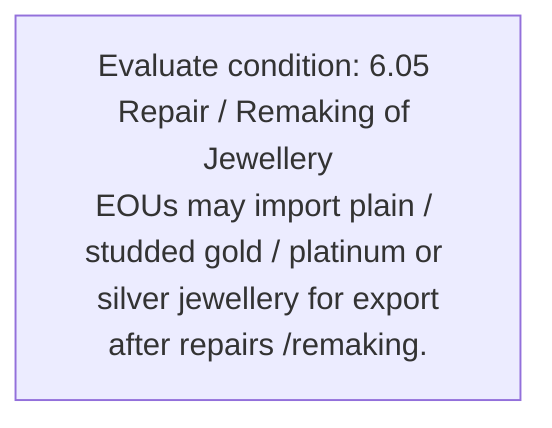
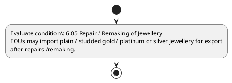

# Chapter 6 / Section 6.05: Repair / Remaking of Jewellery

**Chapter Title:** Export Oriented Units (EOUs), Electronics Hardware Technology Parks (EHTPs), Software Technology Parks (STPs) and Bio-Technology

**Pages:** 6

**Purpose:** 6.05 Repair / Remaking of Jewellery
EOUs may import plain / studded gold / platinum or silver jewellery for export
after repairs /remaking.

**Purpose Thanglish:** Indha Repair / Remaking of Jewellery section-la, 6.05 Repair / Remaking of Jewellery
EOUs may import plain / studded gold / platinum or silver jewellery for export
after repairs /remaking.

**Summary:** 6.05 Repair / Remaking of Jewellery
EOUs may import plain / studded gold / platinum or silver jewellery for export
after repairs /remaking.

**Business Meaning:** 6.05 Repair / Remaking of Jewellery
EOUs may import plain / studded gold / platinum or silver jewellery for export
after repairs /remaking.

**Business Explanation:** 6.05 Repair / Remaking of Jewellery
EOUs may import plain / studded gold / platinum or silver jewellery for export
after repairs /remaking.

**Business Explanation Thanglish:** Indha Repair / Remaking of Jewellery section-la, 6.05 Repair / Remaking of Jewellery
EOUs may import plain / studded gold / platinum or silver jewellery for export
after repairs /remaking.

## Business Logic
- None identified

## Business Rules
- rule_id=CH6-SEC6_05-R001, rule_description=6.05 Repair / Remaking of Jewellery
EOUs may import plain / studded gold / platinum or silver jewellery for export
after repairs /remaking., trigger=Repair / Remaking of Jewellery, condition=6.05 Repair / Remaking of Jewellery
EOUs may import plain / studded gold / platinum or silver jewellery for export
after repairs /remaking., validation=Not explicitly covered in uploaded documents., action=Manual review required., exception=No explicit exception found in uploaded documents., output=DEKAI should produce a compliance decision for 6.05 - Repair / Remaking of Jewellery.

## Conditions
- 6.05 Repair / Remaking of Jewellery
EOUs may import plain / studded gold / platinum or silver jewellery for export
after repairs /remaking.

## Condition Logic
- id=6.6.05.1, if=6.05 Repair / Remaking of Jewellery
EOUs may import plain / studded gold / platinum or silver jewellery for export
after repairs /remaking., then=Route for review, source=6.05 Repair / Remaking of Jewellery
EOUs may import plain / studded gold / platinum or silver jewellery for export
after repairs /remaking.

## Validations
- None identified

## Exceptions
- None identified

## Dependencies
- None identified

## Authorities
- None identified

## Required Documents
- None identified

## Timelines
- 6.05 Repair / Remaking of Jewellery
EOUs may import plain / studded gold / platinum or silver jewellery for export
after repairs /remaking.

## Actions
- None identified

## Workflow
- Evaluate condition: 6.05 Repair / Remaking of Jewellery
EOUs may import plain / studded gold / platinum or silver jewellery for export
after repairs /remaking.

## Workflow ASCII
```text
Repair / Remaking of Jewellery
Evaluate condition: 6.05 Repair / Remaking of Jewellery
EOUs may import plain / studded gold / platinum or silver jewellery for export
after repairs /remaking.
```

## Decision Tree
- IF section 6.05 applies THEN proceed with standard DGFT workflow

## Decision Tree ASCII
```text
Repair / Remaking of Jewellery Decision
IF section 6.05 applies THEN proceed with standard DGFT workflow
```

## Examples
- User asks to process Repair / Remaking of Jewellery; the platform checks conditions, validations, and documents before action.

**Real-world Example:** Example: an importer or exporter invokes Repair / Remaking of Jewellery, submits the prescribed DGFT records, and DEKAI uses the extracted rules to follow the repair / remaking of jewellery process.

**Real-world Example Thanglish:** Indha Repair / Remaking of Jewellery section-la, Example: an importer or exporter invokes Repair / Remaking of Jewellery, submits the prescribed DGFT records, and DEKAI uses the extracted rules to follow the repair / remaking of jewellery process.

## AI Rules
- None identified

## Database Fields
- name=section_code, type=string, required=True, source=parsed_section_heading
- name=section_title, type=string, required=True, source=parsed_section_heading
- name=may_flag, type=boolean, required=False, source=keyword:may
- name=for_flag, type=boolean, required=False, source=keyword:for
- name=eous_flag, type=boolean, required=False, source=keyword:EOUs
- name=gold_flag, type=boolean, required=False, source=keyword:gold
- name=plain_flag, type=boolean, required=False, source=keyword:plain
- name=after_flag, type=boolean, required=False, source=keyword:after
- name=repair_flag, type=boolean, required=False, source=keyword:Repair
- name=import_flag, type=boolean, required=False, source=keyword:import

## API Requirements
- method=GET, path=/api/dgft/sections/6.05, purpose=Retrieve knowledge payload for section 6.05, query_params=['include=workflow,decision_tree,validations'], response_fields=['section', 'title', 'summary', 'conditions', 'validations', 'exceptions', 'workflow', 'decision_tree']
- method=POST, path=/api/dgft/Repair-Remaking-of-Jewellery/validate, purpose=Validate inputs and documents for Repair / Remaking of Jewellery, request_fields=['section_code', 'section_title'], response_fields=['status', 'errors', 'warnings', 'next_actions']

## UI Screens
- screen_id=Repair_Remaking_of_Jewellery_overview, name=Repair / Remaking of Jewellery Overview, purpose=Show section summary, authority, timeline, and eligibility cues., widgets=['summary_card', 'conditions_table', 'authority_badges', 'timeline_panel']
- screen_id=Repair_Remaking_of_Jewellery_submission, name=Repair / Remaking of Jewellery Submission, purpose=Capture applicant data and supporting documents., widgets=['dynamic_form', 'document_uploader', 'validation_panel', 'next_action_footer'], fields=['section_code', 'section_title', 'may_flag', 'for_flag', 'eous_flag', 'gold_flag', 'plain_flag', 'after_flag']

## Error Messages
- Validation failed because the section requirements were not fully met.

## FAQ
- question_en=What is the purpose of section 6.05?, answer_en=6.05 Repair / Remaking of Jewellery
EOUs may import plain / studded gold / platinum or silver jewellery for export
after repairs /remaking., question_thanglish=Indha Repair / Remaking of Jewellery section-la, What is the purpose of section 6.05?, answer_thanglish=Indha Repair / Remaking of Jewellery section-la, 6.05 Repair / Remaking of Jewellery
EOUs may import plain / studded gold / platinum or silver jewellery for export
after repairs /remaking.
- question_en=What documents are required under Repair / Remaking of Jewellery?, answer_en=Not explicitly covered in uploaded documents., question_thanglish=Indha Repair / Remaking of Jewellery section-la, What documents are required under Repair / Remaking of Jewellery?, answer_thanglish=Indha Repair / Remaking of Jewellery section-la, Not explicitly covered in uploaded documents.
- question_en=Which authority handles Repair / Remaking of Jewellery?, answer_en=Not explicitly covered in uploaded documents., question_thanglish=Indha Repair / Remaking of Jewellery section-la, Which authority handles Repair / Remaking of Jewellery?, answer_thanglish=Indha Repair / Remaking of Jewellery section-la, Not explicitly covered in uploaded documents.

## Questions Users May Ask
- What does Repair / Remaking of Jewellery require?
- Which documents are needed for Repair / Remaking of Jewellery?
- How does DEKAI validate Repair / Remaking of Jewellery requests?

## Expected AI Answers
- Repair / Remaking of Jewellery requires the platform to interpret the section text, apply the extracted business rules, and present the correct next action.
- Required documents are inferred from the section text: no explicit documents were detected.
- DEKAI validates Repair / Remaking of Jewellery by checking conditions, required documents, authority references, and exception clauses before recommending an outcome.

## AI Q&A Examples
- question_en=User asks: How do I comply with Repair / Remaking of Jewellery?, answer_en=AI answers: DEKAI should evaluate section 6.05, apply the extracted rules, and guide the user through Evaluate condition: 6.05 Repair / Remaking of Jewellery
EOUs may import plain / studded gold / platinum or silver jewellery for export
after repairs /remaking.., question_thanglish=Indha Repair / Remaking of Jewellery section-la, User asks: How do I comply with Repair / Remaking of Jewellery?, answer_thanglish=Indha Repair / Remaking of Jewellery section-la, AI answers: DEKAI should evaluate section 6.05, apply the extracted rules, and guide the user through Evaluate condition: 6.05 Repair / Remaking of Jewellery
EOUs may import plain / studded gold / platinum or silver jewellery for export
after repairs /remaking..
- question_en=User asks: Which validations apply to Repair / Remaking of Jewellery?, answer_en=AI answers: Applicable validations are not explicitly covered in the uploaded documents., question_thanglish=Indha Repair / Remaking of Jewellery section-la, User asks: Which validations apply to Repair / Remaking of Jewellery?, answer_thanglish=Indha Repair / Remaking of Jewellery section-la, AI answers: Applicable validations are not explicitly covered in the uploaded documents.

## DEKAI AI Implementation Notes
- Capture chapter 6, section 6.05, title, and page references as immutable knowledge metadata.
- Bind validations for Repair / Remaking of Jewellery into a rule engine keyed by the rule IDs extracted for this section.

## DEKAI AI Implementation Notes Thanglish
- Indha Repair / Remaking of Jewellery section-la, Capture chapter 6, section 6.05, title, and page references as immutable knowledge metadata.
- Indha Repair / Remaking of Jewellery section-la, Bind validations for Repair / Remaking of Jewellery into a rule engine keyed by the rule IDs extracted for this section.

## AI Metadata
- Keywords: may, for, EOUs, gold, plain, after, Repair, import, silver, export, studded, repairs, Remaking, platinum, Jewellery
- Search Keywords: may, for, EOUs, gold, plain, after, Repair, import, silver, export, studded, repairs, Remaking, platinum, Jewellery
- Intent: Provide knowledge guidance for Repair / Remaking of Jewellery.
- Tags: 6.05, Repair / Remaking of Jewellery, dgft
- Related Sections: 
- Related Chapters: 
- Related Rules: 

## Mermaid


## PlantUML

