# Chapter 6 / Section 6.06: Conditions of Import

**Chapter Title:** Export Oriented Units (EOUs), Electronics Hardware Technology Parks (EHTPs), Software Technology Parks (STPs) and Bio-Technology

**Pages:** 6, 7

**Purpose:** 6.06 Conditions of Import
Import of goods by EOU / EHTP / STP / BTP units shall be subject to following
conditions:
(a) Goods shall be imported into EOU / EHTP / STP / BTP premises.

**Purpose Thanglish:** Indha Conditions of Import section-la, 6.06 Conditions of import
import of goods by EOU / EHTP / STP / BTP units kandippa be subject to following
conditions:
(a) Goods kandippa be imported into EOU / EHTP / STP / BTP premises.

**Summary:** 6.06 Conditions of Import
Import of goods by EOU / EHTP / STP / BTP units shall be subject to following
conditions:
(a) Goods shall be imported into EOU / EHTP / STP / BTP premises. However, agriculture and allied sectors and granite sector units in
EOU may supply / transfer capital goods and inputs in farm / fields
/ quarries with prior intimation to jurisdictional Customs
authorities, provided ownership of goods rests with EOUs. Granite
sector would also be allowed to take spares upto 5% of value of
Capital Goods to quarry site.

**Business Meaning:** Conditions of Import governs how DGFT business controls should be applied, validated, and enforced.

**Business Explanation:** Conditions of Import explains the operating rule set that DEKAI should enforce. Key control points include 6.06 Conditions of Import
Import of goods by EOU / EHTP / STP / BTP units shall be subject to following
conditions:
(a) Goods shall be imported into EOU / EHTP / STP / BTP premises. The section also drives actions such as (d) Goods already imported / shipped / arrived before issue of Lo P /
Lo I are also eligible for clearance as provided under para 6.01 (d)
pg..

**Business Explanation Thanglish:** Indha Conditions of Import section-la, Conditions of import explains the operating rule set that DEKAI should enforce. Key control points include 6.06 Conditions of import
import of goods by EOU / EHTP / STP / BTP units kandippa be subject to following
conditions:
(a) Goods kandippa be imported into EOU / EHTP / STP / BTP premises. The section also drives actions such as (d) Goods already imported / shipped / arrived before issue of Lo P /
Lo I are also eligible for clearance as provided under para 6.01 (d)
pg..

## Business Logic
- 6.06 Conditions of Import
Import of goods by EOU / EHTP / STP / BTP units shall be subject to following
conditions:
(a) Goods shall be imported into EOU / EHTP / STP / BTP premises.
- (c) (i) The period of utilisation of goods, including capital goods,
shall beco-terminus with the validity of Lo P.
- (ii) However, imported tea shall be utilized within a period of 6
months from date of import.
- Similarly, export obligation
against import of items {covered by Chapter 9 of ITC(HS)} and
coconut oil shall be fulfilled within a period of 90 days from the
date on which first import consignment is cleared by Customs
Authorities.
- (iii) Further, in case of import of spices for VA purpose like
crushing / grinding / sterilization or for manufacture of oils
and oleoresins of pepper, cardamom and chillies (and not for
simple cleaning, grading, re- packing etc.), EO shall be
fulfilled within 120 days from the date of importation of first
consignment.
- In case of import of spices (other than pepper,
cardamom and chillies) for manufacture of spice oils and
oleoresins, EO shall be fulfilled within 12 months.
- (d) Goods already imported / shipped / arrived before issue of Lo P /
Lo I are also eligible for clearance as provided under para 6.01 (d)
pg.
- 6.06 Conditions of Import
Import of goods by EOU / EHTP / STP / BTP units shall be subject to following
conditions:
(a)
Goods shall be imported into EOU / EHTP / STP / BTP premises.
- (c)
(i) The period of utilisation of goods, including capital goods,
shall beco-terminus with the validity of Lo P.
- (ii)
However, imported tea shall be utilized within a period of 6
months from date of import.
- (iii)
Further, in case of import of spices for VA purpose like
crushing / grinding / sterilization or for manufacture of oils
and oleoresins of pepper, cardamom and chillies (and not for
simple cleaning, grading, re- packing etc.), EO shall be
fulfilled within 120 days from the date of importation of first
consignment.
- (d)
Goods already imported / shipped / arrived before issue of Lo P /
Lo I are also eligible for clearance as provided under para 6.01 (d)
(ii) of FTP under EOU / EHTP / STP / BTP scheme without
payment of duty and/or taxes as applicable, provided, the said
duties and/or taxes has not been paid and goods have not been
cleared from Customs.
- (e) Consumption of inputs by the EOU / EHTP / STP / BTP unit shall
be based on the Standard Input Output Norms (SION) provided
that:
(i) where no SION have been notified, generation of waste,
scrap and remnants upto 2% of input quantity shall be
allowed;
(ii) where additional items other than those given in SION are
required as inputs or where generation of waste, scrap and
remnants is beyond 2% of input quantity, use of such inputs
shall be allowed by the jurisdictional DC within a period of
three months from the date of application and based on self
declared norms, with the unit undertaking to adjust self-
declared / ad hoc norms in accordance with norms as finally
fixed by Norms Committee in DGFT;
(iii) in case of any difficulty in fixation of SION as above, BOA in
consultation with Norms Committee in DGFT, will decide on
a case to case basis.

## Business Rules
- rule_id=CH6-SEC6_06-R001, rule_description=6.06 Conditions of Import
Import of goods by EOU / EHTP / STP / BTP units shall be subject to following
conditions:
(a) Goods shall be imported into EOU / EHTP / STP / BTP premises., trigger=Conditions of Import, condition=6.06 Conditions of Import
Import of goods by EOU / EHTP / STP / BTP units shall be subject to following
conditions:
(a) Goods shall be imported into EOU / EHTP / STP / BTP premises., validation=6.06 Conditions of Import
Import of goods by EOU / EHTP / STP / BTP units shall be subject to following
conditions:
(a) Goods shall be imported into EOU / EHTP / STP / BTP premises., action=(d) Goods already imported / shipped / arrived before issue of Lo P /
Lo I are also eligible for clearance as provided under para 6.01 (d)
pg., exception=However, agriculture and allied sectors and granite sector units in
EOU may supply / transfer capital goods and inputs in farm / fields
/ quarries with prior intimation to jurisdictional Customs
authorities, provided ownership of goods rests with EOUs., output=DEKAI should produce a compliance decision for 6.06 - Conditions of Import.
- rule_id=CH6-SEC6_06-R002, rule_description=(c) (i) The period of utilisation of goods, including capital goods,
shall beco-terminus with the validity of Lo P., trigger=Conditions of Import, condition=(iii) Further, in case of import of spices for VA purpose like
crushing / grinding / sterilization or for manufacture of oils
and oleoresins of pepper, cardamom and chillies (and not for
simple cleaning, grading, re- packing etc.), EO shall be
fulfilled within 120 days from the date of importation of first
consignment., validation=(c) (i) The period of utilisation of goods, including capital goods,
shall beco-terminus with the validity of Lo P., action=(d)
Goods already imported / shipped / arrived before issue of Lo P /
Lo I are also eligible for clearance as provided under para 6.01 (d)
(ii) of FTP under EOU / EHTP / STP / BTP scheme without
payment of duty and/or taxes as applicable, provided, the said
duties and/or taxes has not been paid and goods have not been
cleared from Customs., exception=(ii) However, imported tea shall be utilized within a period of 6
months from date of import., output=DEKAI should produce a compliance decision for 6.06 - Conditions of Import.
- rule_id=CH6-SEC6_06-R003, rule_description=(ii) However, imported tea shall be utilized within a period of 6
months from date of import., trigger=Conditions of Import, condition=In case of import of spices (other than pepper,
cardamom and chillies) for manufacture of spice oils and
oleoresins, EO shall be fulfilled within 12 months., validation=(ii) However, imported tea shall be utilized within a period of 6
months from date of import., action=(d)
Goods already imported / shipped / arrived before issue of Lo P /
Lo I are also eligible for clearance as provided under para 6.01 (d)
(ii) of FTP under EOU / EHTP / STP / BTP scheme without
payment of duty and/or taxes as applicable, provided, the said
duties and/or taxes has not been paid and goods have not been
cleared from Customs., exception=(ii)
However, imported tea shall be utilized within a period of 6
months from date of import., output=DEKAI should produce a compliance decision for 6.06 - Conditions of Import.
- rule_id=CH6-SEC6_06-R004, rule_description=Similarly, export obligation
against import of items {covered by Chapter 9 of ITC(HS)} and
coconut oil shall be fulfilled within a period of 90 days from the
date on which first import consignment is cleared by Customs
Authorities., trigger=Conditions of Import, condition=(d) Goods already imported / shipped / arrived before issue of Lo P /
Lo I are also eligible for clearance as provided under para 6.01 (d)
pg., validation=Similarly, export obligation
against import of items {covered by Chapter 9 of ITC(HS)} and
coconut oil shall be fulfilled within a period of 90 days from the
date on which first import consignment is cleared by Customs
Authorities., action=(d)
Goods already imported / shipped / arrived before issue of Lo P /
Lo I are also eligible for clearance as provided under para 6.01 (d)
(ii) of FTP under EOU / EHTP / STP / BTP scheme without
payment of duty and/or taxes as applicable, provided, the said
duties and/or taxes has not been paid and goods have not been
cleared from Customs., exception=(ii)
However, imported tea shall be utilized within a period of 6
months from date of import., output=DEKAI should produce a compliance decision for 6.06 - Conditions of Import.
- rule_id=CH6-SEC6_06-R005, rule_description=(iii) Further, in case of import of spices for VA purpose like
crushing / grinding / sterilization or for manufacture of oils
and oleoresins of pepper, cardamom and chillies (and not for
simple cleaning, grading, re- packing etc.), EO shall be
fulfilled within 120 days from the date of importation of first
consignment., trigger=Conditions of Import, condition=6.06 Conditions of Import
Import of goods by EOU / EHTP / STP / BTP units shall be subject to following
conditions:
(a)
Goods shall be imported into EOU / EHTP / STP / BTP premises., validation=(iii) Further, in case of import of spices for VA purpose like
crushing / grinding / sterilization or for manufacture of oils
and oleoresins of pepper, cardamom and chillies (and not for
simple cleaning, grading, re- packing etc.), EO shall be
fulfilled within 120 days from the date of importation of first
consignment., action=(d)
Goods already imported / shipped / arrived before issue of Lo P /
Lo I are also eligible for clearance as provided under para 6.01 (d)
(ii) of FTP under EOU / EHTP / STP / BTP scheme without
payment of duty and/or taxes as applicable, provided, the said
duties and/or taxes has not been paid and goods have not been
cleared from Customs., exception=(ii)
However, imported tea shall be utilized within a period of 6
months from date of import., output=DEKAI should produce a compliance decision for 6.06 - Conditions of Import.
- rule_id=CH6-SEC6_06-R006, rule_description=In case of import of spices (other than pepper,
cardamom and chillies) for manufacture of spice oils and
oleoresins, EO shall be fulfilled within 12 months., trigger=Conditions of Import, condition=(iii)
Further, in case of import of spices for VA purpose like
crushing / grinding / sterilization or for manufacture of oils
and oleoresins of pepper, cardamom and chillies (and not for
simple cleaning, grading, re- packing etc.), EO shall be
fulfilled within 120 days from the date of importation of first
consignment., validation=In case of import of spices (other than pepper,
cardamom and chillies) for manufacture of spice oils and
oleoresins, EO shall be fulfilled within 12 months., action=(d)
Goods already imported / shipped / arrived before issue of Lo P /
Lo I are also eligible for clearance as provided under para 6.01 (d)
(ii) of FTP under EOU / EHTP / STP / BTP scheme without
payment of duty and/or taxes as applicable, provided, the said
duties and/or taxes has not been paid and goods have not been
cleared from Customs., exception=(ii)
However, imported tea shall be utilized within a period of 6
months from date of import., output=DEKAI should produce a compliance decision for 6.06 - Conditions of Import.
- rule_id=CH6-SEC6_06-R007, rule_description=(d) Goods already imported / shipped / arrived before issue of Lo P /
Lo I are also eligible for clearance as provided under para 6.01 (d)
pg., trigger=Conditions of Import, condition=(d)
Goods already imported / shipped / arrived before issue of Lo P /
Lo I are also eligible for clearance as provided under para 6.01 (d)
(ii) of FTP under EOU / EHTP / STP / BTP scheme without
payment of duty and/or taxes as applicable, provided, the said
duties and/or taxes has not been paid and goods have not been
cleared from Customs., validation=(d) Goods already imported / shipped / arrived before issue of Lo P /
Lo I are also eligible for clearance as provided under para 6.01 (d)
pg., action=(d)
Goods already imported / shipped / arrived before issue of Lo P /
Lo I are also eligible for clearance as provided under para 6.01 (d)
(ii) of FTP under EOU / EHTP / STP / BTP scheme without
payment of duty and/or taxes as applicable, provided, the said
duties and/or taxes has not been paid and goods have not been
cleared from Customs., exception=(ii)
However, imported tea shall be utilized within a period of 6
months from date of import., output=DEKAI should produce a compliance decision for 6.06 - Conditions of Import.
- rule_id=CH6-SEC6_06-R008, rule_description=6.06 Conditions of Import
Import of goods by EOU / EHTP / STP / BTP units shall be subject to following
conditions:
(a)
Goods shall be imported into EOU / EHTP / STP / BTP premises., trigger=Conditions of Import, condition=(e) Consumption of inputs by the EOU / EHTP / STP / BTP unit shall
be based on the Standard Input Output Norms (SION) provided
that:
(i) where no SION have been notified, generation of waste,
scrap and remnants upto 2% of input quantity shall be
allowed;
(ii) where additional items other than those given in SION are
required as inputs or where generation of waste, scrap and
remnants is beyond 2% of input quantity, use of such inputs
shall be allowed by the jurisdictional DC within a period of
three months from the date of application and based on self
declared norms, with the unit undertaking to adjust self-
declared / ad hoc norms in accordance with norms as finally
fixed by Norms Committee in DGFT;
(iii) in case of any difficulty in fixation of SION as above, BOA in
consultation with Norms Committee in DGFT, will decide on
a case to case basis., validation=6.06 Conditions of Import
Import of goods by EOU / EHTP / STP / BTP units shall be subject to following
conditions:
(a)
Goods shall be imported into EOU / EHTP / STP / BTP premises., action=(d)
Goods already imported / shipped / arrived before issue of Lo P /
Lo I are also eligible for clearance as provided under para 6.01 (d)
(ii) of FTP under EOU / EHTP / STP / BTP scheme without
payment of duty and/or taxes as applicable, provided, the said
duties and/or taxes has not been paid and goods have not been
cleared from Customs., exception=(ii)
However, imported tea shall be utilized within a period of 6
months from date of import., output=DEKAI should produce a compliance decision for 6.06 - Conditions of Import.
- rule_id=CH6-SEC6_06-R009, rule_description=(c)
(i) The period of utilisation of goods, including capital goods,
shall beco-terminus with the validity of Lo P., trigger=Conditions of Import, condition=(e) Consumption of inputs by the EOU / EHTP / STP / BTP unit shall
be based on the Standard Input Output Norms (SION) provided
that:
(i) where no SION have been notified, generation of waste,
scrap and remnants upto 2% of input quantity shall be
allowed;
(ii) where additional items other than those given in SION are
required as inputs or where generation of waste, scrap and
remnants is beyond 2% of input quantity, use of such inputs
shall be allowed by the jurisdictional DC within a period of
three months from the date of application and based on self
declared norms, with the unit undertaking to adjust self-
declared / ad hoc norms in accordance with norms as finally
fixed by Norms Committee in DGFT;
(iii) in case of any difficulty in fixation of SION as above, BOA in
consultation with Norms Committee in DGFT, will decide on
a case to case basis., validation=(c)
(i) The period of utilisation of goods, including capital goods,
shall beco-terminus with the validity of Lo P., action=(d)
Goods already imported / shipped / arrived before issue of Lo P /
Lo I are also eligible for clearance as provided under para 6.01 (d)
(ii) of FTP under EOU / EHTP / STP / BTP scheme without
payment of duty and/or taxes as applicable, provided, the said
duties and/or taxes has not been paid and goods have not been
cleared from Customs., exception=(ii)
However, imported tea shall be utilized within a period of 6
months from date of import., output=DEKAI should produce a compliance decision for 6.06 - Conditions of Import.
- rule_id=CH6-SEC6_06-R010, rule_description=(ii)
However, imported tea shall be utilized within a period of 6
months from date of import., trigger=Conditions of Import, condition=(e) Consumption of inputs by the EOU / EHTP / STP / BTP unit shall
be based on the Standard Input Output Norms (SION) provided
that:
(i) where no SION have been notified, generation of waste,
scrap and remnants upto 2% of input quantity shall be
allowed;
(ii) where additional items other than those given in SION are
required as inputs or where generation of waste, scrap and
remnants is beyond 2% of input quantity, use of such inputs
shall be allowed by the jurisdictional DC within a period of
three months from the date of application and based on self
declared norms, with the unit undertaking to adjust self-
declared / ad hoc norms in accordance with norms as finally
fixed by Norms Committee in DGFT;
(iii) in case of any difficulty in fixation of SION as above, BOA in
consultation with Norms Committee in DGFT, will decide on
a case to case basis., validation=(ii)
However, imported tea shall be utilized within a period of 6
months from date of import., action=(d)
Goods already imported / shipped / arrived before issue of Lo P /
Lo I are also eligible for clearance as provided under para 6.01 (d)
(ii) of FTP under EOU / EHTP / STP / BTP scheme without
payment of duty and/or taxes as applicable, provided, the said
duties and/or taxes has not been paid and goods have not been
cleared from Customs., exception=(ii)
However, imported tea shall be utilized within a period of 6
months from date of import., output=DEKAI should produce a compliance decision for 6.06 - Conditions of Import.
- rule_id=CH6-SEC6_06-R011, rule_description=(iii)
Further, in case of import of spices for VA purpose like
crushing / grinding / sterilization or for manufacture of oils
and oleoresins of pepper, cardamom and chillies (and not for
simple cleaning, grading, re- packing etc.), EO shall be
fulfilled within 120 days from the date of importation of first
consignment., trigger=Conditions of Import, condition=(e) Consumption of inputs by the EOU / EHTP / STP / BTP unit shall
be based on the Standard Input Output Norms (SION) provided
that:
(i) where no SION have been notified, generation of waste,
scrap and remnants upto 2% of input quantity shall be
allowed;
(ii) where additional items other than those given in SION are
required as inputs or where generation of waste, scrap and
remnants is beyond 2% of input quantity, use of such inputs
shall be allowed by the jurisdictional DC within a period of
three months from the date of application and based on self
declared norms, with the unit undertaking to adjust self-
declared / ad hoc norms in accordance with norms as finally
fixed by Norms Committee in DGFT;
(iii) in case of any difficulty in fixation of SION as above, BOA in
consultation with Norms Committee in DGFT, will decide on
a case to case basis., validation=(iii)
Further, in case of import of spices for VA purpose like
crushing / grinding / sterilization or for manufacture of oils
and oleoresins of pepper, cardamom and chillies (and not for
simple cleaning, grading, re- packing etc.), EO shall be
fulfilled within 120 days from the date of importation of first
consignment., action=(d)
Goods already imported / shipped / arrived before issue of Lo P /
Lo I are also eligible for clearance as provided under para 6.01 (d)
(ii) of FTP under EOU / EHTP / STP / BTP scheme without
payment of duty and/or taxes as applicable, provided, the said
duties and/or taxes has not been paid and goods have not been
cleared from Customs., exception=(ii)
However, imported tea shall be utilized within a period of 6
months from date of import., output=DEKAI should produce a compliance decision for 6.06 - Conditions of Import.
- rule_id=CH6-SEC6_06-R012, rule_description=(d)
Goods already imported / shipped / arrived before issue of Lo P /
Lo I are also eligible for clearance as provided under para 6.01 (d)
(ii) of FTP under EOU / EHTP / STP / BTP scheme without
payment of duty and/or taxes as applicable, provided, the said
duties and/or taxes has not been paid and goods have not been
cleared from Customs., trigger=Conditions of Import, condition=(e) Consumption of inputs by the EOU / EHTP / STP / BTP unit shall
be based on the Standard Input Output Norms (SION) provided
that:
(i) where no SION have been notified, generation of waste,
scrap and remnants upto 2% of input quantity shall be
allowed;
(ii) where additional items other than those given in SION are
required as inputs or where generation of waste, scrap and
remnants is beyond 2% of input quantity, use of such inputs
shall be allowed by the jurisdictional DC within a period of
three months from the date of application and based on self
declared norms, with the unit undertaking to adjust self-
declared / ad hoc norms in accordance with norms as finally
fixed by Norms Committee in DGFT;
(iii) in case of any difficulty in fixation of SION as above, BOA in
consultation with Norms Committee in DGFT, will decide on
a case to case basis., validation=(d)
Goods already imported / shipped / arrived before issue of Lo P /
Lo I are also eligible for clearance as provided under para 6.01 (d)
(ii) of FTP under EOU / EHTP / STP / BTP scheme without
payment of duty and/or taxes as applicable, provided, the said
duties and/or taxes has not been paid and goods have not been
cleared from Customs., action=(d)
Goods already imported / shipped / arrived before issue of Lo P /
Lo I are also eligible for clearance as provided under para 6.01 (d)
(ii) of FTP under EOU / EHTP / STP / BTP scheme without
payment of duty and/or taxes as applicable, provided, the said
duties and/or taxes has not been paid and goods have not been
cleared from Customs., exception=(ii)
However, imported tea shall be utilized within a period of 6
months from date of import., output=DEKAI should produce a compliance decision for 6.06 - Conditions of Import.
- rule_id=CH6-SEC6_06-R013, rule_description=(e) Consumption of inputs by the EOU / EHTP / STP / BTP unit shall
be based on the Standard Input Output Norms (SION) provided
that:
(i) where no SION have been notified, generation of waste,
scrap and remnants upto 2% of input quantity shall be
allowed;
(ii) where additional items other than those given in SION are
required as inputs or where generation of waste, scrap and
remnants is beyond 2% of input quantity, use of such inputs
shall be allowed by the jurisdictional DC within a period of
three months from the date of application and based on self
declared norms, with the unit undertaking to adjust self-
declared / ad hoc norms in accordance with norms as finally
fixed by Norms Committee in DGFT;
(iii) in case of any difficulty in fixation of SION as above, BOA in
consultation with Norms Committee in DGFT, will decide on
a case to case basis., trigger=Conditions of Import, condition=(e) Consumption of inputs by the EOU / EHTP / STP / BTP unit shall
be based on the Standard Input Output Norms (SION) provided
that:
(i) where no SION have been notified, generation of waste,
scrap and remnants upto 2% of input quantity shall be
allowed;
(ii) where additional items other than those given in SION are
required as inputs or where generation of waste, scrap and
remnants is beyond 2% of input quantity, use of such inputs
shall be allowed by the jurisdictional DC within a period of
three months from the date of application and based on self
declared norms, with the unit undertaking to adjust self-
declared / ad hoc norms in accordance with norms as finally
fixed by Norms Committee in DGFT;
(iii) in case of any difficulty in fixation of SION as above, BOA in
consultation with Norms Committee in DGFT, will decide on
a case to case basis., validation=(e) Consumption of inputs by the EOU / EHTP / STP / BTP unit shall
be based on the Standard Input Output Norms (SION) provided
that:
(i) where no SION have been notified, generation of waste,
scrap and remnants upto 2% of input quantity shall be
allowed;
(ii) where additional items other than those given in SION are
required as inputs or where generation of waste, scrap and
remnants is beyond 2% of input quantity, use of such inputs
shall be allowed by the jurisdictional DC within a period of
three months from the date of application and based on self
declared norms, with the unit undertaking to adjust self-
declared / ad hoc norms in accordance with norms as finally
fixed by Norms Committee in DGFT;
(iii) in case of any difficulty in fixation of SION as above, BOA in
consultation with Norms Committee in DGFT, will decide on
a case to case basis., action=(d)
Goods already imported / shipped / arrived before issue of Lo P /
Lo I are also eligible for clearance as provided under para 6.01 (d)
(ii) of FTP under EOU / EHTP / STP / BTP scheme without
payment of duty and/or taxes as applicable, provided, the said
duties and/or taxes has not been paid and goods have not been
cleared from Customs., exception=(ii)
However, imported tea shall be utilized within a period of 6
months from date of import., output=DEKAI should produce a compliance decision for 6.06 - Conditions of Import.

## Conditions
- 6.06 Conditions of Import
Import of goods by EOU / EHTP / STP / BTP units shall be subject to following
conditions:
(a) Goods shall be imported into EOU / EHTP / STP / BTP premises.
- (iii) Further, in case of import of spices for VA purpose like
crushing / grinding / sterilization or for manufacture of oils
and oleoresins of pepper, cardamom and chillies (and not for
simple cleaning, grading, re- packing etc.), EO shall be
fulfilled within 120 days from the date of importation of first
consignment.
- In case of import of spices (other than pepper,
cardamom and chillies) for manufacture of spice oils and
oleoresins, EO shall be fulfilled within 12 months.
- (d) Goods already imported / shipped / arrived before issue of Lo P /
Lo I are also eligible for clearance as provided under para 6.01 (d)
pg.
- 6.06 Conditions of Import
Import of goods by EOU / EHTP / STP / BTP units shall be subject to following
conditions:
(a)
Goods shall be imported into EOU / EHTP / STP / BTP premises.
- (iii)
Further, in case of import of spices for VA purpose like
crushing / grinding / sterilization or for manufacture of oils
and oleoresins of pepper, cardamom and chillies (and not for
simple cleaning, grading, re- packing etc.), EO shall be
fulfilled within 120 days from the date of importation of first
consignment.
- (d)
Goods already imported / shipped / arrived before issue of Lo P /
Lo I are also eligible for clearance as provided under para 6.01 (d)
(ii) of FTP under EOU / EHTP / STP / BTP scheme without
payment of duty and/or taxes as applicable, provided, the said
duties and/or taxes has not been paid and goods have not been
cleared from Customs.
- (e) Consumption of inputs by the EOU / EHTP / STP / BTP unit shall
be based on the Standard Input Output Norms (SION) provided
that:
(i) where no SION have been notified, generation of waste,
scrap and remnants upto 2% of input quantity shall be
allowed;
(ii) where additional items other than those given in SION are
required as inputs or where generation of waste, scrap and
remnants is beyond 2% of input quantity, use of such inputs
shall be allowed by the jurisdictional DC within a period of
three months from the date of application and based on self
declared norms, with the unit undertaking to adjust self-
declared / ad hoc norms in accordance with norms as finally
fixed by Norms Committee in DGFT;
(iii) in case of any difficulty in fixation of SION as above, BOA in
consultation with Norms Committee in DGFT, will decide on
a case to case basis.

## Condition Logic
- id=6.6.06.1, if=6.06 Conditions of Import
Import of goods by EOU / EHTP / STP / BTP units shall be subject to following
conditions:
(a) Goods shall be imported into EOU / EHTP / STP / BTP premises., then=(d) Goods already imported / shipped / arrived before issue of Lo P /
Lo I are also eligible for clearance as provided under para 6.01 (d)
pg., source=6.06 Conditions of Import
Import of goods by EOU / EHTP / STP / BTP units shall be subject to following
conditions:
(a) Goods shall be imported into EOU / EHTP / STP / BTP premises.
- id=6.6.06.2, if=(iii) Further, in case of import of spices for VA purpose like
crushing / grinding / sterilization or for manufacture of oils
and oleoresins of pepper, cardamom and chillies (and not for
simple cleaning, grading, re- packing etc.), EO shall be
fulfilled within 120 days from the date of importation of first
consignment., then=(d) Goods already imported / shipped / arrived before issue of Lo P /
Lo I are also eligible for clearance as provided under para 6.01 (d)
pg., source=(iii) Further, in case of import of spices for VA purpose like
crushing / grinding / sterilization or for manufacture of oils
and oleoresins of pepper, cardamom and chillies (and not for
simple cleaning, grading, re- packing etc.), EO shall be
fulfilled within 120 days from the date of importation of first
consignment.
- id=6.6.06.3, if=In case of import of spices (other than pepper,
cardamom and chillies) for manufacture of spice oils and
oleoresins, EO shall be fulfilled within 12 months., then=(d) Goods already imported / shipped / arrived before issue of Lo P /
Lo I are also eligible for clearance as provided under para 6.01 (d)
pg., source=In case of import of spices (other than pepper,
cardamom and chillies) for manufacture of spice oils and
oleoresins, EO shall be fulfilled within 12 months.
- id=6.6.06.4, if=(d) Goods already imported / shipped / arrived before issue of Lo P /
Lo I are also eligible for clearance as provided under para 6.01 (d)
pg., then=(d) Goods already imported / shipped / arrived before issue of Lo P /
Lo I are also eligible for clearance as provided under para 6.01 (d)
pg., source=(d) Goods already imported / shipped / arrived before issue of Lo P /
Lo I are also eligible for clearance as provided under para 6.01 (d)
pg.
- id=6.6.06.5, if=6.06 Conditions of Import
Import of goods by EOU / EHTP / STP / BTP units shall be subject to following
conditions:
(a)
Goods shall be imported into EOU / EHTP / STP / BTP premises., then=(d) Goods already imported / shipped / arrived before issue of Lo P /
Lo I are also eligible for clearance as provided under para 6.01 (d)
pg., source=6.06 Conditions of Import
Import of goods by EOU / EHTP / STP / BTP units shall be subject to following
conditions:
(a)
Goods shall be imported into EOU / EHTP / STP / BTP premises.
- id=6.6.06.6, if=(iii)
Further, in case of import of spices for VA purpose like
crushing / grinding / sterilization or for manufacture of oils
and oleoresins of pepper, cardamom and chillies (and not for
simple cleaning, grading, re- packing etc.), EO shall be
fulfilled within 120 days from the date of importation of first
consignment., then=(d) Goods already imported / shipped / arrived before issue of Lo P /
Lo I are also eligible for clearance as provided under para 6.01 (d)
pg., source=(iii)
Further, in case of import of spices for VA purpose like
crushing / grinding / sterilization or for manufacture of oils
and oleoresins of pepper, cardamom and chillies (and not for
simple cleaning, grading, re- packing etc.), EO shall be
fulfilled within 120 days from the date of importation of first
consignment.
- id=6.6.06.7, if=(d)
Goods already imported / shipped / arrived before issue of Lo P /
Lo I are also eligible for clearance as provided under para 6.01 (d)
(ii) of FTP under EOU / EHTP / STP / BTP scheme without
payment of duty and/or taxes as applicable, provided, the said
duties and/or taxes has not been paid and goods have not been
cleared from Customs., then=(d) Goods already imported / shipped / arrived before issue of Lo P /
Lo I are also eligible for clearance as provided under para 6.01 (d)
pg., source=(d)
Goods already imported / shipped / arrived before issue of Lo P /
Lo I are also eligible for clearance as provided under para 6.01 (d)
(ii) of FTP under EOU / EHTP / STP / BTP scheme without
payment of duty and/or taxes as applicable, provided, the said
duties and/or taxes has not been paid and goods have not been
cleared from Customs.
- id=6.6.06.8, if=(e) Consumption of inputs by the EOU / EHTP / STP / BTP unit shall
be based on the Standard Input Output Norms (SION) provided
that:
(i) where no SION have been notified, generation of waste,
scrap and remnants upto 2% of input quantity shall be
allowed;
(ii) where additional items other than those given in SION are
required as inputs or where generation of waste, scrap and
remnants is beyond 2% of input quantity, use of such inputs
shall be allowed by the jurisdictional DC within a period of
three months from the date of application and based on self
declared norms, with the unit undertaking to adjust self-
declared / ad hoc norms in accordance with norms as finally
fixed by Norms Committee in DGFT;
(iii) in case of any difficulty in fixation of SION as above, BOA in
consultation with Norms Committee in DGFT, will decide on
a case to case basis., then=(d) Goods already imported / shipped / arrived before issue of Lo P /
Lo I are also eligible for clearance as provided under para 6.01 (d)
pg., source=(e) Consumption of inputs by the EOU / EHTP / STP / BTP unit shall
be based on the Standard Input Output Norms (SION) provided
that:
(i) where no SION have been notified, generation of waste,
scrap and remnants upto 2% of input quantity shall be
allowed;
(ii) where additional items other than those given in SION are
required as inputs or where generation of waste, scrap and
remnants is beyond 2% of input quantity, use of such inputs
shall be allowed by the jurisdictional DC within a period of
three months from the date of application and based on self
declared norms, with the unit undertaking to adjust self-
declared / ad hoc norms in accordance with norms as finally
fixed by Norms Committee in DGFT;
(iii) in case of any difficulty in fixation of SION as above, BOA in
consultation with Norms Committee in DGFT, will decide on
a case to case basis.

## Validations
- 6.06 Conditions of Import
Import of goods by EOU / EHTP / STP / BTP units shall be subject to following
conditions:
(a) Goods shall be imported into EOU / EHTP / STP / BTP premises.
- (c) (i) The period of utilisation of goods, including capital goods,
shall beco-terminus with the validity of Lo P.
- (ii) However, imported tea shall be utilized within a period of 6
months from date of import.
- Similarly, export obligation
against import of items {covered by Chapter 9 of ITC(HS)} and
coconut oil shall be fulfilled within a period of 90 days from the
date on which first import consignment is cleared by Customs
Authorities.
- (iii) Further, in case of import of spices for VA purpose like
crushing / grinding / sterilization or for manufacture of oils
and oleoresins of pepper, cardamom and chillies (and not for
simple cleaning, grading, re- packing etc.), EO shall be
fulfilled within 120 days from the date of importation of first
consignment.
- In case of import of spices (other than pepper,
cardamom and chillies) for manufacture of spice oils and
oleoresins, EO shall be fulfilled within 12 months.
- (d) Goods already imported / shipped / arrived before issue of Lo P /
Lo I are also eligible for clearance as provided under para 6.01 (d)
pg.
- 6.06 Conditions of Import
Import of goods by EOU / EHTP / STP / BTP units shall be subject to following
conditions:
(a)
Goods shall be imported into EOU / EHTP / STP / BTP premises.
- (c)
(i) The period of utilisation of goods, including capital goods,
shall beco-terminus with the validity of Lo P.
- (ii)
However, imported tea shall be utilized within a period of 6
months from date of import.
- (iii)
Further, in case of import of spices for VA purpose like
crushing / grinding / sterilization or for manufacture of oils
and oleoresins of pepper, cardamom and chillies (and not for
simple cleaning, grading, re- packing etc.), EO shall be
fulfilled within 120 days from the date of importation of first
consignment.
- (d)
Goods already imported / shipped / arrived before issue of Lo P /
Lo I are also eligible for clearance as provided under para 6.01 (d)
(ii) of FTP under EOU / EHTP / STP / BTP scheme without
payment of duty and/or taxes as applicable, provided, the said
duties and/or taxes has not been paid and goods have not been
cleared from Customs.
- (e) Consumption of inputs by the EOU / EHTP / STP / BTP unit shall
be based on the Standard Input Output Norms (SION) provided
that:
(i) where no SION have been notified, generation of waste,
scrap and remnants upto 2% of input quantity shall be
allowed;
(ii) where additional items other than those given in SION are
required as inputs or where generation of waste, scrap and
remnants is beyond 2% of input quantity, use of such inputs
shall be allowed by the jurisdictional DC within a period of
three months from the date of application and based on self
declared norms, with the unit undertaking to adjust self-
declared / ad hoc norms in accordance with norms as finally
fixed by Norms Committee in DGFT;
(iii) in case of any difficulty in fixation of SION as above, BOA in
consultation with Norms Committee in DGFT, will decide on
a case to case basis.

## Exceptions
- However, agriculture and allied sectors and granite sector units in
EOU may supply / transfer capital goods and inputs in farm / fields
/ quarries with prior intimation to jurisdictional Customs
authorities, provided ownership of goods rests with EOUs.
- (ii) However, imported tea shall be utilized within a period of 6
months from date of import.
- (ii)
However, imported tea shall be utilized within a period of 6
months from date of import.

## Dependencies
- 9
- 6.01

## Authorities
- Customs
- Procedure as prescribed under Customs
- DGFT
- Norms Committee in DGFT

## Required Documents
- (e) Consumption of inputs by the EOU / EHTP / STP / BTP unit shall
be based on the Standard Input Output Norms (SION) provided
that:
(i) where no SION have been notified, generation of waste,
scrap and remnants upto 2% of input quantity shall be
allowed;
(ii) where additional items other than those given in SION are
required as inputs or where generation of waste, scrap and
remnants is beyond 2% of input quantity, use of such inputs
shall be allowed by the jurisdictional DC within a period of
three months from the date of application and based on self
declared norms, with the unit undertaking to adjust self-
declared / ad hoc norms in accordance with norms as finally
fixed by Norms Committee in DGFT;
(iii) in case of any difficulty in fixation of SION as above, BOA in
consultation with Norms Committee in DGFT, will decide on
a case to case basis.

## Timelines
- (ii) However, imported tea shall be utilized within a period of 6
months from date of import.
- Similarly, export obligation
against import of items {covered by Chapter 9 of ITC(HS)} and
coconut oil shall be fulfilled within a period of 90 days from the
date on which first import consignment is cleared by Customs
Authorities.
- (iii) Further, in case of import of spices for VA purpose like
crushing / grinding / sterilization or for manufacture of oils
and oleoresins of pepper, cardamom and chillies (and not for
simple cleaning, grading, re- packing etc.), EO shall be
fulfilled within 120 days from the date of importation of first
consignment.
- In case of import of spices (other than pepper,
cardamom and chillies) for manufacture of spice oils and
oleoresins, EO shall be fulfilled within 12 months.
- (d) Goods already imported / shipped / arrived before issue of Lo P /
Lo I are also eligible for clearance as provided under para 6.01 (d)
pg.
- (ii)
However, imported tea shall be utilized within a period of 6
months from date of import.
- (iii)
Further, in case of import of spices for VA purpose like
crushing / grinding / sterilization or for manufacture of oils
and oleoresins of pepper, cardamom and chillies (and not for
simple cleaning, grading, re- packing etc.), EO shall be
fulfilled within 120 days from the date of importation of first
consignment.
- (d)
Goods already imported / shipped / arrived before issue of Lo P /
Lo I are also eligible for clearance as provided under para 6.01 (d)
(ii) of FTP under EOU / EHTP / STP / BTP scheme without
payment of duty and/or taxes as applicable, provided, the said
duties and/or taxes has not been paid and goods have not been
cleared from Customs.
- (e) Consumption of inputs by the EOU / EHTP / STP / BTP unit shall
be based on the Standard Input Output Norms (SION) provided
that:
(i) where no SION have been notified, generation of waste,
scrap and remnants upto 2% of input quantity shall be
allowed;
(ii) where additional items other than those given in SION are
required as inputs or where generation of waste, scrap and
remnants is beyond 2% of input quantity, use of such inputs
shall be allowed by the jurisdictional DC within a period of
three months from the date of application and based on self
declared norms, with the unit undertaking to adjust self-
declared / ad hoc norms in accordance with norms as finally
fixed by Norms Committee in DGFT;
(iii) in case of any difficulty in fixation of SION as above, BOA in
consultation with Norms Committee in DGFT, will decide on
a case to case basis.

## Actions
- (d) Goods already imported / shipped / arrived before issue of Lo P /
Lo I are also eligible for clearance as provided under para 6.01 (d)
pg.
- (d)
Goods already imported / shipped / arrived before issue of Lo P /
Lo I are also eligible for clearance as provided under para 6.01 (d)
(ii) of FTP under EOU / EHTP / STP / BTP scheme without
payment of duty and/or taxes as applicable, provided, the said
duties and/or taxes has not been paid and goods have not been
cleared from Customs.

## Workflow
- Evaluate condition: 6.06 Conditions of Import
Import of goods by EOU / EHTP / STP / BTP units shall be subject to following
conditions:
(a) Goods shall be imported into EOU / EHTP / STP / BTP premises.
- Evaluate condition: (iii) Further, in case of import of spices for VA purpose like
crushing / grinding / sterilization or for manufacture of oils
and oleoresins of pepper, cardamom and chillies (and not for
simple cleaning, grading, re- packing etc.), EO shall be
fulfilled within 120 days from the date of importation of first
consignment.
- Evaluate condition: In case of import of spices (other than pepper,
cardamom and chillies) for manufacture of spice oils and
oleoresins, EO shall be fulfilled within 12 months.
- (d) Goods already imported / shipped / arrived before issue of Lo P /
Lo I are also eligible for clearance as provided under para 6.01 (d)
pg.
- (d)
Goods already imported / shipped / arrived before issue of Lo P /
Lo I are also eligible for clearance as provided under para 6.01 (d)
(ii) of FTP under EOU / EHTP / STP / BTP scheme without
payment of duty and/or taxes as applicable, provided, the said
duties and/or taxes has not been paid and goods have not been
cleared from Customs.
- Run validation: 6.06 Conditions of Import
Import of goods by EOU / EHTP / STP / BTP units shall be subject to following
conditions:
(a) Goods shall be imported into EOU / EHTP / STP / BTP premises.
- Run validation: (c) (i) The period of utilisation of goods, including capital goods,
shall beco-terminus with the validity of Lo P.
- Run validation: (ii) However, imported tea shall be utilized within a period of 6
months from date of import.
- Handle exception: However, agriculture and allied sectors and granite sector units in
EOU may supply / transfer capital goods and inputs in farm / fields
/ quarries with prior intimation to jurisdictional Customs
authorities, provided ownership of goods rests with EOUs.

## Workflow ASCII
```text
Conditions of Import
Evaluate condition: 6.06 Conditions of Import
Import of goods by EOU / EHTP / STP / BTP units shall be subject to following
conditions:
(a) Goods shall be imported into EOU / EHTP / STP / BTP premises.
   |
   v
Evaluate condition: (iii) Further, in case of import of spices for VA purpose like
crushing / grinding / sterilization or for manufacture of oils
and oleoresins of pepper, cardamom and chillies (and not for
simple cleaning, grading, re- packing etc.), EO shall be
fulfilled within 120 days from the date of importation of first
consignment.
   |
   v
Evaluate condition: In case of import of spices (other than pepper,
cardamom and chillies) for manufacture of spice oils and
oleoresins, EO shall be fulfilled within 12 months.
   |
   v
(d) Goods already imported / shipped / arrived before issue of Lo P /
Lo I are also eligible for clearance as provided under para 6.01 (d)
pg.
   |
   v
(d)
Goods already imported / shipped / arrived before issue of Lo P /
Lo I are also eligible for clearance as provided under para 6.01 (d)
(ii) of FTP under EOU / EHTP / STP / BTP scheme without
payment of duty and/or taxes as applicable, provided, the said
duties and/or taxes has not been paid and goods have not been
cleared from Customs.
   |
   v
Run validation: 6.06 Conditions of Import
Import of goods by EOU / EHTP / STP / BTP units shall be subject to following
conditions:
(a) Goods shall be imported into EOU / EHTP / STP / BTP premises.
   |
   v
Run validation: (c) (i) The period of utilisation of goods, including capital goods,
shall beco-terminus with the validity of Lo P.
   |
   v
Run validation: (ii) However, imported tea shall be utilized within a period of 6
months from date of import.
   |
   v
Handle exception: However, agriculture and allied sectors and granite sector units in
EOU may supply / transfer capital goods and inputs in farm / fields
/ quarries with prior intimation to jurisdictional Customs
authorities, provided ownership of goods rests with EOUs.
```

## Decision Tree
- IF 6.06 Conditions of Import
Import of goods by EOU / EHTP / STP / BTP units shall be subject to following
conditions:
(a) Goods shall be imported into EOU / EHTP / STP / BTP premises. THEN (d) Goods already imported / shipped / arrived before issue of Lo P /
Lo I are also eligible for clearance as provided under para 6.01 (d)
pg.
- IF (iii) Further, in case of import of spices for VA purpose like
crushing / grinding / sterilization or for manufacture of oils
and oleoresins of pepper, cardamom and chillies (and not for
simple cleaning, grading, re- packing etc.), EO shall be
fulfilled within 120 days from the date of importation of first
consignment. THEN (d) Goods already imported / shipped / arrived before issue of Lo P /
Lo I are also eligible for clearance as provided under para 6.01 (d)
pg.
- IF In case of import of spices (other than pepper,
cardamom and chillies) for manufacture of spice oils and
oleoresins, EO shall be fulfilled within 12 months. THEN (d) Goods already imported / shipped / arrived before issue of Lo P /
Lo I are also eligible for clearance as provided under para 6.01 (d)
pg.
- IF (d) Goods already imported / shipped / arrived before issue of Lo P /
Lo I are also eligible for clearance as provided under para 6.01 (d)
pg. THEN (d) Goods already imported / shipped / arrived before issue of Lo P /
Lo I are also eligible for clearance as provided under para 6.01 (d)
pg.
- IF 6.06 Conditions of Import
Import of goods by EOU / EHTP / STP / BTP units shall be subject to following
conditions:
(a)
Goods shall be imported into EOU / EHTP / STP / BTP premises. THEN (d) Goods already imported / shipped / arrived before issue of Lo P /
Lo I are also eligible for clearance as provided under para 6.01 (d)
pg.
- IF exception applies (However, agriculture and allied sectors and granite sector units in
EOU may supply / transfer capital goods and inputs in farm / fields
/ quarries with prior intimation to jurisdictional Customs
authorities, provided ownership of goods rests with EOUs.) THEN route to manual review
- IF exception applies ((ii) However, imported tea shall be utilized within a period of 6
months from date of import.) THEN route to manual review
- IF exception applies ((ii)
However, imported tea shall be utilized within a period of 6
months from date of import.) THEN route to manual review

## Decision Tree ASCII
```text
Conditions of Import Decision
IF 6.06 Conditions of Import
Import of goods by EOU / EHTP / STP / BTP units shall be subject to following
conditions:
(a) Goods shall be imported into EOU / EHTP / STP / BTP premises. THEN (d) Goods already imported / shipped / arrived before issue of Lo P /
Lo I are also eligible for clearance as provided under para 6.01 (d)
pg.
   |
   v
IF (iii) Further, in case of import of spices for VA purpose like
crushing / grinding / sterilization or for manufacture of oils
and oleoresins of pepper, cardamom and chillies (and not for
simple cleaning, grading, re- packing etc.), EO shall be
fulfilled within 120 days from the date of importation of first
consignment. THEN (d) Goods already imported / shipped / arrived before issue of Lo P /
Lo I are also eligible for clearance as provided under para 6.01 (d)
pg.
   |
   v
IF In case of import of spices (other than pepper,
cardamom and chillies) for manufacture of spice oils and
oleoresins, EO shall be fulfilled within 12 months. THEN (d) Goods already imported / shipped / arrived before issue of Lo P /
Lo I are also eligible for clearance as provided under para 6.01 (d)
pg.
   |
   v
IF (d) Goods already imported / shipped / arrived before issue of Lo P /
Lo I are also eligible for clearance as provided under para 6.01 (d)
pg. THEN (d) Goods already imported / shipped / arrived before issue of Lo P /
Lo I are also eligible for clearance as provided under para 6.01 (d)
pg.
   |
   v
IF 6.06 Conditions of Import
Import of goods by EOU / EHTP / STP / BTP units shall be subject to following
conditions:
(a)
Goods shall be imported into EOU / EHTP / STP / BTP premises. THEN (d) Goods already imported / shipped / arrived before issue of Lo P /
Lo I are also eligible for clearance as provided under para 6.01 (d)
pg.
   |
   v
IF exception applies (However, agriculture and allied sectors and granite sector units in
EOU may supply / transfer capital goods and inputs in farm / fields
/ quarries with prior intimation to jurisdictional Customs
authorities, provided ownership of goods rests with EOUs.) THEN route to manual review
   |
   v
IF exception applies ((ii) However, imported tea shall be utilized within a period of 6
months from date of import.) THEN route to manual review
   |
   v
IF exception applies ((ii)
However, imported tea shall be utilized within a period of 6
months from date of import.) THEN route to manual review
```

## Examples
- User asks to process Conditions of Import; the platform checks conditions, validations, and documents before action.

**Real-world Example:** Example: an importer or exporter invokes Conditions of Import, submits (e) Consumption of inputs by the EOU / EHTP / STP / BTP unit shall
be based on the Standard Input Output Norms (SION) provided
that:
(i) where no SION have been notified, generation of waste,
scrap and remnants upto 2% of input quantity shall be
allowed;
(ii) where additional items other than those given in SION are
required as inputs or where generation of waste, scrap and
remnants is beyond 2% of input quantity, use of such inputs
shall be allowed by the jurisdictional DC within a period of
three months from the date of application and based on self
declared norms, with the unit undertaking to adjust self-
declared / ad hoc norms in accordance with norms as finally
fixed by Norms Committee in DGFT;
(iii) in case of any difficulty in fixation of SION as above, BOA in
consultation with Norms Committee in DGFT, will decide on
a case to case basis., and DEKAI uses the extracted rules to (d) goods already imported / shipped / arrived before issue of lo p /
lo i are also eligible for clearance as provided under para 6.01 (d)
pg..

**Real-world Example Thanglish:** Indha Conditions of Import section-la, Example: an importer or exporter invokes Conditions of import, submits (e) Consumption of inputs by the EOU / EHTP / STP / BTP unit kandippa
be based on the Standard Input Output Norms (SION) provided
that:
(i) where no SION have been notified, generation of waste,
scrap and remnants upto 2% of input quantity kandippa be
allowed;
(ii) where additional items other than those given in SION are
required as inputs or where generation of waste, scrap and
remnants is beyond 2% of input quantity, use of such inputs
kandippa be allowed by the jurisdictional DC within a period of
three months from the date of application and based on self
declared norms, with the unit undertaking to adjust self-
declared / ad hoc norms in accordance with norms as finally
fixed by Norms Committee in DGFT;
(iii) in case of any difficulty in fixation of SION as above, BOA in
consultation with Norms Committee in DGFT, will decide on
a case to case basis., and DEKAI uses the extracted rules to (d) goods already imported / shipped / arrived before issue of lo p /
lo i are also eligible for clearance as provided under para 6.01 (d)
pg..

## AI Rules
- IF detected context matches section rule THEN enforce: 6.06 Conditions of Import
Import of goods by EOU / EHTP / STP / BTP units shall be subject to following
conditions:
(a) Goods shall be imported into EOU / EHTP / STP / BTP premises.
- IF detected context matches section rule THEN enforce: (c) (i) The period of utilisation of goods, including capital goods,
shall beco-terminus with the validity of Lo P.
- IF detected context matches section rule THEN enforce: (ii) However, imported tea shall be utilized within a period of 6
months from date of import.
- IF detected context matches section rule THEN enforce: Similarly, export obligation
against import of items {covered by Chapter 9 of ITC(HS)} and
coconut oil shall be fulfilled within a period of 90 days from the
date on which first import consignment is cleared by Customs
Authorities.
- IF detected context matches section rule THEN enforce: (iii) Further, in case of import of spices for VA purpose like
crushing / grinding / sterilization or for manufacture of oils
and oleoresins of pepper, cardamom and chillies (and not for
simple cleaning, grading, re- packing etc.), EO shall be
fulfilled within 120 days from the date of importation of first
consignment.
- IF detected context matches section rule THEN enforce: In case of import of spices (other than pepper,
cardamom and chillies) for manufacture of spice oils and
oleoresins, EO shall be fulfilled within 12 months.
- IF validations pass THEN recommend action: (d) Goods already imported / shipped / arrived before issue of Lo P /
Lo I are also eligible for clearance as provided under para 6.01 (d)
pg.

## Database Fields
- name=section_code, type=string, required=True, source=parsed_section_heading
- name=section_title, type=string, required=True, source=parsed_section_heading
- name=eou_flag, type=boolean, required=False, source=keyword:EOU
- name=stp_flag, type=boolean, required=False, source=keyword:STP
- name=btp_flag, type=boolean, required=False, source=keyword:BTP
- name=and_flag, type=boolean, required=False, source=keyword:and
- name=may_flag, type=boolean, required=False, source=keyword:may
- name=for_flag, type=boolean, required=False, source=keyword:for
- name=the_flag, type=boolean, required=False, source=keyword:The
- name=tea_flag, type=boolean, required=False, source=keyword:tea
- name=document_1_submitted, type=boolean, required=True, source=(e) Consumption of inputs by the EOU / EHTP / STP / BTP unit shall
be based on the Standard Input Output Norms (SION) provided
that:
(i) where no SION have been notified, generation of waste,
scrap and remnants upto 2% of input quantity shall be
allowed;
(ii) where additional items other than those given in SION are
required as inputs or where generation of waste, scrap and
remnants is beyond 2% of input quantity, use of such inputs
shall be allowed by the jurisdictional DC within a period of
three months from the date of application and based on self
declared norms, with the unit undertaking to adjust self-
declared / ad hoc norms in accordance with norms as finally
fixed by Norms Committee in DGFT;
(iii) in case of any difficulty in fixation of SION as above, BOA in
consultation with Norms Committee in DGFT, will decide on
a case to case basis.

## API Requirements
- method=GET, path=/api/dgft/sections/6.06, purpose=Retrieve knowledge payload for section 6.06, query_params=['include=workflow,decision_tree,validations'], response_fields=['section', 'title', 'summary', 'conditions', 'validations', 'exceptions', 'workflow', 'decision_tree']
- method=POST, path=/api/dgft/Conditions-of-Import/validate, purpose=Validate inputs and documents for Conditions of Import, request_fields=['section_code', 'section_title', 'document_1_submitted'], response_fields=['status', 'errors', 'warnings', 'next_actions']
- method=POST, path=/api/dgft/Conditions-of-Import/execute, purpose=Trigger business action for (d) Goods already imported / shipped / arrived before issue of Lo P /
Lo I are also eligible for clearance as provided under para 6.01 (d)
pg., request_fields=['section_code', 'section_title', 'document_1_submitted'], response_fields=['reference_id', 'status', 'authority', 'timeline']

## UI Screens
- screen_id=Conditions_of_Import_overview, name=Conditions of Import Overview, purpose=Show section summary, authority, timeline, and eligibility cues., widgets=['summary_card', 'conditions_table', 'authority_badges', 'timeline_panel']
- screen_id=Conditions_of_Import_submission, name=Conditions of Import Submission, purpose=Capture applicant data and supporting documents., widgets=['dynamic_form', 'document_uploader', 'validation_panel', 'next_action_footer'], fields=['section_code', 'section_title', 'eou_flag', 'stp_flag', 'btp_flag', 'and_flag', 'may_flag', 'for_flag']
- screen_id=Conditions_of_Import_exceptions, name=Conditions of Import Exception Review, purpose=Explain exception handling and manual review triggers., widgets=['exception_banner', 'decision_tree', 'case_notes']

## Error Messages
- Validation failed because the section requirements were not fully met.

## FAQ
- question_en=What is the purpose of section 6.06?, answer_en=Conditions of Import explains the operating rule set that DEKAI should enforce. Key control points include 6.06 Conditions of Import
Import of goods by EOU / EHTP / STP / BTP units shall be subject to following
conditions:
(a) Goods shall be imported into EOU / EHTP / STP / BTP premises. The section also drives actions such as (d) Goods already imported / shipped / arrived before issue of Lo P /
Lo I are also eligible for clearance as provided under para 6.01 (d)
pg.., question_thanglish=Indha Conditions of Import section-la, What is the purpose of section 6.06?, answer_thanglish=Indha Conditions of Import section-la, Conditions of import explains the operating rule set that DEKAI should enforce. Key control points include 6.06 Conditions of import
import of goods by EOU / EHTP / STP / BTP units kandippa be subject to following
conditions:
(a) Goods kandippa be imported into EOU / EHTP / STP / BTP premises. The section also drives actions such as (d) Goods already imported / shipped / arrived before issue of Lo P /
Lo I are also eligible for clearance as provided under para 6.01 (d)
pg..
- question_en=What documents are required under Conditions of Import?, answer_en=(e) Consumption of inputs by the EOU / EHTP / STP / BTP unit shall
be based on the Standard Input Output Norms (SION) provided
that:
(i) where no SION have been notified, generation of waste,
scrap and remnants upto 2% of input quantity shall be
allowed;
(ii) where additional items other than those given in SION are
required as inputs or where generation of waste, scrap and
remnants is beyond 2% of input quantity, use of such inputs
shall be allowed by the jurisdictional DC within a period of
three months from the date of application and based on self
declared norms, with the unit undertaking to adjust self-
declared / ad hoc norms in accordance with norms as finally
fixed by Norms Committee in DGFT;
(iii) in case of any difficulty in fixation of SION as above, BOA in
consultation with Norms Committee in DGFT, will decide on
a case to case basis., question_thanglish=Indha Conditions of Import section-la, What documents are required under Conditions of import?, answer_thanglish=Indha Conditions of Import section-la, (e) Consumption of inputs by the EOU / EHTP / STP / BTP unit kandippa
be based on the Standard Input Output Norms (SION) provided
that:
(i) where no SION have been notified, generation of waste,
scrap and remnants upto 2% of input quantity kandippa be
allowed;
(ii) where additional items other than those given in SION are
required as inputs or where generation of waste, scrap and
remnants is beyond 2% of input quantity, use of such inputs
kandippa be allowed by the jurisdictional DC within a period of
three months from the date of application and based on self
declared norms, with the unit undertaking to adjust self-
declared / ad hoc norms in accordance with norms as finally
fixed by Norms Committee in DGFT;
(iii) in case of any difficulty in fixation of SION as above, BOA in
consultation with Norms Committee in DGFT, will decide on
a case to case basis.
- question_en=Which authority handles Conditions of Import?, answer_en=Customs, Procedure as prescribed under Customs, DGFT, Norms Committee in DGFT, question_thanglish=Indha Conditions of Import section-la, Which authority handles Conditions of import?, answer_thanglish=Indha Conditions of Import section-la, Customs, Procedure as prescribed under Customs, DGFT, Norms Committee in DGFT

## Questions Users May Ask
- What does Conditions of Import require?
- Which documents are needed for Conditions of Import?
- How does DEKAI validate Conditions of Import requests?
- What action should be taken for Conditions of Import?

## Expected AI Answers
- Conditions of Import requires the platform to interpret the section text, apply the extracted business rules, and present the correct next action.
- Required documents are inferred from the section text: (e) Consumption of inputs by the EOU / EHTP / STP / BTP unit shall
be based on the Standard Input Output Norms (SION) provided
that:
(i) where no SION have been notified, generation of waste,
scrap and remnants upto 2% of input quantity shall be
allowed;
(ii) where additional items other than those given in SION are
required as inputs or where generation of waste, scrap and
remnants is beyond 2% of input quantity, use of such inputs
shall be allowed by the jurisdictional DC within a period of
three months from the date of application and based on self
declared norms, with the unit undertaking to adjust self-
declared / ad hoc norms in accordance with norms as finally
fixed by Norms Committee in DGFT;
(iii) in case of any difficulty in fixation of SION as above, BOA in
consultation with Norms Committee in DGFT, will decide on
a case to case basis.
- DEKAI validates Conditions of Import by checking conditions, required documents, authority references, and exception clauses before recommending an outcome.
- The primary extracted action is: (d) Goods already imported / shipped / arrived before issue of Lo P /
Lo I are also eligible for clearance as provided under para 6.01 (d)
pg.

## AI Q&A Examples
- question_en=User asks: How do I comply with Conditions of Import?, answer_en=AI answers: DEKAI should evaluate section 6.06, apply the extracted rules, and guide the user through Evaluate condition: 6.06 Conditions of Import
Import of goods by EOU / EHTP / STP / BTP units shall be subject to following
conditions:
(a) Goods shall be imported into EOU / EHTP / STP / BTP premises.., question_thanglish=Indha Conditions of Import section-la, User asks: How do I comply with Conditions of import?, answer_thanglish=Indha Conditions of Import section-la, AI answers: DEKAI should evaluate section 6.06, apply the extracted rules, and guide the user through Evaluate condition: 6.06 Conditions of import
import of goods by EOU / EHTP / STP / BTP units kandippa be subject to following
conditions:
(a) Goods kandippa be imported into EOU / EHTP / STP / BTP premises..
- question_en=User asks: Which validations apply to Conditions of Import?, answer_en=AI answers: Applicable validations are 6.06 Conditions of Import
Import of goods by EOU / EHTP / STP / BTP units shall be subject to following
conditions:
(a) Goods shall be imported into EOU / EHTP / STP / BTP premises., (c) (i) The period of utilisation of goods, including capital goods,
shall beco-terminus with the validity of Lo P., (ii) However, imported tea shall be utilized within a period of 6
months from date of import., question_thanglish=Indha Conditions of Import section-la, User asks: Which validations apply to Conditions of import?, answer_thanglish=Indha Conditions of Import section-la, AI answers: Applicable validations are 6.06 Conditions of import
import of goods by EOU / EHTP / STP / BTP units kandippa be subject to following
conditions:
(a) Goods kandippa be imported into EOU / EHTP / STP / BTP premises., (c) (i) The period of utilisation of goods, including capital goods,
kandippa beco-terminus with the validity of Lo P., (ii) However, imported tea kandippa be utilized within a period of 6
months from date of import.

## DEKAI AI Implementation Notes
- Capture chapter 6, section 6.06, title, and page references as immutable knowledge metadata.
- Bind validations for Conditions of Import into a rule engine keyed by the rule IDs extracted for this section.
- Expose document upload controls for: (e) Consumption of inputs by the EOU / EHTP / STP / BTP unit shall
be based on the Standard Input Output Norms (SION) provided
that:
(i) where no SION have been notified, generation of waste,
scrap and remnants upto 2% of input quantity shall be
allowed;
(ii) where additional items other than those given in SION are
required as inputs or where generation of waste, scrap and
remnants is beyond 2% of input quantity, use of such inputs
shall be allowed by the jurisdictional DC within a period of
three months from the date of application and based on self
declared norms, with the unit undertaking to adjust self-
declared / ad hoc norms in accordance with norms as finally
fixed by Norms Committee in DGFT;
(iii) in case of any difficulty in fixation of SION as above, BOA in
consultation with Norms Committee in DGFT, will decide on
a case to case basis..
- Route escalations or approvals to: Customs, Procedure as prescribed under Customs, DGFT, Norms Committee in DGFT.
- Trigger manual review when exception clauses are detected.
- Show contextual links to related sections: 6.01.

## DEKAI AI Implementation Notes Thanglish
- Indha Conditions of Import section-la, Capture chapter 6, section 6.06, title, and page references as immutable knowledge metadata.
- Indha Conditions of Import section-la, Bind validations for Conditions of import into a rule engine keyed by the rule IDs extracted for this section.
- Indha Conditions of Import section-la, Expose document upload controls for: (e) Consumption of inputs by the EOU / EHTP / STP / BTP unit kandippa
be based on the Standard Input Output Norms (SION) provided
that:
(i) where no SION have been notified, generation of waste,
scrap and remnants upto 2% of input quantity kandippa be
allowed;
(ii) where additional items other than those given in SION are
required as inputs or where generation of waste, scrap and
remnants is beyond 2% of input quantity, use of such inputs
kandippa be allowed by the jurisdictional DC within a period of
three months from the date of application and based on self
declared norms, with the unit undertaking to adjust self-
declared / ad hoc norms in accordance with norms as finally
fixed by Norms Committee in DGFT;
(iii) in case of any difficulty in fixation of SION as above, BOA in
consultation with Norms Committee in DGFT, will decide on
a case to case basis..
- Indha Conditions of Import section-la, Route escalations or approvals to: Customs, Procedure as prescribed under Customs, DGFT, Norms Committee in DGFT.
- Indha Conditions of Import section-la, Trigger manual review when exception clauses are detected.
- Indha Conditions of Import section-la, Show contextual links to related sections: 6.01.

## AI Metadata
- Keywords: EOU, STP, BTP, and, may, for, The, tea, ITC, oil, iii, not, etc, are, Any, BOA, FTP, has, use, hoc
- Search Keywords: EOU, STP, BTP, and, may, for, The, tea, ITC, oil, iii, not, etc, are, Any, BOA, FTP, has, use, hoc
- Intent: Support Conditions of Import processing and compliance validation.
- Tags: 6.06, Conditions of Import, business-rule, document-driven, dgft
- Related Sections: 6.01
- Related Chapters: 
- Related Rules: 6.06 Conditions of Import
Import of goods by EOU / EHTP / STP / BTP units shall be subject to following
conditions:
(a) Goods shall be imported into EOU / EHTP / STP / BTP premises., (c) (i) The period of utilisation of goods, including capital goods,
shall beco-terminus with the validity of Lo P., (ii) However, imported tea shall be utilized within a period of 6
months from date of import., Similarly, export obligation
against import of items {covered by Chapter 9 of ITC(HS)} and
coconut oil shall be fulfilled within a period of 90 days from the
date on which first import consignment is cleared by Customs
Authorities., (iii) Further, in case of import of spices for VA purpose like
crushing / grinding / sterilization or for manufacture of oils
and oleoresins of pepper, cardamom and chillies (and not for
simple cleaning, grading, re- packing etc.), EO shall be
fulfilled within 120 days from the date of importation of first
consignment.

## Mermaid

```mermaid
flowchart TD
    S1["Evaluate condition: 6.06 Conditions of Import
Import of goods by EOU / EHTP / STP / BTP units shall be subject to following
conditions:
(a) Goods shall be imported into EOU / EHTP / STP / BTP premises."]
    S2["Evaluate condition: (iii) Further, in case of import of spices for VA purpose like
crushing / grinding / sterilization or for manufacture of oils
and oleoresins of pepper, cardamom and chillies (and not for
simple cleaning, grading, re- packing etc.), EO shall be
fulfilled within 120 days from the date of importation of first
consignment."]
    S1 --> S2
    S3["Evaluate condition: In case of import of spices (other than pepper,
cardamom and chillies) for manufacture of spice oils and
oleoresins, EO shall be fulfilled within 12 months."]
    S2 --> S3
    S4["(d) Goods already imported / shipped / arrived before issue of Lo P /
Lo I are also eligible for clearance as provided under para 6.01 (d)
pg."]
    S3 --> S4
    S5["(d)
Goods already imported / shipped / arrived before issue of Lo P /
Lo I are also eligible for clearance as provided under para 6.01 (d)
(ii) of FTP under EOU / EHTP / STP / BTP scheme without
payment of duty and/or taxes as applicable, provided, the said
duties and/or taxes has not been paid and goods have not been
cleared from Customs."]
    S4 --> S5
    S6["Run validation: 6.06 Conditions of Import
Import of goods by EOU / EHTP / STP / BTP units shall be subject to following
conditions:
(a) Goods shall be imported into EOU / EHTP / STP / BTP premises."]
    S5 --> S6
    S7["Run validation: (c) (i) The period of utilisation of goods, including capital goods,
shall beco-terminus with the validity of Lo P."]
    S6 --> S7
    S8["Run validation: (ii) However, imported tea shall be utilized within a period of 6
months from date of import."]
    S7 --> S8
    S9["Handle exception: However, agriculture and allied sectors and granite sector units in
EOU may supply / transfer capital goods and inputs in farm / fields
/ quarries with prior intimation to jurisdictional Customs
authorities, provided ownership of goods rests with EOUs."]
    S8 --> S9
```


## PlantUML
```plantuml
@startuml
start
:Evaluate condition\: 6.06 Conditions of Import
Import of goods by EOU / EHTP / STP / BTP units shall be subject to following
conditions\:
(a) Goods shall be imported into EOU / EHTP / STP / BTP premises.;
:Evaluate condition\: (iii) Further, in case of import of spices for VA purpose like
crushing / grinding / sterilization or for manufacture of oils
and oleoresins of pepper, cardamom and chillies (and not for
simple cleaning, grading, re- packing etc.), EO shall be
fulfilled within 120 days from the date of importation of first
consignment.;
:Evaluate condition\: In case of import of spices (other than pepper,
cardamom and chillies) for manufacture of spice oils and
oleoresins, EO shall be fulfilled within 12 months.;
:(d) Goods already imported / shipped / arrived before issue of Lo P /
Lo I are also eligible for clearance as provided under para 6.01 (d)
pg.;
:(d)
Goods already imported / shipped / arrived before issue of Lo P /
Lo I are also eligible for clearance as provided under para 6.01 (d)
(ii) of FTP under EOU / EHTP / STP / BTP scheme without
payment of duty and/or taxes as applicable, provided, the said
duties and/or taxes has not been paid and goods have not been
cleared from Customs.;
:Run validation\: 6.06 Conditions of Import
Import of goods by EOU / EHTP / STP / BTP units shall be subject to following
conditions\:
(a) Goods shall be imported into EOU / EHTP / STP / BTP premises.;
:Run validation\: (c) (i) The period of utilisation of goods, including capital goods,
shall beco-terminus with the validity of Lo P.;
:Run validation\: (ii) However, imported tea shall be utilized within a period of 6
months from date of import.;
:Handle exception\: However, agriculture and allied sectors and granite sector units in
EOU may supply / transfer capital goods and inputs in farm / fields
/ quarries with prior intimation to jurisdictional Customs
authorities, provided ownership of goods rests with EOUs.;
stop
@enduml
```
