# Chapter 6 / Section 6.07: Taking out of Fax Machines / Laptop / Computers outside

**Chapter Title:** Export Oriented Units (EOUs), Electronics Hardware Technology Parks (EHTPs), Software Technology Parks (STPs) and Bio-Technology

**Pages:** 7

**Purpose:** 6.07 Taking out of Fax Machines / Laptop / Computers outside
approved premises
(a) EOU / EHTP / STP / BTP units may install one fax machine at a
place of its choice, outside premises of unit, subject to intimation of
its location to concerned Customs authorities.

**Purpose Thanglish:** Indha Taking out of Fax Machines / Laptop / Computers outside section-la, 6.07 Taking out of Fax Machines / Laptop / Computers outside
approved premises
(a) EOU / EHTP / STP / BTP units may install one fax machine at a
place of its choice, outside premises of unit, subject to intimation of
its location to concerned Customs authorities.

**Summary:** 6.07 Taking out of Fax Machines / Laptop / Computers outside
approved premises
(a) EOU / EHTP / STP / BTP units may install one fax machine at a
place of its choice, outside premises of unit, subject to intimation of
its location to concerned Customs authorities. (b) EOU / EHTP / STP / BTP units may, temporarily take out of
premises of unit, duty and/or tax free laptop / computers and video
projection systems for working upon by authorized employees. (c) EOU / EHTP / STP / BTP units may install personal computers not
exceeding two in number, imported / procured duty and/or tax
free in their registered / administrative office subject to Do R
guidelines.

**Business Meaning:** Taking out of Fax Machines / Laptop / Computers outside governs how DGFT business controls should be applied, validated, and enforced.

**Business Explanation:** Taking out of Fax Machines / Laptop / Computers outside explains the operating rule set that DEKAI should enforce. Key control points include 6.07 Taking out of Fax Machines / Laptop / Computers outside
approved premises
(a) EOU / EHTP / STP / BTP units may install one fax machine at a
place of its choice, outside premises of unit, subject to intimation of
its location to concerned Customs authorities. The section also drives actions such as 6.07 Taking out of Fax Machines / Laptop / Computers outside
approved premises
(a) EOU / EHTP / STP / BTP units may install one fax machine at a
place of its choice, outside premises of unit, subject to intimation of
its location to concerned Customs authorities..

**Business Explanation Thanglish:** Indha Taking out of Fax Machines / Laptop / Computers outside section-la, Taking out of Fax Machines / Laptop / Computers outside explains the operating rule set that DEKAI should enforce. Key control points include 6.07 Taking out of Fax Machines / Laptop / Computers outside
approved premises
(a) EOU / EHTP / STP / BTP units may install one fax machine at a
place of its choice, outside premises of unit, subject to intimation of
its location to concerned Customs authorities. The section also drives actions such as 6.07 Taking out of Fax Machines / Laptop / Computers outside
approved premises
(a) EOU / EHTP / STP / BTP units may install one fax machine at a
place of its choice, outside premises of unit, subject to intimation of
its location to concerned Customs authorities..

## Business Logic
- 6.07 Taking out of Fax Machines / Laptop / Computers outside
approved premises
(a) EOU / EHTP / STP / BTP units may install one fax machine at a
place of its choice, outside premises of unit, subject to intimation of
its location to concerned Customs authorities.
- (c) EOU / EHTP / STP / BTP units may install personal computers not
exceeding two in number, imported / procured duty and/or tax
free in their registered / administrative office subject to Do R
guidelines.
- (e)
Consumption of inputs by the EOU / EHTP / STP / BTP unit shall
be based on the Standard Input Output Norms (SION) provided
that:
(i)
where no SION have been notified, generation of waste,
scrap and remnants upto 2% of input quantity shall be
allowed;
(ii)
where additional items other than those given in SION are
required as inputs or where generation of waste, scrap and
remnants is beyond 2% of input quantity, use of such inputs
shall be allowed by the jurisdictional DC within a period of
three months from the date of application and based on self
declared norms, with the unit undertaking to adjust self-
declared / ad hoc norms in accordance with norms as finally
fixed by Norms Committee in DGFT;
(iii)
in case of any difficulty in fixation of SION as above, BOA in
consultation with Norms Committee in DGFT, will decide on
a case to case basis.
- 6.07 Taking out of Fax Machines / Laptop / Computers outside
approved premises
(a)
EOU / EHTP / STP / BTP units may install one fax machine at a
place of its choice, outside premises of unit, subject to intimation of
its location to concerned Customs authorities.
- (c)
EOU / EHTP / STP / BTP units may install personal computers not
exceeding two in number, imported / procured duty and/or tax
free in their registered / administrative office subject to Do R
guidelines.

## Business Rules
- rule_id=CH6-SEC6_07-R001, rule_description=6.07 Taking out of Fax Machines / Laptop / Computers outside
approved premises
(a) EOU / EHTP / STP / BTP units may install one fax machine at a
place of its choice, outside premises of unit, subject to intimation of
its location to concerned Customs authorities., trigger=Taking out of Fax Machines / Laptop / Computers outside, condition=6.07 Taking out of Fax Machines / Laptop / Computers outside
approved premises
(a) EOU / EHTP / STP / BTP units may install one fax machine at a
place of its choice, outside premises of unit, subject to intimation of
its location to concerned Customs authorities., validation=6.07 Taking out of Fax Machines / Laptop / Computers outside
approved premises
(a) EOU / EHTP / STP / BTP units may install one fax machine at a
place of its choice, outside premises of unit, subject to intimation of
its location to concerned Customs authorities., action=6.07 Taking out of Fax Machines / Laptop / Computers outside
approved premises
(a) EOU / EHTP / STP / BTP units may install one fax machine at a
place of its choice, outside premises of unit, subject to intimation of
its location to concerned Customs authorities., exception=No explicit exception found in uploaded documents., output=DEKAI should produce a compliance decision for 6.07 - Taking out of Fax Machines / Laptop / Computers outside.
- rule_id=CH6-SEC6_07-R002, rule_description=(c) EOU / EHTP / STP / BTP units may install personal computers not
exceeding two in number, imported / procured duty and/or tax
free in their registered / administrative office subject to Do R
guidelines., trigger=Taking out of Fax Machines / Laptop / Computers outside, condition=(b) EOU / EHTP / STP / BTP units may, temporarily take out of
premises of unit, duty and/or tax free laptop / computers and video
projection systems for working upon by authorized employees., validation=(e)
Consumption of inputs by the EOU / EHTP / STP / BTP unit shall
be based on the Standard Input Output Norms (SION) provided
that:
(i)
where no SION have been notified, generation of waste,
scrap and remnants upto 2% of input quantity shall be
allowed;
(ii)
where additional items other than those given in SION are
required as inputs or where generation of waste, scrap and
remnants is beyond 2% of input quantity, use of such inputs
shall be allowed by the jurisdictional DC within a period of
three months from the date of application and based on self
declared norms, with the unit undertaking to adjust self-
declared / ad hoc norms in accordance with norms as finally
fixed by Norms Committee in DGFT;
(iii)
in case of any difficulty in fixation of SION as above, BOA in
consultation with Norms Committee in DGFT, will decide on
a case to case basis., action=(c) EOU / EHTP / STP / BTP units may install personal computers not
exceeding two in number, imported / procured duty and/or tax
free in their registered / administrative office subject to Do R
guidelines., exception=No explicit exception found in uploaded documents., output=DEKAI should produce a compliance decision for 6.07 - Taking out of Fax Machines / Laptop / Computers outside.
- rule_id=CH6-SEC6_07-R003, rule_description=(e)
Consumption of inputs by the EOU / EHTP / STP / BTP unit shall
be based on the Standard Input Output Norms (SION) provided
that:
(i)
where no SION have been notified, generation of waste,
scrap and remnants upto 2% of input quantity shall be
allowed;
(ii)
where additional items other than those given in SION are
required as inputs or where generation of waste, scrap and
remnants is beyond 2% of input quantity, use of such inputs
shall be allowed by the jurisdictional DC within a period of
three months from the date of application and based on self
declared norms, with the unit undertaking to adjust self-
declared / ad hoc norms in accordance with norms as finally
fixed by Norms Committee in DGFT;
(iii)
in case of any difficulty in fixation of SION as above, BOA in
consultation with Norms Committee in DGFT, will decide on
a case to case basis., trigger=Taking out of Fax Machines / Laptop / Computers outside, condition=(c) EOU / EHTP / STP / BTP units may install personal computers not
exceeding two in number, imported / procured duty and/or tax
free in their registered / administrative office subject to Do R
guidelines., validation=6.07 Taking out of Fax Machines / Laptop / Computers outside
approved premises
(a)
EOU / EHTP / STP / BTP units may install one fax machine at a
place of its choice, outside premises of unit, subject to intimation of
its location to concerned Customs authorities., action=139
(ii) of FTP under EOU / EHTP / STP / BTP scheme without
payment of duty and/or taxes as applicable, provided, the said
duties and/or taxes has not been paid and goods have not been
cleared from Customs., exception=No explicit exception found in uploaded documents., output=DEKAI should produce a compliance decision for 6.07 - Taking out of Fax Machines / Laptop / Computers outside.
- rule_id=CH6-SEC6_07-R004, rule_description=6.07 Taking out of Fax Machines / Laptop / Computers outside
approved premises
(a)
EOU / EHTP / STP / BTP units may install one fax machine at a
place of its choice, outside premises of unit, subject to intimation of
its location to concerned Customs authorities., trigger=Taking out of Fax Machines / Laptop / Computers outside, condition=(e)
Consumption of inputs by the EOU / EHTP / STP / BTP unit shall
be based on the Standard Input Output Norms (SION) provided
that:
(i)
where no SION have been notified, generation of waste,
scrap and remnants upto 2% of input quantity shall be
allowed;
(ii)
where additional items other than those given in SION are
required as inputs or where generation of waste, scrap and
remnants is beyond 2% of input quantity, use of such inputs
shall be allowed by the jurisdictional DC within a period of
three months from the date of application and based on self
declared norms, with the unit undertaking to adjust self-
declared / ad hoc norms in accordance with norms as finally
fixed by Norms Committee in DGFT;
(iii)
in case of any difficulty in fixation of SION as above, BOA in
consultation with Norms Committee in DGFT, will decide on
a case to case basis., validation=6.07 Taking out of Fax Machines / Laptop / Computers outside
approved premises
(a)
EOU / EHTP / STP / BTP units may install one fax machine at a
place of its choice, outside premises of unit, subject to intimation of
its location to concerned Customs authorities., action=6.07 Taking out of Fax Machines / Laptop / Computers outside
approved premises
(a)
EOU / EHTP / STP / BTP units may install one fax machine at a
place of its choice, outside premises of unit, subject to intimation of
its location to concerned Customs authorities., exception=No explicit exception found in uploaded documents., output=DEKAI should produce a compliance decision for 6.07 - Taking out of Fax Machines / Laptop / Computers outside.
- rule_id=CH6-SEC6_07-R005, rule_description=(c)
EOU / EHTP / STP / BTP units may install personal computers not
exceeding two in number, imported / procured duty and/or tax
free in their registered / administrative office subject to Do R
guidelines., trigger=Taking out of Fax Machines / Laptop / Computers outside, condition=6.07 Taking out of Fax Machines / Laptop / Computers outside
approved premises
(a)
EOU / EHTP / STP / BTP units may install one fax machine at a
place of its choice, outside premises of unit, subject to intimation of
its location to concerned Customs authorities., validation=6.07 Taking out of Fax Machines / Laptop / Computers outside
approved premises
(a)
EOU / EHTP / STP / BTP units may install one fax machine at a
place of its choice, outside premises of unit, subject to intimation of
its location to concerned Customs authorities., action=(c)
EOU / EHTP / STP / BTP units may install personal computers not
exceeding two in number, imported / procured duty and/or tax
free in their registered / administrative office subject to Do R
guidelines., exception=No explicit exception found in uploaded documents., output=DEKAI should produce a compliance decision for 6.07 - Taking out of Fax Machines / Laptop / Computers outside.

## Conditions
- 6.07 Taking out of Fax Machines / Laptop / Computers outside
approved premises
(a) EOU / EHTP / STP / BTP units may install one fax machine at a
place of its choice, outside premises of unit, subject to intimation of
its location to concerned Customs authorities.
- (b) EOU / EHTP / STP / BTP units may, temporarily take out of
premises of unit, duty and/or tax free laptop / computers and video
projection systems for working upon by authorized employees.
- (c) EOU / EHTP / STP / BTP units may install personal computers not
exceeding two in number, imported / procured duty and/or tax
free in their registered / administrative office subject to Do R
guidelines.
- (e)
Consumption of inputs by the EOU / EHTP / STP / BTP unit shall
be based on the Standard Input Output Norms (SION) provided
that:
(i)
where no SION have been notified, generation of waste,
scrap and remnants upto 2% of input quantity shall be
allowed;
(ii)
where additional items other than those given in SION are
required as inputs or where generation of waste, scrap and
remnants is beyond 2% of input quantity, use of such inputs
shall be allowed by the jurisdictional DC within a period of
three months from the date of application and based on self
declared norms, with the unit undertaking to adjust self-
declared / ad hoc norms in accordance with norms as finally
fixed by Norms Committee in DGFT;
(iii)
in case of any difficulty in fixation of SION as above, BOA in
consultation with Norms Committee in DGFT, will decide on
a case to case basis.
- 6.07 Taking out of Fax Machines / Laptop / Computers outside
approved premises
(a)
EOU / EHTP / STP / BTP units may install one fax machine at a
place of its choice, outside premises of unit, subject to intimation of
its location to concerned Customs authorities.
- (b)
EOU / EHTP / STP / BTP units may, temporarily take out of
premises of unit, duty and/or tax free laptop / computers and video
projection systems for working upon by authorized employees.
- (c)
EOU / EHTP / STP / BTP units may install personal computers not
exceeding two in number, imported / procured duty and/or tax
free in their registered / administrative office subject to Do R
guidelines.

## Condition Logic
- id=6.6.07.1, if=6.07 Taking out of Fax Machines / Laptop / Computers outside
approved premises
(a) EOU / EHTP / STP / BTP units may install one fax machine at a
place of its choice, outside premises of unit, subject to intimation of
its location to concerned Customs authorities., then=6.07 Taking out of Fax Machines / Laptop / Computers outside
approved premises
(a) EOU / EHTP / STP / BTP units may install one fax machine at a
place of its choice, outside premises of unit, subject to intimation of
its location to concerned Customs authorities., source=6.07 Taking out of Fax Machines / Laptop / Computers outside
approved premises
(a) EOU / EHTP / STP / BTP units may install one fax machine at a
place of its choice, outside premises of unit, subject to intimation of
its location to concerned Customs authorities.
- id=6.6.07.2, if=(b) EOU / EHTP / STP / BTP units may, temporarily take out of
premises of unit, duty and/or tax free laptop / computers and video
projection systems for working upon by authorized employees., then=6.07 Taking out of Fax Machines / Laptop / Computers outside
approved premises
(a) EOU / EHTP / STP / BTP units may install one fax machine at a
place of its choice, outside premises of unit, subject to intimation of
its location to concerned Customs authorities., source=(b) EOU / EHTP / STP / BTP units may, temporarily take out of
premises of unit, duty and/or tax free laptop / computers and video
projection systems for working upon by authorized employees.
- id=6.6.07.3, if=(c) EOU / EHTP / STP / BTP units may install personal computers not
exceeding two in number, imported / procured duty and/or tax
free in their registered / administrative office subject to Do R
guidelines., then=6.07 Taking out of Fax Machines / Laptop / Computers outside
approved premises
(a) EOU / EHTP / STP / BTP units may install one fax machine at a
place of its choice, outside premises of unit, subject to intimation of
its location to concerned Customs authorities., source=(c) EOU / EHTP / STP / BTP units may install personal computers not
exceeding two in number, imported / procured duty and/or tax
free in their registered / administrative office subject to Do R
guidelines.
- id=6.6.07.4, if=(e)
Consumption of inputs by the EOU / EHTP / STP / BTP unit shall
be based on the Standard Input Output Norms (SION) provided
that:
(i)
where no SION have been notified, generation of waste,
scrap and remnants upto 2% of input quantity shall be
allowed;
(ii)
where additional items other than those given in SION are
required as inputs or where generation of waste, scrap and
remnants is beyond 2% of input quantity, use of such inputs
shall be allowed by the jurisdictional DC within a period of
three months from the date of application and based on self
declared norms, with the unit undertaking to adjust self-
declared / ad hoc norms in accordance with norms as finally
fixed by Norms Committee in DGFT;
(iii)
in case of any difficulty in fixation of SION as above, BOA in
consultation with Norms Committee in DGFT, will decide on
a case to case basis., then=6.07 Taking out of Fax Machines / Laptop / Computers outside
approved premises
(a) EOU / EHTP / STP / BTP units may install one fax machine at a
place of its choice, outside premises of unit, subject to intimation of
its location to concerned Customs authorities., source=(e)
Consumption of inputs by the EOU / EHTP / STP / BTP unit shall
be based on the Standard Input Output Norms (SION) provided
that:
(i)
where no SION have been notified, generation of waste,
scrap and remnants upto 2% of input quantity shall be
allowed;
(ii)
where additional items other than those given in SION are
required as inputs or where generation of waste, scrap and
remnants is beyond 2% of input quantity, use of such inputs
shall be allowed by the jurisdictional DC within a period of
three months from the date of application and based on self
declared norms, with the unit undertaking to adjust self-
declared / ad hoc norms in accordance with norms as finally
fixed by Norms Committee in DGFT;
(iii)
in case of any difficulty in fixation of SION as above, BOA in
consultation with Norms Committee in DGFT, will decide on
a case to case basis.
- id=6.6.07.5, if=6.07 Taking out of Fax Machines / Laptop / Computers outside
approved premises
(a)
EOU / EHTP / STP / BTP units may install one fax machine at a
place of its choice, outside premises of unit, subject to intimation of
its location to concerned Customs authorities., then=6.07 Taking out of Fax Machines / Laptop / Computers outside
approved premises
(a) EOU / EHTP / STP / BTP units may install one fax machine at a
place of its choice, outside premises of unit, subject to intimation of
its location to concerned Customs authorities., source=6.07 Taking out of Fax Machines / Laptop / Computers outside
approved premises
(a)
EOU / EHTP / STP / BTP units may install one fax machine at a
place of its choice, outside premises of unit, subject to intimation of
its location to concerned Customs authorities.
- id=6.6.07.6, if=(b)
EOU / EHTP / STP / BTP units may, temporarily take out of
premises of unit, duty and/or tax free laptop / computers and video
projection systems for working upon by authorized employees., then=6.07 Taking out of Fax Machines / Laptop / Computers outside
approved premises
(a) EOU / EHTP / STP / BTP units may install one fax machine at a
place of its choice, outside premises of unit, subject to intimation of
its location to concerned Customs authorities., source=(b)
EOU / EHTP / STP / BTP units may, temporarily take out of
premises of unit, duty and/or tax free laptop / computers and video
projection systems for working upon by authorized employees.
- id=6.6.07.7, if=(c)
EOU / EHTP / STP / BTP units may install personal computers not
exceeding two in number, imported / procured duty and/or tax
free in their registered / administrative office subject to Do R
guidelines., then=6.07 Taking out of Fax Machines / Laptop / Computers outside
approved premises
(a) EOU / EHTP / STP / BTP units may install one fax machine at a
place of its choice, outside premises of unit, subject to intimation of
its location to concerned Customs authorities., source=(c)
EOU / EHTP / STP / BTP units may install personal computers not
exceeding two in number, imported / procured duty and/or tax
free in their registered / administrative office subject to Do R
guidelines.

## Validations
- 6.07 Taking out of Fax Machines / Laptop / Computers outside
approved premises
(a) EOU / EHTP / STP / BTP units may install one fax machine at a
place of its choice, outside premises of unit, subject to intimation of
its location to concerned Customs authorities.
- (e)
Consumption of inputs by the EOU / EHTP / STP / BTP unit shall
be based on the Standard Input Output Norms (SION) provided
that:
(i)
where no SION have been notified, generation of waste,
scrap and remnants upto 2% of input quantity shall be
allowed;
(ii)
where additional items other than those given in SION are
required as inputs or where generation of waste, scrap and
remnants is beyond 2% of input quantity, use of such inputs
shall be allowed by the jurisdictional DC within a period of
three months from the date of application and based on self
declared norms, with the unit undertaking to adjust self-
declared / ad hoc norms in accordance with norms as finally
fixed by Norms Committee in DGFT;
(iii)
in case of any difficulty in fixation of SION as above, BOA in
consultation with Norms Committee in DGFT, will decide on
a case to case basis.
- 6.07 Taking out of Fax Machines / Laptop / Computers outside
approved premises
(a)
EOU / EHTP / STP / BTP units may install one fax machine at a
place of its choice, outside premises of unit, subject to intimation of
its location to concerned Customs authorities.

## Exceptions
- None identified

## Dependencies
- None identified

## Authorities
- Customs
- DGFT
- Norms Committee in DGFT

## Required Documents
- (e)
Consumption of inputs by the EOU / EHTP / STP / BTP unit shall
be based on the Standard Input Output Norms (SION) provided
that:
(i)
where no SION have been notified, generation of waste,
scrap and remnants upto 2% of input quantity shall be
allowed;
(ii)
where additional items other than those given in SION are
required as inputs or where generation of waste, scrap and
remnants is beyond 2% of input quantity, use of such inputs
shall be allowed by the jurisdictional DC within a period of
three months from the date of application and based on self
declared norms, with the unit undertaking to adjust self-
declared / ad hoc norms in accordance with norms as finally
fixed by Norms Committee in DGFT;
(iii)
in case of any difficulty in fixation of SION as above, BOA in
consultation with Norms Committee in DGFT, will decide on
a case to case basis.

## Timelines
- (e)
Consumption of inputs by the EOU / EHTP / STP / BTP unit shall
be based on the Standard Input Output Norms (SION) provided
that:
(i)
where no SION have been notified, generation of waste,
scrap and remnants upto 2% of input quantity shall be
allowed;
(ii)
where additional items other than those given in SION are
required as inputs or where generation of waste, scrap and
remnants is beyond 2% of input quantity, use of such inputs
shall be allowed by the jurisdictional DC within a period of
three months from the date of application and based on self
declared norms, with the unit undertaking to adjust self-
declared / ad hoc norms in accordance with norms as finally
fixed by Norms Committee in DGFT;
(iii)
in case of any difficulty in fixation of SION as above, BOA in
consultation with Norms Committee in DGFT, will decide on
a case to case basis.

## Actions
- 6.07 Taking out of Fax Machines / Laptop / Computers outside
approved premises
(a) EOU / EHTP / STP / BTP units may install one fax machine at a
place of its choice, outside premises of unit, subject to intimation of
its location to concerned Customs authorities.
- (c) EOU / EHTP / STP / BTP units may install personal computers not
exceeding two in number, imported / procured duty and/or tax
free in their registered / administrative office subject to Do R
guidelines.
- 139
(ii) of FTP under EOU / EHTP / STP / BTP scheme without
payment of duty and/or taxes as applicable, provided, the said
duties and/or taxes has not been paid and goods have not been
cleared from Customs.
- 6.07 Taking out of Fax Machines / Laptop / Computers outside
approved premises
(a)
EOU / EHTP / STP / BTP units may install one fax machine at a
place of its choice, outside premises of unit, subject to intimation of
its location to concerned Customs authorities.
- (c)
EOU / EHTP / STP / BTP units may install personal computers not
exceeding two in number, imported / procured duty and/or tax
free in their registered / administrative office subject to Do R
guidelines.

## Workflow
- Evaluate condition: 6.07 Taking out of Fax Machines / Laptop / Computers outside
approved premises
(a) EOU / EHTP / STP / BTP units may install one fax machine at a
place of its choice, outside premises of unit, subject to intimation of
its location to concerned Customs authorities.
- Evaluate condition: (b) EOU / EHTP / STP / BTP units may, temporarily take out of
premises of unit, duty and/or tax free laptop / computers and video
projection systems for working upon by authorized employees.
- Evaluate condition: (c) EOU / EHTP / STP / BTP units may install personal computers not
exceeding two in number, imported / procured duty and/or tax
free in their registered / administrative office subject to Do R
guidelines.
- 6.07 Taking out of Fax Machines / Laptop / Computers outside
approved premises
(a) EOU / EHTP / STP / BTP units may install one fax machine at a
place of its choice, outside premises of unit, subject to intimation of
its location to concerned Customs authorities.
- (c) EOU / EHTP / STP / BTP units may install personal computers not
exceeding two in number, imported / procured duty and/or tax
free in their registered / administrative office subject to Do R
guidelines.
- 139
(ii) of FTP under EOU / EHTP / STP / BTP scheme without
payment of duty and/or taxes as applicable, provided, the said
duties and/or taxes has not been paid and goods have not been
cleared from Customs.
- 6.07 Taking out of Fax Machines / Laptop / Computers outside
approved premises
(a)
EOU / EHTP / STP / BTP units may install one fax machine at a
place of its choice, outside premises of unit, subject to intimation of
its location to concerned Customs authorities.
- (c)
EOU / EHTP / STP / BTP units may install personal computers not
exceeding two in number, imported / procured duty and/or tax
free in their registered / administrative office subject to Do R
guidelines.
- Run validation: 6.07 Taking out of Fax Machines / Laptop / Computers outside
approved premises
(a) EOU / EHTP / STP / BTP units may install one fax machine at a
place of its choice, outside premises of unit, subject to intimation of
its location to concerned Customs authorities.
- Run validation: (e)
Consumption of inputs by the EOU / EHTP / STP / BTP unit shall
be based on the Standard Input Output Norms (SION) provided
that:
(i)
where no SION have been notified, generation of waste,
scrap and remnants upto 2% of input quantity shall be
allowed;
(ii)
where additional items other than those given in SION are
required as inputs or where generation of waste, scrap and
remnants is beyond 2% of input quantity, use of such inputs
shall be allowed by the jurisdictional DC within a period of
three months from the date of application and based on self
declared norms, with the unit undertaking to adjust self-
declared / ad hoc norms in accordance with norms as finally
fixed by Norms Committee in DGFT;
(iii)
in case of any difficulty in fixation of SION as above, BOA in
consultation with Norms Committee in DGFT, will decide on
a case to case basis.
- Run validation: 6.07 Taking out of Fax Machines / Laptop / Computers outside
approved premises
(a)
EOU / EHTP / STP / BTP units may install one fax machine at a
place of its choice, outside premises of unit, subject to intimation of
its location to concerned Customs authorities.

## Workflow ASCII
```text
Taking out of Fax Machines / Laptop / Computers outside
Evaluate condition: 6.07 Taking out of Fax Machines / Laptop / Computers outside
approved premises
(a) EOU / EHTP / STP / BTP units may install one fax machine at a
place of its choice, outside premises of unit, subject to intimation of
its location to concerned Customs authorities.
   |
   v
Evaluate condition: (b) EOU / EHTP / STP / BTP units may, temporarily take out of
premises of unit, duty and/or tax free laptop / computers and video
projection systems for working upon by authorized employees.
   |
   v
Evaluate condition: (c) EOU / EHTP / STP / BTP units may install personal computers not
exceeding two in number, imported / procured duty and/or tax
free in their registered / administrative office subject to Do R
guidelines.
   |
   v
6.07 Taking out of Fax Machines / Laptop / Computers outside
approved premises
(a) EOU / EHTP / STP / BTP units may install one fax machine at a
place of its choice, outside premises of unit, subject to intimation of
its location to concerned Customs authorities.
   |
   v
(c) EOU / EHTP / STP / BTP units may install personal computers not
exceeding two in number, imported / procured duty and/or tax
free in their registered / administrative office subject to Do R
guidelines.
   |
   v
139
(ii) of FTP under EOU / EHTP / STP / BTP scheme without
payment of duty and/or taxes as applicable, provided, the said
duties and/or taxes has not been paid and goods have not been
cleared from Customs.
   |
   v
6.07 Taking out of Fax Machines / Laptop / Computers outside
approved premises
(a)
EOU / EHTP / STP / BTP units may install one fax machine at a
place of its choice, outside premises of unit, subject to intimation of
its location to concerned Customs authorities.
   |
   v
(c)
EOU / EHTP / STP / BTP units may install personal computers not
exceeding two in number, imported / procured duty and/or tax
free in their registered / administrative office subject to Do R
guidelines.
   |
   v
Run validation: 6.07 Taking out of Fax Machines / Laptop / Computers outside
approved premises
(a) EOU / EHTP / STP / BTP units may install one fax machine at a
place of its choice, outside premises of unit, subject to intimation of
its location to concerned Customs authorities.
   |
   v
Run validation: (e)
Consumption of inputs by the EOU / EHTP / STP / BTP unit shall
be based on the Standard Input Output Norms (SION) provided
that:
(i)
where no SION have been notified, generation of waste,
scrap and remnants upto 2% of input quantity shall be
allowed;
(ii)
where additional items other than those given in SION are
required as inputs or where generation of waste, scrap and
remnants is beyond 2% of input quantity, use of such inputs
shall be allowed by the jurisdictional DC within a period of
three months from the date of application and based on self
declared norms, with the unit undertaking to adjust self-
declared / ad hoc norms in accordance with norms as finally
fixed by Norms Committee in DGFT;
(iii)
in case of any difficulty in fixation of SION as above, BOA in
consultation with Norms Committee in DGFT, will decide on
a case to case basis.
   |
   v
Run validation: 6.07 Taking out of Fax Machines / Laptop / Computers outside
approved premises
(a)
EOU / EHTP / STP / BTP units may install one fax machine at a
place of its choice, outside premises of unit, subject to intimation of
its location to concerned Customs authorities.
```

## Decision Tree
- IF 6.07 Taking out of Fax Machines / Laptop / Computers outside
approved premises
(a) EOU / EHTP / STP / BTP units may install one fax machine at a
place of its choice, outside premises of unit, subject to intimation of
its location to concerned Customs authorities. THEN 6.07 Taking out of Fax Machines / Laptop / Computers outside
approved premises
(a) EOU / EHTP / STP / BTP units may install one fax machine at a
place of its choice, outside premises of unit, subject to intimation of
its location to concerned Customs authorities.
- IF (b) EOU / EHTP / STP / BTP units may, temporarily take out of
premises of unit, duty and/or tax free laptop / computers and video
projection systems for working upon by authorized employees. THEN 6.07 Taking out of Fax Machines / Laptop / Computers outside
approved premises
(a) EOU / EHTP / STP / BTP units may install one fax machine at a
place of its choice, outside premises of unit, subject to intimation of
its location to concerned Customs authorities.
- IF (c) EOU / EHTP / STP / BTP units may install personal computers not
exceeding two in number, imported / procured duty and/or tax
free in their registered / administrative office subject to Do R
guidelines. THEN 6.07 Taking out of Fax Machines / Laptop / Computers outside
approved premises
(a) EOU / EHTP / STP / BTP units may install one fax machine at a
place of its choice, outside premises of unit, subject to intimation of
its location to concerned Customs authorities.
- IF (e)
Consumption of inputs by the EOU / EHTP / STP / BTP unit shall
be based on the Standard Input Output Norms (SION) provided
that:
(i)
where no SION have been notified, generation of waste,
scrap and remnants upto 2% of input quantity shall be
allowed;
(ii)
where additional items other than those given in SION are
required as inputs or where generation of waste, scrap and
remnants is beyond 2% of input quantity, use of such inputs
shall be allowed by the jurisdictional DC within a period of
three months from the date of application and based on self
declared norms, with the unit undertaking to adjust self-
declared / ad hoc norms in accordance with norms as finally
fixed by Norms Committee in DGFT;
(iii)
in case of any difficulty in fixation of SION as above, BOA in
consultation with Norms Committee in DGFT, will decide on
a case to case basis. THEN 6.07 Taking out of Fax Machines / Laptop / Computers outside
approved premises
(a) EOU / EHTP / STP / BTP units may install one fax machine at a
place of its choice, outside premises of unit, subject to intimation of
its location to concerned Customs authorities.
- IF 6.07 Taking out of Fax Machines / Laptop / Computers outside
approved premises
(a)
EOU / EHTP / STP / BTP units may install one fax machine at a
place of its choice, outside premises of unit, subject to intimation of
its location to concerned Customs authorities. THEN 6.07 Taking out of Fax Machines / Laptop / Computers outside
approved premises
(a) EOU / EHTP / STP / BTP units may install one fax machine at a
place of its choice, outside premises of unit, subject to intimation of
its location to concerned Customs authorities.

## Decision Tree ASCII
```text
Taking out of Fax Machines / Laptop / Computers outside Decision
IF 6.07 Taking out of Fax Machines / Laptop / Computers outside
approved premises
(a) EOU / EHTP / STP / BTP units may install one fax machine at a
place of its choice, outside premises of unit, subject to intimation of
its location to concerned Customs authorities. THEN 6.07 Taking out of Fax Machines / Laptop / Computers outside
approved premises
(a) EOU / EHTP / STP / BTP units may install one fax machine at a
place of its choice, outside premises of unit, subject to intimation of
its location to concerned Customs authorities.
   |
   v
IF (b) EOU / EHTP / STP / BTP units may, temporarily take out of
premises of unit, duty and/or tax free laptop / computers and video
projection systems for working upon by authorized employees. THEN 6.07 Taking out of Fax Machines / Laptop / Computers outside
approved premises
(a) EOU / EHTP / STP / BTP units may install one fax machine at a
place of its choice, outside premises of unit, subject to intimation of
its location to concerned Customs authorities.
   |
   v
IF (c) EOU / EHTP / STP / BTP units may install personal computers not
exceeding two in number, imported / procured duty and/or tax
free in their registered / administrative office subject to Do R
guidelines. THEN 6.07 Taking out of Fax Machines / Laptop / Computers outside
approved premises
(a) EOU / EHTP / STP / BTP units may install one fax machine at a
place of its choice, outside premises of unit, subject to intimation of
its location to concerned Customs authorities.
   |
   v
IF (e)
Consumption of inputs by the EOU / EHTP / STP / BTP unit shall
be based on the Standard Input Output Norms (SION) provided
that:
(i)
where no SION have been notified, generation of waste,
scrap and remnants upto 2% of input quantity shall be
allowed;
(ii)
where additional items other than those given in SION are
required as inputs or where generation of waste, scrap and
remnants is beyond 2% of input quantity, use of such inputs
shall be allowed by the jurisdictional DC within a period of
three months from the date of application and based on self
declared norms, with the unit undertaking to adjust self-
declared / ad hoc norms in accordance with norms as finally
fixed by Norms Committee in DGFT;
(iii)
in case of any difficulty in fixation of SION as above, BOA in
consultation with Norms Committee in DGFT, will decide on
a case to case basis. THEN 6.07 Taking out of Fax Machines / Laptop / Computers outside
approved premises
(a) EOU / EHTP / STP / BTP units may install one fax machine at a
place of its choice, outside premises of unit, subject to intimation of
its location to concerned Customs authorities.
   |
   v
IF 6.07 Taking out of Fax Machines / Laptop / Computers outside
approved premises
(a)
EOU / EHTP / STP / BTP units may install one fax machine at a
place of its choice, outside premises of unit, subject to intimation of
its location to concerned Customs authorities. THEN 6.07 Taking out of Fax Machines / Laptop / Computers outside
approved premises
(a) EOU / EHTP / STP / BTP units may install one fax machine at a
place of its choice, outside premises of unit, subject to intimation of
its location to concerned Customs authorities.
```

## Examples
- User asks to process Taking out of Fax Machines / Laptop / Computers outside; the platform checks conditions, validations, and documents before action.

**Real-world Example:** Example: an importer or exporter invokes Taking out of Fax Machines / Laptop / Computers outside, submits (e)
Consumption of inputs by the EOU / EHTP / STP / BTP unit shall
be based on the Standard Input Output Norms (SION) provided
that:
(i)
where no SION have been notified, generation of waste,
scrap and remnants upto 2% of input quantity shall be
allowed;
(ii)
where additional items other than those given in SION are
required as inputs or where generation of waste, scrap and
remnants is beyond 2% of input quantity, use of such inputs
shall be allowed by the jurisdictional DC within a period of
three months from the date of application and based on self
declared norms, with the unit undertaking to adjust self-
declared / ad hoc norms in accordance with norms as finally
fixed by Norms Committee in DGFT;
(iii)
in case of any difficulty in fixation of SION as above, BOA in
consultation with Norms Committee in DGFT, will decide on
a case to case basis., and DEKAI uses the extracted rules to 6.07 taking out of fax machines / laptop / computers outside
approved premises
(a) eou / ehtp / stp / btp units may install one fax machine at a
place of its choice, outside premises of unit, subject to intimation of
its location to concerned customs authorities..

**Real-world Example Thanglish:** Indha Taking out of Fax Machines / Laptop / Computers outside section-la, Example: an importer or exporter invokes Taking out of Fax Machines / Laptop / Computers outside, submits (e)
Consumption of inputs by the EOU / EHTP / STP / BTP unit kandippa
be based on the Standard Input Output Norms (SION) provided
that:
(i)
where no SION have been notified, generation of waste,
scrap and remnants upto 2% of input quantity kandippa be
allowed;
(ii)
where additional items other than those given in SION are
required as inputs or where generation of waste, scrap and
remnants is beyond 2% of input quantity, use of such inputs
kandippa be allowed by the jurisdictional DC within a period of
three months from the date of application and based on self
declared norms, with the unit undertaking to adjust self-
declared / ad hoc norms in accordance with norms as finally
fixed by Norms Committee in DGFT;
(iii)
in case of any difficulty in fixation of SION as above, BOA in
consultation with Norms Committee in DGFT, will decide on
a case to case basis., and DEKAI uses the extracted rules to 6.07 taking out of fax machines / laptop / computers outside
approved premises
(a) eou / ehtp / stp / btp units may install one fax machine at a
place of its choice, outside premises of unit, subject to intimation of
its location to concerned customs authorities..

## AI Rules
- IF detected context matches section rule THEN enforce: 6.07 Taking out of Fax Machines / Laptop / Computers outside
approved premises
(a) EOU / EHTP / STP / BTP units may install one fax machine at a
place of its choice, outside premises of unit, subject to intimation of
its location to concerned Customs authorities.
- IF detected context matches section rule THEN enforce: (c) EOU / EHTP / STP / BTP units may install personal computers not
exceeding two in number, imported / procured duty and/or tax
free in their registered / administrative office subject to Do R
guidelines.
- IF detected context matches section rule THEN enforce: (e)
Consumption of inputs by the EOU / EHTP / STP / BTP unit shall
be based on the Standard Input Output Norms (SION) provided
that:
(i)
where no SION have been notified, generation of waste,
scrap and remnants upto 2% of input quantity shall be
allowed;
(ii)
where additional items other than those given in SION are
required as inputs or where generation of waste, scrap and
remnants is beyond 2% of input quantity, use of such inputs
shall be allowed by the jurisdictional DC within a period of
three months from the date of application and based on self
declared norms, with the unit undertaking to adjust self-
declared / ad hoc norms in accordance with norms as finally
fixed by Norms Committee in DGFT;
(iii)
in case of any difficulty in fixation of SION as above, BOA in
consultation with Norms Committee in DGFT, will decide on
a case to case basis.
- IF detected context matches section rule THEN enforce: 6.07 Taking out of Fax Machines / Laptop / Computers outside
approved premises
(a)
EOU / EHTP / STP / BTP units may install one fax machine at a
place of its choice, outside premises of unit, subject to intimation of
its location to concerned Customs authorities.
- IF detected context matches section rule THEN enforce: (c)
EOU / EHTP / STP / BTP units may install personal computers not
exceeding two in number, imported / procured duty and/or tax
free in their registered / administrative office subject to Do R
guidelines.
- IF validations pass THEN recommend action: 6.07 Taking out of Fax Machines / Laptop / Computers outside
approved premises
(a) EOU / EHTP / STP / BTP units may install one fax machine at a
place of its choice, outside premises of unit, subject to intimation of
its location to concerned Customs authorities.

## Database Fields
- name=section_code, type=string, required=True, source=parsed_section_heading
- name=section_title, type=string, required=True, source=parsed_section_heading
- name=out_flag, type=boolean, required=False, source=keyword:out
- name=fax_flag, type=boolean, required=False, source=keyword:Fax
- name=eou_flag, type=boolean, required=False, source=keyword:EOU
- name=stp_flag, type=boolean, required=False, source=keyword:STP
- name=btp_flag, type=boolean, required=False, source=keyword:BTP
- name=may_flag, type=boolean, required=False, source=keyword:may
- name=one_flag, type=boolean, required=False, source=keyword:one
- name=its_flag, type=boolean, required=False, source=keyword:its
- name=document_1_submitted, type=boolean, required=True, source=(e)
Consumption of inputs by the EOU / EHTP / STP / BTP unit shall
be based on the Standard Input Output Norms (SION) provided
that:
(i)
where no SION have been notified, generation of waste,
scrap and remnants upto 2% of input quantity shall be
allowed;
(ii)
where additional items other than those given in SION are
required as inputs or where generation of waste, scrap and
remnants is beyond 2% of input quantity, use of such inputs
shall be allowed by the jurisdictional DC within a period of
three months from the date of application and based on self
declared norms, with the unit undertaking to adjust self-
declared / ad hoc norms in accordance with norms as finally
fixed by Norms Committee in DGFT;
(iii)
in case of any difficulty in fixation of SION as above, BOA in
consultation with Norms Committee in DGFT, will decide on
a case to case basis.

## API Requirements
- method=GET, path=/api/dgft/sections/6.07, purpose=Retrieve knowledge payload for section 6.07, query_params=['include=workflow,decision_tree,validations'], response_fields=['section', 'title', 'summary', 'conditions', 'validations', 'exceptions', 'workflow', 'decision_tree']
- method=POST, path=/api/dgft/Taking-out-of-Fax-Machines-Laptop-Computers-outside/validate, purpose=Validate inputs and documents for Taking out of Fax Machines / Laptop / Computers outside, request_fields=['section_code', 'section_title', 'document_1_submitted'], response_fields=['status', 'errors', 'warnings', 'next_actions']
- method=POST, path=/api/dgft/Taking-out-of-Fax-Machines-Laptop-Computers-outside/execute, purpose=Trigger business action for 6.07 Taking out of Fax Machines / Laptop / Computers outside
approved premises
(a) EOU / EHTP / STP / BTP units may install one fax machine at a
place of its choice, outside premises of unit, subject to intimation of
its location to concerned Customs authorities., request_fields=['section_code', 'section_title', 'document_1_submitted'], response_fields=['reference_id', 'status', 'authority', 'timeline']

## UI Screens
- screen_id=Taking_out_of_Fax_Machines_Laptop_Computers_outside_overview, name=Taking out of Fax Machines / Laptop / Computers outside Overview, purpose=Show section summary, authority, timeline, and eligibility cues., widgets=['summary_card', 'conditions_table', 'authority_badges', 'timeline_panel']
- screen_id=Taking_out_of_Fax_Machines_Laptop_Computers_outside_submission, name=Taking out of Fax Machines / Laptop / Computers outside Submission, purpose=Capture applicant data and supporting documents., widgets=['dynamic_form', 'document_uploader', 'validation_panel', 'next_action_footer'], fields=['section_code', 'section_title', 'out_flag', 'fax_flag', 'eou_flag', 'stp_flag', 'btp_flag', 'may_flag']

## Error Messages
- Validation failed because the section requirements were not fully met.

## FAQ
- question_en=What is the purpose of section 6.07?, answer_en=Taking out of Fax Machines / Laptop / Computers outside explains the operating rule set that DEKAI should enforce. Key control points include 6.07 Taking out of Fax Machines / Laptop / Computers outside
approved premises
(a) EOU / EHTP / STP / BTP units may install one fax machine at a
place of its choice, outside premises of unit, subject to intimation of
its location to concerned Customs authorities. The section also drives actions such as 6.07 Taking out of Fax Machines / Laptop / Computers outside
approved premises
(a) EOU / EHTP / STP / BTP units may install one fax machine at a
place of its choice, outside premises of unit, subject to intimation of
its location to concerned Customs authorities.., question_thanglish=Indha Taking out of Fax Machines / Laptop / Computers outside section-la, What is the purpose of section 6.07?, answer_thanglish=Indha Taking out of Fax Machines / Laptop / Computers outside section-la, Taking out of Fax Machines / Laptop / Computers outside explains the operating rule set that DEKAI should enforce. Key control points include 6.07 Taking out of Fax Machines / Laptop / Computers outside
approved premises
(a) EOU / EHTP / STP / BTP units may install one fax machine at a
place of its choice, outside premises of unit, subject to intimation of
its location to concerned Customs authorities. The section also drives actions such as 6.07 Taking out of Fax Machines / Laptop / Computers outside
approved premises
(a) EOU / EHTP / STP / BTP units may install one fax machine at a
place of its choice, outside premises of unit, subject to intimation of
its location to concerned Customs authorities..
- question_en=What documents are required under Taking out of Fax Machines / Laptop / Computers outside?, answer_en=(e)
Consumption of inputs by the EOU / EHTP / STP / BTP unit shall
be based on the Standard Input Output Norms (SION) provided
that:
(i)
where no SION have been notified, generation of waste,
scrap and remnants upto 2% of input quantity shall be
allowed;
(ii)
where additional items other than those given in SION are
required as inputs or where generation of waste, scrap and
remnants is beyond 2% of input quantity, use of such inputs
shall be allowed by the jurisdictional DC within a period of
three months from the date of application and based on self
declared norms, with the unit undertaking to adjust self-
declared / ad hoc norms in accordance with norms as finally
fixed by Norms Committee in DGFT;
(iii)
in case of any difficulty in fixation of SION as above, BOA in
consultation with Norms Committee in DGFT, will decide on
a case to case basis., question_thanglish=Indha Taking out of Fax Machines / Laptop / Computers outside section-la, What documents are required under Taking out of Fax Machines / Laptop / Computers outside?, answer_thanglish=Indha Taking out of Fax Machines / Laptop / Computers outside section-la, (e)
Consumption of inputs by the EOU / EHTP / STP / BTP unit kandippa
be based on the Standard Input Output Norms (SION) provided
that:
(i)
where no SION have been notified, generation of waste,
scrap and remnants upto 2% of input quantity kandippa be
allowed;
(ii)
where additional items other than those given in SION are
required as inputs or where generation of waste, scrap and
remnants is beyond 2% of input quantity, use of such inputs
kandippa be allowed by the jurisdictional DC within a period of
three months from the date of application and based on self
declared norms, with the unit undertaking to adjust self-
declared / ad hoc norms in accordance with norms as finally
fixed by Norms Committee in DGFT;
(iii)
in case of any difficulty in fixation of SION as above, BOA in
consultation with Norms Committee in DGFT, will decide on
a case to case basis.
- question_en=Which authority handles Taking out of Fax Machines / Laptop / Computers outside?, answer_en=Customs, DGFT, Norms Committee in DGFT, question_thanglish=Indha Taking out of Fax Machines / Laptop / Computers outside section-la, Which authority handles Taking out of Fax Machines / Laptop / Computers outside?, answer_thanglish=Indha Taking out of Fax Machines / Laptop / Computers outside section-la, Customs, DGFT, Norms Committee in DGFT

## Questions Users May Ask
- What does Taking out of Fax Machines / Laptop / Computers outside require?
- Which documents are needed for Taking out of Fax Machines / Laptop / Computers outside?
- How does DEKAI validate Taking out of Fax Machines / Laptop / Computers outside requests?
- What action should be taken for Taking out of Fax Machines / Laptop / Computers outside?

## Expected AI Answers
- Taking out of Fax Machines / Laptop / Computers outside requires the platform to interpret the section text, apply the extracted business rules, and present the correct next action.
- Required documents are inferred from the section text: (e)
Consumption of inputs by the EOU / EHTP / STP / BTP unit shall
be based on the Standard Input Output Norms (SION) provided
that:
(i)
where no SION have been notified, generation of waste,
scrap and remnants upto 2% of input quantity shall be
allowed;
(ii)
where additional items other than those given in SION are
required as inputs or where generation of waste, scrap and
remnants is beyond 2% of input quantity, use of such inputs
shall be allowed by the jurisdictional DC within a period of
three months from the date of application and based on self
declared norms, with the unit undertaking to adjust self-
declared / ad hoc norms in accordance with norms as finally
fixed by Norms Committee in DGFT;
(iii)
in case of any difficulty in fixation of SION as above, BOA in
consultation with Norms Committee in DGFT, will decide on
a case to case basis.
- DEKAI validates Taking out of Fax Machines / Laptop / Computers outside by checking conditions, required documents, authority references, and exception clauses before recommending an outcome.
- The primary extracted action is: 6.07 Taking out of Fax Machines / Laptop / Computers outside
approved premises
(a) EOU / EHTP / STP / BTP units may install one fax machine at a
place of its choice, outside premises of unit, subject to intimation of
its location to concerned Customs authorities.

## AI Q&A Examples
- question_en=User asks: How do I comply with Taking out of Fax Machines / Laptop / Computers outside?, answer_en=AI answers: DEKAI should evaluate section 6.07, apply the extracted rules, and guide the user through Evaluate condition: 6.07 Taking out of Fax Machines / Laptop / Computers outside
approved premises
(a) EOU / EHTP / STP / BTP units may install one fax machine at a
place of its choice, outside premises of unit, subject to intimation of
its location to concerned Customs authorities.., question_thanglish=Indha Taking out of Fax Machines / Laptop / Computers outside section-la, User asks: How do I comply with Taking out of Fax Machines / Laptop / Computers outside?, answer_thanglish=Indha Taking out of Fax Machines / Laptop / Computers outside section-la, AI answers: DEKAI should evaluate section 6.07, apply the extracted rules, and guide the user through Evaluate condition: 6.07 Taking out of Fax Machines / Laptop / Computers outside
approved premises
(a) EOU / EHTP / STP / BTP units may install one fax machine at a
place of its choice, outside premises of unit, subject to intimation of
its location to concerned Customs authorities..
- question_en=User asks: Which validations apply to Taking out of Fax Machines / Laptop / Computers outside?, answer_en=AI answers: Applicable validations are 6.07 Taking out of Fax Machines / Laptop / Computers outside
approved premises
(a) EOU / EHTP / STP / BTP units may install one fax machine at a
place of its choice, outside premises of unit, subject to intimation of
its location to concerned Customs authorities., (e)
Consumption of inputs by the EOU / EHTP / STP / BTP unit shall
be based on the Standard Input Output Norms (SION) provided
that:
(i)
where no SION have been notified, generation of waste,
scrap and remnants upto 2% of input quantity shall be
allowed;
(ii)
where additional items other than those given in SION are
required as inputs or where generation of waste, scrap and
remnants is beyond 2% of input quantity, use of such inputs
shall be allowed by the jurisdictional DC within a period of
three months from the date of application and based on self
declared norms, with the unit undertaking to adjust self-
declared / ad hoc norms in accordance with norms as finally
fixed by Norms Committee in DGFT;
(iii)
in case of any difficulty in fixation of SION as above, BOA in
consultation with Norms Committee in DGFT, will decide on
a case to case basis., 6.07 Taking out of Fax Machines / Laptop / Computers outside
approved premises
(a)
EOU / EHTP / STP / BTP units may install one fax machine at a
place of its choice, outside premises of unit, subject to intimation of
its location to concerned Customs authorities., question_thanglish=Indha Taking out of Fax Machines / Laptop / Computers outside section-la, User asks: Which validations apply to Taking out of Fax Machines / Laptop / Computers outside?, answer_thanglish=Indha Taking out of Fax Machines / Laptop / Computers outside section-la, AI answers: Applicable validations are 6.07 Taking out of Fax Machines / Laptop / Computers outside
approved premises
(a) EOU / EHTP / STP / BTP units may install one fax machine at a
place of its choice, outside premises of unit, subject to intimation of
its location to concerned Customs authorities., (e)
Consumption of inputs by the EOU / EHTP / STP / BTP unit kandippa
be based on the Standard Input Output Norms (SION) provided
that:
(i)
where no SION have been notified, generation of waste,
scrap and remnants upto 2% of input quantity kandippa be
allowed;
(ii)
where additional items other than those given in SION are
required as inputs or where generation of waste, scrap and
remnants is beyond 2% of input quantity, use of such inputs
kandippa be allowed by the jurisdictional DC within a period of
three months from the date of application and based on self
declared norms, with the unit undertaking to adjust self-
declared / ad hoc norms in accordance with norms as finally
fixed by Norms Committee in DGFT;
(iii)
in case of any difficulty in fixation of SION as above, BOA in
consultation with Norms Committee in DGFT, will decide on
a case to case basis., 6.07 Taking out of Fax Machines / Laptop / Computers outside
approved premises
(a)
EOU / EHTP / STP / BTP units may install one fax machine at a
place of its choice, outside premises of unit, subject to intimation of
its location to concerned Customs authorities.

## DEKAI AI Implementation Notes
- Capture chapter 6, section 6.07, title, and page references as immutable knowledge metadata.
- Bind validations for Taking out of Fax Machines / Laptop / Computers outside into a rule engine keyed by the rule IDs extracted for this section.
- Expose document upload controls for: (e)
Consumption of inputs by the EOU / EHTP / STP / BTP unit shall
be based on the Standard Input Output Norms (SION) provided
that:
(i)
where no SION have been notified, generation of waste,
scrap and remnants upto 2% of input quantity shall be
allowed;
(ii)
where additional items other than those given in SION are
required as inputs or where generation of waste, scrap and
remnants is beyond 2% of input quantity, use of such inputs
shall be allowed by the jurisdictional DC within a period of
three months from the date of application and based on self
declared norms, with the unit undertaking to adjust self-
declared / ad hoc norms in accordance with norms as finally
fixed by Norms Committee in DGFT;
(iii)
in case of any difficulty in fixation of SION as above, BOA in
consultation with Norms Committee in DGFT, will decide on
a case to case basis..
- Route escalations or approvals to: Customs, DGFT, Norms Committee in DGFT.

## DEKAI AI Implementation Notes Thanglish
- Indha Taking out of Fax Machines / Laptop / Computers outside section-la, Capture chapter 6, section 6.07, title, and page references as immutable knowledge metadata.
- Indha Taking out of Fax Machines / Laptop / Computers outside section-la, Bind validations for Taking out of Fax Machines / Laptop / Computers outside into a rule engine keyed by the rule IDs extracted for this section.
- Indha Taking out of Fax Machines / Laptop / Computers outside section-la, Expose document upload controls for: (e)
Consumption of inputs by the EOU / EHTP / STP / BTP unit kandippa
be based on the Standard Input Output Norms (SION) provided
that:
(i)
where no SION have been notified, generation of waste,
scrap and remnants upto 2% of input quantity kandippa be
allowed;
(ii)
where additional items other than those given in SION are
required as inputs or where generation of waste, scrap and
remnants is beyond 2% of input quantity, use of such inputs
kandippa be allowed by the jurisdictional DC within a period of
three months from the date of application and based on self
declared norms, with the unit undertaking to adjust self-
declared / ad hoc norms in accordance with norms as finally
fixed by Norms Committee in DGFT;
(iii)
in case of any difficulty in fixation of SION as above, BOA in
consultation with Norms Committee in DGFT, will decide on
a case to case basis..
- Indha Taking out of Fax Machines / Laptop / Computers outside section-la, Route escalations or approvals to: Customs, DGFT, Norms Committee in DGFT.

## AI Metadata
- Keywords: out, Fax, EOU, STP, BTP, may, one, its, tax, and, for, not, two, FTP, the, has, are, use, hoc, iii
- Search Keywords: out, Fax, EOU, STP, BTP, may, one, its, tax, and, for, not, two, FTP, the, has, are, use, hoc, iii
- Intent: Support Taking out of Fax Machines / Laptop / Computers outside processing and compliance validation.
- Tags: 6.07, Taking out of Fax Machines / Laptop / Computers outside, business-rule, document-driven, dgft
- Related Sections: 
- Related Chapters: 
- Related Rules: 6.07 Taking out of Fax Machines / Laptop / Computers outside
approved premises
(a) EOU / EHTP / STP / BTP units may install one fax machine at a
place of its choice, outside premises of unit, subject to intimation of
its location to concerned Customs authorities., (c) EOU / EHTP / STP / BTP units may install personal computers not
exceeding two in number, imported / procured duty and/or tax
free in their registered / administrative office subject to Do R
guidelines., (e)
Consumption of inputs by the EOU / EHTP / STP / BTP unit shall
be based on the Standard Input Output Norms (SION) provided
that:
(i)
where no SION have been notified, generation of waste,
scrap and remnants upto 2% of input quantity shall be
allowed;
(ii)
where additional items other than those given in SION are
required as inputs or where generation of waste, scrap and
remnants is beyond 2% of input quantity, use of such inputs
shall be allowed by the jurisdictional DC within a period of
three months from the date of application and based on self
declared norms, with the unit undertaking to adjust self-
declared / ad hoc norms in accordance with norms as finally
fixed by Norms Committee in DGFT;
(iii)
in case of any difficulty in fixation of SION as above, BOA in
consultation with Norms Committee in DGFT, will decide on
a case to case basis., 6.07 Taking out of Fax Machines / Laptop / Computers outside
approved premises
(a)
EOU / EHTP / STP / BTP units may install one fax machine at a
place of its choice, outside premises of unit, subject to intimation of
its location to concerned Customs authorities., (c)
EOU / EHTP / STP / BTP units may install personal computers not
exceeding two in number, imported / procured duty and/or tax
free in their registered / administrative office subject to Do R
guidelines.

## Mermaid

```mermaid
flowchart TD
    S1["Evaluate condition: 6.07 Taking out of Fax Machines / Laptop / Computers outside
approved premises
(a) EOU / EHTP / STP / BTP units may install one fax machine at a
place of its choice, outside premises of unit, subject to intimation of
its location to concerned Customs authorities."]
    S2["Evaluate condition: (b) EOU / EHTP / STP / BTP units may, temporarily take out of
premises of unit, duty and/or tax free laptop / computers and video
projection systems for working upon by authorized employees."]
    S1 --> S2
    S3["Evaluate condition: (c) EOU / EHTP / STP / BTP units may install personal computers not
exceeding two in number, imported / procured duty and/or tax
free in their registered / administrative office subject to Do R
guidelines."]
    S2 --> S3
    S4["6.07 Taking out of Fax Machines / Laptop / Computers outside
approved premises
(a) EOU / EHTP / STP / BTP units may install one fax machine at a
place of its choice, outside premises of unit, subject to intimation of
its location to concerned Customs authorities."]
    S3 --> S4
    S5["(c) EOU / EHTP / STP / BTP units may install personal computers not
exceeding two in number, imported / procured duty and/or tax
free in their registered / administrative office subject to Do R
guidelines."]
    S4 --> S5
    S6["139
(ii) of FTP under EOU / EHTP / STP / BTP scheme without
payment of duty and/or taxes as applicable, provided, the said
duties and/or taxes has not been paid and goods have not been
cleared from Customs."]
    S5 --> S6
    S7["6.07 Taking out of Fax Machines / Laptop / Computers outside
approved premises
(a)
EOU / EHTP / STP / BTP units may install one fax machine at a
place of its choice, outside premises of unit, subject to intimation of
its location to concerned Customs authorities."]
    S6 --> S7
    S8["(c)
EOU / EHTP / STP / BTP units may install personal computers not
exceeding two in number, imported / procured duty and/or tax
free in their registered / administrative office subject to Do R
guidelines."]
    S7 --> S8
    S9["Run validation: 6.07 Taking out of Fax Machines / Laptop / Computers outside
approved premises
(a) EOU / EHTP / STP / BTP units may install one fax machine at a
place of its choice, outside premises of unit, subject to intimation of
its location to concerned Customs authorities."]
    S8 --> S9
    S10["Run validation: (e)
Consumption of inputs by the EOU / EHTP / STP / BTP unit shall
be based on the Standard Input Output Norms (SION) provided
that:
(i)
where no SION have been notified, generation of waste,
scrap and remnants upto 2% of input quantity shall be
allowed;
(ii)
where additional items other than those given in SION are
required as inputs or where generation of waste, scrap and
remnants is beyond 2% of input quantity, use of such inputs
shall be allowed by the jurisdictional DC within a period of
three months from the date of application and based on self
declared norms, with the unit undertaking to adjust self-
declared / ad hoc norms in accordance with norms as finally
fixed by Norms Committee in DGFT;
(iii)
in case of any difficulty in fixation of SION as above, BOA in
consultation with Norms Committee in DGFT, will decide on
a case to case basis."]
    S9 --> S10
    S11["Run validation: 6.07 Taking out of Fax Machines / Laptop / Computers outside
approved premises
(a)
EOU / EHTP / STP / BTP units may install one fax machine at a
place of its choice, outside premises of unit, subject to intimation of
its location to concerned Customs authorities."]
    S10 --> S11
```


## PlantUML
```plantuml
@startuml
start
:Evaluate condition\: 6.07 Taking out of Fax Machines / Laptop / Computers outside
approved premises
(a) EOU / EHTP / STP / BTP units may install one fax machine at a
place of its choice, outside premises of unit, subject to intimation of
its location to concerned Customs authorities.;
:Evaluate condition\: (b) EOU / EHTP / STP / BTP units may, temporarily take out of
premises of unit, duty and/or tax free laptop / computers and video
projection systems for working upon by authorized employees.;
:Evaluate condition\: (c) EOU / EHTP / STP / BTP units may install personal computers not
exceeding two in number, imported / procured duty and/or tax
free in their registered / administrative office subject to Do R
guidelines.;
:6.07 Taking out of Fax Machines / Laptop / Computers outside
approved premises
(a) EOU / EHTP / STP / BTP units may install one fax machine at a
place of its choice, outside premises of unit, subject to intimation of
its location to concerned Customs authorities.;
:(c) EOU / EHTP / STP / BTP units may install personal computers not
exceeding two in number, imported / procured duty and/or tax
free in their registered / administrative office subject to Do R
guidelines.;
:139
(ii) of FTP under EOU / EHTP / STP / BTP scheme without
payment of duty and/or taxes as applicable, provided, the said
duties and/or taxes has not been paid and goods have not been
cleared from Customs.;
:6.07 Taking out of Fax Machines / Laptop / Computers outside
approved premises
(a)
EOU / EHTP / STP / BTP units may install one fax machine at a
place of its choice, outside premises of unit, subject to intimation of
its location to concerned Customs authorities.;
:(c)
EOU / EHTP / STP / BTP units may install personal computers not
exceeding two in number, imported / procured duty and/or tax
free in their registered / administrative office subject to Do R
guidelines.;
:Run validation\: 6.07 Taking out of Fax Machines / Laptop / Computers outside
approved premises
(a) EOU / EHTP / STP / BTP units may install one fax machine at a
place of its choice, outside premises of unit, subject to intimation of
its location to concerned Customs authorities.;
:Run validation\: (e)
Consumption of inputs by the EOU / EHTP / STP / BTP unit shall
be based on the Standard Input Output Norms (SION) provided
that\:
(i)
where no SION have been notified, generation of waste,
scrap and remnants upto 2% of input quantity shall be
allowed;
(ii)
where additional items other than those given in SION are
required as inputs or where generation of waste, scrap and
remnants is beyond 2% of input quantity, use of such inputs
shall be allowed by the jurisdictional DC within a period of
three months from the date of application and based on self
declared norms, with the unit undertaking to adjust self-
declared / ad hoc norms in accordance with norms as finally
fixed by Norms Committee in DGFT;
(iii)
in case of any difficulty in fixation of SION as above, BOA in
consultation with Norms Committee in DGFT, will decide on
a case to case basis.;
:Run validation\: 6.07 Taking out of Fax Machines / Laptop / Computers outside
approved premises
(a)
EOU / EHTP / STP / BTP units may install one fax machine at a
place of its choice, outside premises of unit, subject to intimation of
its location to concerned Customs authorities.;
stop
@enduml
```
