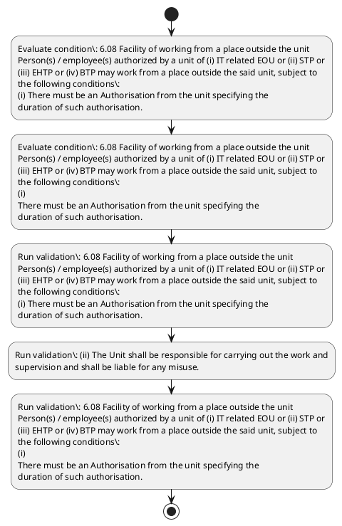

# Chapter 6 / Section 6.08: Facility of working from a place outside the unit

**Chapter Title:** Export Oriented Units (EOUs), Electronics Hardware Technology Parks (EHTPs), Software Technology Parks (STPs) and Bio-Technology

**Pages:** 8

**Purpose:** 6.08 Facility of working from a place outside the unit
Person(s) / employee(s) authorized by a unit of (i) IT related EOU or (ii) STP or
(iii) EHTP or (iv) BTP may work from a place outside the said unit, subject to
the following conditions:
(i) There must be an Authorisation from the unit specifying the
duration of such authorisation.

**Purpose Thanglish:** Indha Facility of working from a place outside the unit section-la, 6.08 Facility of working from a place outside the unit
Person(s) / employee(s) authorized by a unit of (i) IT related EOU or (ii) STP or
(iii) EHTP or (iv) BTP may work from a place outside the said unit, subject to
the following conditions:
(i) There must be an Authorisation from the unit specifying the
duration of such authorisation.

**Summary:** 6.08 Facility of working from a place outside the unit
Person(s) / employee(s) authorized by a unit of (i) IT related EOU or (ii) STP or
(iii) EHTP or (iv) BTP may work from a place outside the said unit, subject to
the following conditions:
(i) There must be an Authorisation from the unit specifying the
duration of such authorisation. (ii) The Unit shall be responsible for carrying out the work and
supervision and shall be liable for any misuse. (iii) Export of the resultant products / services would take place
only from the premises of the unit.

**Business Meaning:** Facility of working from a place outside the unit governs how DGFT business controls should be applied, validated, and enforced.

**Business Explanation:** Facility of working from a place outside the unit explains the operating rule set that DEKAI should enforce. Key control points include 6.08 Facility of working from a place outside the unit
Person(s) / employee(s) authorized by a unit of (i) IT related EOU or (ii) STP or
(iii) EHTP or (iv) BTP may work from a place outside the said unit, subject to
the following conditions:
(i) There must be an Authorisation from the unit specifying the
duration of such authorisation.

**Business Explanation Thanglish:** Indha Facility of working from a place outside the unit section-la, Facility of working from a place outside the unit explains the operating rule set that DEKAI should enforce. Key control points include 6.08 Facility of working from a place outside the unit
Person(s) / employee(s) authorized by a unit of (i) IT related EOU or (ii) STP or
(iii) EHTP or (iv) BTP may work from a place outside the said unit, subject to
the following conditions:
(i) There must be an Authorisation from the unit specifying the
duration of such authorisation.

## Business Logic
- 6.08 Facility of working from a place outside the unit
Person(s) / employee(s) authorized by a unit of (i) IT related EOU or (ii) STP or
(iii) EHTP or (iv) BTP may work from a place outside the said unit, subject to
the following conditions:
(i) There must be an Authorisation from the unit specifying the
duration of such authorisation.
- (ii) The Unit shall be responsible for carrying out the work and
supervision and shall be liable for any misuse.
- 6.08 Facility of working from a place outside the unit
Person(s) / employee(s) authorized by a unit of (i) IT related EOU or (ii) STP or
(iii) EHTP or (iv) BTP may work from a place outside the said unit, subject to
the following conditions:
(i)
There must be an Authorisation from the unit specifying the
duration of such authorisation.

## Business Rules
- rule_id=CH6-SEC6_08-R001, rule_description=6.08 Facility of working from a place outside the unit
Person(s) / employee(s) authorized by a unit of (i) IT related EOU or (ii) STP or
(iii) EHTP or (iv) BTP may work from a place outside the said unit, subject to
the following conditions:
(i) There must be an Authorisation from the unit specifying the
duration of such authorisation., trigger=Facility of working from a place outside the unit, condition=6.08 Facility of working from a place outside the unit
Person(s) / employee(s) authorized by a unit of (i) IT related EOU or (ii) STP or
(iii) EHTP or (iv) BTP may work from a place outside the said unit, subject to
the following conditions:
(i) There must be an Authorisation from the unit specifying the
duration of such authorisation., validation=6.08 Facility of working from a place outside the unit
Person(s) / employee(s) authorized by a unit of (i) IT related EOU or (ii) STP or
(iii) EHTP or (iv) BTP may work from a place outside the said unit, subject to
the following conditions:
(i) There must be an Authorisation from the unit specifying the
duration of such authorisation., action=Manual review required., exception=No explicit exception found in uploaded documents., output=DEKAI should produce a compliance decision for 6.08 - Facility of working from a place outside the unit.
- rule_id=CH6-SEC6_08-R002, rule_description=(ii) The Unit shall be responsible for carrying out the work and
supervision and shall be liable for any misuse., trigger=Facility of working from a place outside the unit, condition=6.08 Facility of working from a place outside the unit
Person(s) / employee(s) authorized by a unit of (i) IT related EOU or (ii) STP or
(iii) EHTP or (iv) BTP may work from a place outside the said unit, subject to
the following conditions:
(i)
There must be an Authorisation from the unit specifying the
duration of such authorisation., validation=(ii) The Unit shall be responsible for carrying out the work and
supervision and shall be liable for any misuse., action=Manual review required., exception=No explicit exception found in uploaded documents., output=DEKAI should produce a compliance decision for 6.08 - Facility of working from a place outside the unit.
- rule_id=CH6-SEC6_08-R003, rule_description=6.08 Facility of working from a place outside the unit
Person(s) / employee(s) authorized by a unit of (i) IT related EOU or (ii) STP or
(iii) EHTP or (iv) BTP may work from a place outside the said unit, subject to
the following conditions:
(i)
There must be an Authorisation from the unit specifying the
duration of such authorisation., trigger=Facility of working from a place outside the unit, condition=6.08 Facility of working from a place outside the unit
Person(s) / employee(s) authorized by a unit of (i) IT related EOU or (ii) STP or
(iii) EHTP or (iv) BTP may work from a place outside the said unit, subject to
the following conditions:
(i)
There must be an Authorisation from the unit specifying the
duration of such authorisation., validation=6.08 Facility of working from a place outside the unit
Person(s) / employee(s) authorized by a unit of (i) IT related EOU or (ii) STP or
(iii) EHTP or (iv) BTP may work from a place outside the said unit, subject to
the following conditions:
(i)
There must be an Authorisation from the unit specifying the
duration of such authorisation., action=Manual review required., exception=No explicit exception found in uploaded documents., output=DEKAI should produce a compliance decision for 6.08 - Facility of working from a place outside the unit.

## Conditions
- 6.08 Facility of working from a place outside the unit
Person(s) / employee(s) authorized by a unit of (i) IT related EOU or (ii) STP or
(iii) EHTP or (iv) BTP may work from a place outside the said unit, subject to
the following conditions:
(i) There must be an Authorisation from the unit specifying the
duration of such authorisation.
- 6.08 Facility of working from a place outside the unit
Person(s) / employee(s) authorized by a unit of (i) IT related EOU or (ii) STP or
(iii) EHTP or (iv) BTP may work from a place outside the said unit, subject to
the following conditions:
(i)
There must be an Authorisation from the unit specifying the
duration of such authorisation.

## Condition Logic
- id=6.6.08.1, if=6.08 Facility of working from a place outside the unit
Person(s) / employee(s) authorized by a unit of (i) IT related EOU or (ii) STP or
(iii) EHTP or (iv) BTP may work from a place outside the said unit, subject to
the following conditions:
(i) There must be an Authorisation from the unit specifying the
duration of such authorisation., then=Route for review, source=6.08 Facility of working from a place outside the unit
Person(s) / employee(s) authorized by a unit of (i) IT related EOU or (ii) STP or
(iii) EHTP or (iv) BTP may work from a place outside the said unit, subject to
the following conditions:
(i) There must be an Authorisation from the unit specifying the
duration of such authorisation.
- id=6.6.08.2, if=6.08 Facility of working from a place outside the unit
Person(s) / employee(s) authorized by a unit of (i) IT related EOU or (ii) STP or
(iii) EHTP or (iv) BTP may work from a place outside the said unit, subject to
the following conditions:
(i)
There must be an Authorisation from the unit specifying the
duration of such authorisation., then=Route for review, source=6.08 Facility of working from a place outside the unit
Person(s) / employee(s) authorized by a unit of (i) IT related EOU or (ii) STP or
(iii) EHTP or (iv) BTP may work from a place outside the said unit, subject to
the following conditions:
(i)
There must be an Authorisation from the unit specifying the
duration of such authorisation.

## Validations
- 6.08 Facility of working from a place outside the unit
Person(s) / employee(s) authorized by a unit of (i) IT related EOU or (ii) STP or
(iii) EHTP or (iv) BTP may work from a place outside the said unit, subject to
the following conditions:
(i) There must be an Authorisation from the unit specifying the
duration of such authorisation.
- (ii) The Unit shall be responsible for carrying out the work and
supervision and shall be liable for any misuse.
- 6.08 Facility of working from a place outside the unit
Person(s) / employee(s) authorized by a unit of (i) IT related EOU or (ii) STP or
(iii) EHTP or (iv) BTP may work from a place outside the said unit, subject to
the following conditions:
(i)
There must be an Authorisation from the unit specifying the
duration of such authorisation.

## Exceptions
- None identified

## Dependencies
- None identified

## Authorities
- None identified

## Required Documents
- None identified

## Timelines
- None identified

## Actions
- None identified

## Workflow
- Evaluate condition: 6.08 Facility of working from a place outside the unit
Person(s) / employee(s) authorized by a unit of (i) IT related EOU or (ii) STP or
(iii) EHTP or (iv) BTP may work from a place outside the said unit, subject to
the following conditions:
(i) There must be an Authorisation from the unit specifying the
duration of such authorisation.
- Evaluate condition: 6.08 Facility of working from a place outside the unit
Person(s) / employee(s) authorized by a unit of (i) IT related EOU or (ii) STP or
(iii) EHTP or (iv) BTP may work from a place outside the said unit, subject to
the following conditions:
(i)
There must be an Authorisation from the unit specifying the
duration of such authorisation.
- Run validation: 6.08 Facility of working from a place outside the unit
Person(s) / employee(s) authorized by a unit of (i) IT related EOU or (ii) STP or
(iii) EHTP or (iv) BTP may work from a place outside the said unit, subject to
the following conditions:
(i) There must be an Authorisation from the unit specifying the
duration of such authorisation.
- Run validation: (ii) The Unit shall be responsible for carrying out the work and
supervision and shall be liable for any misuse.
- Run validation: 6.08 Facility of working from a place outside the unit
Person(s) / employee(s) authorized by a unit of (i) IT related EOU or (ii) STP or
(iii) EHTP or (iv) BTP may work from a place outside the said unit, subject to
the following conditions:
(i)
There must be an Authorisation from the unit specifying the
duration of such authorisation.

## Workflow ASCII
```text
Facility of working from a place outside the unit
Evaluate condition: 6.08 Facility of working from a place outside the unit
Person(s) / employee(s) authorized by a unit of (i) IT related EOU or (ii) STP or
(iii) EHTP or (iv) BTP may work from a place outside the said unit, subject to
the following conditions:
(i) There must be an Authorisation from the unit specifying the
duration of such authorisation.
   |
   v
Evaluate condition: 6.08 Facility of working from a place outside the unit
Person(s) / employee(s) authorized by a unit of (i) IT related EOU or (ii) STP or
(iii) EHTP or (iv) BTP may work from a place outside the said unit, subject to
the following conditions:
(i)
There must be an Authorisation from the unit specifying the
duration of such authorisation.
   |
   v
Run validation: 6.08 Facility of working from a place outside the unit
Person(s) / employee(s) authorized by a unit of (i) IT related EOU or (ii) STP or
(iii) EHTP or (iv) BTP may work from a place outside the said unit, subject to
the following conditions:
(i) There must be an Authorisation from the unit specifying the
duration of such authorisation.
   |
   v
Run validation: (ii) The Unit shall be responsible for carrying out the work and
supervision and shall be liable for any misuse.
   |
   v
Run validation: 6.08 Facility of working from a place outside the unit
Person(s) / employee(s) authorized by a unit of (i) IT related EOU or (ii) STP or
(iii) EHTP or (iv) BTP may work from a place outside the said unit, subject to
the following conditions:
(i)
There must be an Authorisation from the unit specifying the
duration of such authorisation.
```

## Decision Tree
- IF section 6.08 applies THEN proceed with standard DGFT workflow

## Decision Tree ASCII
```text
Facility of working from a place outside the unit Decision
IF section 6.08 applies THEN proceed with standard DGFT workflow
```

## Examples
- User asks to process Facility of working from a place outside the unit; the platform checks conditions, validations, and documents before action.

**Real-world Example:** Example: an importer or exporter invokes Facility of working from a place outside the unit, submits the prescribed DGFT records, and DEKAI uses the extracted rules to follow the facility of working from a place outside the unit process.

**Real-world Example Thanglish:** Indha Facility of working from a place outside the unit section-la, Example: an importer or exporter invokes Facility of working from a place outside the unit, submits the prescribed DGFT records, and DEKAI uses the extracted rules to follow the facility of working from a place outside the unit process.

## AI Rules
- IF detected context matches section rule THEN enforce: 6.08 Facility of working from a place outside the unit
Person(s) / employee(s) authorized by a unit of (i) IT related EOU or (ii) STP or
(iii) EHTP or (iv) BTP may work from a place outside the said unit, subject to
the following conditions:
(i) There must be an Authorisation from the unit specifying the
duration of such authorisation.
- IF detected context matches section rule THEN enforce: (ii) The Unit shall be responsible for carrying out the work and
supervision and shall be liable for any misuse.
- IF detected context matches section rule THEN enforce: 6.08 Facility of working from a place outside the unit
Person(s) / employee(s) authorized by a unit of (i) IT related EOU or (ii) STP or
(iii) EHTP or (iv) BTP may work from a place outside the said unit, subject to
the following conditions:
(i)
There must be an Authorisation from the unit specifying the
duration of such authorisation.

## Database Fields
- name=section_code, type=string, required=True, source=parsed_section_heading
- name=section_title, type=string, required=True, source=parsed_section_heading
- name=the_flag, type=boolean, required=False, source=keyword:the
- name=eou_flag, type=boolean, required=False, source=keyword:EOU
- name=stp_flag, type=boolean, required=False, source=keyword:STP
- name=iii_flag, type=boolean, required=False, source=keyword:iii
- name=btp_flag, type=boolean, required=False, source=keyword:BTP
- name=may_flag, type=boolean, required=False, source=keyword:may
- name=for_flag, type=boolean, required=False, source=keyword:for
- name=out_flag, type=boolean, required=False, source=keyword:out

## API Requirements
- method=GET, path=/api/dgft/sections/6.08, purpose=Retrieve knowledge payload for section 6.08, query_params=['include=workflow,decision_tree,validations'], response_fields=['section', 'title', 'summary', 'conditions', 'validations', 'exceptions', 'workflow', 'decision_tree']
- method=POST, path=/api/dgft/Facility-of-working-from-a-place-outside-the-unit/validate, purpose=Validate inputs and documents for Facility of working from a place outside the unit, request_fields=['section_code', 'section_title'], response_fields=['status', 'errors', 'warnings', 'next_actions']

## UI Screens
- screen_id=Facility_of_working_from_a_place_outside_the_unit_overview, name=Facility of working from a place outside the unit Overview, purpose=Show section summary, authority, timeline, and eligibility cues., widgets=['summary_card', 'conditions_table', 'authority_badges', 'timeline_panel']
- screen_id=Facility_of_working_from_a_place_outside_the_unit_submission, name=Facility of working from a place outside the unit Submission, purpose=Capture applicant data and supporting documents., widgets=['dynamic_form', 'document_uploader', 'validation_panel', 'next_action_footer'], fields=['section_code', 'section_title', 'the_flag', 'eou_flag', 'stp_flag', 'iii_flag', 'btp_flag', 'may_flag']

## Error Messages
- Validation failed because the section requirements were not fully met.

## FAQ
- question_en=What is the purpose of section 6.08?, answer_en=Facility of working from a place outside the unit explains the operating rule set that DEKAI should enforce. Key control points include 6.08 Facility of working from a place outside the unit
Person(s) / employee(s) authorized by a unit of (i) IT related EOU or (ii) STP or
(iii) EHTP or (iv) BTP may work from a place outside the said unit, subject to
the following conditions:
(i) There must be an Authorisation from the unit specifying the
duration of such authorisation., question_thanglish=Indha Facility of working from a place outside the unit section-la, What is the purpose of section 6.08?, answer_thanglish=Indha Facility of working from a place outside the unit section-la, Facility of working from a place outside the unit explains the operating rule set that DEKAI should enforce. Key control points include 6.08 Facility of working from a place outside the unit
Person(s) / employee(s) authorized by a unit of (i) IT related EOU or (ii) STP or
(iii) EHTP or (iv) BTP may work from a place outside the said unit, subject to
the following conditions:
(i) There must be an Authorisation from the unit specifying the
duration of such authorisation.
- question_en=What documents are required under Facility of working from a place outside the unit?, answer_en=Not explicitly covered in uploaded documents., question_thanglish=Indha Facility of working from a place outside the unit section-la, What documents are required under Facility of working from a place outside the unit?, answer_thanglish=Indha Facility of working from a place outside the unit section-la, Not explicitly covered in uploaded documents.
- question_en=Which authority handles Facility of working from a place outside the unit?, answer_en=Not explicitly covered in uploaded documents., question_thanglish=Indha Facility of working from a place outside the unit section-la, Which authority handles Facility of working from a place outside the unit?, answer_thanglish=Indha Facility of working from a place outside the unit section-la, Not explicitly covered in uploaded documents.

## Questions Users May Ask
- What does Facility of working from a place outside the unit require?
- Which documents are needed for Facility of working from a place outside the unit?
- How does DEKAI validate Facility of working from a place outside the unit requests?

## Expected AI Answers
- Facility of working from a place outside the unit requires the platform to interpret the section text, apply the extracted business rules, and present the correct next action.
- Required documents are inferred from the section text: no explicit documents were detected.
- DEKAI validates Facility of working from a place outside the unit by checking conditions, required documents, authority references, and exception clauses before recommending an outcome.

## AI Q&A Examples
- question_en=User asks: How do I comply with Facility of working from a place outside the unit?, answer_en=AI answers: DEKAI should evaluate section 6.08, apply the extracted rules, and guide the user through Evaluate condition: 6.08 Facility of working from a place outside the unit
Person(s) / employee(s) authorized by a unit of (i) IT related EOU or (ii) STP or
(iii) EHTP or (iv) BTP may work from a place outside the said unit, subject to
the following conditions:
(i) There must be an Authorisation from the unit specifying the
duration of such authorisation.., question_thanglish=Indha Facility of working from a place outside the unit section-la, User asks: How do I comply with Facility of working from a place outside the unit?, answer_thanglish=Indha Facility of working from a place outside the unit section-la, AI answers: DEKAI should evaluate section 6.08, apply the extracted rules, and guide the user through Evaluate condition: 6.08 Facility of working from a place outside the unit
Person(s) / employee(s) authorized by a unit of (i) IT related EOU or (ii) STP or
(iii) EHTP or (iv) BTP may work from a place outside the said unit, subject to
the following conditions:
(i) There must be an Authorisation from the unit specifying the
duration of such authorisation..
- question_en=User asks: Which validations apply to Facility of working from a place outside the unit?, answer_en=AI answers: Applicable validations are 6.08 Facility of working from a place outside the unit
Person(s) / employee(s) authorized by a unit of (i) IT related EOU or (ii) STP or
(iii) EHTP or (iv) BTP may work from a place outside the said unit, subject to
the following conditions:
(i) There must be an Authorisation from the unit specifying the
duration of such authorisation., (ii) The Unit shall be responsible for carrying out the work and
supervision and shall be liable for any misuse., 6.08 Facility of working from a place outside the unit
Person(s) / employee(s) authorized by a unit of (i) IT related EOU or (ii) STP or
(iii) EHTP or (iv) BTP may work from a place outside the said unit, subject to
the following conditions:
(i)
There must be an Authorisation from the unit specifying the
duration of such authorisation., question_thanglish=Indha Facility of working from a place outside the unit section-la, User asks: Which validations apply to Facility of working from a place outside the unit?, answer_thanglish=Indha Facility of working from a place outside the unit section-la, AI answers: Applicable validations are 6.08 Facility of working from a place outside the unit
Person(s) / employee(s) authorized by a unit of (i) IT related EOU or (ii) STP or
(iii) EHTP or (iv) BTP may work from a place outside the said unit, subject to
the following conditions:
(i) There must be an Authorisation from the unit specifying the
duration of such authorisation., (ii) The Unit kandippa be responsible for carrying out the work and
supervision and kandippa be liable for any misuse., 6.08 Facility of working from a place outside the unit
Person(s) / employee(s) authorized by a unit of (i) IT related EOU or (ii) STP or
(iii) EHTP or (iv) BTP may work from a place outside the said unit, subject to
the following conditions:
(i)
There must be an Authorisation from the unit specifying the
duration of such authorisation.

## DEKAI AI Implementation Notes
- Capture chapter 6, section 6.08, title, and page references as immutable knowledge metadata.
- Bind validations for Facility of working from a place outside the unit into a rule engine keyed by the rule IDs extracted for this section.

## DEKAI AI Implementation Notes Thanglish
- Indha Facility of working from a place outside the unit section-la, Capture chapter 6, section 6.08, title, and page references as immutable knowledge metadata.
- Indha Facility of working from a place outside the unit section-la, Bind validations for Facility of working from a place outside the unit into a rule engine keyed by the rule IDs extracted for this section.

## AI Metadata
- Keywords: the, EOU, STP, iii, BTP, may, for, out, and, any, from, unit, EHTP, work, said, must, such, take, only, place
- Search Keywords: the, EOU, STP, iii, BTP, may, for, out, and, any, from, unit, EHTP, work, said, must, such, take, only, place
- Intent: Provide knowledge guidance for Facility of working from a place outside the unit.
- Tags: 6.08, Facility of working from a place outside the unit, business-rule, dgft
- Related Sections: 
- Related Chapters: 
- Related Rules: 6.08 Facility of working from a place outside the unit
Person(s) / employee(s) authorized by a unit of (i) IT related EOU or (ii) STP or
(iii) EHTP or (iv) BTP may work from a place outside the said unit, subject to
the following conditions:
(i) There must be an Authorisation from the unit specifying the
duration of such authorisation., (ii) The Unit shall be responsible for carrying out the work and
supervision and shall be liable for any misuse., 6.08 Facility of working from a place outside the unit
Person(s) / employee(s) authorized by a unit of (i) IT related EOU or (ii) STP or
(iii) EHTP or (iv) BTP may work from a place outside the said unit, subject to
the following conditions:
(i)
There must be an Authorisation from the unit specifying the
duration of such authorisation.

## Mermaid

```mermaid
flowchart TD
    S1["Evaluate condition: 6.08 Facility of working from a place outside the unit
Person(s) / employee(s) authorized by a unit of (i) IT related EOU or (ii) STP or
(iii) EHTP or (iv) BTP may work from a place outside the said unit, subject to
the following conditions:
(i) There must be an Authorisation from the unit specifying the
duration of such authorisation."]
    S2["Evaluate condition: 6.08 Facility of working from a place outside the unit
Person(s) / employee(s) authorized by a unit of (i) IT related EOU or (ii) STP or
(iii) EHTP or (iv) BTP may work from a place outside the said unit, subject to
the following conditions:
(i)
There must be an Authorisation from the unit specifying the
duration of such authorisation."]
    S1 --> S2
    S3["Run validation: 6.08 Facility of working from a place outside the unit
Person(s) / employee(s) authorized by a unit of (i) IT related EOU or (ii) STP or
(iii) EHTP or (iv) BTP may work from a place outside the said unit, subject to
the following conditions:
(i) There must be an Authorisation from the unit specifying the
duration of such authorisation."]
    S2 --> S3
    S4["Run validation: (ii) The Unit shall be responsible for carrying out the work and
supervision and shall be liable for any misuse."]
    S3 --> S4
    S5["Run validation: 6.08 Facility of working from a place outside the unit
Person(s) / employee(s) authorized by a unit of (i) IT related EOU or (ii) STP or
(iii) EHTP or (iv) BTP may work from a place outside the said unit, subject to
the following conditions:
(i)
There must be an Authorisation from the unit specifying the
duration of such authorisation."]
    S4 --> S5
```


## PlantUML

