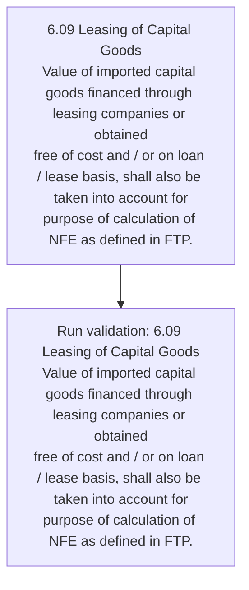
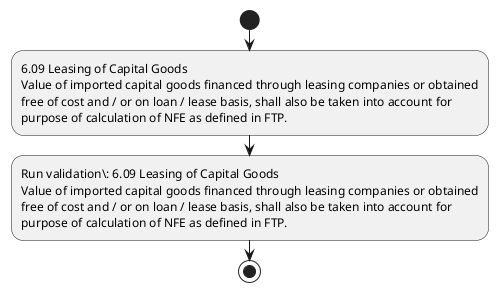

# Chapter 6 / Section 6.09: Leasing of Capital Goods

**Chapter Title:** Export Oriented Units (EOUs), Electronics Hardware Technology Parks (EHTPs), Software Technology Parks (STPs) and Bio-Technology

**Pages:** 8

**Purpose:** 6.09 Leasing of Capital Goods
Value of imported capital goods financed through leasing companies or obtained
free of cost and / or on loan / lease basis, shall also be taken into account for
purpose of calculation of NFE as defined in FTP.

**Purpose Thanglish:** Indha Leasing of Capital Goods section-la, 6.09 Leasing of Capital Goods
Value of imported capital goods financed through leasing companies or obtained
free of cost and / or on loan / lease basis, kandippa also be taken into account for
purpose of calculation of NFE as defined in FTP.

**Summary:** 6.09 Leasing of Capital Goods
Value of imported capital goods financed through leasing companies or obtained
free of cost and / or on loan / lease basis, shall also be taken into account for
purpose of calculation of NFE as defined in FTP.

**Business Meaning:** Leasing of Capital Goods governs how DGFT business controls should be applied, validated, and enforced.

**Business Explanation:** Leasing of Capital Goods explains the operating rule set that DEKAI should enforce. Key control points include 6.09 Leasing of Capital Goods
Value of imported capital goods financed through leasing companies or obtained
free of cost and / or on loan / lease basis, shall also be taken into account for
purpose of calculation of NFE as defined in FTP. The section also drives actions such as 6.09 Leasing of Capital Goods
Value of imported capital goods financed through leasing companies or obtained
free of cost and / or on loan / lease basis, shall also be taken into account for
purpose of calculation of NFE as defined in FTP..

**Business Explanation Thanglish:** Indha Leasing of Capital Goods section-la, Leasing of Capital Goods explains the operating rule set that DEKAI should enforce. Key control points include 6.09 Leasing of Capital Goods
Value of imported capital goods financed through leasing companies or obtained
free of cost and / or on loan / lease basis, kandippa also be taken into account for
purpose of calculation of NFE as defined in FTP. The section also drives actions such as 6.09 Leasing of Capital Goods
Value of imported capital goods financed through leasing companies or obtained
free of cost and / or on loan / lease basis, kandippa also be taken into account for
purpose of calculation of NFE as defined in FTP..

## Business Logic
- 6.09 Leasing of Capital Goods
Value of imported capital goods financed through leasing companies or obtained
free of cost and / or on loan / lease basis, shall also be taken into account for
purpose of calculation of NFE as defined in FTP.

## Business Rules
- rule_id=CH6-SEC6_09-R001, rule_description=6.09 Leasing of Capital Goods
Value of imported capital goods financed through leasing companies or obtained
free of cost and / or on loan / lease basis, shall also be taken into account for
purpose of calculation of NFE as defined in FTP., trigger=Leasing of Capital Goods, condition=Section 6.09 is applicable, validation=6.09 Leasing of Capital Goods
Value of imported capital goods financed through leasing companies or obtained
free of cost and / or on loan / lease basis, shall also be taken into account for
purpose of calculation of NFE as defined in FTP., action=6.09 Leasing of Capital Goods
Value of imported capital goods financed through leasing companies or obtained
free of cost and / or on loan / lease basis, shall also be taken into account for
purpose of calculation of NFE as defined in FTP., exception=No explicit exception found in uploaded documents., output=DEKAI should produce a compliance decision for 6.09 - Leasing of Capital Goods.

## Conditions
- None identified

## Condition Logic
- id=6.6.09.1, if=Section 6.09 is applicable, then=6.09 Leasing of Capital Goods
Value of imported capital goods financed through leasing companies or obtained
free of cost and / or on loan / lease basis, shall also be taken into account for
purpose of calculation of NFE as defined in FTP., source=Derived from uploaded documents

## Validations
- 6.09 Leasing of Capital Goods
Value of imported capital goods financed through leasing companies or obtained
free of cost and / or on loan / lease basis, shall also be taken into account for
purpose of calculation of NFE as defined in FTP.

## Exceptions
- None identified

## Dependencies
- None identified

## Authorities
- None identified

## Required Documents
- None identified

## Timelines
- None identified

## Actions
- 6.09 Leasing of Capital Goods
Value of imported capital goods financed through leasing companies or obtained
free of cost and / or on loan / lease basis, shall also be taken into account for
purpose of calculation of NFE as defined in FTP.

## Workflow
- 6.09 Leasing of Capital Goods
Value of imported capital goods financed through leasing companies or obtained
free of cost and / or on loan / lease basis, shall also be taken into account for
purpose of calculation of NFE as defined in FTP.
- Run validation: 6.09 Leasing of Capital Goods
Value of imported capital goods financed through leasing companies or obtained
free of cost and / or on loan / lease basis, shall also be taken into account for
purpose of calculation of NFE as defined in FTP.

## Workflow ASCII
```text
Leasing of Capital Goods
6.09 Leasing of Capital Goods
Value of imported capital goods financed through leasing companies or obtained
free of cost and / or on loan / lease basis, shall also be taken into account for
purpose of calculation of NFE as defined in FTP.
   |
   v
Run validation: 6.09 Leasing of Capital Goods
Value of imported capital goods financed through leasing companies or obtained
free of cost and / or on loan / lease basis, shall also be taken into account for
purpose of calculation of NFE as defined in FTP.
```

## Decision Tree
- IF section 6.09 applies THEN 6.09 Leasing of Capital Goods
Value of imported capital goods financed through leasing companies or obtained
free of cost and / or on loan / lease basis, shall also be taken into account for
purpose of calculation of NFE as defined in FTP.

## Decision Tree ASCII
```text
Leasing of Capital Goods Decision
IF section 6.09 applies THEN 6.09 Leasing of Capital Goods
Value of imported capital goods financed through leasing companies or obtained
free of cost and / or on loan / lease basis, shall also be taken into account for
purpose of calculation of NFE as defined in FTP.
```

## Examples
- User asks to process Leasing of Capital Goods; the platform checks conditions, validations, and documents before action.

**Real-world Example:** Example: an importer or exporter invokes Leasing of Capital Goods, submits the prescribed DGFT records, and DEKAI uses the extracted rules to 6.09 leasing of capital goods
value of imported capital goods financed through leasing companies or obtained
free of cost and / or on loan / lease basis, shall also be taken into account for
purpose of calculation of nfe as defined in ftp..

**Real-world Example Thanglish:** Indha Leasing of Capital Goods section-la, Example: an importer or exporter invokes Leasing of Capital Goods, submits the prescribed DGFT records, and DEKAI uses the extracted rules to 6.09 leasing of capital goods
value of imported capital goods financed through leasing companies or obtained
free of cost and / or on loan / lease basis, kandippa also be taken into account for
purpose of calculation of nfe as defined in ftp..

## AI Rules
- IF detected context matches section rule THEN enforce: 6.09 Leasing of Capital Goods
Value of imported capital goods financed through leasing companies or obtained
free of cost and / or on loan / lease basis, shall also be taken into account for
purpose of calculation of NFE as defined in FTP.
- IF validations pass THEN recommend action: 6.09 Leasing of Capital Goods
Value of imported capital goods financed through leasing companies or obtained
free of cost and / or on loan / lease basis, shall also be taken into account for
purpose of calculation of NFE as defined in FTP.

## Database Fields
- name=section_code, type=string, required=True, source=parsed_section_heading
- name=section_title, type=string, required=True, source=parsed_section_heading
- name=and_flag, type=boolean, required=False, source=keyword:and
- name=for_flag, type=boolean, required=False, source=keyword:for
- name=nfe_flag, type=boolean, required=False, source=keyword:NFE
- name=ftp_flag, type=boolean, required=False, source=keyword:FTP
- name=free_flag, type=boolean, required=False, source=keyword:free
- name=cost_flag, type=boolean, required=False, source=keyword:cost
- name=loan_flag, type=boolean, required=False, source=keyword:loan
- name=also_flag, type=boolean, required=False, source=keyword:also

## API Requirements
- method=GET, path=/api/dgft/sections/6.09, purpose=Retrieve knowledge payload for section 6.09, query_params=['include=workflow,decision_tree,validations'], response_fields=['section', 'title', 'summary', 'conditions', 'validations', 'exceptions', 'workflow', 'decision_tree']
- method=POST, path=/api/dgft/Leasing-of-Capital-Goods/validate, purpose=Validate inputs and documents for Leasing of Capital Goods, request_fields=['section_code', 'section_title'], response_fields=['status', 'errors', 'warnings', 'next_actions']
- method=POST, path=/api/dgft/Leasing-of-Capital-Goods/execute, purpose=Trigger business action for 6.09 Leasing of Capital Goods
Value of imported capital goods financed through leasing companies or obtained
free of cost and / or on loan / lease basis, shall also be taken into account for
purpose of calculation of NFE as defined in FTP., request_fields=['section_code', 'section_title'], response_fields=['reference_id', 'status', 'authority', 'timeline']

## UI Screens
- screen_id=Leasing_of_Capital_Goods_overview, name=Leasing of Capital Goods Overview, purpose=Show section summary, authority, timeline, and eligibility cues., widgets=['summary_card', 'conditions_table', 'authority_badges', 'timeline_panel']
- screen_id=Leasing_of_Capital_Goods_submission, name=Leasing of Capital Goods Submission, purpose=Capture applicant data and supporting documents., widgets=['dynamic_form', 'document_uploader', 'validation_panel', 'next_action_footer'], fields=['section_code', 'section_title', 'and_flag', 'for_flag', 'nfe_flag', 'ftp_flag', 'free_flag', 'cost_flag']

## Error Messages
- Validation failed because the section requirements were not fully met.

## FAQ
- question_en=What is the purpose of section 6.09?, answer_en=Leasing of Capital Goods explains the operating rule set that DEKAI should enforce. Key control points include 6.09 Leasing of Capital Goods
Value of imported capital goods financed through leasing companies or obtained
free of cost and / or on loan / lease basis, shall also be taken into account for
purpose of calculation of NFE as defined in FTP. The section also drives actions such as 6.09 Leasing of Capital Goods
Value of imported capital goods financed through leasing companies or obtained
free of cost and / or on loan / lease basis, shall also be taken into account for
purpose of calculation of NFE as defined in FTP.., question_thanglish=Indha Leasing of Capital Goods section-la, What is the purpose of section 6.09?, answer_thanglish=Indha Leasing of Capital Goods section-la, Leasing of Capital Goods explains the operating rule set that DEKAI should enforce. Key control points include 6.09 Leasing of Capital Goods
Value of imported capital goods financed through leasing companies or obtained
free of cost and / or on loan / lease basis, kandippa also be taken into account for
purpose of calculation of NFE as defined in FTP. The section also drives actions such as 6.09 Leasing of Capital Goods
Value of imported capital goods financed through leasing companies or obtained
free of cost and / or on loan / lease basis, kandippa also be taken into account for
purpose of calculation of NFE as defined in FTP..
- question_en=What documents are required under Leasing of Capital Goods?, answer_en=Not explicitly covered in uploaded documents., question_thanglish=Indha Leasing of Capital Goods section-la, What documents are required under Leasing of Capital Goods?, answer_thanglish=Indha Leasing of Capital Goods section-la, Not explicitly covered in uploaded documents.
- question_en=Which authority handles Leasing of Capital Goods?, answer_en=Not explicitly covered in uploaded documents., question_thanglish=Indha Leasing of Capital Goods section-la, Which authority handles Leasing of Capital Goods?, answer_thanglish=Indha Leasing of Capital Goods section-la, Not explicitly covered in uploaded documents.

## Questions Users May Ask
- What does Leasing of Capital Goods require?
- Which documents are needed for Leasing of Capital Goods?
- How does DEKAI validate Leasing of Capital Goods requests?
- What action should be taken for Leasing of Capital Goods?

## Expected AI Answers
- Leasing of Capital Goods requires the platform to interpret the section text, apply the extracted business rules, and present the correct next action.
- Required documents are inferred from the section text: no explicit documents were detected.
- DEKAI validates Leasing of Capital Goods by checking conditions, required documents, authority references, and exception clauses before recommending an outcome.
- The primary extracted action is: 6.09 Leasing of Capital Goods
Value of imported capital goods financed through leasing companies or obtained
free of cost and / or on loan / lease basis, shall also be taken into account for
purpose of calculation of NFE as defined in FTP.

## AI Q&A Examples
- question_en=User asks: How do I comply with Leasing of Capital Goods?, answer_en=AI answers: DEKAI should evaluate section 6.09, apply the extracted rules, and guide the user through 6.09 Leasing of Capital Goods
Value of imported capital goods financed through leasing companies or obtained
free of cost and / or on loan / lease basis, shall also be taken into account for
purpose of calculation of NFE as defined in FTP.., question_thanglish=Indha Leasing of Capital Goods section-la, User asks: How do I comply with Leasing of Capital Goods?, answer_thanglish=Indha Leasing of Capital Goods section-la, AI answers: DEKAI should evaluate section 6.09, apply the extracted rules, and guide the user through 6.09 Leasing of Capital Goods
Value of imported capital goods financed through leasing companies or obtained
free of cost and / or on loan / lease basis, kandippa also be taken into account for
purpose of calculation of NFE as defined in FTP..
- question_en=User asks: Which validations apply to Leasing of Capital Goods?, answer_en=AI answers: Applicable validations are 6.09 Leasing of Capital Goods
Value of imported capital goods financed through leasing companies or obtained
free of cost and / or on loan / lease basis, shall also be taken into account for
purpose of calculation of NFE as defined in FTP., question_thanglish=Indha Leasing of Capital Goods section-la, User asks: Which validations apply to Leasing of Capital Goods?, answer_thanglish=Indha Leasing of Capital Goods section-la, AI answers: Applicable validations are 6.09 Leasing of Capital Goods
Value of imported capital goods financed through leasing companies or obtained
free of cost and / or on loan / lease basis, kandippa also be taken into account for
purpose of calculation of NFE as defined in FTP.

## DEKAI AI Implementation Notes
- Capture chapter 6, section 6.09, title, and page references as immutable knowledge metadata.
- Bind validations for Leasing of Capital Goods into a rule engine keyed by the rule IDs extracted for this section.

## DEKAI AI Implementation Notes Thanglish
- Indha Leasing of Capital Goods section-la, Capture chapter 6, section 6.09, title, and page references as immutable knowledge metadata.
- Indha Leasing of Capital Goods section-la, Bind validations for Leasing of Capital Goods into a rule engine keyed by the rule IDs extracted for this section.

## AI Metadata
- Keywords: and, for, NFE, FTP, free, cost, loan, also, into, Goods, Value, lease, basis, shall, taken, Leasing, Capital, through, account, purpose
- Search Keywords: and, for, NFE, FTP, free, cost, loan, also, into, Goods, Value, lease, basis, shall, taken, Leasing, Capital, through, account, purpose
- Intent: Support Leasing of Capital Goods processing and compliance validation.
- Tags: 6.09, Leasing of Capital Goods, business-rule, dgft
- Related Sections: 
- Related Chapters: 
- Related Rules: 6.09 Leasing of Capital Goods
Value of imported capital goods financed through leasing companies or obtained
free of cost and / or on loan / lease basis, shall also be taken into account for
purpose of calculation of NFE as defined in FTP.

## Mermaid


## PlantUML

