# Chapter 6 / Section 6.10: Net Foreign Exchange (NFE) Earnings

**Chapter Title:** Export Oriented Units (EOUs), Electronics Hardware Technology Parks (EHTPs), Software Technology Parks (STPs) and Bio-Technology

**Pages:** 8, 9

**Purpose:** 6.10 Net Foreign Exchange (NFE) Earnings
(a) EOU / EHTP / STP / BTP unit shall be a positive net foreign
exchange earner.

**Purpose Thanglish:** Indha Net Foreign Exchange (NFE) Earnings section-la, 6.10 Net Foreign Exchange (NFE) Earnings
(a) EOU / EHTP / STP / BTP unit kandippa be a positive net foreign
exchange earner.

**Summary:** 6.10 Net Foreign Exchange (NFE) Earnings
(a) EOU / EHTP / STP / BTP unit shall be a positive net foreign
exchange earner. NFE earnings shall be calculated cumulatively in
the block period as per Paragraph 6.04 of FTP, according to the
formula given below. Items of manufacture for export specified in
Lo P / Lo I alone shall be taken into account for calculation of NFE.

**Business Meaning:** Net Foreign Exchange (NFE) Earnings governs how DGFT business controls should be applied, validated, and enforced.

**Business Explanation:** Net Foreign Exchange (NFE) Earnings explains the operating rule set that DEKAI should enforce. Key control points include 6.10 Net Foreign Exchange (NFE) Earnings
(a) EOU / EHTP / STP / BTP unit shall be a positive net foreign
exchange earner. The section also drives actions such as Positive NFE = A-B>0 Where,
“NFE” is Net Foreign Exchange;
“A” is FOB value of exports by EOU / EHTP / STP / BTP unit and
other supplies under para 6.08 of FTP;
“B” is sum total of CIF value of all imported inputs and CIF value of
all imported capital goods, and value of all payments made in foreign
exchange by way of commission, royalty, fees, dividends, interest on
external borrowings / high sea sales during first five year period or
any other charges..

**Business Explanation Thanglish:** Indha Net Foreign Exchange (NFE) Earnings section-la, Net Foreign Exchange (NFE) Earnings explains the operating rule set that DEKAI should enforce. Key control points include 6.10 Net Foreign Exchange (NFE) Earnings
(a) EOU / EHTP / STP / BTP unit kandippa be a positive net foreign
exchange earner. The section also drives actions such as Positive NFE = A-B>0 Where,
“NFE” is Net Foreign Exchange;
“A” is FOB value of exports by EOU / EHTP / STP / BTP unit and
other supplies under para 6.08 of FTP;
“B” is sum total of CIF value of all imported inputs and CIF value of
all imported capital goods, and value of all payments made in foreign
exchange by way of commission, royalty, fees, dividends, interest on
external borrowings / high sea sales during first five year period or
any other charges..

## Business Logic
- 6.10 Net Foreign Exchange (NFE) Earnings
(a) EOU / EHTP / STP / BTP unit shall be a positive net foreign
exchange earner.
- NFE earnings shall be calculated cumulatively in
the block period as per Paragraph 6.04 of FTP, according to the
formula given below.
- Items of manufacture for export specified in
Lo P / Lo I alone shall be taken into account for calculation of NFE.
- 140
6.10 Net Foreign Exchange (NFE) Earnings
(a)
EOU / EHTP / STP / BTP unit shall be a positive net foreign
exchange earner.
- (b) If any goods are obtained from another EOU / EHTP / STP / BTP /
SEZ unit, or procured from an international exhibition held in India,
or bonded warehouses or precious metals procured from
nominated agencies, value of such goods shall be included under
“B”.
- (c) If any capital goods are imported duty and/or tax free or leased
from a leasing company, received free of cost and / or on loan basis
or transfer, CIF value of capital goods shall be included pro- rata,
under “B” for period it remains with units.
- (d) For annual calculation of NFE, value of imported capital goods and
lump sum payment of foreign technical know-how fee shall be
amortized as under: 1st– 10th year: 10%.
- For
existing units, proportionate Customs and excise duty must be paid
where NFE is less than depreciation already claimed, before exit.

## Business Rules
- rule_id=CH6-SEC6_10-R001, rule_description=6.10 Net Foreign Exchange (NFE) Earnings
(a) EOU / EHTP / STP / BTP unit shall be a positive net foreign
exchange earner., trigger=Net Foreign Exchange (NFE) Earnings, condition=Items of manufacture for export specified in
Lo P / Lo I alone shall be taken into account for calculation of NFE., validation=6.10 Net Foreign Exchange (NFE) Earnings
(a) EOU / EHTP / STP / BTP unit shall be a positive net foreign
exchange earner., action=Positive NFE = A-B>0 Where,
“NFE” is Net Foreign Exchange;
“A” is FOB value of exports by EOU / EHTP / STP / BTP unit and
other supplies under para 6.08 of FTP;
“B” is sum total of CIF value of all imported inputs and CIF value of
all imported capital goods, and value of all payments made in foreign
exchange by way of commission, royalty, fees, dividends, interest on
external borrowings / high sea sales during first five year period or
any other charges., exception=Provided that above
amortization rates would be applicable only if an undertaking is
given by a unit that it will not exit to DTA in the first 10 years., output=DEKAI should produce a compliance decision for 6.10 - Net Foreign Exchange (NFE) Earnings.
- rule_id=CH6-SEC6_10-R002, rule_description=NFE earnings shall be calculated cumulatively in
the block period as per Paragraph 6.04 of FTP, according to the
formula given below., trigger=Net Foreign Exchange (NFE) Earnings, condition=Positive NFE = A-B>0 Where,
“NFE” is Net Foreign Exchange;
“A” is FOB value of exports by EOU / EHTP / STP / BTP unit and
other supplies under para 6.08 of FTP;
“B” is sum total of CIF value of all imported inputs and CIF value of
all imported capital goods, and value of all payments made in foreign
exchange by way of commission, royalty, fees, dividends, interest on
external borrowings / high sea sales during first five year period or
any other charges., validation=NFE earnings shall be calculated cumulatively in
the block period as per Paragraph 6.04 of FTP, according to the
formula given below., action=It will also include payment made in Indian
Rupees on high sea sales; and
“Inputs” mean raw materials, intermediates, components,
pg., exception=Provided that above
amortization rates would be applicable only if an undertaking is
given by a unit that it will not exit to DTA in the first 10 years., output=DEKAI should produce a compliance decision for 6.10 - Net Foreign Exchange (NFE) Earnings.
- rule_id=CH6-SEC6_10-R003, rule_description=Items of manufacture for export specified in
Lo P / Lo I alone shall be taken into account for calculation of NFE., trigger=Net Foreign Exchange (NFE) Earnings, condition=(b) If any goods are obtained from another EOU / EHTP / STP / BTP /
SEZ unit, or procured from an international exhibition held in India,
or bonded warehouses or precious metals procured from
nominated agencies, value of such goods shall be included under
“B”., validation=Items of manufacture for export specified in
Lo P / Lo I alone shall be taken into account for calculation of NFE., action=It will also include payment made in Indian
Rupees on high sea sales; and
“Inputs” mean raw materials, intermediates, components,
consumables, parts and packing materials., exception=Provided that above
amortization rates would be applicable only if an undertaking is
given by a unit that it will not exit to DTA in the first 10 years., output=DEKAI should produce a compliance decision for 6.10 - Net Foreign Exchange (NFE) Earnings.
- rule_id=CH6-SEC6_10-R004, rule_description=140
6.10 Net Foreign Exchange (NFE) Earnings
(a)
EOU / EHTP / STP / BTP unit shall be a positive net foreign
exchange earner., trigger=Net Foreign Exchange (NFE) Earnings, condition=(c) If any capital goods are imported duty and/or tax free or leased
from a leasing company, received free of cost and / or on loan basis
or transfer, CIF value of capital goods shall be included pro- rata,
under “B” for period it remains with units., validation=140
6.10 Net Foreign Exchange (NFE) Earnings
(a)
EOU / EHTP / STP / BTP unit shall be a positive net foreign
exchange earner., action=(b) If any goods are obtained from another EOU / EHTP / STP / BTP /
SEZ unit, or procured from an international exhibition held in India,
or bonded warehouses or precious metals procured from
nominated agencies, value of such goods shall be included under
“B”., exception=Provided that above
amortization rates would be applicable only if an undertaking is
given by a unit that it will not exit to DTA in the first 10 years., output=DEKAI should produce a compliance decision for 6.10 - Net Foreign Exchange (NFE) Earnings.
- rule_id=CH6-SEC6_10-R005, rule_description=(b) If any goods are obtained from another EOU / EHTP / STP / BTP /
SEZ unit, or procured from an international exhibition held in India,
or bonded warehouses or precious metals procured from
nominated agencies, value of such goods shall be included under
“B”., trigger=Net Foreign Exchange (NFE) Earnings, condition=Provided that above
amortization rates would be applicable only if an undertaking is
given by a unit that it will not exit to DTA in the first 10 years., validation=(b) If any goods are obtained from another EOU / EHTP / STP / BTP /
SEZ unit, or procured from an international exhibition held in India,
or bonded warehouses or precious metals procured from
nominated agencies, value of such goods shall be included under
“B”., action=(d) For annual calculation of NFE, value of imported capital goods and
lump sum payment of foreign technical know-how fee shall be
amortized as under: 1st– 10th year: 10%., exception=Provided that above
amortization rates would be applicable only if an undertaking is
given by a unit that it will not exit to DTA in the first 10 years., output=DEKAI should produce a compliance decision for 6.10 - Net Foreign Exchange (NFE) Earnings.
- rule_id=CH6-SEC6_10-R006, rule_description=(c) If any capital goods are imported duty and/or tax free or leased
from a leasing company, received free of cost and / or on loan basis
or transfer, CIF value of capital goods shall be included pro- rata,
under “B” for period it remains with units., trigger=Net Foreign Exchange (NFE) Earnings, condition=For
existing units, proportionate Customs and excise duty must be paid
where NFE is less than depreciation already claimed, before exit., validation=(c) If any capital goods are imported duty and/or tax free or leased
from a leasing company, received free of cost and / or on loan basis
or transfer, CIF value of capital goods shall be included pro- rata,
under “B” for period it remains with units., action=(d) For annual calculation of NFE, value of imported capital goods and
lump sum payment of foreign technical know-how fee shall be
amortized as under: 1st– 10th year: 10%., exception=Provided that above
amortization rates would be applicable only if an undertaking is
given by a unit that it will not exit to DTA in the first 10 years., output=DEKAI should produce a compliance decision for 6.10 - Net Foreign Exchange (NFE) Earnings.
- rule_id=CH6-SEC6_10-R007, rule_description=(d) For annual calculation of NFE, value of imported capital goods and
lump sum payment of foreign technical know-how fee shall be
amortized as under: 1st– 10th year: 10%., trigger=Net Foreign Exchange (NFE) Earnings, condition=For
existing units, proportionate Customs and excise duty must be paid
where NFE is less than depreciation already claimed, before exit., validation=(d) For annual calculation of NFE, value of imported capital goods and
lump sum payment of foreign technical know-how fee shall be
amortized as under: 1st– 10th year: 10%., action=(d) For annual calculation of NFE, value of imported capital goods and
lump sum payment of foreign technical know-how fee shall be
amortized as under: 1st– 10th year: 10%., exception=Provided that above
amortization rates would be applicable only if an undertaking is
given by a unit that it will not exit to DTA in the first 10 years., output=DEKAI should produce a compliance decision for 6.10 - Net Foreign Exchange (NFE) Earnings.
- rule_id=CH6-SEC6_10-R008, rule_description=For
existing units, proportionate Customs and excise duty must be paid
where NFE is less than depreciation already claimed, before exit., trigger=Net Foreign Exchange (NFE) Earnings, condition=For
existing units, proportionate Customs and excise duty must be paid
where NFE is less than depreciation already claimed, before exit., validation=For
existing units, proportionate Customs and excise duty must be paid
where NFE is less than depreciation already claimed, before exit., action=(d) For annual calculation of NFE, value of imported capital goods and
lump sum payment of foreign technical know-how fee shall be
amortized as under: 1st– 10th year: 10%., exception=Provided that above
amortization rates would be applicable only if an undertaking is
given by a unit that it will not exit to DTA in the first 10 years., output=DEKAI should produce a compliance decision for 6.10 - Net Foreign Exchange (NFE) Earnings.

## Conditions
- Items of manufacture for export specified in
Lo P / Lo I alone shall be taken into account for calculation of NFE.
- Positive NFE = A-B>0 Where,
“NFE” is Net Foreign Exchange;
“A” is FOB value of exports by EOU / EHTP / STP / BTP unit and
other supplies under para 6.08 of FTP;
“B” is sum total of CIF value of all imported inputs and CIF value of
all imported capital goods, and value of all payments made in foreign
exchange by way of commission, royalty, fees, dividends, interest on
external borrowings / high sea sales during first five year period or
any other charges.
- (b) If any goods are obtained from another EOU / EHTP / STP / BTP /
SEZ unit, or procured from an international exhibition held in India,
or bonded warehouses or precious metals procured from
nominated agencies, value of such goods shall be included under
“B”.
- (c) If any capital goods are imported duty and/or tax free or leased
from a leasing company, received free of cost and / or on loan basis
or transfer, CIF value of capital goods shall be included pro- rata,
under “B” for period it remains with units.
- Provided that above
amortization rates would be applicable only if an undertaking is
given by a unit that it will not exit to DTA in the first 10 years.
- For
existing units, proportionate Customs and excise duty must be paid
where NFE is less than depreciation already claimed, before exit.

## Condition Logic
- id=6.6.10.1, if=Items of manufacture for export specified in
Lo P / Lo I alone shall be taken into account for calculation of NFE., then=Positive NFE = A-B>0 Where,
“NFE” is Net Foreign Exchange;
“A” is FOB value of exports by EOU / EHTP / STP / BTP unit and
other supplies under para 6.08 of FTP;
“B” is sum total of CIF value of all imported inputs and CIF value of
all imported capital goods, and value of all payments made in foreign
exchange by way of commission, royalty, fees, dividends, interest on
external borrowings / high sea sales during first five year period or
any other charges., source=Items of manufacture for export specified in
Lo P / Lo I alone shall be taken into account for calculation of NFE.
- id=6.6.10.2, if=Positive NFE = A-B>0 Where,
“NFE” is Net Foreign Exchange;
“A” is FOB value of exports by EOU / EHTP / STP / BTP unit and
other supplies under para 6.08 of FTP;
“B” is sum total of CIF value of all imported inputs and CIF value of
all imported capital goods, and value of all payments made in foreign
exchange by way of commission, royalty, fees, dividends, interest on
external borrowings / high sea sales during first five year period or
any other charges., then=Positive NFE = A-B>0 Where,
“NFE” is Net Foreign Exchange;
“A” is FOB value of exports by EOU / EHTP / STP / BTP unit and
other supplies under para 6.08 of FTP;
“B” is sum total of CIF value of all imported inputs and CIF value of
all imported capital goods, and value of all payments made in foreign
exchange by way of commission, royalty, fees, dividends, interest on
external borrowings / high sea sales during first five year period or
any other charges., source=Positive NFE = A-B>0 Where,
“NFE” is Net Foreign Exchange;
“A” is FOB value of exports by EOU / EHTP / STP / BTP unit and
other supplies under para 6.08 of FTP;
“B” is sum total of CIF value of all imported inputs and CIF value of
all imported capital goods, and value of all payments made in foreign
exchange by way of commission, royalty, fees, dividends, interest on
external borrowings / high sea sales during first five year period or
any other charges.
- id=6.6.10.3, if=(b) If any goods are obtained from another EOU / EHTP / STP / BTP /
SEZ unit, or procured from an international exhibition held in India,
or bonded warehouses or precious metals procured from
nominated agencies, value of such goods shall be included under
“B”., then=Positive NFE = A-B>0 Where,
“NFE” is Net Foreign Exchange;
“A” is FOB value of exports by EOU / EHTP / STP / BTP unit and
other supplies under para 6.08 of FTP;
“B” is sum total of CIF value of all imported inputs and CIF value of
all imported capital goods, and value of all payments made in foreign
exchange by way of commission, royalty, fees, dividends, interest on
external borrowings / high sea sales during first five year period or
any other charges., source=(b) If any goods are obtained from another EOU / EHTP / STP / BTP /
SEZ unit, or procured from an international exhibition held in India,
or bonded warehouses or precious metals procured from
nominated agencies, value of such goods shall be included under
“B”.
- id=6.6.10.4, if=(c) If any capital goods are imported duty and/or tax free or leased
from a leasing company, received free of cost and / or on loan basis
or transfer, CIF value of capital goods shall be included pro- rata,
under “B” for period it remains with units., then=Positive NFE = A-B>0 Where,
“NFE” is Net Foreign Exchange;
“A” is FOB value of exports by EOU / EHTP / STP / BTP unit and
other supplies under para 6.08 of FTP;
“B” is sum total of CIF value of all imported inputs and CIF value of
all imported capital goods, and value of all payments made in foreign
exchange by way of commission, royalty, fees, dividends, interest on
external borrowings / high sea sales during first five year period or
any other charges., source=(c) If any capital goods are imported duty and/or tax free or leased
from a leasing company, received free of cost and / or on loan basis
or transfer, CIF value of capital goods shall be included pro- rata,
under “B” for period it remains with units.
- id=6.6.10.5, if=Provided that above
amortization rates would be applicable only if an undertaking is
given by a unit that it will not exit to DTA in the first 10 years., then=Positive NFE = A-B>0 Where,
“NFE” is Net Foreign Exchange;
“A” is FOB value of exports by EOU / EHTP / STP / BTP unit and
other supplies under para 6.08 of FTP;
“B” is sum total of CIF value of all imported inputs and CIF value of
all imported capital goods, and value of all payments made in foreign
exchange by way of commission, royalty, fees, dividends, interest on
external borrowings / high sea sales during first five year period or
any other charges., source=Provided that above
amortization rates would be applicable only if an undertaking is
given by a unit that it will not exit to DTA in the first 10 years.
- id=6.6.10.6, if=For
existing units, proportionate Customs and excise duty must be paid
where NFE is less than depreciation already claimed, before exit., then=Positive NFE = A-B>0 Where,
“NFE” is Net Foreign Exchange;
“A” is FOB value of exports by EOU / EHTP / STP / BTP unit and
other supplies under para 6.08 of FTP;
“B” is sum total of CIF value of all imported inputs and CIF value of
all imported capital goods, and value of all payments made in foreign
exchange by way of commission, royalty, fees, dividends, interest on
external borrowings / high sea sales during first five year period or
any other charges., source=For
existing units, proportionate Customs and excise duty must be paid
where NFE is less than depreciation already claimed, before exit.

## Validations
- 6.10 Net Foreign Exchange (NFE) Earnings
(a) EOU / EHTP / STP / BTP unit shall be a positive net foreign
exchange earner.
- NFE earnings shall be calculated cumulatively in
the block period as per Paragraph 6.04 of FTP, according to the
formula given below.
- Items of manufacture for export specified in
Lo P / Lo I alone shall be taken into account for calculation of NFE.
- 140
6.10 Net Foreign Exchange (NFE) Earnings
(a)
EOU / EHTP / STP / BTP unit shall be a positive net foreign
exchange earner.
- (b) If any goods are obtained from another EOU / EHTP / STP / BTP /
SEZ unit, or procured from an international exhibition held in India,
or bonded warehouses or precious metals procured from
nominated agencies, value of such goods shall be included under
“B”.
- (c) If any capital goods are imported duty and/or tax free or leased
from a leasing company, received free of cost and / or on loan basis
or transfer, CIF value of capital goods shall be included pro- rata,
under “B” for period it remains with units.
- (d) For annual calculation of NFE, value of imported capital goods and
lump sum payment of foreign technical know-how fee shall be
amortized as under: 1st– 10th year: 10%.
- For
existing units, proportionate Customs and excise duty must be paid
where NFE is less than depreciation already claimed, before exit.

## Exceptions
- Provided that above
amortization rates would be applicable only if an undertaking is
given by a unit that it will not exit to DTA in the first 10 years.

## Dependencies
- 6.04
- 6.08

## Authorities
- Customs

## Required Documents
- Provided that above
amortization rates would be applicable only if an undertaking is
given by a unit that it will not exit to DTA in the first 10 years.

## Timelines
- Provided that above
amortization rates would be applicable only if an undertaking is
given by a unit that it will not exit to DTA in the first 10 years.
- For
existing units, proportionate Customs and excise duty must be paid
where NFE is less than depreciation already claimed, before exit.

## Actions
- Positive NFE = A-B>0 Where,
“NFE” is Net Foreign Exchange;
“A” is FOB value of exports by EOU / EHTP / STP / BTP unit and
other supplies under para 6.08 of FTP;
“B” is sum total of CIF value of all imported inputs and CIF value of
all imported capital goods, and value of all payments made in foreign
exchange by way of commission, royalty, fees, dividends, interest on
external borrowings / high sea sales during first five year period or
any other charges.
- It will also include payment made in Indian
Rupees on high sea sales; and
“Inputs” mean raw materials, intermediates, components,
pg.
- It will also include payment made in Indian
Rupees on high sea sales; and
“Inputs” mean raw materials, intermediates, components,
consumables, parts and packing materials.
- (b) If any goods are obtained from another EOU / EHTP / STP / BTP /
SEZ unit, or procured from an international exhibition held in India,
or bonded warehouses or precious metals procured from
nominated agencies, value of such goods shall be included under
“B”.
- (d) For annual calculation of NFE, value of imported capital goods and
lump sum payment of foreign technical know-how fee shall be
amortized as under: 1st– 10th year: 10%.

## Workflow
- Evaluate condition: Items of manufacture for export specified in
Lo P / Lo I alone shall be taken into account for calculation of NFE.
- Evaluate condition: Positive NFE = A-B>0 Where,
“NFE” is Net Foreign Exchange;
“A” is FOB value of exports by EOU / EHTP / STP / BTP unit and
other supplies under para 6.08 of FTP;
“B” is sum total of CIF value of all imported inputs and CIF value of
all imported capital goods, and value of all payments made in foreign
exchange by way of commission, royalty, fees, dividends, interest on
external borrowings / high sea sales during first five year period or
any other charges.
- Evaluate condition: (b) If any goods are obtained from another EOU / EHTP / STP / BTP /
SEZ unit, or procured from an international exhibition held in India,
or bonded warehouses or precious metals procured from
nominated agencies, value of such goods shall be included under
“B”.
- Positive NFE = A-B>0 Where,
“NFE” is Net Foreign Exchange;
“A” is FOB value of exports by EOU / EHTP / STP / BTP unit and
other supplies under para 6.08 of FTP;
“B” is sum total of CIF value of all imported inputs and CIF value of
all imported capital goods, and value of all payments made in foreign
exchange by way of commission, royalty, fees, dividends, interest on
external borrowings / high sea sales during first five year period or
any other charges.
- It will also include payment made in Indian
Rupees on high sea sales; and
“Inputs” mean raw materials, intermediates, components,
pg.
- It will also include payment made in Indian
Rupees on high sea sales; and
“Inputs” mean raw materials, intermediates, components,
consumables, parts and packing materials.
- (b) If any goods are obtained from another EOU / EHTP / STP / BTP /
SEZ unit, or procured from an international exhibition held in India,
or bonded warehouses or precious metals procured from
nominated agencies, value of such goods shall be included under
“B”.
- (d) For annual calculation of NFE, value of imported capital goods and
lump sum payment of foreign technical know-how fee shall be
amortized as under: 1st– 10th year: 10%.
- Run validation: 6.10 Net Foreign Exchange (NFE) Earnings
(a) EOU / EHTP / STP / BTP unit shall be a positive net foreign
exchange earner.
- Run validation: NFE earnings shall be calculated cumulatively in
the block period as per Paragraph 6.04 of FTP, according to the
formula given below.
- Run validation: Items of manufacture for export specified in
Lo P / Lo I alone shall be taken into account for calculation of NFE.
- Handle exception: Provided that above
amortization rates would be applicable only if an undertaking is
given by a unit that it will not exit to DTA in the first 10 years.

## Workflow ASCII
```text
Net Foreign Exchange (NFE) Earnings
Evaluate condition: Items of manufacture for export specified in
Lo P / Lo I alone shall be taken into account for calculation of NFE.
   |
   v
Evaluate condition: Positive NFE = A-B>0 Where,
“NFE” is Net Foreign Exchange;
“A” is FOB value of exports by EOU / EHTP / STP / BTP unit and
other supplies under para 6.08 of FTP;
“B” is sum total of CIF value of all imported inputs and CIF value of
all imported capital goods, and value of all payments made in foreign
exchange by way of commission, royalty, fees, dividends, interest on
external borrowings / high sea sales during first five year period or
any other charges.
   |
   v
Evaluate condition: (b) If any goods are obtained from another EOU / EHTP / STP / BTP /
SEZ unit, or procured from an international exhibition held in India,
or bonded warehouses or precious metals procured from
nominated agencies, value of such goods shall be included under
“B”.
   |
   v
Positive NFE = A-B>0 Where,
“NFE” is Net Foreign Exchange;
“A” is FOB value of exports by EOU / EHTP / STP / BTP unit and
other supplies under para 6.08 of FTP;
“B” is sum total of CIF value of all imported inputs and CIF value of
all imported capital goods, and value of all payments made in foreign
exchange by way of commission, royalty, fees, dividends, interest on
external borrowings / high sea sales during first five year period or
any other charges.
   |
   v
It will also include payment made in Indian
Rupees on high sea sales; and
“Inputs” mean raw materials, intermediates, components,
pg.
   |
   v
It will also include payment made in Indian
Rupees on high sea sales; and
“Inputs” mean raw materials, intermediates, components,
consumables, parts and packing materials.
   |
   v
(b) If any goods are obtained from another EOU / EHTP / STP / BTP /
SEZ unit, or procured from an international exhibition held in India,
or bonded warehouses or precious metals procured from
nominated agencies, value of such goods shall be included under
“B”.
   |
   v
(d) For annual calculation of NFE, value of imported capital goods and
lump sum payment of foreign technical know-how fee shall be
amortized as under: 1st– 10th year: 10%.
   |
   v
Run validation: 6.10 Net Foreign Exchange (NFE) Earnings
(a) EOU / EHTP / STP / BTP unit shall be a positive net foreign
exchange earner.
   |
   v
Run validation: NFE earnings shall be calculated cumulatively in
the block period as per Paragraph 6.04 of FTP, according to the
formula given below.
   |
   v
Run validation: Items of manufacture for export specified in
Lo P / Lo I alone shall be taken into account for calculation of NFE.
   |
   v
Handle exception: Provided that above
amortization rates would be applicable only if an undertaking is
given by a unit that it will not exit to DTA in the first 10 years.
```

## Decision Tree
- IF Items of manufacture for export specified in
Lo P / Lo I alone shall be taken into account for calculation of NFE. THEN Positive NFE = A-B>0 Where,
“NFE” is Net Foreign Exchange;
“A” is FOB value of exports by EOU / EHTP / STP / BTP unit and
other supplies under para 6.08 of FTP;
“B” is sum total of CIF value of all imported inputs and CIF value of
all imported capital goods, and value of all payments made in foreign
exchange by way of commission, royalty, fees, dividends, interest on
external borrowings / high sea sales during first five year period or
any other charges.
- IF Positive NFE = A-B>0 Where,
“NFE” is Net Foreign Exchange;
“A” is FOB value of exports by EOU / EHTP / STP / BTP unit and
other supplies under para 6.08 of FTP;
“B” is sum total of CIF value of all imported inputs and CIF value of
all imported capital goods, and value of all payments made in foreign
exchange by way of commission, royalty, fees, dividends, interest on
external borrowings / high sea sales during first five year period or
any other charges. THEN Positive NFE = A-B>0 Where,
“NFE” is Net Foreign Exchange;
“A” is FOB value of exports by EOU / EHTP / STP / BTP unit and
other supplies under para 6.08 of FTP;
“B” is sum total of CIF value of all imported inputs and CIF value of
all imported capital goods, and value of all payments made in foreign
exchange by way of commission, royalty, fees, dividends, interest on
external borrowings / high sea sales during first five year period or
any other charges.
- IF (b) If any goods are obtained from another EOU / EHTP / STP / BTP /
SEZ unit, or procured from an international exhibition held in India,
or bonded warehouses or precious metals procured from
nominated agencies, value of such goods shall be included under
“B”. THEN Positive NFE = A-B>0 Where,
“NFE” is Net Foreign Exchange;
“A” is FOB value of exports by EOU / EHTP / STP / BTP unit and
other supplies under para 6.08 of FTP;
“B” is sum total of CIF value of all imported inputs and CIF value of
all imported capital goods, and value of all payments made in foreign
exchange by way of commission, royalty, fees, dividends, interest on
external borrowings / high sea sales during first five year period or
any other charges.
- IF (c) If any capital goods are imported duty and/or tax free or leased
from a leasing company, received free of cost and / or on loan basis
or transfer, CIF value of capital goods shall be included pro- rata,
under “B” for period it remains with units. THEN Positive NFE = A-B>0 Where,
“NFE” is Net Foreign Exchange;
“A” is FOB value of exports by EOU / EHTP / STP / BTP unit and
other supplies under para 6.08 of FTP;
“B” is sum total of CIF value of all imported inputs and CIF value of
all imported capital goods, and value of all payments made in foreign
exchange by way of commission, royalty, fees, dividends, interest on
external borrowings / high sea sales during first five year period or
any other charges.
- IF Provided that above
amortization rates would be applicable only if an undertaking is
given by a unit that it will not exit to DTA in the first 10 years. THEN Positive NFE = A-B>0 Where,
“NFE” is Net Foreign Exchange;
“A” is FOB value of exports by EOU / EHTP / STP / BTP unit and
other supplies under para 6.08 of FTP;
“B” is sum total of CIF value of all imported inputs and CIF value of
all imported capital goods, and value of all payments made in foreign
exchange by way of commission, royalty, fees, dividends, interest on
external borrowings / high sea sales during first five year period or
any other charges.
- IF exception applies (Provided that above
amortization rates would be applicable only if an undertaking is
given by a unit that it will not exit to DTA in the first 10 years.) THEN route to manual review

## Decision Tree ASCII
```text
Net Foreign Exchange (NFE) Earnings Decision
IF Items of manufacture for export specified in
Lo P / Lo I alone shall be taken into account for calculation of NFE. THEN Positive NFE = A-B>0 Where,
“NFE” is Net Foreign Exchange;
“A” is FOB value of exports by EOU / EHTP / STP / BTP unit and
other supplies under para 6.08 of FTP;
“B” is sum total of CIF value of all imported inputs and CIF value of
all imported capital goods, and value of all payments made in foreign
exchange by way of commission, royalty, fees, dividends, interest on
external borrowings / high sea sales during first five year period or
any other charges.
   |
   v
IF Positive NFE = A-B>0 Where,
“NFE” is Net Foreign Exchange;
“A” is FOB value of exports by EOU / EHTP / STP / BTP unit and
other supplies under para 6.08 of FTP;
“B” is sum total of CIF value of all imported inputs and CIF value of
all imported capital goods, and value of all payments made in foreign
exchange by way of commission, royalty, fees, dividends, interest on
external borrowings / high sea sales during first five year period or
any other charges. THEN Positive NFE = A-B>0 Where,
“NFE” is Net Foreign Exchange;
“A” is FOB value of exports by EOU / EHTP / STP / BTP unit and
other supplies under para 6.08 of FTP;
“B” is sum total of CIF value of all imported inputs and CIF value of
all imported capital goods, and value of all payments made in foreign
exchange by way of commission, royalty, fees, dividends, interest on
external borrowings / high sea sales during first five year period or
any other charges.
   |
   v
IF (b) If any goods are obtained from another EOU / EHTP / STP / BTP /
SEZ unit, or procured from an international exhibition held in India,
or bonded warehouses or precious metals procured from
nominated agencies, value of such goods shall be included under
“B”. THEN Positive NFE = A-B>0 Where,
“NFE” is Net Foreign Exchange;
“A” is FOB value of exports by EOU / EHTP / STP / BTP unit and
other supplies under para 6.08 of FTP;
“B” is sum total of CIF value of all imported inputs and CIF value of
all imported capital goods, and value of all payments made in foreign
exchange by way of commission, royalty, fees, dividends, interest on
external borrowings / high sea sales during first five year period or
any other charges.
   |
   v
IF (c) If any capital goods are imported duty and/or tax free or leased
from a leasing company, received free of cost and / or on loan basis
or transfer, CIF value of capital goods shall be included pro- rata,
under “B” for period it remains with units. THEN Positive NFE = A-B>0 Where,
“NFE” is Net Foreign Exchange;
“A” is FOB value of exports by EOU / EHTP / STP / BTP unit and
other supplies under para 6.08 of FTP;
“B” is sum total of CIF value of all imported inputs and CIF value of
all imported capital goods, and value of all payments made in foreign
exchange by way of commission, royalty, fees, dividends, interest on
external borrowings / high sea sales during first five year period or
any other charges.
   |
   v
IF Provided that above
amortization rates would be applicable only if an undertaking is
given by a unit that it will not exit to DTA in the first 10 years. THEN Positive NFE = A-B>0 Where,
“NFE” is Net Foreign Exchange;
“A” is FOB value of exports by EOU / EHTP / STP / BTP unit and
other supplies under para 6.08 of FTP;
“B” is sum total of CIF value of all imported inputs and CIF value of
all imported capital goods, and value of all payments made in foreign
exchange by way of commission, royalty, fees, dividends, interest on
external borrowings / high sea sales during first five year period or
any other charges.
   |
   v
IF exception applies (Provided that above
amortization rates would be applicable only if an undertaking is
given by a unit that it will not exit to DTA in the first 10 years.) THEN route to manual review
```

## Examples
- User asks to process Net Foreign Exchange (NFE) Earnings; the platform checks conditions, validations, and documents before action.

**Real-world Example:** Example: an importer or exporter invokes Net Foreign Exchange (NFE) Earnings, submits Provided that above
amortization rates would be applicable only if an undertaking is
given by a unit that it will not exit to DTA in the first 10 years., and DEKAI uses the extracted rules to positive nfe = a-b>0 where,
“nfe” is net foreign exchange;
“a” is fob value of exports by eou / ehtp / stp / btp unit and
other supplies under para 6.08 of ftp;
“b” is sum total of cif value of all imported inputs and cif value of
all imported capital goods, and value of all payments made in foreign
exchange by way of commission, royalty, fees, dividends, interest on
external borrowings / high sea sales during first five year period or
any other charges..

**Real-world Example Thanglish:** Indha Net Foreign Exchange (NFE) Earnings section-la, Example: an importer or exporter invokes Net Foreign Exchange (NFE) Earnings, submits Provided that above
amortization rates would be applicable only if an undertaking is
given by a unit that it will not exit to DTA in the first 10 years., and DEKAI uses the extracted rules to positive nfe = a-b>0 where,
“nfe” is net foreign exchange;
“a” is fob value of exports by eou / ehtp / stp / btp unit and
other supplies under para 6.08 of ftp;
“b” is sum total of cif value of all imported inputs and cif value of
all imported capital goods, and value of all payments made in foreign
exchange by way of commission, royalty, fees, dividends, interest on
external borrowings / high sea sales during first five year period or
any other charges..

## AI Rules
- IF detected context matches section rule THEN enforce: 6.10 Net Foreign Exchange (NFE) Earnings
(a) EOU / EHTP / STP / BTP unit shall be a positive net foreign
exchange earner.
- IF detected context matches section rule THEN enforce: NFE earnings shall be calculated cumulatively in
the block period as per Paragraph 6.04 of FTP, according to the
formula given below.
- IF detected context matches section rule THEN enforce: Items of manufacture for export specified in
Lo P / Lo I alone shall be taken into account for calculation of NFE.
- IF detected context matches section rule THEN enforce: 140
6.10 Net Foreign Exchange (NFE) Earnings
(a)
EOU / EHTP / STP / BTP unit shall be a positive net foreign
exchange earner.
- IF detected context matches section rule THEN enforce: (b) If any goods are obtained from another EOU / EHTP / STP / BTP /
SEZ unit, or procured from an international exhibition held in India,
or bonded warehouses or precious metals procured from
nominated agencies, value of such goods shall be included under
“B”.
- IF detected context matches section rule THEN enforce: (c) If any capital goods are imported duty and/or tax free or leased
from a leasing company, received free of cost and / or on loan basis
or transfer, CIF value of capital goods shall be included pro- rata,
under “B” for period it remains with units.
- IF validations pass THEN recommend action: Positive NFE = A-B>0 Where,
“NFE” is Net Foreign Exchange;
“A” is FOB value of exports by EOU / EHTP / STP / BTP unit and
other supplies under para 6.08 of FTP;
“B” is sum total of CIF value of all imported inputs and CIF value of
all imported capital goods, and value of all payments made in foreign
exchange by way of commission, royalty, fees, dividends, interest on
external borrowings / high sea sales during first five year period or
any other charges.

## Database Fields
- name=section_code, type=string, required=True, source=parsed_section_heading
- name=section_title, type=string, required=True, source=parsed_section_heading
- name=net_flag, type=boolean, required=False, source=keyword:Net
- name=nfe_flag, type=boolean, required=False, source=keyword:NFE
- name=eou_flag, type=boolean, required=False, source=keyword:EOU
- name=stp_flag, type=boolean, required=False, source=keyword:STP
- name=btp_flag, type=boolean, required=False, source=keyword:BTP
- name=the_flag, type=boolean, required=False, source=keyword:the
- name=per_flag, type=boolean, required=False, source=keyword:per
- name=ftp_flag, type=boolean, required=False, source=keyword:FTP
- name=document_1_submitted, type=boolean, required=True, source=Provided that above
amortization rates would be applicable only if an undertaking is
given by a unit that it will not exit to DTA in the first 10 years.

## API Requirements
- method=GET, path=/api/dgft/sections/6.10, purpose=Retrieve knowledge payload for section 6.10, query_params=['include=workflow,decision_tree,validations'], response_fields=['section', 'title', 'summary', 'conditions', 'validations', 'exceptions', 'workflow', 'decision_tree']
- method=POST, path=/api/dgft/Net-Foreign-Exchange-NFE-Earnings/validate, purpose=Validate inputs and documents for Net Foreign Exchange (NFE) Earnings, request_fields=['section_code', 'section_title', 'document_1_submitted'], response_fields=['status', 'errors', 'warnings', 'next_actions']
- method=POST, path=/api/dgft/Net-Foreign-Exchange-NFE-Earnings/execute, purpose=Trigger business action for Positive NFE = A-B>0 Where,
“NFE” is Net Foreign Exchange;
“A” is FOB value of exports by EOU / EHTP / STP / BTP unit and
other supplies under para 6.08 of FTP;
“B” is sum total of CIF value of all imported inputs and CIF value of
all imported capital goods, and value of all payments made in foreign
exchange by way of commission, royalty, fees, dividends, interest on
external borrowings / high sea sales during first five year period or
any other charges., request_fields=['section_code', 'section_title', 'document_1_submitted'], response_fields=['reference_id', 'status', 'authority', 'timeline']

## UI Screens
- screen_id=Net_Foreign_Exchange_NFE_Earnings_overview, name=Net Foreign Exchange (NFE) Earnings Overview, purpose=Show section summary, authority, timeline, and eligibility cues., widgets=['summary_card', 'conditions_table', 'authority_badges', 'timeline_panel']
- screen_id=Net_Foreign_Exchange_NFE_Earnings_submission, name=Net Foreign Exchange (NFE) Earnings Submission, purpose=Capture applicant data and supporting documents., widgets=['dynamic_form', 'document_uploader', 'validation_panel', 'next_action_footer'], fields=['section_code', 'section_title', 'net_flag', 'nfe_flag', 'eou_flag', 'stp_flag', 'btp_flag', 'the_flag']
- screen_id=Net_Foreign_Exchange_NFE_Earnings_exceptions, name=Net Foreign Exchange (NFE) Earnings Exception Review, purpose=Explain exception handling and manual review triggers., widgets=['exception_banner', 'decision_tree', 'case_notes']

## Error Messages
- Validation failed because the section requirements were not fully met.

## FAQ
- question_en=What is the purpose of section 6.10?, answer_en=Net Foreign Exchange (NFE) Earnings explains the operating rule set that DEKAI should enforce. Key control points include 6.10 Net Foreign Exchange (NFE) Earnings
(a) EOU / EHTP / STP / BTP unit shall be a positive net foreign
exchange earner. The section also drives actions such as Positive NFE = A-B>0 Where,
“NFE” is Net Foreign Exchange;
“A” is FOB value of exports by EOU / EHTP / STP / BTP unit and
other supplies under para 6.08 of FTP;
“B” is sum total of CIF value of all imported inputs and CIF value of
all imported capital goods, and value of all payments made in foreign
exchange by way of commission, royalty, fees, dividends, interest on
external borrowings / high sea sales during first five year period or
any other charges.., question_thanglish=Indha Net Foreign Exchange (NFE) Earnings section-la, What is the purpose of section 6.10?, answer_thanglish=Indha Net Foreign Exchange (NFE) Earnings section-la, Net Foreign Exchange (NFE) Earnings explains the operating rule set that DEKAI should enforce. Key control points include 6.10 Net Foreign Exchange (NFE) Earnings
(a) EOU / EHTP / STP / BTP unit kandippa be a positive net foreign
exchange earner. The section also drives actions such as Positive NFE = A-B>0 Where,
“NFE” is Net Foreign Exchange;
“A” is FOB value of exports by EOU / EHTP / STP / BTP unit and
other supplies under para 6.08 of FTP;
“B” is sum total of CIF value of all imported inputs and CIF value of
all imported capital goods, and value of all payments made in foreign
exchange by way of commission, royalty, fees, dividends, interest on
external borrowings / high sea sales during first five year period or
any other charges..
- question_en=What documents are required under Net Foreign Exchange (NFE) Earnings?, answer_en=Provided that above
amortization rates would be applicable only if an undertaking is
given by a unit that it will not exit to DTA in the first 10 years., question_thanglish=Indha Net Foreign Exchange (NFE) Earnings section-la, What documents are required under Net Foreign Exchange (NFE) Earnings?, answer_thanglish=Indha Net Foreign Exchange (NFE) Earnings section-la, Provided that above
amortization rates would be applicable only if an undertaking is
given by a unit that it will not exit to DTA in the first 10 years.
- question_en=Which authority handles Net Foreign Exchange (NFE) Earnings?, answer_en=Customs, question_thanglish=Indha Net Foreign Exchange (NFE) Earnings section-la, Which authority handles Net Foreign Exchange (NFE) Earnings?, answer_thanglish=Indha Net Foreign Exchange (NFE) Earnings section-la, Customs

## Questions Users May Ask
- What does Net Foreign Exchange (NFE) Earnings require?
- Which documents are needed for Net Foreign Exchange (NFE) Earnings?
- How does DEKAI validate Net Foreign Exchange (NFE) Earnings requests?
- What action should be taken for Net Foreign Exchange (NFE) Earnings?

## Expected AI Answers
- Net Foreign Exchange (NFE) Earnings requires the platform to interpret the section text, apply the extracted business rules, and present the correct next action.
- Required documents are inferred from the section text: Provided that above
amortization rates would be applicable only if an undertaking is
given by a unit that it will not exit to DTA in the first 10 years.
- DEKAI validates Net Foreign Exchange (NFE) Earnings by checking conditions, required documents, authority references, and exception clauses before recommending an outcome.
- The primary extracted action is: Positive NFE = A-B>0 Where,
“NFE” is Net Foreign Exchange;
“A” is FOB value of exports by EOU / EHTP / STP / BTP unit and
other supplies under para 6.08 of FTP;
“B” is sum total of CIF value of all imported inputs and CIF value of
all imported capital goods, and value of all payments made in foreign
exchange by way of commission, royalty, fees, dividends, interest on
external borrowings / high sea sales during first five year period or
any other charges.

## AI Q&A Examples
- question_en=User asks: How do I comply with Net Foreign Exchange (NFE) Earnings?, answer_en=AI answers: DEKAI should evaluate section 6.10, apply the extracted rules, and guide the user through Evaluate condition: Items of manufacture for export specified in
Lo P / Lo I alone shall be taken into account for calculation of NFE.., question_thanglish=Indha Net Foreign Exchange (NFE) Earnings section-la, User asks: How do I comply with Net Foreign Exchange (NFE) Earnings?, answer_thanglish=Indha Net Foreign Exchange (NFE) Earnings section-la, AI answers: DEKAI should evaluate section 6.10, apply the extracted rules, and guide the user through Evaluate condition: Items of manufacture for export specified in
Lo P / Lo I alone kandippa be taken into account for calculation of NFE..
- question_en=User asks: Which validations apply to Net Foreign Exchange (NFE) Earnings?, answer_en=AI answers: Applicable validations are 6.10 Net Foreign Exchange (NFE) Earnings
(a) EOU / EHTP / STP / BTP unit shall be a positive net foreign
exchange earner., NFE earnings shall be calculated cumulatively in
the block period as per Paragraph 6.04 of FTP, according to the
formula given below., Items of manufacture for export specified in
Lo P / Lo I alone shall be taken into account for calculation of NFE., question_thanglish=Indha Net Foreign Exchange (NFE) Earnings section-la, User asks: Which validations apply to Net Foreign Exchange (NFE) Earnings?, answer_thanglish=Indha Net Foreign Exchange (NFE) Earnings section-la, AI answers: Applicable validations are 6.10 Net Foreign Exchange (NFE) Earnings
(a) EOU / EHTP / STP / BTP unit kandippa be a positive net foreign
exchange earner., NFE earnings kandippa be calculated cumulatively in
the block period as per Paragraph 6.04 of FTP, according to the
formula given below., Items of manufacture for export specified in
Lo P / Lo I alone kandippa be taken into account for calculation of NFE.

## DEKAI AI Implementation Notes
- Capture chapter 6, section 6.10, title, and page references as immutable knowledge metadata.
- Bind validations for Net Foreign Exchange (NFE) Earnings into a rule engine keyed by the rule IDs extracted for this section.
- Expose document upload controls for: Provided that above
amortization rates would be applicable only if an undertaking is
given by a unit that it will not exit to DTA in the first 10 years..
- Route escalations or approvals to: Customs.
- Trigger manual review when exception clauses are detected.
- Show contextual links to related sections: 6.04, 6.08.

## DEKAI AI Implementation Notes Thanglish
- Indha Net Foreign Exchange (NFE) Earnings section-la, Capture chapter 6, section 6.10, title, and page references as immutable knowledge metadata.
- Indha Net Foreign Exchange (NFE) Earnings section-la, Bind validations for Net Foreign Exchange (NFE) Earnings into a rule engine keyed by the rule IDs extracted for this section.
- Indha Net Foreign Exchange (NFE) Earnings section-la, Expose document upload controls for: Provided that above
amortization rates would be applicable only if an undertaking is
given by a unit that it will not exit to DTA in the first 10 years..
- Indha Net Foreign Exchange (NFE) Earnings section-la, Route escalations or approvals to: Customs.
- Indha Net Foreign Exchange (NFE) Earnings section-la, Trigger manual review when exception clauses are detected.
- Indha Net Foreign Exchange (NFE) Earnings section-la, Show contextual links to related sections: 6.04, 6.08.

## AI Metadata
- Keywords: Net, NFE, EOU, STP, BTP, the, per, FTP, for, A-B, FOB, and, sum, CIF, all, way, sea, any, raw, are
- Search Keywords: Net, NFE, EOU, STP, BTP, the, per, FTP, for, A-B, FOB, and, sum, CIF, all, way, sea, any, raw, are
- Intent: Support Net Foreign Exchange (NFE) Earnings processing and compliance validation.
- Tags: 6.10, Net Foreign Exchange (NFE) Earnings, business-rule, document-driven, dgft
- Related Sections: 6.04, 6.08
- Related Chapters: 
- Related Rules: 6.10 Net Foreign Exchange (NFE) Earnings
(a) EOU / EHTP / STP / BTP unit shall be a positive net foreign
exchange earner., NFE earnings shall be calculated cumulatively in
the block period as per Paragraph 6.04 of FTP, according to the
formula given below., Items of manufacture for export specified in
Lo P / Lo I alone shall be taken into account for calculation of NFE., 140
6.10 Net Foreign Exchange (NFE) Earnings
(a)
EOU / EHTP / STP / BTP unit shall be a positive net foreign
exchange earner., (b) If any goods are obtained from another EOU / EHTP / STP / BTP /
SEZ unit, or procured from an international exhibition held in India,
or bonded warehouses or precious metals procured from
nominated agencies, value of such goods shall be included under
“B”.

## Mermaid

```mermaid
flowchart TD
    S1["Evaluate condition: Items of manufacture for export specified in
Lo P / Lo I alone shall be taken into account for calculation of NFE."]
    S2["Evaluate condition: Positive NFE = A-B>0 Where,
“NFE” is Net Foreign Exchange;
“A” is FOB value of exports by EOU / EHTP / STP / BTP unit and
other supplies under para 6.08 of FTP;
“B” is sum total of CIF value of all imported inputs and CIF value of
all imported capital goods, and value of all payments made in foreign
exchange by way of commission, royalty, fees, dividends, interest on
external borrowings / high sea sales during first five year period or
any other charges."]
    S1 --> S2
    S3["Evaluate condition: (b) If any goods are obtained from another EOU / EHTP / STP / BTP /
SEZ unit, or procured from an international exhibition held in India,
or bonded warehouses or precious metals procured from
nominated agencies, value of such goods shall be included under
“B”."]
    S2 --> S3
    S4["Positive NFE = A-B>0 Where,
“NFE” is Net Foreign Exchange;
“A” is FOB value of exports by EOU / EHTP / STP / BTP unit and
other supplies under para 6.08 of FTP;
“B” is sum total of CIF value of all imported inputs and CIF value of
all imported capital goods, and value of all payments made in foreign
exchange by way of commission, royalty, fees, dividends, interest on
external borrowings / high sea sales during first five year period or
any other charges."]
    S3 --> S4
    S5["It will also include payment made in Indian
Rupees on high sea sales; and
“Inputs” mean raw materials, intermediates, components,
pg."]
    S4 --> S5
    S6["It will also include payment made in Indian
Rupees on high sea sales; and
“Inputs” mean raw materials, intermediates, components,
consumables, parts and packing materials."]
    S5 --> S6
    S7["(b) If any goods are obtained from another EOU / EHTP / STP / BTP /
SEZ unit, or procured from an international exhibition held in India,
or bonded warehouses or precious metals procured from
nominated agencies, value of such goods shall be included under
“B”."]
    S6 --> S7
    S8["(d) For annual calculation of NFE, value of imported capital goods and
lump sum payment of foreign technical know-how fee shall be
amortized as under: 1st– 10th year: 10%."]
    S7 --> S8
    S9["Run validation: 6.10 Net Foreign Exchange (NFE) Earnings
(a) EOU / EHTP / STP / BTP unit shall be a positive net foreign
exchange earner."]
    S8 --> S9
    S10["Run validation: NFE earnings shall be calculated cumulatively in
the block period as per Paragraph 6.04 of FTP, according to the
formula given below."]
    S9 --> S10
    S11["Run validation: Items of manufacture for export specified in
Lo P / Lo I alone shall be taken into account for calculation of NFE."]
    S10 --> S11
    S12["Handle exception: Provided that above
amortization rates would be applicable only if an undertaking is
given by a unit that it will not exit to DTA in the first 10 years."]
    S11 --> S12
```


## PlantUML
```plantuml
@startuml
start
:Evaluate condition\: Items of manufacture for export specified in
Lo P / Lo I alone shall be taken into account for calculation of NFE.;
:Evaluate condition\: Positive NFE = A-B>0 Where,
“NFE” is Net Foreign Exchange;
“A” is FOB value of exports by EOU / EHTP / STP / BTP unit and
other supplies under para 6.08 of FTP;
“B” is sum total of CIF value of all imported inputs and CIF value of
all imported capital goods, and value of all payments made in foreign
exchange by way of commission, royalty, fees, dividends, interest on
external borrowings / high sea sales during first five year period or
any other charges.;
:Evaluate condition\: (b) If any goods are obtained from another EOU / EHTP / STP / BTP /
SEZ unit, or procured from an international exhibition held in India,
or bonded warehouses or precious metals procured from
nominated agencies, value of such goods shall be included under
“B”.;
:Positive NFE = A-B>0 Where,
“NFE” is Net Foreign Exchange;
“A” is FOB value of exports by EOU / EHTP / STP / BTP unit and
other supplies under para 6.08 of FTP;
“B” is sum total of CIF value of all imported inputs and CIF value of
all imported capital goods, and value of all payments made in foreign
exchange by way of commission, royalty, fees, dividends, interest on
external borrowings / high sea sales during first five year period or
any other charges.;
:It will also include payment made in Indian
Rupees on high sea sales; and
“Inputs” mean raw materials, intermediates, components,
pg.;
:It will also include payment made in Indian
Rupees on high sea sales; and
“Inputs” mean raw materials, intermediates, components,
consumables, parts and packing materials.;
:(b) If any goods are obtained from another EOU / EHTP / STP / BTP /
SEZ unit, or procured from an international exhibition held in India,
or bonded warehouses or precious metals procured from
nominated agencies, value of such goods shall be included under
“B”.;
:(d) For annual calculation of NFE, value of imported capital goods and
lump sum payment of foreign technical know-how fee shall be
amortized as under\: 1st– 10th year\: 10%.;
:Run validation\: 6.10 Net Foreign Exchange (NFE) Earnings
(a) EOU / EHTP / STP / BTP unit shall be a positive net foreign
exchange earner.;
:Run validation\: NFE earnings shall be calculated cumulatively in
the block period as per Paragraph 6.04 of FTP, according to the
formula given below.;
:Run validation\: Items of manufacture for export specified in
Lo P / Lo I alone shall be taken into account for calculation of NFE.;
:Handle exception\: Provided that above
amortization rates would be applicable only if an undertaking is
given by a unit that it will not exit to DTA in the first 10 years.;
stop
@enduml
```
