# Chapter 6 / Section 6.11: Maintenance of Accounts

**Chapter Title:** Export Oriented Units (EOUs), Electronics Hardware Technology Parks (EHTPs), Software Technology Parks (STPs) and Bio-Technology

**Pages:** 9

**Purpose:** 6.11 Maintenance of Accounts
a) EOU / EHTP / STP / BTP unit shall maintain proper account, and
shall file digitally signed quarterly and annual report as prescribed
in Annexure to Appendix 6E of Appendices & ANFs to DC /
Designated Officer in Meit Y / Do BT and Customs and Central Excise
authorities.

**Purpose Thanglish:** Indha Maintenance of Accounts section-la, 6.11 Maintenance of Accounts
a) EOU / EHTP / STP / BTP unit kandippa maintain proper account, and
kandippa file digitally signed quarterly and annual report as prescribed
in Annexure to Appendix 6E of Appendices & ANFs to DC /
Designated Officer in Meit Y / Do BT and Customs and Central Excise
authorities.

**Summary:** 6.11 Maintenance of Accounts
a) EOU / EHTP / STP / BTP unit shall maintain proper account, and
shall file digitally signed quarterly and annual report as prescribed
in Annexure to Appendix 6E of Appendices & ANFs to DC /
Designated Officer in Meit Y / Do BT and Customs and Central Excise
authorities. In addition, STP unit shall file, every month, report of
services classified in Annexure V of Appendix 6E of Appendices &
ANFs in the ‘Service Exports Reporting Form (SERF)’ prescribed in
Annexure VI of Appendix 6E of Appendices & ANFs to the
designated officer in STP. Use of SERF would be limited to capturing
information on services exports from STPs.

**Business Meaning:** Maintenance of Accounts governs how DGFT business controls should be applied, validated, and enforced.

**Business Explanation:** Maintenance of Accounts explains the operating rule set that DEKAI should enforce. Key control points include 6.11 Maintenance of Accounts
a) EOU / EHTP / STP / BTP unit shall maintain proper account, and
shall file digitally signed quarterly and annual report as prescribed
in Annexure to Appendix 6E of Appendices & ANFs to DC /
Designated Officer in Meit Y / Do BT and Customs and Central Excise
authorities. The section also drives actions such as 6.11 Maintenance of Accounts
a) EOU / EHTP / STP / BTP unit shall maintain proper account, and
shall file digitally signed quarterly and annual report as prescribed
in Annexure to Appendix 6E of Appendices & ANFs to DC /
Designated Officer in Meit Y / Do BT and Customs and Central Excise
authorities..

**Business Explanation Thanglish:** Indha Maintenance of Accounts section-la, Maintenance of Accounts explains the operating rule set that DEKAI should enforce. Key control points include 6.11 Maintenance of Accounts
a) EOU / EHTP / STP / BTP unit kandippa maintain proper account, and
kandippa file digitally signed quarterly and annual report as prescribed
in Annexure to Appendix 6E of Appendices & ANFs to DC /
Designated Officer in Meit Y / Do BT and Customs and Central Excise
authorities. The section also drives actions such as 6.11 Maintenance of Accounts
a) EOU / EHTP / STP / BTP unit kandippa maintain proper account, and
kandippa file digitally signed quarterly and annual report as prescribed
in Annexure to Appendix 6E of Appendices & ANFs to DC /
Designated Officer in Meit Y / Do BT and Customs and Central Excise
authorities..

## Business Logic
- 6.11 Maintenance of Accounts
a) EOU / EHTP / STP / BTP unit shall maintain proper account, and
shall file digitally signed quarterly and annual report as prescribed
in Annexure to Appendix 6E of Appendices & ANFs to DC /
Designated Officer in Meit Y / Do BT and Customs and Central Excise
authorities.
- In addition, STP unit shall file, every month, report of
services classified in Annexure V of Appendix 6E of Appendices &
ANFs in the ‘Service Exports Reporting Form (SERF)’ prescribed in
Annexure VI of Appendix 6E of Appendices & ANFs to the
designated officer in STP.
- b) Unit shall be able to account for entire quantity of each category of
homogenous goods imported / procured duty and/or tax free, by
way of exports, sales / supplies in DTA or transfer to other SEZ /
EOU / EHTP / STP / BTP units and balance in stock.
- However, at no
point of time, units shall be required to correlate every import
consignment with its exports, transfer to other SEZ / EOU / EHTP
/STP / BTP units, sales in DTA and balance in stock.
- Any matter for
clarification as to whether goods are homogenous or not shall be
decided by Units Approval Committee.
- (b)
If any goods are obtained from another EOU / EHTP / STP / BTP /
SEZ unit, or procured from an international exhibition held in India,
or bonded warehouses or precious metals procured from
nominated agencies, value of such goods shall be included under
“B”.
- (c)
If any capital goods are imported duty and/or tax free or leased
from a leasing company, received free of cost and / or on loan basis
or transfer, CIF value of capital goods shall be included pro- rata,
under “B” for period it remains with units.
- (d)
For annual calculation of NFE, value of imported capital goods and
lump sum payment of foreign technical know-how fee shall be
amortized as under: 1st– 10th year: 10%.
- For
existing units, proportionate Customs and excise duty must be paid
where NFE is less than depreciation already claimed, before exit.
- 6.11 Maintenance of Accounts
a)
EOU / EHTP / STP / BTP unit shall maintain proper account, and
shall file digitally signed quarterly and annual report as prescribed
in Annexure to Appendix 6E of Appendices & ANFs to DC /
Designated Officer in Meit Y / Do BT and Customs and Central Excise
authorities.
- b)
Unit shall be able to account for entire quantity of each category of
homogenous goods imported / procured duty and/or tax free, by
way of exports, sales / supplies in DTA or transfer to other SEZ /
EOU / EHTP / STP / BTP units and balance in stock.

## Business Rules
- rule_id=CH6-SEC6_11-R001, rule_description=6.11 Maintenance of Accounts
a) EOU / EHTP / STP / BTP unit shall maintain proper account, and
shall file digitally signed quarterly and annual report as prescribed
in Annexure to Appendix 6E of Appendices & ANFs to DC /
Designated Officer in Meit Y / Do BT and Customs and Central Excise
authorities., trigger=Maintenance of Accounts, condition=In addition, STP unit shall file, every month, report of
services classified in Annexure V of Appendix 6E of Appendices &
ANFs in the ‘Service Exports Reporting Form (SERF)’ prescribed in
Annexure VI of Appendix 6E of Appendices & ANFs to the
designated officer in STP., validation=6.11 Maintenance of Accounts
a) EOU / EHTP / STP / BTP unit shall maintain proper account, and
shall file digitally signed quarterly and annual report as prescribed
in Annexure to Appendix 6E of Appendices & ANFs to DC /
Designated Officer in Meit Y / Do BT and Customs and Central Excise
authorities., action=6.11 Maintenance of Accounts
a) EOU / EHTP / STP / BTP unit shall maintain proper account, and
shall file digitally signed quarterly and annual report as prescribed
in Annexure to Appendix 6E of Appendices & ANFs to DC /
Designated Officer in Meit Y / Do BT and Customs and Central Excise
authorities., exception=However, at no
point of time, units shall be required to correlate every import
consignment with its exports, transfer to other SEZ / EOU / EHTP
/STP / BTP units, sales in DTA and balance in stock., output=DEKAI should produce a compliance decision for 6.11 - Maintenance of Accounts.
- rule_id=CH6-SEC6_11-R002, rule_description=In addition, STP unit shall file, every month, report of
services classified in Annexure V of Appendix 6E of Appendices &
ANFs in the ‘Service Exports Reporting Form (SERF)’ prescribed in
Annexure VI of Appendix 6E of Appendices & ANFs to the
designated officer in STP., trigger=Maintenance of Accounts, condition=Any matter for
clarification as to whether goods are homogenous or not shall be
decided by Units Approval Committee., validation=In addition, STP unit shall file, every month, report of
services classified in Annexure V of Appendix 6E of Appendices &
ANFs in the ‘Service Exports Reporting Form (SERF)’ prescribed in
Annexure VI of Appendix 6E of Appendices & ANFs to the
designated officer in STP., action=In addition, STP unit shall file, every month, report of
services classified in Annexure V of Appendix 6E of Appendices &
ANFs in the ‘Service Exports Reporting Form (SERF)’ prescribed in
Annexure VI of Appendix 6E of Appendices & ANFs to the
designated officer in STP., exception=Provided that above
amortization rates would be applicable only if an undertaking is
given by a unit that it will not exit to DTA in the first 10 years., output=DEKAI should produce a compliance decision for 6.11 - Maintenance of Accounts.
- rule_id=CH6-SEC6_11-R003, rule_description=b) Unit shall be able to account for entire quantity of each category of
homogenous goods imported / procured duty and/or tax free, by
way of exports, sales / supplies in DTA or transfer to other SEZ /
EOU / EHTP / STP / BTP units and balance in stock., trigger=Maintenance of Accounts, condition=(b)
If any goods are obtained from another EOU / EHTP / STP / BTP /
SEZ unit, or procured from an international exhibition held in India,
or bonded warehouses or precious metals procured from
nominated agencies, value of such goods shall be included under
“B”., validation=b) Unit shall be able to account for entire quantity of each category of
homogenous goods imported / procured duty and/or tax free, by
way of exports, sales / supplies in DTA or transfer to other SEZ /
EOU / EHTP / STP / BTP units and balance in stock., action=(b)
If any goods are obtained from another EOU / EHTP / STP / BTP /
SEZ unit, or procured from an international exhibition held in India,
or bonded warehouses or precious metals procured from
nominated agencies, value of such goods shall be included under
“B”., exception=Provided that above
amortization rates would be applicable only if an undertaking is
given by a unit that it will not exit to DTA in the first 10 years., output=DEKAI should produce a compliance decision for 6.11 - Maintenance of Accounts.
- rule_id=CH6-SEC6_11-R004, rule_description=However, at no
point of time, units shall be required to correlate every import
consignment with its exports, transfer to other SEZ / EOU / EHTP
/STP / BTP units, sales in DTA and balance in stock., trigger=Maintenance of Accounts, condition=(c)
If any capital goods are imported duty and/or tax free or leased
from a leasing company, received free of cost and / or on loan basis
or transfer, CIF value of capital goods shall be included pro- rata,
under “B” for period it remains with units., validation=However, at no
point of time, units shall be required to correlate every import
consignment with its exports, transfer to other SEZ / EOU / EHTP
/STP / BTP units, sales in DTA and balance in stock., action=(d)
For annual calculation of NFE, value of imported capital goods and
lump sum payment of foreign technical know-how fee shall be
amortized as under: 1st– 10th year: 10%., exception=Provided that above
amortization rates would be applicable only if an undertaking is
given by a unit that it will not exit to DTA in the first 10 years., output=DEKAI should produce a compliance decision for 6.11 - Maintenance of Accounts.
- rule_id=CH6-SEC6_11-R005, rule_description=Any matter for
clarification as to whether goods are homogenous or not shall be
decided by Units Approval Committee., trigger=Maintenance of Accounts, condition=Provided that above
amortization rates would be applicable only if an undertaking is
given by a unit that it will not exit to DTA in the first 10 years., validation=Any matter for
clarification as to whether goods are homogenous or not shall be
decided by Units Approval Committee., action=6.11 Maintenance of Accounts
a)
EOU / EHTP / STP / BTP unit shall maintain proper account, and
shall file digitally signed quarterly and annual report as prescribed
in Annexure to Appendix 6E of Appendices & ANFs to DC /
Designated Officer in Meit Y / Do BT and Customs and Central Excise
authorities., exception=Provided that above
amortization rates would be applicable only if an undertaking is
given by a unit that it will not exit to DTA in the first 10 years., output=DEKAI should produce a compliance decision for 6.11 - Maintenance of Accounts.
- rule_id=CH6-SEC6_11-R006, rule_description=(b)
If any goods are obtained from another EOU / EHTP / STP / BTP /
SEZ unit, or procured from an international exhibition held in India,
or bonded warehouses or precious metals procured from
nominated agencies, value of such goods shall be included under
“B”., trigger=Maintenance of Accounts, condition=For
existing units, proportionate Customs and excise duty must be paid
where NFE is less than depreciation already claimed, before exit., validation=(b)
If any goods are obtained from another EOU / EHTP / STP / BTP /
SEZ unit, or procured from an international exhibition held in India,
or bonded warehouses or precious metals procured from
nominated agencies, value of such goods shall be included under
“B”., action=6.11 Maintenance of Accounts
a)
EOU / EHTP / STP / BTP unit shall maintain proper account, and
shall file digitally signed quarterly and annual report as prescribed
in Annexure to Appendix 6E of Appendices & ANFs to DC /
Designated Officer in Meit Y / Do BT and Customs and Central Excise
authorities., exception=Provided that above
amortization rates would be applicable only if an undertaking is
given by a unit that it will not exit to DTA in the first 10 years., output=DEKAI should produce a compliance decision for 6.11 - Maintenance of Accounts.
- rule_id=CH6-SEC6_11-R007, rule_description=(c)
If any capital goods are imported duty and/or tax free or leased
from a leasing company, received free of cost and / or on loan basis
or transfer, CIF value of capital goods shall be included pro- rata,
under “B” for period it remains with units., trigger=Maintenance of Accounts, condition=For
existing units, proportionate Customs and excise duty must be paid
where NFE is less than depreciation already claimed, before exit., validation=(c)
If any capital goods are imported duty and/or tax free or leased
from a leasing company, received free of cost and / or on loan basis
or transfer, CIF value of capital goods shall be included pro- rata,
under “B” for period it remains with units., action=6.11 Maintenance of Accounts
a)
EOU / EHTP / STP / BTP unit shall maintain proper account, and
shall file digitally signed quarterly and annual report as prescribed
in Annexure to Appendix 6E of Appendices & ANFs to DC /
Designated Officer in Meit Y / Do BT and Customs and Central Excise
authorities., exception=Provided that above
amortization rates would be applicable only if an undertaking is
given by a unit that it will not exit to DTA in the first 10 years., output=DEKAI should produce a compliance decision for 6.11 - Maintenance of Accounts.
- rule_id=CH6-SEC6_11-R008, rule_description=(d)
For annual calculation of NFE, value of imported capital goods and
lump sum payment of foreign technical know-how fee shall be
amortized as under: 1st– 10th year: 10%., trigger=Maintenance of Accounts, condition=For
existing units, proportionate Customs and excise duty must be paid
where NFE is less than depreciation already claimed, before exit., validation=(d)
For annual calculation of NFE, value of imported capital goods and
lump sum payment of foreign technical know-how fee shall be
amortized as under: 1st– 10th year: 10%., action=6.11 Maintenance of Accounts
a)
EOU / EHTP / STP / BTP unit shall maintain proper account, and
shall file digitally signed quarterly and annual report as prescribed
in Annexure to Appendix 6E of Appendices & ANFs to DC /
Designated Officer in Meit Y / Do BT and Customs and Central Excise
authorities., exception=Provided that above
amortization rates would be applicable only if an undertaking is
given by a unit that it will not exit to DTA in the first 10 years., output=DEKAI should produce a compliance decision for 6.11 - Maintenance of Accounts.
- rule_id=CH6-SEC6_11-R009, rule_description=For
existing units, proportionate Customs and excise duty must be paid
where NFE is less than depreciation already claimed, before exit., trigger=Maintenance of Accounts, condition=For
existing units, proportionate Customs and excise duty must be paid
where NFE is less than depreciation already claimed, before exit., validation=For
existing units, proportionate Customs and excise duty must be paid
where NFE is less than depreciation already claimed, before exit., action=6.11 Maintenance of Accounts
a)
EOU / EHTP / STP / BTP unit shall maintain proper account, and
shall file digitally signed quarterly and annual report as prescribed
in Annexure to Appendix 6E of Appendices & ANFs to DC /
Designated Officer in Meit Y / Do BT and Customs and Central Excise
authorities., exception=Provided that above
amortization rates would be applicable only if an undertaking is
given by a unit that it will not exit to DTA in the first 10 years., output=DEKAI should produce a compliance decision for 6.11 - Maintenance of Accounts.
- rule_id=CH6-SEC6_11-R010, rule_description=6.11 Maintenance of Accounts
a)
EOU / EHTP / STP / BTP unit shall maintain proper account, and
shall file digitally signed quarterly and annual report as prescribed
in Annexure to Appendix 6E of Appendices & ANFs to DC /
Designated Officer in Meit Y / Do BT and Customs and Central Excise
authorities., trigger=Maintenance of Accounts, condition=For
existing units, proportionate Customs and excise duty must be paid
where NFE is less than depreciation already claimed, before exit., validation=6.11 Maintenance of Accounts
a)
EOU / EHTP / STP / BTP unit shall maintain proper account, and
shall file digitally signed quarterly and annual report as prescribed
in Annexure to Appendix 6E of Appendices & ANFs to DC /
Designated Officer in Meit Y / Do BT and Customs and Central Excise
authorities., action=6.11 Maintenance of Accounts
a)
EOU / EHTP / STP / BTP unit shall maintain proper account, and
shall file digitally signed quarterly and annual report as prescribed
in Annexure to Appendix 6E of Appendices & ANFs to DC /
Designated Officer in Meit Y / Do BT and Customs and Central Excise
authorities., exception=Provided that above
amortization rates would be applicable only if an undertaking is
given by a unit that it will not exit to DTA in the first 10 years., output=DEKAI should produce a compliance decision for 6.11 - Maintenance of Accounts.
- rule_id=CH6-SEC6_11-R011, rule_description=b)
Unit shall be able to account for entire quantity of each category of
homogenous goods imported / procured duty and/or tax free, by
way of exports, sales / supplies in DTA or transfer to other SEZ /
EOU / EHTP / STP / BTP units and balance in stock., trigger=Maintenance of Accounts, condition=For
existing units, proportionate Customs and excise duty must be paid
where NFE is less than depreciation already claimed, before exit., validation=b)
Unit shall be able to account for entire quantity of each category of
homogenous goods imported / procured duty and/or tax free, by
way of exports, sales / supplies in DTA or transfer to other SEZ /
EOU / EHTP / STP / BTP units and balance in stock., action=6.11 Maintenance of Accounts
a)
EOU / EHTP / STP / BTP unit shall maintain proper account, and
shall file digitally signed quarterly and annual report as prescribed
in Annexure to Appendix 6E of Appendices & ANFs to DC /
Designated Officer in Meit Y / Do BT and Customs and Central Excise
authorities., exception=Provided that above
amortization rates would be applicable only if an undertaking is
given by a unit that it will not exit to DTA in the first 10 years., output=DEKAI should produce a compliance decision for 6.11 - Maintenance of Accounts.

## Conditions
- In addition, STP unit shall file, every month, report of
services classified in Annexure V of Appendix 6E of Appendices &
ANFs in the ‘Service Exports Reporting Form (SERF)’ prescribed in
Annexure VI of Appendix 6E of Appendices & ANFs to the
designated officer in STP.
- Any matter for
clarification as to whether goods are homogenous or not shall be
decided by Units Approval Committee.
- (b)
If any goods are obtained from another EOU / EHTP / STP / BTP /
SEZ unit, or procured from an international exhibition held in India,
or bonded warehouses or precious metals procured from
nominated agencies, value of such goods shall be included under
“B”.
- (c)
If any capital goods are imported duty and/or tax free or leased
from a leasing company, received free of cost and / or on loan basis
or transfer, CIF value of capital goods shall be included pro- rata,
under “B” for period it remains with units.
- Provided that above
amortization rates would be applicable only if an undertaking is
given by a unit that it will not exit to DTA in the first 10 years.
- For
existing units, proportionate Customs and excise duty must be paid
where NFE is less than depreciation already claimed, before exit.

## Condition Logic
- id=6.6.11.1, if=In addition, STP unit shall file, every month, report of
services classified in Annexure V of Appendix 6E of Appendices &
ANFs in the ‘Service Exports Reporting Form (SERF)’ prescribed in
Annexure VI of Appendix 6E of Appendices & ANFs to the
designated officer in STP., then=6.11 Maintenance of Accounts
a) EOU / EHTP / STP / BTP unit shall maintain proper account, and
shall file digitally signed quarterly and annual report as prescribed
in Annexure to Appendix 6E of Appendices & ANFs to DC /
Designated Officer in Meit Y / Do BT and Customs and Central Excise
authorities., source=In addition, STP unit shall file, every month, report of
services classified in Annexure V of Appendix 6E of Appendices &
ANFs in the ‘Service Exports Reporting Form (SERF)’ prescribed in
Annexure VI of Appendix 6E of Appendices & ANFs to the
designated officer in STP.
- id=6.6.11.2, if=Any matter for
clarification as to whether goods are homogenous or not shall be
decided by Units Approval Committee., then=6.11 Maintenance of Accounts
a) EOU / EHTP / STP / BTP unit shall maintain proper account, and
shall file digitally signed quarterly and annual report as prescribed
in Annexure to Appendix 6E of Appendices & ANFs to DC /
Designated Officer in Meit Y / Do BT and Customs and Central Excise
authorities., source=Any matter for
clarification as to whether goods are homogenous or not shall be
decided by Units Approval Committee.
- id=6.6.11.3, if=(b)
If any goods are obtained from another EOU / EHTP / STP / BTP /
SEZ unit, or procured from an international exhibition held in India,
or bonded warehouses or precious metals procured from
nominated agencies, value of such goods shall be included under
“B”., then=6.11 Maintenance of Accounts
a) EOU / EHTP / STP / BTP unit shall maintain proper account, and
shall file digitally signed quarterly and annual report as prescribed
in Annexure to Appendix 6E of Appendices & ANFs to DC /
Designated Officer in Meit Y / Do BT and Customs and Central Excise
authorities., source=(b)
If any goods are obtained from another EOU / EHTP / STP / BTP /
SEZ unit, or procured from an international exhibition held in India,
or bonded warehouses or precious metals procured from
nominated agencies, value of such goods shall be included under
“B”.
- id=6.6.11.4, if=(c)
If any capital goods are imported duty and/or tax free or leased
from a leasing company, received free of cost and / or on loan basis
or transfer, CIF value of capital goods shall be included pro- rata,
under “B” for period it remains with units., then=6.11 Maintenance of Accounts
a) EOU / EHTP / STP / BTP unit shall maintain proper account, and
shall file digitally signed quarterly and annual report as prescribed
in Annexure to Appendix 6E of Appendices & ANFs to DC /
Designated Officer in Meit Y / Do BT and Customs and Central Excise
authorities., source=(c)
If any capital goods are imported duty and/or tax free or leased
from a leasing company, received free of cost and / or on loan basis
or transfer, CIF value of capital goods shall be included pro- rata,
under “B” for period it remains with units.
- id=6.6.11.5, if=Provided that above
amortization rates would be applicable only if an undertaking is
given by a unit that it will not exit to DTA in the first 10 years., then=6.11 Maintenance of Accounts
a) EOU / EHTP / STP / BTP unit shall maintain proper account, and
shall file digitally signed quarterly and annual report as prescribed
in Annexure to Appendix 6E of Appendices & ANFs to DC /
Designated Officer in Meit Y / Do BT and Customs and Central Excise
authorities., source=Provided that above
amortization rates would be applicable only if an undertaking is
given by a unit that it will not exit to DTA in the first 10 years.
- id=6.6.11.6, if=For
existing units, proportionate Customs and excise duty must be paid
where NFE is less than depreciation already claimed, before exit., then=6.11 Maintenance of Accounts
a) EOU / EHTP / STP / BTP unit shall maintain proper account, and
shall file digitally signed quarterly and annual report as prescribed
in Annexure to Appendix 6E of Appendices & ANFs to DC /
Designated Officer in Meit Y / Do BT and Customs and Central Excise
authorities., source=For
existing units, proportionate Customs and excise duty must be paid
where NFE is less than depreciation already claimed, before exit.

## Validations
- 6.11 Maintenance of Accounts
a) EOU / EHTP / STP / BTP unit shall maintain proper account, and
shall file digitally signed quarterly and annual report as prescribed
in Annexure to Appendix 6E of Appendices & ANFs to DC /
Designated Officer in Meit Y / Do BT and Customs and Central Excise
authorities.
- In addition, STP unit shall file, every month, report of
services classified in Annexure V of Appendix 6E of Appendices &
ANFs in the ‘Service Exports Reporting Form (SERF)’ prescribed in
Annexure VI of Appendix 6E of Appendices & ANFs to the
designated officer in STP.
- b) Unit shall be able to account for entire quantity of each category of
homogenous goods imported / procured duty and/or tax free, by
way of exports, sales / supplies in DTA or transfer to other SEZ /
EOU / EHTP / STP / BTP units and balance in stock.
- However, at no
point of time, units shall be required to correlate every import
consignment with its exports, transfer to other SEZ / EOU / EHTP
/STP / BTP units, sales in DTA and balance in stock.
- Any matter for
clarification as to whether goods are homogenous or not shall be
decided by Units Approval Committee.
- (b)
If any goods are obtained from another EOU / EHTP / STP / BTP /
SEZ unit, or procured from an international exhibition held in India,
or bonded warehouses or precious metals procured from
nominated agencies, value of such goods shall be included under
“B”.
- (c)
If any capital goods are imported duty and/or tax free or leased
from a leasing company, received free of cost and / or on loan basis
or transfer, CIF value of capital goods shall be included pro- rata,
under “B” for period it remains with units.
- (d)
For annual calculation of NFE, value of imported capital goods and
lump sum payment of foreign technical know-how fee shall be
amortized as under: 1st– 10th year: 10%.
- For
existing units, proportionate Customs and excise duty must be paid
where NFE is less than depreciation already claimed, before exit.
- 6.11 Maintenance of Accounts
a)
EOU / EHTP / STP / BTP unit shall maintain proper account, and
shall file digitally signed quarterly and annual report as prescribed
in Annexure to Appendix 6E of Appendices & ANFs to DC /
Designated Officer in Meit Y / Do BT and Customs and Central Excise
authorities.
- b)
Unit shall be able to account for entire quantity of each category of
homogenous goods imported / procured duty and/or tax free, by
way of exports, sales / supplies in DTA or transfer to other SEZ /
EOU / EHTP / STP / BTP units and balance in stock.

## Exceptions
- However, at no
point of time, units shall be required to correlate every import
consignment with its exports, transfer to other SEZ / EOU / EHTP
/STP / BTP units, sales in DTA and balance in stock.
- Provided that above
amortization rates would be applicable only if an undertaking is
given by a unit that it will not exit to DTA in the first 10 years.

## Dependencies
- None identified

## Authorities
- Customs
- Designated Officer in Meit Y / Do BT and Customs
- Units Approval Committee

## Required Documents
- 6.11 Maintenance of Accounts
a) EOU / EHTP / STP / BTP unit shall maintain proper account, and
shall file digitally signed quarterly and annual report as prescribed
in Annexure to Appendix 6E of Appendices & ANFs to DC /
Designated Officer in Meit Y / Do BT and Customs and Central Excise
authorities.
- In addition, STP unit shall file, every month, report of
services classified in Annexure V of Appendix 6E of Appendices &
ANFs in the ‘Service Exports Reporting Form (SERF)’ prescribed in
Annexure VI of Appendix 6E of Appendices & ANFs to the
designated officer in STP.
- Provided that above
amortization rates would be applicable only if an undertaking is
given by a unit that it will not exit to DTA in the first 10 years.
- 6.11 Maintenance of Accounts
a)
EOU / EHTP / STP / BTP unit shall maintain proper account, and
shall file digitally signed quarterly and annual report as prescribed
in Annexure to Appendix 6E of Appendices & ANFs to DC /
Designated Officer in Meit Y / Do BT and Customs and Central Excise
authorities.

## Timelines
- Provided that above
amortization rates would be applicable only if an undertaking is
given by a unit that it will not exit to DTA in the first 10 years.
- For
existing units, proportionate Customs and excise duty must be paid
where NFE is less than depreciation already claimed, before exit.

## Actions
- 6.11 Maintenance of Accounts
a) EOU / EHTP / STP / BTP unit shall maintain proper account, and
shall file digitally signed quarterly and annual report as prescribed
in Annexure to Appendix 6E of Appendices & ANFs to DC /
Designated Officer in Meit Y / Do BT and Customs and Central Excise
authorities.
- In addition, STP unit shall file, every month, report of
services classified in Annexure V of Appendix 6E of Appendices &
ANFs in the ‘Service Exports Reporting Form (SERF)’ prescribed in
Annexure VI of Appendix 6E of Appendices & ANFs to the
designated officer in STP.
- (b)
If any goods are obtained from another EOU / EHTP / STP / BTP /
SEZ unit, or procured from an international exhibition held in India,
or bonded warehouses or precious metals procured from
nominated agencies, value of such goods shall be included under
“B”.
- (d)
For annual calculation of NFE, value of imported capital goods and
lump sum payment of foreign technical know-how fee shall be
amortized as under: 1st– 10th year: 10%.
- 6.11 Maintenance of Accounts
a)
EOU / EHTP / STP / BTP unit shall maintain proper account, and
shall file digitally signed quarterly and annual report as prescribed
in Annexure to Appendix 6E of Appendices & ANFs to DC /
Designated Officer in Meit Y / Do BT and Customs and Central Excise
authorities.

## Workflow
- Evaluate condition: In addition, STP unit shall file, every month, report of
services classified in Annexure V of Appendix 6E of Appendices &
ANFs in the ‘Service Exports Reporting Form (SERF)’ prescribed in
Annexure VI of Appendix 6E of Appendices & ANFs to the
designated officer in STP.
- Evaluate condition: Any matter for
clarification as to whether goods are homogenous or not shall be
decided by Units Approval Committee.
- Evaluate condition: (b)
If any goods are obtained from another EOU / EHTP / STP / BTP /
SEZ unit, or procured from an international exhibition held in India,
or bonded warehouses or precious metals procured from
nominated agencies, value of such goods shall be included under
“B”.
- 6.11 Maintenance of Accounts
a) EOU / EHTP / STP / BTP unit shall maintain proper account, and
shall file digitally signed quarterly and annual report as prescribed
in Annexure to Appendix 6E of Appendices & ANFs to DC /
Designated Officer in Meit Y / Do BT and Customs and Central Excise
authorities.
- In addition, STP unit shall file, every month, report of
services classified in Annexure V of Appendix 6E of Appendices &
ANFs in the ‘Service Exports Reporting Form (SERF)’ prescribed in
Annexure VI of Appendix 6E of Appendices & ANFs to the
designated officer in STP.
- (b)
If any goods are obtained from another EOU / EHTP / STP / BTP /
SEZ unit, or procured from an international exhibition held in India,
or bonded warehouses or precious metals procured from
nominated agencies, value of such goods shall be included under
“B”.
- (d)
For annual calculation of NFE, value of imported capital goods and
lump sum payment of foreign technical know-how fee shall be
amortized as under: 1st– 10th year: 10%.
- 6.11 Maintenance of Accounts
a)
EOU / EHTP / STP / BTP unit shall maintain proper account, and
shall file digitally signed quarterly and annual report as prescribed
in Annexure to Appendix 6E of Appendices & ANFs to DC /
Designated Officer in Meit Y / Do BT and Customs and Central Excise
authorities.
- Run validation: 6.11 Maintenance of Accounts
a) EOU / EHTP / STP / BTP unit shall maintain proper account, and
shall file digitally signed quarterly and annual report as prescribed
in Annexure to Appendix 6E of Appendices & ANFs to DC /
Designated Officer in Meit Y / Do BT and Customs and Central Excise
authorities.
- Run validation: In addition, STP unit shall file, every month, report of
services classified in Annexure V of Appendix 6E of Appendices &
ANFs in the ‘Service Exports Reporting Form (SERF)’ prescribed in
Annexure VI of Appendix 6E of Appendices & ANFs to the
designated officer in STP.
- Run validation: b) Unit shall be able to account for entire quantity of each category of
homogenous goods imported / procured duty and/or tax free, by
way of exports, sales / supplies in DTA or transfer to other SEZ /
EOU / EHTP / STP / BTP units and balance in stock.
- Handle exception: However, at no
point of time, units shall be required to correlate every import
consignment with its exports, transfer to other SEZ / EOU / EHTP
/STP / BTP units, sales in DTA and balance in stock.

## Workflow ASCII
```text
Maintenance of Accounts
Evaluate condition: In addition, STP unit shall file, every month, report of
services classified in Annexure V of Appendix 6E of Appendices &
ANFs in the ‘Service Exports Reporting Form (SERF)’ prescribed in
Annexure VI of Appendix 6E of Appendices & ANFs to the
designated officer in STP.
   |
   v
Evaluate condition: Any matter for
clarification as to whether goods are homogenous or not shall be
decided by Units Approval Committee.
   |
   v
Evaluate condition: (b)
If any goods are obtained from another EOU / EHTP / STP / BTP /
SEZ unit, or procured from an international exhibition held in India,
or bonded warehouses or precious metals procured from
nominated agencies, value of such goods shall be included under
“B”.
   |
   v
6.11 Maintenance of Accounts
a) EOU / EHTP / STP / BTP unit shall maintain proper account, and
shall file digitally signed quarterly and annual report as prescribed
in Annexure to Appendix 6E of Appendices & ANFs to DC /
Designated Officer in Meit Y / Do BT and Customs and Central Excise
authorities.
   |
   v
In addition, STP unit shall file, every month, report of
services classified in Annexure V of Appendix 6E of Appendices &
ANFs in the ‘Service Exports Reporting Form (SERF)’ prescribed in
Annexure VI of Appendix 6E of Appendices & ANFs to the
designated officer in STP.
   |
   v
(b)
If any goods are obtained from another EOU / EHTP / STP / BTP /
SEZ unit, or procured from an international exhibition held in India,
or bonded warehouses or precious metals procured from
nominated agencies, value of such goods shall be included under
“B”.
   |
   v
(d)
For annual calculation of NFE, value of imported capital goods and
lump sum payment of foreign technical know-how fee shall be
amortized as under: 1st– 10th year: 10%.
   |
   v
6.11 Maintenance of Accounts
a)
EOU / EHTP / STP / BTP unit shall maintain proper account, and
shall file digitally signed quarterly and annual report as prescribed
in Annexure to Appendix 6E of Appendices & ANFs to DC /
Designated Officer in Meit Y / Do BT and Customs and Central Excise
authorities.
   |
   v
Run validation: 6.11 Maintenance of Accounts
a) EOU / EHTP / STP / BTP unit shall maintain proper account, and
shall file digitally signed quarterly and annual report as prescribed
in Annexure to Appendix 6E of Appendices & ANFs to DC /
Designated Officer in Meit Y / Do BT and Customs and Central Excise
authorities.
   |
   v
Run validation: In addition, STP unit shall file, every month, report of
services classified in Annexure V of Appendix 6E of Appendices &
ANFs in the ‘Service Exports Reporting Form (SERF)’ prescribed in
Annexure VI of Appendix 6E of Appendices & ANFs to the
designated officer in STP.
   |
   v
Run validation: b) Unit shall be able to account for entire quantity of each category of
homogenous goods imported / procured duty and/or tax free, by
way of exports, sales / supplies in DTA or transfer to other SEZ /
EOU / EHTP / STP / BTP units and balance in stock.
   |
   v
Handle exception: However, at no
point of time, units shall be required to correlate every import
consignment with its exports, transfer to other SEZ / EOU / EHTP
/STP / BTP units, sales in DTA and balance in stock.
```

## Decision Tree
- IF In addition, STP unit shall file, every month, report of
services classified in Annexure V of Appendix 6E of Appendices &
ANFs in the ‘Service Exports Reporting Form (SERF)’ prescribed in
Annexure VI of Appendix 6E of Appendices & ANFs to the
designated officer in STP. THEN 6.11 Maintenance of Accounts
a) EOU / EHTP / STP / BTP unit shall maintain proper account, and
shall file digitally signed quarterly and annual report as prescribed
in Annexure to Appendix 6E of Appendices & ANFs to DC /
Designated Officer in Meit Y / Do BT and Customs and Central Excise
authorities.
- IF Any matter for
clarification as to whether goods are homogenous or not shall be
decided by Units Approval Committee. THEN 6.11 Maintenance of Accounts
a) EOU / EHTP / STP / BTP unit shall maintain proper account, and
shall file digitally signed quarterly and annual report as prescribed
in Annexure to Appendix 6E of Appendices & ANFs to DC /
Designated Officer in Meit Y / Do BT and Customs and Central Excise
authorities.
- IF (b)
If any goods are obtained from another EOU / EHTP / STP / BTP /
SEZ unit, or procured from an international exhibition held in India,
or bonded warehouses or precious metals procured from
nominated agencies, value of such goods shall be included under
“B”. THEN 6.11 Maintenance of Accounts
a) EOU / EHTP / STP / BTP unit shall maintain proper account, and
shall file digitally signed quarterly and annual report as prescribed
in Annexure to Appendix 6E of Appendices & ANFs to DC /
Designated Officer in Meit Y / Do BT and Customs and Central Excise
authorities.
- IF (c)
If any capital goods are imported duty and/or tax free or leased
from a leasing company, received free of cost and / or on loan basis
or transfer, CIF value of capital goods shall be included pro- rata,
under “B” for period it remains with units. THEN 6.11 Maintenance of Accounts
a) EOU / EHTP / STP / BTP unit shall maintain proper account, and
shall file digitally signed quarterly and annual report as prescribed
in Annexure to Appendix 6E of Appendices & ANFs to DC /
Designated Officer in Meit Y / Do BT and Customs and Central Excise
authorities.
- IF Provided that above
amortization rates would be applicable only if an undertaking is
given by a unit that it will not exit to DTA in the first 10 years. THEN 6.11 Maintenance of Accounts
a) EOU / EHTP / STP / BTP unit shall maintain proper account, and
shall file digitally signed quarterly and annual report as prescribed
in Annexure to Appendix 6E of Appendices & ANFs to DC /
Designated Officer in Meit Y / Do BT and Customs and Central Excise
authorities.
- IF exception applies (However, at no
point of time, units shall be required to correlate every import
consignment with its exports, transfer to other SEZ / EOU / EHTP
/STP / BTP units, sales in DTA and balance in stock.) THEN route to manual review
- IF exception applies (Provided that above
amortization rates would be applicable only if an undertaking is
given by a unit that it will not exit to DTA in the first 10 years.) THEN route to manual review

## Decision Tree ASCII
```text
Maintenance of Accounts Decision
IF In addition, STP unit shall file, every month, report of
services classified in Annexure V of Appendix 6E of Appendices &
ANFs in the ‘Service Exports Reporting Form (SERF)’ prescribed in
Annexure VI of Appendix 6E of Appendices & ANFs to the
designated officer in STP. THEN 6.11 Maintenance of Accounts
a) EOU / EHTP / STP / BTP unit shall maintain proper account, and
shall file digitally signed quarterly and annual report as prescribed
in Annexure to Appendix 6E of Appendices & ANFs to DC /
Designated Officer in Meit Y / Do BT and Customs and Central Excise
authorities.
   |
   v
IF Any matter for
clarification as to whether goods are homogenous or not shall be
decided by Units Approval Committee. THEN 6.11 Maintenance of Accounts
a) EOU / EHTP / STP / BTP unit shall maintain proper account, and
shall file digitally signed quarterly and annual report as prescribed
in Annexure to Appendix 6E of Appendices & ANFs to DC /
Designated Officer in Meit Y / Do BT and Customs and Central Excise
authorities.
   |
   v
IF (b)
If any goods are obtained from another EOU / EHTP / STP / BTP /
SEZ unit, or procured from an international exhibition held in India,
or bonded warehouses or precious metals procured from
nominated agencies, value of such goods shall be included under
“B”. THEN 6.11 Maintenance of Accounts
a) EOU / EHTP / STP / BTP unit shall maintain proper account, and
shall file digitally signed quarterly and annual report as prescribed
in Annexure to Appendix 6E of Appendices & ANFs to DC /
Designated Officer in Meit Y / Do BT and Customs and Central Excise
authorities.
   |
   v
IF (c)
If any capital goods are imported duty and/or tax free or leased
from a leasing company, received free of cost and / or on loan basis
or transfer, CIF value of capital goods shall be included pro- rata,
under “B” for period it remains with units. THEN 6.11 Maintenance of Accounts
a) EOU / EHTP / STP / BTP unit shall maintain proper account, and
shall file digitally signed quarterly and annual report as prescribed
in Annexure to Appendix 6E of Appendices & ANFs to DC /
Designated Officer in Meit Y / Do BT and Customs and Central Excise
authorities.
   |
   v
IF Provided that above
amortization rates would be applicable only if an undertaking is
given by a unit that it will not exit to DTA in the first 10 years. THEN 6.11 Maintenance of Accounts
a) EOU / EHTP / STP / BTP unit shall maintain proper account, and
shall file digitally signed quarterly and annual report as prescribed
in Annexure to Appendix 6E of Appendices & ANFs to DC /
Designated Officer in Meit Y / Do BT and Customs and Central Excise
authorities.
   |
   v
IF exception applies (However, at no
point of time, units shall be required to correlate every import
consignment with its exports, transfer to other SEZ / EOU / EHTP
/STP / BTP units, sales in DTA and balance in stock.) THEN route to manual review
   |
   v
IF exception applies (Provided that above
amortization rates would be applicable only if an undertaking is
given by a unit that it will not exit to DTA in the first 10 years.) THEN route to manual review
```

## Examples
- User asks to process Maintenance of Accounts; the platform checks conditions, validations, and documents before action.

**Real-world Example:** Example: an importer or exporter invokes Maintenance of Accounts, submits 6.11 Maintenance of Accounts
a) EOU / EHTP / STP / BTP unit shall maintain proper account, and
shall file digitally signed quarterly and annual report as prescribed
in Annexure to Appendix 6E of Appendices & ANFs to DC /
Designated Officer in Meit Y / Do BT and Customs and Central Excise
authorities., In addition, STP unit shall file, every month, report of
services classified in Annexure V of Appendix 6E of Appendices &
ANFs in the ‘Service Exports Reporting Form (SERF)’ prescribed in
Annexure VI of Appendix 6E of Appendices & ANFs to the
designated officer in STP., Provided that above
amortization rates would be applicable only if an undertaking is
given by a unit that it will not exit to DTA in the first 10 years., and DEKAI uses the extracted rules to 6.11 maintenance of accounts
a) eou / ehtp / stp / btp unit shall maintain proper account, and
shall file digitally signed quarterly and annual report as prescribed
in annexure to appendix 6e of appendices & anfs to dc /
designated officer in meit y / do bt and customs and central excise
authorities..

**Real-world Example Thanglish:** Indha Maintenance of Accounts section-la, Example: an importer or exporter invokes Maintenance of Accounts, submits 6.11 Maintenance of Accounts
a) EOU / EHTP / STP / BTP unit kandippa maintain proper account, and
kandippa file digitally signed quarterly and annual report as prescribed
in Annexure to Appendix 6E of Appendices & ANFs to DC /
Designated Officer in Meit Y / Do BT and Customs and Central Excise
authorities., In addition, STP unit kandippa file, every month, report of
services classified in Annexure V of Appendix 6E of Appendices &
ANFs in the ‘Service Exports Reporting Form (SERF)’ prescribed in
Annexure VI of Appendix 6E of Appendices & ANFs to the
designated officer in STP., Provided that above
amortization rates would be applicable only if an undertaking is
given by a unit that it will not exit to DTA in the first 10 years., and DEKAI uses the extracted rules to 6.11 maintenance of accounts
a) eou / ehtp / stp / btp unit kandippa maintain proper account, and
kandippa file digitally signed quarterly and annual report as prescribed
in annexure to appendix 6e of appendices & anfs to dc /
designated officer in meit y / do bt and customs and central excise
authorities..

## AI Rules
- IF detected context matches section rule THEN enforce: 6.11 Maintenance of Accounts
a) EOU / EHTP / STP / BTP unit shall maintain proper account, and
shall file digitally signed quarterly and annual report as prescribed
in Annexure to Appendix 6E of Appendices & ANFs to DC /
Designated Officer in Meit Y / Do BT and Customs and Central Excise
authorities.
- IF detected context matches section rule THEN enforce: In addition, STP unit shall file, every month, report of
services classified in Annexure V of Appendix 6E of Appendices &
ANFs in the ‘Service Exports Reporting Form (SERF)’ prescribed in
Annexure VI of Appendix 6E of Appendices & ANFs to the
designated officer in STP.
- IF detected context matches section rule THEN enforce: b) Unit shall be able to account for entire quantity of each category of
homogenous goods imported / procured duty and/or tax free, by
way of exports, sales / supplies in DTA or transfer to other SEZ /
EOU / EHTP / STP / BTP units and balance in stock.
- IF detected context matches section rule THEN enforce: However, at no
point of time, units shall be required to correlate every import
consignment with its exports, transfer to other SEZ / EOU / EHTP
/STP / BTP units, sales in DTA and balance in stock.
- IF detected context matches section rule THEN enforce: Any matter for
clarification as to whether goods are homogenous or not shall be
decided by Units Approval Committee.
- IF detected context matches section rule THEN enforce: (b)
If any goods are obtained from another EOU / EHTP / STP / BTP /
SEZ unit, or procured from an international exhibition held in India,
or bonded warehouses or precious metals procured from
nominated agencies, value of such goods shall be included under
“B”.
- IF validations pass THEN recommend action: 6.11 Maintenance of Accounts
a) EOU / EHTP / STP / BTP unit shall maintain proper account, and
shall file digitally signed quarterly and annual report as prescribed
in Annexure to Appendix 6E of Appendices & ANFs to DC /
Designated Officer in Meit Y / Do BT and Customs and Central Excise
authorities.

## Database Fields
- name=section_code, type=string, required=True, source=parsed_section_heading
- name=section_title, type=string, required=True, source=parsed_section_heading
- name=eou_flag, type=boolean, required=False, source=keyword:EOU
- name=stp_flag, type=boolean, required=False, source=keyword:STP
- name=btp_flag, type=boolean, required=False, source=keyword:BTP
- name=and_flag, type=boolean, required=False, source=keyword:and
- name=the_flag, type=boolean, required=False, source=keyword:the
- name=use_flag, type=boolean, required=False, source=keyword:Use
- name=for_flag, type=boolean, required=False, source=keyword:for
- name=tax_flag, type=boolean, required=False, source=keyword:tax
- name=document_1_submitted, type=boolean, required=True, source=6.11 Maintenance of Accounts
a) EOU / EHTP / STP / BTP unit shall maintain proper account, and
shall file digitally signed quarterly and annual report as prescribed
in Annexure to Appendix 6E of Appendices & ANFs to DC /
Designated Officer in Meit Y / Do BT and Customs and Central Excise
authorities.
- name=document_2_submitted, type=boolean, required=True, source=In addition, STP unit shall file, every month, report of
services classified in Annexure V of Appendix 6E of Appendices &
ANFs in the ‘Service Exports Reporting Form (SERF)’ prescribed in
Annexure VI of Appendix 6E of Appendices & ANFs to the
designated officer in STP.
- name=document_3_submitted, type=boolean, required=True, source=Provided that above
amortization rates would be applicable only if an undertaking is
given by a unit that it will not exit to DTA in the first 10 years.
- name=document_4_submitted, type=boolean, required=True, source=6.11 Maintenance of Accounts
a)
EOU / EHTP / STP / BTP unit shall maintain proper account, and
shall file digitally signed quarterly and annual report as prescribed
in Annexure to Appendix 6E of Appendices & ANFs to DC /
Designated Officer in Meit Y / Do BT and Customs and Central Excise
authorities.

## API Requirements
- method=GET, path=/api/dgft/sections/6.11, purpose=Retrieve knowledge payload for section 6.11, query_params=['include=workflow,decision_tree,validations'], response_fields=['section', 'title', 'summary', 'conditions', 'validations', 'exceptions', 'workflow', 'decision_tree']
- method=POST, path=/api/dgft/Maintenance-of-Accounts/validate, purpose=Validate inputs and documents for Maintenance of Accounts, request_fields=['section_code', 'section_title', 'document_1_submitted', 'document_2_submitted', 'document_3_submitted', 'document_4_submitted'], response_fields=['status', 'errors', 'warnings', 'next_actions']
- method=POST, path=/api/dgft/Maintenance-of-Accounts/execute, purpose=Trigger business action for 6.11 Maintenance of Accounts
a) EOU / EHTP / STP / BTP unit shall maintain proper account, and
shall file digitally signed quarterly and annual report as prescribed
in Annexure to Appendix 6E of Appendices & ANFs to DC /
Designated Officer in Meit Y / Do BT and Customs and Central Excise
authorities., request_fields=['section_code', 'section_title', 'document_1_submitted', 'document_2_submitted', 'document_3_submitted', 'document_4_submitted'], response_fields=['reference_id', 'status', 'authority', 'timeline']

## UI Screens
- screen_id=Maintenance_of_Accounts_overview, name=Maintenance of Accounts Overview, purpose=Show section summary, authority, timeline, and eligibility cues., widgets=['summary_card', 'conditions_table', 'authority_badges', 'timeline_panel']
- screen_id=Maintenance_of_Accounts_submission, name=Maintenance of Accounts Submission, purpose=Capture applicant data and supporting documents., widgets=['dynamic_form', 'document_uploader', 'validation_panel', 'next_action_footer'], fields=['section_code', 'section_title', 'eou_flag', 'stp_flag', 'btp_flag', 'and_flag', 'the_flag', 'use_flag']
- screen_id=Maintenance_of_Accounts_exceptions, name=Maintenance of Accounts Exception Review, purpose=Explain exception handling and manual review triggers., widgets=['exception_banner', 'decision_tree', 'case_notes']

## Error Messages
- Validation failed because the section requirements were not fully met.

## FAQ
- question_en=What is the purpose of section 6.11?, answer_en=Maintenance of Accounts explains the operating rule set that DEKAI should enforce. Key control points include 6.11 Maintenance of Accounts
a) EOU / EHTP / STP / BTP unit shall maintain proper account, and
shall file digitally signed quarterly and annual report as prescribed
in Annexure to Appendix 6E of Appendices & ANFs to DC /
Designated Officer in Meit Y / Do BT and Customs and Central Excise
authorities. The section also drives actions such as 6.11 Maintenance of Accounts
a) EOU / EHTP / STP / BTP unit shall maintain proper account, and
shall file digitally signed quarterly and annual report as prescribed
in Annexure to Appendix 6E of Appendices & ANFs to DC /
Designated Officer in Meit Y / Do BT and Customs and Central Excise
authorities.., question_thanglish=Indha Maintenance of Accounts section-la, What is the purpose of section 6.11?, answer_thanglish=Indha Maintenance of Accounts section-la, Maintenance of Accounts explains the operating rule set that DEKAI should enforce. Key control points include 6.11 Maintenance of Accounts
a) EOU / EHTP / STP / BTP unit kandippa maintain proper account, and
kandippa file digitally signed quarterly and annual report as prescribed
in Annexure to Appendix 6E of Appendices & ANFs to DC /
Designated Officer in Meit Y / Do BT and Customs and Central Excise
authorities. The section also drives actions such as 6.11 Maintenance of Accounts
a) EOU / EHTP / STP / BTP unit kandippa maintain proper account, and
kandippa file digitally signed quarterly and annual report as prescribed
in Annexure to Appendix 6E of Appendices & ANFs to DC /
Designated Officer in Meit Y / Do BT and Customs and Central Excise
authorities..
- question_en=What documents are required under Maintenance of Accounts?, answer_en=6.11 Maintenance of Accounts
a) EOU / EHTP / STP / BTP unit shall maintain proper account, and
shall file digitally signed quarterly and annual report as prescribed
in Annexure to Appendix 6E of Appendices & ANFs to DC /
Designated Officer in Meit Y / Do BT and Customs and Central Excise
authorities., In addition, STP unit shall file, every month, report of
services classified in Annexure V of Appendix 6E of Appendices &
ANFs in the ‘Service Exports Reporting Form (SERF)’ prescribed in
Annexure VI of Appendix 6E of Appendices & ANFs to the
designated officer in STP., Provided that above
amortization rates would be applicable only if an undertaking is
given by a unit that it will not exit to DTA in the first 10 years., 6.11 Maintenance of Accounts
a)
EOU / EHTP / STP / BTP unit shall maintain proper account, and
shall file digitally signed quarterly and annual report as prescribed
in Annexure to Appendix 6E of Appendices & ANFs to DC /
Designated Officer in Meit Y / Do BT and Customs and Central Excise
authorities., question_thanglish=Indha Maintenance of Accounts section-la, What documents are required under Maintenance of Accounts?, answer_thanglish=Indha Maintenance of Accounts section-la, 6.11 Maintenance of Accounts
a) EOU / EHTP / STP / BTP unit kandippa maintain proper account, and
kandippa file digitally signed quarterly and annual report as prescribed
in Annexure to Appendix 6E of Appendices & ANFs to DC /
Designated Officer in Meit Y / Do BT and Customs and Central Excise
authorities., In addition, STP unit kandippa file, every month, report of
services classified in Annexure V of Appendix 6E of Appendices &
ANFs in the ‘Service Exports Reporting Form (SERF)’ prescribed in
Annexure VI of Appendix 6E of Appendices & ANFs to the
designated officer in STP., Provided that above
amortization rates would be applicable only if an undertaking is
given by a unit that it will not exit to DTA in the first 10 years., 6.11 Maintenance of Accounts
a)
EOU / EHTP / STP / BTP unit kandippa maintain proper account, and
kandippa file digitally signed quarterly and annual report as prescribed
in Annexure to Appendix 6E of Appendices & ANFs to DC /
Designated Officer in Meit Y / Do BT and Customs and Central Excise
authorities.
- question_en=Which authority handles Maintenance of Accounts?, answer_en=Customs, Designated Officer in Meit Y / Do BT and Customs, Units Approval Committee, question_thanglish=Indha Maintenance of Accounts section-la, Which authority handles Maintenance of Accounts?, answer_thanglish=Indha Maintenance of Accounts section-la, Customs, Designated Officer in Meit Y / Do BT and Customs, Units Approval Committee

## Questions Users May Ask
- What does Maintenance of Accounts require?
- Which documents are needed for Maintenance of Accounts?
- How does DEKAI validate Maintenance of Accounts requests?
- What action should be taken for Maintenance of Accounts?

## Expected AI Answers
- Maintenance of Accounts requires the platform to interpret the section text, apply the extracted business rules, and present the correct next action.
- Required documents are inferred from the section text: 6.11 Maintenance of Accounts
a) EOU / EHTP / STP / BTP unit shall maintain proper account, and
shall file digitally signed quarterly and annual report as prescribed
in Annexure to Appendix 6E of Appendices & ANFs to DC /
Designated Officer in Meit Y / Do BT and Customs and Central Excise
authorities., In addition, STP unit shall file, every month, report of
services classified in Annexure V of Appendix 6E of Appendices &
ANFs in the ‘Service Exports Reporting Form (SERF)’ prescribed in
Annexure VI of Appendix 6E of Appendices & ANFs to the
designated officer in STP., Provided that above
amortization rates would be applicable only if an undertaking is
given by a unit that it will not exit to DTA in the first 10 years., 6.11 Maintenance of Accounts
a)
EOU / EHTP / STP / BTP unit shall maintain proper account, and
shall file digitally signed quarterly and annual report as prescribed
in Annexure to Appendix 6E of Appendices & ANFs to DC /
Designated Officer in Meit Y / Do BT and Customs and Central Excise
authorities.
- DEKAI validates Maintenance of Accounts by checking conditions, required documents, authority references, and exception clauses before recommending an outcome.
- The primary extracted action is: 6.11 Maintenance of Accounts
a) EOU / EHTP / STP / BTP unit shall maintain proper account, and
shall file digitally signed quarterly and annual report as prescribed
in Annexure to Appendix 6E of Appendices & ANFs to DC /
Designated Officer in Meit Y / Do BT and Customs and Central Excise
authorities.

## AI Q&A Examples
- question_en=User asks: How do I comply with Maintenance of Accounts?, answer_en=AI answers: DEKAI should evaluate section 6.11, apply the extracted rules, and guide the user through Evaluate condition: In addition, STP unit shall file, every month, report of
services classified in Annexure V of Appendix 6E of Appendices &
ANFs in the ‘Service Exports Reporting Form (SERF)’ prescribed in
Annexure VI of Appendix 6E of Appendices & ANFs to the
designated officer in STP.., question_thanglish=Indha Maintenance of Accounts section-la, User asks: How do I comply with Maintenance of Accounts?, answer_thanglish=Indha Maintenance of Accounts section-la, AI answers: DEKAI should evaluate section 6.11, apply the extracted rules, and guide the user through Evaluate condition: In addition, STP unit kandippa file, every month, report of
services classified in Annexure V of Appendix 6E of Appendices &
ANFs in the ‘Service Exports Reporting Form (SERF)’ prescribed in
Annexure VI of Appendix 6E of Appendices & ANFs to the
designated officer in STP..
- question_en=User asks: Which validations apply to Maintenance of Accounts?, answer_en=AI answers: Applicable validations are 6.11 Maintenance of Accounts
a) EOU / EHTP / STP / BTP unit shall maintain proper account, and
shall file digitally signed quarterly and annual report as prescribed
in Annexure to Appendix 6E of Appendices & ANFs to DC /
Designated Officer in Meit Y / Do BT and Customs and Central Excise
authorities., In addition, STP unit shall file, every month, report of
services classified in Annexure V of Appendix 6E of Appendices &
ANFs in the ‘Service Exports Reporting Form (SERF)’ prescribed in
Annexure VI of Appendix 6E of Appendices & ANFs to the
designated officer in STP., b) Unit shall be able to account for entire quantity of each category of
homogenous goods imported / procured duty and/or tax free, by
way of exports, sales / supplies in DTA or transfer to other SEZ /
EOU / EHTP / STP / BTP units and balance in stock., question_thanglish=Indha Maintenance of Accounts section-la, User asks: Which validations apply to Maintenance of Accounts?, answer_thanglish=Indha Maintenance of Accounts section-la, AI answers: Applicable validations are 6.11 Maintenance of Accounts
a) EOU / EHTP / STP / BTP unit kandippa maintain proper account, and
kandippa file digitally signed quarterly and annual report as prescribed
in Annexure to Appendix 6E of Appendices & ANFs to DC /
Designated Officer in Meit Y / Do BT and Customs and Central Excise
authorities., In addition, STP unit kandippa file, every month, report of
services classified in Annexure V of Appendix 6E of Appendices &
ANFs in the ‘Service Exports Reporting Form (SERF)’ prescribed in
Annexure VI of Appendix 6E of Appendices & ANFs to the
designated officer in STP., b) Unit kandippa be able to account for entire quantity of each category of
homogenous goods imported / procured duty and/or tax free, by
way of exports, sales / supplies in DTA or transfer to other SEZ /
EOU / EHTP / STP / BTP units and balance in stock.

## DEKAI AI Implementation Notes
- Capture chapter 6, section 6.11, title, and page references as immutable knowledge metadata.
- Bind validations for Maintenance of Accounts into a rule engine keyed by the rule IDs extracted for this section.
- Expose document upload controls for: 6.11 Maintenance of Accounts
a) EOU / EHTP / STP / BTP unit shall maintain proper account, and
shall file digitally signed quarterly and annual report as prescribed
in Annexure to Appendix 6E of Appendices & ANFs to DC /
Designated Officer in Meit Y / Do BT and Customs and Central Excise
authorities., In addition, STP unit shall file, every month, report of
services classified in Annexure V of Appendix 6E of Appendices &
ANFs in the ‘Service Exports Reporting Form (SERF)’ prescribed in
Annexure VI of Appendix 6E of Appendices & ANFs to the
designated officer in STP., Provided that above
amortization rates would be applicable only if an undertaking is
given by a unit that it will not exit to DTA in the first 10 years., 6.11 Maintenance of Accounts
a)
EOU / EHTP / STP / BTP unit shall maintain proper account, and
shall file digitally signed quarterly and annual report as prescribed
in Annexure to Appendix 6E of Appendices & ANFs to DC /
Designated Officer in Meit Y / Do BT and Customs and Central Excise
authorities..
- Route escalations or approvals to: Customs, Designated Officer in Meit Y / Do BT and Customs, Units Approval Committee.
- Trigger manual review when exception clauses are detected.

## DEKAI AI Implementation Notes Thanglish
- Indha Maintenance of Accounts section-la, Capture chapter 6, section 6.11, title, and page references as immutable knowledge metadata.
- Indha Maintenance of Accounts section-la, Bind validations for Maintenance of Accounts into a rule engine keyed by the rule IDs extracted for this section.
- Indha Maintenance of Accounts section-la, Expose document upload controls for: 6.11 Maintenance of Accounts
a) EOU / EHTP / STP / BTP unit kandippa maintain proper account, and
kandippa file digitally signed quarterly and annual report as prescribed
in Annexure to Appendix 6E of Appendices & ANFs to DC /
Designated Officer in Meit Y / Do BT and Customs and Central Excise
authorities., In addition, STP unit kandippa file, every month, report of
services classified in Annexure V of Appendix 6E of Appendices &
ANFs in the ‘Service Exports Reporting Form (SERF)’ prescribed in
Annexure VI of Appendix 6E of Appendices & ANFs to the
designated officer in STP., Provided that above
amortization rates would be applicable only if an undertaking is
given by a unit that it will not exit to DTA in the first 10 years., 6.11 Maintenance of Accounts
a)
EOU / EHTP / STP / BTP unit kandippa maintain proper account, and
kandippa file digitally signed quarterly and annual report as prescribed
in Annexure to Appendix 6E of Appendices & ANFs to DC /
Designated Officer in Meit Y / Do BT and Customs and Central Excise
authorities..
- Indha Maintenance of Accounts section-la, Route escalations or approvals to: Customs, Designated Officer in Meit Y / Do BT and Customs, Units Approval Committee.
- Indha Maintenance of Accounts section-la, Trigger manual review when exception clauses are detected.

## AI Metadata
- Keywords: EOU, STP, BTP, and, the, Use, for, tax, way, DTA, SEZ, its, Any, are, not, CIF, pro, NFE, sum, fee
- Search Keywords: EOU, STP, BTP, and, the, Use, for, tax, way, DTA, SEZ, its, Any, are, not, CIF, pro, NFE, sum, fee
- Intent: Support Maintenance of Accounts processing and compliance validation.
- Tags: 6.11, Maintenance of Accounts, business-rule, document-driven, dgft
- Related Sections: 
- Related Chapters: 
- Related Rules: 6.11 Maintenance of Accounts
a) EOU / EHTP / STP / BTP unit shall maintain proper account, and
shall file digitally signed quarterly and annual report as prescribed
in Annexure to Appendix 6E of Appendices & ANFs to DC /
Designated Officer in Meit Y / Do BT and Customs and Central Excise
authorities., In addition, STP unit shall file, every month, report of
services classified in Annexure V of Appendix 6E of Appendices &
ANFs in the ‘Service Exports Reporting Form (SERF)’ prescribed in
Annexure VI of Appendix 6E of Appendices & ANFs to the
designated officer in STP., b) Unit shall be able to account for entire quantity of each category of
homogenous goods imported / procured duty and/or tax free, by
way of exports, sales / supplies in DTA or transfer to other SEZ /
EOU / EHTP / STP / BTP units and balance in stock., However, at no
point of time, units shall be required to correlate every import
consignment with its exports, transfer to other SEZ / EOU / EHTP
/STP / BTP units, sales in DTA and balance in stock., Any matter for
clarification as to whether goods are homogenous or not shall be
decided by Units Approval Committee.

## Mermaid

```mermaid
flowchart TD
    S1["Evaluate condition: In addition, STP unit shall file, every month, report of
services classified in Annexure V of Appendix 6E of Appendices &
ANFs in the ‘Service Exports Reporting Form (SERF)’ prescribed in
Annexure VI of Appendix 6E of Appendices & ANFs to the
designated officer in STP."]
    S2["Evaluate condition: Any matter for
clarification as to whether goods are homogenous or not shall be
decided by Units Approval Committee."]
    S1 --> S2
    S3["Evaluate condition: (b)
If any goods are obtained from another EOU / EHTP / STP / BTP /
SEZ unit, or procured from an international exhibition held in India,
or bonded warehouses or precious metals procured from
nominated agencies, value of such goods shall be included under
“B”."]
    S2 --> S3
    S4["6.11 Maintenance of Accounts
a) EOU / EHTP / STP / BTP unit shall maintain proper account, and
shall file digitally signed quarterly and annual report as prescribed
in Annexure to Appendix 6E of Appendices & ANFs to DC /
Designated Officer in Meit Y / Do BT and Customs and Central Excise
authorities."]
    S3 --> S4
    S5["In addition, STP unit shall file, every month, report of
services classified in Annexure V of Appendix 6E of Appendices &
ANFs in the ‘Service Exports Reporting Form (SERF)’ prescribed in
Annexure VI of Appendix 6E of Appendices & ANFs to the
designated officer in STP."]
    S4 --> S5
    S6["(b)
If any goods are obtained from another EOU / EHTP / STP / BTP /
SEZ unit, or procured from an international exhibition held in India,
or bonded warehouses or precious metals procured from
nominated agencies, value of such goods shall be included under
“B”."]
    S5 --> S6
    S7["(d)
For annual calculation of NFE, value of imported capital goods and
lump sum payment of foreign technical know-how fee shall be
amortized as under: 1st– 10th year: 10%."]
    S6 --> S7
    S8["6.11 Maintenance of Accounts
a)
EOU / EHTP / STP / BTP unit shall maintain proper account, and
shall file digitally signed quarterly and annual report as prescribed
in Annexure to Appendix 6E of Appendices & ANFs to DC /
Designated Officer in Meit Y / Do BT and Customs and Central Excise
authorities."]
    S7 --> S8
    S9["Run validation: 6.11 Maintenance of Accounts
a) EOU / EHTP / STP / BTP unit shall maintain proper account, and
shall file digitally signed quarterly and annual report as prescribed
in Annexure to Appendix 6E of Appendices & ANFs to DC /
Designated Officer in Meit Y / Do BT and Customs and Central Excise
authorities."]
    S8 --> S9
    S10["Run validation: In addition, STP unit shall file, every month, report of
services classified in Annexure V of Appendix 6E of Appendices &
ANFs in the ‘Service Exports Reporting Form (SERF)’ prescribed in
Annexure VI of Appendix 6E of Appendices & ANFs to the
designated officer in STP."]
    S9 --> S10
    S11["Run validation: b) Unit shall be able to account for entire quantity of each category of
homogenous goods imported / procured duty and/or tax free, by
way of exports, sales / supplies in DTA or transfer to other SEZ /
EOU / EHTP / STP / BTP units and balance in stock."]
    S10 --> S11
    S12["Handle exception: However, at no
point of time, units shall be required to correlate every import
consignment with its exports, transfer to other SEZ / EOU / EHTP
/STP / BTP units, sales in DTA and balance in stock."]
    S11 --> S12
```


## PlantUML
```plantuml
@startuml
start
:Evaluate condition\: In addition, STP unit shall file, every month, report of
services classified in Annexure V of Appendix 6E of Appendices &
ANFs in the ‘Service Exports Reporting Form (SERF)’ prescribed in
Annexure VI of Appendix 6E of Appendices & ANFs to the
designated officer in STP.;
:Evaluate condition\: Any matter for
clarification as to whether goods are homogenous or not shall be
decided by Units Approval Committee.;
:Evaluate condition\: (b)
If any goods are obtained from another EOU / EHTP / STP / BTP /
SEZ unit, or procured from an international exhibition held in India,
or bonded warehouses or precious metals procured from
nominated agencies, value of such goods shall be included under
“B”.;
:6.11 Maintenance of Accounts
a) EOU / EHTP / STP / BTP unit shall maintain proper account, and
shall file digitally signed quarterly and annual report as prescribed
in Annexure to Appendix 6E of Appendices & ANFs to DC /
Designated Officer in Meit Y / Do BT and Customs and Central Excise
authorities.;
:In addition, STP unit shall file, every month, report of
services classified in Annexure V of Appendix 6E of Appendices &
ANFs in the ‘Service Exports Reporting Form (SERF)’ prescribed in
Annexure VI of Appendix 6E of Appendices & ANFs to the
designated officer in STP.;
:(b)
If any goods are obtained from another EOU / EHTP / STP / BTP /
SEZ unit, or procured from an international exhibition held in India,
or bonded warehouses or precious metals procured from
nominated agencies, value of such goods shall be included under
“B”.;
:(d)
For annual calculation of NFE, value of imported capital goods and
lump sum payment of foreign technical know-how fee shall be
amortized as under\: 1st– 10th year\: 10%.;
:6.11 Maintenance of Accounts
a)
EOU / EHTP / STP / BTP unit shall maintain proper account, and
shall file digitally signed quarterly and annual report as prescribed
in Annexure to Appendix 6E of Appendices & ANFs to DC /
Designated Officer in Meit Y / Do BT and Customs and Central Excise
authorities.;
:Run validation\: 6.11 Maintenance of Accounts
a) EOU / EHTP / STP / BTP unit shall maintain proper account, and
shall file digitally signed quarterly and annual report as prescribed
in Annexure to Appendix 6E of Appendices & ANFs to DC /
Designated Officer in Meit Y / Do BT and Customs and Central Excise
authorities.;
:Run validation\: In addition, STP unit shall file, every month, report of
services classified in Annexure V of Appendix 6E of Appendices &
ANFs in the ‘Service Exports Reporting Form (SERF)’ prescribed in
Annexure VI of Appendix 6E of Appendices & ANFs to the
designated officer in STP.;
:Run validation\: b) Unit shall be able to account for entire quantity of each category of
homogenous goods imported / procured duty and/or tax free, by
way of exports, sales / supplies in DTA or transfer to other SEZ /
EOU / EHTP / STP / BTP units and balance in stock.;
:Handle exception\: However, at no
point of time, units shall be required to correlate every import
consignment with its exports, transfer to other SEZ / EOU / EHTP
/STP / BTP units, sales in DTA and balance in stock.;
stop
@enduml
```
