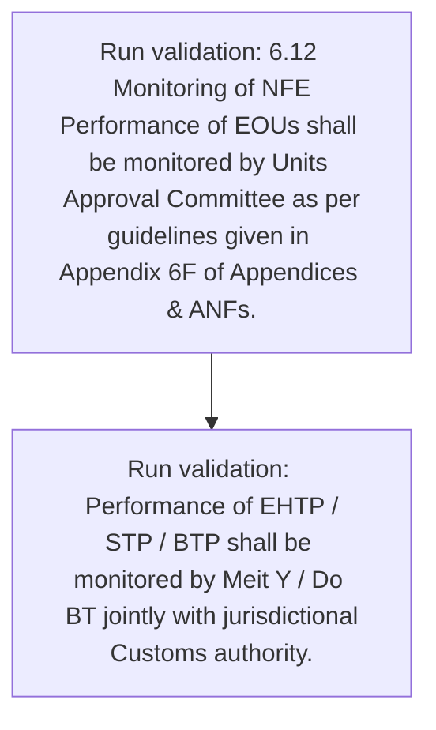

# Chapter 6 / Section 6.12: Monitoring of NFE

**Chapter Title:** Export Oriented Units (EOUs), Electronics Hardware Technology Parks (EHTPs), Software Technology Parks (STPs) and Bio-Technology

**Pages:** 10

**Purpose:** 6.12 Monitoring of NFE
Performance of EOUs shall be monitored by Units Approval Committee as per
guidelines given in Appendix 6F of Appendices & ANFs.

**Purpose Thanglish:** Indha Monitoring of NFE section-la, 6.12 Monitoring of NFE
Performance of EOUs kandippa be monitored by Units Approval Committee as per
guidelines given in Appendix 6F of Appendices & ANFs.

**Summary:** 6.12 Monitoring of NFE
Performance of EOUs shall be monitored by Units Approval Committee as per
guidelines given in Appendix 6F of Appendices & ANFs. Performance of EHTP /
STP / BTP shall be monitored by Meit Y / Do BT jointly with jurisdictional
Customs authority.

**Business Meaning:** Monitoring of NFE governs how DGFT business controls should be applied, validated, and enforced.

**Business Explanation:** Monitoring of NFE explains the operating rule set that DEKAI should enforce. Key control points include 6.12 Monitoring of NFE
Performance of EOUs shall be monitored by Units Approval Committee as per
guidelines given in Appendix 6F of Appendices & ANFs.

**Business Explanation Thanglish:** Indha Monitoring of NFE section-la, Monitoring of NFE explains the operating rule set that DEKAI should enforce. Key control points include 6.12 Monitoring of NFE
Performance of EOUs kandippa be monitored by Units Approval Committee as per
guidelines given in Appendix 6F of Appendices & ANFs.

## Business Logic
- 6.12 Monitoring of NFE
Performance of EOUs shall be monitored by Units Approval Committee as per
guidelines given in Appendix 6F of Appendices & ANFs.
- Performance of EHTP /
STP / BTP shall be monitored by Meit Y / Do BT jointly with jurisdictional
Customs authority.

## Business Rules
- rule_id=CH6-SEC6_12-R001, rule_description=6.12 Monitoring of NFE
Performance of EOUs shall be monitored by Units Approval Committee as per
guidelines given in Appendix 6F of Appendices & ANFs., trigger=Monitoring of NFE, condition=Not explicitly covered in uploaded documents., validation=6.12 Monitoring of NFE
Performance of EOUs shall be monitored by Units Approval Committee as per
guidelines given in Appendix 6F of Appendices & ANFs., action=Manual review required., exception=No explicit exception found in uploaded documents., output=DEKAI should produce a compliance decision for 6.12 - Monitoring of NFE.
- rule_id=CH6-SEC6_12-R002, rule_description=Performance of EHTP /
STP / BTP shall be monitored by Meit Y / Do BT jointly with jurisdictional
Customs authority., trigger=Monitoring of NFE, condition=Not explicitly covered in uploaded documents., validation=Performance of EHTP /
STP / BTP shall be monitored by Meit Y / Do BT jointly with jurisdictional
Customs authority., action=Manual review required., exception=No explicit exception found in uploaded documents., output=DEKAI should produce a compliance decision for 6.12 - Monitoring of NFE.

## Conditions
- None identified

## Condition Logic
- None identified

## Validations
- 6.12 Monitoring of NFE
Performance of EOUs shall be monitored by Units Approval Committee as per
guidelines given in Appendix 6F of Appendices & ANFs.
- Performance of EHTP /
STP / BTP shall be monitored by Meit Y / Do BT jointly with jurisdictional
Customs authority.

## Exceptions
- None identified

## Dependencies
- None identified

## Authorities
- Performance of EOUs shall be monitored by Units Approval Committee
- Customs
- Customs authority

## Required Documents
- None identified

## Timelines
- None identified

## Actions
- None identified

## Workflow
- Run validation: 6.12 Monitoring of NFE
Performance of EOUs shall be monitored by Units Approval Committee as per
guidelines given in Appendix 6F of Appendices & ANFs.
- Run validation: Performance of EHTP /
STP / BTP shall be monitored by Meit Y / Do BT jointly with jurisdictional
Customs authority.

## Workflow ASCII
```text
Monitoring of NFE
Run validation: 6.12 Monitoring of NFE
Performance of EOUs shall be monitored by Units Approval Committee as per
guidelines given in Appendix 6F of Appendices & ANFs.
   |
   v
Run validation: Performance of EHTP /
STP / BTP shall be monitored by Meit Y / Do BT jointly with jurisdictional
Customs authority.
```

## Decision Tree
- IF section 6.12 applies THEN proceed with standard DGFT workflow

## Decision Tree ASCII
```text
Monitoring of NFE Decision
IF section 6.12 applies THEN proceed with standard DGFT workflow
```

## Examples
- User asks to process Monitoring of NFE; the platform checks conditions, validations, and documents before action.

**Real-world Example:** Example: an importer or exporter invokes Monitoring of NFE, submits the prescribed DGFT records, and DEKAI uses the extracted rules to follow the monitoring of nfe process.

**Real-world Example Thanglish:** Indha Monitoring of NFE section-la, Example: an importer or exporter invokes Monitoring of NFE, submits the prescribed DGFT records, and DEKAI uses the extracted rules to follow the monitoring of nfe process.

## AI Rules
- IF detected context matches section rule THEN enforce: 6.12 Monitoring of NFE
Performance of EOUs shall be monitored by Units Approval Committee as per
guidelines given in Appendix 6F of Appendices & ANFs.
- IF detected context matches section rule THEN enforce: Performance of EHTP /
STP / BTP shall be monitored by Meit Y / Do BT jointly with jurisdictional
Customs authority.

## Database Fields
- name=section_code, type=string, required=True, source=parsed_section_heading
- name=section_title, type=string, required=True, source=parsed_section_heading
- name=nfe_flag, type=boolean, required=False, source=keyword:NFE
- name=per_flag, type=boolean, required=False, source=keyword:per
- name=stp_flag, type=boolean, required=False, source=keyword:STP
- name=btp_flag, type=boolean, required=False, source=keyword:BTP
- name=eous_flag, type=boolean, required=False, source=keyword:EOUs
- name=anfs_flag, type=boolean, required=False, source=keyword:ANFs
- name=ehtp_flag, type=boolean, required=False, source=keyword:EHTP
- name=meit_flag, type=boolean, required=False, source=keyword:Meit

## API Requirements
- method=GET, path=/api/dgft/sections/6.12, purpose=Retrieve knowledge payload for section 6.12, query_params=['include=workflow,decision_tree,validations'], response_fields=['section', 'title', 'summary', 'conditions', 'validations', 'exceptions', 'workflow', 'decision_tree']
- method=POST, path=/api/dgft/Monitoring-of-NFE/validate, purpose=Validate inputs and documents for Monitoring of NFE, request_fields=['section_code', 'section_title'], response_fields=['status', 'errors', 'warnings', 'next_actions']

## UI Screens
- screen_id=Monitoring_of_NFE_overview, name=Monitoring of NFE Overview, purpose=Show section summary, authority, timeline, and eligibility cues., widgets=['summary_card', 'conditions_table', 'authority_badges', 'timeline_panel']
- screen_id=Monitoring_of_NFE_submission, name=Monitoring of NFE Submission, purpose=Capture applicant data and supporting documents., widgets=['dynamic_form', 'document_uploader', 'validation_panel', 'next_action_footer'], fields=['section_code', 'section_title', 'nfe_flag', 'per_flag', 'stp_flag', 'btp_flag', 'eous_flag', 'anfs_flag']

## Error Messages
- Validation failed because the section requirements were not fully met.

## FAQ
- question_en=What is the purpose of section 6.12?, answer_en=Monitoring of NFE explains the operating rule set that DEKAI should enforce. Key control points include 6.12 Monitoring of NFE
Performance of EOUs shall be monitored by Units Approval Committee as per
guidelines given in Appendix 6F of Appendices & ANFs., question_thanglish=Indha Monitoring of NFE section-la, What is the purpose of section 6.12?, answer_thanglish=Indha Monitoring of NFE section-la, Monitoring of NFE explains the operating rule set that DEKAI should enforce. Key control points include 6.12 Monitoring of NFE
Performance of EOUs kandippa be monitored by Units Approval Committee as per
guidelines given in Appendix 6F of Appendices & ANFs.
- question_en=What documents are required under Monitoring of NFE?, answer_en=Not explicitly covered in uploaded documents., question_thanglish=Indha Monitoring of NFE section-la, What documents are required under Monitoring of NFE?, answer_thanglish=Indha Monitoring of NFE section-la, Not explicitly covered in uploaded documents.
- question_en=Which authority handles Monitoring of NFE?, answer_en=Performance of EOUs shall be monitored by Units Approval Committee, Customs, Customs authority, question_thanglish=Indha Monitoring of NFE section-la, Which authority handles Monitoring of NFE?, answer_thanglish=Indha Monitoring of NFE section-la, Performance of EOUs kandippa be monitored by Units Approval Committee, Customs, Customs authority

## Questions Users May Ask
- What does Monitoring of NFE require?
- Which documents are needed for Monitoring of NFE?
- How does DEKAI validate Monitoring of NFE requests?

## Expected AI Answers
- Monitoring of NFE requires the platform to interpret the section text, apply the extracted business rules, and present the correct next action.
- Required documents are inferred from the section text: no explicit documents were detected.
- DEKAI validates Monitoring of NFE by checking conditions, required documents, authority references, and exception clauses before recommending an outcome.

## AI Q&A Examples
- question_en=User asks: How do I comply with Monitoring of NFE?, answer_en=AI answers: DEKAI should evaluate section 6.12, apply the extracted rules, and guide the user through Run validation: 6.12 Monitoring of NFE
Performance of EOUs shall be monitored by Units Approval Committee as per
guidelines given in Appendix 6F of Appendices & ANFs.., question_thanglish=Indha Monitoring of NFE section-la, User asks: How do I comply with Monitoring of NFE?, answer_thanglish=Indha Monitoring of NFE section-la, AI answers: DEKAI should evaluate section 6.12, apply the extracted rules, and guide the user through Run validation: 6.12 Monitoring of NFE
Performance of EOUs kandippa be monitored by Units Approval Committee as per
guidelines given in Appendix 6F of Appendices & ANFs..
- question_en=User asks: Which validations apply to Monitoring of NFE?, answer_en=AI answers: Applicable validations are 6.12 Monitoring of NFE
Performance of EOUs shall be monitored by Units Approval Committee as per
guidelines given in Appendix 6F of Appendices & ANFs., Performance of EHTP /
STP / BTP shall be monitored by Meit Y / Do BT jointly with jurisdictional
Customs authority., question_thanglish=Indha Monitoring of NFE section-la, User asks: Which validations apply to Monitoring of NFE?, answer_thanglish=Indha Monitoring of NFE section-la, AI answers: Applicable validations are 6.12 Monitoring of NFE
Performance of EOUs kandippa be monitored by Units Approval Committee as per
guidelines given in Appendix 6F of Appendices & ANFs., Performance of EHTP /
STP / BTP kandippa be monitored by Meit Y / Do BT jointly with jurisdictional
Customs authority.

## DEKAI AI Implementation Notes
- Capture chapter 6, section 6.12, title, and page references as immutable knowledge metadata.
- Bind validations for Monitoring of NFE into a rule engine keyed by the rule IDs extracted for this section.
- Route escalations or approvals to: Performance of EOUs shall be monitored by Units Approval Committee, Customs, Customs authority.

## DEKAI AI Implementation Notes Thanglish
- Indha Monitoring of NFE section-la, Capture chapter 6, section 6.12, title, and page references as immutable knowledge metadata.
- Indha Monitoring of NFE section-la, Bind validations for Monitoring of NFE into a rule engine keyed by the rule IDs extracted for this section.
- Indha Monitoring of NFE section-la, Route escalations or approvals to: Performance of EOUs kandippa be monitored by Units Approval Committee, Customs, Customs authority.

## AI Metadata
- Keywords: NFE, per, STP, BTP, EOUs, ANFs, EHTP, Meit, with, shall, Units, given, jointly, Customs, Approval, Appendix, monitored, Committee, authority, Monitoring
- Search Keywords: NFE, per, STP, BTP, EOUs, ANFs, EHTP, Meit, with, shall, Units, given, jointly, Customs, Approval, Appendix, monitored, Committee, authority, Monitoring
- Intent: Provide knowledge guidance for Monitoring of NFE.
- Tags: 6.12, Monitoring of NFE, business-rule, dgft
- Related Sections: 
- Related Chapters: 
- Related Rules: 6.12 Monitoring of NFE
Performance of EOUs shall be monitored by Units Approval Committee as per
guidelines given in Appendix 6F of Appendices & ANFs., Performance of EHTP /
STP / BTP shall be monitored by Meit Y / Do BT jointly with jurisdictional
Customs authority.

## Mermaid


## PlantUML
```plantuml
@startuml
start
:Run validation\: 6.12 Monitoring of NFE
Performance of EOUs shall be monitored by Units Approval Committee as per
guidelines given in Appendix 6F of Appendices & ANFs.;
:Run validation\: Performance of EHTP /
STP / BTP shall be monitored by Meit Y / Do BT jointly with jurisdictional
Customs authority.;
stop
@enduml
```
