# Chapter 6 / Section 6.13: Conversion of Scrap / Dust / sweeping of Gold / Silver /

**Chapter Title:** Export Oriented Units (EOUs), Electronics Hardware Technology Parks (EHTPs), Software Technology Parks (STPs) and Bio-Technology

**Pages:** 10

**Purpose:** 6.13 Conversion of Scrap / Dust / sweeping of Gold / Silver /
Platinum into Standard Bars
Scrap / dust / sweeping of gold / silver / platinum may be sent to Government
of India Mint / private mint from EOU / EHTP / STP units and returned to them
in standard bars in accordance with procedure prescribed by Customs
authorities, or may be permitted to be sold in DTA on payment of applicable GST
and compensation cess alongwith reversal of duties of Customs leviable under
First Schedule of the Customs Tariff Act, 1975 availed as exemption on inputs,
on basis of gold / silver / platinum content, as may be notified by Customs
authorities.

**Purpose Thanglish:** Indha Conversion of Scrap / Dust / sweeping of Gold / Silver / section-la, 6.13 Conversion of Scrap / Dust / sweeping of Gold / Silver /
Platinum into Standard Bars
Scrap / dust / sweeping of gold / silver / platinum may be sent to Government
of India Mint / private mint from EOU / EHTP / STP units and returned to them
in standard bars in accordance with procedure prescribed by Customs
authorities, or may be permitted to be sold in DTA on payment of applicable GST
and compensation cess alongwith reversal of duties of Customs leviable under
First Schedule of the Customs Tariff Act, 1975 availed as exemption on inputs,
on basis of gold / silver / platinum content, as may be notified by Customs
authorities.

**Summary:** 6.13 Conversion of Scrap / Dust / sweeping of Gold / Silver /
Platinum into Standard Bars
Scrap / dust / sweeping of gold / silver / platinum may be sent to Government
of India Mint / private mint from EOU / EHTP / STP units and returned to them
in standard bars in accordance with procedure prescribed by Customs
authorities, or may be permitted to be sold in DTA on payment of applicable GST
and compensation cess alongwith reversal of duties of Customs leviable under
First Schedule of the Customs Tariff Act, 1975 availed as exemption on inputs,
on basis of gold / silver / platinum content, as may be notified by Customs
authorities.

**Business Meaning:** 6.13 Conversion of Scrap / Dust / sweeping of Gold / Silver /
Platinum into Standard Bars
Scrap / dust / sweeping of gold / silver / platinum may be sent to Government
of India Mint / private mint from EOU / EHTP / STP units and returned to them
in standard bars in accordance with procedure prescribed by Customs
authorities, or may be permitted to be sold in DTA on payment of applicable GST
and compensation cess alongwith reversal of duties of Customs leviable under
First Schedule of the Customs Tariff Act, 1975 availed as exemption on inputs,
on basis of gold / silver / platinum content, as may be notified by Customs
authorities.

**Business Explanation:** 6.13 Conversion of Scrap / Dust / sweeping of Gold / Silver /
Platinum into Standard Bars
Scrap / dust / sweeping of gold / silver / platinum may be sent to Government
of India Mint / private mint from EOU / EHTP / STP units and returned to them
in standard bars in accordance with procedure prescribed by Customs
authorities, or may be permitted to be sold in DTA on payment of applicable GST
and compensation cess alongwith reversal of duties of Customs leviable under
First Schedule of the Customs Tariff Act, 1975 availed as exemption on inputs,
on basis of gold / silver / platinum content, as may be notified by Customs
authorities.

**Business Explanation Thanglish:** Indha Conversion of Scrap / Dust / sweeping of Gold / Silver / section-la, 6.13 Conversion of Scrap / Dust / sweeping of Gold / Silver /
Platinum into Standard Bars
Scrap / dust / sweeping of gold / silver / platinum may be sent to Government
of India Mint / private mint from EOU / EHTP / STP units and returned to them
in standard bars in accordance with procedure prescribed by Customs
authorities, or may be permitted to be sold in DTA on payment of applicable GST
and compensation cess alongwith reversal of duties of Customs leviable under
First Schedule of the Customs Tariff Act, 1975 availed as exemption on inputs,
on basis of gold / silver / platinum content, as may be notified by Customs
authorities.

## Business Logic
- None identified

## Business Rules
- rule_id=CH6-SEC6_13-R001, rule_description=IF validations pass THEN recommend action: 6.13 Conversion of Scrap / Dust / sweeping of Gold / Silver /
Platinum into Standard Bars
Scrap / dust / sweeping of gold / silver / platinum may be sent to Government
of India Mint / private mint from EOU / EHTP / STP units and returned to them
in standard bars in accordance with procedure prescribed by Customs
authorities, or may be permitted to be sold in DTA on payment of applicable GST
and compensation cess alongwith reversal of duties of Customs leviable under
First Schedule of the Customs Tariff Act, 1975 availed as exemption on inputs,
on basis of gold / silver / platinum content, as may be notified by Customs
authorities., trigger=Conversion of Scrap / Dust / sweeping of Gold / Silver /, condition=6.13 Conversion of Scrap / Dust / sweeping of Gold / Silver /
Platinum into Standard Bars
Scrap / dust / sweeping of gold / silver / platinum may be sent to Government
of India Mint / private mint from EOU / EHTP / STP units and returned to them
in standard bars in accordance with procedure prescribed by Customs
authorities, or may be permitted to be sold in DTA on payment of applicable GST
and compensation cess alongwith reversal of duties of Customs leviable under
First Schedule of the Customs Tariff Act, 1975 availed as exemption on inputs,
on basis of gold / silver / platinum content, as may be notified by Customs
authorities., validation=Not explicitly covered in uploaded documents., action=6.13 Conversion of Scrap / Dust / sweeping of Gold / Silver /
Platinum into Standard Bars
Scrap / dust / sweeping of gold / silver / platinum may be sent to Government
of India Mint / private mint from EOU / EHTP / STP units and returned to them
in standard bars in accordance with procedure prescribed by Customs
authorities, or may be permitted to be sold in DTA on payment of applicable GST
and compensation cess alongwith reversal of duties of Customs leviable under
First Schedule of the Customs Tariff Act, 1975 availed as exemption on inputs,
on basis of gold / silver / platinum content, as may be notified by Customs
authorities., exception=6.13 Conversion of Scrap / Dust / sweeping of Gold / Silver /
Platinum into Standard Bars
Scrap / dust / sweeping of gold / silver / platinum may be sent to Government
of India Mint / private mint from EOU / EHTP / STP units and returned to them
in standard bars in accordance with procedure prescribed by Customs
authorities, or may be permitted to be sold in DTA on payment of applicable GST
and compensation cess alongwith reversal of duties of Customs leviable under
First Schedule of the Customs Tariff Act, 1975 availed as exemption on inputs,
on basis of gold / silver / platinum content, as may be notified by Customs
authorities., output=DEKAI should produce a compliance decision for 6.13 - Conversion of Scrap / Dust / sweeping of Gold / Silver /.

## Conditions
- 6.13 Conversion of Scrap / Dust / sweeping of Gold / Silver /
Platinum into Standard Bars
Scrap / dust / sweeping of gold / silver / platinum may be sent to Government
of India Mint / private mint from EOU / EHTP / STP units and returned to them
in standard bars in accordance with procedure prescribed by Customs
authorities, or may be permitted to be sold in DTA on payment of applicable GST
and compensation cess alongwith reversal of duties of Customs leviable under
First Schedule of the Customs Tariff Act, 1975 availed as exemption on inputs,
on basis of gold / silver / platinum content, as may be notified by Customs
authorities.

## Condition Logic
- id=6.6.13.1, if=6.13 Conversion of Scrap / Dust / sweeping of Gold / Silver /
Platinum into Standard Bars
Scrap / dust / sweeping of gold / silver / platinum may be sent to Government
of India Mint / private mint from EOU / EHTP / STP units and returned to them
in standard bars in accordance with procedure prescribed by Customs
authorities, or may be permitted to be sold in DTA on payment of applicable GST
and compensation cess alongwith reversal of duties of Customs leviable under
First Schedule of the Customs Tariff Act, 1975 availed as exemption on inputs,
on basis of gold / silver / platinum content, as may be notified by Customs
authorities., then=6.13 Conversion of Scrap / Dust / sweeping of Gold / Silver /
Platinum into Standard Bars
Scrap / dust / sweeping of gold / silver / platinum may be sent to Government
of India Mint / private mint from EOU / EHTP / STP units and returned to them
in standard bars in accordance with procedure prescribed by Customs
authorities, or may be permitted to be sold in DTA on payment of applicable GST
and compensation cess alongwith reversal of duties of Customs leviable under
First Schedule of the Customs Tariff Act, 1975 availed as exemption on inputs,
on basis of gold / silver / platinum content, as may be notified by Customs
authorities., source=6.13 Conversion of Scrap / Dust / sweeping of Gold / Silver /
Platinum into Standard Bars
Scrap / dust / sweeping of gold / silver / platinum may be sent to Government
of India Mint / private mint from EOU / EHTP / STP units and returned to them
in standard bars in accordance with procedure prescribed by Customs
authorities, or may be permitted to be sold in DTA on payment of applicable GST
and compensation cess alongwith reversal of duties of Customs leviable under
First Schedule of the Customs Tariff Act, 1975 availed as exemption on inputs,
on basis of gold / silver / platinum content, as may be notified by Customs
authorities.

## Validations
- None identified

## Exceptions
- 6.13 Conversion of Scrap / Dust / sweeping of Gold / Silver /
Platinum into Standard Bars
Scrap / dust / sweeping of gold / silver / platinum may be sent to Government
of India Mint / private mint from EOU / EHTP / STP units and returned to them
in standard bars in accordance with procedure prescribed by Customs
authorities, or may be permitted to be sold in DTA on payment of applicable GST
and compensation cess alongwith reversal of duties of Customs leviable under
First Schedule of the Customs Tariff Act, 1975 availed as exemption on inputs,
on basis of gold / silver / platinum content, as may be notified by Customs
authorities.

## Dependencies
- None identified

## Authorities
- Customs
- Scrap / dust / sweeping of gold / silver / platinum may be sent to Government
- First Schedule of the Customs

## Required Documents
- None identified

## Timelines
- None identified

## Actions
- 6.13 Conversion of Scrap / Dust / sweeping of Gold / Silver /
Platinum into Standard Bars
Scrap / dust / sweeping of gold / silver / platinum may be sent to Government
of India Mint / private mint from EOU / EHTP / STP units and returned to them
in standard bars in accordance with procedure prescribed by Customs
authorities, or may be permitted to be sold in DTA on payment of applicable GST
and compensation cess alongwith reversal of duties of Customs leviable under
First Schedule of the Customs Tariff Act, 1975 availed as exemption on inputs,
on basis of gold / silver / platinum content, as may be notified by Customs
authorities.

## Workflow
- Evaluate condition: 6.13 Conversion of Scrap / Dust / sweeping of Gold / Silver /
Platinum into Standard Bars
Scrap / dust / sweeping of gold / silver / platinum may be sent to Government
of India Mint / private mint from EOU / EHTP / STP units and returned to them
in standard bars in accordance with procedure prescribed by Customs
authorities, or may be permitted to be sold in DTA on payment of applicable GST
and compensation cess alongwith reversal of duties of Customs leviable under
First Schedule of the Customs Tariff Act, 1975 availed as exemption on inputs,
on basis of gold / silver / platinum content, as may be notified by Customs
authorities.
- 6.13 Conversion of Scrap / Dust / sweeping of Gold / Silver /
Platinum into Standard Bars
Scrap / dust / sweeping of gold / silver / platinum may be sent to Government
of India Mint / private mint from EOU / EHTP / STP units and returned to them
in standard bars in accordance with procedure prescribed by Customs
authorities, or may be permitted to be sold in DTA on payment of applicable GST
and compensation cess alongwith reversal of duties of Customs leviable under
First Schedule of the Customs Tariff Act, 1975 availed as exemption on inputs,
on basis of gold / silver / platinum content, as may be notified by Customs
authorities.
- Handle exception: 6.13 Conversion of Scrap / Dust / sweeping of Gold / Silver /
Platinum into Standard Bars
Scrap / dust / sweeping of gold / silver / platinum may be sent to Government
of India Mint / private mint from EOU / EHTP / STP units and returned to them
in standard bars in accordance with procedure prescribed by Customs
authorities, or may be permitted to be sold in DTA on payment of applicable GST
and compensation cess alongwith reversal of duties of Customs leviable under
First Schedule of the Customs Tariff Act, 1975 availed as exemption on inputs,
on basis of gold / silver / platinum content, as may be notified by Customs
authorities.

## Workflow ASCII
```text
Conversion of Scrap / Dust / sweeping of Gold / Silver /
Evaluate condition: 6.13 Conversion of Scrap / Dust / sweeping of Gold / Silver /
Platinum into Standard Bars
Scrap / dust / sweeping of gold / silver / platinum may be sent to Government
of India Mint / private mint from EOU / EHTP / STP units and returned to them
in standard bars in accordance with procedure prescribed by Customs
authorities, or may be permitted to be sold in DTA on payment of applicable GST
and compensation cess alongwith reversal of duties of Customs leviable under
First Schedule of the Customs Tariff Act, 1975 availed as exemption on inputs,
on basis of gold / silver / platinum content, as may be notified by Customs
authorities.
   |
   v
6.13 Conversion of Scrap / Dust / sweeping of Gold / Silver /
Platinum into Standard Bars
Scrap / dust / sweeping of gold / silver / platinum may be sent to Government
of India Mint / private mint from EOU / EHTP / STP units and returned to them
in standard bars in accordance with procedure prescribed by Customs
authorities, or may be permitted to be sold in DTA on payment of applicable GST
and compensation cess alongwith reversal of duties of Customs leviable under
First Schedule of the Customs Tariff Act, 1975 availed as exemption on inputs,
on basis of gold / silver / platinum content, as may be notified by Customs
authorities.
   |
   v
Handle exception: 6.13 Conversion of Scrap / Dust / sweeping of Gold / Silver /
Platinum into Standard Bars
Scrap / dust / sweeping of gold / silver / platinum may be sent to Government
of India Mint / private mint from EOU / EHTP / STP units and returned to them
in standard bars in accordance with procedure prescribed by Customs
authorities, or may be permitted to be sold in DTA on payment of applicable GST
and compensation cess alongwith reversal of duties of Customs leviable under
First Schedule of the Customs Tariff Act, 1975 availed as exemption on inputs,
on basis of gold / silver / platinum content, as may be notified by Customs
authorities.
```

## Decision Tree
- IF 6.13 Conversion of Scrap / Dust / sweeping of Gold / Silver /
Platinum into Standard Bars
Scrap / dust / sweeping of gold / silver / platinum may be sent to Government
of India Mint / private mint from EOU / EHTP / STP units and returned to them
in standard bars in accordance with procedure prescribed by Customs
authorities, or may be permitted to be sold in DTA on payment of applicable GST
and compensation cess alongwith reversal of duties of Customs leviable under
First Schedule of the Customs Tariff Act, 1975 availed as exemption on inputs,
on basis of gold / silver / platinum content, as may be notified by Customs
authorities. THEN 6.13 Conversion of Scrap / Dust / sweeping of Gold / Silver /
Platinum into Standard Bars
Scrap / dust / sweeping of gold / silver / platinum may be sent to Government
of India Mint / private mint from EOU / EHTP / STP units and returned to them
in standard bars in accordance with procedure prescribed by Customs
authorities, or may be permitted to be sold in DTA on payment of applicable GST
and compensation cess alongwith reversal of duties of Customs leviable under
First Schedule of the Customs Tariff Act, 1975 availed as exemption on inputs,
on basis of gold / silver / platinum content, as may be notified by Customs
authorities.
- IF exception applies (6.13 Conversion of Scrap / Dust / sweeping of Gold / Silver /
Platinum into Standard Bars
Scrap / dust / sweeping of gold / silver / platinum may be sent to Government
of India Mint / private mint from EOU / EHTP / STP units and returned to them
in standard bars in accordance with procedure prescribed by Customs
authorities, or may be permitted to be sold in DTA on payment of applicable GST
and compensation cess alongwith reversal of duties of Customs leviable under
First Schedule of the Customs Tariff Act, 1975 availed as exemption on inputs,
on basis of gold / silver / platinum content, as may be notified by Customs
authorities.) THEN route to manual review

## Decision Tree ASCII
```text
Conversion of Scrap / Dust / sweeping of Gold / Silver / Decision
IF 6.13 Conversion of Scrap / Dust / sweeping of Gold / Silver /
Platinum into Standard Bars
Scrap / dust / sweeping of gold / silver / platinum may be sent to Government
of India Mint / private mint from EOU / EHTP / STP units and returned to them
in standard bars in accordance with procedure prescribed by Customs
authorities, or may be permitted to be sold in DTA on payment of applicable GST
and compensation cess alongwith reversal of duties of Customs leviable under
First Schedule of the Customs Tariff Act, 1975 availed as exemption on inputs,
on basis of gold / silver / platinum content, as may be notified by Customs
authorities. THEN 6.13 Conversion of Scrap / Dust / sweeping of Gold / Silver /
Platinum into Standard Bars
Scrap / dust / sweeping of gold / silver / platinum may be sent to Government
of India Mint / private mint from EOU / EHTP / STP units and returned to them
in standard bars in accordance with procedure prescribed by Customs
authorities, or may be permitted to be sold in DTA on payment of applicable GST
and compensation cess alongwith reversal of duties of Customs leviable under
First Schedule of the Customs Tariff Act, 1975 availed as exemption on inputs,
on basis of gold / silver / platinum content, as may be notified by Customs
authorities.
   |
   v
IF exception applies (6.13 Conversion of Scrap / Dust / sweeping of Gold / Silver /
Platinum into Standard Bars
Scrap / dust / sweeping of gold / silver / platinum may be sent to Government
of India Mint / private mint from EOU / EHTP / STP units and returned to them
in standard bars in accordance with procedure prescribed by Customs
authorities, or may be permitted to be sold in DTA on payment of applicable GST
and compensation cess alongwith reversal of duties of Customs leviable under
First Schedule of the Customs Tariff Act, 1975 availed as exemption on inputs,
on basis of gold / silver / platinum content, as may be notified by Customs
authorities.) THEN route to manual review
```

## Examples
- User asks to process Conversion of Scrap / Dust / sweeping of Gold / Silver /; the platform checks conditions, validations, and documents before action.

**Real-world Example:** Example: an importer or exporter invokes Conversion of Scrap / Dust / sweeping of Gold / Silver /, submits the prescribed DGFT records, and DEKAI uses the extracted rules to 6.13 conversion of scrap / dust / sweeping of gold / silver /
platinum into standard bars
scrap / dust / sweeping of gold / silver / platinum may be sent to government
of india mint / private mint from eou / ehtp / stp units and returned to them
in standard bars in accordance with procedure prescribed by customs
authorities, or may be permitted to be sold in dta on payment of applicable gst
and compensation cess alongwith reversal of duties of customs leviable under
first schedule of the customs tariff act, 1975 availed as exemption on inputs,
on basis of gold / silver / platinum content, as may be notified by customs
authorities..

**Real-world Example Thanglish:** Indha Conversion of Scrap / Dust / sweeping of Gold / Silver / section-la, Example: an importer or exporter invokes Conversion of Scrap / Dust / sweeping of Gold / Silver /, submits the prescribed DGFT records, and DEKAI uses the extracted rules to 6.13 conversion of scrap / dust / sweeping of gold / silver /
platinum into standard bars
scrap / dust / sweeping of gold / silver / platinum may be sent to government
of india mint / private mint from eou / ehtp / stp units and returned to them
in standard bars in accordance with procedure prescribed by customs
authorities, or may be permitted to be sold in dta on payment of applicable gst
and compensation cess alongwith reversal of duties of customs leviable under
first schedule of the customs tariff act, 1975 availed as exemption on inputs,
on basis of gold / silver / platinum content, as may be notified by customs
authorities..

## AI Rules
- IF validations pass THEN recommend action: 6.13 Conversion of Scrap / Dust / sweeping of Gold / Silver /
Platinum into Standard Bars
Scrap / dust / sweeping of gold / silver / platinum may be sent to Government
of India Mint / private mint from EOU / EHTP / STP units and returned to them
in standard bars in accordance with procedure prescribed by Customs
authorities, or may be permitted to be sold in DTA on payment of applicable GST
and compensation cess alongwith reversal of duties of Customs leviable under
First Schedule of the Customs Tariff Act, 1975 availed as exemption on inputs,
on basis of gold / silver / platinum content, as may be notified by Customs
authorities.

## Database Fields
- name=section_code, type=string, required=True, source=parsed_section_heading
- name=section_title, type=string, required=True, source=parsed_section_heading
- name=may_flag, type=boolean, required=False, source=keyword:may
- name=eou_flag, type=boolean, required=False, source=keyword:EOU
- name=stp_flag, type=boolean, required=False, source=keyword:STP
- name=and_flag, type=boolean, required=False, source=keyword:and
- name=dta_flag, type=boolean, required=False, source=keyword:DTA
- name=gst_flag, type=boolean, required=False, source=keyword:GST
- name=the_flag, type=boolean, required=False, source=keyword:the
- name=act_flag, type=boolean, required=False, source=keyword:Act

## API Requirements
- method=GET, path=/api/dgft/sections/6.13, purpose=Retrieve knowledge payload for section 6.13, query_params=['include=workflow,decision_tree,validations'], response_fields=['section', 'title', 'summary', 'conditions', 'validations', 'exceptions', 'workflow', 'decision_tree']
- method=POST, path=/api/dgft/Conversion-of-Scrap-Dust-sweeping-of-Gold-Silver/validate, purpose=Validate inputs and documents for Conversion of Scrap / Dust / sweeping of Gold / Silver /, request_fields=['section_code', 'section_title'], response_fields=['status', 'errors', 'warnings', 'next_actions']
- method=POST, path=/api/dgft/Conversion-of-Scrap-Dust-sweeping-of-Gold-Silver/execute, purpose=Trigger business action for 6.13 Conversion of Scrap / Dust / sweeping of Gold / Silver /
Platinum into Standard Bars
Scrap / dust / sweeping of gold / silver / platinum may be sent to Government
of India Mint / private mint from EOU / EHTP / STP units and returned to them
in standard bars in accordance with procedure prescribed by Customs
authorities, or may be permitted to be sold in DTA on payment of applicable GST
and compensation cess alongwith reversal of duties of Customs leviable under
First Schedule of the Customs Tariff Act, 1975 availed as exemption on inputs,
on basis of gold / silver / platinum content, as may be notified by Customs
authorities., request_fields=['section_code', 'section_title'], response_fields=['reference_id', 'status', 'authority', 'timeline']

## UI Screens
- screen_id=Conversion_of_Scrap_Dust_sweeping_of_Gold_Silver_overview, name=Conversion of Scrap / Dust / sweeping of Gold / Silver / Overview, purpose=Show section summary, authority, timeline, and eligibility cues., widgets=['summary_card', 'conditions_table', 'authority_badges', 'timeline_panel']
- screen_id=Conversion_of_Scrap_Dust_sweeping_of_Gold_Silver_submission, name=Conversion of Scrap / Dust / sweeping of Gold / Silver / Submission, purpose=Capture applicant data and supporting documents., widgets=['dynamic_form', 'document_uploader', 'validation_panel', 'next_action_footer'], fields=['section_code', 'section_title', 'may_flag', 'eou_flag', 'stp_flag', 'and_flag', 'dta_flag', 'gst_flag']
- screen_id=Conversion_of_Scrap_Dust_sweeping_of_Gold_Silver_exceptions, name=Conversion of Scrap / Dust / sweeping of Gold / Silver / Exception Review, purpose=Explain exception handling and manual review triggers., widgets=['exception_banner', 'decision_tree', 'case_notes']

## Error Messages
- Validation failed because the section requirements were not fully met.

## FAQ
- question_en=What is the purpose of section 6.13?, answer_en=6.13 Conversion of Scrap / Dust / sweeping of Gold / Silver /
Platinum into Standard Bars
Scrap / dust / sweeping of gold / silver / platinum may be sent to Government
of India Mint / private mint from EOU / EHTP / STP units and returned to them
in standard bars in accordance with procedure prescribed by Customs
authorities, or may be permitted to be sold in DTA on payment of applicable GST
and compensation cess alongwith reversal of duties of Customs leviable under
First Schedule of the Customs Tariff Act, 1975 availed as exemption on inputs,
on basis of gold / silver / platinum content, as may be notified by Customs
authorities., question_thanglish=Indha Conversion of Scrap / Dust / sweeping of Gold / Silver / section-la, What is the purpose of section 6.13?, answer_thanglish=Indha Conversion of Scrap / Dust / sweeping of Gold / Silver / section-la, 6.13 Conversion of Scrap / Dust / sweeping of Gold / Silver /
Platinum into Standard Bars
Scrap / dust / sweeping of gold / silver / platinum may be sent to Government
of India Mint / private mint from EOU / EHTP / STP units and returned to them
in standard bars in accordance with procedure prescribed by Customs
authorities, or may be permitted to be sold in DTA on payment of applicable GST
and compensation cess alongwith reversal of duties of Customs leviable under
First Schedule of the Customs Tariff Act, 1975 availed as exemption on inputs,
on basis of gold / silver / platinum content, as may be notified by Customs
authorities.
- question_en=What documents are required under Conversion of Scrap / Dust / sweeping of Gold / Silver /?, answer_en=Not explicitly covered in uploaded documents., question_thanglish=Indha Conversion of Scrap / Dust / sweeping of Gold / Silver / section-la, What documents are required under Conversion of Scrap / Dust / sweeping of Gold / Silver /?, answer_thanglish=Indha Conversion of Scrap / Dust / sweeping of Gold / Silver / section-la, Not explicitly covered in uploaded documents.
- question_en=Which authority handles Conversion of Scrap / Dust / sweeping of Gold / Silver /?, answer_en=Customs, Scrap / dust / sweeping of gold / silver / platinum may be sent to Government, First Schedule of the Customs, question_thanglish=Indha Conversion of Scrap / Dust / sweeping of Gold / Silver / section-la, Which authority handles Conversion of Scrap / Dust / sweeping of Gold / Silver /?, answer_thanglish=Indha Conversion of Scrap / Dust / sweeping of Gold / Silver / section-la, Customs, Scrap / dust / sweeping of gold / silver / platinum may be sent to Government, First Schedule of the Customs

## Questions Users May Ask
- What does Conversion of Scrap / Dust / sweeping of Gold / Silver / require?
- Which documents are needed for Conversion of Scrap / Dust / sweeping of Gold / Silver /?
- How does DEKAI validate Conversion of Scrap / Dust / sweeping of Gold / Silver / requests?
- What action should be taken for Conversion of Scrap / Dust / sweeping of Gold / Silver /?

## Expected AI Answers
- Conversion of Scrap / Dust / sweeping of Gold / Silver / requires the platform to interpret the section text, apply the extracted business rules, and present the correct next action.
- Required documents are inferred from the section text: no explicit documents were detected.
- DEKAI validates Conversion of Scrap / Dust / sweeping of Gold / Silver / by checking conditions, required documents, authority references, and exception clauses before recommending an outcome.
- The primary extracted action is: 6.13 Conversion of Scrap / Dust / sweeping of Gold / Silver /
Platinum into Standard Bars
Scrap / dust / sweeping of gold / silver / platinum may be sent to Government
of India Mint / private mint from EOU / EHTP / STP units and returned to them
in standard bars in accordance with procedure prescribed by Customs
authorities, or may be permitted to be sold in DTA on payment of applicable GST
and compensation cess alongwith reversal of duties of Customs leviable under
First Schedule of the Customs Tariff Act, 1975 availed as exemption on inputs,
on basis of gold / silver / platinum content, as may be notified by Customs
authorities.

## AI Q&A Examples
- question_en=User asks: How do I comply with Conversion of Scrap / Dust / sweeping of Gold / Silver /?, answer_en=AI answers: DEKAI should evaluate section 6.13, apply the extracted rules, and guide the user through Evaluate condition: 6.13 Conversion of Scrap / Dust / sweeping of Gold / Silver /
Platinum into Standard Bars
Scrap / dust / sweeping of gold / silver / platinum may be sent to Government
of India Mint / private mint from EOU / EHTP / STP units and returned to them
in standard bars in accordance with procedure prescribed by Customs
authorities, or may be permitted to be sold in DTA on payment of applicable GST
and compensation cess alongwith reversal of duties of Customs leviable under
First Schedule of the Customs Tariff Act, 1975 availed as exemption on inputs,
on basis of gold / silver / platinum content, as may be notified by Customs
authorities.., question_thanglish=Indha Conversion of Scrap / Dust / sweeping of Gold / Silver / section-la, User asks: How do I comply with Conversion of Scrap / Dust / sweeping of Gold / Silver /?, answer_thanglish=Indha Conversion of Scrap / Dust / sweeping of Gold / Silver / section-la, AI answers: DEKAI should evaluate section 6.13, apply the extracted rules, and guide the user through Evaluate condition: 6.13 Conversion of Scrap / Dust / sweeping of Gold / Silver /
Platinum into Standard Bars
Scrap / dust / sweeping of gold / silver / platinum may be sent to Government
of India Mint / private mint from EOU / EHTP / STP units and returned to them
in standard bars in accordance with procedure prescribed by Customs
authorities, or may be permitted to be sold in DTA on payment of applicable GST
and compensation cess alongwith reversal of duties of Customs leviable under
First Schedule of the Customs Tariff Act, 1975 availed as exemption on inputs,
on basis of gold / silver / platinum content, as may be notified by Customs
authorities..
- question_en=User asks: Which validations apply to Conversion of Scrap / Dust / sweeping of Gold / Silver /?, answer_en=AI answers: Applicable validations are not explicitly covered in the uploaded documents., question_thanglish=Indha Conversion of Scrap / Dust / sweeping of Gold / Silver / section-la, User asks: Which validations apply to Conversion of Scrap / Dust / sweeping of Gold / Silver /?, answer_thanglish=Indha Conversion of Scrap / Dust / sweeping of Gold / Silver / section-la, AI answers: Applicable validations are not explicitly covered in the uploaded documents.

## DEKAI AI Implementation Notes
- Capture chapter 6, section 6.13, title, and page references as immutable knowledge metadata.
- Bind validations for Conversion of Scrap / Dust / sweeping of Gold / Silver / into a rule engine keyed by the rule IDs extracted for this section.
- Route escalations or approvals to: Customs, Scrap / dust / sweeping of gold / silver / platinum may be sent to Government, First Schedule of the Customs.
- Trigger manual review when exception clauses are detected.

## DEKAI AI Implementation Notes Thanglish
- Indha Conversion of Scrap / Dust / sweeping of Gold / Silver / section-la, Capture chapter 6, section 6.13, title, and page references as immutable knowledge metadata.
- Indha Conversion of Scrap / Dust / sweeping of Gold / Silver / section-la, Bind validations for Conversion of Scrap / Dust / sweeping of Gold / Silver / into a rule engine keyed by the rule IDs extracted for this section.
- Indha Conversion of Scrap / Dust / sweeping of Gold / Silver / section-la, Route escalations or approvals to: Customs, Scrap / dust / sweeping of gold / silver / platinum may be sent to Government, First Schedule of the Customs.
- Indha Conversion of Scrap / Dust / sweeping of Gold / Silver / section-la, Trigger manual review when exception clauses are detected.

## AI Metadata
- Keywords: may, EOU, STP, and, DTA, GST, the, Act, Dust, Gold, into, Bars, sent, Mint, from, EHTP, them, with, sold, cess
- Search Keywords: may, EOU, STP, and, DTA, GST, the, Act, Dust, Gold, into, Bars, sent, Mint, from, EHTP, them, with, sold, cess
- Intent: Support Conversion of Scrap / Dust / sweeping of Gold / Silver / processing and compliance validation.
- Tags: 6.13, Conversion of Scrap / Dust / sweeping of Gold / Silver /, dgft
- Related Sections: 
- Related Chapters: 
- Related Rules: 

## Mermaid

```mermaid
flowchart TD
    S1["Evaluate condition: 6.13 Conversion of Scrap / Dust / sweeping of Gold / Silver /
Platinum into Standard Bars
Scrap / dust / sweeping of gold / silver / platinum may be sent to Government
of India Mint / private mint from EOU / EHTP / STP units and returned to them
in standard bars in accordance with procedure prescribed by Customs
authorities, or may be permitted to be sold in DTA on payment of applicable GST
and compensation cess alongwith reversal of duties of Customs leviable under
First Schedule of the Customs Tariff Act, 1975 availed as exemption on inputs,
on basis of gold / silver / platinum content, as may be notified by Customs
authorities."]
    S2["6.13 Conversion of Scrap / Dust / sweeping of Gold / Silver /
Platinum into Standard Bars
Scrap / dust / sweeping of gold / silver / platinum may be sent to Government
of India Mint / private mint from EOU / EHTP / STP units and returned to them
in standard bars in accordance with procedure prescribed by Customs
authorities, or may be permitted to be sold in DTA on payment of applicable GST
and compensation cess alongwith reversal of duties of Customs leviable under
First Schedule of the Customs Tariff Act, 1975 availed as exemption on inputs,
on basis of gold / silver / platinum content, as may be notified by Customs
authorities."]
    S1 --> S2
    S3["Handle exception: 6.13 Conversion of Scrap / Dust / sweeping of Gold / Silver /
Platinum into Standard Bars
Scrap / dust / sweeping of gold / silver / platinum may be sent to Government
of India Mint / private mint from EOU / EHTP / STP units and returned to them
in standard bars in accordance with procedure prescribed by Customs
authorities, or may be permitted to be sold in DTA on payment of applicable GST
and compensation cess alongwith reversal of duties of Customs leviable under
First Schedule of the Customs Tariff Act, 1975 availed as exemption on inputs,
on basis of gold / silver / platinum content, as may be notified by Customs
authorities."]
    S2 --> S3
```


## PlantUML
```plantuml
@startuml
start
:Evaluate condition\: 6.13 Conversion of Scrap / Dust / sweeping of Gold / Silver /
Platinum into Standard Bars
Scrap / dust / sweeping of gold / silver / platinum may be sent to Government
of India Mint / private mint from EOU / EHTP / STP units and returned to them
in standard bars in accordance with procedure prescribed by Customs
authorities, or may be permitted to be sold in DTA on payment of applicable GST
and compensation cess alongwith reversal of duties of Customs leviable under
First Schedule of the Customs Tariff Act, 1975 availed as exemption on inputs,
on basis of gold / silver / platinum content, as may be notified by Customs
authorities.;
:6.13 Conversion of Scrap / Dust / sweeping of Gold / Silver /
Platinum into Standard Bars
Scrap / dust / sweeping of gold / silver / platinum may be sent to Government
of India Mint / private mint from EOU / EHTP / STP units and returned to them
in standard bars in accordance with procedure prescribed by Customs
authorities, or may be permitted to be sold in DTA on payment of applicable GST
and compensation cess alongwith reversal of duties of Customs leviable under
First Schedule of the Customs Tariff Act, 1975 availed as exemption on inputs,
on basis of gold / silver / platinum content, as may be notified by Customs
authorities.;
:Handle exception\: 6.13 Conversion of Scrap / Dust / sweeping of Gold / Silver /
Platinum into Standard Bars
Scrap / dust / sweeping of gold / silver / platinum may be sent to Government
of India Mint / private mint from EOU / EHTP / STP units and returned to them
in standard bars in accordance with procedure prescribed by Customs
authorities, or may be permitted to be sold in DTA on payment of applicable GST
and compensation cess alongwith reversal of duties of Customs leviable under
First Schedule of the Customs Tariff Act, 1975 availed as exemption on inputs,
on basis of gold / silver / platinum content, as may be notified by Customs
authorities.;
stop
@enduml
```
