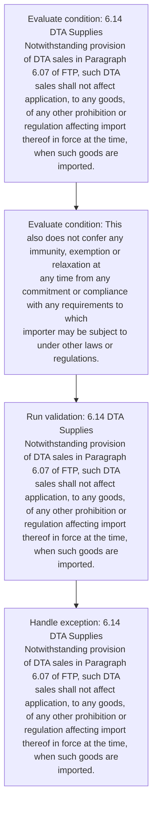
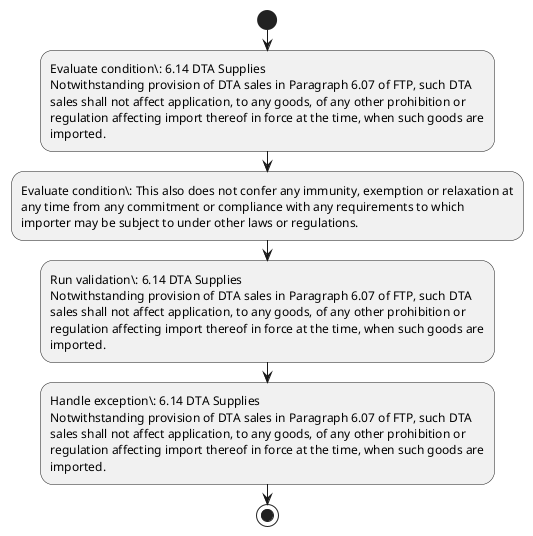

# Chapter 6 / Section 6.14: DTA Supplies

**Chapter Title:** Export Oriented Units (EOUs), Electronics Hardware Technology Parks (EHTPs), Software Technology Parks (STPs) and Bio-Technology

**Pages:** 10

**Purpose:** 6.14 DTA Supplies
Notwithstanding provision of DTA sales in Paragraph 6.07 of FTP, such DTA
sales shall not affect application, to any goods, of any other prohibition or
regulation affecting import thereof in force at the time, when such goods are
imported.

**Purpose Thanglish:** Indha DTA Supplies section-la, 6.14 DTA Supplies
Notwithstanding provision of DTA sales in Paragraph 6.07 of FTP, such DTA
sales kandippa not affect application, to any goods, of any other prohibition or
regulation affecting import thereof in force at the time, when such goods are
imported.

**Summary:** 6.14 DTA Supplies
Notwithstanding provision of DTA sales in Paragraph 6.07 of FTP, such DTA
sales shall not affect application, to any goods, of any other prohibition or
regulation affecting import thereof in force at the time, when such goods are
imported. This also does not confer any immunity, exemption or relaxation at
any time from any commitment or compliance with any requirements to which
importer may be subject to under other laws or regulations.

**Business Meaning:** DTA Supplies governs how DGFT business controls should be applied, validated, and enforced.

**Business Explanation:** DTA Supplies explains the operating rule set that DEKAI should enforce. Key control points include 6.14 DTA Supplies
Notwithstanding provision of DTA sales in Paragraph 6.07 of FTP, such DTA
sales shall not affect application, to any goods, of any other prohibition or
regulation affecting import thereof in force at the time, when such goods are
imported.

**Business Explanation Thanglish:** Indha DTA Supplies section-la, DTA Supplies explains the operating rule set that DEKAI should enforce. Key control points include 6.14 DTA Supplies
Notwithstanding provision of DTA sales in Paragraph 6.07 of FTP, such DTA
sales kandippa not affect application, to any goods, of any other prohibition or
regulation affecting import thereof in force at the time, when such goods are
imported.

## Business Logic
- 6.14 DTA Supplies
Notwithstanding provision of DTA sales in Paragraph 6.07 of FTP, such DTA
sales shall not affect application, to any goods, of any other prohibition or
regulation affecting import thereof in force at the time, when such goods are
imported.
- This also does not confer any immunity, exemption or relaxation at
any time from any commitment or compliance with any requirements to which
importer may be subject to under other laws or regulations.

## Business Rules
- rule_id=CH6-SEC6_14-R001, rule_description=6.14 DTA Supplies
Notwithstanding provision of DTA sales in Paragraph 6.07 of FTP, such DTA
sales shall not affect application, to any goods, of any other prohibition or
regulation affecting import thereof in force at the time, when such goods are
imported., trigger=DTA Supplies, condition=6.14 DTA Supplies
Notwithstanding provision of DTA sales in Paragraph 6.07 of FTP, such DTA
sales shall not affect application, to any goods, of any other prohibition or
regulation affecting import thereof in force at the time, when such goods are
imported., validation=6.14 DTA Supplies
Notwithstanding provision of DTA sales in Paragraph 6.07 of FTP, such DTA
sales shall not affect application, to any goods, of any other prohibition or
regulation affecting import thereof in force at the time, when such goods are
imported., action=Manual review required., exception=6.14 DTA Supplies
Notwithstanding provision of DTA sales in Paragraph 6.07 of FTP, such DTA
sales shall not affect application, to any goods, of any other prohibition or
regulation affecting import thereof in force at the time, when such goods are
imported., output=DEKAI should produce a compliance decision for 6.14 - DTA Supplies.
- rule_id=CH6-SEC6_14-R002, rule_description=This also does not confer any immunity, exemption or relaxation at
any time from any commitment or compliance with any requirements to which
importer may be subject to under other laws or regulations., trigger=DTA Supplies, condition=This also does not confer any immunity, exemption or relaxation at
any time from any commitment or compliance with any requirements to which
importer may be subject to under other laws or regulations., validation=6.14 DTA Supplies
Notwithstanding provision of DTA sales in Paragraph 6.07 of FTP, such DTA
sales shall not affect application, to any goods, of any other prohibition or
regulation affecting import thereof in force at the time, when such goods are
imported., action=Manual review required., exception=This also does not confer any immunity, exemption or relaxation at
any time from any commitment or compliance with any requirements to which
importer may be subject to under other laws or regulations., output=DEKAI should produce a compliance decision for 6.14 - DTA Supplies.

## Conditions
- 6.14 DTA Supplies
Notwithstanding provision of DTA sales in Paragraph 6.07 of FTP, such DTA
sales shall not affect application, to any goods, of any other prohibition or
regulation affecting import thereof in force at the time, when such goods are
imported.
- This also does not confer any immunity, exemption or relaxation at
any time from any commitment or compliance with any requirements to which
importer may be subject to under other laws or regulations.

## Condition Logic
- id=6.6.14.1, if=6.14 DTA Supplies
Notwithstanding provision of DTA sales in Paragraph 6.07 of FTP, such DTA
sales shall not affect application, to any goods, of any other prohibition or
regulation affecting import thereof in force at the time, when such goods are
imported., then=Route for review, source=6.14 DTA Supplies
Notwithstanding provision of DTA sales in Paragraph 6.07 of FTP, such DTA
sales shall not affect application, to any goods, of any other prohibition or
regulation affecting import thereof in force at the time, when such goods are
imported.
- id=6.6.14.2, if=This also does not confer any immunity, exemption or relaxation at
any time from any commitment or compliance with any requirements to which
importer may be subject to under other laws or regulations., then=Route for review, source=This also does not confer any immunity, exemption or relaxation at
any time from any commitment or compliance with any requirements to which
importer may be subject to under other laws or regulations.

## Validations
- 6.14 DTA Supplies
Notwithstanding provision of DTA sales in Paragraph 6.07 of FTP, such DTA
sales shall not affect application, to any goods, of any other prohibition or
regulation affecting import thereof in force at the time, when such goods are
imported.

## Exceptions
- 6.14 DTA Supplies
Notwithstanding provision of DTA sales in Paragraph 6.07 of FTP, such DTA
sales shall not affect application, to any goods, of any other prohibition or
regulation affecting import thereof in force at the time, when such goods are
imported.
- This also does not confer any immunity, exemption or relaxation at
any time from any commitment or compliance with any requirements to which
importer may be subject to under other laws or regulations.

## Dependencies
- 6.07

## Authorities
- None identified

## Required Documents
- 6.14 DTA Supplies
Notwithstanding provision of DTA sales in Paragraph 6.07 of FTP, such DTA
sales shall not affect application, to any goods, of any other prohibition or
regulation affecting import thereof in force at the time, when such goods are
imported.

## Timelines
- None identified

## Actions
- None identified

## Workflow
- Evaluate condition: 6.14 DTA Supplies
Notwithstanding provision of DTA sales in Paragraph 6.07 of FTP, such DTA
sales shall not affect application, to any goods, of any other prohibition or
regulation affecting import thereof in force at the time, when such goods are
imported.
- Evaluate condition: This also does not confer any immunity, exemption or relaxation at
any time from any commitment or compliance with any requirements to which
importer may be subject to under other laws or regulations.
- Run validation: 6.14 DTA Supplies
Notwithstanding provision of DTA sales in Paragraph 6.07 of FTP, such DTA
sales shall not affect application, to any goods, of any other prohibition or
regulation affecting import thereof in force at the time, when such goods are
imported.
- Handle exception: 6.14 DTA Supplies
Notwithstanding provision of DTA sales in Paragraph 6.07 of FTP, such DTA
sales shall not affect application, to any goods, of any other prohibition or
regulation affecting import thereof in force at the time, when such goods are
imported.

## Workflow ASCII
```text
DTA Supplies
Evaluate condition: 6.14 DTA Supplies
Notwithstanding provision of DTA sales in Paragraph 6.07 of FTP, such DTA
sales shall not affect application, to any goods, of any other prohibition or
regulation affecting import thereof in force at the time, when such goods are
imported.
   |
   v
Evaluate condition: This also does not confer any immunity, exemption or relaxation at
any time from any commitment or compliance with any requirements to which
importer may be subject to under other laws or regulations.
   |
   v
Run validation: 6.14 DTA Supplies
Notwithstanding provision of DTA sales in Paragraph 6.07 of FTP, such DTA
sales shall not affect application, to any goods, of any other prohibition or
regulation affecting import thereof in force at the time, when such goods are
imported.
   |
   v
Handle exception: 6.14 DTA Supplies
Notwithstanding provision of DTA sales in Paragraph 6.07 of FTP, such DTA
sales shall not affect application, to any goods, of any other prohibition or
regulation affecting import thereof in force at the time, when such goods are
imported.
```

## Decision Tree
- IF exception applies (6.14 DTA Supplies
Notwithstanding provision of DTA sales in Paragraph 6.07 of FTP, such DTA
sales shall not affect application, to any goods, of any other prohibition or
regulation affecting import thereof in force at the time, when such goods are
imported.) THEN route to manual review
- IF exception applies (This also does not confer any immunity, exemption or relaxation at
any time from any commitment or compliance with any requirements to which
importer may be subject to under other laws or regulations.) THEN route to manual review

## Decision Tree ASCII
```text
DTA Supplies Decision
IF exception applies (6.14 DTA Supplies
Notwithstanding provision of DTA sales in Paragraph 6.07 of FTP, such DTA
sales shall not affect application, to any goods, of any other prohibition or
regulation affecting import thereof in force at the time, when such goods are
imported.) THEN route to manual review
   |
   v
IF exception applies (This also does not confer any immunity, exemption or relaxation at
any time from any commitment or compliance with any requirements to which
importer may be subject to under other laws or regulations.) THEN route to manual review
```

## Examples
- User asks to process DTA Supplies; the platform checks conditions, validations, and documents before action.

**Real-world Example:** Example: an importer or exporter invokes DTA Supplies, submits 6.14 DTA Supplies
Notwithstanding provision of DTA sales in Paragraph 6.07 of FTP, such DTA
sales shall not affect application, to any goods, of any other prohibition or
regulation affecting import thereof in force at the time, when such goods are
imported., and DEKAI uses the extracted rules to follow the dta supplies process.

**Real-world Example Thanglish:** Indha DTA Supplies section-la, Example: an importer or exporter invokes DTA Supplies, submits 6.14 DTA Supplies
Notwithstanding provision of DTA sales in Paragraph 6.07 of FTP, such DTA
sales kandippa not affect application, to any goods, of any other prohibition or
regulation affecting import thereof in force at the time, when such goods are
imported., and DEKAI uses the extracted rules to follow the dta supplies process.

## AI Rules
- IF detected context matches section rule THEN enforce: 6.14 DTA Supplies
Notwithstanding provision of DTA sales in Paragraph 6.07 of FTP, such DTA
sales shall not affect application, to any goods, of any other prohibition or
regulation affecting import thereof in force at the time, when such goods are
imported.
- IF detected context matches section rule THEN enforce: This also does not confer any immunity, exemption or relaxation at
any time from any commitment or compliance with any requirements to which
importer may be subject to under other laws or regulations.

## Database Fields
- name=section_code, type=string, required=True, source=parsed_section_heading
- name=section_title, type=string, required=True, source=parsed_section_heading
- name=dta_flag, type=boolean, required=False, source=keyword:DTA
- name=ftp_flag, type=boolean, required=False, source=keyword:FTP
- name=not_flag, type=boolean, required=False, source=keyword:not
- name=any_flag, type=boolean, required=False, source=keyword:any
- name=the_flag, type=boolean, required=False, source=keyword:the
- name=are_flag, type=boolean, required=False, source=keyword:are
- name=may_flag, type=boolean, required=False, source=keyword:may
- name=such_flag, type=boolean, required=False, source=keyword:such
- name=document_1_submitted, type=boolean, required=True, source=6.14 DTA Supplies
Notwithstanding provision of DTA sales in Paragraph 6.07 of FTP, such DTA
sales shall not affect application, to any goods, of any other prohibition or
regulation affecting import thereof in force at the time, when such goods are
imported.

## API Requirements
- method=GET, path=/api/dgft/sections/6.14, purpose=Retrieve knowledge payload for section 6.14, query_params=['include=workflow,decision_tree,validations'], response_fields=['section', 'title', 'summary', 'conditions', 'validations', 'exceptions', 'workflow', 'decision_tree']
- method=POST, path=/api/dgft/DTA-Supplies/validate, purpose=Validate inputs and documents for DTA Supplies, request_fields=['section_code', 'section_title', 'document_1_submitted'], response_fields=['status', 'errors', 'warnings', 'next_actions']

## UI Screens
- screen_id=DTA_Supplies_overview, name=DTA Supplies Overview, purpose=Show section summary, authority, timeline, and eligibility cues., widgets=['summary_card', 'conditions_table', 'authority_badges', 'timeline_panel']
- screen_id=DTA_Supplies_submission, name=DTA Supplies Submission, purpose=Capture applicant data and supporting documents., widgets=['dynamic_form', 'document_uploader', 'validation_panel', 'next_action_footer'], fields=['section_code', 'section_title', 'dta_flag', 'ftp_flag', 'not_flag', 'any_flag', 'the_flag', 'are_flag']
- screen_id=DTA_Supplies_exceptions, name=DTA Supplies Exception Review, purpose=Explain exception handling and manual review triggers., widgets=['exception_banner', 'decision_tree', 'case_notes']

## Error Messages
- Validation failed because the section requirements were not fully met.

## FAQ
- question_en=What is the purpose of section 6.14?, answer_en=DTA Supplies explains the operating rule set that DEKAI should enforce. Key control points include 6.14 DTA Supplies
Notwithstanding provision of DTA sales in Paragraph 6.07 of FTP, such DTA
sales shall not affect application, to any goods, of any other prohibition or
regulation affecting import thereof in force at the time, when such goods are
imported., question_thanglish=Indha DTA Supplies section-la, What is the purpose of section 6.14?, answer_thanglish=Indha DTA Supplies section-la, DTA Supplies explains the operating rule set that DEKAI should enforce. Key control points include 6.14 DTA Supplies
Notwithstanding provision of DTA sales in Paragraph 6.07 of FTP, such DTA
sales kandippa not affect application, to any goods, of any other prohibition or
regulation affecting import thereof in force at the time, when such goods are
imported.
- question_en=What documents are required under DTA Supplies?, answer_en=6.14 DTA Supplies
Notwithstanding provision of DTA sales in Paragraph 6.07 of FTP, such DTA
sales shall not affect application, to any goods, of any other prohibition or
regulation affecting import thereof in force at the time, when such goods are
imported., question_thanglish=Indha DTA Supplies section-la, What documents are required under DTA Supplies?, answer_thanglish=Indha DTA Supplies section-la, 6.14 DTA Supplies
Notwithstanding provision of DTA sales in Paragraph 6.07 of FTP, such DTA
sales kandippa not affect application, to any goods, of any other prohibition or
regulation affecting import thereof in force at the time, when such goods are
imported.
- question_en=Which authority handles DTA Supplies?, answer_en=Not explicitly covered in uploaded documents., question_thanglish=Indha DTA Supplies section-la, Which authority handles DTA Supplies?, answer_thanglish=Indha DTA Supplies section-la, Not explicitly covered in uploaded documents.

## Questions Users May Ask
- What does DTA Supplies require?
- Which documents are needed for DTA Supplies?
- How does DEKAI validate DTA Supplies requests?

## Expected AI Answers
- DTA Supplies requires the platform to interpret the section text, apply the extracted business rules, and present the correct next action.
- Required documents are inferred from the section text: 6.14 DTA Supplies
Notwithstanding provision of DTA sales in Paragraph 6.07 of FTP, such DTA
sales shall not affect application, to any goods, of any other prohibition or
regulation affecting import thereof in force at the time, when such goods are
imported.
- DEKAI validates DTA Supplies by checking conditions, required documents, authority references, and exception clauses before recommending an outcome.

## AI Q&A Examples
- question_en=User asks: How do I comply with DTA Supplies?, answer_en=AI answers: DEKAI should evaluate section 6.14, apply the extracted rules, and guide the user through Evaluate condition: 6.14 DTA Supplies
Notwithstanding provision of DTA sales in Paragraph 6.07 of FTP, such DTA
sales shall not affect application, to any goods, of any other prohibition or
regulation affecting import thereof in force at the time, when such goods are
imported.., question_thanglish=Indha DTA Supplies section-la, User asks: How do I comply with DTA Supplies?, answer_thanglish=Indha DTA Supplies section-la, AI answers: DEKAI should evaluate section 6.14, apply the extracted rules, and guide the user through Evaluate condition: 6.14 DTA Supplies
Notwithstanding provision of DTA sales in Paragraph 6.07 of FTP, such DTA
sales kandippa not affect application, to any goods, of any other prohibition or
regulation affecting import thereof in force at the time, when such goods are
imported..
- question_en=User asks: Which validations apply to DTA Supplies?, answer_en=AI answers: Applicable validations are 6.14 DTA Supplies
Notwithstanding provision of DTA sales in Paragraph 6.07 of FTP, such DTA
sales shall not affect application, to any goods, of any other prohibition or
regulation affecting import thereof in force at the time, when such goods are
imported., question_thanglish=Indha DTA Supplies section-la, User asks: Which validations apply to DTA Supplies?, answer_thanglish=Indha DTA Supplies section-la, AI answers: Applicable validations are 6.14 DTA Supplies
Notwithstanding provision of DTA sales in Paragraph 6.07 of FTP, such DTA
sales kandippa not affect application, to any goods, of any other prohibition or
regulation affecting import thereof in force at the time, when such goods are
imported.

## DEKAI AI Implementation Notes
- Capture chapter 6, section 6.14, title, and page references as immutable knowledge metadata.
- Bind validations for DTA Supplies into a rule engine keyed by the rule IDs extracted for this section.
- Expose document upload controls for: 6.14 DTA Supplies
Notwithstanding provision of DTA sales in Paragraph 6.07 of FTP, such DTA
sales shall not affect application, to any goods, of any other prohibition or
regulation affecting import thereof in force at the time, when such goods are
imported..
- Trigger manual review when exception clauses are detected.
- Show contextual links to related sections: 6.07.

## DEKAI AI Implementation Notes Thanglish
- Indha DTA Supplies section-la, Capture chapter 6, section 6.14, title, and page references as immutable knowledge metadata.
- Indha DTA Supplies section-la, Bind validations for DTA Supplies into a rule engine keyed by the rule IDs extracted for this section.
- Indha DTA Supplies section-la, Expose document upload controls for: 6.14 DTA Supplies
Notwithstanding provision of DTA sales in Paragraph 6.07 of FTP, such DTA
sales kandippa not affect application, to any goods, of any other prohibition or
regulation affecting import thereof in force at the time, when such goods are
imported..
- Indha DTA Supplies section-la, Trigger manual review when exception clauses are detected.
- Indha DTA Supplies section-la, Show contextual links to related sections: 6.07.

## AI Metadata
- Keywords: DTA, FTP, not, any, the, are, may, such, time, when, This, also, does, from, with, laws, sales, shall, goods, other
- Search Keywords: DTA, FTP, not, any, the, are, may, such, time, when, This, also, does, from, with, laws, sales, shall, goods, other
- Intent: Provide knowledge guidance for DTA Supplies.
- Tags: 6.14, DTA Supplies, business-rule, document-driven, dgft
- Related Sections: 6.07
- Related Chapters: 
- Related Rules: 6.14 DTA Supplies
Notwithstanding provision of DTA sales in Paragraph 6.07 of FTP, such DTA
sales shall not affect application, to any goods, of any other prohibition or
regulation affecting import thereof in force at the time, when such goods are
imported., This also does not confer any immunity, exemption or relaxation at
any time from any commitment or compliance with any requirements to which
importer may be subject to under other laws or regulations.

## Mermaid


## PlantUML

