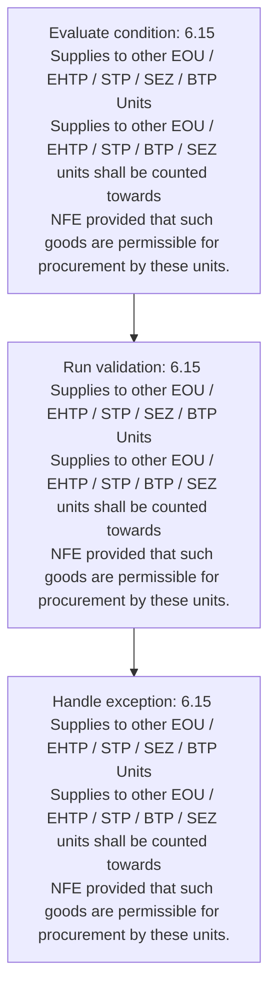
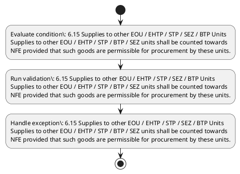

# Chapter 6 / Section 6.15: Supplies to other EOU / EHTP / STP / SEZ / BTP Units

**Chapter Title:** Export Oriented Units (EOUs), Electronics Hardware Technology Parks (EHTPs), Software Technology Parks (STPs) and Bio-Technology

**Pages:** 10

**Purpose:** 6.15 Supplies to other EOU / EHTP / STP / SEZ / BTP Units
Supplies to other EOU / EHTP / STP / BTP / SEZ units shall be counted towards
NFE provided that such goods are permissible for procurement by these units.

**Purpose Thanglish:** Indha Supplies to other EOU / EHTP / STP / SEZ / BTP Units section-la, 6.15 Supplies to other EOU / EHTP / STP / SEZ / BTP Units
Supplies to other EOU / EHTP / STP / BTP / SEZ units kandippa be counted towards
NFE provided that such goods are permissible for procurement by these units.

**Summary:** 6.15 Supplies to other EOU / EHTP / STP / SEZ / BTP Units
Supplies to other EOU / EHTP / STP / BTP / SEZ units shall be counted towards
NFE provided that such goods are permissible for procurement by these units.

**Business Meaning:** Supplies to other EOU / EHTP / STP / SEZ / BTP Units governs how DGFT business controls should be applied, validated, and enforced.

**Business Explanation:** Supplies to other EOU / EHTP / STP / SEZ / BTP Units explains the operating rule set that DEKAI should enforce. Key control points include 6.15 Supplies to other EOU / EHTP / STP / SEZ / BTP Units
Supplies to other EOU / EHTP / STP / BTP / SEZ units shall be counted towards
NFE provided that such goods are permissible for procurement by these units.

**Business Explanation Thanglish:** Indha Supplies to other EOU / EHTP / STP / SEZ / BTP Units section-la, Supplies to other EOU / EHTP / STP / SEZ / BTP Units explains the operating rule set that DEKAI should enforce. Key control points include 6.15 Supplies to other EOU / EHTP / STP / SEZ / BTP Units
Supplies to other EOU / EHTP / STP / BTP / SEZ units kandippa be counted towards
NFE provided that such goods are permissible for procurement by these units.

## Business Logic
- 6.15 Supplies to other EOU / EHTP / STP / SEZ / BTP Units
Supplies to other EOU / EHTP / STP / BTP / SEZ units shall be counted towards
NFE provided that such goods are permissible for procurement by these units.

## Business Rules
- rule_id=CH6-SEC6_15-R001, rule_description=6.15 Supplies to other EOU / EHTP / STP / SEZ / BTP Units
Supplies to other EOU / EHTP / STP / BTP / SEZ units shall be counted towards
NFE provided that such goods are permissible for procurement by these units., trigger=Supplies to other EOU / EHTP / STP / SEZ / BTP Units, condition=6.15 Supplies to other EOU / EHTP / STP / SEZ / BTP Units
Supplies to other EOU / EHTP / STP / BTP / SEZ units shall be counted towards
NFE provided that such goods are permissible for procurement by these units., validation=6.15 Supplies to other EOU / EHTP / STP / SEZ / BTP Units
Supplies to other EOU / EHTP / STP / BTP / SEZ units shall be counted towards
NFE provided that such goods are permissible for procurement by these units., action=Manual review required., exception=6.15 Supplies to other EOU / EHTP / STP / SEZ / BTP Units
Supplies to other EOU / EHTP / STP / BTP / SEZ units shall be counted towards
NFE provided that such goods are permissible for procurement by these units., output=DEKAI should produce a compliance decision for 6.15 - Supplies to other EOU / EHTP / STP / SEZ / BTP Units.

## Conditions
- 6.15 Supplies to other EOU / EHTP / STP / SEZ / BTP Units
Supplies to other EOU / EHTP / STP / BTP / SEZ units shall be counted towards
NFE provided that such goods are permissible for procurement by these units.

## Condition Logic
- id=6.6.15.1, if=6.15 Supplies to other EOU / EHTP / STP / SEZ / BTP Units
Supplies to other EOU / EHTP / STP / BTP / SEZ units shall be counted towards
NFE provided that such goods are permissible for procurement by these units., then=Route for review, source=6.15 Supplies to other EOU / EHTP / STP / SEZ / BTP Units
Supplies to other EOU / EHTP / STP / BTP / SEZ units shall be counted towards
NFE provided that such goods are permissible for procurement by these units.

## Validations
- 6.15 Supplies to other EOU / EHTP / STP / SEZ / BTP Units
Supplies to other EOU / EHTP / STP / BTP / SEZ units shall be counted towards
NFE provided that such goods are permissible for procurement by these units.

## Exceptions
- 6.15 Supplies to other EOU / EHTP / STP / SEZ / BTP Units
Supplies to other EOU / EHTP / STP / BTP / SEZ units shall be counted towards
NFE provided that such goods are permissible for procurement by these units.

## Dependencies
- None identified

## Authorities
- None identified

## Required Documents
- None identified

## Timelines
- None identified

## Actions
- None identified

## Workflow
- Evaluate condition: 6.15 Supplies to other EOU / EHTP / STP / SEZ / BTP Units
Supplies to other EOU / EHTP / STP / BTP / SEZ units shall be counted towards
NFE provided that such goods are permissible for procurement by these units.
- Run validation: 6.15 Supplies to other EOU / EHTP / STP / SEZ / BTP Units
Supplies to other EOU / EHTP / STP / BTP / SEZ units shall be counted towards
NFE provided that such goods are permissible for procurement by these units.
- Handle exception: 6.15 Supplies to other EOU / EHTP / STP / SEZ / BTP Units
Supplies to other EOU / EHTP / STP / BTP / SEZ units shall be counted towards
NFE provided that such goods are permissible for procurement by these units.

## Workflow ASCII
```text
Supplies to other EOU / EHTP / STP / SEZ / BTP Units
Evaluate condition: 6.15 Supplies to other EOU / EHTP / STP / SEZ / BTP Units
Supplies to other EOU / EHTP / STP / BTP / SEZ units shall be counted towards
NFE provided that such goods are permissible for procurement by these units.
   |
   v
Run validation: 6.15 Supplies to other EOU / EHTP / STP / SEZ / BTP Units
Supplies to other EOU / EHTP / STP / BTP / SEZ units shall be counted towards
NFE provided that such goods are permissible for procurement by these units.
   |
   v
Handle exception: 6.15 Supplies to other EOU / EHTP / STP / SEZ / BTP Units
Supplies to other EOU / EHTP / STP / BTP / SEZ units shall be counted towards
NFE provided that such goods are permissible for procurement by these units.
```

## Decision Tree
- IF exception applies (6.15 Supplies to other EOU / EHTP / STP / SEZ / BTP Units
Supplies to other EOU / EHTP / STP / BTP / SEZ units shall be counted towards
NFE provided that such goods are permissible for procurement by these units.) THEN route to manual review

## Decision Tree ASCII
```text
Supplies to other EOU / EHTP / STP / SEZ / BTP Units Decision
IF exception applies (6.15 Supplies to other EOU / EHTP / STP / SEZ / BTP Units
Supplies to other EOU / EHTP / STP / BTP / SEZ units shall be counted towards
NFE provided that such goods are permissible for procurement by these units.) THEN route to manual review
```

## Examples
- User asks to process Supplies to other EOU / EHTP / STP / SEZ / BTP Units; the platform checks conditions, validations, and documents before action.

**Real-world Example:** Example: an importer or exporter invokes Supplies to other EOU / EHTP / STP / SEZ / BTP Units, submits the prescribed DGFT records, and DEKAI uses the extracted rules to follow the supplies to other eou / ehtp / stp / sez / btp units process.

**Real-world Example Thanglish:** Indha Supplies to other EOU / EHTP / STP / SEZ / BTP Units section-la, Example: an importer or exporter invokes Supplies to other EOU / EHTP / STP / SEZ / BTP Units, submits the prescribed DGFT records, and DEKAI uses the extracted rules to follow the supplies to other eou / ehtp / stp / sez / btp units process.

## AI Rules
- IF detected context matches section rule THEN enforce: 6.15 Supplies to other EOU / EHTP / STP / SEZ / BTP Units
Supplies to other EOU / EHTP / STP / BTP / SEZ units shall be counted towards
NFE provided that such goods are permissible for procurement by these units.

## Database Fields
- name=section_code, type=string, required=True, source=parsed_section_heading
- name=section_title, type=string, required=True, source=parsed_section_heading
- name=eou_flag, type=boolean, required=False, source=keyword:EOU
- name=stp_flag, type=boolean, required=False, source=keyword:STP
- name=sez_flag, type=boolean, required=False, source=keyword:SEZ
- name=btp_flag, type=boolean, required=False, source=keyword:BTP
- name=nfe_flag, type=boolean, required=False, source=keyword:NFE
- name=are_flag, type=boolean, required=False, source=keyword:are
- name=for_flag, type=boolean, required=False, source=keyword:for
- name=ehtp_flag, type=boolean, required=False, source=keyword:EHTP

## API Requirements
- method=GET, path=/api/dgft/sections/6.15, purpose=Retrieve knowledge payload for section 6.15, query_params=['include=workflow,decision_tree,validations'], response_fields=['section', 'title', 'summary', 'conditions', 'validations', 'exceptions', 'workflow', 'decision_tree']
- method=POST, path=/api/dgft/Supplies-to-other-EOU-EHTP-STP-SEZ-BTP-Units/validate, purpose=Validate inputs and documents for Supplies to other EOU / EHTP / STP / SEZ / BTP Units, request_fields=['section_code', 'section_title'], response_fields=['status', 'errors', 'warnings', 'next_actions']

## UI Screens
- screen_id=Supplies_to_other_EOU_EHTP_STP_SEZ_BTP_Units_overview, name=Supplies to other EOU / EHTP / STP / SEZ / BTP Units Overview, purpose=Show section summary, authority, timeline, and eligibility cues., widgets=['summary_card', 'conditions_table', 'authority_badges', 'timeline_panel']
- screen_id=Supplies_to_other_EOU_EHTP_STP_SEZ_BTP_Units_submission, name=Supplies to other EOU / EHTP / STP / SEZ / BTP Units Submission, purpose=Capture applicant data and supporting documents., widgets=['dynamic_form', 'document_uploader', 'validation_panel', 'next_action_footer'], fields=['section_code', 'section_title', 'eou_flag', 'stp_flag', 'sez_flag', 'btp_flag', 'nfe_flag', 'are_flag']
- screen_id=Supplies_to_other_EOU_EHTP_STP_SEZ_BTP_Units_exceptions, name=Supplies to other EOU / EHTP / STP / SEZ / BTP Units Exception Review, purpose=Explain exception handling and manual review triggers., widgets=['exception_banner', 'decision_tree', 'case_notes']

## Error Messages
- Validation failed because the section requirements were not fully met.

## FAQ
- question_en=What is the purpose of section 6.15?, answer_en=Supplies to other EOU / EHTP / STP / SEZ / BTP Units explains the operating rule set that DEKAI should enforce. Key control points include 6.15 Supplies to other EOU / EHTP / STP / SEZ / BTP Units
Supplies to other EOU / EHTP / STP / BTP / SEZ units shall be counted towards
NFE provided that such goods are permissible for procurement by these units., question_thanglish=Indha Supplies to other EOU / EHTP / STP / SEZ / BTP Units section-la, What is the purpose of section 6.15?, answer_thanglish=Indha Supplies to other EOU / EHTP / STP / SEZ / BTP Units section-la, Supplies to other EOU / EHTP / STP / SEZ / BTP Units explains the operating rule set that DEKAI should enforce. Key control points include 6.15 Supplies to other EOU / EHTP / STP / SEZ / BTP Units
Supplies to other EOU / EHTP / STP / BTP / SEZ units kandippa be counted towards
NFE provided that such goods are permissible for procurement by these units.
- question_en=What documents are required under Supplies to other EOU / EHTP / STP / SEZ / BTP Units?, answer_en=Not explicitly covered in uploaded documents., question_thanglish=Indha Supplies to other EOU / EHTP / STP / SEZ / BTP Units section-la, What documents are required under Supplies to other EOU / EHTP / STP / SEZ / BTP Units?, answer_thanglish=Indha Supplies to other EOU / EHTP / STP / SEZ / BTP Units section-la, Not explicitly covered in uploaded documents.
- question_en=Which authority handles Supplies to other EOU / EHTP / STP / SEZ / BTP Units?, answer_en=Not explicitly covered in uploaded documents., question_thanglish=Indha Supplies to other EOU / EHTP / STP / SEZ / BTP Units section-la, Which authority handles Supplies to other EOU / EHTP / STP / SEZ / BTP Units?, answer_thanglish=Indha Supplies to other EOU / EHTP / STP / SEZ / BTP Units section-la, Not explicitly covered in uploaded documents.

## Questions Users May Ask
- What does Supplies to other EOU / EHTP / STP / SEZ / BTP Units require?
- Which documents are needed for Supplies to other EOU / EHTP / STP / SEZ / BTP Units?
- How does DEKAI validate Supplies to other EOU / EHTP / STP / SEZ / BTP Units requests?

## Expected AI Answers
- Supplies to other EOU / EHTP / STP / SEZ / BTP Units requires the platform to interpret the section text, apply the extracted business rules, and present the correct next action.
- Required documents are inferred from the section text: no explicit documents were detected.
- DEKAI validates Supplies to other EOU / EHTP / STP / SEZ / BTP Units by checking conditions, required documents, authority references, and exception clauses before recommending an outcome.

## AI Q&A Examples
- question_en=User asks: How do I comply with Supplies to other EOU / EHTP / STP / SEZ / BTP Units?, answer_en=AI answers: DEKAI should evaluate section 6.15, apply the extracted rules, and guide the user through Evaluate condition: 6.15 Supplies to other EOU / EHTP / STP / SEZ / BTP Units
Supplies to other EOU / EHTP / STP / BTP / SEZ units shall be counted towards
NFE provided that such goods are permissible for procurement by these units.., question_thanglish=Indha Supplies to other EOU / EHTP / STP / SEZ / BTP Units section-la, User asks: How do I comply with Supplies to other EOU / EHTP / STP / SEZ / BTP Units?, answer_thanglish=Indha Supplies to other EOU / EHTP / STP / SEZ / BTP Units section-la, AI answers: DEKAI should evaluate section 6.15, apply the extracted rules, and guide the user through Evaluate condition: 6.15 Supplies to other EOU / EHTP / STP / SEZ / BTP Units
Supplies to other EOU / EHTP / STP / BTP / SEZ units kandippa be counted towards
NFE provided that such goods are permissible for procurement by these units..
- question_en=User asks: Which validations apply to Supplies to other EOU / EHTP / STP / SEZ / BTP Units?, answer_en=AI answers: Applicable validations are 6.15 Supplies to other EOU / EHTP / STP / SEZ / BTP Units
Supplies to other EOU / EHTP / STP / BTP / SEZ units shall be counted towards
NFE provided that such goods are permissible for procurement by these units., question_thanglish=Indha Supplies to other EOU / EHTP / STP / SEZ / BTP Units section-la, User asks: Which validations apply to Supplies to other EOU / EHTP / STP / SEZ / BTP Units?, answer_thanglish=Indha Supplies to other EOU / EHTP / STP / SEZ / BTP Units section-la, AI answers: Applicable validations are 6.15 Supplies to other EOU / EHTP / STP / SEZ / BTP Units
Supplies to other EOU / EHTP / STP / BTP / SEZ units kandippa be counted towards
NFE provided that such goods are permissible for procurement by these units.

## DEKAI AI Implementation Notes
- Capture chapter 6, section 6.15, title, and page references as immutable knowledge metadata.
- Bind validations for Supplies to other EOU / EHTP / STP / SEZ / BTP Units into a rule engine keyed by the rule IDs extracted for this section.
- Trigger manual review when exception clauses are detected.

## DEKAI AI Implementation Notes Thanglish
- Indha Supplies to other EOU / EHTP / STP / SEZ / BTP Units section-la, Capture chapter 6, section 6.15, title, and page references as immutable knowledge metadata.
- Indha Supplies to other EOU / EHTP / STP / SEZ / BTP Units section-la, Bind validations for Supplies to other EOU / EHTP / STP / SEZ / BTP Units into a rule engine keyed by the rule IDs extracted for this section.
- Indha Supplies to other EOU / EHTP / STP / SEZ / BTP Units section-la, Trigger manual review when exception clauses are detected.

## AI Metadata
- Keywords: EOU, STP, SEZ, BTP, NFE, are, for, EHTP, that, such, other, Units, shall, goods, these, counted, towards, Supplies, provided, permissible
- Search Keywords: EOU, STP, SEZ, BTP, NFE, are, for, EHTP, that, such, other, Units, shall, goods, these, counted, towards, Supplies, provided, permissible
- Intent: Provide knowledge guidance for Supplies to other EOU / EHTP / STP / SEZ / BTP Units.
- Tags: 6.15, Supplies to other EOU / EHTP / STP / SEZ / BTP Units, business-rule, dgft
- Related Sections: 
- Related Chapters: 
- Related Rules: 6.15 Supplies to other EOU / EHTP / STP / SEZ / BTP Units
Supplies to other EOU / EHTP / STP / BTP / SEZ units shall be counted towards
NFE provided that such goods are permissible for procurement by these units.

## Mermaid


## PlantUML

