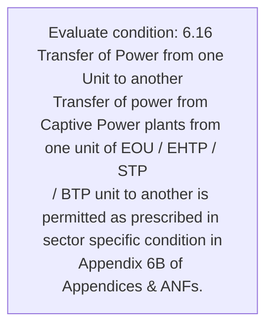
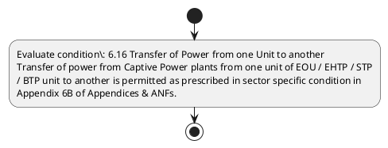

# Chapter 6 / Section 6.16: Transfer of Power from one Unit to another

**Chapter Title:** Export Oriented Units (EOUs), Electronics Hardware Technology Parks (EHTPs), Software Technology Parks (STPs) and Bio-Technology

**Pages:** 10

**Purpose:** 6.16 Transfer of Power from one Unit to another
Transfer of power from Captive Power plants from one unit of EOU / EHTP / STP
/ BTP unit to another is permitted as prescribed in sector specific condition in
Appendix 6B of Appendices & ANFs.

**Purpose Thanglish:** Indha Transfer of Power from one Unit to another section-la, 6.16 Transfer of Power from one Unit to another
Transfer of power from Captive Power plants from one unit of EOU / EHTP / STP
/ BTP unit to another is permitted as prescribed in sector specific condition in
Appendix 6B of Appendices & ANFs.

**Summary:** 6.16 Transfer of Power from one Unit to another
Transfer of power from Captive Power plants from one unit of EOU / EHTP / STP
/ BTP unit to another is permitted as prescribed in sector specific condition in
Appendix 6B of Appendices & ANFs.

**Business Meaning:** 6.16 Transfer of Power from one Unit to another
Transfer of power from Captive Power plants from one unit of EOU / EHTP / STP
/ BTP unit to another is permitted as prescribed in sector specific condition in
Appendix 6B of Appendices & ANFs.

**Business Explanation:** 6.16 Transfer of Power from one Unit to another
Transfer of power from Captive Power plants from one unit of EOU / EHTP / STP
/ BTP unit to another is permitted as prescribed in sector specific condition in
Appendix 6B of Appendices & ANFs.

**Business Explanation Thanglish:** Indha Transfer of Power from one Unit to another section-la, 6.16 Transfer of Power from one Unit to another
Transfer of power from Captive Power plants from one unit of EOU / EHTP / STP
/ BTP unit to another is permitted as prescribed in sector specific condition in
Appendix 6B of Appendices & ANFs.

## Business Logic
- None identified

## Business Rules
- rule_id=CH6-SEC6_16-R001, rule_description=6.16 Transfer of Power from one Unit to another
Transfer of power from Captive Power plants from one unit of EOU / EHTP / STP
/ BTP unit to another is permitted as prescribed in sector specific condition in
Appendix 6B of Appendices & ANFs., trigger=Transfer of Power from one Unit to another, condition=6.16 Transfer of Power from one Unit to another
Transfer of power from Captive Power plants from one unit of EOU / EHTP / STP
/ BTP unit to another is permitted as prescribed in sector specific condition in
Appendix 6B of Appendices & ANFs., validation=Not explicitly covered in uploaded documents., action=Manual review required., exception=No explicit exception found in uploaded documents., output=DEKAI should produce a compliance decision for 6.16 - Transfer of Power from one Unit to another.

## Conditions
- 6.16 Transfer of Power from one Unit to another
Transfer of power from Captive Power plants from one unit of EOU / EHTP / STP
/ BTP unit to another is permitted as prescribed in sector specific condition in
Appendix 6B of Appendices & ANFs.

## Condition Logic
- id=6.6.16.1, if=6.16 Transfer of Power from one Unit to another
Transfer of power from Captive Power plants from one unit of EOU / EHTP / STP
/ BTP unit to another is permitted as prescribed in sector specific condition in
Appendix 6B of Appendices & ANFs., then=Route for review, source=6.16 Transfer of Power from one Unit to another
Transfer of power from Captive Power plants from one unit of EOU / EHTP / STP
/ BTP unit to another is permitted as prescribed in sector specific condition in
Appendix 6B of Appendices & ANFs.

## Validations
- None identified

## Exceptions
- None identified

## Dependencies
- None identified

## Authorities
- None identified

## Required Documents
- None identified

## Timelines
- None identified

## Actions
- None identified

## Workflow
- Evaluate condition: 6.16 Transfer of Power from one Unit to another
Transfer of power from Captive Power plants from one unit of EOU / EHTP / STP
/ BTP unit to another is permitted as prescribed in sector specific condition in
Appendix 6B of Appendices & ANFs.

## Workflow ASCII
```text
Transfer of Power from one Unit to another
Evaluate condition: 6.16 Transfer of Power from one Unit to another
Transfer of power from Captive Power plants from one unit of EOU / EHTP / STP
/ BTP unit to another is permitted as prescribed in sector specific condition in
Appendix 6B of Appendices & ANFs.
```

## Decision Tree
- IF section 6.16 applies THEN proceed with standard DGFT workflow

## Decision Tree ASCII
```text
Transfer of Power from one Unit to another Decision
IF section 6.16 applies THEN proceed with standard DGFT workflow
```

## Examples
- User asks to process Transfer of Power from one Unit to another; the platform checks conditions, validations, and documents before action.

**Real-world Example:** Example: an importer or exporter invokes Transfer of Power from one Unit to another, submits the prescribed DGFT records, and DEKAI uses the extracted rules to follow the transfer of power from one unit to another process.

**Real-world Example Thanglish:** Indha Transfer of Power from one Unit to another section-la, Example: an importer or exporter invokes Transfer of Power from one Unit to another, submits the prescribed DGFT records, and DEKAI uses the extracted rules to follow the transfer of power from one unit to another process.

## AI Rules
- None identified

## Database Fields
- name=section_code, type=string, required=True, source=parsed_section_heading
- name=section_title, type=string, required=True, source=parsed_section_heading
- name=one_flag, type=boolean, required=False, source=keyword:one
- name=eou_flag, type=boolean, required=False, source=keyword:EOU
- name=stp_flag, type=boolean, required=False, source=keyword:STP
- name=btp_flag, type=boolean, required=False, source=keyword:BTP
- name=from_flag, type=boolean, required=False, source=keyword:from
- name=unit_flag, type=boolean, required=False, source=keyword:Unit
- name=ehtp_flag, type=boolean, required=False, source=keyword:EHTP
- name=anfs_flag, type=boolean, required=False, source=keyword:ANFs

## API Requirements
- method=GET, path=/api/dgft/sections/6.16, purpose=Retrieve knowledge payload for section 6.16, query_params=['include=workflow,decision_tree,validations'], response_fields=['section', 'title', 'summary', 'conditions', 'validations', 'exceptions', 'workflow', 'decision_tree']
- method=POST, path=/api/dgft/Transfer-of-Power-from-one-Unit-to-another/validate, purpose=Validate inputs and documents for Transfer of Power from one Unit to another, request_fields=['section_code', 'section_title'], response_fields=['status', 'errors', 'warnings', 'next_actions']

## UI Screens
- screen_id=Transfer_of_Power_from_one_Unit_to_another_overview, name=Transfer of Power from one Unit to another Overview, purpose=Show section summary, authority, timeline, and eligibility cues., widgets=['summary_card', 'conditions_table', 'authority_badges', 'timeline_panel']
- screen_id=Transfer_of_Power_from_one_Unit_to_another_submission, name=Transfer of Power from one Unit to another Submission, purpose=Capture applicant data and supporting documents., widgets=['dynamic_form', 'document_uploader', 'validation_panel', 'next_action_footer'], fields=['section_code', 'section_title', 'one_flag', 'eou_flag', 'stp_flag', 'btp_flag', 'from_flag', 'unit_flag']

## Error Messages
- Validation failed because the section requirements were not fully met.

## FAQ
- question_en=What is the purpose of section 6.16?, answer_en=6.16 Transfer of Power from one Unit to another
Transfer of power from Captive Power plants from one unit of EOU / EHTP / STP
/ BTP unit to another is permitted as prescribed in sector specific condition in
Appendix 6B of Appendices & ANFs., question_thanglish=Indha Transfer of Power from one Unit to another section-la, What is the purpose of section 6.16?, answer_thanglish=Indha Transfer of Power from one Unit to another section-la, 6.16 Transfer of Power from one Unit to another
Transfer of power from Captive Power plants from one unit of EOU / EHTP / STP
/ BTP unit to another is permitted as prescribed in sector specific condition in
Appendix 6B of Appendices & ANFs.
- question_en=What documents are required under Transfer of Power from one Unit to another?, answer_en=Not explicitly covered in uploaded documents., question_thanglish=Indha Transfer of Power from one Unit to another section-la, What documents are required under Transfer of Power from one Unit to another?, answer_thanglish=Indha Transfer of Power from one Unit to another section-la, Not explicitly covered in uploaded documents.
- question_en=Which authority handles Transfer of Power from one Unit to another?, answer_en=Not explicitly covered in uploaded documents., question_thanglish=Indha Transfer of Power from one Unit to another section-la, Which authority handles Transfer of Power from one Unit to another?, answer_thanglish=Indha Transfer of Power from one Unit to another section-la, Not explicitly covered in uploaded documents.

## Questions Users May Ask
- What does Transfer of Power from one Unit to another require?
- Which documents are needed for Transfer of Power from one Unit to another?
- How does DEKAI validate Transfer of Power from one Unit to another requests?

## Expected AI Answers
- Transfer of Power from one Unit to another requires the platform to interpret the section text, apply the extracted business rules, and present the correct next action.
- Required documents are inferred from the section text: no explicit documents were detected.
- DEKAI validates Transfer of Power from one Unit to another by checking conditions, required documents, authority references, and exception clauses before recommending an outcome.

## AI Q&A Examples
- question_en=User asks: How do I comply with Transfer of Power from one Unit to another?, answer_en=AI answers: DEKAI should evaluate section 6.16, apply the extracted rules, and guide the user through Evaluate condition: 6.16 Transfer of Power from one Unit to another
Transfer of power from Captive Power plants from one unit of EOU / EHTP / STP
/ BTP unit to another is permitted as prescribed in sector specific condition in
Appendix 6B of Appendices & ANFs.., question_thanglish=Indha Transfer of Power from one Unit to another section-la, User asks: How do I comply with Transfer of Power from one Unit to another?, answer_thanglish=Indha Transfer of Power from one Unit to another section-la, AI answers: DEKAI should evaluate section 6.16, apply the extracted rules, and guide the user through Evaluate condition: 6.16 Transfer of Power from one Unit to another
Transfer of power from Captive Power plants from one unit of EOU / EHTP / STP
/ BTP unit to another is permitted as prescribed in sector specific condition in
Appendix 6B of Appendices & ANFs..
- question_en=User asks: Which validations apply to Transfer of Power from one Unit to another?, answer_en=AI answers: Applicable validations are not explicitly covered in the uploaded documents., question_thanglish=Indha Transfer of Power from one Unit to another section-la, User asks: Which validations apply to Transfer of Power from one Unit to another?, answer_thanglish=Indha Transfer of Power from one Unit to another section-la, AI answers: Applicable validations are not explicitly covered in the uploaded documents.

## DEKAI AI Implementation Notes
- Capture chapter 6, section 6.16, title, and page references as immutable knowledge metadata.
- Bind validations for Transfer of Power from one Unit to another into a rule engine keyed by the rule IDs extracted for this section.

## DEKAI AI Implementation Notes Thanglish
- Indha Transfer of Power from one Unit to another section-la, Capture chapter 6, section 6.16, title, and page references as immutable knowledge metadata.
- Indha Transfer of Power from one Unit to another section-la, Bind validations for Transfer of Power from one Unit to another into a rule engine keyed by the rule IDs extracted for this section.

## AI Metadata
- Keywords: one, EOU, STP, BTP, from, Unit, EHTP, ANFs, Power, plants, sector, another, Captive, Transfer, specific, Appendix, permitted, condition, prescribed, Appendices
- Search Keywords: one, EOU, STP, BTP, from, Unit, EHTP, ANFs, Power, plants, sector, another, Captive, Transfer, specific, Appendix, permitted, condition, prescribed, Appendices
- Intent: Provide knowledge guidance for Transfer of Power from one Unit to another.
- Tags: 6.16, Transfer of Power from one Unit to another, dgft
- Related Sections: 
- Related Chapters: 
- Related Rules: 

## Mermaid


## PlantUML

