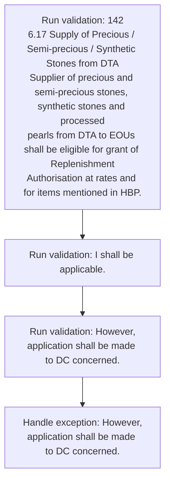
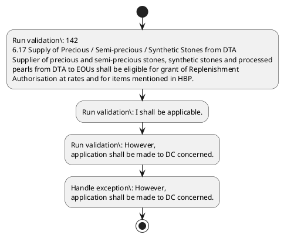

# Chapter 6 / Section 6.17: Supply of Precious / Semi-precious / Synthetic Stones from DTA

**Chapter Title:** Export Oriented Units (EOUs), Electronics Hardware Technology Parks (EHTPs), Software Technology Parks (STPs) and Bio-Technology

**Pages:** 10, 11

**Purpose:** 142
6.17 Supply of Precious / Semi-precious / Synthetic Stones from DTA
Supplier of precious and semi-precious stones, synthetic stones and processed
pearls from DTA to EOUs shall be eligible for grant of Replenishment
Authorisation at rates and for items mentioned in HBP.

**Purpose Thanglish:** Indha Supply of Precious / Semi-precious / Synthetic Stones from DTA section-la, 142
6.17 Supply of Precious / Semi-precious / Synthetic Stones from DTA
Supplier of precious and semi-precious stones, synthetic stones and processed
pearls from DTA to EOUs kandippa be eligible for grant of Replenishment
Authorisation at rates and for items mentioned in HBP.

**Summary:** 6.17 Supply of Precious / Semi-precious / Synthetic Stones from DTA
Supplier of precious and semi-precious stones, synthetic stones and processed
pg. 142
pg. 142
6.17 Supply of Precious / Semi-precious / Synthetic Stones from DTA
Supplier of precious and semi-precious stones, synthetic stones and processed
pearls from DTA to EOUs shall be eligible for grant of Replenishment
Authorisation at rates and for items mentioned in HBP.

**Business Meaning:** Supply of Precious / Semi-precious / Synthetic Stones from DTA governs how DGFT business controls should be applied, validated, and enforced.

**Business Explanation:** Supply of Precious / Semi-precious / Synthetic Stones from DTA explains the operating rule set that DEKAI should enforce. Key control points include 142
6.17 Supply of Precious / Semi-precious / Synthetic Stones from DTA
Supplier of precious and semi-precious stones, synthetic stones and processed
pearls from DTA to EOUs shall be eligible for grant of Replenishment
Authorisation at rates and for items mentioned in HBP.

**Business Explanation Thanglish:** Indha Supply of Precious / Semi-precious / Synthetic Stones from DTA section-la, Supply of Precious / Semi-precious / Synthetic Stones from DTA explains the operating rule set that DEKAI should enforce. Key control points include 142
6.17 Supply of Precious / Semi-precious / Synthetic Stones from DTA
Supplier of precious and semi-precious stones, synthetic stones and processed
pearls from DTA to EOUs kandippa be eligible for grant of Replenishment
Authorisation at rates and for items mentioned in HBP.

## Business Logic
- 142
6.17 Supply of Precious / Semi-precious / Synthetic Stones from DTA
Supplier of precious and semi-precious stones, synthetic stones and processed
pearls from DTA to EOUs shall be eligible for grant of Replenishment
Authorisation at rates and for items mentioned in HBP.
- I shall be applicable.
- However,
application shall be made to DC concerned.
- Such supplies to EOUs are not eligible
for any of deemed export benefits under Chapter 7 of the FTP.

## Business Rules
- rule_id=CH6-SEC6_17-R001, rule_description=142
6.17 Supply of Precious / Semi-precious / Synthetic Stones from DTA
Supplier of precious and semi-precious stones, synthetic stones and processed
pearls from DTA to EOUs shall be eligible for grant of Replenishment
Authorisation at rates and for items mentioned in HBP., trigger=Supply of Precious / Semi-precious / Synthetic Stones from DTA, condition=Not explicitly covered in uploaded documents., validation=142
6.17 Supply of Precious / Semi-precious / Synthetic Stones from DTA
Supplier of precious and semi-precious stones, synthetic stones and processed
pearls from DTA to EOUs shall be eligible for grant of Replenishment
Authorisation at rates and for items mentioned in HBP., action=Manual review required., exception=However,
application shall be made to DC concerned., output=DEKAI should produce a compliance decision for 6.17 - Supply of Precious / Semi-precious / Synthetic Stones from DTA.
- rule_id=CH6-SEC6_17-R002, rule_description=I shall be applicable., trigger=Supply of Precious / Semi-precious / Synthetic Stones from DTA, condition=Not explicitly covered in uploaded documents., validation=I shall be applicable., action=Manual review required., exception=However,
application shall be made to DC concerned., output=DEKAI should produce a compliance decision for 6.17 - Supply of Precious / Semi-precious / Synthetic Stones from DTA.
- rule_id=CH6-SEC6_17-R003, rule_description=However,
application shall be made to DC concerned., trigger=Supply of Precious / Semi-precious / Synthetic Stones from DTA, condition=Not explicitly covered in uploaded documents., validation=However,
application shall be made to DC concerned., action=Manual review required., exception=However,
application shall be made to DC concerned., output=DEKAI should produce a compliance decision for 6.17 - Supply of Precious / Semi-precious / Synthetic Stones from DTA.
- rule_id=CH6-SEC6_17-R004, rule_description=Such supplies to EOUs are not eligible
for any of deemed export benefits under Chapter 7 of the FTP., trigger=Supply of Precious / Semi-precious / Synthetic Stones from DTA, condition=Not explicitly covered in uploaded documents., validation=Such supplies to EOUs are not eligible
for any of deemed export benefits under Chapter 7 of the FTP., action=Manual review required., exception=However,
application shall be made to DC concerned., output=DEKAI should produce a compliance decision for 6.17 - Supply of Precious / Semi-precious / Synthetic Stones from DTA.

## Conditions
- None identified

## Condition Logic
- None identified

## Validations
- 142
6.17 Supply of Precious / Semi-precious / Synthetic Stones from DTA
Supplier of precious and semi-precious stones, synthetic stones and processed
pearls from DTA to EOUs shall be eligible for grant of Replenishment
Authorisation at rates and for items mentioned in HBP.
- I shall be applicable.
- However,
application shall be made to DC concerned.
- Such supplies to EOUs are not eligible
for any of deemed export benefits under Chapter 7 of the FTP.

## Exceptions
- However,
application shall be made to DC concerned.

## Dependencies
- 7

## Authorities
- None identified

## Required Documents
- Procedure for
submission of application for grant of Replenishment Authorisation as
contained in relevant Chapter of HBP Vol.
- However,
application shall be made to DC concerned.

## Timelines
- None identified

## Actions
- None identified

## Workflow
- Run validation: 142
6.17 Supply of Precious / Semi-precious / Synthetic Stones from DTA
Supplier of precious and semi-precious stones, synthetic stones and processed
pearls from DTA to EOUs shall be eligible for grant of Replenishment
Authorisation at rates and for items mentioned in HBP.
- Run validation: I shall be applicable.
- Run validation: However,
application shall be made to DC concerned.
- Handle exception: However,
application shall be made to DC concerned.

## Workflow ASCII
```text
Supply of Precious / Semi-precious / Synthetic Stones from DTA
Run validation: 142
6.17 Supply of Precious / Semi-precious / Synthetic Stones from DTA
Supplier of precious and semi-precious stones, synthetic stones and processed
pearls from DTA to EOUs shall be eligible for grant of Replenishment
Authorisation at rates and for items mentioned in HBP.
   |
   v
Run validation: I shall be applicable.
   |
   v
Run validation: However,
application shall be made to DC concerned.
   |
   v
Handle exception: However,
application shall be made to DC concerned.
```

## Decision Tree
- IF exception applies (However,
application shall be made to DC concerned.) THEN route to manual review

## Decision Tree ASCII
```text
Supply of Precious / Semi-precious / Synthetic Stones from DTA Decision
IF exception applies (However,
application shall be made to DC concerned.) THEN route to manual review
```

## Examples
- User asks to process Supply of Precious / Semi-precious / Synthetic Stones from DTA; the platform checks conditions, validations, and documents before action.

**Real-world Example:** Example: an importer or exporter invokes Supply of Precious / Semi-precious / Synthetic Stones from DTA, submits Procedure for
submission of application for grant of Replenishment Authorisation as
contained in relevant Chapter of HBP Vol., However,
application shall be made to DC concerned., and DEKAI uses the extracted rules to follow the supply of precious / semi-precious / synthetic stones from dta process.

**Real-world Example Thanglish:** Indha Supply of Precious / Semi-precious / Synthetic Stones from DTA section-la, Example: an importer or exporter invokes Supply of Precious / Semi-precious / Synthetic Stones from DTA, submits Procedure for
submission of application for grant of Replenishment Authorisation as
contained in relevant Chapter of HBP Vol., However,
application kandippa be made to DC concerned., and DEKAI uses the extracted rules to follow the supply of precious / semi-precious / synthetic stones from dta process.

## AI Rules
- IF detected context matches section rule THEN enforce: 142
6.17 Supply of Precious / Semi-precious / Synthetic Stones from DTA
Supplier of precious and semi-precious stones, synthetic stones and processed
pearls from DTA to EOUs shall be eligible for grant of Replenishment
Authorisation at rates and for items mentioned in HBP.
- IF detected context matches section rule THEN enforce: I shall be applicable.
- IF detected context matches section rule THEN enforce: However,
application shall be made to DC concerned.
- IF detected context matches section rule THEN enforce: Such supplies to EOUs are not eligible
for any of deemed export benefits under Chapter 7 of the FTP.

## Database Fields
- name=section_code, type=string, required=True, source=parsed_section_heading
- name=section_title, type=string, required=True, source=parsed_section_heading
- name=dta_flag, type=boolean, required=False, source=keyword:DTA
- name=and_flag, type=boolean, required=False, source=keyword:and
- name=for_flag, type=boolean, required=False, source=keyword:for
- name=hbp_flag, type=boolean, required=False, source=keyword:HBP
- name=vol_flag, type=boolean, required=False, source=keyword:Vol
- name=are_flag, type=boolean, required=False, source=keyword:are
- name=not_flag, type=boolean, required=False, source=keyword:not
- name=any_flag, type=boolean, required=False, source=keyword:any
- name=document_1_submitted, type=boolean, required=True, source=Procedure for
submission of application for grant of Replenishment Authorisation as
contained in relevant Chapter of HBP Vol.
- name=document_2_submitted, type=boolean, required=True, source=However,
application shall be made to DC concerned.

## API Requirements
- method=GET, path=/api/dgft/sections/6.17, purpose=Retrieve knowledge payload for section 6.17, query_params=['include=workflow,decision_tree,validations'], response_fields=['section', 'title', 'summary', 'conditions', 'validations', 'exceptions', 'workflow', 'decision_tree']
- method=POST, path=/api/dgft/Supply-of-Precious-Semi-precious-Synthetic-Stones-from-DTA/validate, purpose=Validate inputs and documents for Supply of Precious / Semi-precious / Synthetic Stones from DTA, request_fields=['section_code', 'section_title', 'document_1_submitted', 'document_2_submitted'], response_fields=['status', 'errors', 'warnings', 'next_actions']

## UI Screens
- screen_id=Supply_of_Precious_Semi_precious_Synthetic_Stones_from_DTA_overview, name=Supply of Precious / Semi-precious / Synthetic Stones from DTA Overview, purpose=Show section summary, authority, timeline, and eligibility cues., widgets=['summary_card', 'conditions_table', 'authority_badges', 'timeline_panel']
- screen_id=Supply_of_Precious_Semi_precious_Synthetic_Stones_from_DTA_submission, name=Supply of Precious / Semi-precious / Synthetic Stones from DTA Submission, purpose=Capture applicant data and supporting documents., widgets=['dynamic_form', 'document_uploader', 'validation_panel', 'next_action_footer'], fields=['section_code', 'section_title', 'dta_flag', 'and_flag', 'for_flag', 'hbp_flag', 'vol_flag', 'are_flag']
- screen_id=Supply_of_Precious_Semi_precious_Synthetic_Stones_from_DTA_exceptions, name=Supply of Precious / Semi-precious / Synthetic Stones from DTA Exception Review, purpose=Explain exception handling and manual review triggers., widgets=['exception_banner', 'decision_tree', 'case_notes']

## Error Messages
- Validation failed because the section requirements were not fully met.

## FAQ
- question_en=What is the purpose of section 6.17?, answer_en=Supply of Precious / Semi-precious / Synthetic Stones from DTA explains the operating rule set that DEKAI should enforce. Key control points include 142
6.17 Supply of Precious / Semi-precious / Synthetic Stones from DTA
Supplier of precious and semi-precious stones, synthetic stones and processed
pearls from DTA to EOUs shall be eligible for grant of Replenishment
Authorisation at rates and for items mentioned in HBP., question_thanglish=Indha Supply of Precious / Semi-precious / Synthetic Stones from DTA section-la, What is the purpose of section 6.17?, answer_thanglish=Indha Supply of Precious / Semi-precious / Synthetic Stones from DTA section-la, Supply of Precious / Semi-precious / Synthetic Stones from DTA explains the operating rule set that DEKAI should enforce. Key control points include 142
6.17 Supply of Precious / Semi-precious / Synthetic Stones from DTA
Supplier of precious and semi-precious stones, synthetic stones and processed
pearls from DTA to EOUs kandippa be eligible for grant of Replenishment
Authorisation at rates and for items mentioned in HBP.
- question_en=What documents are required under Supply of Precious / Semi-precious / Synthetic Stones from DTA?, answer_en=Procedure for
submission of application for grant of Replenishment Authorisation as
contained in relevant Chapter of HBP Vol., However,
application shall be made to DC concerned., question_thanglish=Indha Supply of Precious / Semi-precious / Synthetic Stones from DTA section-la, What documents are required under Supply of Precious / Semi-precious / Synthetic Stones from DTA?, answer_thanglish=Indha Supply of Precious / Semi-precious / Synthetic Stones from DTA section-la, Procedure for
submission of application for grant of Replenishment Authorisation as
contained in relevant Chapter of HBP Vol., However,
application kandippa be made to DC concerned.
- question_en=Which authority handles Supply of Precious / Semi-precious / Synthetic Stones from DTA?, answer_en=Not explicitly covered in uploaded documents., question_thanglish=Indha Supply of Precious / Semi-precious / Synthetic Stones from DTA section-la, Which authority handles Supply of Precious / Semi-precious / Synthetic Stones from DTA?, answer_thanglish=Indha Supply of Precious / Semi-precious / Synthetic Stones from DTA section-la, Not explicitly covered in uploaded documents.

## Questions Users May Ask
- What does Supply of Precious / Semi-precious / Synthetic Stones from DTA require?
- Which documents are needed for Supply of Precious / Semi-precious / Synthetic Stones from DTA?
- How does DEKAI validate Supply of Precious / Semi-precious / Synthetic Stones from DTA requests?

## Expected AI Answers
- Supply of Precious / Semi-precious / Synthetic Stones from DTA requires the platform to interpret the section text, apply the extracted business rules, and present the correct next action.
- Required documents are inferred from the section text: Procedure for
submission of application for grant of Replenishment Authorisation as
contained in relevant Chapter of HBP Vol., However,
application shall be made to DC concerned.
- DEKAI validates Supply of Precious / Semi-precious / Synthetic Stones from DTA by checking conditions, required documents, authority references, and exception clauses before recommending an outcome.

## AI Q&A Examples
- question_en=User asks: How do I comply with Supply of Precious / Semi-precious / Synthetic Stones from DTA?, answer_en=AI answers: DEKAI should evaluate section 6.17, apply the extracted rules, and guide the user through Run validation: 142
6.17 Supply of Precious / Semi-precious / Synthetic Stones from DTA
Supplier of precious and semi-precious stones, synthetic stones and processed
pearls from DTA to EOUs shall be eligible for grant of Replenishment
Authorisation at rates and for items mentioned in HBP.., question_thanglish=Indha Supply of Precious / Semi-precious / Synthetic Stones from DTA section-la, User asks: How do I comply with Supply of Precious / Semi-precious / Synthetic Stones from DTA?, answer_thanglish=Indha Supply of Precious / Semi-precious / Synthetic Stones from DTA section-la, AI answers: DEKAI should evaluate section 6.17, apply the extracted rules, and guide the user through Run validation: 142
6.17 Supply of Precious / Semi-precious / Synthetic Stones from DTA
Supplier of precious and semi-precious stones, synthetic stones and processed
pearls from DTA to EOUs kandippa be eligible for grant of Replenishment
Authorisation at rates and for items mentioned in HBP..
- question_en=User asks: Which validations apply to Supply of Precious / Semi-precious / Synthetic Stones from DTA?, answer_en=AI answers: Applicable validations are 142
6.17 Supply of Precious / Semi-precious / Synthetic Stones from DTA
Supplier of precious and semi-precious stones, synthetic stones and processed
pearls from DTA to EOUs shall be eligible for grant of Replenishment
Authorisation at rates and for items mentioned in HBP., I shall be applicable., However,
application shall be made to DC concerned., question_thanglish=Indha Supply of Precious / Semi-precious / Synthetic Stones from DTA section-la, User asks: Which validations apply to Supply of Precious / Semi-precious / Synthetic Stones from DTA?, answer_thanglish=Indha Supply of Precious / Semi-precious / Synthetic Stones from DTA section-la, AI answers: Applicable validations are 142
6.17 Supply of Precious / Semi-precious / Synthetic Stones from DTA
Supplier of precious and semi-precious stones, synthetic stones and processed
pearls from DTA to EOUs kandippa be eligible for grant of Replenishment
Authorisation at rates and for items mentioned in HBP., I kandippa be applicable., However,
application kandippa be made to DC concerned.

## DEKAI AI Implementation Notes
- Capture chapter 6, section 6.17, title, and page references as immutable knowledge metadata.
- Bind validations for Supply of Precious / Semi-precious / Synthetic Stones from DTA into a rule engine keyed by the rule IDs extracted for this section.
- Expose document upload controls for: Procedure for
submission of application for grant of Replenishment Authorisation as
contained in relevant Chapter of HBP Vol., However,
application shall be made to DC concerned..
- Trigger manual review when exception clauses are detected.

## DEKAI AI Implementation Notes Thanglish
- Indha Supply of Precious / Semi-precious / Synthetic Stones from DTA section-la, Capture chapter 6, section 6.17, title, and page references as immutable knowledge metadata.
- Indha Supply of Precious / Semi-precious / Synthetic Stones from DTA section-la, Bind validations for Supply of Precious / Semi-precious / Synthetic Stones from DTA into a rule engine keyed by the rule IDs extracted for this section.
- Indha Supply of Precious / Semi-precious / Synthetic Stones from DTA section-la, Expose document upload controls for: Procedure for
submission of application for grant of Replenishment Authorisation as
contained in relevant Chapter of HBP Vol., However,
application kandippa be made to DC concerned..
- Indha Supply of Precious / Semi-precious / Synthetic Stones from DTA section-la, Trigger manual review when exception clauses are detected.

## AI Metadata
- Keywords: DTA, and, for, HBP, Vol, are, not, any, the, FTP, from, EOUs, made, Such, shall, grant, rates, items, under, Supply
- Search Keywords: DTA, and, for, HBP, Vol, are, not, any, the, FTP, from, EOUs, made, Such, shall, grant, rates, items, under, Supply
- Intent: Provide knowledge guidance for Supply of Precious / Semi-precious / Synthetic Stones from DTA.
- Tags: 6.17, Supply of Precious / Semi-precious / Synthetic Stones from DTA, business-rule, document-driven, dgft
- Related Sections: 
- Related Chapters: 
- Related Rules: 142
6.17 Supply of Precious / Semi-precious / Synthetic Stones from DTA
Supplier of precious and semi-precious stones, synthetic stones and processed
pearls from DTA to EOUs shall be eligible for grant of Replenishment
Authorisation at rates and for items mentioned in HBP., I shall be applicable., However,
application shall be made to DC concerned., Such supplies to EOUs are not eligible
for any of deemed export benefits under Chapter 7 of the FTP.

## Mermaid


## PlantUML

