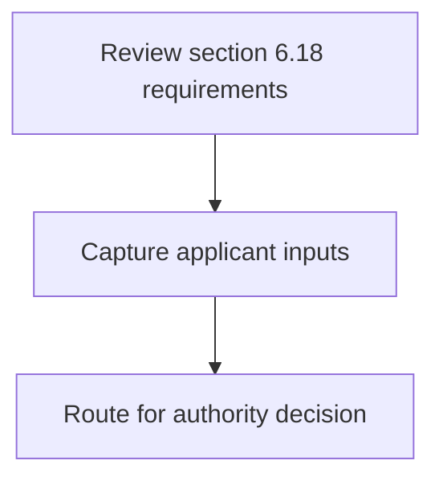
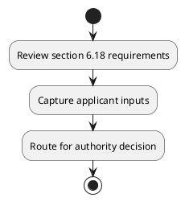

# Chapter 6 / Section 6.18: Application for grant of entitlements

**Chapter Title:** Export Oriented Units (EOUs), Electronics Hardware Technology Parks (EHTPs), Software Technology Parks (STPs) and Bio-Technology

**Pages:** 11

**Purpose:** 6.18 Application for grant of entitlements
Application for grant of all entitlements may be made to DC/Designated Officer
concerned.

**Purpose Thanglish:** Indha Application for grant of entitlements section-la, 6.18 application for grant of entitlements
application for grant of all entitlements may be made to DC/Designated Officer
concerned.

**Summary:** 6.18 Application for grant of entitlements
Application for grant of all entitlements may be made to DC/Designated Officer
concerned.

**Business Meaning:** 6.18 Application for grant of entitlements
Application for grant of all entitlements may be made to DC/Designated Officer
concerned.

**Business Explanation:** 6.18 Application for grant of entitlements
Application for grant of all entitlements may be made to DC/Designated Officer
concerned.

**Business Explanation Thanglish:** Indha Application for grant of entitlements section-la, 6.18 application for grant of entitlements
application for grant of all entitlements may be made to DC/Designated Officer
concerned.

## Business Logic
- None identified

## Business Rules
- rule_id=CH6-SEC6_18-R001, rule_description=6.18 Application for grant of entitlements
Application for grant of all entitlements may be made to DC/Designated Officer
concerned., trigger=Application for grant of entitlements, condition=Not explicitly covered in uploaded documents., validation=Not explicitly covered in uploaded documents., action=Manual review required., exception=No explicit exception found in uploaded documents., output=DEKAI should produce a compliance decision for 6.18 - Application for grant of entitlements.

## Conditions
- None identified

## Condition Logic
- None identified

## Validations
- None identified

## Exceptions
- None identified

## Dependencies
- None identified

## Authorities
- None identified

## Required Documents
- 6.18 Application for grant of entitlements
Application for grant of all entitlements may be made to DC/Designated Officer
concerned.

## Timelines
- None identified

## Actions
- None identified

## Workflow
- Review section 6.18 requirements
- Capture applicant inputs
- Route for authority decision

## Workflow ASCII
```text
Application for grant of entitlements
Review section 6.18 requirements
   |
   v
Capture applicant inputs
   |
   v
Route for authority decision
```

## Decision Tree
- IF section 6.18 applies THEN proceed with standard DGFT workflow

## Decision Tree ASCII
```text
Application for grant of entitlements Decision
IF section 6.18 applies THEN proceed with standard DGFT workflow
```

## Examples
- User asks to process Application for grant of entitlements; the platform checks conditions, validations, and documents before action.

**Real-world Example:** Example: an importer or exporter invokes Application for grant of entitlements, submits 6.18 Application for grant of entitlements
Application for grant of all entitlements may be made to DC/Designated Officer
concerned., and DEKAI uses the extracted rules to follow the application for grant of entitlements process.

**Real-world Example Thanglish:** Indha Application for grant of entitlements section-la, Example: an importer or exporter invokes application for grant of entitlements, submits 6.18 application for grant of entitlements
application for grant of all entitlements may be made to DC/Designated Officer
concerned., and DEKAI uses the extracted rules to follow the application for grant of entitlements process.

## AI Rules
- None identified

## Database Fields
- name=section_code, type=string, required=True, source=parsed_section_heading
- name=section_title, type=string, required=True, source=parsed_section_heading
- name=for_flag, type=boolean, required=False, source=keyword:for
- name=all_flag, type=boolean, required=False, source=keyword:all
- name=may_flag, type=boolean, required=False, source=keyword:may
- name=made_flag, type=boolean, required=False, source=keyword:made
- name=grant_flag, type=boolean, required=False, source=keyword:grant
- name=officer_flag, type=boolean, required=False, source=keyword:Officer
- name=concerned_flag, type=boolean, required=False, source=keyword:concerned
- name=application_flag, type=boolean, required=False, source=keyword:Application
- name=document_1_submitted, type=boolean, required=True, source=6.18 Application for grant of entitlements
Application for grant of all entitlements may be made to DC/Designated Officer
concerned.

## API Requirements
- method=GET, path=/api/dgft/sections/6.18, purpose=Retrieve knowledge payload for section 6.18, query_params=['include=workflow,decision_tree,validations'], response_fields=['section', 'title', 'summary', 'conditions', 'validations', 'exceptions', 'workflow', 'decision_tree']
- method=POST, path=/api/dgft/Application-for-grant-of-entitlements/validate, purpose=Validate inputs and documents for Application for grant of entitlements, request_fields=['section_code', 'section_title', 'document_1_submitted'], response_fields=['status', 'errors', 'warnings', 'next_actions']

## UI Screens
- screen_id=Application_for_grant_of_entitlements_overview, name=Application for grant of entitlements Overview, purpose=Show section summary, authority, timeline, and eligibility cues., widgets=['summary_card', 'conditions_table', 'authority_badges', 'timeline_panel']
- screen_id=Application_for_grant_of_entitlements_submission, name=Application for grant of entitlements Submission, purpose=Capture applicant data and supporting documents., widgets=['dynamic_form', 'document_uploader', 'validation_panel', 'next_action_footer'], fields=['section_code', 'section_title', 'for_flag', 'all_flag', 'may_flag', 'made_flag', 'grant_flag', 'officer_flag']

## Error Messages
- Validation failed because the section requirements were not fully met.

## FAQ
- question_en=What is the purpose of section 6.18?, answer_en=6.18 Application for grant of entitlements
Application for grant of all entitlements may be made to DC/Designated Officer
concerned., question_thanglish=Indha Application for grant of entitlements section-la, What is the purpose of section 6.18?, answer_thanglish=Indha Application for grant of entitlements section-la, 6.18 application for grant of entitlements
application for grant of all entitlements may be made to DC/Designated Officer
concerned.
- question_en=What documents are required under Application for grant of entitlements?, answer_en=6.18 Application for grant of entitlements
Application for grant of all entitlements may be made to DC/Designated Officer
concerned., question_thanglish=Indha Application for grant of entitlements section-la, What documents are required under application for grant of entitlements?, answer_thanglish=Indha Application for grant of entitlements section-la, 6.18 application for grant of entitlements
application for grant of all entitlements may be made to DC/Designated Officer
concerned.
- question_en=Which authority handles Application for grant of entitlements?, answer_en=Not explicitly covered in uploaded documents., question_thanglish=Indha Application for grant of entitlements section-la, Which authority handles application for grant of entitlements?, answer_thanglish=Indha Application for grant of entitlements section-la, Not explicitly covered in uploaded documents.

## Questions Users May Ask
- What does Application for grant of entitlements require?
- Which documents are needed for Application for grant of entitlements?
- How does DEKAI validate Application for grant of entitlements requests?

## Expected AI Answers
- Application for grant of entitlements requires the platform to interpret the section text, apply the extracted business rules, and present the correct next action.
- Required documents are inferred from the section text: 6.18 Application for grant of entitlements
Application for grant of all entitlements may be made to DC/Designated Officer
concerned.
- DEKAI validates Application for grant of entitlements by checking conditions, required documents, authority references, and exception clauses before recommending an outcome.

## AI Q&A Examples
- question_en=User asks: How do I comply with Application for grant of entitlements?, answer_en=AI answers: DEKAI should evaluate section 6.18, apply the extracted rules, and guide the user through Review section 6.18 requirements., question_thanglish=Indha Application for grant of entitlements section-la, User asks: How do I comply with application for grant of entitlements?, answer_thanglish=Indha Application for grant of entitlements section-la, AI answers: DEKAI should evaluate section 6.18, apply the extracted rules, and guide the user through Review section 6.18 requirements.
- question_en=User asks: Which validations apply to Application for grant of entitlements?, answer_en=AI answers: Applicable validations are not explicitly covered in the uploaded documents., question_thanglish=Indha Application for grant of entitlements section-la, User asks: Which validations apply to application for grant of entitlements?, answer_thanglish=Indha Application for grant of entitlements section-la, AI answers: Applicable validations are not explicitly covered in the uploaded documents.

## DEKAI AI Implementation Notes
- Capture chapter 6, section 6.18, title, and page references as immutable knowledge metadata.
- Bind validations for Application for grant of entitlements into a rule engine keyed by the rule IDs extracted for this section.
- Expose document upload controls for: 6.18 Application for grant of entitlements
Application for grant of all entitlements may be made to DC/Designated Officer
concerned..

## DEKAI AI Implementation Notes Thanglish
- Indha Application for grant of entitlements section-la, Capture chapter 6, section 6.18, title, and page references as immutable knowledge metadata.
- Indha Application for grant of entitlements section-la, Bind validations for application for grant of entitlements into a rule engine keyed by the rule IDs extracted for this section.
- Indha Application for grant of entitlements section-la, Expose document upload controls for: 6.18 application for grant of entitlements
application for grant of all entitlements may be made to DC/Designated Officer
concerned..

## AI Metadata
- Keywords: for, all, may, made, grant, Officer, concerned, Application, entitlements, DC/Designated
- Search Keywords: for, all, may, made, grant, Officer, concerned, Application, entitlements, DC/Designated
- Intent: Provide knowledge guidance for Application for grant of entitlements.
- Tags: 6.18, Application for grant of entitlements, document-driven, dgft
- Related Sections: 
- Related Chapters: 
- Related Rules: 

## Mermaid


## PlantUML

