# Chapter 6 / Section 6.19: Export through Other Exporters

**Chapter Title:** Export Oriented Units (EOUs), Electronics Hardware Technology Parks (EHTPs), Software Technology Parks (STPs) and Bio-Technology

**Pages:** 11

**Purpose:** 6.19 Export through Other Exporters
An EOU / EHTP / STP / BTP unit may export goods manufactured / software
developed by it through other exporter, or any other EOU / EHTP/ STP / BTP /
SEZ unit subject to condition that:
a) Goods shall be produced in EOU / EHTP / STP / BTP unit concerned.

**Purpose Thanglish:** Indha Export through Other Exporters section-la, 6.19 export through Other Exporters
An EOU / EHTP / STP / BTP unit may export goods manufactured / software
developed by it through other exporter, or any other EOU / EHTP/ STP / BTP /
SEZ unit subject to condition that:
a) Goods kandippa be produced in EOU / EHTP / STP / BTP unit concerned.

**Summary:** 6.19 Export through Other Exporters
An EOU / EHTP / STP / BTP unit may export goods manufactured / software
developed by it through other exporter, or any other EOU / EHTP/ STP / BTP /
SEZ unit subject to condition that:
a) Goods shall be produced in EOU / EHTP / STP / BTP unit concerned. b) Level of NFE or any other conditions relating to imports and
exports as prescribed shall continue to be discharged by EOU /
EHTP / STP / BTP unit concerned. c) Export orders so procured shall be executed within parameters of
EOU / EHTP / STP / BTP schemes and goods shall be directly
transferred from unit to port of shipment.

**Business Meaning:** Export through Other Exporters governs how DGFT business controls should be applied, validated, and enforced.

**Business Explanation:** Export through Other Exporters explains the operating rule set that DEKAI should enforce. Key control points include 6.19 Export through Other Exporters
An EOU / EHTP / STP / BTP unit may export goods manufactured / software
developed by it through other exporter, or any other EOU / EHTP/ STP / BTP /
SEZ unit subject to condition that:
a) Goods shall be produced in EOU / EHTP / STP / BTP unit concerned.

**Business Explanation Thanglish:** Indha Export through Other Exporters section-la, export through Other Exporters explains the operating rule set that DEKAI should enforce. Key control points include 6.19 export through Other Exporters
An EOU / EHTP / STP / BTP unit may export goods manufactured / software
developed by it through other exporter, or any other EOU / EHTP/ STP / BTP /
SEZ unit subject to condition that:
a) Goods kandippa be produced in EOU / EHTP / STP / BTP unit concerned.

## Business Logic
- 6.19 Export through Other Exporters
An EOU / EHTP / STP / BTP unit may export goods manufactured / software
developed by it through other exporter, or any other EOU / EHTP/ STP / BTP /
SEZ unit subject to condition that:
a) Goods shall be produced in EOU / EHTP / STP / BTP unit concerned.
- b) Level of NFE or any other conditions relating to imports and
exports as prescribed shall continue to be discharged by EOU /
EHTP / STP / BTP unit concerned.
- c) Export orders so procured shall be executed within parameters of
EOU / EHTP / STP / BTP schemes and goods shall be directly
transferred from unit to port of shipment.
- d) Fulfilment of NFE by EOU / EHTP / STP / BTP units in regard to
such exports shall be reckoned on basis of price at which goods are
supplied by EOUs to other exporter or other EOU / EHTP / STP/
BTP / SEZ unit.
- However, such export shall be counted
towards fulfilment of obligation under this scheme only.
- 6.19 Export through Other Exporters
An EOU / EHTP / STP / BTP unit may export goods manufactured / software
developed by it through other exporter, or any other EOU / EHTP/ STP / BTP /
SEZ unit subject to condition that:
a)
Goods shall be produced in EOU / EHTP / STP / BTP unit concerned.
- b)
Level of NFE or any other conditions relating to imports and
exports as prescribed shall continue to be discharged by EOU /
EHTP / STP / BTP unit concerned.
- c)
Export orders so procured shall be executed within parameters of
EOU / EHTP / STP / BTP schemes and goods shall be directly
transferred from unit to port of shipment.
- d)
Fulfilment of NFE by EOU / EHTP / STP / BTP units in regard to
such exports shall be reckoned on basis of price at which goods are
supplied by EOUs to other exporter or other EOU / EHTP / STP/
BTP / SEZ unit.

## Business Rules
- rule_id=CH6-SEC6_19-R001, rule_description=6.19 Export through Other Exporters
An EOU / EHTP / STP / BTP unit may export goods manufactured / software
developed by it through other exporter, or any other EOU / EHTP/ STP / BTP /
SEZ unit subject to condition that:
a) Goods shall be produced in EOU / EHTP / STP / BTP unit concerned., trigger=Export through Other Exporters, condition=6.19 Export through Other Exporters
An EOU / EHTP / STP / BTP unit may export goods manufactured / software
developed by it through other exporter, or any other EOU / EHTP/ STP / BTP /
SEZ unit subject to condition that:
a) Goods shall be produced in EOU / EHTP / STP / BTP unit concerned., validation=6.19 Export through Other Exporters
An EOU / EHTP / STP / BTP unit may export goods manufactured / software
developed by it through other exporter, or any other EOU / EHTP/ STP / BTP /
SEZ unit subject to condition that:
a) Goods shall be produced in EOU / EHTP / STP / BTP unit concerned., action=Manual review required., exception=However, such export shall be counted
towards fulfilment of obligation under this scheme only., output=DEKAI should produce a compliance decision for 6.19 - Export through Other Exporters.
- rule_id=CH6-SEC6_19-R002, rule_description=b) Level of NFE or any other conditions relating to imports and
exports as prescribed shall continue to be discharged by EOU /
EHTP / STP / BTP unit concerned., trigger=Export through Other Exporters, condition=6.19 Export through Other Exporters
An EOU / EHTP / STP / BTP unit may export goods manufactured / software
developed by it through other exporter, or any other EOU / EHTP/ STP / BTP /
SEZ unit subject to condition that:
a)
Goods shall be produced in EOU / EHTP / STP / BTP unit concerned., validation=b) Level of NFE or any other conditions relating to imports and
exports as prescribed shall continue to be discharged by EOU /
EHTP / STP / BTP unit concerned., action=Manual review required., exception=However, such export shall be counted
towards fulfilment of obligation under this scheme only., output=DEKAI should produce a compliance decision for 6.19 - Export through Other Exporters.
- rule_id=CH6-SEC6_19-R003, rule_description=c) Export orders so procured shall be executed within parameters of
EOU / EHTP / STP / BTP schemes and goods shall be directly
transferred from unit to port of shipment., trigger=Export through Other Exporters, condition=6.19 Export through Other Exporters
An EOU / EHTP / STP / BTP unit may export goods manufactured / software
developed by it through other exporter, or any other EOU / EHTP/ STP / BTP /
SEZ unit subject to condition that:
a)
Goods shall be produced in EOU / EHTP / STP / BTP unit concerned., validation=c) Export orders so procured shall be executed within parameters of
EOU / EHTP / STP / BTP schemes and goods shall be directly
transferred from unit to port of shipment., action=Manual review required., exception=However, such export shall be counted
towards fulfilment of obligation under this scheme only., output=DEKAI should produce a compliance decision for 6.19 - Export through Other Exporters.
- rule_id=CH6-SEC6_19-R004, rule_description=d) Fulfilment of NFE by EOU / EHTP / STP / BTP units in regard to
such exports shall be reckoned on basis of price at which goods are
supplied by EOUs to other exporter or other EOU / EHTP / STP/
BTP / SEZ unit., trigger=Export through Other Exporters, condition=6.19 Export through Other Exporters
An EOU / EHTP / STP / BTP unit may export goods manufactured / software
developed by it through other exporter, or any other EOU / EHTP/ STP / BTP /
SEZ unit subject to condition that:
a)
Goods shall be produced in EOU / EHTP / STP / BTP unit concerned., validation=d) Fulfilment of NFE by EOU / EHTP / STP / BTP units in regard to
such exports shall be reckoned on basis of price at which goods are
supplied by EOUs to other exporter or other EOU / EHTP / STP/
BTP / SEZ unit., action=Manual review required., exception=However, such export shall be counted
towards fulfilment of obligation under this scheme only., output=DEKAI should produce a compliance decision for 6.19 - Export through Other Exporters.
- rule_id=CH6-SEC6_19-R005, rule_description=However, such export shall be counted
towards fulfilment of obligation under this scheme only., trigger=Export through Other Exporters, condition=6.19 Export through Other Exporters
An EOU / EHTP / STP / BTP unit may export goods manufactured / software
developed by it through other exporter, or any other EOU / EHTP/ STP / BTP /
SEZ unit subject to condition that:
a)
Goods shall be produced in EOU / EHTP / STP / BTP unit concerned., validation=However, such export shall be counted
towards fulfilment of obligation under this scheme only., action=Manual review required., exception=However, such export shall be counted
towards fulfilment of obligation under this scheme only., output=DEKAI should produce a compliance decision for 6.19 - Export through Other Exporters.
- rule_id=CH6-SEC6_19-R006, rule_description=6.19 Export through Other Exporters
An EOU / EHTP / STP / BTP unit may export goods manufactured / software
developed by it through other exporter, or any other EOU / EHTP/ STP / BTP /
SEZ unit subject to condition that:
a)
Goods shall be produced in EOU / EHTP / STP / BTP unit concerned., trigger=Export through Other Exporters, condition=6.19 Export through Other Exporters
An EOU / EHTP / STP / BTP unit may export goods manufactured / software
developed by it through other exporter, or any other EOU / EHTP/ STP / BTP /
SEZ unit subject to condition that:
a)
Goods shall be produced in EOU / EHTP / STP / BTP unit concerned., validation=6.19 Export through Other Exporters
An EOU / EHTP / STP / BTP unit may export goods manufactured / software
developed by it through other exporter, or any other EOU / EHTP/ STP / BTP /
SEZ unit subject to condition that:
a)
Goods shall be produced in EOU / EHTP / STP / BTP unit concerned., action=Manual review required., exception=However, such export shall be counted
towards fulfilment of obligation under this scheme only., output=DEKAI should produce a compliance decision for 6.19 - Export through Other Exporters.
- rule_id=CH6-SEC6_19-R007, rule_description=b)
Level of NFE or any other conditions relating to imports and
exports as prescribed shall continue to be discharged by EOU /
EHTP / STP / BTP unit concerned., trigger=Export through Other Exporters, condition=6.19 Export through Other Exporters
An EOU / EHTP / STP / BTP unit may export goods manufactured / software
developed by it through other exporter, or any other EOU / EHTP/ STP / BTP /
SEZ unit subject to condition that:
a)
Goods shall be produced in EOU / EHTP / STP / BTP unit concerned., validation=b)
Level of NFE or any other conditions relating to imports and
exports as prescribed shall continue to be discharged by EOU /
EHTP / STP / BTP unit concerned., action=Manual review required., exception=However, such export shall be counted
towards fulfilment of obligation under this scheme only., output=DEKAI should produce a compliance decision for 6.19 - Export through Other Exporters.
- rule_id=CH6-SEC6_19-R008, rule_description=c)
Export orders so procured shall be executed within parameters of
EOU / EHTP / STP / BTP schemes and goods shall be directly
transferred from unit to port of shipment., trigger=Export through Other Exporters, condition=6.19 Export through Other Exporters
An EOU / EHTP / STP / BTP unit may export goods manufactured / software
developed by it through other exporter, or any other EOU / EHTP/ STP / BTP /
SEZ unit subject to condition that:
a)
Goods shall be produced in EOU / EHTP / STP / BTP unit concerned., validation=c)
Export orders so procured shall be executed within parameters of
EOU / EHTP / STP / BTP schemes and goods shall be directly
transferred from unit to port of shipment., action=Manual review required., exception=However, such export shall be counted
towards fulfilment of obligation under this scheme only., output=DEKAI should produce a compliance decision for 6.19 - Export through Other Exporters.
- rule_id=CH6-SEC6_19-R009, rule_description=d)
Fulfilment of NFE by EOU / EHTP / STP / BTP units in regard to
such exports shall be reckoned on basis of price at which goods are
supplied by EOUs to other exporter or other EOU / EHTP / STP/
BTP / SEZ unit., trigger=Export through Other Exporters, condition=6.19 Export through Other Exporters
An EOU / EHTP / STP / BTP unit may export goods manufactured / software
developed by it through other exporter, or any other EOU / EHTP/ STP / BTP /
SEZ unit subject to condition that:
a)
Goods shall be produced in EOU / EHTP / STP / BTP unit concerned., validation=d)
Fulfilment of NFE by EOU / EHTP / STP / BTP units in regard to
such exports shall be reckoned on basis of price at which goods are
supplied by EOUs to other exporter or other EOU / EHTP / STP/
BTP / SEZ unit., action=Manual review required., exception=However, such export shall be counted
towards fulfilment of obligation under this scheme only., output=DEKAI should produce a compliance decision for 6.19 - Export through Other Exporters.

## Conditions
- 6.19 Export through Other Exporters
An EOU / EHTP / STP / BTP unit may export goods manufactured / software
developed by it through other exporter, or any other EOU / EHTP/ STP / BTP /
SEZ unit subject to condition that:
a) Goods shall be produced in EOU / EHTP / STP / BTP unit concerned.
- 6.19 Export through Other Exporters
An EOU / EHTP / STP / BTP unit may export goods manufactured / software
developed by it through other exporter, or any other EOU / EHTP/ STP / BTP /
SEZ unit subject to condition that:
a)
Goods shall be produced in EOU / EHTP / STP / BTP unit concerned.

## Condition Logic
- id=6.6.19.1, if=6.19 Export through Other Exporters
An EOU / EHTP / STP / BTP unit may export goods manufactured / software
developed by it through other exporter, or any other EOU / EHTP/ STP / BTP /
SEZ unit subject to condition that:
a) Goods shall be produced in EOU / EHTP / STP / BTP unit concerned., then=Route for review, source=6.19 Export through Other Exporters
An EOU / EHTP / STP / BTP unit may export goods manufactured / software
developed by it through other exporter, or any other EOU / EHTP/ STP / BTP /
SEZ unit subject to condition that:
a) Goods shall be produced in EOU / EHTP / STP / BTP unit concerned.
- id=6.6.19.2, if=6.19 Export through Other Exporters
An EOU / EHTP / STP / BTP unit may export goods manufactured / software
developed by it through other exporter, or any other EOU / EHTP/ STP / BTP /
SEZ unit subject to condition that:
a)
Goods shall be produced in EOU / EHTP / STP / BTP unit concerned., then=Route for review, source=6.19 Export through Other Exporters
An EOU / EHTP / STP / BTP unit may export goods manufactured / software
developed by it through other exporter, or any other EOU / EHTP/ STP / BTP /
SEZ unit subject to condition that:
a)
Goods shall be produced in EOU / EHTP / STP / BTP unit concerned.

## Validations
- 6.19 Export through Other Exporters
An EOU / EHTP / STP / BTP unit may export goods manufactured / software
developed by it through other exporter, or any other EOU / EHTP/ STP / BTP /
SEZ unit subject to condition that:
a) Goods shall be produced in EOU / EHTP / STP / BTP unit concerned.
- b) Level of NFE or any other conditions relating to imports and
exports as prescribed shall continue to be discharged by EOU /
EHTP / STP / BTP unit concerned.
- c) Export orders so procured shall be executed within parameters of
EOU / EHTP / STP / BTP schemes and goods shall be directly
transferred from unit to port of shipment.
- d) Fulfilment of NFE by EOU / EHTP / STP / BTP units in regard to
such exports shall be reckoned on basis of price at which goods are
supplied by EOUs to other exporter or other EOU / EHTP / STP/
BTP / SEZ unit.
- However, such export shall be counted
towards fulfilment of obligation under this scheme only.
- 6.19 Export through Other Exporters
An EOU / EHTP / STP / BTP unit may export goods manufactured / software
developed by it through other exporter, or any other EOU / EHTP/ STP / BTP /
SEZ unit subject to condition that:
a)
Goods shall be produced in EOU / EHTP / STP / BTP unit concerned.
- b)
Level of NFE or any other conditions relating to imports and
exports as prescribed shall continue to be discharged by EOU /
EHTP / STP / BTP unit concerned.
- c)
Export orders so procured shall be executed within parameters of
EOU / EHTP / STP / BTP schemes and goods shall be directly
transferred from unit to port of shipment.
- d)
Fulfilment of NFE by EOU / EHTP / STP / BTP units in regard to
such exports shall be reckoned on basis of price at which goods are
supplied by EOUs to other exporter or other EOU / EHTP / STP/
BTP / SEZ unit.

## Exceptions
- However, such export shall be counted
towards fulfilment of obligation under this scheme only.

## Dependencies
- None identified

## Authorities
- None identified

## Required Documents
- None identified

## Timelines
- c) Export orders so procured shall be executed within parameters of
EOU / EHTP / STP / BTP schemes and goods shall be directly
transferred from unit to port of shipment.
- c)
Export orders so procured shall be executed within parameters of
EOU / EHTP / STP / BTP schemes and goods shall be directly
transferred from unit to port of shipment.

## Actions
- None identified

## Workflow
- Evaluate condition: 6.19 Export through Other Exporters
An EOU / EHTP / STP / BTP unit may export goods manufactured / software
developed by it through other exporter, or any other EOU / EHTP/ STP / BTP /
SEZ unit subject to condition that:
a) Goods shall be produced in EOU / EHTP / STP / BTP unit concerned.
- Evaluate condition: 6.19 Export through Other Exporters
An EOU / EHTP / STP / BTP unit may export goods manufactured / software
developed by it through other exporter, or any other EOU / EHTP/ STP / BTP /
SEZ unit subject to condition that:
a)
Goods shall be produced in EOU / EHTP / STP / BTP unit concerned.
- Run validation: 6.19 Export through Other Exporters
An EOU / EHTP / STP / BTP unit may export goods manufactured / software
developed by it through other exporter, or any other EOU / EHTP/ STP / BTP /
SEZ unit subject to condition that:
a) Goods shall be produced in EOU / EHTP / STP / BTP unit concerned.
- Run validation: b) Level of NFE or any other conditions relating to imports and
exports as prescribed shall continue to be discharged by EOU /
EHTP / STP / BTP unit concerned.
- Run validation: c) Export orders so procured shall be executed within parameters of
EOU / EHTP / STP / BTP schemes and goods shall be directly
transferred from unit to port of shipment.
- Handle exception: However, such export shall be counted
towards fulfilment of obligation under this scheme only.

## Workflow ASCII
```text
Export through Other Exporters
Evaluate condition: 6.19 Export through Other Exporters
An EOU / EHTP / STP / BTP unit may export goods manufactured / software
developed by it through other exporter, or any other EOU / EHTP/ STP / BTP /
SEZ unit subject to condition that:
a) Goods shall be produced in EOU / EHTP / STP / BTP unit concerned.
   |
   v
Evaluate condition: 6.19 Export through Other Exporters
An EOU / EHTP / STP / BTP unit may export goods manufactured / software
developed by it through other exporter, or any other EOU / EHTP/ STP / BTP /
SEZ unit subject to condition that:
a)
Goods shall be produced in EOU / EHTP / STP / BTP unit concerned.
   |
   v
Run validation: 6.19 Export through Other Exporters
An EOU / EHTP / STP / BTP unit may export goods manufactured / software
developed by it through other exporter, or any other EOU / EHTP/ STP / BTP /
SEZ unit subject to condition that:
a) Goods shall be produced in EOU / EHTP / STP / BTP unit concerned.
   |
   v
Run validation: b) Level of NFE or any other conditions relating to imports and
exports as prescribed shall continue to be discharged by EOU /
EHTP / STP / BTP unit concerned.
   |
   v
Run validation: c) Export orders so procured shall be executed within parameters of
EOU / EHTP / STP / BTP schemes and goods shall be directly
transferred from unit to port of shipment.
   |
   v
Handle exception: However, such export shall be counted
towards fulfilment of obligation under this scheme only.
```

## Decision Tree
- IF exception applies (However, such export shall be counted
towards fulfilment of obligation under this scheme only.) THEN route to manual review

## Decision Tree ASCII
```text
Export through Other Exporters Decision
IF exception applies (However, such export shall be counted
towards fulfilment of obligation under this scheme only.) THEN route to manual review
```

## Examples
- User asks to process Export through Other Exporters; the platform checks conditions, validations, and documents before action.

**Real-world Example:** Example: an importer or exporter invokes Export through Other Exporters, submits the prescribed DGFT records, and DEKAI uses the extracted rules to follow the export through other exporters process.

**Real-world Example Thanglish:** Indha Export through Other Exporters section-la, Example: an importer or exporter invokes export through Other Exporters, submits the prescribed DGFT records, and DEKAI uses the extracted rules to follow the export through other exporters process.

## AI Rules
- IF detected context matches section rule THEN enforce: 6.19 Export through Other Exporters
An EOU / EHTP / STP / BTP unit may export goods manufactured / software
developed by it through other exporter, or any other EOU / EHTP/ STP / BTP /
SEZ unit subject to condition that:
a) Goods shall be produced in EOU / EHTP / STP / BTP unit concerned.
- IF detected context matches section rule THEN enforce: b) Level of NFE or any other conditions relating to imports and
exports as prescribed shall continue to be discharged by EOU /
EHTP / STP / BTP unit concerned.
- IF detected context matches section rule THEN enforce: c) Export orders so procured shall be executed within parameters of
EOU / EHTP / STP / BTP schemes and goods shall be directly
transferred from unit to port of shipment.
- IF detected context matches section rule THEN enforce: d) Fulfilment of NFE by EOU / EHTP / STP / BTP units in regard to
such exports shall be reckoned on basis of price at which goods are
supplied by EOUs to other exporter or other EOU / EHTP / STP/
BTP / SEZ unit.
- IF detected context matches section rule THEN enforce: However, such export shall be counted
towards fulfilment of obligation under this scheme only.
- IF detected context matches section rule THEN enforce: 6.19 Export through Other Exporters
An EOU / EHTP / STP / BTP unit may export goods manufactured / software
developed by it through other exporter, or any other EOU / EHTP/ STP / BTP /
SEZ unit subject to condition that:
a)
Goods shall be produced in EOU / EHTP / STP / BTP unit concerned.

## Database Fields
- name=section_code, type=string, required=True, source=parsed_section_heading
- name=section_title, type=string, required=True, source=parsed_section_heading
- name=eou_flag, type=boolean, required=False, source=keyword:EOU
- name=stp_flag, type=boolean, required=False, source=keyword:STP
- name=btp_flag, type=boolean, required=False, source=keyword:BTP
- name=may_flag, type=boolean, required=False, source=keyword:may
- name=any_flag, type=boolean, required=False, source=keyword:any
- name=sez_flag, type=boolean, required=False, source=keyword:SEZ
- name=nfe_flag, type=boolean, required=False, source=keyword:NFE
- name=and_flag, type=boolean, required=False, source=keyword:and

## API Requirements
- method=GET, path=/api/dgft/sections/6.19, purpose=Retrieve knowledge payload for section 6.19, query_params=['include=workflow,decision_tree,validations'], response_fields=['section', 'title', 'summary', 'conditions', 'validations', 'exceptions', 'workflow', 'decision_tree']
- method=POST, path=/api/dgft/Export-through-Other-Exporters/validate, purpose=Validate inputs and documents for Export through Other Exporters, request_fields=['section_code', 'section_title'], response_fields=['status', 'errors', 'warnings', 'next_actions']

## UI Screens
- screen_id=Export_through_Other_Exporters_overview, name=Export through Other Exporters Overview, purpose=Show section summary, authority, timeline, and eligibility cues., widgets=['summary_card', 'conditions_table', 'authority_badges', 'timeline_panel']
- screen_id=Export_through_Other_Exporters_submission, name=Export through Other Exporters Submission, purpose=Capture applicant data and supporting documents., widgets=['dynamic_form', 'document_uploader', 'validation_panel', 'next_action_footer'], fields=['section_code', 'section_title', 'eou_flag', 'stp_flag', 'btp_flag', 'may_flag', 'any_flag', 'sez_flag']
- screen_id=Export_through_Other_Exporters_exceptions, name=Export through Other Exporters Exception Review, purpose=Explain exception handling and manual review triggers., widgets=['exception_banner', 'decision_tree', 'case_notes']

## Error Messages
- Validation failed because the section requirements were not fully met.

## FAQ
- question_en=What is the purpose of section 6.19?, answer_en=Export through Other Exporters explains the operating rule set that DEKAI should enforce. Key control points include 6.19 Export through Other Exporters
An EOU / EHTP / STP / BTP unit may export goods manufactured / software
developed by it through other exporter, or any other EOU / EHTP/ STP / BTP /
SEZ unit subject to condition that:
a) Goods shall be produced in EOU / EHTP / STP / BTP unit concerned., question_thanglish=Indha Export through Other Exporters section-la, What is the purpose of section 6.19?, answer_thanglish=Indha Export through Other Exporters section-la, export through Other Exporters explains the operating rule set that DEKAI should enforce. Key control points include 6.19 export through Other Exporters
An EOU / EHTP / STP / BTP unit may export goods manufactured / software
developed by it through other exporter, or any other EOU / EHTP/ STP / BTP /
SEZ unit subject to condition that:
a) Goods kandippa be produced in EOU / EHTP / STP / BTP unit concerned.
- question_en=What documents are required under Export through Other Exporters?, answer_en=Not explicitly covered in uploaded documents., question_thanglish=Indha Export through Other Exporters section-la, What documents are required under export through Other Exporters?, answer_thanglish=Indha Export through Other Exporters section-la, Not explicitly covered in uploaded documents.
- question_en=Which authority handles Export through Other Exporters?, answer_en=Not explicitly covered in uploaded documents., question_thanglish=Indha Export through Other Exporters section-la, Which authority handles export through Other Exporters?, answer_thanglish=Indha Export through Other Exporters section-la, Not explicitly covered in uploaded documents.

## Questions Users May Ask
- What does Export through Other Exporters require?
- Which documents are needed for Export through Other Exporters?
- How does DEKAI validate Export through Other Exporters requests?

## Expected AI Answers
- Export through Other Exporters requires the platform to interpret the section text, apply the extracted business rules, and present the correct next action.
- Required documents are inferred from the section text: no explicit documents were detected.
- DEKAI validates Export through Other Exporters by checking conditions, required documents, authority references, and exception clauses before recommending an outcome.

## AI Q&A Examples
- question_en=User asks: How do I comply with Export through Other Exporters?, answer_en=AI answers: DEKAI should evaluate section 6.19, apply the extracted rules, and guide the user through Evaluate condition: 6.19 Export through Other Exporters
An EOU / EHTP / STP / BTP unit may export goods manufactured / software
developed by it through other exporter, or any other EOU / EHTP/ STP / BTP /
SEZ unit subject to condition that:
a) Goods shall be produced in EOU / EHTP / STP / BTP unit concerned.., question_thanglish=Indha Export through Other Exporters section-la, User asks: How do I comply with export through Other Exporters?, answer_thanglish=Indha Export through Other Exporters section-la, AI answers: DEKAI should evaluate section 6.19, apply the extracted rules, and guide the user through Evaluate condition: 6.19 export through Other Exporters
An EOU / EHTP / STP / BTP unit may export goods manufactured / software
developed by it through other exporter, or any other EOU / EHTP/ STP / BTP /
SEZ unit subject to condition that:
a) Goods kandippa be produced in EOU / EHTP / STP / BTP unit concerned..
- question_en=User asks: Which validations apply to Export through Other Exporters?, answer_en=AI answers: Applicable validations are 6.19 Export through Other Exporters
An EOU / EHTP / STP / BTP unit may export goods manufactured / software
developed by it through other exporter, or any other EOU / EHTP/ STP / BTP /
SEZ unit subject to condition that:
a) Goods shall be produced in EOU / EHTP / STP / BTP unit concerned., b) Level of NFE or any other conditions relating to imports and
exports as prescribed shall continue to be discharged by EOU /
EHTP / STP / BTP unit concerned., c) Export orders so procured shall be executed within parameters of
EOU / EHTP / STP / BTP schemes and goods shall be directly
transferred from unit to port of shipment., question_thanglish=Indha Export through Other Exporters section-la, User asks: Which validations apply to export through Other Exporters?, answer_thanglish=Indha Export through Other Exporters section-la, AI answers: Applicable validations are 6.19 export through Other Exporters
An EOU / EHTP / STP / BTP unit may export goods manufactured / software
developed by it through other exporter, or any other EOU / EHTP/ STP / BTP /
SEZ unit subject to condition that:
a) Goods kandippa be produced in EOU / EHTP / STP / BTP unit concerned., b) Level of NFE or any other conditions relating to imports and
exports as prescribed kandippa continue to be discharged by EOU /
EHTP / STP / BTP unit concerned., c) export orders so procured kandippa be executed within parameters of
EOU / EHTP / STP / BTP schemes and goods kandippa be directly
transferred from unit to port of shipment.

## DEKAI AI Implementation Notes
- Capture chapter 6, section 6.19, title, and page references as immutable knowledge metadata.
- Bind validations for Export through Other Exporters into a rule engine keyed by the rule IDs extracted for this section.
- Trigger manual review when exception clauses are detected.

## DEKAI AI Implementation Notes Thanglish
- Indha Export through Other Exporters section-la, Capture chapter 6, section 6.19, title, and page references as immutable knowledge metadata.
- Indha Export through Other Exporters section-la, Bind validations for export through Other Exporters into a rule engine keyed by the rule IDs extracted for this section.
- Indha Export through Other Exporters section-la, Trigger manual review when exception clauses are detected.

## AI Metadata
- Keywords: EOU, STP, BTP, may, any, SEZ, NFE, and, are, All, EHTP, unit, that, from, port, such, EOUs, name, this, only
- Search Keywords: EOU, STP, BTP, may, any, SEZ, NFE, and, are, All, EHTP, unit, that, from, port, such, EOUs, name, this, only
- Intent: Provide knowledge guidance for Export through Other Exporters.
- Tags: 6.19, Export through Other Exporters, business-rule, dgft
- Related Sections: 
- Related Chapters: 
- Related Rules: 6.19 Export through Other Exporters
An EOU / EHTP / STP / BTP unit may export goods manufactured / software
developed by it through other exporter, or any other EOU / EHTP/ STP / BTP /
SEZ unit subject to condition that:
a) Goods shall be produced in EOU / EHTP / STP / BTP unit concerned., b) Level of NFE or any other conditions relating to imports and
exports as prescribed shall continue to be discharged by EOU /
EHTP / STP / BTP unit concerned., c) Export orders so procured shall be executed within parameters of
EOU / EHTP / STP / BTP schemes and goods shall be directly
transferred from unit to port of shipment., d) Fulfilment of NFE by EOU / EHTP / STP / BTP units in regard to
such exports shall be reckoned on basis of price at which goods are
supplied by EOUs to other exporter or other EOU / EHTP / STP/
BTP / SEZ unit., However, such export shall be counted
towards fulfilment of obligation under this scheme only.

## Mermaid

```mermaid
flowchart TD
    S1["Evaluate condition: 6.19 Export through Other Exporters
An EOU / EHTP / STP / BTP unit may export goods manufactured / software
developed by it through other exporter, or any other EOU / EHTP/ STP / BTP /
SEZ unit subject to condition that:
a) Goods shall be produced in EOU / EHTP / STP / BTP unit concerned."]
    S2["Evaluate condition: 6.19 Export through Other Exporters
An EOU / EHTP / STP / BTP unit may export goods manufactured / software
developed by it through other exporter, or any other EOU / EHTP/ STP / BTP /
SEZ unit subject to condition that:
a)
Goods shall be produced in EOU / EHTP / STP / BTP unit concerned."]
    S1 --> S2
    S3["Run validation: 6.19 Export through Other Exporters
An EOU / EHTP / STP / BTP unit may export goods manufactured / software
developed by it through other exporter, or any other EOU / EHTP/ STP / BTP /
SEZ unit subject to condition that:
a) Goods shall be produced in EOU / EHTP / STP / BTP unit concerned."]
    S2 --> S3
    S4["Run validation: b) Level of NFE or any other conditions relating to imports and
exports as prescribed shall continue to be discharged by EOU /
EHTP / STP / BTP unit concerned."]
    S3 --> S4
    S5["Run validation: c) Export orders so procured shall be executed within parameters of
EOU / EHTP / STP / BTP schemes and goods shall be directly
transferred from unit to port of shipment."]
    S4 --> S5
    S6["Handle exception: However, such export shall be counted
towards fulfilment of obligation under this scheme only."]
    S5 --> S6
```


## PlantUML
```plantuml
@startuml
start
:Evaluate condition\: 6.19 Export through Other Exporters
An EOU / EHTP / STP / BTP unit may export goods manufactured / software
developed by it through other exporter, or any other EOU / EHTP/ STP / BTP /
SEZ unit subject to condition that\:
a) Goods shall be produced in EOU / EHTP / STP / BTP unit concerned.;
:Evaluate condition\: 6.19 Export through Other Exporters
An EOU / EHTP / STP / BTP unit may export goods manufactured / software
developed by it through other exporter, or any other EOU / EHTP/ STP / BTP /
SEZ unit subject to condition that\:
a)
Goods shall be produced in EOU / EHTP / STP / BTP unit concerned.;
:Run validation\: 6.19 Export through Other Exporters
An EOU / EHTP / STP / BTP unit may export goods manufactured / software
developed by it through other exporter, or any other EOU / EHTP/ STP / BTP /
SEZ unit subject to condition that\:
a) Goods shall be produced in EOU / EHTP / STP / BTP unit concerned.;
:Run validation\: b) Level of NFE or any other conditions relating to imports and
exports as prescribed shall continue to be discharged by EOU /
EHTP / STP / BTP unit concerned.;
:Run validation\: c) Export orders so procured shall be executed within parameters of
EOU / EHTP / STP / BTP schemes and goods shall be directly
transferred from unit to port of shipment.;
:Handle exception\: However, such export shall be counted
towards fulfilment of obligation under this scheme only.;
stop
@enduml
```
