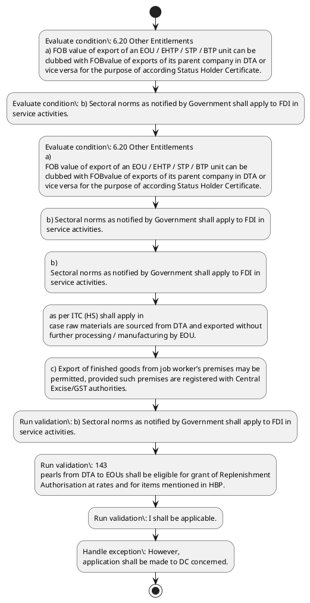

# Chapter 6 / Section 6.20: Other Entitlements

**Chapter Title:** Export Oriented Units (EOUs), Electronics Hardware Technology Parks (EHTPs), Software Technology Parks (STPs) and Bio-Technology

**Pages:** 11, 12, 13

**Purpose:** 6.20 Other Entitlements
a) FOB value of export of an EOU / EHTP / STP / BTP unit can be
clubbed with FOBvalue of exports of its parent company in DTA or
vice versa for the purpose of according Status Holder Certificate.

**Purpose Thanglish:** Indha Other Entitlements section-la, 6.20 Other Entitlements
a) FOB value of export of an EOU / EHTP / STP / BTP unit can be
clubbed with FOBvalue of exports of its parent company in DTA or
vice versa for the purpose of according Status Holder Certificate.

**Summary:** 6.20 Other Entitlements
a) FOB value of export of an EOU / EHTP / STP / BTP unit can be
clubbed with FOBvalue of exports of its parent company in DTA or
vice versa for the purpose of according Status Holder Certificate. b) Sectoral norms as notified by Government shall apply to FDI in
service activities. pg.

**Business Meaning:** Other Entitlements governs how DGFT business controls should be applied, validated, and enforced.

**Business Explanation:** Other Entitlements explains the operating rule set that DEKAI should enforce. Key control points include b) Sectoral norms as notified by Government shall apply to FDI in
service activities. The section also drives actions such as b) Sectoral norms as notified by Government shall apply to FDI in
service activities..

**Business Explanation Thanglish:** Indha Other Entitlements section-la, Other Entitlements explains the operating rule set that DEKAI should enforce. Key control points include b) Sectoral norms as notified by Government kandippa apply to FDI in
service activities. The section also drives actions such as b) Sectoral norms as notified by Government kandippa apply to FDI in
service activities..

## Business Logic
- b) Sectoral norms as notified by Government shall apply to FDI in
service activities.
- 143
pearls from DTA to EOUs shall be eligible for grant of Replenishment
Authorisation at rates and for items mentioned in HBP.
- I shall be applicable.
- However,
application shall be made to DC concerned.
- Such supplies to EOUs are not eligible
for any of deemed export benefits under Chapter 7 of the FTP.
- b)
Sectoral norms as notified by Government shall apply to FDI in
service activities.
- c) STP Units / EHTP Units / Software EOUs may also use all duty
and/or tax free equipment / goods for training purpose (including
commercial training), subject to condition that no duty free
equipment / goods shall be installed outside premises of the unit
for this purpose.
- d) Export of iron ore shall be subject to decision of Government.
- as per ITC (HS) shall apply in
case raw materials are sourced from DTA and exported without
further processing / manufacturing by EOU.
- Export of textile items
shall be covered by bilateral agreements, wherever applicable.
- Wood based units shall comply with direction of Supreme Court
contained in its order dated 12.12.1996 in Writ (civil) No 202 of
1995- T.N.
- 6.21 Sub–Contracting
a) Sub-contracting by EOU gems and jewellery units through other
EOUs, or SEZ Units, or units in DTA shall be subject to following
conditions: -
i.
- Goods, finished or semi-finished, including studded
jewellery, taken out for sub-contracting shall be brought
back to unit within 90 days.
- No cut and polished diamonds, precious and semiprecious
stones (except precious, semi- precious and synthetic stones
having zero duty) shall be allowed to be taken out for sub-
contracting.
- EOUs shall be eligible for wastage as applicable as per
paragraph 4.59 of HBP for sub-contracting and against
exchange.
- DTA unit undertaking job work or supplying jewellery
against exchange of gold / silver / platinum shall not be
entitled to deemed export benefits under Chapter 7 of FTP.
- 144
c)
STP Units / EHTP Units / Software EOUs may also use all duty
and/or tax free equipment / goods for training purpose (including
commercial training), subject to condition that no duty free
equipment / goods shall be installed outside premises of the unit
for this purpose.
- d)
Export of iron ore shall be subject to decision of Government.
- 6.21 Sub–Contracting
a)
Sub-contracting by EOU gems and jewellery units through other
EOUs, or SEZ Units, or units in DTA shall be subject to following
conditions: -
i.
- b) Facility of getting job work done from DTA unit will be available
subject to condition that goods are brought back to premises of unit
on completion of job work.
- Export of such products from
job worker’s premises shall not be allowed through third parties as
provided in FTP.
- d) EOUs may be permitted to remove moulds, jigs, tools, fixtures,
tackles, instruments, hangers and patterns and drawings to
premises of sub-contractors, subject to condition that these shall be
brought back to premises of units on completion of job work within
a stipulated period.
- Raw materials may or may not be sent along
with these goods.
- e) In case of sub-contracting of production process abroad, goods may
be exported from sub-contractor premises subject to conditions
that at the time of clearance of goods, the EOU / EHTP
/ BTP / STP unit shall declare
i.the transaction value of the finished goods to be cleared
from the sub- contractor’s premises abroad;
ii.job work charges to be paid to the sub-contractor
abroad; and
iii.
- The EOU / EHTP / BTP / STP unit
shall also ensure full repatriation of foreign exchange declared as
the transaction value of the finished goods cleared from the sub-
contractor’s premises abroad.

## Business Rules
- rule_id=CH6-SEC6_20-R001, rule_description=b) Sectoral norms as notified by Government shall apply to FDI in
service activities., trigger=Other Entitlements, condition=6.20 Other Entitlements
a) FOB value of export of an EOU / EHTP / STP / BTP unit can be
clubbed with FOBvalue of exports of its parent company in DTA or
vice versa for the purpose of according Status Holder Certificate., validation=b) Sectoral norms as notified by Government shall apply to FDI in
service activities., action=b) Sectoral norms as notified by Government shall apply to FDI in
service activities., exception=However,
application shall be made to DC concerned., output=DEKAI should produce a compliance decision for 6.20 - Other Entitlements.
- rule_id=CH6-SEC6_20-R002, rule_description=143
pearls from DTA to EOUs shall be eligible for grant of Replenishment
Authorisation at rates and for items mentioned in HBP., trigger=Other Entitlements, condition=b) Sectoral norms as notified by Government shall apply to FDI in
service activities., validation=143
pearls from DTA to EOUs shall be eligible for grant of Replenishment
Authorisation at rates and for items mentioned in HBP., action=b)
Sectoral norms as notified by Government shall apply to FDI in
service activities., exception=However, the Customs
Authorities may grant an extension of time beyond 90 days
in deserving cases., output=DEKAI should produce a compliance decision for 6.20 - Other Entitlements.
- rule_id=CH6-SEC6_20-R003, rule_description=I shall be applicable., trigger=Other Entitlements, condition=6.20 Other Entitlements
a)
FOB value of export of an EOU / EHTP / STP / BTP unit can be
clubbed with FOBvalue of exports of its parent company in DTA or
vice versa for the purpose of according Status Holder Certificate., validation=I shall be applicable., action=as per ITC (HS) shall apply in
case raw materials are sourced from DTA and exported without
further processing / manufacturing by EOU., exception=No cut and polished diamonds, precious and semiprecious
stones (except precious, semi- precious and synthetic stones
having zero duty) shall be allowed to be taken out for sub-
contracting., output=DEKAI should produce a compliance decision for 6.20 - Other Entitlements.
- rule_id=CH6-SEC6_20-R004, rule_description=However,
application shall be made to DC concerned., trigger=Other Entitlements, condition=b)
Sectoral norms as notified by Government shall apply to FDI in
service activities., validation=However,
application shall be made to DC concerned., action=c) Export of finished goods from job worker’s premises may be
permitted, provided such premises are registered with Central
Excise/GST authorities., exception=No cut and polished diamonds, precious and semiprecious
stones (except precious, semi- precious and synthetic stones
having zero duty) shall be allowed to be taken out for sub-
contracting., output=DEKAI should produce a compliance decision for 6.20 - Other Entitlements.
- rule_id=CH6-SEC6_20-R005, rule_description=Such supplies to EOUs are not eligible
for any of deemed export benefits under Chapter 7 of the FTP., trigger=Other Entitlements, condition=c) STP Units / EHTP Units / Software EOUs may also use all duty
and/or tax free equipment / goods for training purpose (including
commercial training), subject to condition that no duty free
equipment / goods shall be installed outside premises of the unit
for this purpose., validation=Such supplies to EOUs are not eligible
for any of deemed export benefits under Chapter 7 of the FTP., action=c) Export of finished goods from job worker’s premises may be
permitted, provided such premises are registered with Central
Excise/GST authorities., exception=No cut and polished diamonds, precious and semiprecious
stones (except precious, semi- precious and synthetic stones
having zero duty) shall be allowed to be taken out for sub-
contracting., output=DEKAI should produce a compliance decision for 6.20 - Other Entitlements.
- rule_id=CH6-SEC6_20-R006, rule_description=b)
Sectoral norms as notified by Government shall apply to FDI in
service activities., trigger=Other Entitlements, condition=d) Export of iron ore shall be subject to decision of Government., validation=b)
Sectoral norms as notified by Government shall apply to FDI in
service activities., action=c) Export of finished goods from job worker’s premises may be
permitted, provided such premises are registered with Central
Excise/GST authorities., exception=No cut and polished diamonds, precious and semiprecious
stones (except precious, semi- precious and synthetic stones
having zero duty) shall be allowed to be taken out for sub-
contracting., output=DEKAI should produce a compliance decision for 6.20 - Other Entitlements.
- rule_id=CH6-SEC6_20-R007, rule_description=c) STP Units / EHTP Units / Software EOUs may also use all duty
and/or tax free equipment / goods for training purpose (including
commercial training), subject to condition that no duty free
equipment / goods shall be installed outside premises of the unit
for this purpose., trigger=Other Entitlements, condition=Export of textile items
shall be covered by bilateral agreements, wherever applicable., validation=c) STP Units / EHTP Units / Software EOUs may also use all duty
and/or tax free equipment / goods for training purpose (including
commercial training), subject to condition that no duty free
equipment / goods shall be installed outside premises of the unit
for this purpose., action=c) Export of finished goods from job worker’s premises may be
permitted, provided such premises are registered with Central
Excise/GST authorities., exception=No cut and polished diamonds, precious and semiprecious
stones (except precious, semi- precious and synthetic stones
having zero duty) shall be allowed to be taken out for sub-
contracting., output=DEKAI should produce a compliance decision for 6.20 - Other Entitlements.
- rule_id=CH6-SEC6_20-R008, rule_description=d) Export of iron ore shall be subject to decision of Government., trigger=Other Entitlements, condition=6.21 Sub–Contracting
a) Sub-contracting by EOU gems and jewellery units through other
EOUs, or SEZ Units, or units in DTA shall be subject to following
conditions: -
i., validation=d) Export of iron ore shall be subject to decision of Government., action=c) Export of finished goods from job worker’s premises may be
permitted, provided such premises are registered with Central
Excise/GST authorities., exception=No cut and polished diamonds, precious and semiprecious
stones (except precious, semi- precious and synthetic stones
having zero duty) shall be allowed to be taken out for sub-
contracting., output=DEKAI should produce a compliance decision for 6.20 - Other Entitlements.
- rule_id=CH6-SEC6_20-R009, rule_description=as per ITC (HS) shall apply in
case raw materials are sourced from DTA and exported without
further processing / manufacturing by EOU., trigger=Other Entitlements, condition=144
c)
STP Units / EHTP Units / Software EOUs may also use all duty
and/or tax free equipment / goods for training purpose (including
commercial training), subject to condition that no duty free
equipment / goods shall be installed outside premises of the unit
for this purpose., validation=as per ITC (HS) shall apply in
case raw materials are sourced from DTA and exported without
further processing / manufacturing by EOU., action=c) Export of finished goods from job worker’s premises may be
permitted, provided such premises are registered with Central
Excise/GST authorities., exception=No cut and polished diamonds, precious and semiprecious
stones (except precious, semi- precious and synthetic stones
having zero duty) shall be allowed to be taken out for sub-
contracting., output=DEKAI should produce a compliance decision for 6.20 - Other Entitlements.
- rule_id=CH6-SEC6_20-R010, rule_description=Export of textile items
shall be covered by bilateral agreements, wherever applicable., trigger=Other Entitlements, condition=d)
Export of iron ore shall be subject to decision of Government., validation=Export of textile items
shall be covered by bilateral agreements, wherever applicable., action=c) Export of finished goods from job worker’s premises may be
permitted, provided such premises are registered with Central
Excise/GST authorities., exception=No cut and polished diamonds, precious and semiprecious
stones (except precious, semi- precious and synthetic stones
having zero duty) shall be allowed to be taken out for sub-
contracting., output=DEKAI should produce a compliance decision for 6.20 - Other Entitlements.
- rule_id=CH6-SEC6_20-R011, rule_description=Wood based units shall comply with direction of Supreme Court
contained in its order dated 12.12.1996 in Writ (civil) No 202 of
1995- T.N., trigger=Other Entitlements, condition=6.21 Sub–Contracting
a)
Sub-contracting by EOU gems and jewellery units through other
EOUs, or SEZ Units, or units in DTA shall be subject to following
conditions: -
i., validation=Wood based units shall comply with direction of Supreme Court
contained in its order dated 12.12.1996 in Writ (civil) No 202 of
1995- T.N., action=c) Export of finished goods from job worker’s premises may be
permitted, provided such premises are registered with Central
Excise/GST authorities., exception=No cut and polished diamonds, precious and semiprecious
stones (except precious, semi- precious and synthetic stones
having zero duty) shall be allowed to be taken out for sub-
contracting., output=DEKAI should produce a compliance decision for 6.20 - Other Entitlements.
- rule_id=CH6-SEC6_20-R012, rule_description=6.21 Sub–Contracting
a) Sub-contracting by EOU gems and jewellery units through other
EOUs, or SEZ Units, or units in DTA shall be subject to following
conditions: -
i., trigger=Other Entitlements, condition=b) Facility of getting job work done from DTA unit will be available
subject to condition that goods are brought back to premises of unit
on completion of job work., validation=6.21 Sub–Contracting
a) Sub-contracting by EOU gems and jewellery units through other
EOUs, or SEZ Units, or units in DTA shall be subject to following
conditions: -
i., action=c) Export of finished goods from job worker’s premises may be
permitted, provided such premises are registered with Central
Excise/GST authorities., exception=No cut and polished diamonds, precious and semiprecious
stones (except precious, semi- precious and synthetic stones
having zero duty) shall be allowed to be taken out for sub-
contracting., output=DEKAI should produce a compliance decision for 6.20 - Other Entitlements.
- rule_id=CH6-SEC6_20-R013, rule_description=Goods, finished or semi-finished, including studded
jewellery, taken out for sub-contracting shall be brought
back to unit within 90 days., trigger=Other Entitlements, condition=Where job worker is SEZ / EOU / EHTP /
STP / BTP unit, export may be effected either from job worker’s
premises or from premises of unit., validation=Goods, finished or semi-finished, including studded
jewellery, taken out for sub-contracting shall be brought
back to unit within 90 days., action=c) Export of finished goods from job worker’s premises may be
permitted, provided such premises are registered with Central
Excise/GST authorities., exception=No cut and polished diamonds, precious and semiprecious
stones (except precious, semi- precious and synthetic stones
having zero duty) shall be allowed to be taken out for sub-
contracting., output=DEKAI should produce a compliance decision for 6.20 - Other Entitlements.
- rule_id=CH6-SEC6_20-R014, rule_description=No cut and polished diamonds, precious and semiprecious
stones (except precious, semi- precious and synthetic stones
having zero duty) shall be allowed to be taken out for sub-
contracting., trigger=Other Entitlements, condition=d) EOUs may be permitted to remove moulds, jigs, tools, fixtures,
tackles, instruments, hangers and patterns and drawings to
premises of sub-contractors, subject to condition that these shall be
brought back to premises of units on completion of job work within
a stipulated period., validation=No cut and polished diamonds, precious and semiprecious
stones (except precious, semi- precious and synthetic stones
having zero duty) shall be allowed to be taken out for sub-
contracting., action=c) Export of finished goods from job worker’s premises may be
permitted, provided such premises are registered with Central
Excise/GST authorities., exception=No cut and polished diamonds, precious and semiprecious
stones (except precious, semi- precious and synthetic stones
having zero duty) shall be allowed to be taken out for sub-
contracting., output=DEKAI should produce a compliance decision for 6.20 - Other Entitlements.
- rule_id=CH6-SEC6_20-R015, rule_description=EOUs shall be eligible for wastage as applicable as per
paragraph 4.59 of HBP for sub-contracting and against
exchange., trigger=Other Entitlements, condition=e) In case of sub-contracting of production process abroad, goods may
be exported from sub-contractor premises subject to conditions
that at the time of clearance of goods, the EOU / EHTP
/ BTP / STP unit shall declare
i.the transaction value of the finished goods to be cleared
from the sub- contractor’s premises abroad;
ii.job work charges to be paid to the sub-contractor
abroad; and
iii., validation=EOUs shall be eligible for wastage as applicable as per
paragraph 4.59 of HBP for sub-contracting and against
exchange., action=c) Export of finished goods from job worker’s premises may be
permitted, provided such premises are registered with Central
Excise/GST authorities., exception=No cut and polished diamonds, precious and semiprecious
stones (except precious, semi- precious and synthetic stones
having zero duty) shall be allowed to be taken out for sub-
contracting., output=DEKAI should produce a compliance decision for 6.20 - Other Entitlements.
- rule_id=CH6-SEC6_20-R016, rule_description=DTA unit undertaking job work or supplying jewellery
against exchange of gold / silver / platinum shall not be
entitled to deemed export benefits under Chapter 7 of FTP., trigger=Other Entitlements, condition=e) In case of sub-contracting of production process abroad, goods may
be exported from sub-contractor premises subject to conditions
that at the time of clearance of goods, the EOU / EHTP
/ BTP / STP unit shall declare
i.the transaction value of the finished goods to be cleared
from the sub- contractor’s premises abroad;
ii.job work charges to be paid to the sub-contractor
abroad; and
iii., validation=DTA unit undertaking job work or supplying jewellery
against exchange of gold / silver / platinum shall not be
entitled to deemed export benefits under Chapter 7 of FTP., action=c) Export of finished goods from job worker’s premises may be
permitted, provided such premises are registered with Central
Excise/GST authorities., exception=No cut and polished diamonds, precious and semiprecious
stones (except precious, semi- precious and synthetic stones
having zero duty) shall be allowed to be taken out for sub-
contracting., output=DEKAI should produce a compliance decision for 6.20 - Other Entitlements.
- rule_id=CH6-SEC6_20-R017, rule_description=144
c)
STP Units / EHTP Units / Software EOUs may also use all duty
and/or tax free equipment / goods for training purpose (including
commercial training), subject to condition that no duty free
equipment / goods shall be installed outside premises of the unit
for this purpose., trigger=Other Entitlements, condition=e) In case of sub-contracting of production process abroad, goods may
be exported from sub-contractor premises subject to conditions
that at the time of clearance of goods, the EOU / EHTP
/ BTP / STP unit shall declare
i.the transaction value of the finished goods to be cleared
from the sub- contractor’s premises abroad;
ii.job work charges to be paid to the sub-contractor
abroad; and
iii., validation=144
c)
STP Units / EHTP Units / Software EOUs may also use all duty
and/or tax free equipment / goods for training purpose (including
commercial training), subject to condition that no duty free
equipment / goods shall be installed outside premises of the unit
for this purpose., action=c) Export of finished goods from job worker’s premises may be
permitted, provided such premises are registered with Central
Excise/GST authorities., exception=No cut and polished diamonds, precious and semiprecious
stones (except precious, semi- precious and synthetic stones
having zero duty) shall be allowed to be taken out for sub-
contracting., output=DEKAI should produce a compliance decision for 6.20 - Other Entitlements.
- rule_id=CH6-SEC6_20-R018, rule_description=d)
Export of iron ore shall be subject to decision of Government., trigger=Other Entitlements, condition=e) In case of sub-contracting of production process abroad, goods may
be exported from sub-contractor premises subject to conditions
that at the time of clearance of goods, the EOU / EHTP
/ BTP / STP unit shall declare
i.the transaction value of the finished goods to be cleared
from the sub- contractor’s premises abroad;
ii.job work charges to be paid to the sub-contractor
abroad; and
iii., validation=d)
Export of iron ore shall be subject to decision of Government., action=c) Export of finished goods from job worker’s premises may be
permitted, provided such premises are registered with Central
Excise/GST authorities., exception=No cut and polished diamonds, precious and semiprecious
stones (except precious, semi- precious and synthetic stones
having zero duty) shall be allowed to be taken out for sub-
contracting., output=DEKAI should produce a compliance decision for 6.20 - Other Entitlements.
- rule_id=CH6-SEC6_20-R019, rule_description=6.21 Sub–Contracting
a)
Sub-contracting by EOU gems and jewellery units through other
EOUs, or SEZ Units, or units in DTA shall be subject to following
conditions: -
i., trigger=Other Entitlements, condition=e) In case of sub-contracting of production process abroad, goods may
be exported from sub-contractor premises subject to conditions
that at the time of clearance of goods, the EOU / EHTP
/ BTP / STP unit shall declare
i.the transaction value of the finished goods to be cleared
from the sub- contractor’s premises abroad;
ii.job work charges to be paid to the sub-contractor
abroad; and
iii., validation=6.21 Sub–Contracting
a)
Sub-contracting by EOU gems and jewellery units through other
EOUs, or SEZ Units, or units in DTA shall be subject to following
conditions: -
i., action=c) Export of finished goods from job worker’s premises may be
permitted, provided such premises are registered with Central
Excise/GST authorities., exception=No cut and polished diamonds, precious and semiprecious
stones (except precious, semi- precious and synthetic stones
having zero duty) shall be allowed to be taken out for sub-
contracting., output=DEKAI should produce a compliance decision for 6.20 - Other Entitlements.
- rule_id=CH6-SEC6_20-R020, rule_description=b) Facility of getting job work done from DTA unit will be available
subject to condition that goods are brought back to premises of unit
on completion of job work., trigger=Other Entitlements, condition=e) In case of sub-contracting of production process abroad, goods may
be exported from sub-contractor premises subject to conditions
that at the time of clearance of goods, the EOU / EHTP
/ BTP / STP unit shall declare
i.the transaction value of the finished goods to be cleared
from the sub- contractor’s premises abroad;
ii.job work charges to be paid to the sub-contractor
abroad; and
iii., validation=Export of such products from
job worker’s premises shall not be allowed through third parties as
provided in FTP., action=c) Export of finished goods from job worker’s premises may be
permitted, provided such premises are registered with Central
Excise/GST authorities., exception=No cut and polished diamonds, precious and semiprecious
stones (except precious, semi- precious and synthetic stones
having zero duty) shall be allowed to be taken out for sub-
contracting., output=DEKAI should produce a compliance decision for 6.20 - Other Entitlements.
- rule_id=CH6-SEC6_20-R021, rule_description=Export of such products from
job worker’s premises shall not be allowed through third parties as
provided in FTP., trigger=Other Entitlements, condition=e) In case of sub-contracting of production process abroad, goods may
be exported from sub-contractor premises subject to conditions
that at the time of clearance of goods, the EOU / EHTP
/ BTP / STP unit shall declare
i.the transaction value of the finished goods to be cleared
from the sub- contractor’s premises abroad;
ii.job work charges to be paid to the sub-contractor
abroad; and
iii., validation=d) EOUs may be permitted to remove moulds, jigs, tools, fixtures,
tackles, instruments, hangers and patterns and drawings to
premises of sub-contractors, subject to condition that these shall be
brought back to premises of units on completion of job work within
a stipulated period., action=c) Export of finished goods from job worker’s premises may be
permitted, provided such premises are registered with Central
Excise/GST authorities., exception=No cut and polished diamonds, precious and semiprecious
stones (except precious, semi- precious and synthetic stones
having zero duty) shall be allowed to be taken out for sub-
contracting., output=DEKAI should produce a compliance decision for 6.20 - Other Entitlements.
- rule_id=CH6-SEC6_20-R022, rule_description=d) EOUs may be permitted to remove moulds, jigs, tools, fixtures,
tackles, instruments, hangers and patterns and drawings to
premises of sub-contractors, subject to condition that these shall be
brought back to premises of units on completion of job work within
a stipulated period., trigger=Other Entitlements, condition=e) In case of sub-contracting of production process abroad, goods may
be exported from sub-contractor premises subject to conditions
that at the time of clearance of goods, the EOU / EHTP
/ BTP / STP unit shall declare
i.the transaction value of the finished goods to be cleared
from the sub- contractor’s premises abroad;
ii.job work charges to be paid to the sub-contractor
abroad; and
iii., validation=e) In case of sub-contracting of production process abroad, goods may
be exported from sub-contractor premises subject to conditions
that at the time of clearance of goods, the EOU / EHTP
/ BTP / STP unit shall declare
i.the transaction value of the finished goods to be cleared
from the sub- contractor’s premises abroad;
ii.job work charges to be paid to the sub-contractor
abroad; and
iii., action=c) Export of finished goods from job worker’s premises may be
permitted, provided such premises are registered with Central
Excise/GST authorities., exception=No cut and polished diamonds, precious and semiprecious
stones (except precious, semi- precious and synthetic stones
having zero duty) shall be allowed to be taken out for sub-
contracting., output=DEKAI should produce a compliance decision for 6.20 - Other Entitlements.
- rule_id=CH6-SEC6_20-R023, rule_description=Raw materials may or may not be sent along
with these goods., trigger=Other Entitlements, condition=e) In case of sub-contracting of production process abroad, goods may
be exported from sub-contractor premises subject to conditions
that at the time of clearance of goods, the EOU / EHTP
/ BTP / STP unit shall declare
i.the transaction value of the finished goods to be cleared
from the sub- contractor’s premises abroad;
ii.job work charges to be paid to the sub-contractor
abroad; and
iii., validation=The EOU / EHTP / BTP / STP unit
shall also ensure full repatriation of foreign exchange declared as
the transaction value of the finished goods cleared from the sub-
contractor’s premises abroad., action=c) Export of finished goods from job worker’s premises may be
permitted, provided such premises are registered with Central
Excise/GST authorities., exception=No cut and polished diamonds, precious and semiprecious
stones (except precious, semi- precious and synthetic stones
having zero duty) shall be allowed to be taken out for sub-
contracting., output=DEKAI should produce a compliance decision for 6.20 - Other Entitlements.
- rule_id=CH6-SEC6_20-R024, rule_description=e) In case of sub-contracting of production process abroad, goods may
be exported from sub-contractor premises subject to conditions
that at the time of clearance of goods, the EOU / EHTP
/ BTP / STP unit shall declare
i.the transaction value of the finished goods to be cleared
from the sub- contractor’s premises abroad;
ii.job work charges to be paid to the sub-contractor
abroad; and
iii., trigger=Other Entitlements, condition=e) In case of sub-contracting of production process abroad, goods may
be exported from sub-contractor premises subject to conditions
that at the time of clearance of goods, the EOU / EHTP
/ BTP / STP unit shall declare
i.the transaction value of the finished goods to be cleared
from the sub- contractor’s premises abroad;
ii.job work charges to be paid to the sub-contractor
abroad; and
iii., validation=The EOU / EHTP / BTP / STP unit
shall also ensure full repatriation of foreign exchange declared as
the transaction value of the finished goods cleared from the sub-
contractor’s premises abroad., action=c) Export of finished goods from job worker’s premises may be
permitted, provided such premises are registered with Central
Excise/GST authorities., exception=No cut and polished diamonds, precious and semiprecious
stones (except precious, semi- precious and synthetic stones
having zero duty) shall be allowed to be taken out for sub-
contracting., output=DEKAI should produce a compliance decision for 6.20 - Other Entitlements.
- rule_id=CH6-SEC6_20-R025, rule_description=The EOU / EHTP / BTP / STP unit
shall also ensure full repatriation of foreign exchange declared as
the transaction value of the finished goods cleared from the sub-
contractor’s premises abroad., trigger=Other Entitlements, condition=e) In case of sub-contracting of production process abroad, goods may
be exported from sub-contractor premises subject to conditions
that at the time of clearance of goods, the EOU / EHTP
/ BTP / STP unit shall declare
i.the transaction value of the finished goods to be cleared
from the sub- contractor’s premises abroad;
ii.job work charges to be paid to the sub-contractor
abroad; and
iii., validation=The EOU / EHTP / BTP / STP unit
shall also ensure full repatriation of foreign exchange declared as
the transaction value of the finished goods cleared from the sub-
contractor’s premises abroad., action=c) Export of finished goods from job worker’s premises may be
permitted, provided such premises are registered with Central
Excise/GST authorities., exception=No cut and polished diamonds, precious and semiprecious
stones (except precious, semi- precious and synthetic stones
having zero duty) shall be allowed to be taken out for sub-
contracting., output=DEKAI should produce a compliance decision for 6.20 - Other Entitlements.

## Conditions
- 6.20 Other Entitlements
a) FOB value of export of an EOU / EHTP / STP / BTP unit can be
clubbed with FOBvalue of exports of its parent company in DTA or
vice versa for the purpose of according Status Holder Certificate.
- b) Sectoral norms as notified by Government shall apply to FDI in
service activities.
- 6.20 Other Entitlements
a)
FOB value of export of an EOU / EHTP / STP / BTP unit can be
clubbed with FOBvalue of exports of its parent company in DTA or
vice versa for the purpose of according Status Holder Certificate.
- b)
Sectoral norms as notified by Government shall apply to FDI in
service activities.
- c) STP Units / EHTP Units / Software EOUs may also use all duty
and/or tax free equipment / goods for training purpose (including
commercial training), subject to condition that no duty free
equipment / goods shall be installed outside premises of the unit
for this purpose.
- d) Export of iron ore shall be subject to decision of Government.
- Export of textile items
shall be covered by bilateral agreements, wherever applicable.
- 6.21 Sub–Contracting
a) Sub-contracting by EOU gems and jewellery units through other
EOUs, or SEZ Units, or units in DTA shall be subject to following
conditions: -
i.
- 144
c)
STP Units / EHTP Units / Software EOUs may also use all duty
and/or tax free equipment / goods for training purpose (including
commercial training), subject to condition that no duty free
equipment / goods shall be installed outside premises of the unit
for this purpose.
- d)
Export of iron ore shall be subject to decision of Government.
- 6.21 Sub–Contracting
a)
Sub-contracting by EOU gems and jewellery units through other
EOUs, or SEZ Units, or units in DTA shall be subject to following
conditions: -
i.
- b) Facility of getting job work done from DTA unit will be available
subject to condition that goods are brought back to premises of unit
on completion of job work.
- Where job worker is SEZ / EOU / EHTP /
STP / BTP unit, export may be effected either from job worker’s
premises or from premises of unit.
- d) EOUs may be permitted to remove moulds, jigs, tools, fixtures,
tackles, instruments, hangers and patterns and drawings to
premises of sub-contractors, subject to condition that these shall be
brought back to premises of units on completion of job work within
a stipulated period.
- e) In case of sub-contracting of production process abroad, goods may
be exported from sub-contractor premises subject to conditions
that at the time of clearance of goods, the EOU / EHTP
/ BTP / STP unit shall declare
i.the transaction value of the finished goods to be cleared
from the sub- contractor’s premises abroad;
ii.job work charges to be paid to the sub-contractor
abroad; and
iii.

## Condition Logic
- id=6.6.20.1, if=6.20 Other Entitlements
a) FOB value of export of an EOU / EHTP / STP / BTP unit can be
clubbed with FOBvalue of exports of its parent company in DTA or
vice versa for the purpose of according Status Holder Certificate., then=b) Sectoral norms as notified by Government shall apply to FDI in
service activities., source=6.20 Other Entitlements
a) FOB value of export of an EOU / EHTP / STP / BTP unit can be
clubbed with FOBvalue of exports of its parent company in DTA or
vice versa for the purpose of according Status Holder Certificate.
- id=6.6.20.2, if=b) Sectoral norms as notified by Government shall apply to FDI in
service activities., then=b) Sectoral norms as notified by Government shall apply to FDI in
service activities., source=b) Sectoral norms as notified by Government shall apply to FDI in
service activities.
- id=6.6.20.3, if=6.20 Other Entitlements
a)
FOB value of export of an EOU / EHTP / STP / BTP unit can be
clubbed with FOBvalue of exports of its parent company in DTA or
vice versa for the purpose of according Status Holder Certificate., then=b) Sectoral norms as notified by Government shall apply to FDI in
service activities., source=6.20 Other Entitlements
a)
FOB value of export of an EOU / EHTP / STP / BTP unit can be
clubbed with FOBvalue of exports of its parent company in DTA or
vice versa for the purpose of according Status Holder Certificate.
- id=6.6.20.4, if=b)
Sectoral norms as notified by Government shall apply to FDI in
service activities., then=b) Sectoral norms as notified by Government shall apply to FDI in
service activities., source=b)
Sectoral norms as notified by Government shall apply to FDI in
service activities.
- id=6.6.20.5, if=c) STP Units / EHTP Units / Software EOUs may also use all duty
and/or tax free equipment / goods for training purpose (including
commercial training), subject to condition that no duty free
equipment / goods shall be installed outside premises of the unit
for this purpose., then=b) Sectoral norms as notified by Government shall apply to FDI in
service activities., source=c) STP Units / EHTP Units / Software EOUs may also use all duty
and/or tax free equipment / goods for training purpose (including
commercial training), subject to condition that no duty free
equipment / goods shall be installed outside premises of the unit
for this purpose.
- id=6.6.20.6, if=d) Export of iron ore shall be subject to decision of Government., then=b) Sectoral norms as notified by Government shall apply to FDI in
service activities., source=d) Export of iron ore shall be subject to decision of Government.
- id=6.6.20.7, if=Export of textile items
shall be covered by bilateral agreements, wherever applicable., then=b) Sectoral norms as notified by Government shall apply to FDI in
service activities., source=Export of textile items
shall be covered by bilateral agreements, wherever applicable.
- id=6.6.20.8, if=6.21 Sub–Contracting
a) Sub-contracting by EOU gems and jewellery units through other
EOUs, or SEZ Units, or units in DTA shall be subject to following
conditions: -
i., then=b) Sectoral norms as notified by Government shall apply to FDI in
service activities., source=6.21 Sub–Contracting
a) Sub-contracting by EOU gems and jewellery units through other
EOUs, or SEZ Units, or units in DTA shall be subject to following
conditions: -
i.
- id=6.6.20.9, if=144
c)
STP Units / EHTP Units / Software EOUs may also use all duty
and/or tax free equipment / goods for training purpose (including
commercial training), subject to condition that no duty free
equipment / goods shall be installed outside premises of the unit
for this purpose., then=b) Sectoral norms as notified by Government shall apply to FDI in
service activities., source=144
c)
STP Units / EHTP Units / Software EOUs may also use all duty
and/or tax free equipment / goods for training purpose (including
commercial training), subject to condition that no duty free
equipment / goods shall be installed outside premises of the unit
for this purpose.
- id=6.6.20.10, if=d)
Export of iron ore shall be subject to decision of Government., then=b) Sectoral norms as notified by Government shall apply to FDI in
service activities., source=d)
Export of iron ore shall be subject to decision of Government.
- id=6.6.20.11, if=6.21 Sub–Contracting
a)
Sub-contracting by EOU gems and jewellery units through other
EOUs, or SEZ Units, or units in DTA shall be subject to following
conditions: -
i., then=b) Sectoral norms as notified by Government shall apply to FDI in
service activities., source=6.21 Sub–Contracting
a)
Sub-contracting by EOU gems and jewellery units through other
EOUs, or SEZ Units, or units in DTA shall be subject to following
conditions: -
i.
- id=6.6.20.12, if=b) Facility of getting job work done from DTA unit will be available
subject to condition that goods are brought back to premises of unit
on completion of job work., then=b) Sectoral norms as notified by Government shall apply to FDI in
service activities., source=b) Facility of getting job work done from DTA unit will be available
subject to condition that goods are brought back to premises of unit
on completion of job work.
- id=6.6.20.13, if=Where job worker is SEZ / EOU / EHTP /
STP / BTP unit, export may be effected either from job worker’s
premises or from premises of unit., then=b) Sectoral norms as notified by Government shall apply to FDI in
service activities., source=Where job worker is SEZ / EOU / EHTP /
STP / BTP unit, export may be effected either from job worker’s
premises or from premises of unit.
- id=6.6.20.14, if=d) EOUs may be permitted to remove moulds, jigs, tools, fixtures,
tackles, instruments, hangers and patterns and drawings to
premises of sub-contractors, subject to condition that these shall be
brought back to premises of units on completion of job work within
a stipulated period., then=b) Sectoral norms as notified by Government shall apply to FDI in
service activities., source=d) EOUs may be permitted to remove moulds, jigs, tools, fixtures,
tackles, instruments, hangers and patterns and drawings to
premises of sub-contractors, subject to condition that these shall be
brought back to premises of units on completion of job work within
a stipulated period.
- id=6.6.20.15, if=e) In case of sub-contracting of production process abroad, goods may
be exported from sub-contractor premises subject to conditions
that at the time of clearance of goods, the EOU / EHTP
/ BTP / STP unit shall declare
i.the transaction value of the finished goods to be cleared
from the sub- contractor’s premises abroad;
ii.job work charges to be paid to the sub-contractor
abroad; and
iii., then=b) Sectoral norms as notified by Government shall apply to FDI in
service activities., source=e) In case of sub-contracting of production process abroad, goods may
be exported from sub-contractor premises subject to conditions
that at the time of clearance of goods, the EOU / EHTP
/ BTP / STP unit shall declare
i.the transaction value of the finished goods to be cleared
from the sub- contractor’s premises abroad;
ii.job work charges to be paid to the sub-contractor
abroad; and
iii.

## Validations
- b) Sectoral norms as notified by Government shall apply to FDI in
service activities.
- 143
pearls from DTA to EOUs shall be eligible for grant of Replenishment
Authorisation at rates and for items mentioned in HBP.
- I shall be applicable.
- However,
application shall be made to DC concerned.
- Such supplies to EOUs are not eligible
for any of deemed export benefits under Chapter 7 of the FTP.
- b)
Sectoral norms as notified by Government shall apply to FDI in
service activities.
- c) STP Units / EHTP Units / Software EOUs may also use all duty
and/or tax free equipment / goods for training purpose (including
commercial training), subject to condition that no duty free
equipment / goods shall be installed outside premises of the unit
for this purpose.
- d) Export of iron ore shall be subject to decision of Government.
- as per ITC (HS) shall apply in
case raw materials are sourced from DTA and exported without
further processing / manufacturing by EOU.
- Export of textile items
shall be covered by bilateral agreements, wherever applicable.
- Wood based units shall comply with direction of Supreme Court
contained in its order dated 12.12.1996 in Writ (civil) No 202 of
1995- T.N.
- 6.21 Sub–Contracting
a) Sub-contracting by EOU gems and jewellery units through other
EOUs, or SEZ Units, or units in DTA shall be subject to following
conditions: -
i.
- Goods, finished or semi-finished, including studded
jewellery, taken out for sub-contracting shall be brought
back to unit within 90 days.
- No cut and polished diamonds, precious and semiprecious
stones (except precious, semi- precious and synthetic stones
having zero duty) shall be allowed to be taken out for sub-
contracting.
- EOUs shall be eligible for wastage as applicable as per
paragraph 4.59 of HBP for sub-contracting and against
exchange.
- DTA unit undertaking job work or supplying jewellery
against exchange of gold / silver / platinum shall not be
entitled to deemed export benefits under Chapter 7 of FTP.
- 144
c)
STP Units / EHTP Units / Software EOUs may also use all duty
and/or tax free equipment / goods for training purpose (including
commercial training), subject to condition that no duty free
equipment / goods shall be installed outside premises of the unit
for this purpose.
- d)
Export of iron ore shall be subject to decision of Government.
- 6.21 Sub–Contracting
a)
Sub-contracting by EOU gems and jewellery units through other
EOUs, or SEZ Units, or units in DTA shall be subject to following
conditions: -
i.
- Export of such products from
job worker’s premises shall not be allowed through third parties as
provided in FTP.
- d) EOUs may be permitted to remove moulds, jigs, tools, fixtures,
tackles, instruments, hangers and patterns and drawings to
premises of sub-contractors, subject to condition that these shall be
brought back to premises of units on completion of job work within
a stipulated period.
- e) In case of sub-contracting of production process abroad, goods may
be exported from sub-contractor premises subject to conditions
that at the time of clearance of goods, the EOU / EHTP
/ BTP / STP unit shall declare
i.the transaction value of the finished goods to be cleared
from the sub- contractor’s premises abroad;
ii.job work charges to be paid to the sub-contractor
abroad; and
iii.
- The EOU / EHTP / BTP / STP unit
shall also ensure full repatriation of foreign exchange declared as
the transaction value of the finished goods cleared from the sub-
contractor’s premises abroad.

## Exceptions
- However,
application shall be made to DC concerned.
- However, the Customs
Authorities may grant an extension of time beyond 90 days
in deserving cases.
- No cut and polished diamonds, precious and semiprecious
stones (except precious, semi- precious and synthetic stones
having zero duty) shall be allowed to be taken out for sub-
contracting.

## Dependencies
- 7
- 4.59

## Authorities
- Sectoral norms as notified by Government
- Export of iron ore shall be subject to decision of Government
- Customs

## Required Documents
- Status Holder Certificate
- Procedure for
submission of application for grant of Replenishment Authorisation as
contained in relevant Chapter of HBP Vol.
- However,
application shall be made to DC concerned.
- DTA unit undertaking job work or supplying jewellery
against exchange of gold / silver / platinum shall not be
entitled to deemed export benefits under Chapter 7 of FTP.
- value of intermediate goods;
supported with documents like sale price contract / or invoice for
the finished goods, job work contract and the basis of arriving at
the value of intermediate goods.

## Timelines
- Goods, finished or semi-finished, including studded
jewellery, taken out for sub-contracting shall be brought
back to unit within 90 days.
- However, the Customs
Authorities may grant an extension of time beyond 90 days
in deserving cases.
- d) EOUs may be permitted to remove moulds, jigs, tools, fixtures,
tackles, instruments, hangers and patterns and drawings to
premises of sub-contractors, subject to condition that these shall be
brought back to premises of units on completion of job work within
a stipulated period.

## Actions
- b) Sectoral norms as notified by Government shall apply to FDI in
service activities.
- b)
Sectoral norms as notified by Government shall apply to FDI in
service activities.
- as per ITC (HS) shall apply in
case raw materials are sourced from DTA and exported without
further processing / manufacturing by EOU.
- c) Export of finished goods from job worker’s premises may be
permitted, provided such premises are registered with Central
Excise/GST authorities.

## Workflow
- Evaluate condition: 6.20 Other Entitlements
a) FOB value of export of an EOU / EHTP / STP / BTP unit can be
clubbed with FOBvalue of exports of its parent company in DTA or
vice versa for the purpose of according Status Holder Certificate.
- Evaluate condition: b) Sectoral norms as notified by Government shall apply to FDI in
service activities.
- Evaluate condition: 6.20 Other Entitlements
a)
FOB value of export of an EOU / EHTP / STP / BTP unit can be
clubbed with FOBvalue of exports of its parent company in DTA or
vice versa for the purpose of according Status Holder Certificate.
- b) Sectoral norms as notified by Government shall apply to FDI in
service activities.
- b)
Sectoral norms as notified by Government shall apply to FDI in
service activities.
- as per ITC (HS) shall apply in
case raw materials are sourced from DTA and exported without
further processing / manufacturing by EOU.
- c) Export of finished goods from job worker’s premises may be
permitted, provided such premises are registered with Central
Excise/GST authorities.
- Run validation: b) Sectoral norms as notified by Government shall apply to FDI in
service activities.
- Run validation: 143
pearls from DTA to EOUs shall be eligible for grant of Replenishment
Authorisation at rates and for items mentioned in HBP.
- Run validation: I shall be applicable.
- Handle exception: However,
application shall be made to DC concerned.

## Workflow ASCII
```text
Other Entitlements
Evaluate condition: 6.20 Other Entitlements
a) FOB value of export of an EOU / EHTP / STP / BTP unit can be
clubbed with FOBvalue of exports of its parent company in DTA or
vice versa for the purpose of according Status Holder Certificate.
   |
   v
Evaluate condition: b) Sectoral norms as notified by Government shall apply to FDI in
service activities.
   |
   v
Evaluate condition: 6.20 Other Entitlements
a)
FOB value of export of an EOU / EHTP / STP / BTP unit can be
clubbed with FOBvalue of exports of its parent company in DTA or
vice versa for the purpose of according Status Holder Certificate.
   |
   v
b) Sectoral norms as notified by Government shall apply to FDI in
service activities.
   |
   v
b)
Sectoral norms as notified by Government shall apply to FDI in
service activities.
   |
   v
as per ITC (HS) shall apply in
case raw materials are sourced from DTA and exported without
further processing / manufacturing by EOU.
   |
   v
c) Export of finished goods from job worker’s premises may be
permitted, provided such premises are registered with Central
Excise/GST authorities.
   |
   v
Run validation: b) Sectoral norms as notified by Government shall apply to FDI in
service activities.
   |
   v
Run validation: 143
pearls from DTA to EOUs shall be eligible for grant of Replenishment
Authorisation at rates and for items mentioned in HBP.
   |
   v
Run validation: I shall be applicable.
   |
   v
Handle exception: However,
application shall be made to DC concerned.
```

## Decision Tree
- IF 6.20 Other Entitlements
a) FOB value of export of an EOU / EHTP / STP / BTP unit can be
clubbed with FOBvalue of exports of its parent company in DTA or
vice versa for the purpose of according Status Holder Certificate. THEN b) Sectoral norms as notified by Government shall apply to FDI in
service activities.
- IF b) Sectoral norms as notified by Government shall apply to FDI in
service activities. THEN b) Sectoral norms as notified by Government shall apply to FDI in
service activities.
- IF 6.20 Other Entitlements
a)
FOB value of export of an EOU / EHTP / STP / BTP unit can be
clubbed with FOBvalue of exports of its parent company in DTA or
vice versa for the purpose of according Status Holder Certificate. THEN b) Sectoral norms as notified by Government shall apply to FDI in
service activities.
- IF b)
Sectoral norms as notified by Government shall apply to FDI in
service activities. THEN b) Sectoral norms as notified by Government shall apply to FDI in
service activities.
- IF c) STP Units / EHTP Units / Software EOUs may also use all duty
and/or tax free equipment / goods for training purpose (including
commercial training), subject to condition that no duty free
equipment / goods shall be installed outside premises of the unit
for this purpose. THEN b) Sectoral norms as notified by Government shall apply to FDI in
service activities.
- IF exception applies (However,
application shall be made to DC concerned.) THEN route to manual review
- IF exception applies (However, the Customs
Authorities may grant an extension of time beyond 90 days
in deserving cases.) THEN route to manual review
- IF exception applies (No cut and polished diamonds, precious and semiprecious
stones (except precious, semi- precious and synthetic stones
having zero duty) shall be allowed to be taken out for sub-
contracting.) THEN route to manual review

## Decision Tree ASCII
```text
Other Entitlements Decision
IF 6.20 Other Entitlements
a) FOB value of export of an EOU / EHTP / STP / BTP unit can be
clubbed with FOBvalue of exports of its parent company in DTA or
vice versa for the purpose of according Status Holder Certificate. THEN b) Sectoral norms as notified by Government shall apply to FDI in
service activities.
   |
   v
IF b) Sectoral norms as notified by Government shall apply to FDI in
service activities. THEN b) Sectoral norms as notified by Government shall apply to FDI in
service activities.
   |
   v
IF 6.20 Other Entitlements
a)
FOB value of export of an EOU / EHTP / STP / BTP unit can be
clubbed with FOBvalue of exports of its parent company in DTA or
vice versa for the purpose of according Status Holder Certificate. THEN b) Sectoral norms as notified by Government shall apply to FDI in
service activities.
   |
   v
IF b)
Sectoral norms as notified by Government shall apply to FDI in
service activities. THEN b) Sectoral norms as notified by Government shall apply to FDI in
service activities.
   |
   v
IF c) STP Units / EHTP Units / Software EOUs may also use all duty
and/or tax free equipment / goods for training purpose (including
commercial training), subject to condition that no duty free
equipment / goods shall be installed outside premises of the unit
for this purpose. THEN b) Sectoral norms as notified by Government shall apply to FDI in
service activities.
   |
   v
IF exception applies (However,
application shall be made to DC concerned.) THEN route to manual review
   |
   v
IF exception applies (However, the Customs
Authorities may grant an extension of time beyond 90 days
in deserving cases.) THEN route to manual review
   |
   v
IF exception applies (No cut and polished diamonds, precious and semiprecious
stones (except precious, semi- precious and synthetic stones
having zero duty) shall be allowed to be taken out for sub-
contracting.) THEN route to manual review
```

## Examples
- User asks to process Other Entitlements; the platform checks conditions, validations, and documents before action.

**Real-world Example:** Example: an importer or exporter invokes Other Entitlements, submits Status Holder Certificate, Procedure for
submission of application for grant of Replenishment Authorisation as
contained in relevant Chapter of HBP Vol., However,
application shall be made to DC concerned., and DEKAI uses the extracted rules to b) sectoral norms as notified by government shall apply to fdi in
service activities..

**Real-world Example Thanglish:** Indha Other Entitlements section-la, Example: an importer or exporter invokes Other Entitlements, submits Status Holder Certificate, Procedure for
submission of application for grant of Replenishment Authorisation as
contained in relevant Chapter of HBP Vol., However,
application kandippa be made to DC concerned., and DEKAI uses the extracted rules to b) sectoral norms as notified by government kandippa apply to fdi in
service activities..

## AI Rules
- IF detected context matches section rule THEN enforce: b) Sectoral norms as notified by Government shall apply to FDI in
service activities.
- IF detected context matches section rule THEN enforce: 143
pearls from DTA to EOUs shall be eligible for grant of Replenishment
Authorisation at rates and for items mentioned in HBP.
- IF detected context matches section rule THEN enforce: I shall be applicable.
- IF detected context matches section rule THEN enforce: However,
application shall be made to DC concerned.
- IF detected context matches section rule THEN enforce: Such supplies to EOUs are not eligible
for any of deemed export benefits under Chapter 7 of the FTP.
- IF detected context matches section rule THEN enforce: b)
Sectoral norms as notified by Government shall apply to FDI in
service activities.
- IF validations pass THEN recommend action: b) Sectoral norms as notified by Government shall apply to FDI in
service activities.

## Database Fields
- name=section_code, type=string, required=True, source=parsed_section_heading
- name=section_title, type=string, required=True, source=parsed_section_heading
- name=fob_flag, type=boolean, required=False, source=keyword:FOB
- name=eou_flag, type=boolean, required=False, source=keyword:EOU
- name=stp_flag, type=boolean, required=False, source=keyword:STP
- name=btp_flag, type=boolean, required=False, source=keyword:BTP
- name=can_flag, type=boolean, required=False, source=keyword:can
- name=its_flag, type=boolean, required=False, source=keyword:its
- name=dta_flag, type=boolean, required=False, source=keyword:DTA
- name=for_flag, type=boolean, required=False, source=keyword:for
- name=document_1_submitted, type=boolean, required=True, source=Status Holder Certificate
- name=document_2_submitted, type=boolean, required=True, source=Procedure for
submission of application for grant of Replenishment Authorisation as
contained in relevant Chapter of HBP Vol.
- name=document_3_submitted, type=boolean, required=True, source=However,
application shall be made to DC concerned.
- name=document_4_submitted, type=boolean, required=True, source=DTA unit undertaking job work or supplying jewellery
against exchange of gold / silver / platinum shall not be
entitled to deemed export benefits under Chapter 7 of FTP.
- name=document_5_submitted, type=boolean, required=True, source=value of intermediate goods;
supported with documents like sale price contract / or invoice for
the finished goods, job work contract and the basis of arriving at
the value of intermediate goods.

## API Requirements
- method=GET, path=/api/dgft/sections/6.20, purpose=Retrieve knowledge payload for section 6.20, query_params=['include=workflow,decision_tree,validations'], response_fields=['section', 'title', 'summary', 'conditions', 'validations', 'exceptions', 'workflow', 'decision_tree']
- method=POST, path=/api/dgft/Other-Entitlements/validate, purpose=Validate inputs and documents for Other Entitlements, request_fields=['section_code', 'section_title', 'document_1_submitted', 'document_2_submitted', 'document_3_submitted', 'document_4_submitted', 'document_5_submitted'], response_fields=['status', 'errors', 'warnings', 'next_actions']
- method=POST, path=/api/dgft/Other-Entitlements/execute, purpose=Trigger business action for b) Sectoral norms as notified by Government shall apply to FDI in
service activities., request_fields=['section_code', 'section_title', 'document_1_submitted', 'document_2_submitted', 'document_3_submitted', 'document_4_submitted', 'document_5_submitted'], response_fields=['reference_id', 'status', 'authority', 'timeline']

## UI Screens
- screen_id=Other_Entitlements_overview, name=Other Entitlements Overview, purpose=Show section summary, authority, timeline, and eligibility cues., widgets=['summary_card', 'conditions_table', 'authority_badges', 'timeline_panel']
- screen_id=Other_Entitlements_submission, name=Other Entitlements Submission, purpose=Capture applicant data and supporting documents., widgets=['dynamic_form', 'document_uploader', 'validation_panel', 'next_action_footer'], fields=['section_code', 'section_title', 'fob_flag', 'eou_flag', 'stp_flag', 'btp_flag', 'can_flag', 'its_flag']
- screen_id=Other_Entitlements_exceptions, name=Other Entitlements Exception Review, purpose=Explain exception handling and manual review triggers., widgets=['exception_banner', 'decision_tree', 'case_notes']

## Error Messages
- Validation failed because the section requirements were not fully met.

## FAQ
- question_en=What is the purpose of section 6.20?, answer_en=Other Entitlements explains the operating rule set that DEKAI should enforce. Key control points include b) Sectoral norms as notified by Government shall apply to FDI in
service activities. The section also drives actions such as b) Sectoral norms as notified by Government shall apply to FDI in
service activities.., question_thanglish=Indha Other Entitlements section-la, What is the purpose of section 6.20?, answer_thanglish=Indha Other Entitlements section-la, Other Entitlements explains the operating rule set that DEKAI should enforce. Key control points include b) Sectoral norms as notified by Government kandippa apply to FDI in
service activities. The section also drives actions such as b) Sectoral norms as notified by Government kandippa apply to FDI in
service activities..
- question_en=What documents are required under Other Entitlements?, answer_en=Status Holder Certificate, Procedure for
submission of application for grant of Replenishment Authorisation as
contained in relevant Chapter of HBP Vol., However,
application shall be made to DC concerned., DTA unit undertaking job work or supplying jewellery
against exchange of gold / silver / platinum shall not be
entitled to deemed export benefits under Chapter 7 of FTP., value of intermediate goods;
supported with documents like sale price contract / or invoice for
the finished goods, job work contract and the basis of arriving at
the value of intermediate goods., question_thanglish=Indha Other Entitlements section-la, What documents are required under Other Entitlements?, answer_thanglish=Indha Other Entitlements section-la, Status Holder Certificate, Procedure for
submission of application for grant of Replenishment Authorisation as
contained in relevant Chapter of HBP Vol., However,
application kandippa be made to DC concerned., DTA unit undertaking job work or supplying jewellery
against exchange of gold / silver / platinum kandippa not be
entitled to deemed export benefits under Chapter 7 of FTP., value of intermediate goods;
supported with documents like sale price contract / or invoice for
the finished goods, job work contract and the basis of arriving at
the value of intermediate goods.
- question_en=Which authority handles Other Entitlements?, answer_en=Sectoral norms as notified by Government, Export of iron ore shall be subject to decision of Government, Customs, question_thanglish=Indha Other Entitlements section-la, Which authority handles Other Entitlements?, answer_thanglish=Indha Other Entitlements section-la, Sectoral norms as notified by Government, export of iron ore kandippa be subject to decision of Government, Customs

## Questions Users May Ask
- What does Other Entitlements require?
- Which documents are needed for Other Entitlements?
- How does DEKAI validate Other Entitlements requests?
- What action should be taken for Other Entitlements?

## Expected AI Answers
- Other Entitlements requires the platform to interpret the section text, apply the extracted business rules, and present the correct next action.
- Required documents are inferred from the section text: Status Holder Certificate, Procedure for
submission of application for grant of Replenishment Authorisation as
contained in relevant Chapter of HBP Vol., However,
application shall be made to DC concerned., DTA unit undertaking job work or supplying jewellery
against exchange of gold / silver / platinum shall not be
entitled to deemed export benefits under Chapter 7 of FTP., value of intermediate goods;
supported with documents like sale price contract / or invoice for
the finished goods, job work contract and the basis of arriving at
the value of intermediate goods.
- DEKAI validates Other Entitlements by checking conditions, required documents, authority references, and exception clauses before recommending an outcome.
- The primary extracted action is: b) Sectoral norms as notified by Government shall apply to FDI in
service activities.

## AI Q&A Examples
- question_en=User asks: How do I comply with Other Entitlements?, answer_en=AI answers: DEKAI should evaluate section 6.20, apply the extracted rules, and guide the user through Evaluate condition: 6.20 Other Entitlements
a) FOB value of export of an EOU / EHTP / STP / BTP unit can be
clubbed with FOBvalue of exports of its parent company in DTA or
vice versa for the purpose of according Status Holder Certificate.., question_thanglish=Indha Other Entitlements section-la, User asks: How do I comply with Other Entitlements?, answer_thanglish=Indha Other Entitlements section-la, AI answers: DEKAI should evaluate section 6.20, apply the extracted rules, and guide the user through Evaluate condition: 6.20 Other Entitlements
a) FOB value of export of an EOU / EHTP / STP / BTP unit can be
clubbed with FOBvalue of exports of its parent company in DTA or
vice versa for the purpose of according Status Holder Certificate..
- question_en=User asks: Which validations apply to Other Entitlements?, answer_en=AI answers: Applicable validations are b) Sectoral norms as notified by Government shall apply to FDI in
service activities., 143
pearls from DTA to EOUs shall be eligible for grant of Replenishment
Authorisation at rates and for items mentioned in HBP., I shall be applicable., question_thanglish=Indha Other Entitlements section-la, User asks: Which validations apply to Other Entitlements?, answer_thanglish=Indha Other Entitlements section-la, AI answers: Applicable validations are b) Sectoral norms as notified by Government kandippa apply to FDI in
service activities., 143
pearls from DTA to EOUs kandippa be eligible for grant of Replenishment
Authorisation at rates and for items mentioned in HBP., I kandippa be applicable.

## DEKAI AI Implementation Notes
- Capture chapter 6, section 6.20, title, and page references as immutable knowledge metadata.
- Bind validations for Other Entitlements into a rule engine keyed by the rule IDs extracted for this section.
- Expose document upload controls for: Status Holder Certificate, Procedure for
submission of application for grant of Replenishment Authorisation as
contained in relevant Chapter of HBP Vol., However,
application shall be made to DC concerned., DTA unit undertaking job work or supplying jewellery
against exchange of gold / silver / platinum shall not be
entitled to deemed export benefits under Chapter 7 of FTP., value of intermediate goods;
supported with documents like sale price contract / or invoice for
the finished goods, job work contract and the basis of arriving at
the value of intermediate goods..
- Route escalations or approvals to: Sectoral norms as notified by Government, Export of iron ore shall be subject to decision of Government, Customs.
- Trigger manual review when exception clauses are detected.

## DEKAI AI Implementation Notes Thanglish
- Indha Other Entitlements section-la, Capture chapter 6, section 6.20, title, and page references as immutable knowledge metadata.
- Indha Other Entitlements section-la, Bind validations for Other Entitlements into a rule engine keyed by the rule IDs extracted for this section.
- Indha Other Entitlements section-la, Expose document upload controls for: Status Holder Certificate, Procedure for
submission of application for grant of Replenishment Authorisation as
contained in relevant Chapter of HBP Vol., However,
application kandippa be made to DC concerned., DTA unit undertaking job work or supplying jewellery
against exchange of gold / silver / platinum kandippa not be
entitled to deemed export benefits under Chapter 7 of FTP., value of intermediate goods;
supported with documents like sale price contract / or invoice for
the finished goods, job work contract and the basis of arriving at
the value of intermediate goods..
- Indha Other Entitlements section-la, Route escalations or approvals to: Sectoral norms as notified by Government, export of iron ore kandippa be subject to decision of Government, Customs.
- Indha Other Entitlements section-la, Trigger manual review when exception clauses are detected.

## AI Metadata
- Keywords: FOB, EOU, STP, BTP, can, its, DTA, for, the, FDI, and, HBP, Vol, are, not, any, FTP, may, use, all
- Search Keywords: FOB, EOU, STP, BTP, can, its, DTA, for, the, FDI, and, HBP, Vol, are, not, any, FTP, may, use, all
- Intent: Support Other Entitlements processing and compliance validation.
- Tags: 6.20, Other Entitlements, business-rule, document-driven, dgft
- Related Sections: 
- Related Chapters: 
- Related Rules: b) Sectoral norms as notified by Government shall apply to FDI in
service activities., 143
pearls from DTA to EOUs shall be eligible for grant of Replenishment
Authorisation at rates and for items mentioned in HBP., I shall be applicable., However,
application shall be made to DC concerned., Such supplies to EOUs are not eligible
for any of deemed export benefits under Chapter 7 of the FTP.

## Mermaid

```mermaid
flowchart TD
    S1["Evaluate condition: 6.20 Other Entitlements
a) FOB value of export of an EOU / EHTP / STP / BTP unit can be
clubbed with FOBvalue of exports of its parent company in DTA or
vice versa for the purpose of according Status Holder Certificate."]
    S2["Evaluate condition: b) Sectoral norms as notified by Government shall apply to FDI in
service activities."]
    S1 --> S2
    S3["Evaluate condition: 6.20 Other Entitlements
a)
FOB value of export of an EOU / EHTP / STP / BTP unit can be
clubbed with FOBvalue of exports of its parent company in DTA or
vice versa for the purpose of according Status Holder Certificate."]
    S2 --> S3
    S4["b) Sectoral norms as notified by Government shall apply to FDI in
service activities."]
    S3 --> S4
    S5["b)
Sectoral norms as notified by Government shall apply to FDI in
service activities."]
    S4 --> S5
    S6["as per ITC (HS) shall apply in
case raw materials are sourced from DTA and exported without
further processing / manufacturing by EOU."]
    S5 --> S6
    S7["c) Export of finished goods from job worker’s premises may be
permitted, provided such premises are registered with Central
Excise/GST authorities."]
    S6 --> S7
    S8["Run validation: b) Sectoral norms as notified by Government shall apply to FDI in
service activities."]
    S7 --> S8
    S9["Run validation: 143
pearls from DTA to EOUs shall be eligible for grant of Replenishment
Authorisation at rates and for items mentioned in HBP."]
    S8 --> S9
    S10["Run validation: I shall be applicable."]
    S9 --> S10
    S11["Handle exception: However,
application shall be made to DC concerned."]
    S10 --> S11
```


## PlantUML

