# Chapter 6 / Section 6.22: Contract Farming

**Chapter Title:** Export Oriented Units (EOUs), Electronics Hardware Technology Parks (EHTPs), Software Technology Parks (STPs) and Bio-Technology

**Pages:** 13, 14

**Purpose:** 6.22 Contract Farming
EOUs engaged in production / processing of agriculture / horticulture /
aquaculture products may, on basis of annual permission from Customs
authorities, take out inputs and equipments (specified in Appendix 6I of
Appendices & ANFs) to DTA farm subject to following conditions:
a) Supply of inputs by EOUs to contract farm(s) shall be subject to
input-output norms approved by DGFT / BOA.

**Purpose Thanglish:** Indha Contract Farming section-la, 6.22 Contract Farming
EOUs engaged in production / processing of agriculture / horticulture /
aquaculture products may, on basis of annual permission from Customs
authorities, take out inputs and equipments (specified in Appendix 6I of
Appendices & ANFs) to DTA farm subject to following conditions:
a) Supply of inputs by EOUs to contract farm(s) kandippa be subject to
input-output norms approved by DGFT / BOA.

**Summary:** 6.22 Contract Farming
EOUs engaged in production / processing of agriculture / horticulture /
aquaculture products may, on basis of annual permission from Customs
authorities, take out inputs and equipments (specified in Appendix 6I of
Appendices & ANFs) to DTA farm subject to following conditions:
a) Supply of inputs by EOUs to contract farm(s) shall be subject to
input-output norms approved by DGFT / BOA. b) There shall be contract farming agreement between EOU and DTA
pg. 145
pg.

**Business Meaning:** Contract Farming governs how DGFT business controls should be applied, validated, and enforced.

**Business Explanation:** Contract Farming explains the operating rule set that DEKAI should enforce. Key control points include 6.22 Contract Farming
EOUs engaged in production / processing of agriculture / horticulture /
aquaculture products may, on basis of annual permission from Customs
authorities, take out inputs and equipments (specified in Appendix 6I of
Appendices & ANFs) to DTA farm subject to following conditions:
a) Supply of inputs by EOUs to contract farm(s) shall be subject to
input-output norms approved by DGFT / BOA. The section also drives actions such as 6.22 Contract Farming
EOUs engaged in production / processing of agriculture / horticulture /
aquaculture products may, on basis of annual permission from Customs
authorities, take out inputs and equipments (specified in Appendix 6I of
Appendices & ANFs) to DTA farm subject to following conditions:
a) Supply of inputs by EOUs to contract farm(s) shall be subject to
input-output norms approved by DGFT / BOA..

**Business Explanation Thanglish:** Indha Contract Farming section-la, Contract Farming explains the operating rule set that DEKAI should enforce. Key control points include 6.22 Contract Farming
EOUs engaged in production / processing of agriculture / horticulture /
aquaculture products may, on basis of annual permission from Customs
authorities, take out inputs and equipments (specified in Appendix 6I of
Appendices & ANFs) to DTA farm subject to following conditions:
a) Supply of inputs by EOUs to contract farm(s) kandippa be subject to
input-output norms approved by DGFT / BOA. The section also drives actions such as 6.22 Contract Farming
EOUs engaged in production / processing of agriculture / horticulture /
aquaculture products may, on basis of annual permission from Customs
authorities, take out inputs and equipments (specified in Appendix 6I of
Appendices & ANFs) to DTA farm subject to following conditions:
a) Supply of inputs by EOUs to contract farm(s) kandippa be subject to
input-output norms approved by DGFT / BOA..

## Business Logic
- 6.22 Contract Farming
EOUs engaged in production / processing of agriculture / horticulture /
aquaculture products may, on basis of annual permission from Customs
authorities, take out inputs and equipments (specified in Appendix 6I of
Appendices & ANFs) to DTA farm subject to following conditions:
a) Supply of inputs by EOUs to contract farm(s) shall be subject to
input-output norms approved by DGFT / BOA.
- b) There shall be contract farming agreement between EOU and DTA
pg.
- 145
b)
Facility of getting job work done from DTA unit will be available
subject to condition that goods are brought back to premises of unit
on completion of job work.
- Export of such products from
job worker’s premises shall not be allowed through third parties as
provided in FTP.
- d)
EOUs may be permitted to remove moulds, jigs, tools, fixtures,
tackles, instruments, hangers and patterns and drawings to
premises of sub-contractors, subject to condition that these shall be
brought back to premises of units on completion of job work within
a stipulated period.
- Raw materials may or may not be sent along
with these goods.
- e)
In case of sub-contracting of production process abroad, goods may
be exported from sub-contractor premises subject to conditions
that at the time of clearance of goods, the EOU / EHTP
/ BTP / STP unit shall declare
i.the transaction value of the finished goods to be cleared
from the sub- contractor’s premises abroad;
ii.job work charges to be paid to the sub-contractor
abroad; and
iii.
- The EOU / EHTP / BTP / STP unit
shall also ensure full repatriation of foreign exchange declared as
the transaction value of the finished goods cleared from the sub-
contractor’s premises abroad.
- 6.22 Contract Farming
EOUs engaged in production / processing of agriculture / horticulture /
aquaculture products may, on basis of annual permission from Customs
authorities, take out inputs and equipments (specified in Appendix 6I of
Appendices & ANFs) to DTA farm subject to following conditions:
a)
Supply of inputs by EOUs to contract farm(s) shall be subject to
input-output norms approved by DGFT / BOA.
- b)
There shall be contract farming agreement between EOU and DTA
farmer(s).
- c) Unit has been in existence for at least two years and engaged in
export of agriculture / horticulture / aquaculture products;
otherwise it shall furnish bank guarantee equivalent to duty and/or
taxes foregone on capital goods / inputs proposed to be taken out,
to Deputy / Assistant Commissioner of Customs, till unit completes
two years.

## Business Rules
- rule_id=CH6-SEC6_22-R001, rule_description=6.22 Contract Farming
EOUs engaged in production / processing of agriculture / horticulture /
aquaculture products may, on basis of annual permission from Customs
authorities, take out inputs and equipments (specified in Appendix 6I of
Appendices & ANFs) to DTA farm subject to following conditions:
a) Supply of inputs by EOUs to contract farm(s) shall be subject to
input-output norms approved by DGFT / BOA., trigger=Contract Farming, condition=6.22 Contract Farming
EOUs engaged in production / processing of agriculture / horticulture /
aquaculture products may, on basis of annual permission from Customs
authorities, take out inputs and equipments (specified in Appendix 6I of
Appendices & ANFs) to DTA farm subject to following conditions:
a) Supply of inputs by EOUs to contract farm(s) shall be subject to
input-output norms approved by DGFT / BOA., validation=6.22 Contract Farming
EOUs engaged in production / processing of agriculture / horticulture /
aquaculture products may, on basis of annual permission from Customs
authorities, take out inputs and equipments (specified in Appendix 6I of
Appendices & ANFs) to DTA farm subject to following conditions:
a) Supply of inputs by EOUs to contract farm(s) shall be subject to
input-output norms approved by DGFT / BOA., action=6.22 Contract Farming
EOUs engaged in production / processing of agriculture / horticulture /
aquaculture products may, on basis of annual permission from Customs
authorities, take out inputs and equipments (specified in Appendix 6I of
Appendices & ANFs) to DTA farm subject to following conditions:
a) Supply of inputs by EOUs to contract farm(s) shall be subject to
input-output norms approved by DGFT / BOA., exception=No explicit exception found in uploaded documents., output=DEKAI should produce a compliance decision for 6.22 - Contract Farming.
- rule_id=CH6-SEC6_22-R002, rule_description=b) There shall be contract farming agreement between EOU and DTA
pg., trigger=Contract Farming, condition=145
b)
Facility of getting job work done from DTA unit will be available
subject to condition that goods are brought back to premises of unit
on completion of job work., validation=b) There shall be contract farming agreement between EOU and DTA
pg., action=c)
Export of finished goods from job worker’s premises may be
permitted, provided such premises are registered with Central
Excise/GST authorities., exception=No explicit exception found in uploaded documents., output=DEKAI should produce a compliance decision for 6.22 - Contract Farming.
- rule_id=CH6-SEC6_22-R003, rule_description=145
b)
Facility of getting job work done from DTA unit will be available
subject to condition that goods are brought back to premises of unit
on completion of job work., trigger=Contract Farming, condition=Where job worker is SEZ / EOU / EHTP /
STP / BTP unit, export may be effected either from job worker’s
premises or from premises of unit., validation=Export of such products from
job worker’s premises shall not be allowed through third parties as
provided in FTP., action=6.22 Contract Farming
EOUs engaged in production / processing of agriculture / horticulture /
aquaculture products may, on basis of annual permission from Customs
authorities, take out inputs and equipments (specified in Appendix 6I of
Appendices & ANFs) to DTA farm subject to following conditions:
a)
Supply of inputs by EOUs to contract farm(s) shall be subject to
input-output norms approved by DGFT / BOA., exception=No explicit exception found in uploaded documents., output=DEKAI should produce a compliance decision for 6.22 - Contract Farming.
- rule_id=CH6-SEC6_22-R004, rule_description=Export of such products from
job worker’s premises shall not be allowed through third parties as
provided in FTP., trigger=Contract Farming, condition=d)
EOUs may be permitted to remove moulds, jigs, tools, fixtures,
tackles, instruments, hangers and patterns and drawings to
premises of sub-contractors, subject to condition that these shall be
brought back to premises of units on completion of job work within
a stipulated period., validation=d)
EOUs may be permitted to remove moulds, jigs, tools, fixtures,
tackles, instruments, hangers and patterns and drawings to
premises of sub-contractors, subject to condition that these shall be
brought back to premises of units on completion of job work within
a stipulated period., action=c) Unit has been in existence for at least two years and engaged in
export of agriculture / horticulture / aquaculture products;
otherwise it shall furnish bank guarantee equivalent to duty and/or
taxes foregone on capital goods / inputs proposed to be taken out,
to Deputy / Assistant Commissioner of Customs, till unit completes
two years., exception=No explicit exception found in uploaded documents., output=DEKAI should produce a compliance decision for 6.22 - Contract Farming.
- rule_id=CH6-SEC6_22-R005, rule_description=d)
EOUs may be permitted to remove moulds, jigs, tools, fixtures,
tackles, instruments, hangers and patterns and drawings to
premises of sub-contractors, subject to condition that these shall be
brought back to premises of units on completion of job work within
a stipulated period., trigger=Contract Farming, condition=e)
In case of sub-contracting of production process abroad, goods may
be exported from sub-contractor premises subject to conditions
that at the time of clearance of goods, the EOU / EHTP
/ BTP / STP unit shall declare
i.the transaction value of the finished goods to be cleared
from the sub- contractor’s premises abroad;
ii.job work charges to be paid to the sub-contractor
abroad; and
iii., validation=e)
In case of sub-contracting of production process abroad, goods may
be exported from sub-contractor premises subject to conditions
that at the time of clearance of goods, the EOU / EHTP
/ BTP / STP unit shall declare
i.the transaction value of the finished goods to be cleared
from the sub- contractor’s premises abroad;
ii.job work charges to be paid to the sub-contractor
abroad; and
iii., action=c) Unit has been in existence for at least two years and engaged in
export of agriculture / horticulture / aquaculture products;
otherwise it shall furnish bank guarantee equivalent to duty and/or
taxes foregone on capital goods / inputs proposed to be taken out,
to Deputy / Assistant Commissioner of Customs, till unit completes
two years., exception=No explicit exception found in uploaded documents., output=DEKAI should produce a compliance decision for 6.22 - Contract Farming.
- rule_id=CH6-SEC6_22-R006, rule_description=Raw materials may or may not be sent along
with these goods., trigger=Contract Farming, condition=6.22 Contract Farming
EOUs engaged in production / processing of agriculture / horticulture /
aquaculture products may, on basis of annual permission from Customs
authorities, take out inputs and equipments (specified in Appendix 6I of
Appendices & ANFs) to DTA farm subject to following conditions:
a)
Supply of inputs by EOUs to contract farm(s) shall be subject to
input-output norms approved by DGFT / BOA., validation=The EOU / EHTP / BTP / STP unit
shall also ensure full repatriation of foreign exchange declared as
the transaction value of the finished goods cleared from the sub-
contractor’s premises abroad., action=c) Unit has been in existence for at least two years and engaged in
export of agriculture / horticulture / aquaculture products;
otherwise it shall furnish bank guarantee equivalent to duty and/or
taxes foregone on capital goods / inputs proposed to be taken out,
to Deputy / Assistant Commissioner of Customs, till unit completes
two years., exception=No explicit exception found in uploaded documents., output=DEKAI should produce a compliance decision for 6.22 - Contract Farming.
- rule_id=CH6-SEC6_22-R007, rule_description=e)
In case of sub-contracting of production process abroad, goods may
be exported from sub-contractor premises subject to conditions
that at the time of clearance of goods, the EOU / EHTP
/ BTP / STP unit shall declare
i.the transaction value of the finished goods to be cleared
from the sub- contractor’s premises abroad;
ii.job work charges to be paid to the sub-contractor
abroad; and
iii., trigger=Contract Farming, condition=6.22 Contract Farming
EOUs engaged in production / processing of agriculture / horticulture /
aquaculture products may, on basis of annual permission from Customs
authorities, take out inputs and equipments (specified in Appendix 6I of
Appendices & ANFs) to DTA farm subject to following conditions:
a)
Supply of inputs by EOUs to contract farm(s) shall be subject to
input-output norms approved by DGFT / BOA., validation=6.22 Contract Farming
EOUs engaged in production / processing of agriculture / horticulture /
aquaculture products may, on basis of annual permission from Customs
authorities, take out inputs and equipments (specified in Appendix 6I of
Appendices & ANFs) to DTA farm subject to following conditions:
a)
Supply of inputs by EOUs to contract farm(s) shall be subject to
input-output norms approved by DGFT / BOA., action=c) Unit has been in existence for at least two years and engaged in
export of agriculture / horticulture / aquaculture products;
otherwise it shall furnish bank guarantee equivalent to duty and/or
taxes foregone on capital goods / inputs proposed to be taken out,
to Deputy / Assistant Commissioner of Customs, till unit completes
two years., exception=No explicit exception found in uploaded documents., output=DEKAI should produce a compliance decision for 6.22 - Contract Farming.
- rule_id=CH6-SEC6_22-R008, rule_description=The EOU / EHTP / BTP / STP unit
shall also ensure full repatriation of foreign exchange declared as
the transaction value of the finished goods cleared from the sub-
contractor’s premises abroad., trigger=Contract Farming, condition=6.22 Contract Farming
EOUs engaged in production / processing of agriculture / horticulture /
aquaculture products may, on basis of annual permission from Customs
authorities, take out inputs and equipments (specified in Appendix 6I of
Appendices & ANFs) to DTA farm subject to following conditions:
a)
Supply of inputs by EOUs to contract farm(s) shall be subject to
input-output norms approved by DGFT / BOA., validation=b)
There shall be contract farming agreement between EOU and DTA
farmer(s)., action=c) Unit has been in existence for at least two years and engaged in
export of agriculture / horticulture / aquaculture products;
otherwise it shall furnish bank guarantee equivalent to duty and/or
taxes foregone on capital goods / inputs proposed to be taken out,
to Deputy / Assistant Commissioner of Customs, till unit completes
two years., exception=No explicit exception found in uploaded documents., output=DEKAI should produce a compliance decision for 6.22 - Contract Farming.
- rule_id=CH6-SEC6_22-R009, rule_description=6.22 Contract Farming
EOUs engaged in production / processing of agriculture / horticulture /
aquaculture products may, on basis of annual permission from Customs
authorities, take out inputs and equipments (specified in Appendix 6I of
Appendices & ANFs) to DTA farm subject to following conditions:
a)
Supply of inputs by EOUs to contract farm(s) shall be subject to
input-output norms approved by DGFT / BOA., trigger=Contract Farming, condition=6.22 Contract Farming
EOUs engaged in production / processing of agriculture / horticulture /
aquaculture products may, on basis of annual permission from Customs
authorities, take out inputs and equipments (specified in Appendix 6I of
Appendices & ANFs) to DTA farm subject to following conditions:
a)
Supply of inputs by EOUs to contract farm(s) shall be subject to
input-output norms approved by DGFT / BOA., validation=c) Unit has been in existence for at least two years and engaged in
export of agriculture / horticulture / aquaculture products;
otherwise it shall furnish bank guarantee equivalent to duty and/or
taxes foregone on capital goods / inputs proposed to be taken out,
to Deputy / Assistant Commissioner of Customs, till unit completes
two years., action=c) Unit has been in existence for at least two years and engaged in
export of agriculture / horticulture / aquaculture products;
otherwise it shall furnish bank guarantee equivalent to duty and/or
taxes foregone on capital goods / inputs proposed to be taken out,
to Deputy / Assistant Commissioner of Customs, till unit completes
two years., exception=No explicit exception found in uploaded documents., output=DEKAI should produce a compliance decision for 6.22 - Contract Farming.
- rule_id=CH6-SEC6_22-R010, rule_description=b)
There shall be contract farming agreement between EOU and DTA
farmer(s)., trigger=Contract Farming, condition=6.22 Contract Farming
EOUs engaged in production / processing of agriculture / horticulture /
aquaculture products may, on basis of annual permission from Customs
authorities, take out inputs and equipments (specified in Appendix 6I of
Appendices & ANFs) to DTA farm subject to following conditions:
a)
Supply of inputs by EOUs to contract farm(s) shall be subject to
input-output norms approved by DGFT / BOA., validation=c) Unit has been in existence for at least two years and engaged in
export of agriculture / horticulture / aquaculture products;
otherwise it shall furnish bank guarantee equivalent to duty and/or
taxes foregone on capital goods / inputs proposed to be taken out,
to Deputy / Assistant Commissioner of Customs, till unit completes
two years., action=c) Unit has been in existence for at least two years and engaged in
export of agriculture / horticulture / aquaculture products;
otherwise it shall furnish bank guarantee equivalent to duty and/or
taxes foregone on capital goods / inputs proposed to be taken out,
to Deputy / Assistant Commissioner of Customs, till unit completes
two years., exception=No explicit exception found in uploaded documents., output=DEKAI should produce a compliance decision for 6.22 - Contract Farming.
- rule_id=CH6-SEC6_22-R011, rule_description=c) Unit has been in existence for at least two years and engaged in
export of agriculture / horticulture / aquaculture products;
otherwise it shall furnish bank guarantee equivalent to duty and/or
taxes foregone on capital goods / inputs proposed to be taken out,
to Deputy / Assistant Commissioner of Customs, till unit completes
two years., trigger=Contract Farming, condition=6.22 Contract Farming
EOUs engaged in production / processing of agriculture / horticulture /
aquaculture products may, on basis of annual permission from Customs
authorities, take out inputs and equipments (specified in Appendix 6I of
Appendices & ANFs) to DTA farm subject to following conditions:
a)
Supply of inputs by EOUs to contract farm(s) shall be subject to
input-output norms approved by DGFT / BOA., validation=c) Unit has been in existence for at least two years and engaged in
export of agriculture / horticulture / aquaculture products;
otherwise it shall furnish bank guarantee equivalent to duty and/or
taxes foregone on capital goods / inputs proposed to be taken out,
to Deputy / Assistant Commissioner of Customs, till unit completes
two years., action=c) Unit has been in existence for at least two years and engaged in
export of agriculture / horticulture / aquaculture products;
otherwise it shall furnish bank guarantee equivalent to duty and/or
taxes foregone on capital goods / inputs proposed to be taken out,
to Deputy / Assistant Commissioner of Customs, till unit completes
two years., exception=No explicit exception found in uploaded documents., output=DEKAI should produce a compliance decision for 6.22 - Contract Farming.

## Conditions
- 6.22 Contract Farming
EOUs engaged in production / processing of agriculture / horticulture /
aquaculture products may, on basis of annual permission from Customs
authorities, take out inputs and equipments (specified in Appendix 6I of
Appendices & ANFs) to DTA farm subject to following conditions:
a) Supply of inputs by EOUs to contract farm(s) shall be subject to
input-output norms approved by DGFT / BOA.
- 145
b)
Facility of getting job work done from DTA unit will be available
subject to condition that goods are brought back to premises of unit
on completion of job work.
- Where job worker is SEZ / EOU / EHTP /
STP / BTP unit, export may be effected either from job worker’s
premises or from premises of unit.
- d)
EOUs may be permitted to remove moulds, jigs, tools, fixtures,
tackles, instruments, hangers and patterns and drawings to
premises of sub-contractors, subject to condition that these shall be
brought back to premises of units on completion of job work within
a stipulated period.
- e)
In case of sub-contracting of production process abroad, goods may
be exported from sub-contractor premises subject to conditions
that at the time of clearance of goods, the EOU / EHTP
/ BTP / STP unit shall declare
i.the transaction value of the finished goods to be cleared
from the sub- contractor’s premises abroad;
ii.job work charges to be paid to the sub-contractor
abroad; and
iii.
- 6.22 Contract Farming
EOUs engaged in production / processing of agriculture / horticulture /
aquaculture products may, on basis of annual permission from Customs
authorities, take out inputs and equipments (specified in Appendix 6I of
Appendices & ANFs) to DTA farm subject to following conditions:
a)
Supply of inputs by EOUs to contract farm(s) shall be subject to
input-output norms approved by DGFT / BOA.

## Condition Logic
- id=6.6.22.1, if=6.22 Contract Farming
EOUs engaged in production / processing of agriculture / horticulture /
aquaculture products may, on basis of annual permission from Customs
authorities, take out inputs and equipments (specified in Appendix 6I of
Appendices & ANFs) to DTA farm subject to following conditions:
a) Supply of inputs by EOUs to contract farm(s) shall be subject to
input-output norms approved by DGFT / BOA., then=6.22 Contract Farming
EOUs engaged in production / processing of agriculture / horticulture /
aquaculture products may, on basis of annual permission from Customs
authorities, take out inputs and equipments (specified in Appendix 6I of
Appendices & ANFs) to DTA farm subject to following conditions:
a) Supply of inputs by EOUs to contract farm(s) shall be subject to
input-output norms approved by DGFT / BOA., source=6.22 Contract Farming
EOUs engaged in production / processing of agriculture / horticulture /
aquaculture products may, on basis of annual permission from Customs
authorities, take out inputs and equipments (specified in Appendix 6I of
Appendices & ANFs) to DTA farm subject to following conditions:
a) Supply of inputs by EOUs to contract farm(s) shall be subject to
input-output norms approved by DGFT / BOA.
- id=6.6.22.2, if=145
b)
Facility of getting job work done from DTA unit will be available
subject to condition that goods are brought back to premises of unit
on completion of job work., then=6.22 Contract Farming
EOUs engaged in production / processing of agriculture / horticulture /
aquaculture products may, on basis of annual permission from Customs
authorities, take out inputs and equipments (specified in Appendix 6I of
Appendices & ANFs) to DTA farm subject to following conditions:
a) Supply of inputs by EOUs to contract farm(s) shall be subject to
input-output norms approved by DGFT / BOA., source=145
b)
Facility of getting job work done from DTA unit will be available
subject to condition that goods are brought back to premises of unit
on completion of job work.
- id=6.6.22.3, if=Where job worker is SEZ / EOU / EHTP /
STP / BTP unit, export may be effected either from job worker’s
premises or from premises of unit., then=6.22 Contract Farming
EOUs engaged in production / processing of agriculture / horticulture /
aquaculture products may, on basis of annual permission from Customs
authorities, take out inputs and equipments (specified in Appendix 6I of
Appendices & ANFs) to DTA farm subject to following conditions:
a) Supply of inputs by EOUs to contract farm(s) shall be subject to
input-output norms approved by DGFT / BOA., source=Where job worker is SEZ / EOU / EHTP /
STP / BTP unit, export may be effected either from job worker’s
premises or from premises of unit.
- id=6.6.22.4, if=d)
EOUs may be permitted to remove moulds, jigs, tools, fixtures,
tackles, instruments, hangers and patterns and drawings to
premises of sub-contractors, subject to condition that these shall be
brought back to premises of units on completion of job work within
a stipulated period., then=6.22 Contract Farming
EOUs engaged in production / processing of agriculture / horticulture /
aquaculture products may, on basis of annual permission from Customs
authorities, take out inputs and equipments (specified in Appendix 6I of
Appendices & ANFs) to DTA farm subject to following conditions:
a) Supply of inputs by EOUs to contract farm(s) shall be subject to
input-output norms approved by DGFT / BOA., source=d)
EOUs may be permitted to remove moulds, jigs, tools, fixtures,
tackles, instruments, hangers and patterns and drawings to
premises of sub-contractors, subject to condition that these shall be
brought back to premises of units on completion of job work within
a stipulated period.
- id=6.6.22.5, if=e)
In case of sub-contracting of production process abroad, goods may
be exported from sub-contractor premises subject to conditions
that at the time of clearance of goods, the EOU / EHTP
/ BTP / STP unit shall declare
i.the transaction value of the finished goods to be cleared
from the sub- contractor’s premises abroad;
ii.job work charges to be paid to the sub-contractor
abroad; and
iii., then=6.22 Contract Farming
EOUs engaged in production / processing of agriculture / horticulture /
aquaculture products may, on basis of annual permission from Customs
authorities, take out inputs and equipments (specified in Appendix 6I of
Appendices & ANFs) to DTA farm subject to following conditions:
a) Supply of inputs by EOUs to contract farm(s) shall be subject to
input-output norms approved by DGFT / BOA., source=e)
In case of sub-contracting of production process abroad, goods may
be exported from sub-contractor premises subject to conditions
that at the time of clearance of goods, the EOU / EHTP
/ BTP / STP unit shall declare
i.the transaction value of the finished goods to be cleared
from the sub- contractor’s premises abroad;
ii.job work charges to be paid to the sub-contractor
abroad; and
iii.
- id=6.6.22.6, if=6.22 Contract Farming
EOUs engaged in production / processing of agriculture / horticulture /
aquaculture products may, on basis of annual permission from Customs
authorities, take out inputs and equipments (specified in Appendix 6I of
Appendices & ANFs) to DTA farm subject to following conditions:
a)
Supply of inputs by EOUs to contract farm(s) shall be subject to
input-output norms approved by DGFT / BOA., then=6.22 Contract Farming
EOUs engaged in production / processing of agriculture / horticulture /
aquaculture products may, on basis of annual permission from Customs
authorities, take out inputs and equipments (specified in Appendix 6I of
Appendices & ANFs) to DTA farm subject to following conditions:
a) Supply of inputs by EOUs to contract farm(s) shall be subject to
input-output norms approved by DGFT / BOA., source=6.22 Contract Farming
EOUs engaged in production / processing of agriculture / horticulture /
aquaculture products may, on basis of annual permission from Customs
authorities, take out inputs and equipments (specified in Appendix 6I of
Appendices & ANFs) to DTA farm subject to following conditions:
a)
Supply of inputs by EOUs to contract farm(s) shall be subject to
input-output norms approved by DGFT / BOA.

## Validations
- 6.22 Contract Farming
EOUs engaged in production / processing of agriculture / horticulture /
aquaculture products may, on basis of annual permission from Customs
authorities, take out inputs and equipments (specified in Appendix 6I of
Appendices & ANFs) to DTA farm subject to following conditions:
a) Supply of inputs by EOUs to contract farm(s) shall be subject to
input-output norms approved by DGFT / BOA.
- b) There shall be contract farming agreement between EOU and DTA
pg.
- Export of such products from
job worker’s premises shall not be allowed through third parties as
provided in FTP.
- d)
EOUs may be permitted to remove moulds, jigs, tools, fixtures,
tackles, instruments, hangers and patterns and drawings to
premises of sub-contractors, subject to condition that these shall be
brought back to premises of units on completion of job work within
a stipulated period.
- e)
In case of sub-contracting of production process abroad, goods may
be exported from sub-contractor premises subject to conditions
that at the time of clearance of goods, the EOU / EHTP
/ BTP / STP unit shall declare
i.the transaction value of the finished goods to be cleared
from the sub- contractor’s premises abroad;
ii.job work charges to be paid to the sub-contractor
abroad; and
iii.
- The EOU / EHTP / BTP / STP unit
shall also ensure full repatriation of foreign exchange declared as
the transaction value of the finished goods cleared from the sub-
contractor’s premises abroad.
- 6.22 Contract Farming
EOUs engaged in production / processing of agriculture / horticulture /
aquaculture products may, on basis of annual permission from Customs
authorities, take out inputs and equipments (specified in Appendix 6I of
Appendices & ANFs) to DTA farm subject to following conditions:
a)
Supply of inputs by EOUs to contract farm(s) shall be subject to
input-output norms approved by DGFT / BOA.
- b)
There shall be contract farming agreement between EOU and DTA
farmer(s).
- c) Unit has been in existence for at least two years and engaged in
export of agriculture / horticulture / aquaculture products;
otherwise it shall furnish bank guarantee equivalent to duty and/or
taxes foregone on capital goods / inputs proposed to be taken out,
to Deputy / Assistant Commissioner of Customs, till unit completes
two years.

## Exceptions
- None identified

## Dependencies
- None identified

## Authorities
- DGFT
- Customs
- Commissioner of Customs
- Deputy / Assistant Commissioner of Customs

## Required Documents
- value of intermediate goods;
supported with documents like sale price contract / or invoice for
the finished goods, job work contract and the basis of arriving at
the value of intermediate goods.

## Timelines
- d)
EOUs may be permitted to remove moulds, jigs, tools, fixtures,
tackles, instruments, hangers and patterns and drawings to
premises of sub-contractors, subject to condition that these shall be
brought back to premises of units on completion of job work within
a stipulated period.
- c) Unit has been in existence for at least two years and engaged in
export of agriculture / horticulture / aquaculture products;
otherwise it shall furnish bank guarantee equivalent to duty and/or
taxes foregone on capital goods / inputs proposed to be taken out,
to Deputy / Assistant Commissioner of Customs, till unit completes
two years.

## Actions
- 6.22 Contract Farming
EOUs engaged in production / processing of agriculture / horticulture /
aquaculture products may, on basis of annual permission from Customs
authorities, take out inputs and equipments (specified in Appendix 6I of
Appendices & ANFs) to DTA farm subject to following conditions:
a) Supply of inputs by EOUs to contract farm(s) shall be subject to
input-output norms approved by DGFT / BOA.
- c)
Export of finished goods from job worker’s premises may be
permitted, provided such premises are registered with Central
Excise/GST authorities.
- 6.22 Contract Farming
EOUs engaged in production / processing of agriculture / horticulture /
aquaculture products may, on basis of annual permission from Customs
authorities, take out inputs and equipments (specified in Appendix 6I of
Appendices & ANFs) to DTA farm subject to following conditions:
a)
Supply of inputs by EOUs to contract farm(s) shall be subject to
input-output norms approved by DGFT / BOA.
- c) Unit has been in existence for at least two years and engaged in
export of agriculture / horticulture / aquaculture products;
otherwise it shall furnish bank guarantee equivalent to duty and/or
taxes foregone on capital goods / inputs proposed to be taken out,
to Deputy / Assistant Commissioner of Customs, till unit completes
two years.

## Workflow
- Evaluate condition: 6.22 Contract Farming
EOUs engaged in production / processing of agriculture / horticulture /
aquaculture products may, on basis of annual permission from Customs
authorities, take out inputs and equipments (specified in Appendix 6I of
Appendices & ANFs) to DTA farm subject to following conditions:
a) Supply of inputs by EOUs to contract farm(s) shall be subject to
input-output norms approved by DGFT / BOA.
- Evaluate condition: 145
b)
Facility of getting job work done from DTA unit will be available
subject to condition that goods are brought back to premises of unit
on completion of job work.
- Evaluate condition: Where job worker is SEZ / EOU / EHTP /
STP / BTP unit, export may be effected either from job worker’s
premises or from premises of unit.
- 6.22 Contract Farming
EOUs engaged in production / processing of agriculture / horticulture /
aquaculture products may, on basis of annual permission from Customs
authorities, take out inputs and equipments (specified in Appendix 6I of
Appendices & ANFs) to DTA farm subject to following conditions:
a) Supply of inputs by EOUs to contract farm(s) shall be subject to
input-output norms approved by DGFT / BOA.
- c)
Export of finished goods from job worker’s premises may be
permitted, provided such premises are registered with Central
Excise/GST authorities.
- 6.22 Contract Farming
EOUs engaged in production / processing of agriculture / horticulture /
aquaculture products may, on basis of annual permission from Customs
authorities, take out inputs and equipments (specified in Appendix 6I of
Appendices & ANFs) to DTA farm subject to following conditions:
a)
Supply of inputs by EOUs to contract farm(s) shall be subject to
input-output norms approved by DGFT / BOA.
- c) Unit has been in existence for at least two years and engaged in
export of agriculture / horticulture / aquaculture products;
otherwise it shall furnish bank guarantee equivalent to duty and/or
taxes foregone on capital goods / inputs proposed to be taken out,
to Deputy / Assistant Commissioner of Customs, till unit completes
two years.
- Run validation: 6.22 Contract Farming
EOUs engaged in production / processing of agriculture / horticulture /
aquaculture products may, on basis of annual permission from Customs
authorities, take out inputs and equipments (specified in Appendix 6I of
Appendices & ANFs) to DTA farm subject to following conditions:
a) Supply of inputs by EOUs to contract farm(s) shall be subject to
input-output norms approved by DGFT / BOA.
- Run validation: b) There shall be contract farming agreement between EOU and DTA
pg.
- Run validation: Export of such products from
job worker’s premises shall not be allowed through third parties as
provided in FTP.

## Workflow ASCII
```text
Contract Farming
Evaluate condition: 6.22 Contract Farming
EOUs engaged in production / processing of agriculture / horticulture /
aquaculture products may, on basis of annual permission from Customs
authorities, take out inputs and equipments (specified in Appendix 6I of
Appendices & ANFs) to DTA farm subject to following conditions:
a) Supply of inputs by EOUs to contract farm(s) shall be subject to
input-output norms approved by DGFT / BOA.
   |
   v
Evaluate condition: 145
b)
Facility of getting job work done from DTA unit will be available
subject to condition that goods are brought back to premises of unit
on completion of job work.
   |
   v
Evaluate condition: Where job worker is SEZ / EOU / EHTP /
STP / BTP unit, export may be effected either from job worker’s
premises or from premises of unit.
   |
   v
6.22 Contract Farming
EOUs engaged in production / processing of agriculture / horticulture /
aquaculture products may, on basis of annual permission from Customs
authorities, take out inputs and equipments (specified in Appendix 6I of
Appendices & ANFs) to DTA farm subject to following conditions:
a) Supply of inputs by EOUs to contract farm(s) shall be subject to
input-output norms approved by DGFT / BOA.
   |
   v
c)
Export of finished goods from job worker’s premises may be
permitted, provided such premises are registered with Central
Excise/GST authorities.
   |
   v
6.22 Contract Farming
EOUs engaged in production / processing of agriculture / horticulture /
aquaculture products may, on basis of annual permission from Customs
authorities, take out inputs and equipments (specified in Appendix 6I of
Appendices & ANFs) to DTA farm subject to following conditions:
a)
Supply of inputs by EOUs to contract farm(s) shall be subject to
input-output norms approved by DGFT / BOA.
   |
   v
c) Unit has been in existence for at least two years and engaged in
export of agriculture / horticulture / aquaculture products;
otherwise it shall furnish bank guarantee equivalent to duty and/or
taxes foregone on capital goods / inputs proposed to be taken out,
to Deputy / Assistant Commissioner of Customs, till unit completes
two years.
   |
   v
Run validation: 6.22 Contract Farming
EOUs engaged in production / processing of agriculture / horticulture /
aquaculture products may, on basis of annual permission from Customs
authorities, take out inputs and equipments (specified in Appendix 6I of
Appendices & ANFs) to DTA farm subject to following conditions:
a) Supply of inputs by EOUs to contract farm(s) shall be subject to
input-output norms approved by DGFT / BOA.
   |
   v
Run validation: b) There shall be contract farming agreement between EOU and DTA
pg.
   |
   v
Run validation: Export of such products from
job worker’s premises shall not be allowed through third parties as
provided in FTP.
```

## Decision Tree
- IF 6.22 Contract Farming
EOUs engaged in production / processing of agriculture / horticulture /
aquaculture products may, on basis of annual permission from Customs
authorities, take out inputs and equipments (specified in Appendix 6I of
Appendices & ANFs) to DTA farm subject to following conditions:
a) Supply of inputs by EOUs to contract farm(s) shall be subject to
input-output norms approved by DGFT / BOA. THEN 6.22 Contract Farming
EOUs engaged in production / processing of agriculture / horticulture /
aquaculture products may, on basis of annual permission from Customs
authorities, take out inputs and equipments (specified in Appendix 6I of
Appendices & ANFs) to DTA farm subject to following conditions:
a) Supply of inputs by EOUs to contract farm(s) shall be subject to
input-output norms approved by DGFT / BOA.
- IF 145
b)
Facility of getting job work done from DTA unit will be available
subject to condition that goods are brought back to premises of unit
on completion of job work. THEN 6.22 Contract Farming
EOUs engaged in production / processing of agriculture / horticulture /
aquaculture products may, on basis of annual permission from Customs
authorities, take out inputs and equipments (specified in Appendix 6I of
Appendices & ANFs) to DTA farm subject to following conditions:
a) Supply of inputs by EOUs to contract farm(s) shall be subject to
input-output norms approved by DGFT / BOA.
- IF Where job worker is SEZ / EOU / EHTP /
STP / BTP unit, export may be effected either from job worker’s
premises or from premises of unit. THEN 6.22 Contract Farming
EOUs engaged in production / processing of agriculture / horticulture /
aquaculture products may, on basis of annual permission from Customs
authorities, take out inputs and equipments (specified in Appendix 6I of
Appendices & ANFs) to DTA farm subject to following conditions:
a) Supply of inputs by EOUs to contract farm(s) shall be subject to
input-output norms approved by DGFT / BOA.
- IF d)
EOUs may be permitted to remove moulds, jigs, tools, fixtures,
tackles, instruments, hangers and patterns and drawings to
premises of sub-contractors, subject to condition that these shall be
brought back to premises of units on completion of job work within
a stipulated period. THEN 6.22 Contract Farming
EOUs engaged in production / processing of agriculture / horticulture /
aquaculture products may, on basis of annual permission from Customs
authorities, take out inputs and equipments (specified in Appendix 6I of
Appendices & ANFs) to DTA farm subject to following conditions:
a) Supply of inputs by EOUs to contract farm(s) shall be subject to
input-output norms approved by DGFT / BOA.
- IF e)
In case of sub-contracting of production process abroad, goods may
be exported from sub-contractor premises subject to conditions
that at the time of clearance of goods, the EOU / EHTP
/ BTP / STP unit shall declare
i.the transaction value of the finished goods to be cleared
from the sub- contractor’s premises abroad;
ii.job work charges to be paid to the sub-contractor
abroad; and
iii. THEN 6.22 Contract Farming
EOUs engaged in production / processing of agriculture / horticulture /
aquaculture products may, on basis of annual permission from Customs
authorities, take out inputs and equipments (specified in Appendix 6I of
Appendices & ANFs) to DTA farm subject to following conditions:
a) Supply of inputs by EOUs to contract farm(s) shall be subject to
input-output norms approved by DGFT / BOA.

## Decision Tree ASCII
```text
Contract Farming Decision
IF 6.22 Contract Farming
EOUs engaged in production / processing of agriculture / horticulture /
aquaculture products may, on basis of annual permission from Customs
authorities, take out inputs and equipments (specified in Appendix 6I of
Appendices & ANFs) to DTA farm subject to following conditions:
a) Supply of inputs by EOUs to contract farm(s) shall be subject to
input-output norms approved by DGFT / BOA. THEN 6.22 Contract Farming
EOUs engaged in production / processing of agriculture / horticulture /
aquaculture products may, on basis of annual permission from Customs
authorities, take out inputs and equipments (specified in Appendix 6I of
Appendices & ANFs) to DTA farm subject to following conditions:
a) Supply of inputs by EOUs to contract farm(s) shall be subject to
input-output norms approved by DGFT / BOA.
   |
   v
IF 145
b)
Facility of getting job work done from DTA unit will be available
subject to condition that goods are brought back to premises of unit
on completion of job work. THEN 6.22 Contract Farming
EOUs engaged in production / processing of agriculture / horticulture /
aquaculture products may, on basis of annual permission from Customs
authorities, take out inputs and equipments (specified in Appendix 6I of
Appendices & ANFs) to DTA farm subject to following conditions:
a) Supply of inputs by EOUs to contract farm(s) shall be subject to
input-output norms approved by DGFT / BOA.
   |
   v
IF Where job worker is SEZ / EOU / EHTP /
STP / BTP unit, export may be effected either from job worker’s
premises or from premises of unit. THEN 6.22 Contract Farming
EOUs engaged in production / processing of agriculture / horticulture /
aquaculture products may, on basis of annual permission from Customs
authorities, take out inputs and equipments (specified in Appendix 6I of
Appendices & ANFs) to DTA farm subject to following conditions:
a) Supply of inputs by EOUs to contract farm(s) shall be subject to
input-output norms approved by DGFT / BOA.
   |
   v
IF d)
EOUs may be permitted to remove moulds, jigs, tools, fixtures,
tackles, instruments, hangers and patterns and drawings to
premises of sub-contractors, subject to condition that these shall be
brought back to premises of units on completion of job work within
a stipulated period. THEN 6.22 Contract Farming
EOUs engaged in production / processing of agriculture / horticulture /
aquaculture products may, on basis of annual permission from Customs
authorities, take out inputs and equipments (specified in Appendix 6I of
Appendices & ANFs) to DTA farm subject to following conditions:
a) Supply of inputs by EOUs to contract farm(s) shall be subject to
input-output norms approved by DGFT / BOA.
   |
   v
IF e)
In case of sub-contracting of production process abroad, goods may
be exported from sub-contractor premises subject to conditions
that at the time of clearance of goods, the EOU / EHTP
/ BTP / STP unit shall declare
i.the transaction value of the finished goods to be cleared
from the sub- contractor’s premises abroad;
ii.job work charges to be paid to the sub-contractor
abroad; and
iii. THEN 6.22 Contract Farming
EOUs engaged in production / processing of agriculture / horticulture /
aquaculture products may, on basis of annual permission from Customs
authorities, take out inputs and equipments (specified in Appendix 6I of
Appendices & ANFs) to DTA farm subject to following conditions:
a) Supply of inputs by EOUs to contract farm(s) shall be subject to
input-output norms approved by DGFT / BOA.
```

## Examples
- User asks to process Contract Farming; the platform checks conditions, validations, and documents before action.

**Real-world Example:** Example: an importer or exporter invokes Contract Farming, submits value of intermediate goods;
supported with documents like sale price contract / or invoice for
the finished goods, job work contract and the basis of arriving at
the value of intermediate goods., and DEKAI uses the extracted rules to 6.22 contract farming
eous engaged in production / processing of agriculture / horticulture /
aquaculture products may, on basis of annual permission from customs
authorities, take out inputs and equipments (specified in appendix 6i of
appendices & anfs) to dta farm subject to following conditions:
a) supply of inputs by eous to contract farm(s) shall be subject to
input-output norms approved by dgft / boa..

**Real-world Example Thanglish:** Indha Contract Farming section-la, Example: an importer or exporter invokes Contract Farming, submits value of intermediate goods;
supported with documents like sale price contract / or invoice for
the finished goods, job work contract and the basis of arriving at
the value of intermediate goods., and DEKAI uses the extracted rules to 6.22 contract farming
eous engaged in production / processing of agriculture / horticulture /
aquaculture products may, on basis of annual permission from customs
authorities, take out inputs and equipments (specified in appendix 6i of
appendices & anfs) to dta farm subject to following conditions:
a) supply of inputs by eous to contract farm(s) kandippa be subject to
input-output norms approved by dgft / boa..

## AI Rules
- IF detected context matches section rule THEN enforce: 6.22 Contract Farming
EOUs engaged in production / processing of agriculture / horticulture /
aquaculture products may, on basis of annual permission from Customs
authorities, take out inputs and equipments (specified in Appendix 6I of
Appendices & ANFs) to DTA farm subject to following conditions:
a) Supply of inputs by EOUs to contract farm(s) shall be subject to
input-output norms approved by DGFT / BOA.
- IF detected context matches section rule THEN enforce: b) There shall be contract farming agreement between EOU and DTA
pg.
- IF detected context matches section rule THEN enforce: 145
b)
Facility of getting job work done from DTA unit will be available
subject to condition that goods are brought back to premises of unit
on completion of job work.
- IF detected context matches section rule THEN enforce: Export of such products from
job worker’s premises shall not be allowed through third parties as
provided in FTP.
- IF detected context matches section rule THEN enforce: d)
EOUs may be permitted to remove moulds, jigs, tools, fixtures,
tackles, instruments, hangers and patterns and drawings to
premises of sub-contractors, subject to condition that these shall be
brought back to premises of units on completion of job work within
a stipulated period.
- IF detected context matches section rule THEN enforce: Raw materials may or may not be sent along
with these goods.
- IF validations pass THEN recommend action: 6.22 Contract Farming
EOUs engaged in production / processing of agriculture / horticulture /
aquaculture products may, on basis of annual permission from Customs
authorities, take out inputs and equipments (specified in Appendix 6I of
Appendices & ANFs) to DTA farm subject to following conditions:
a) Supply of inputs by EOUs to contract farm(s) shall be subject to
input-output norms approved by DGFT / BOA.

## Database Fields
- name=section_code, type=string, required=True, source=parsed_section_heading
- name=section_title, type=string, required=True, source=parsed_section_heading
- name=may_flag, type=boolean, required=False, source=keyword:may
- name=out_flag, type=boolean, required=False, source=keyword:out
- name=and_flag, type=boolean, required=False, source=keyword:and
- name=dta_flag, type=boolean, required=False, source=keyword:DTA
- name=boa_flag, type=boolean, required=False, source=keyword:BOA
- name=eou_flag, type=boolean, required=False, source=keyword:EOU
- name=job_flag, type=boolean, required=False, source=keyword:job
- name=are_flag, type=boolean, required=False, source=keyword:are
- name=document_1_submitted, type=boolean, required=True, source=value of intermediate goods;
supported with documents like sale price contract / or invoice for
the finished goods, job work contract and the basis of arriving at
the value of intermediate goods.

## API Requirements
- method=GET, path=/api/dgft/sections/6.22, purpose=Retrieve knowledge payload for section 6.22, query_params=['include=workflow,decision_tree,validations'], response_fields=['section', 'title', 'summary', 'conditions', 'validations', 'exceptions', 'workflow', 'decision_tree']
- method=POST, path=/api/dgft/Contract-Farming/validate, purpose=Validate inputs and documents for Contract Farming, request_fields=['section_code', 'section_title', 'document_1_submitted'], response_fields=['status', 'errors', 'warnings', 'next_actions']
- method=POST, path=/api/dgft/Contract-Farming/execute, purpose=Trigger business action for 6.22 Contract Farming
EOUs engaged in production / processing of agriculture / horticulture /
aquaculture products may, on basis of annual permission from Customs
authorities, take out inputs and equipments (specified in Appendix 6I of
Appendices & ANFs) to DTA farm subject to following conditions:
a) Supply of inputs by EOUs to contract farm(s) shall be subject to
input-output norms approved by DGFT / BOA., request_fields=['section_code', 'section_title', 'document_1_submitted'], response_fields=['reference_id', 'status', 'authority', 'timeline']

## UI Screens
- screen_id=Contract_Farming_overview, name=Contract Farming Overview, purpose=Show section summary, authority, timeline, and eligibility cues., widgets=['summary_card', 'conditions_table', 'authority_badges', 'timeline_panel']
- screen_id=Contract_Farming_submission, name=Contract Farming Submission, purpose=Capture applicant data and supporting documents., widgets=['dynamic_form', 'document_uploader', 'validation_panel', 'next_action_footer'], fields=['section_code', 'section_title', 'may_flag', 'out_flag', 'and_flag', 'dta_flag', 'boa_flag', 'eou_flag']

## Error Messages
- Validation failed because the section requirements were not fully met.

## FAQ
- question_en=What is the purpose of section 6.22?, answer_en=Contract Farming explains the operating rule set that DEKAI should enforce. Key control points include 6.22 Contract Farming
EOUs engaged in production / processing of agriculture / horticulture /
aquaculture products may, on basis of annual permission from Customs
authorities, take out inputs and equipments (specified in Appendix 6I of
Appendices & ANFs) to DTA farm subject to following conditions:
a) Supply of inputs by EOUs to contract farm(s) shall be subject to
input-output norms approved by DGFT / BOA. The section also drives actions such as 6.22 Contract Farming
EOUs engaged in production / processing of agriculture / horticulture /
aquaculture products may, on basis of annual permission from Customs
authorities, take out inputs and equipments (specified in Appendix 6I of
Appendices & ANFs) to DTA farm subject to following conditions:
a) Supply of inputs by EOUs to contract farm(s) shall be subject to
input-output norms approved by DGFT / BOA.., question_thanglish=Indha Contract Farming section-la, What is the purpose of section 6.22?, answer_thanglish=Indha Contract Farming section-la, Contract Farming explains the operating rule set that DEKAI should enforce. Key control points include 6.22 Contract Farming
EOUs engaged in production / processing of agriculture / horticulture /
aquaculture products may, on basis of annual permission from Customs
authorities, take out inputs and equipments (specified in Appendix 6I of
Appendices & ANFs) to DTA farm subject to following conditions:
a) Supply of inputs by EOUs to contract farm(s) kandippa be subject to
input-output norms approved by DGFT / BOA. The section also drives actions such as 6.22 Contract Farming
EOUs engaged in production / processing of agriculture / horticulture /
aquaculture products may, on basis of annual permission from Customs
authorities, take out inputs and equipments (specified in Appendix 6I of
Appendices & ANFs) to DTA farm subject to following conditions:
a) Supply of inputs by EOUs to contract farm(s) kandippa be subject to
input-output norms approved by DGFT / BOA..
- question_en=What documents are required under Contract Farming?, answer_en=value of intermediate goods;
supported with documents like sale price contract / or invoice for
the finished goods, job work contract and the basis of arriving at
the value of intermediate goods., question_thanglish=Indha Contract Farming section-la, What documents are required under Contract Farming?, answer_thanglish=Indha Contract Farming section-la, value of intermediate goods;
supported with documents like sale price contract / or invoice for
the finished goods, job work contract and the basis of arriving at
the value of intermediate goods.
- question_en=Which authority handles Contract Farming?, answer_en=DGFT, Customs, Commissioner of Customs, Deputy / Assistant Commissioner of Customs, question_thanglish=Indha Contract Farming section-la, Which authority handles Contract Farming?, answer_thanglish=Indha Contract Farming section-la, DGFT, Customs, Commissioner of Customs, Deputy / Assistant Commissioner of Customs

## Questions Users May Ask
- What does Contract Farming require?
- Which documents are needed for Contract Farming?
- How does DEKAI validate Contract Farming requests?
- What action should be taken for Contract Farming?

## Expected AI Answers
- Contract Farming requires the platform to interpret the section text, apply the extracted business rules, and present the correct next action.
- Required documents are inferred from the section text: value of intermediate goods;
supported with documents like sale price contract / or invoice for
the finished goods, job work contract and the basis of arriving at
the value of intermediate goods.
- DEKAI validates Contract Farming by checking conditions, required documents, authority references, and exception clauses before recommending an outcome.
- The primary extracted action is: 6.22 Contract Farming
EOUs engaged in production / processing of agriculture / horticulture /
aquaculture products may, on basis of annual permission from Customs
authorities, take out inputs and equipments (specified in Appendix 6I of
Appendices & ANFs) to DTA farm subject to following conditions:
a) Supply of inputs by EOUs to contract farm(s) shall be subject to
input-output norms approved by DGFT / BOA.

## AI Q&A Examples
- question_en=User asks: How do I comply with Contract Farming?, answer_en=AI answers: DEKAI should evaluate section 6.22, apply the extracted rules, and guide the user through Evaluate condition: 6.22 Contract Farming
EOUs engaged in production / processing of agriculture / horticulture /
aquaculture products may, on basis of annual permission from Customs
authorities, take out inputs and equipments (specified in Appendix 6I of
Appendices & ANFs) to DTA farm subject to following conditions:
a) Supply of inputs by EOUs to contract farm(s) shall be subject to
input-output norms approved by DGFT / BOA.., question_thanglish=Indha Contract Farming section-la, User asks: How do I comply with Contract Farming?, answer_thanglish=Indha Contract Farming section-la, AI answers: DEKAI should evaluate section 6.22, apply the extracted rules, and guide the user through Evaluate condition: 6.22 Contract Farming
EOUs engaged in production / processing of agriculture / horticulture /
aquaculture products may, on basis of annual permission from Customs
authorities, take out inputs and equipments (specified in Appendix 6I of
Appendices & ANFs) to DTA farm subject to following conditions:
a) Supply of inputs by EOUs to contract farm(s) kandippa be subject to
input-output norms approved by DGFT / BOA..
- question_en=User asks: Which validations apply to Contract Farming?, answer_en=AI answers: Applicable validations are 6.22 Contract Farming
EOUs engaged in production / processing of agriculture / horticulture /
aquaculture products may, on basis of annual permission from Customs
authorities, take out inputs and equipments (specified in Appendix 6I of
Appendices & ANFs) to DTA farm subject to following conditions:
a) Supply of inputs by EOUs to contract farm(s) shall be subject to
input-output norms approved by DGFT / BOA., b) There shall be contract farming agreement between EOU and DTA
pg., Export of such products from
job worker’s premises shall not be allowed through third parties as
provided in FTP., question_thanglish=Indha Contract Farming section-la, User asks: Which validations apply to Contract Farming?, answer_thanglish=Indha Contract Farming section-la, AI answers: Applicable validations are 6.22 Contract Farming
EOUs engaged in production / processing of agriculture / horticulture /
aquaculture products may, on basis of annual permission from Customs
authorities, take out inputs and equipments (specified in Appendix 6I of
Appendices & ANFs) to DTA farm subject to following conditions:
a) Supply of inputs by EOUs to contract farm(s) kandippa be subject to
input-output norms approved by DGFT / BOA., b) There kandippa be contract farming agreement between EOU and DTA
pg., export of such products from
job worker’s premises kandippa not be allowed through third parties as
provided in FTP.

## DEKAI AI Implementation Notes
- Capture chapter 6, section 6.22, title, and page references as immutable knowledge metadata.
- Bind validations for Contract Farming into a rule engine keyed by the rule IDs extracted for this section.
- Expose document upload controls for: value of intermediate goods;
supported with documents like sale price contract / or invoice for
the finished goods, job work contract and the basis of arriving at
the value of intermediate goods..
- Route escalations or approvals to: DGFT, Customs, Commissioner of Customs, Deputy / Assistant Commissioner of Customs.

## DEKAI AI Implementation Notes Thanglish
- Indha Contract Farming section-la, Capture chapter 6, section 6.22, title, and page references as immutable knowledge metadata.
- Indha Contract Farming section-la, Bind validations for Contract Farming into a rule engine keyed by the rule IDs extracted for this section.
- Indha Contract Farming section-la, Expose document upload controls for: value of intermediate goods;
supported with documents like sale price contract / or invoice for
the finished goods, job work contract and the basis of arriving at
the value of intermediate goods..
- Indha Contract Farming section-la, Route escalations or approvals to: DGFT, Customs, Commissioner of Customs, Deputy / Assistant Commissioner of Customs.

## AI Metadata
- Keywords: may, out, and, DTA, BOA, EOU, job, are, SEZ, STP, BTP, not, FTP, Raw, the, sub, iii, for, has, two
- Search Keywords: may, out, and, DTA, BOA, EOU, job, are, SEZ, STP, BTP, not, FTP, Raw, the, sub, iii, for, has, two
- Intent: Support Contract Farming processing and compliance validation.
- Tags: 6.22, Contract Farming, business-rule, document-driven, dgft
- Related Sections: 
- Related Chapters: 
- Related Rules: 6.22 Contract Farming
EOUs engaged in production / processing of agriculture / horticulture /
aquaculture products may, on basis of annual permission from Customs
authorities, take out inputs and equipments (specified in Appendix 6I of
Appendices & ANFs) to DTA farm subject to following conditions:
a) Supply of inputs by EOUs to contract farm(s) shall be subject to
input-output norms approved by DGFT / BOA., b) There shall be contract farming agreement between EOU and DTA
pg., 145
b)
Facility of getting job work done from DTA unit will be available
subject to condition that goods are brought back to premises of unit
on completion of job work., Export of such products from
job worker’s premises shall not be allowed through third parties as
provided in FTP., d)
EOUs may be permitted to remove moulds, jigs, tools, fixtures,
tackles, instruments, hangers and patterns and drawings to
premises of sub-contractors, subject to condition that these shall be
brought back to premises of units on completion of job work within
a stipulated period.

## Mermaid

```mermaid
flowchart TD
    S1["Evaluate condition: 6.22 Contract Farming
EOUs engaged in production / processing of agriculture / horticulture /
aquaculture products may, on basis of annual permission from Customs
authorities, take out inputs and equipments (specified in Appendix 6I of
Appendices & ANFs) to DTA farm subject to following conditions:
a) Supply of inputs by EOUs to contract farm(s) shall be subject to
input-output norms approved by DGFT / BOA."]
    S2["Evaluate condition: 145
b)
Facility of getting job work done from DTA unit will be available
subject to condition that goods are brought back to premises of unit
on completion of job work."]
    S1 --> S2
    S3["Evaluate condition: Where job worker is SEZ / EOU / EHTP /
STP / BTP unit, export may be effected either from job worker’s
premises or from premises of unit."]
    S2 --> S3
    S4["6.22 Contract Farming
EOUs engaged in production / processing of agriculture / horticulture /
aquaculture products may, on basis of annual permission from Customs
authorities, take out inputs and equipments (specified in Appendix 6I of
Appendices & ANFs) to DTA farm subject to following conditions:
a) Supply of inputs by EOUs to contract farm(s) shall be subject to
input-output norms approved by DGFT / BOA."]
    S3 --> S4
    S5["c)
Export of finished goods from job worker’s premises may be
permitted, provided such premises are registered with Central
Excise/GST authorities."]
    S4 --> S5
    S6["6.22 Contract Farming
EOUs engaged in production / processing of agriculture / horticulture /
aquaculture products may, on basis of annual permission from Customs
authorities, take out inputs and equipments (specified in Appendix 6I of
Appendices & ANFs) to DTA farm subject to following conditions:
a)
Supply of inputs by EOUs to contract farm(s) shall be subject to
input-output norms approved by DGFT / BOA."]
    S5 --> S6
    S7["c) Unit has been in existence for at least two years and engaged in
export of agriculture / horticulture / aquaculture products;
otherwise it shall furnish bank guarantee equivalent to duty and/or
taxes foregone on capital goods / inputs proposed to be taken out,
to Deputy / Assistant Commissioner of Customs, till unit completes
two years."]
    S6 --> S7
    S8["Run validation: 6.22 Contract Farming
EOUs engaged in production / processing of agriculture / horticulture /
aquaculture products may, on basis of annual permission from Customs
authorities, take out inputs and equipments (specified in Appendix 6I of
Appendices & ANFs) to DTA farm subject to following conditions:
a) Supply of inputs by EOUs to contract farm(s) shall be subject to
input-output norms approved by DGFT / BOA."]
    S7 --> S8
    S9["Run validation: b) There shall be contract farming agreement between EOU and DTA
pg."]
    S8 --> S9
    S10["Run validation: Export of such products from
job worker’s premises shall not be allowed through third parties as
provided in FTP."]
    S9 --> S10
```


## PlantUML
```plantuml
@startuml
start
:Evaluate condition\: 6.22 Contract Farming
EOUs engaged in production / processing of agriculture / horticulture /
aquaculture products may, on basis of annual permission from Customs
authorities, take out inputs and equipments (specified in Appendix 6I of
Appendices & ANFs) to DTA farm subject to following conditions\:
a) Supply of inputs by EOUs to contract farm(s) shall be subject to
input-output norms approved by DGFT / BOA.;
:Evaluate condition\: 145
b)
Facility of getting job work done from DTA unit will be available
subject to condition that goods are brought back to premises of unit
on completion of job work.;
:Evaluate condition\: Where job worker is SEZ / EOU / EHTP /
STP / BTP unit, export may be effected either from job worker’s
premises or from premises of unit.;
:6.22 Contract Farming
EOUs engaged in production / processing of agriculture / horticulture /
aquaculture products may, on basis of annual permission from Customs
authorities, take out inputs and equipments (specified in Appendix 6I of
Appendices & ANFs) to DTA farm subject to following conditions\:
a) Supply of inputs by EOUs to contract farm(s) shall be subject to
input-output norms approved by DGFT / BOA.;
:c)
Export of finished goods from job worker’s premises may be
permitted, provided such premises are registered with Central
Excise/GST authorities.;
:6.22 Contract Farming
EOUs engaged in production / processing of agriculture / horticulture /
aquaculture products may, on basis of annual permission from Customs
authorities, take out inputs and equipments (specified in Appendix 6I of
Appendices & ANFs) to DTA farm subject to following conditions\:
a)
Supply of inputs by EOUs to contract farm(s) shall be subject to
input-output norms approved by DGFT / BOA.;
:c) Unit has been in existence for at least two years and engaged in
export of agriculture / horticulture / aquaculture products;
otherwise it shall furnish bank guarantee equivalent to duty and/or
taxes foregone on capital goods / inputs proposed to be taken out,
to Deputy / Assistant Commissioner of Customs, till unit completes
two years.;
:Run validation\: 6.22 Contract Farming
EOUs engaged in production / processing of agriculture / horticulture /
aquaculture products may, on basis of annual permission from Customs
authorities, take out inputs and equipments (specified in Appendix 6I of
Appendices & ANFs) to DTA farm subject to following conditions\:
a) Supply of inputs by EOUs to contract farm(s) shall be subject to
input-output norms approved by DGFT / BOA.;
:Run validation\: b) There shall be contract farming agreement between EOU and DTA
pg.;
:Run validation\: Export of such products from
job worker’s premises shall not be allowed through third parties as
provided in FTP.;
stop
@enduml
```
