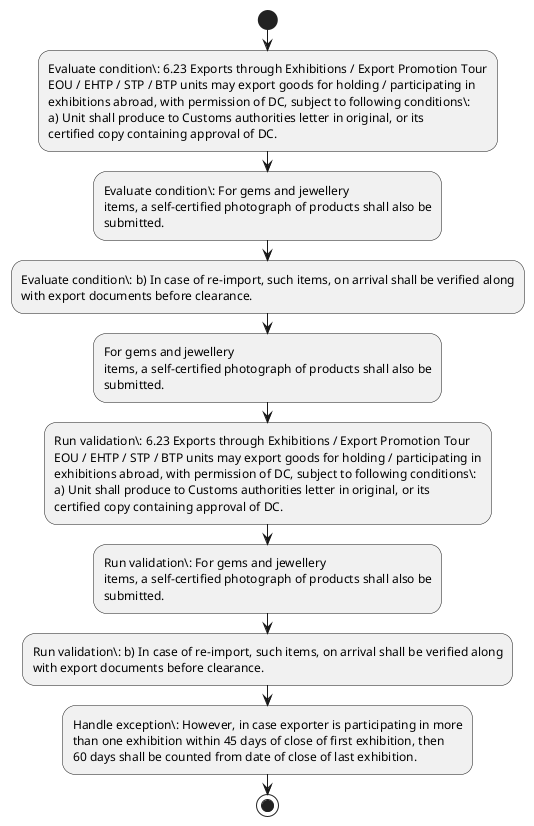

# Chapter 6 / Section 6.23: Exports through Exhibitions / Export Promotion Tour

**Chapter Title:** Export Oriented Units (EOUs), Electronics Hardware Technology Parks (EHTPs), Software Technology Parks (STPs) and Bio-Technology

**Pages:** 14

**Purpose:** 6.23 Exports through Exhibitions / Export Promotion Tour
EOU / EHTP / STP / BTP units may export goods for holding / participating in
exhibitions abroad, with permission of DC, subject to following conditions:
a) Unit shall produce to Customs authorities letter in original, or its
certified copy containing approval of DC.

**Purpose Thanglish:** Indha Exports through Exhibitions / Export Promotion Tour section-la, 6.23 Exports through Exhibitions / export Promotion Tour
EOU / EHTP / STP / BTP units may export goods for holding / participating in
exhibitions abroad, with permission of DC, subject to following conditions:
a) Unit kandippa produce to Customs authorities letter in original, or its
certified copy containing approval of DC.

**Summary:** 6.23 Exports through Exhibitions / Export Promotion Tour
EOU / EHTP / STP / BTP units may export goods for holding / participating in
exhibitions abroad, with permission of DC, subject to following conditions:
a) Unit shall produce to Customs authorities letter in original, or its
certified copy containing approval of DC. For gems and jewellery
items, a self-certified photograph of products shall also be
submitted. b) In case of re-import, such items, on arrival shall be verified along
with export documents before clearance.

**Business Meaning:** Exports through Exhibitions / Export Promotion Tour governs how DGFT business controls should be applied, validated, and enforced.

**Business Explanation:** Exports through Exhibitions / Export Promotion Tour explains the operating rule set that DEKAI should enforce. Key control points include 6.23 Exports through Exhibitions / Export Promotion Tour
EOU / EHTP / STP / BTP units may export goods for holding / participating in
exhibitions abroad, with permission of DC, subject to following conditions:
a) Unit shall produce to Customs authorities letter in original, or its
certified copy containing approval of DC. The section also drives actions such as For gems and jewellery
items, a self-certified photograph of products shall also be
submitted..

**Business Explanation Thanglish:** Indha Exports through Exhibitions / Export Promotion Tour section-la, Exports through Exhibitions / export Promotion Tour explains the operating rule set that DEKAI should enforce. Key control points include 6.23 Exports through Exhibitions / export Promotion Tour
EOU / EHTP / STP / BTP units may export goods for holding / participating in
exhibitions abroad, with permission of DC, subject to following conditions:
a) Unit kandippa produce to Customs authorities letter in original, or its
certified copy containing approval of DC. The section also drives actions such as For gems and jewellery
items, a self-certified photograph of products kandippa also be
submitted..

## Business Logic
- 6.23 Exports through Exhibitions / Export Promotion Tour
EOU / EHTP / STP / BTP units may export goods for holding / participating in
exhibitions abroad, with permission of DC, subject to following conditions:
a) Unit shall produce to Customs authorities letter in original, or its
certified copy containing approval of DC.
- For gems and jewellery
items, a self-certified photograph of products shall also be
submitted.
- b) In case of re-import, such items, on arrival shall be verified along
with export documents before clearance.
- c) Items not sold abroad shall be re-imported within 60 days of close
of exhibition.
- However, in case exporter is participating in more
than one exhibition within 45 days of close of first exhibition, then
60 days shall be counted from date of close of last exhibition.
- In
case of exhibition in USA, the time period shall be 90 days instead
of 60 days mentioned above.
- d) In case of personal carriage of goods and for holding / participating
in overseas exhibitions, value of such gems and jewellery shall not
exceed US $ 5 million.
- 6.23 Exports through Exhibitions / Export Promotion Tour
EOU / EHTP / STP / BTP units may export goods for holding / participating in
exhibitions abroad, with permission of DC, subject to following conditions:
a)
Unit shall produce to Customs authorities letter in original, or its
certified copy containing approval of DC.
- b)
In case of re-import, such items, on arrival shall be verified along
with export documents before clearance.
- c)
Items not sold abroad shall be re-imported within 60 days of close
of exhibition.
- d)
In case of personal carriage of goods and for holding / participating
in overseas exhibitions, value of such gems and jewellery shall not
exceed US $ 5 million.

## Business Rules
- rule_id=CH6-SEC6_23-R001, rule_description=6.23 Exports through Exhibitions / Export Promotion Tour
EOU / EHTP / STP / BTP units may export goods for holding / participating in
exhibitions abroad, with permission of DC, subject to following conditions:
a) Unit shall produce to Customs authorities letter in original, or its
certified copy containing approval of DC., trigger=Exports through Exhibitions / Export Promotion Tour, condition=6.23 Exports through Exhibitions / Export Promotion Tour
EOU / EHTP / STP / BTP units may export goods for holding / participating in
exhibitions abroad, with permission of DC, subject to following conditions:
a) Unit shall produce to Customs authorities letter in original, or its
certified copy containing approval of DC., validation=6.23 Exports through Exhibitions / Export Promotion Tour
EOU / EHTP / STP / BTP units may export goods for holding / participating in
exhibitions abroad, with permission of DC, subject to following conditions:
a) Unit shall produce to Customs authorities letter in original, or its
certified copy containing approval of DC., action=For gems and jewellery
items, a self-certified photograph of products shall also be
submitted., exception=However, in case exporter is participating in more
than one exhibition within 45 days of close of first exhibition, then
60 days shall be counted from date of close of last exhibition., output=DEKAI should produce a compliance decision for 6.23 - Exports through Exhibitions / Export Promotion Tour.
- rule_id=CH6-SEC6_23-R002, rule_description=For gems and jewellery
items, a self-certified photograph of products shall also be
submitted., trigger=Exports through Exhibitions / Export Promotion Tour, condition=For gems and jewellery
items, a self-certified photograph of products shall also be
submitted., validation=For gems and jewellery
items, a self-certified photograph of products shall also be
submitted., action=For gems and jewellery
items, a self-certified photograph of products shall also be
submitted., exception=However, in case exporter is participating in more
than one exhibition within 45 days of close of first exhibition, then
60 days shall be counted from date of close of last exhibition., output=DEKAI should produce a compliance decision for 6.23 - Exports through Exhibitions / Export Promotion Tour.
- rule_id=CH6-SEC6_23-R003, rule_description=b) In case of re-import, such items, on arrival shall be verified along
with export documents before clearance., trigger=Exports through Exhibitions / Export Promotion Tour, condition=b) In case of re-import, such items, on arrival shall be verified along
with export documents before clearance., validation=b) In case of re-import, such items, on arrival shall be verified along
with export documents before clearance., action=For gems and jewellery
items, a self-certified photograph of products shall also be
submitted., exception=However, in case exporter is participating in more
than one exhibition within 45 days of close of first exhibition, then
60 days shall be counted from date of close of last exhibition., output=DEKAI should produce a compliance decision for 6.23 - Exports through Exhibitions / Export Promotion Tour.
- rule_id=CH6-SEC6_23-R004, rule_description=c) Items not sold abroad shall be re-imported within 60 days of close
of exhibition., trigger=Exports through Exhibitions / Export Promotion Tour, condition=However, in case exporter is participating in more
than one exhibition within 45 days of close of first exhibition, then
60 days shall be counted from date of close of last exhibition., validation=c) Items not sold abroad shall be re-imported within 60 days of close
of exhibition., action=For gems and jewellery
items, a self-certified photograph of products shall also be
submitted., exception=However, in case exporter is participating in more
than one exhibition within 45 days of close of first exhibition, then
60 days shall be counted from date of close of last exhibition., output=DEKAI should produce a compliance decision for 6.23 - Exports through Exhibitions / Export Promotion Tour.
- rule_id=CH6-SEC6_23-R005, rule_description=However, in case exporter is participating in more
than one exhibition within 45 days of close of first exhibition, then
60 days shall be counted from date of close of last exhibition., trigger=Exports through Exhibitions / Export Promotion Tour, condition=d) In case of personal carriage of goods and for holding / participating
in overseas exhibitions, value of such gems and jewellery shall not
exceed US $ 5 million., validation=However, in case exporter is participating in more
than one exhibition within 45 days of close of first exhibition, then
60 days shall be counted from date of close of last exhibition., action=For gems and jewellery
items, a self-certified photograph of products shall also be
submitted., exception=However, in case exporter is participating in more
than one exhibition within 45 days of close of first exhibition, then
60 days shall be counted from date of close of last exhibition., output=DEKAI should produce a compliance decision for 6.23 - Exports through Exhibitions / Export Promotion Tour.
- rule_id=CH6-SEC6_23-R006, rule_description=In
case of exhibition in USA, the time period shall be 90 days instead
of 60 days mentioned above., trigger=Exports through Exhibitions / Export Promotion Tour, condition=6.23 Exports through Exhibitions / Export Promotion Tour
EOU / EHTP / STP / BTP units may export goods for holding / participating in
exhibitions abroad, with permission of DC, subject to following conditions:
a)
Unit shall produce to Customs authorities letter in original, or its
certified copy containing approval of DC., validation=In
case of exhibition in USA, the time period shall be 90 days instead
of 60 days mentioned above., action=For gems and jewellery
items, a self-certified photograph of products shall also be
submitted., exception=However, in case exporter is participating in more
than one exhibition within 45 days of close of first exhibition, then
60 days shall be counted from date of close of last exhibition., output=DEKAI should produce a compliance decision for 6.23 - Exports through Exhibitions / Export Promotion Tour.
- rule_id=CH6-SEC6_23-R007, rule_description=d) In case of personal carriage of goods and for holding / participating
in overseas exhibitions, value of such gems and jewellery shall not
exceed US $ 5 million., trigger=Exports through Exhibitions / Export Promotion Tour, condition=b)
In case of re-import, such items, on arrival shall be verified along
with export documents before clearance., validation=d) In case of personal carriage of goods and for holding / participating
in overseas exhibitions, value of such gems and jewellery shall not
exceed US $ 5 million., action=For gems and jewellery
items, a self-certified photograph of products shall also be
submitted., exception=However, in case exporter is participating in more
than one exhibition within 45 days of close of first exhibition, then
60 days shall be counted from date of close of last exhibition., output=DEKAI should produce a compliance decision for 6.23 - Exports through Exhibitions / Export Promotion Tour.
- rule_id=CH6-SEC6_23-R008, rule_description=6.23 Exports through Exhibitions / Export Promotion Tour
EOU / EHTP / STP / BTP units may export goods for holding / participating in
exhibitions abroad, with permission of DC, subject to following conditions:
a)
Unit shall produce to Customs authorities letter in original, or its
certified copy containing approval of DC., trigger=Exports through Exhibitions / Export Promotion Tour, condition=d)
In case of personal carriage of goods and for holding / participating
in overseas exhibitions, value of such gems and jewellery shall not
exceed US $ 5 million., validation=6.23 Exports through Exhibitions / Export Promotion Tour
EOU / EHTP / STP / BTP units may export goods for holding / participating in
exhibitions abroad, with permission of DC, subject to following conditions:
a)
Unit shall produce to Customs authorities letter in original, or its
certified copy containing approval of DC., action=For gems and jewellery
items, a self-certified photograph of products shall also be
submitted., exception=However, in case exporter is participating in more
than one exhibition within 45 days of close of first exhibition, then
60 days shall be counted from date of close of last exhibition., output=DEKAI should produce a compliance decision for 6.23 - Exports through Exhibitions / Export Promotion Tour.
- rule_id=CH6-SEC6_23-R009, rule_description=b)
In case of re-import, such items, on arrival shall be verified along
with export documents before clearance., trigger=Exports through Exhibitions / Export Promotion Tour, condition=d)
In case of personal carriage of goods and for holding / participating
in overseas exhibitions, value of such gems and jewellery shall not
exceed US $ 5 million., validation=b)
In case of re-import, such items, on arrival shall be verified along
with export documents before clearance., action=For gems and jewellery
items, a self-certified photograph of products shall also be
submitted., exception=However, in case exporter is participating in more
than one exhibition within 45 days of close of first exhibition, then
60 days shall be counted from date of close of last exhibition., output=DEKAI should produce a compliance decision for 6.23 - Exports through Exhibitions / Export Promotion Tour.
- rule_id=CH6-SEC6_23-R010, rule_description=c)
Items not sold abroad shall be re-imported within 60 days of close
of exhibition., trigger=Exports through Exhibitions / Export Promotion Tour, condition=d)
In case of personal carriage of goods and for holding / participating
in overseas exhibitions, value of such gems and jewellery shall not
exceed US $ 5 million., validation=c)
Items not sold abroad shall be re-imported within 60 days of close
of exhibition., action=For gems and jewellery
items, a self-certified photograph of products shall also be
submitted., exception=However, in case exporter is participating in more
than one exhibition within 45 days of close of first exhibition, then
60 days shall be counted from date of close of last exhibition., output=DEKAI should produce a compliance decision for 6.23 - Exports through Exhibitions / Export Promotion Tour.
- rule_id=CH6-SEC6_23-R011, rule_description=d)
In case of personal carriage of goods and for holding / participating
in overseas exhibitions, value of such gems and jewellery shall not
exceed US $ 5 million., trigger=Exports through Exhibitions / Export Promotion Tour, condition=d)
In case of personal carriage of goods and for holding / participating
in overseas exhibitions, value of such gems and jewellery shall not
exceed US $ 5 million., validation=d)
In case of personal carriage of goods and for holding / participating
in overseas exhibitions, value of such gems and jewellery shall not
exceed US $ 5 million., action=For gems and jewellery
items, a self-certified photograph of products shall also be
submitted., exception=However, in case exporter is participating in more
than one exhibition within 45 days of close of first exhibition, then
60 days shall be counted from date of close of last exhibition., output=DEKAI should produce a compliance decision for 6.23 - Exports through Exhibitions / Export Promotion Tour.

## Conditions
- 6.23 Exports through Exhibitions / Export Promotion Tour
EOU / EHTP / STP / BTP units may export goods for holding / participating in
exhibitions abroad, with permission of DC, subject to following conditions:
a) Unit shall produce to Customs authorities letter in original, or its
certified copy containing approval of DC.
- For gems and jewellery
items, a self-certified photograph of products shall also be
submitted.
- b) In case of re-import, such items, on arrival shall be verified along
with export documents before clearance.
- However, in case exporter is participating in more
than one exhibition within 45 days of close of first exhibition, then
60 days shall be counted from date of close of last exhibition.
- d) In case of personal carriage of goods and for holding / participating
in overseas exhibitions, value of such gems and jewellery shall not
exceed US $ 5 million.
- 6.23 Exports through Exhibitions / Export Promotion Tour
EOU / EHTP / STP / BTP units may export goods for holding / participating in
exhibitions abroad, with permission of DC, subject to following conditions:
a)
Unit shall produce to Customs authorities letter in original, or its
certified copy containing approval of DC.
- b)
In case of re-import, such items, on arrival shall be verified along
with export documents before clearance.
- d)
In case of personal carriage of goods and for holding / participating
in overseas exhibitions, value of such gems and jewellery shall not
exceed US $ 5 million.

## Condition Logic
- id=6.6.23.1, if=6.23 Exports through Exhibitions / Export Promotion Tour
EOU / EHTP / STP / BTP units may export goods for holding / participating in
exhibitions abroad, with permission of DC, subject to following conditions:
a) Unit shall produce to Customs authorities letter in original, or its
certified copy containing approval of DC., then=For gems and jewellery
items, a self-certified photograph of products shall also be
submitted., source=6.23 Exports through Exhibitions / Export Promotion Tour
EOU / EHTP / STP / BTP units may export goods for holding / participating in
exhibitions abroad, with permission of DC, subject to following conditions:
a) Unit shall produce to Customs authorities letter in original, or its
certified copy containing approval of DC.
- id=6.6.23.2, if=For gems and jewellery
items, a self-certified photograph of products shall also be
submitted., then=For gems and jewellery
items, a self-certified photograph of products shall also be
submitted., source=For gems and jewellery
items, a self-certified photograph of products shall also be
submitted.
- id=6.6.23.3, if=b) In case of re-import, such items, on arrival shall be verified along
with export documents before clearance., then=For gems and jewellery
items, a self-certified photograph of products shall also be
submitted., source=b) In case of re-import, such items, on arrival shall be verified along
with export documents before clearance.
- id=6.6.23.4, if=However, in case exporter is participating in more
than one exhibition within 45 days of close of first exhibition, then
60 days shall be counted from date of close of last exhibition., then=60 days shall be counted from date of close of last exhibition., source=However, in case exporter is participating in more
than one exhibition within 45 days of close of first exhibition, then
60 days shall be counted from date of close of last exhibition.
- id=6.6.23.5, if=d) In case of personal carriage of goods and for holding / participating
in overseas exhibitions, value of such gems and jewellery shall not
exceed US $ 5 million., then=For gems and jewellery
items, a self-certified photograph of products shall also be
submitted., source=d) In case of personal carriage of goods and for holding / participating
in overseas exhibitions, value of such gems and jewellery shall not
exceed US $ 5 million.
- id=6.6.23.6, if=6.23 Exports through Exhibitions / Export Promotion Tour
EOU / EHTP / STP / BTP units may export goods for holding / participating in
exhibitions abroad, with permission of DC, subject to following conditions:
a)
Unit shall produce to Customs authorities letter in original, or its
certified copy containing approval of DC., then=For gems and jewellery
items, a self-certified photograph of products shall also be
submitted., source=6.23 Exports through Exhibitions / Export Promotion Tour
EOU / EHTP / STP / BTP units may export goods for holding / participating in
exhibitions abroad, with permission of DC, subject to following conditions:
a)
Unit shall produce to Customs authorities letter in original, or its
certified copy containing approval of DC.
- id=6.6.23.7, if=b)
In case of re-import, such items, on arrival shall be verified along
with export documents before clearance., then=For gems and jewellery
items, a self-certified photograph of products shall also be
submitted., source=b)
In case of re-import, such items, on arrival shall be verified along
with export documents before clearance.
- id=6.6.23.8, if=d)
In case of personal carriage of goods and for holding / participating
in overseas exhibitions, value of such gems and jewellery shall not
exceed US $ 5 million., then=For gems and jewellery
items, a self-certified photograph of products shall also be
submitted., source=d)
In case of personal carriage of goods and for holding / participating
in overseas exhibitions, value of such gems and jewellery shall not
exceed US $ 5 million.

## Validations
- 6.23 Exports through Exhibitions / Export Promotion Tour
EOU / EHTP / STP / BTP units may export goods for holding / participating in
exhibitions abroad, with permission of DC, subject to following conditions:
a) Unit shall produce to Customs authorities letter in original, or its
certified copy containing approval of DC.
- For gems and jewellery
items, a self-certified photograph of products shall also be
submitted.
- b) In case of re-import, such items, on arrival shall be verified along
with export documents before clearance.
- c) Items not sold abroad shall be re-imported within 60 days of close
of exhibition.
- However, in case exporter is participating in more
than one exhibition within 45 days of close of first exhibition, then
60 days shall be counted from date of close of last exhibition.
- In
case of exhibition in USA, the time period shall be 90 days instead
of 60 days mentioned above.
- d) In case of personal carriage of goods and for holding / participating
in overseas exhibitions, value of such gems and jewellery shall not
exceed US $ 5 million.
- 6.23 Exports through Exhibitions / Export Promotion Tour
EOU / EHTP / STP / BTP units may export goods for holding / participating in
exhibitions abroad, with permission of DC, subject to following conditions:
a)
Unit shall produce to Customs authorities letter in original, or its
certified copy containing approval of DC.
- b)
In case of re-import, such items, on arrival shall be verified along
with export documents before clearance.
- c)
Items not sold abroad shall be re-imported within 60 days of close
of exhibition.
- d)
In case of personal carriage of goods and for holding / participating
in overseas exhibitions, value of such gems and jewellery shall not
exceed US $ 5 million.

## Exceptions
- However, in case exporter is participating in more
than one exhibition within 45 days of close of first exhibition, then
60 days shall be counted from date of close of last exhibition.

## Dependencies
- None identified

## Authorities
- Customs
- Unit shall produce to Customs

## Required Documents
- 6.23 Exports through Exhibitions / Export Promotion Tour
EOU / EHTP / STP / BTP units may export goods for holding / participating in
exhibitions abroad, with permission of DC, subject to following conditions:
a) Unit shall produce to Customs authorities letter in original, or its
certified copy containing approval of DC.
- b) In case of re-import, such items, on arrival shall be verified along
with export documents before clearance.
- 6.23 Exports through Exhibitions / Export Promotion Tour
EOU / EHTP / STP / BTP units may export goods for holding / participating in
exhibitions abroad, with permission of DC, subject to following conditions:
a)
Unit shall produce to Customs authorities letter in original, or its
certified copy containing approval of DC.
- b)
In case of re-import, such items, on arrival shall be verified along
with export documents before clearance.

## Timelines
- b) In case of re-import, such items, on arrival shall be verified along
with export documents before clearance.
- c) Items not sold abroad shall be re-imported within 60 days of close
of exhibition.
- However, in case exporter is participating in more
than one exhibition within 45 days of close of first exhibition, then
60 days shall be counted from date of close of last exhibition.
- In
case of exhibition in USA, the time period shall be 90 days instead
of 60 days mentioned above.
- b)
In case of re-import, such items, on arrival shall be verified along
with export documents before clearance.
- c)
Items not sold abroad shall be re-imported within 60 days of close
of exhibition.

## Actions
- For gems and jewellery
items, a self-certified photograph of products shall also be
submitted.

## Workflow
- Evaluate condition: 6.23 Exports through Exhibitions / Export Promotion Tour
EOU / EHTP / STP / BTP units may export goods for holding / participating in
exhibitions abroad, with permission of DC, subject to following conditions:
a) Unit shall produce to Customs authorities letter in original, or its
certified copy containing approval of DC.
- Evaluate condition: For gems and jewellery
items, a self-certified photograph of products shall also be
submitted.
- Evaluate condition: b) In case of re-import, such items, on arrival shall be verified along
with export documents before clearance.
- For gems and jewellery
items, a self-certified photograph of products shall also be
submitted.
- Run validation: 6.23 Exports through Exhibitions / Export Promotion Tour
EOU / EHTP / STP / BTP units may export goods for holding / participating in
exhibitions abroad, with permission of DC, subject to following conditions:
a) Unit shall produce to Customs authorities letter in original, or its
certified copy containing approval of DC.
- Run validation: For gems and jewellery
items, a self-certified photograph of products shall also be
submitted.
- Run validation: b) In case of re-import, such items, on arrival shall be verified along
with export documents before clearance.
- Handle exception: However, in case exporter is participating in more
than one exhibition within 45 days of close of first exhibition, then
60 days shall be counted from date of close of last exhibition.

## Workflow ASCII
```text
Exports through Exhibitions / Export Promotion Tour
Evaluate condition: 6.23 Exports through Exhibitions / Export Promotion Tour
EOU / EHTP / STP / BTP units may export goods for holding / participating in
exhibitions abroad, with permission of DC, subject to following conditions:
a) Unit shall produce to Customs authorities letter in original, or its
certified copy containing approval of DC.
   |
   v
Evaluate condition: For gems and jewellery
items, a self-certified photograph of products shall also be
submitted.
   |
   v
Evaluate condition: b) In case of re-import, such items, on arrival shall be verified along
with export documents before clearance.
   |
   v
For gems and jewellery
items, a self-certified photograph of products shall also be
submitted.
   |
   v
Run validation: 6.23 Exports through Exhibitions / Export Promotion Tour
EOU / EHTP / STP / BTP units may export goods for holding / participating in
exhibitions abroad, with permission of DC, subject to following conditions:
a) Unit shall produce to Customs authorities letter in original, or its
certified copy containing approval of DC.
   |
   v
Run validation: For gems and jewellery
items, a self-certified photograph of products shall also be
submitted.
   |
   v
Run validation: b) In case of re-import, such items, on arrival shall be verified along
with export documents before clearance.
   |
   v
Handle exception: However, in case exporter is participating in more
than one exhibition within 45 days of close of first exhibition, then
60 days shall be counted from date of close of last exhibition.
```

## Decision Tree
- IF 6.23 Exports through Exhibitions / Export Promotion Tour
EOU / EHTP / STP / BTP units may export goods for holding / participating in
exhibitions abroad, with permission of DC, subject to following conditions:
a) Unit shall produce to Customs authorities letter in original, or its
certified copy containing approval of DC. THEN For gems and jewellery
items, a self-certified photograph of products shall also be
submitted.
- IF For gems and jewellery
items, a self-certified photograph of products shall also be
submitted. THEN For gems and jewellery
items, a self-certified photograph of products shall also be
submitted.
- IF b) In case of re-import, such items, on arrival shall be verified along
with export documents before clearance. THEN For gems and jewellery
items, a self-certified photograph of products shall also be
submitted.
- IF However, in case exporter is participating in more
than one exhibition within 45 days of close of first exhibition, then
60 days shall be counted from date of close of last exhibition. THEN For gems and jewellery
items, a self-certified photograph of products shall also be
submitted.
- IF d) In case of personal carriage of goods and for holding / participating
in overseas exhibitions, value of such gems and jewellery shall not
exceed US $ 5 million. THEN For gems and jewellery
items, a self-certified photograph of products shall also be
submitted.
- IF exception applies (However, in case exporter is participating in more
than one exhibition within 45 days of close of first exhibition, then
60 days shall be counted from date of close of last exhibition.) THEN route to manual review

## Decision Tree ASCII
```text
Exports through Exhibitions / Export Promotion Tour Decision
IF 6.23 Exports through Exhibitions / Export Promotion Tour
EOU / EHTP / STP / BTP units may export goods for holding / participating in
exhibitions abroad, with permission of DC, subject to following conditions:
a) Unit shall produce to Customs authorities letter in original, or its
certified copy containing approval of DC. THEN For gems and jewellery
items, a self-certified photograph of products shall also be
submitted.
   |
   v
IF For gems and jewellery
items, a self-certified photograph of products shall also be
submitted. THEN For gems and jewellery
items, a self-certified photograph of products shall also be
submitted.
   |
   v
IF b) In case of re-import, such items, on arrival shall be verified along
with export documents before clearance. THEN For gems and jewellery
items, a self-certified photograph of products shall also be
submitted.
   |
   v
IF However, in case exporter is participating in more
than one exhibition within 45 days of close of first exhibition, then
60 days shall be counted from date of close of last exhibition. THEN For gems and jewellery
items, a self-certified photograph of products shall also be
submitted.
   |
   v
IF d) In case of personal carriage of goods and for holding / participating
in overseas exhibitions, value of such gems and jewellery shall not
exceed US $ 5 million. THEN For gems and jewellery
items, a self-certified photograph of products shall also be
submitted.
   |
   v
IF exception applies (However, in case exporter is participating in more
than one exhibition within 45 days of close of first exhibition, then
60 days shall be counted from date of close of last exhibition.) THEN route to manual review
```

## Examples
- User asks to process Exports through Exhibitions / Export Promotion Tour; the platform checks conditions, validations, and documents before action.

**Real-world Example:** Example: an importer or exporter invokes Exports through Exhibitions / Export Promotion Tour, submits 6.23 Exports through Exhibitions / Export Promotion Tour
EOU / EHTP / STP / BTP units may export goods for holding / participating in
exhibitions abroad, with permission of DC, subject to following conditions:
a) Unit shall produce to Customs authorities letter in original, or its
certified copy containing approval of DC., b) In case of re-import, such items, on arrival shall be verified along
with export documents before clearance., 6.23 Exports through Exhibitions / Export Promotion Tour
EOU / EHTP / STP / BTP units may export goods for holding / participating in
exhibitions abroad, with permission of DC, subject to following conditions:
a)
Unit shall produce to Customs authorities letter in original, or its
certified copy containing approval of DC., and DEKAI uses the extracted rules to for gems and jewellery
items, a self-certified photograph of products shall also be
submitted..

**Real-world Example Thanglish:** Indha Exports through Exhibitions / Export Promotion Tour section-la, Example: an importer or exporter invokes Exports through Exhibitions / export Promotion Tour, submits 6.23 Exports through Exhibitions / export Promotion Tour
EOU / EHTP / STP / BTP units may export goods for holding / participating in
exhibitions abroad, with permission of DC, subject to following conditions:
a) Unit kandippa produce to Customs authorities letter in original, or its
certified copy containing approval of DC., b) In case of re-import, such items, on arrival kandippa be verified along
with export documents before clearance., 6.23 Exports through Exhibitions / export Promotion Tour
EOU / EHTP / STP / BTP units may export goods for holding / participating in
exhibitions abroad, with permission of DC, subject to following conditions:
a)
Unit kandippa produce to Customs authorities letter in original, or its
certified copy containing approval of DC., and DEKAI uses the extracted rules to for gems and jewellery
items, a self-certified photograph of products kandippa also be
submitted..

## AI Rules
- IF detected context matches section rule THEN enforce: 6.23 Exports through Exhibitions / Export Promotion Tour
EOU / EHTP / STP / BTP units may export goods for holding / participating in
exhibitions abroad, with permission of DC, subject to following conditions:
a) Unit shall produce to Customs authorities letter in original, or its
certified copy containing approval of DC.
- IF detected context matches section rule THEN enforce: For gems and jewellery
items, a self-certified photograph of products shall also be
submitted.
- IF detected context matches section rule THEN enforce: b) In case of re-import, such items, on arrival shall be verified along
with export documents before clearance.
- IF detected context matches section rule THEN enforce: c) Items not sold abroad shall be re-imported within 60 days of close
of exhibition.
- IF detected context matches section rule THEN enforce: However, in case exporter is participating in more
than one exhibition within 45 days of close of first exhibition, then
60 days shall be counted from date of close of last exhibition.
- IF detected context matches section rule THEN enforce: In
case of exhibition in USA, the time period shall be 90 days instead
of 60 days mentioned above.
- IF validations pass THEN recommend action: For gems and jewellery
items, a self-certified photograph of products shall also be
submitted.

## Database Fields
- name=section_code, type=string, required=True, source=parsed_section_heading
- name=section_title, type=string, required=True, source=parsed_section_heading
- name=eou_flag, type=boolean, required=False, source=keyword:EOU
- name=stp_flag, type=boolean, required=False, source=keyword:STP
- name=btp_flag, type=boolean, required=False, source=keyword:BTP
- name=may_flag, type=boolean, required=False, source=keyword:may
- name=for_flag, type=boolean, required=False, source=keyword:for
- name=its_flag, type=boolean, required=False, source=keyword:its
- name=and_flag, type=boolean, required=False, source=keyword:and
- name=not_flag, type=boolean, required=False, source=keyword:not
- name=document_1_submitted, type=boolean, required=True, source=6.23 Exports through Exhibitions / Export Promotion Tour
EOU / EHTP / STP / BTP units may export goods for holding / participating in
exhibitions abroad, with permission of DC, subject to following conditions:
a) Unit shall produce to Customs authorities letter in original, or its
certified copy containing approval of DC.
- name=document_2_submitted, type=boolean, required=True, source=b) In case of re-import, such items, on arrival shall be verified along
with export documents before clearance.
- name=document_3_submitted, type=boolean, required=True, source=6.23 Exports through Exhibitions / Export Promotion Tour
EOU / EHTP / STP / BTP units may export goods for holding / participating in
exhibitions abroad, with permission of DC, subject to following conditions:
a)
Unit shall produce to Customs authorities letter in original, or its
certified copy containing approval of DC.
- name=document_4_submitted, type=boolean, required=True, source=b)
In case of re-import, such items, on arrival shall be verified along
with export documents before clearance.

## API Requirements
- method=GET, path=/api/dgft/sections/6.23, purpose=Retrieve knowledge payload for section 6.23, query_params=['include=workflow,decision_tree,validations'], response_fields=['section', 'title', 'summary', 'conditions', 'validations', 'exceptions', 'workflow', 'decision_tree']
- method=POST, path=/api/dgft/Exports-through-Exhibitions-Export-Promotion-Tour/validate, purpose=Validate inputs and documents for Exports through Exhibitions / Export Promotion Tour, request_fields=['section_code', 'section_title', 'document_1_submitted', 'document_2_submitted', 'document_3_submitted', 'document_4_submitted'], response_fields=['status', 'errors', 'warnings', 'next_actions']
- method=POST, path=/api/dgft/Exports-through-Exhibitions-Export-Promotion-Tour/execute, purpose=Trigger business action for For gems and jewellery
items, a self-certified photograph of products shall also be
submitted., request_fields=['section_code', 'section_title', 'document_1_submitted', 'document_2_submitted', 'document_3_submitted', 'document_4_submitted'], response_fields=['reference_id', 'status', 'authority', 'timeline']

## UI Screens
- screen_id=Exports_through_Exhibitions_Export_Promotion_Tour_overview, name=Exports through Exhibitions / Export Promotion Tour Overview, purpose=Show section summary, authority, timeline, and eligibility cues., widgets=['summary_card', 'conditions_table', 'authority_badges', 'timeline_panel']
- screen_id=Exports_through_Exhibitions_Export_Promotion_Tour_submission, name=Exports through Exhibitions / Export Promotion Tour Submission, purpose=Capture applicant data and supporting documents., widgets=['dynamic_form', 'document_uploader', 'validation_panel', 'next_action_footer'], fields=['section_code', 'section_title', 'eou_flag', 'stp_flag', 'btp_flag', 'may_flag', 'for_flag', 'its_flag']
- screen_id=Exports_through_Exhibitions_Export_Promotion_Tour_exceptions, name=Exports through Exhibitions / Export Promotion Tour Exception Review, purpose=Explain exception handling and manual review triggers., widgets=['exception_banner', 'decision_tree', 'case_notes']

## Error Messages
- Validation failed because the section requirements were not fully met.

## FAQ
- question_en=What is the purpose of section 6.23?, answer_en=Exports through Exhibitions / Export Promotion Tour explains the operating rule set that DEKAI should enforce. Key control points include 6.23 Exports through Exhibitions / Export Promotion Tour
EOU / EHTP / STP / BTP units may export goods for holding / participating in
exhibitions abroad, with permission of DC, subject to following conditions:
a) Unit shall produce to Customs authorities letter in original, or its
certified copy containing approval of DC. The section also drives actions such as For gems and jewellery
items, a self-certified photograph of products shall also be
submitted.., question_thanglish=Indha Exports through Exhibitions / Export Promotion Tour section-la, What is the purpose of section 6.23?, answer_thanglish=Indha Exports through Exhibitions / Export Promotion Tour section-la, Exports through Exhibitions / export Promotion Tour explains the operating rule set that DEKAI should enforce. Key control points include 6.23 Exports through Exhibitions / export Promotion Tour
EOU / EHTP / STP / BTP units may export goods for holding / participating in
exhibitions abroad, with permission of DC, subject to following conditions:
a) Unit kandippa produce to Customs authorities letter in original, or its
certified copy containing approval of DC. The section also drives actions such as For gems and jewellery
items, a self-certified photograph of products kandippa also be
submitted..
- question_en=What documents are required under Exports through Exhibitions / Export Promotion Tour?, answer_en=6.23 Exports through Exhibitions / Export Promotion Tour
EOU / EHTP / STP / BTP units may export goods for holding / participating in
exhibitions abroad, with permission of DC, subject to following conditions:
a) Unit shall produce to Customs authorities letter in original, or its
certified copy containing approval of DC., b) In case of re-import, such items, on arrival shall be verified along
with export documents before clearance., 6.23 Exports through Exhibitions / Export Promotion Tour
EOU / EHTP / STP / BTP units may export goods for holding / participating in
exhibitions abroad, with permission of DC, subject to following conditions:
a)
Unit shall produce to Customs authorities letter in original, or its
certified copy containing approval of DC., b)
In case of re-import, such items, on arrival shall be verified along
with export documents before clearance., question_thanglish=Indha Exports through Exhibitions / Export Promotion Tour section-la, What documents are required under Exports through Exhibitions / export Promotion Tour?, answer_thanglish=Indha Exports through Exhibitions / Export Promotion Tour section-la, 6.23 Exports through Exhibitions / export Promotion Tour
EOU / EHTP / STP / BTP units may export goods for holding / participating in
exhibitions abroad, with permission of DC, subject to following conditions:
a) Unit kandippa produce to Customs authorities letter in original, or its
certified copy containing approval of DC., b) In case of re-import, such items, on arrival kandippa be verified along
with export documents before clearance., 6.23 Exports through Exhibitions / export Promotion Tour
EOU / EHTP / STP / BTP units may export goods for holding / participating in
exhibitions abroad, with permission of DC, subject to following conditions:
a)
Unit kandippa produce to Customs authorities letter in original, or its
certified copy containing approval of DC., b)
In case of re-import, such items, on arrival kandippa be verified along
with export documents before clearance.
- question_en=Which authority handles Exports through Exhibitions / Export Promotion Tour?, answer_en=Customs, Unit shall produce to Customs, question_thanglish=Indha Exports through Exhibitions / Export Promotion Tour section-la, Which authority handles Exports through Exhibitions / export Promotion Tour?, answer_thanglish=Indha Exports through Exhibitions / Export Promotion Tour section-la, Customs, Unit kandippa produce to Customs

## Questions Users May Ask
- What does Exports through Exhibitions / Export Promotion Tour require?
- Which documents are needed for Exports through Exhibitions / Export Promotion Tour?
- How does DEKAI validate Exports through Exhibitions / Export Promotion Tour requests?
- What action should be taken for Exports through Exhibitions / Export Promotion Tour?

## Expected AI Answers
- Exports through Exhibitions / Export Promotion Tour requires the platform to interpret the section text, apply the extracted business rules, and present the correct next action.
- Required documents are inferred from the section text: 6.23 Exports through Exhibitions / Export Promotion Tour
EOU / EHTP / STP / BTP units may export goods for holding / participating in
exhibitions abroad, with permission of DC, subject to following conditions:
a) Unit shall produce to Customs authorities letter in original, or its
certified copy containing approval of DC., b) In case of re-import, such items, on arrival shall be verified along
with export documents before clearance., 6.23 Exports through Exhibitions / Export Promotion Tour
EOU / EHTP / STP / BTP units may export goods for holding / participating in
exhibitions abroad, with permission of DC, subject to following conditions:
a)
Unit shall produce to Customs authorities letter in original, or its
certified copy containing approval of DC., b)
In case of re-import, such items, on arrival shall be verified along
with export documents before clearance.
- DEKAI validates Exports through Exhibitions / Export Promotion Tour by checking conditions, required documents, authority references, and exception clauses before recommending an outcome.
- The primary extracted action is: For gems and jewellery
items, a self-certified photograph of products shall also be
submitted.

## AI Q&A Examples
- question_en=User asks: How do I comply with Exports through Exhibitions / Export Promotion Tour?, answer_en=AI answers: DEKAI should evaluate section 6.23, apply the extracted rules, and guide the user through Evaluate condition: 6.23 Exports through Exhibitions / Export Promotion Tour
EOU / EHTP / STP / BTP units may export goods for holding / participating in
exhibitions abroad, with permission of DC, subject to following conditions:
a) Unit shall produce to Customs authorities letter in original, or its
certified copy containing approval of DC.., question_thanglish=Indha Exports through Exhibitions / Export Promotion Tour section-la, User asks: How do I comply with Exports through Exhibitions / export Promotion Tour?, answer_thanglish=Indha Exports through Exhibitions / Export Promotion Tour section-la, AI answers: DEKAI should evaluate section 6.23, apply the extracted rules, and guide the user through Evaluate condition: 6.23 Exports through Exhibitions / export Promotion Tour
EOU / EHTP / STP / BTP units may export goods for holding / participating in
exhibitions abroad, with permission of DC, subject to following conditions:
a) Unit kandippa produce to Customs authorities letter in original, or its
certified copy containing approval of DC..
- question_en=User asks: Which validations apply to Exports through Exhibitions / Export Promotion Tour?, answer_en=AI answers: Applicable validations are 6.23 Exports through Exhibitions / Export Promotion Tour
EOU / EHTP / STP / BTP units may export goods for holding / participating in
exhibitions abroad, with permission of DC, subject to following conditions:
a) Unit shall produce to Customs authorities letter in original, or its
certified copy containing approval of DC., For gems and jewellery
items, a self-certified photograph of products shall also be
submitted., b) In case of re-import, such items, on arrival shall be verified along
with export documents before clearance., question_thanglish=Indha Exports through Exhibitions / Export Promotion Tour section-la, User asks: Which validations apply to Exports through Exhibitions / export Promotion Tour?, answer_thanglish=Indha Exports through Exhibitions / Export Promotion Tour section-la, AI answers: Applicable validations are 6.23 Exports through Exhibitions / export Promotion Tour
EOU / EHTP / STP / BTP units may export goods for holding / participating in
exhibitions abroad, with permission of DC, subject to following conditions:
a) Unit kandippa produce to Customs authorities letter in original, or its
certified copy containing approval of DC., For gems and jewellery
items, a self-certified photograph of products kandippa also be
submitted., b) In case of re-import, such items, on arrival kandippa be verified along
with export documents before clearance.

## DEKAI AI Implementation Notes
- Capture chapter 6, section 6.23, title, and page references as immutable knowledge metadata.
- Bind validations for Exports through Exhibitions / Export Promotion Tour into a rule engine keyed by the rule IDs extracted for this section.
- Expose document upload controls for: 6.23 Exports through Exhibitions / Export Promotion Tour
EOU / EHTP / STP / BTP units may export goods for holding / participating in
exhibitions abroad, with permission of DC, subject to following conditions:
a) Unit shall produce to Customs authorities letter in original, or its
certified copy containing approval of DC., b) In case of re-import, such items, on arrival shall be verified along
with export documents before clearance., 6.23 Exports through Exhibitions / Export Promotion Tour
EOU / EHTP / STP / BTP units may export goods for holding / participating in
exhibitions abroad, with permission of DC, subject to following conditions:
a)
Unit shall produce to Customs authorities letter in original, or its
certified copy containing approval of DC., b)
In case of re-import, such items, on arrival shall be verified along
with export documents before clearance..
- Route escalations or approvals to: Customs, Unit shall produce to Customs.
- Trigger manual review when exception clauses are detected.

## DEKAI AI Implementation Notes Thanglish
- Indha Exports through Exhibitions / Export Promotion Tour section-la, Capture chapter 6, section 6.23, title, and page references as immutable knowledge metadata.
- Indha Exports through Exhibitions / Export Promotion Tour section-la, Bind validations for Exports through Exhibitions / export Promotion Tour into a rule engine keyed by the rule IDs extracted for this section.
- Indha Exports through Exhibitions / Export Promotion Tour section-la, Expose document upload controls for: 6.23 Exports through Exhibitions / export Promotion Tour
EOU / EHTP / STP / BTP units may export goods for holding / participating in
exhibitions abroad, with permission of DC, subject to following conditions:
a) Unit kandippa produce to Customs authorities letter in original, or its
certified copy containing approval of DC., b) In case of re-import, such items, on arrival kandippa be verified along
with export documents before clearance., 6.23 Exports through Exhibitions / export Promotion Tour
EOU / EHTP / STP / BTP units may export goods for holding / participating in
exhibitions abroad, with permission of DC, subject to following conditions:
a)
Unit kandippa produce to Customs authorities letter in original, or its
certified copy containing approval of DC., b)
In case of re-import, such items, on arrival kandippa be verified along
with export documents before clearance..
- Indha Exports through Exhibitions / Export Promotion Tour section-la, Route escalations or approvals to: Customs, Unit kandippa produce to Customs.
- Indha Exports through Exhibitions / Export Promotion Tour section-la, Trigger manual review when exception clauses are detected.

## AI Metadata
- Keywords: EOU, STP, BTP, may, for, its, and, not, one, USA, the, Tour, EHTP, with, Unit, copy, gems, also, case, such
- Search Keywords: EOU, STP, BTP, may, for, its, and, not, one, USA, the, Tour, EHTP, with, Unit, copy, gems, also, case, such
- Intent: Support Exports through Exhibitions / Export Promotion Tour processing and compliance validation.
- Tags: 6.23, Exports through Exhibitions / Export Promotion Tour, business-rule, document-driven, dgft
- Related Sections: 
- Related Chapters: 
- Related Rules: 6.23 Exports through Exhibitions / Export Promotion Tour
EOU / EHTP / STP / BTP units may export goods for holding / participating in
exhibitions abroad, with permission of DC, subject to following conditions:
a) Unit shall produce to Customs authorities letter in original, or its
certified copy containing approval of DC., For gems and jewellery
items, a self-certified photograph of products shall also be
submitted., b) In case of re-import, such items, on arrival shall be verified along
with export documents before clearance., c) Items not sold abroad shall be re-imported within 60 days of close
of exhibition., However, in case exporter is participating in more
than one exhibition within 45 days of close of first exhibition, then
60 days shall be counted from date of close of last exhibition.

## Mermaid

```mermaid
flowchart TD
    S1["Evaluate condition: 6.23 Exports through Exhibitions / Export Promotion Tour
EOU / EHTP / STP / BTP units may export goods for holding / participating in
exhibitions abroad, with permission of DC, subject to following conditions:
a) Unit shall produce to Customs authorities letter in original, or its
certified copy containing approval of DC."]
    S2["Evaluate condition: For gems and jewellery
items, a self-certified photograph of products shall also be
submitted."]
    S1 --> S2
    S3["Evaluate condition: b) In case of re-import, such items, on arrival shall be verified along
with export documents before clearance."]
    S2 --> S3
    S4["For gems and jewellery
items, a self-certified photograph of products shall also be
submitted."]
    S3 --> S4
    S5["Run validation: 6.23 Exports through Exhibitions / Export Promotion Tour
EOU / EHTP / STP / BTP units may export goods for holding / participating in
exhibitions abroad, with permission of DC, subject to following conditions:
a) Unit shall produce to Customs authorities letter in original, or its
certified copy containing approval of DC."]
    S4 --> S5
    S6["Run validation: For gems and jewellery
items, a self-certified photograph of products shall also be
submitted."]
    S5 --> S6
    S7["Run validation: b) In case of re-import, such items, on arrival shall be verified along
with export documents before clearance."]
    S6 --> S7
    S8["Handle exception: However, in case exporter is participating in more
than one exhibition within 45 days of close of first exhibition, then
60 days shall be counted from date of close of last exhibition."]
    S7 --> S8
```


## PlantUML

