# Chapter 6 / Section 6.24: Personal Carriage of Gems and Jewellery as samples for Export

**Chapter Title:** Export Oriented Units (EOUs), Electronics Hardware Technology Parks (EHTPs), Software Technology Parks (STPs) and Bio-Technology

**Pages:** 14

**Purpose:** 6.24 Personal Carriage of Gems and Jewellery as samples for Export
Promotion Tours
Personal carriage of gold / silver / platinum jewellery, cut and polished
diamonds, precious, semi-precious stones, beads and articles as samples upto
US $ 1 million for export promotion tours, and temporary display / sale abroad
by EOUs, is also permitted with approval of DC subject to following conditions:
a) EOU shall bring back goods or repatriate sale proceeds within 45
days from date of departure through normal banking channel.

**Purpose Thanglish:** Indha Personal Carriage of Gems and Jewellery as samples for Export section-la, 6.24 Personal Carriage of Gems and Jewellery as samples for export
Promotion Tours
Personal carriage of gold / silver / platinum jewellery, cut and polished
diamonds, precious, semi-precious stones, beads and articles as samples upto
US $ 1 million for export promotion tours, and temporary display / sale abroad
by EOUs, is also permitted with approval of DC subject to following conditions:
a) EOU kandippa bring back goods or repatriate sale proceeds within 45
days from date of departure through normal banking channel.

**Summary:** 6.24 Personal Carriage of Gems and Jewellery as samples for Export
Promotion Tours
Personal carriage of gold / silver / platinum jewellery, cut and polished
diamonds, precious, semi-precious stones, beads and articles as samples upto
US $ 1 million for export promotion tours, and temporary display / sale abroad
by EOUs, is also permitted with approval of DC subject to following conditions:
a) EOU shall bring back goods or repatriate sale proceeds within 45
days from date of departure through normal banking channel. b) Unit shall declare personal carriage of such samples to Customs
while leaving country and obtain necessary endorsement. pg.

**Business Meaning:** Personal Carriage of Gems and Jewellery as samples for Export governs how DGFT business controls should be applied, validated, and enforced.

**Business Explanation:** Personal Carriage of Gems and Jewellery as samples for Export explains the operating rule set that DEKAI should enforce. Key control points include 6.24 Personal Carriage of Gems and Jewellery as samples for Export
Promotion Tours
Personal carriage of gold / silver / platinum jewellery, cut and polished
diamonds, precious, semi-precious stones, beads and articles as samples upto
US $ 1 million for export promotion tours, and temporary display / sale abroad
by EOUs, is also permitted with approval of DC subject to following conditions:
a) EOU shall bring back goods or repatriate sale proceeds within 45
days from date of departure through normal banking channel. The section also drives actions such as b) Unit shall declare personal carriage of such samples to Customs
while leaving country and obtain necessary endorsement..

**Business Explanation Thanglish:** Indha Personal Carriage of Gems and Jewellery as samples for Export section-la, Personal Carriage of Gems and Jewellery as samples for export explains the operating rule set that DEKAI should enforce. Key control points include 6.24 Personal Carriage of Gems and Jewellery as samples for export
Promotion Tours
Personal carriage of gold / silver / platinum jewellery, cut and polished
diamonds, precious, semi-precious stones, beads and articles as samples upto
US $ 1 million for export promotion tours, and temporary display / sale abroad
by EOUs, is also permitted with approval of DC subject to following conditions:
a) EOU kandippa bring back goods or repatriate sale proceeds within 45
days from date of departure through normal banking channel. The section also drives actions such as b) Unit kandippa declare personal carriage of such samples to Customs
while leaving country and obtain necessary endorsement..

## Business Logic
- 6.24 Personal Carriage of Gems and Jewellery as samples for Export
Promotion Tours
Personal carriage of gold / silver / platinum jewellery, cut and polished
diamonds, precious, semi-precious stones, beads and articles as samples upto
US $ 1 million for export promotion tours, and temporary display / sale abroad
by EOUs, is also permitted with approval of DC subject to following conditions:
a) EOU shall bring back goods or repatriate sale proceeds within 45
days from date of departure through normal banking channel.
- b) Unit shall declare personal carriage of such samples to Customs
while leaving country and obtain necessary endorsement.
- c)
Unit has been in existence for at least two years and engaged in
export of agriculture / horticulture / aquaculture products;
otherwise it shall furnish bank guarantee equivalent to duty and/or
taxes foregone on capital goods / inputs proposed to be taken out,
to Deputy / Assistant Commissioner of Customs, till unit completes
two years.
- 6.24 Personal Carriage of Gems and Jewellery as samples for Export
Promotion Tours
Personal carriage of gold / silver / platinum jewellery, cut and polished
diamonds, precious, semi-precious stones, beads and articles as samples upto
US $ 1 million for export promotion tours, and temporary display / sale abroad
by EOUs, is also permitted with approval of DC subject to following conditions:
a)
EOU shall bring back goods or repatriate sale proceeds within 45
days from date of departure through normal banking channel.
- b)
Unit shall declare personal carriage of such samples to Customs
while leaving country and obtain necessary endorsement.

## Business Rules
- rule_id=CH6-SEC6_24-R001, rule_description=6.24 Personal Carriage of Gems and Jewellery as samples for Export
Promotion Tours
Personal carriage of gold / silver / platinum jewellery, cut and polished
diamonds, precious, semi-precious stones, beads and articles as samples upto
US $ 1 million for export promotion tours, and temporary display / sale abroad
by EOUs, is also permitted with approval of DC subject to following conditions:
a) EOU shall bring back goods or repatriate sale proceeds within 45
days from date of departure through normal banking channel., trigger=Personal Carriage of Gems and Jewellery as samples for Export, condition=6.24 Personal Carriage of Gems and Jewellery as samples for Export
Promotion Tours
Personal carriage of gold / silver / platinum jewellery, cut and polished
diamonds, precious, semi-precious stones, beads and articles as samples upto
US $ 1 million for export promotion tours, and temporary display / sale abroad
by EOUs, is also permitted with approval of DC subject to following conditions:
a) EOU shall bring back goods or repatriate sale proceeds within 45
days from date of departure through normal banking channel., validation=6.24 Personal Carriage of Gems and Jewellery as samples for Export
Promotion Tours
Personal carriage of gold / silver / platinum jewellery, cut and polished
diamonds, precious, semi-precious stones, beads and articles as samples upto
US $ 1 million for export promotion tours, and temporary display / sale abroad
by EOUs, is also permitted with approval of DC subject to following conditions:
a) EOU shall bring back goods or repatriate sale proceeds within 45
days from date of departure through normal banking channel., action=b) Unit shall declare personal carriage of such samples to Customs
while leaving country and obtain necessary endorsement., exception=No explicit exception found in uploaded documents., output=DEKAI should produce a compliance decision for 6.24 - Personal Carriage of Gems and Jewellery as samples for Export.
- rule_id=CH6-SEC6_24-R002, rule_description=b) Unit shall declare personal carriage of such samples to Customs
while leaving country and obtain necessary endorsement., trigger=Personal Carriage of Gems and Jewellery as samples for Export, condition=6.24 Personal Carriage of Gems and Jewellery as samples for Export
Promotion Tours
Personal carriage of gold / silver / platinum jewellery, cut and polished
diamonds, precious, semi-precious stones, beads and articles as samples upto
US $ 1 million for export promotion tours, and temporary display / sale abroad
by EOUs, is also permitted with approval of DC subject to following conditions:
a)
EOU shall bring back goods or repatriate sale proceeds within 45
days from date of departure through normal banking channel., validation=b) Unit shall declare personal carriage of such samples to Customs
while leaving country and obtain necessary endorsement., action=c)
Unit has been in existence for at least two years and engaged in
export of agriculture / horticulture / aquaculture products;
otherwise it shall furnish bank guarantee equivalent to duty and/or
taxes foregone on capital goods / inputs proposed to be taken out,
to Deputy / Assistant Commissioner of Customs, till unit completes
two years., exception=No explicit exception found in uploaded documents., output=DEKAI should produce a compliance decision for 6.24 - Personal Carriage of Gems and Jewellery as samples for Export.
- rule_id=CH6-SEC6_24-R003, rule_description=c)
Unit has been in existence for at least two years and engaged in
export of agriculture / horticulture / aquaculture products;
otherwise it shall furnish bank guarantee equivalent to duty and/or
taxes foregone on capital goods / inputs proposed to be taken out,
to Deputy / Assistant Commissioner of Customs, till unit completes
two years., trigger=Personal Carriage of Gems and Jewellery as samples for Export, condition=6.24 Personal Carriage of Gems and Jewellery as samples for Export
Promotion Tours
Personal carriage of gold / silver / platinum jewellery, cut and polished
diamonds, precious, semi-precious stones, beads and articles as samples upto
US $ 1 million for export promotion tours, and temporary display / sale abroad
by EOUs, is also permitted with approval of DC subject to following conditions:
a)
EOU shall bring back goods or repatriate sale proceeds within 45
days from date of departure through normal banking channel., validation=c)
Unit has been in existence for at least two years and engaged in
export of agriculture / horticulture / aquaculture products;
otherwise it shall furnish bank guarantee equivalent to duty and/or
taxes foregone on capital goods / inputs proposed to be taken out,
to Deputy / Assistant Commissioner of Customs, till unit completes
two years., action=b)
Unit shall declare personal carriage of such samples to Customs
while leaving country and obtain necessary endorsement., exception=No explicit exception found in uploaded documents., output=DEKAI should produce a compliance decision for 6.24 - Personal Carriage of Gems and Jewellery as samples for Export.
- rule_id=CH6-SEC6_24-R004, rule_description=6.24 Personal Carriage of Gems and Jewellery as samples for Export
Promotion Tours
Personal carriage of gold / silver / platinum jewellery, cut and polished
diamonds, precious, semi-precious stones, beads and articles as samples upto
US $ 1 million for export promotion tours, and temporary display / sale abroad
by EOUs, is also permitted with approval of DC subject to following conditions:
a)
EOU shall bring back goods or repatriate sale proceeds within 45
days from date of departure through normal banking channel., trigger=Personal Carriage of Gems and Jewellery as samples for Export, condition=6.24 Personal Carriage of Gems and Jewellery as samples for Export
Promotion Tours
Personal carriage of gold / silver / platinum jewellery, cut and polished
diamonds, precious, semi-precious stones, beads and articles as samples upto
US $ 1 million for export promotion tours, and temporary display / sale abroad
by EOUs, is also permitted with approval of DC subject to following conditions:
a)
EOU shall bring back goods or repatriate sale proceeds within 45
days from date of departure through normal banking channel., validation=6.24 Personal Carriage of Gems and Jewellery as samples for Export
Promotion Tours
Personal carriage of gold / silver / platinum jewellery, cut and polished
diamonds, precious, semi-precious stones, beads and articles as samples upto
US $ 1 million for export promotion tours, and temporary display / sale abroad
by EOUs, is also permitted with approval of DC subject to following conditions:
a)
EOU shall bring back goods or repatriate sale proceeds within 45
days from date of departure through normal banking channel., action=b)
Unit shall declare personal carriage of such samples to Customs
while leaving country and obtain necessary endorsement., exception=No explicit exception found in uploaded documents., output=DEKAI should produce a compliance decision for 6.24 - Personal Carriage of Gems and Jewellery as samples for Export.
- rule_id=CH6-SEC6_24-R005, rule_description=b)
Unit shall declare personal carriage of such samples to Customs
while leaving country and obtain necessary endorsement., trigger=Personal Carriage of Gems and Jewellery as samples for Export, condition=6.24 Personal Carriage of Gems and Jewellery as samples for Export
Promotion Tours
Personal carriage of gold / silver / platinum jewellery, cut and polished
diamonds, precious, semi-precious stones, beads and articles as samples upto
US $ 1 million for export promotion tours, and temporary display / sale abroad
by EOUs, is also permitted with approval of DC subject to following conditions:
a)
EOU shall bring back goods or repatriate sale proceeds within 45
days from date of departure through normal banking channel., validation=b)
Unit shall declare personal carriage of such samples to Customs
while leaving country and obtain necessary endorsement., action=b)
Unit shall declare personal carriage of such samples to Customs
while leaving country and obtain necessary endorsement., exception=No explicit exception found in uploaded documents., output=DEKAI should produce a compliance decision for 6.24 - Personal Carriage of Gems and Jewellery as samples for Export.

## Conditions
- 6.24 Personal Carriage of Gems and Jewellery as samples for Export
Promotion Tours
Personal carriage of gold / silver / platinum jewellery, cut and polished
diamonds, precious, semi-precious stones, beads and articles as samples upto
US $ 1 million for export promotion tours, and temporary display / sale abroad
by EOUs, is also permitted with approval of DC subject to following conditions:
a) EOU shall bring back goods or repatriate sale proceeds within 45
days from date of departure through normal banking channel.
- 6.24 Personal Carriage of Gems and Jewellery as samples for Export
Promotion Tours
Personal carriage of gold / silver / platinum jewellery, cut and polished
diamonds, precious, semi-precious stones, beads and articles as samples upto
US $ 1 million for export promotion tours, and temporary display / sale abroad
by EOUs, is also permitted with approval of DC subject to following conditions:
a)
EOU shall bring back goods or repatriate sale proceeds within 45
days from date of departure through normal banking channel.

## Condition Logic
- id=6.6.24.1, if=6.24 Personal Carriage of Gems and Jewellery as samples for Export
Promotion Tours
Personal carriage of gold / silver / platinum jewellery, cut and polished
diamonds, precious, semi-precious stones, beads and articles as samples upto
US $ 1 million for export promotion tours, and temporary display / sale abroad
by EOUs, is also permitted with approval of DC subject to following conditions:
a) EOU shall bring back goods or repatriate sale proceeds within 45
days from date of departure through normal banking channel., then=b) Unit shall declare personal carriage of such samples to Customs
while leaving country and obtain necessary endorsement., source=6.24 Personal Carriage of Gems and Jewellery as samples for Export
Promotion Tours
Personal carriage of gold / silver / platinum jewellery, cut and polished
diamonds, precious, semi-precious stones, beads and articles as samples upto
US $ 1 million for export promotion tours, and temporary display / sale abroad
by EOUs, is also permitted with approval of DC subject to following conditions:
a) EOU shall bring back goods or repatriate sale proceeds within 45
days from date of departure through normal banking channel.
- id=6.6.24.2, if=6.24 Personal Carriage of Gems and Jewellery as samples for Export
Promotion Tours
Personal carriage of gold / silver / platinum jewellery, cut and polished
diamonds, precious, semi-precious stones, beads and articles as samples upto
US $ 1 million for export promotion tours, and temporary display / sale abroad
by EOUs, is also permitted with approval of DC subject to following conditions:
a)
EOU shall bring back goods or repatriate sale proceeds within 45
days from date of departure through normal banking channel., then=b) Unit shall declare personal carriage of such samples to Customs
while leaving country and obtain necessary endorsement., source=6.24 Personal Carriage of Gems and Jewellery as samples for Export
Promotion Tours
Personal carriage of gold / silver / platinum jewellery, cut and polished
diamonds, precious, semi-precious stones, beads and articles as samples upto
US $ 1 million for export promotion tours, and temporary display / sale abroad
by EOUs, is also permitted with approval of DC subject to following conditions:
a)
EOU shall bring back goods or repatriate sale proceeds within 45
days from date of departure through normal banking channel.

## Validations
- 6.24 Personal Carriage of Gems and Jewellery as samples for Export
Promotion Tours
Personal carriage of gold / silver / platinum jewellery, cut and polished
diamonds, precious, semi-precious stones, beads and articles as samples upto
US $ 1 million for export promotion tours, and temporary display / sale abroad
by EOUs, is also permitted with approval of DC subject to following conditions:
a) EOU shall bring back goods or repatriate sale proceeds within 45
days from date of departure through normal banking channel.
- b) Unit shall declare personal carriage of such samples to Customs
while leaving country and obtain necessary endorsement.
- c)
Unit has been in existence for at least two years and engaged in
export of agriculture / horticulture / aquaculture products;
otherwise it shall furnish bank guarantee equivalent to duty and/or
taxes foregone on capital goods / inputs proposed to be taken out,
to Deputy / Assistant Commissioner of Customs, till unit completes
two years.
- 6.24 Personal Carriage of Gems and Jewellery as samples for Export
Promotion Tours
Personal carriage of gold / silver / platinum jewellery, cut and polished
diamonds, precious, semi-precious stones, beads and articles as samples upto
US $ 1 million for export promotion tours, and temporary display / sale abroad
by EOUs, is also permitted with approval of DC subject to following conditions:
a)
EOU shall bring back goods or repatriate sale proceeds within 45
days from date of departure through normal banking channel.
- b)
Unit shall declare personal carriage of such samples to Customs
while leaving country and obtain necessary endorsement.

## Exceptions
- None identified

## Dependencies
- None identified

## Authorities
- Customs
- Unit shall declare personal carriage of such samples to Customs
- Commissioner of Customs
- Deputy / Assistant Commissioner of Customs

## Required Documents
- None identified

## Timelines
- 6.24 Personal Carriage of Gems and Jewellery as samples for Export
Promotion Tours
Personal carriage of gold / silver / platinum jewellery, cut and polished
diamonds, precious, semi-precious stones, beads and articles as samples upto
US $ 1 million for export promotion tours, and temporary display / sale abroad
by EOUs, is also permitted with approval of DC subject to following conditions:
a) EOU shall bring back goods or repatriate sale proceeds within 45
days from date of departure through normal banking channel.
- c)
Unit has been in existence for at least two years and engaged in
export of agriculture / horticulture / aquaculture products;
otherwise it shall furnish bank guarantee equivalent to duty and/or
taxes foregone on capital goods / inputs proposed to be taken out,
to Deputy / Assistant Commissioner of Customs, till unit completes
two years.
- 6.24 Personal Carriage of Gems and Jewellery as samples for Export
Promotion Tours
Personal carriage of gold / silver / platinum jewellery, cut and polished
diamonds, precious, semi-precious stones, beads and articles as samples upto
US $ 1 million for export promotion tours, and temporary display / sale abroad
by EOUs, is also permitted with approval of DC subject to following conditions:
a)
EOU shall bring back goods or repatriate sale proceeds within 45
days from date of departure through normal banking channel.

## Actions
- b) Unit shall declare personal carriage of such samples to Customs
while leaving country and obtain necessary endorsement.
- c)
Unit has been in existence for at least two years and engaged in
export of agriculture / horticulture / aquaculture products;
otherwise it shall furnish bank guarantee equivalent to duty and/or
taxes foregone on capital goods / inputs proposed to be taken out,
to Deputy / Assistant Commissioner of Customs, till unit completes
two years.
- b)
Unit shall declare personal carriage of such samples to Customs
while leaving country and obtain necessary endorsement.

## Workflow
- Evaluate condition: 6.24 Personal Carriage of Gems and Jewellery as samples for Export
Promotion Tours
Personal carriage of gold / silver / platinum jewellery, cut and polished
diamonds, precious, semi-precious stones, beads and articles as samples upto
US $ 1 million for export promotion tours, and temporary display / sale abroad
by EOUs, is also permitted with approval of DC subject to following conditions:
a) EOU shall bring back goods or repatriate sale proceeds within 45
days from date of departure through normal banking channel.
- Evaluate condition: 6.24 Personal Carriage of Gems and Jewellery as samples for Export
Promotion Tours
Personal carriage of gold / silver / platinum jewellery, cut and polished
diamonds, precious, semi-precious stones, beads and articles as samples upto
US $ 1 million for export promotion tours, and temporary display / sale abroad
by EOUs, is also permitted with approval of DC subject to following conditions:
a)
EOU shall bring back goods or repatriate sale proceeds within 45
days from date of departure through normal banking channel.
- b) Unit shall declare personal carriage of such samples to Customs
while leaving country and obtain necessary endorsement.
- c)
Unit has been in existence for at least two years and engaged in
export of agriculture / horticulture / aquaculture products;
otherwise it shall furnish bank guarantee equivalent to duty and/or
taxes foregone on capital goods / inputs proposed to be taken out,
to Deputy / Assistant Commissioner of Customs, till unit completes
two years.
- b)
Unit shall declare personal carriage of such samples to Customs
while leaving country and obtain necessary endorsement.
- Run validation: 6.24 Personal Carriage of Gems and Jewellery as samples for Export
Promotion Tours
Personal carriage of gold / silver / platinum jewellery, cut and polished
diamonds, precious, semi-precious stones, beads and articles as samples upto
US $ 1 million for export promotion tours, and temporary display / sale abroad
by EOUs, is also permitted with approval of DC subject to following conditions:
a) EOU shall bring back goods or repatriate sale proceeds within 45
days from date of departure through normal banking channel.
- Run validation: b) Unit shall declare personal carriage of such samples to Customs
while leaving country and obtain necessary endorsement.
- Run validation: c)
Unit has been in existence for at least two years and engaged in
export of agriculture / horticulture / aquaculture products;
otherwise it shall furnish bank guarantee equivalent to duty and/or
taxes foregone on capital goods / inputs proposed to be taken out,
to Deputy / Assistant Commissioner of Customs, till unit completes
two years.

## Workflow ASCII
```text
Personal Carriage of Gems and Jewellery as samples for Export
Evaluate condition: 6.24 Personal Carriage of Gems and Jewellery as samples for Export
Promotion Tours
Personal carriage of gold / silver / platinum jewellery, cut and polished
diamonds, precious, semi-precious stones, beads and articles as samples upto
US $ 1 million for export promotion tours, and temporary display / sale abroad
by EOUs, is also permitted with approval of DC subject to following conditions:
a) EOU shall bring back goods or repatriate sale proceeds within 45
days from date of departure through normal banking channel.
   |
   v
Evaluate condition: 6.24 Personal Carriage of Gems and Jewellery as samples for Export
Promotion Tours
Personal carriage of gold / silver / platinum jewellery, cut and polished
diamonds, precious, semi-precious stones, beads and articles as samples upto
US $ 1 million for export promotion tours, and temporary display / sale abroad
by EOUs, is also permitted with approval of DC subject to following conditions:
a)
EOU shall bring back goods or repatriate sale proceeds within 45
days from date of departure through normal banking channel.
   |
   v
b) Unit shall declare personal carriage of such samples to Customs
while leaving country and obtain necessary endorsement.
   |
   v
c)
Unit has been in existence for at least two years and engaged in
export of agriculture / horticulture / aquaculture products;
otherwise it shall furnish bank guarantee equivalent to duty and/or
taxes foregone on capital goods / inputs proposed to be taken out,
to Deputy / Assistant Commissioner of Customs, till unit completes
two years.
   |
   v
b)
Unit shall declare personal carriage of such samples to Customs
while leaving country and obtain necessary endorsement.
   |
   v
Run validation: 6.24 Personal Carriage of Gems and Jewellery as samples for Export
Promotion Tours
Personal carriage of gold / silver / platinum jewellery, cut and polished
diamonds, precious, semi-precious stones, beads and articles as samples upto
US $ 1 million for export promotion tours, and temporary display / sale abroad
by EOUs, is also permitted with approval of DC subject to following conditions:
a) EOU shall bring back goods or repatriate sale proceeds within 45
days from date of departure through normal banking channel.
   |
   v
Run validation: b) Unit shall declare personal carriage of such samples to Customs
while leaving country and obtain necessary endorsement.
   |
   v
Run validation: c)
Unit has been in existence for at least two years and engaged in
export of agriculture / horticulture / aquaculture products;
otherwise it shall furnish bank guarantee equivalent to duty and/or
taxes foregone on capital goods / inputs proposed to be taken out,
to Deputy / Assistant Commissioner of Customs, till unit completes
two years.
```

## Decision Tree
- IF 6.24 Personal Carriage of Gems and Jewellery as samples for Export
Promotion Tours
Personal carriage of gold / silver / platinum jewellery, cut and polished
diamonds, precious, semi-precious stones, beads and articles as samples upto
US $ 1 million for export promotion tours, and temporary display / sale abroad
by EOUs, is also permitted with approval of DC subject to following conditions:
a) EOU shall bring back goods or repatriate sale proceeds within 45
days from date of departure through normal banking channel. THEN b) Unit shall declare personal carriage of such samples to Customs
while leaving country and obtain necessary endorsement.
- IF 6.24 Personal Carriage of Gems and Jewellery as samples for Export
Promotion Tours
Personal carriage of gold / silver / platinum jewellery, cut and polished
diamonds, precious, semi-precious stones, beads and articles as samples upto
US $ 1 million for export promotion tours, and temporary display / sale abroad
by EOUs, is also permitted with approval of DC subject to following conditions:
a)
EOU shall bring back goods or repatriate sale proceeds within 45
days from date of departure through normal banking channel. THEN b) Unit shall declare personal carriage of such samples to Customs
while leaving country and obtain necessary endorsement.

## Decision Tree ASCII
```text
Personal Carriage of Gems and Jewellery as samples for Export Decision
IF 6.24 Personal Carriage of Gems and Jewellery as samples for Export
Promotion Tours
Personal carriage of gold / silver / platinum jewellery, cut and polished
diamonds, precious, semi-precious stones, beads and articles as samples upto
US $ 1 million for export promotion tours, and temporary display / sale abroad
by EOUs, is also permitted with approval of DC subject to following conditions:
a) EOU shall bring back goods or repatriate sale proceeds within 45
days from date of departure through normal banking channel. THEN b) Unit shall declare personal carriage of such samples to Customs
while leaving country and obtain necessary endorsement.
   |
   v
IF 6.24 Personal Carriage of Gems and Jewellery as samples for Export
Promotion Tours
Personal carriage of gold / silver / platinum jewellery, cut and polished
diamonds, precious, semi-precious stones, beads and articles as samples upto
US $ 1 million for export promotion tours, and temporary display / sale abroad
by EOUs, is also permitted with approval of DC subject to following conditions:
a)
EOU shall bring back goods or repatriate sale proceeds within 45
days from date of departure through normal banking channel. THEN b) Unit shall declare personal carriage of such samples to Customs
while leaving country and obtain necessary endorsement.
```

## Examples
- User asks to process Personal Carriage of Gems and Jewellery as samples for Export; the platform checks conditions, validations, and documents before action.

**Real-world Example:** Example: an importer or exporter invokes Personal Carriage of Gems and Jewellery as samples for Export, submits the prescribed DGFT records, and DEKAI uses the extracted rules to b) unit shall declare personal carriage of such samples to customs
while leaving country and obtain necessary endorsement..

**Real-world Example Thanglish:** Indha Personal Carriage of Gems and Jewellery as samples for Export section-la, Example: an importer or exporter invokes Personal Carriage of Gems and Jewellery as samples for export, submits the prescribed DGFT records, and DEKAI uses the extracted rules to b) unit kandippa declare personal carriage of such samples to customs
while leaving country and obtain necessary endorsement..

## AI Rules
- IF detected context matches section rule THEN enforce: 6.24 Personal Carriage of Gems and Jewellery as samples for Export
Promotion Tours
Personal carriage of gold / silver / platinum jewellery, cut and polished
diamonds, precious, semi-precious stones, beads and articles as samples upto
US $ 1 million for export promotion tours, and temporary display / sale abroad
by EOUs, is also permitted with approval of DC subject to following conditions:
a) EOU shall bring back goods or repatriate sale proceeds within 45
days from date of departure through normal banking channel.
- IF detected context matches section rule THEN enforce: b) Unit shall declare personal carriage of such samples to Customs
while leaving country and obtain necessary endorsement.
- IF detected context matches section rule THEN enforce: c)
Unit has been in existence for at least two years and engaged in
export of agriculture / horticulture / aquaculture products;
otherwise it shall furnish bank guarantee equivalent to duty and/or
taxes foregone on capital goods / inputs proposed to be taken out,
to Deputy / Assistant Commissioner of Customs, till unit completes
two years.
- IF detected context matches section rule THEN enforce: 6.24 Personal Carriage of Gems and Jewellery as samples for Export
Promotion Tours
Personal carriage of gold / silver / platinum jewellery, cut and polished
diamonds, precious, semi-precious stones, beads and articles as samples upto
US $ 1 million for export promotion tours, and temporary display / sale abroad
by EOUs, is also permitted with approval of DC subject to following conditions:
a)
EOU shall bring back goods or repatriate sale proceeds within 45
days from date of departure through normal banking channel.
- IF detected context matches section rule THEN enforce: b)
Unit shall declare personal carriage of such samples to Customs
while leaving country and obtain necessary endorsement.
- IF validations pass THEN recommend action: b) Unit shall declare personal carriage of such samples to Customs
while leaving country and obtain necessary endorsement.

## Database Fields
- name=section_code, type=string, required=True, source=parsed_section_heading
- name=section_title, type=string, required=True, source=parsed_section_heading
- name=and_flag, type=boolean, required=False, source=keyword:and
- name=for_flag, type=boolean, required=False, source=keyword:for
- name=cut_flag, type=boolean, required=False, source=keyword:cut
- name=eou_flag, type=boolean, required=False, source=keyword:EOU
- name=has_flag, type=boolean, required=False, source=keyword:has
- name=two_flag, type=boolean, required=False, source=keyword:two
- name=out_flag, type=boolean, required=False, source=keyword:out
- name=gems_flag, type=boolean, required=False, source=keyword:Gems

## API Requirements
- method=GET, path=/api/dgft/sections/6.24, purpose=Retrieve knowledge payload for section 6.24, query_params=['include=workflow,decision_tree,validations'], response_fields=['section', 'title', 'summary', 'conditions', 'validations', 'exceptions', 'workflow', 'decision_tree']
- method=POST, path=/api/dgft/Personal-Carriage-of-Gems-and-Jewellery-as-samples-for-Export/validate, purpose=Validate inputs and documents for Personal Carriage of Gems and Jewellery as samples for Export, request_fields=['section_code', 'section_title'], response_fields=['status', 'errors', 'warnings', 'next_actions']
- method=POST, path=/api/dgft/Personal-Carriage-of-Gems-and-Jewellery-as-samples-for-Export/execute, purpose=Trigger business action for b) Unit shall declare personal carriage of such samples to Customs
while leaving country and obtain necessary endorsement., request_fields=['section_code', 'section_title'], response_fields=['reference_id', 'status', 'authority', 'timeline']

## UI Screens
- screen_id=Personal_Carriage_of_Gems_and_Jewellery_as_samples_for_Export_overview, name=Personal Carriage of Gems and Jewellery as samples for Export Overview, purpose=Show section summary, authority, timeline, and eligibility cues., widgets=['summary_card', 'conditions_table', 'authority_badges', 'timeline_panel']
- screen_id=Personal_Carriage_of_Gems_and_Jewellery_as_samples_for_Export_submission, name=Personal Carriage of Gems and Jewellery as samples for Export Submission, purpose=Capture applicant data and supporting documents., widgets=['dynamic_form', 'document_uploader', 'validation_panel', 'next_action_footer'], fields=['section_code', 'section_title', 'and_flag', 'for_flag', 'cut_flag', 'eou_flag', 'has_flag', 'two_flag']

## Error Messages
- Validation failed because the section requirements were not fully met.

## FAQ
- question_en=What is the purpose of section 6.24?, answer_en=Personal Carriage of Gems and Jewellery as samples for Export explains the operating rule set that DEKAI should enforce. Key control points include 6.24 Personal Carriage of Gems and Jewellery as samples for Export
Promotion Tours
Personal carriage of gold / silver / platinum jewellery, cut and polished
diamonds, precious, semi-precious stones, beads and articles as samples upto
US $ 1 million for export promotion tours, and temporary display / sale abroad
by EOUs, is also permitted with approval of DC subject to following conditions:
a) EOU shall bring back goods or repatriate sale proceeds within 45
days from date of departure through normal banking channel. The section also drives actions such as b) Unit shall declare personal carriage of such samples to Customs
while leaving country and obtain necessary endorsement.., question_thanglish=Indha Personal Carriage of Gems and Jewellery as samples for Export section-la, What is the purpose of section 6.24?, answer_thanglish=Indha Personal Carriage of Gems and Jewellery as samples for Export section-la, Personal Carriage of Gems and Jewellery as samples for export explains the operating rule set that DEKAI should enforce. Key control points include 6.24 Personal Carriage of Gems and Jewellery as samples for export
Promotion Tours
Personal carriage of gold / silver / platinum jewellery, cut and polished
diamonds, precious, semi-precious stones, beads and articles as samples upto
US $ 1 million for export promotion tours, and temporary display / sale abroad
by EOUs, is also permitted with approval of DC subject to following conditions:
a) EOU kandippa bring back goods or repatriate sale proceeds within 45
days from date of departure through normal banking channel. The section also drives actions such as b) Unit kandippa declare personal carriage of such samples to Customs
while leaving country and obtain necessary endorsement..
- question_en=What documents are required under Personal Carriage of Gems and Jewellery as samples for Export?, answer_en=Not explicitly covered in uploaded documents., question_thanglish=Indha Personal Carriage of Gems and Jewellery as samples for Export section-la, What documents are required under Personal Carriage of Gems and Jewellery as samples for export?, answer_thanglish=Indha Personal Carriage of Gems and Jewellery as samples for Export section-la, Not explicitly covered in uploaded documents.
- question_en=Which authority handles Personal Carriage of Gems and Jewellery as samples for Export?, answer_en=Customs, Unit shall declare personal carriage of such samples to Customs, Commissioner of Customs, Deputy / Assistant Commissioner of Customs, question_thanglish=Indha Personal Carriage of Gems and Jewellery as samples for Export section-la, Which authority handles Personal Carriage of Gems and Jewellery as samples for export?, answer_thanglish=Indha Personal Carriage of Gems and Jewellery as samples for Export section-la, Customs, Unit kandippa declare personal carriage of such samples to Customs, Commissioner of Customs, Deputy / Assistant Commissioner of Customs

## Questions Users May Ask
- What does Personal Carriage of Gems and Jewellery as samples for Export require?
- Which documents are needed for Personal Carriage of Gems and Jewellery as samples for Export?
- How does DEKAI validate Personal Carriage of Gems and Jewellery as samples for Export requests?
- What action should be taken for Personal Carriage of Gems and Jewellery as samples for Export?

## Expected AI Answers
- Personal Carriage of Gems and Jewellery as samples for Export requires the platform to interpret the section text, apply the extracted business rules, and present the correct next action.
- Required documents are inferred from the section text: no explicit documents were detected.
- DEKAI validates Personal Carriage of Gems and Jewellery as samples for Export by checking conditions, required documents, authority references, and exception clauses before recommending an outcome.
- The primary extracted action is: b) Unit shall declare personal carriage of such samples to Customs
while leaving country and obtain necessary endorsement.

## AI Q&A Examples
- question_en=User asks: How do I comply with Personal Carriage of Gems and Jewellery as samples for Export?, answer_en=AI answers: DEKAI should evaluate section 6.24, apply the extracted rules, and guide the user through Evaluate condition: 6.24 Personal Carriage of Gems and Jewellery as samples for Export
Promotion Tours
Personal carriage of gold / silver / platinum jewellery, cut and polished
diamonds, precious, semi-precious stones, beads and articles as samples upto
US $ 1 million for export promotion tours, and temporary display / sale abroad
by EOUs, is also permitted with approval of DC subject to following conditions:
a) EOU shall bring back goods or repatriate sale proceeds within 45
days from date of departure through normal banking channel.., question_thanglish=Indha Personal Carriage of Gems and Jewellery as samples for Export section-la, User asks: How do I comply with Personal Carriage of Gems and Jewellery as samples for export?, answer_thanglish=Indha Personal Carriage of Gems and Jewellery as samples for Export section-la, AI answers: DEKAI should evaluate section 6.24, apply the extracted rules, and guide the user through Evaluate condition: 6.24 Personal Carriage of Gems and Jewellery as samples for export
Promotion Tours
Personal carriage of gold / silver / platinum jewellery, cut and polished
diamonds, precious, semi-precious stones, beads and articles as samples upto
US $ 1 million for export promotion tours, and temporary display / sale abroad
by EOUs, is also permitted with approval of DC subject to following conditions:
a) EOU kandippa bring back goods or repatriate sale proceeds within 45
days from date of departure through normal banking channel..
- question_en=User asks: Which validations apply to Personal Carriage of Gems and Jewellery as samples for Export?, answer_en=AI answers: Applicable validations are 6.24 Personal Carriage of Gems and Jewellery as samples for Export
Promotion Tours
Personal carriage of gold / silver / platinum jewellery, cut and polished
diamonds, precious, semi-precious stones, beads and articles as samples upto
US $ 1 million for export promotion tours, and temporary display / sale abroad
by EOUs, is also permitted with approval of DC subject to following conditions:
a) EOU shall bring back goods or repatriate sale proceeds within 45
days from date of departure through normal banking channel., b) Unit shall declare personal carriage of such samples to Customs
while leaving country and obtain necessary endorsement., c)
Unit has been in existence for at least two years and engaged in
export of agriculture / horticulture / aquaculture products;
otherwise it shall furnish bank guarantee equivalent to duty and/or
taxes foregone on capital goods / inputs proposed to be taken out,
to Deputy / Assistant Commissioner of Customs, till unit completes
two years., question_thanglish=Indha Personal Carriage of Gems and Jewellery as samples for Export section-la, User asks: Which validations apply to Personal Carriage of Gems and Jewellery as samples for export?, answer_thanglish=Indha Personal Carriage of Gems and Jewellery as samples for Export section-la, AI answers: Applicable validations are 6.24 Personal Carriage of Gems and Jewellery as samples for export
Promotion Tours
Personal carriage of gold / silver / platinum jewellery, cut and polished
diamonds, precious, semi-precious stones, beads and articles as samples upto
US $ 1 million for export promotion tours, and temporary display / sale abroad
by EOUs, is also permitted with approval of DC subject to following conditions:
a) EOU kandippa bring back goods or repatriate sale proceeds within 45
days from date of departure through normal banking channel., b) Unit kandippa declare personal carriage of such samples to Customs
while leaving country and obtain necessary endorsement., c)
Unit has been in existence for at least two years and engaged in
export of agriculture / horticulture / aquaculture products;
otherwise it kandippa furnish bank guarantee equivalent to duty and/or
taxes foregone on capital goods / inputs proposed to be taken out,
to Deputy / Assistant Commissioner of Customs, till unit completes
two years.

## DEKAI AI Implementation Notes
- Capture chapter 6, section 6.24, title, and page references as immutable knowledge metadata.
- Bind validations for Personal Carriage of Gems and Jewellery as samples for Export into a rule engine keyed by the rule IDs extracted for this section.
- Route escalations or approvals to: Customs, Unit shall declare personal carriage of such samples to Customs, Commissioner of Customs, Deputy / Assistant Commissioner of Customs.

## DEKAI AI Implementation Notes Thanglish
- Indha Personal Carriage of Gems and Jewellery as samples for Export section-la, Capture chapter 6, section 6.24, title, and page references as immutable knowledge metadata.
- Indha Personal Carriage of Gems and Jewellery as samples for Export section-la, Bind validations for Personal Carriage of Gems and Jewellery as samples for export into a rule engine keyed by the rule IDs extracted for this section.
- Indha Personal Carriage of Gems and Jewellery as samples for Export section-la, Route escalations or approvals to: Customs, Unit kandippa declare personal carriage of such samples to Customs, Commissioner of Customs, Deputy / Assistant Commissioner of Customs.

## AI Metadata
- Keywords: and, for, cut, EOU, has, two, out, Gems, gold, upto, sale, EOUs, also, with, back, days, from, date, Unit, such
- Search Keywords: and, for, cut, EOU, has, two, out, Gems, gold, upto, sale, EOUs, also, with, back, days, from, date, Unit, such
- Intent: Support Personal Carriage of Gems and Jewellery as samples for Export processing and compliance validation.
- Tags: 6.24, Personal Carriage of Gems and Jewellery as samples for Export, business-rule, dgft
- Related Sections: 
- Related Chapters: 
- Related Rules: 6.24 Personal Carriage of Gems and Jewellery as samples for Export
Promotion Tours
Personal carriage of gold / silver / platinum jewellery, cut and polished
diamonds, precious, semi-precious stones, beads and articles as samples upto
US $ 1 million for export promotion tours, and temporary display / sale abroad
by EOUs, is also permitted with approval of DC subject to following conditions:
a) EOU shall bring back goods or repatriate sale proceeds within 45
days from date of departure through normal banking channel., b) Unit shall declare personal carriage of such samples to Customs
while leaving country and obtain necessary endorsement., c)
Unit has been in existence for at least two years and engaged in
export of agriculture / horticulture / aquaculture products;
otherwise it shall furnish bank guarantee equivalent to duty and/or
taxes foregone on capital goods / inputs proposed to be taken out,
to Deputy / Assistant Commissioner of Customs, till unit completes
two years., 6.24 Personal Carriage of Gems and Jewellery as samples for Export
Promotion Tours
Personal carriage of gold / silver / platinum jewellery, cut and polished
diamonds, precious, semi-precious stones, beads and articles as samples upto
US $ 1 million for export promotion tours, and temporary display / sale abroad
by EOUs, is also permitted with approval of DC subject to following conditions:
a)
EOU shall bring back goods or repatriate sale proceeds within 45
days from date of departure through normal banking channel., b)
Unit shall declare personal carriage of such samples to Customs
while leaving country and obtain necessary endorsement.

## Mermaid

```mermaid
flowchart TD
    S1["Evaluate condition: 6.24 Personal Carriage of Gems and Jewellery as samples for Export
Promotion Tours
Personal carriage of gold / silver / platinum jewellery, cut and polished
diamonds, precious, semi-precious stones, beads and articles as samples upto
US $ 1 million for export promotion tours, and temporary display / sale abroad
by EOUs, is also permitted with approval of DC subject to following conditions:
a) EOU shall bring back goods or repatriate sale proceeds within 45
days from date of departure through normal banking channel."]
    S2["Evaluate condition: 6.24 Personal Carriage of Gems and Jewellery as samples for Export
Promotion Tours
Personal carriage of gold / silver / platinum jewellery, cut and polished
diamonds, precious, semi-precious stones, beads and articles as samples upto
US $ 1 million for export promotion tours, and temporary display / sale abroad
by EOUs, is also permitted with approval of DC subject to following conditions:
a)
EOU shall bring back goods or repatriate sale proceeds within 45
days from date of departure through normal banking channel."]
    S1 --> S2
    S3["b) Unit shall declare personal carriage of such samples to Customs
while leaving country and obtain necessary endorsement."]
    S2 --> S3
    S4["c)
Unit has been in existence for at least two years and engaged in
export of agriculture / horticulture / aquaculture products;
otherwise it shall furnish bank guarantee equivalent to duty and/or
taxes foregone on capital goods / inputs proposed to be taken out,
to Deputy / Assistant Commissioner of Customs, till unit completes
two years."]
    S3 --> S4
    S5["b)
Unit shall declare personal carriage of such samples to Customs
while leaving country and obtain necessary endorsement."]
    S4 --> S5
    S6["Run validation: 6.24 Personal Carriage of Gems and Jewellery as samples for Export
Promotion Tours
Personal carriage of gold / silver / platinum jewellery, cut and polished
diamonds, precious, semi-precious stones, beads and articles as samples upto
US $ 1 million for export promotion tours, and temporary display / sale abroad
by EOUs, is also permitted with approval of DC subject to following conditions:
a) EOU shall bring back goods or repatriate sale proceeds within 45
days from date of departure through normal banking channel."]
    S5 --> S6
    S7["Run validation: b) Unit shall declare personal carriage of such samples to Customs
while leaving country and obtain necessary endorsement."]
    S6 --> S7
    S8["Run validation: c)
Unit has been in existence for at least two years and engaged in
export of agriculture / horticulture / aquaculture products;
otherwise it shall furnish bank guarantee equivalent to duty and/or
taxes foregone on capital goods / inputs proposed to be taken out,
to Deputy / Assistant Commissioner of Customs, till unit completes
two years."]
    S7 --> S8
```


## PlantUML
```plantuml
@startuml
start
:Evaluate condition\: 6.24 Personal Carriage of Gems and Jewellery as samples for Export
Promotion Tours
Personal carriage of gold / silver / platinum jewellery, cut and polished
diamonds, precious, semi-precious stones, beads and articles as samples upto
US $ 1 million for export promotion tours, and temporary display / sale abroad
by EOUs, is also permitted with approval of DC subject to following conditions\:
a) EOU shall bring back goods or repatriate sale proceeds within 45
days from date of departure through normal banking channel.;
:Evaluate condition\: 6.24 Personal Carriage of Gems and Jewellery as samples for Export
Promotion Tours
Personal carriage of gold / silver / platinum jewellery, cut and polished
diamonds, precious, semi-precious stones, beads and articles as samples upto
US $ 1 million for export promotion tours, and temporary display / sale abroad
by EOUs, is also permitted with approval of DC subject to following conditions\:
a)
EOU shall bring back goods or repatriate sale proceeds within 45
days from date of departure through normal banking channel.;
:b) Unit shall declare personal carriage of such samples to Customs
while leaving country and obtain necessary endorsement.;
:c)
Unit has been in existence for at least two years and engaged in
export of agriculture / horticulture / aquaculture products;
otherwise it shall furnish bank guarantee equivalent to duty and/or
taxes foregone on capital goods / inputs proposed to be taken out,
to Deputy / Assistant Commissioner of Customs, till unit completes
two years.;
:b)
Unit shall declare personal carriage of such samples to Customs
while leaving country and obtain necessary endorsement.;
:Run validation\: 6.24 Personal Carriage of Gems and Jewellery as samples for Export
Promotion Tours
Personal carriage of gold / silver / platinum jewellery, cut and polished
diamonds, precious, semi-precious stones, beads and articles as samples upto
US $ 1 million for export promotion tours, and temporary display / sale abroad
by EOUs, is also permitted with approval of DC subject to following conditions\:
a) EOU shall bring back goods or repatriate sale proceeds within 45
days from date of departure through normal banking channel.;
:Run validation\: b) Unit shall declare personal carriage of such samples to Customs
while leaving country and obtain necessary endorsement.;
:Run validation\: c)
Unit has been in existence for at least two years and engaged in
export of agriculture / horticulture / aquaculture products;
otherwise it shall furnish bank guarantee equivalent to duty and/or
taxes foregone on capital goods / inputs proposed to be taken out,
to Deputy / Assistant Commissioner of Customs, till unit completes
two years.;
stop
@enduml
```
