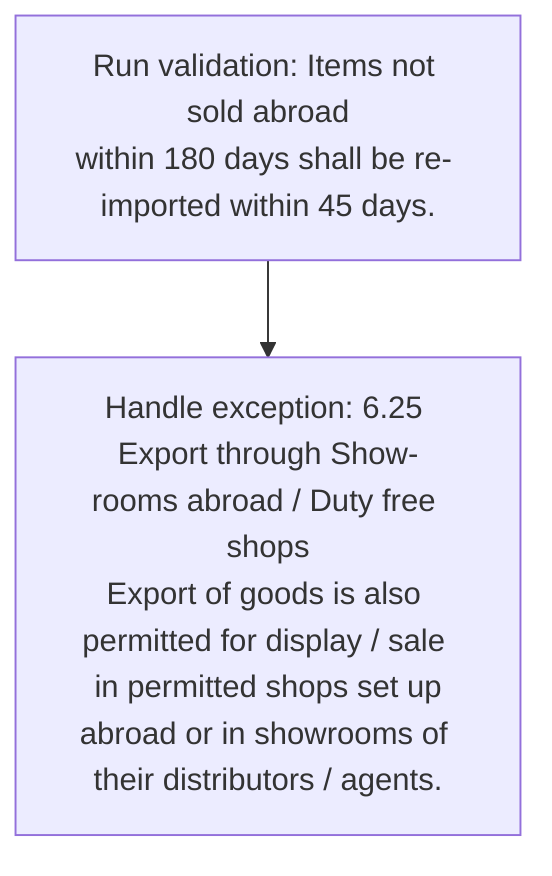
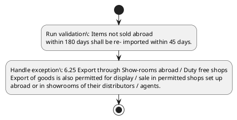

# Chapter 6 / Section 6.25: Export through Show-rooms abroad / Duty free shops

**Chapter Title:** Export Oriented Units (EOUs), Electronics Hardware Technology Parks (EHTPs), Software Technology Parks (STPs) and Bio-Technology

**Pages:** 15

**Purpose:** 6.25 Export through Show-rooms abroad / Duty free shops
Export of goods is also permitted for display / sale in permitted shops set up
abroad or in showrooms of their distributors / agents.

**Purpose Thanglish:** Indha Export through Show-rooms abroad / Duty free shops section-la, 6.25 export through Show-rooms abroad / Duty free shops
export of goods is also permitted for display / sale in permitted shops set up
abroad or in showrooms of their distributors / agents.

**Summary:** 6.25 Export through Show-rooms abroad / Duty free shops
Export of goods is also permitted for display / sale in permitted shops set up
abroad or in showrooms of their distributors / agents. Items not sold abroad
within 180 days shall be re- imported within 45 days.

**Business Meaning:** Export through Show-rooms abroad / Duty free shops governs how DGFT business controls should be applied, validated, and enforced.

**Business Explanation:** Export through Show-rooms abroad / Duty free shops explains the operating rule set that DEKAI should enforce. Key control points include Items not sold abroad
within 180 days shall be re- imported within 45 days.

**Business Explanation Thanglish:** Indha Export through Show-rooms abroad / Duty free shops section-la, export through Show-rooms abroad / Duty free shops explains the operating rule set that DEKAI should enforce. Key control points include Items not sold abroad
within 180 days kandippa be re- imported within 45 days.

## Business Logic
- Items not sold abroad
within 180 days shall be re- imported within 45 days.

## Business Rules
- rule_id=CH6-SEC6_25-R001, rule_description=Items not sold abroad
within 180 days shall be re- imported within 45 days., trigger=Export through Show-rooms abroad / Duty free shops, condition=Not explicitly covered in uploaded documents., validation=Items not sold abroad
within 180 days shall be re- imported within 45 days., action=Manual review required., exception=6.25 Export through Show-rooms abroad / Duty free shops
Export of goods is also permitted for display / sale in permitted shops set up
abroad or in showrooms of their distributors / agents., output=DEKAI should produce a compliance decision for 6.25 - Export through Show-rooms abroad / Duty free shops.

## Conditions
- None identified

## Condition Logic
- None identified

## Validations
- Items not sold abroad
within 180 days shall be re- imported within 45 days.

## Exceptions
- 6.25 Export through Show-rooms abroad / Duty free shops
Export of goods is also permitted for display / sale in permitted shops set up
abroad or in showrooms of their distributors / agents.

## Dependencies
- None identified

## Authorities
- None identified

## Required Documents
- None identified

## Timelines
- Items not sold abroad
within 180 days shall be re- imported within 45 days.

## Actions
- None identified

## Workflow
- Run validation: Items not sold abroad
within 180 days shall be re- imported within 45 days.
- Handle exception: 6.25 Export through Show-rooms abroad / Duty free shops
Export of goods is also permitted for display / sale in permitted shops set up
abroad or in showrooms of their distributors / agents.

## Workflow ASCII
```text
Export through Show-rooms abroad / Duty free shops
Run validation: Items not sold abroad
within 180 days shall be re- imported within 45 days.
   |
   v
Handle exception: 6.25 Export through Show-rooms abroad / Duty free shops
Export of goods is also permitted for display / sale in permitted shops set up
abroad or in showrooms of their distributors / agents.
```

## Decision Tree
- IF exception applies (6.25 Export through Show-rooms abroad / Duty free shops
Export of goods is also permitted for display / sale in permitted shops set up
abroad or in showrooms of their distributors / agents.) THEN route to manual review

## Decision Tree ASCII
```text
Export through Show-rooms abroad / Duty free shops Decision
IF exception applies (6.25 Export through Show-rooms abroad / Duty free shops
Export of goods is also permitted for display / sale in permitted shops set up
abroad or in showrooms of their distributors / agents.) THEN route to manual review
```

## Examples
- User asks to process Export through Show-rooms abroad / Duty free shops; the platform checks conditions, validations, and documents before action.

**Real-world Example:** Example: an importer or exporter invokes Export through Show-rooms abroad / Duty free shops, submits the prescribed DGFT records, and DEKAI uses the extracted rules to follow the export through show-rooms abroad / duty free shops process.

**Real-world Example Thanglish:** Indha Export through Show-rooms abroad / Duty free shops section-la, Example: an importer or exporter invokes export through Show-rooms abroad / Duty free shops, submits the prescribed DGFT records, and DEKAI uses the extracted rules to follow the export through show-rooms abroad / duty free shops process.

## AI Rules
- IF detected context matches section rule THEN enforce: Items not sold abroad
within 180 days shall be re- imported within 45 days.

## Database Fields
- name=section_code, type=string, required=True, source=parsed_section_heading
- name=section_title, type=string, required=True, source=parsed_section_heading
- name=for_flag, type=boolean, required=False, source=keyword:for
- name=set_flag, type=boolean, required=False, source=keyword:set
- name=not_flag, type=boolean, required=False, source=keyword:not
- name=duty_flag, type=boolean, required=False, source=keyword:Duty
- name=free_flag, type=boolean, required=False, source=keyword:free
- name=also_flag, type=boolean, required=False, source=keyword:also
- name=sale_flag, type=boolean, required=False, source=keyword:sale
- name=sold_flag, type=boolean, required=False, source=keyword:sold

## API Requirements
- method=GET, path=/api/dgft/sections/6.25, purpose=Retrieve knowledge payload for section 6.25, query_params=['include=workflow,decision_tree,validations'], response_fields=['section', 'title', 'summary', 'conditions', 'validations', 'exceptions', 'workflow', 'decision_tree']
- method=POST, path=/api/dgft/Export-through-Show-rooms-abroad-Duty-free-shops/validate, purpose=Validate inputs and documents for Export through Show-rooms abroad / Duty free shops, request_fields=['section_code', 'section_title'], response_fields=['status', 'errors', 'warnings', 'next_actions']

## UI Screens
- screen_id=Export_through_Show_rooms_abroad_Duty_free_shops_overview, name=Export through Show-rooms abroad / Duty free shops Overview, purpose=Show section summary, authority, timeline, and eligibility cues., widgets=['summary_card', 'conditions_table', 'authority_badges', 'timeline_panel']
- screen_id=Export_through_Show_rooms_abroad_Duty_free_shops_submission, name=Export through Show-rooms abroad / Duty free shops Submission, purpose=Capture applicant data and supporting documents., widgets=['dynamic_form', 'document_uploader', 'validation_panel', 'next_action_footer'], fields=['section_code', 'section_title', 'for_flag', 'set_flag', 'not_flag', 'duty_flag', 'free_flag', 'also_flag']
- screen_id=Export_through_Show_rooms_abroad_Duty_free_shops_exceptions, name=Export through Show-rooms abroad / Duty free shops Exception Review, purpose=Explain exception handling and manual review triggers., widgets=['exception_banner', 'decision_tree', 'case_notes']

## Error Messages
- Validation failed because the section requirements were not fully met.

## FAQ
- question_en=What is the purpose of section 6.25?, answer_en=Export through Show-rooms abroad / Duty free shops explains the operating rule set that DEKAI should enforce. Key control points include Items not sold abroad
within 180 days shall be re- imported within 45 days., question_thanglish=Indha Export through Show-rooms abroad / Duty free shops section-la, What is the purpose of section 6.25?, answer_thanglish=Indha Export through Show-rooms abroad / Duty free shops section-la, export through Show-rooms abroad / Duty free shops explains the operating rule set that DEKAI should enforce. Key control points include Items not sold abroad
within 180 days kandippa be re- imported within 45 days.
- question_en=What documents are required under Export through Show-rooms abroad / Duty free shops?, answer_en=Not explicitly covered in uploaded documents., question_thanglish=Indha Export through Show-rooms abroad / Duty free shops section-la, What documents are required under export through Show-rooms abroad / Duty free shops?, answer_thanglish=Indha Export through Show-rooms abroad / Duty free shops section-la, Not explicitly covered in uploaded documents.
- question_en=Which authority handles Export through Show-rooms abroad / Duty free shops?, answer_en=Not explicitly covered in uploaded documents., question_thanglish=Indha Export through Show-rooms abroad / Duty free shops section-la, Which authority handles export through Show-rooms abroad / Duty free shops?, answer_thanglish=Indha Export through Show-rooms abroad / Duty free shops section-la, Not explicitly covered in uploaded documents.

## Questions Users May Ask
- What does Export through Show-rooms abroad / Duty free shops require?
- Which documents are needed for Export through Show-rooms abroad / Duty free shops?
- How does DEKAI validate Export through Show-rooms abroad / Duty free shops requests?

## Expected AI Answers
- Export through Show-rooms abroad / Duty free shops requires the platform to interpret the section text, apply the extracted business rules, and present the correct next action.
- Required documents are inferred from the section text: no explicit documents were detected.
- DEKAI validates Export through Show-rooms abroad / Duty free shops by checking conditions, required documents, authority references, and exception clauses before recommending an outcome.

## AI Q&A Examples
- question_en=User asks: How do I comply with Export through Show-rooms abroad / Duty free shops?, answer_en=AI answers: DEKAI should evaluate section 6.25, apply the extracted rules, and guide the user through Run validation: Items not sold abroad
within 180 days shall be re- imported within 45 days.., question_thanglish=Indha Export through Show-rooms abroad / Duty free shops section-la, User asks: How do I comply with export through Show-rooms abroad / Duty free shops?, answer_thanglish=Indha Export through Show-rooms abroad / Duty free shops section-la, AI answers: DEKAI should evaluate section 6.25, apply the extracted rules, and guide the user through Run validation: Items not sold abroad
within 180 days kandippa be re- imported within 45 days..
- question_en=User asks: Which validations apply to Export through Show-rooms abroad / Duty free shops?, answer_en=AI answers: Applicable validations are Items not sold abroad
within 180 days shall be re- imported within 45 days., question_thanglish=Indha Export through Show-rooms abroad / Duty free shops section-la, User asks: Which validations apply to export through Show-rooms abroad / Duty free shops?, answer_thanglish=Indha Export through Show-rooms abroad / Duty free shops section-la, AI answers: Applicable validations are Items not sold abroad
within 180 days kandippa be re- imported within 45 days.

## DEKAI AI Implementation Notes
- Capture chapter 6, section 6.25, title, and page references as immutable knowledge metadata.
- Bind validations for Export through Show-rooms abroad / Duty free shops into a rule engine keyed by the rule IDs extracted for this section.
- Trigger manual review when exception clauses are detected.

## DEKAI AI Implementation Notes Thanglish
- Indha Export through Show-rooms abroad / Duty free shops section-la, Capture chapter 6, section 6.25, title, and page references as immutable knowledge metadata.
- Indha Export through Show-rooms abroad / Duty free shops section-la, Bind validations for export through Show-rooms abroad / Duty free shops into a rule engine keyed by the rule IDs extracted for this section.
- Indha Export through Show-rooms abroad / Duty free shops section-la, Trigger manual review when exception clauses are detected.

## AI Metadata
- Keywords: for, set, not, Duty, free, also, sale, sold, days, shops, goods, their, Items, shall, Export, abroad, agents, within, through, display
- Search Keywords: for, set, not, Duty, free, also, sale, sold, days, shops, goods, their, Items, shall, Export, abroad, agents, within, through, display
- Intent: Provide knowledge guidance for Export through Show-rooms abroad / Duty free shops.
- Tags: 6.25, Export through Show-rooms abroad / Duty free shops, business-rule, dgft
- Related Sections: 
- Related Chapters: 
- Related Rules: Items not sold abroad
within 180 days shall be re- imported within 45 days.

## Mermaid


## PlantUML

