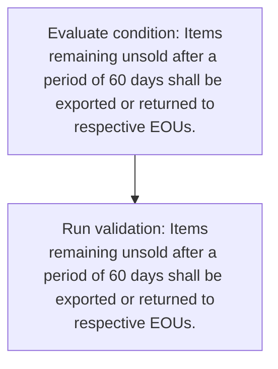
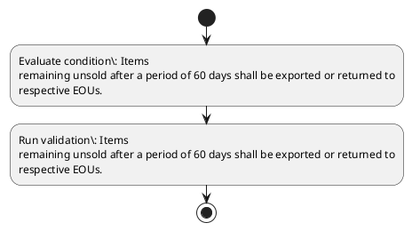

# Chapter 6 / Section 6.26: Sale through Showrooms / Retail outlets at International

**Chapter Title:** Export Oriented Units (EOUs), Electronics Hardware Technology Parks (EHTPs), Software Technology Parks (STPs) and Bio-Technology

**Pages:** 15

**Purpose:** 6.26 Sale through Showrooms / Retail outlets at International
Airports
EOUs may set up showrooms / retail outlets at International Airports for sale of
goods in accordance with procedure laid down by Customs authorities.

**Purpose Thanglish:** Indha Sale through Showrooms / Retail outlets at International section-la, 6.26 Sale through Showrooms / Retail outlets at International
Airports
EOUs may set up showrooms / retail outlets at International Airports for sale of
goods in accordance with procedure laid down by Customs authorities.

**Summary:** 6.26 Sale through Showrooms / Retail outlets at International
Airports
EOUs may set up showrooms / retail outlets at International Airports for sale of
goods in accordance with procedure laid down by Customs authorities. Items
remaining unsold after a period of 60 days shall be exported or returned to
respective EOUs.

**Business Meaning:** Sale through Showrooms / Retail outlets at International governs how DGFT business controls should be applied, validated, and enforced.

**Business Explanation:** Sale through Showrooms / Retail outlets at International explains the operating rule set that DEKAI should enforce. Key control points include Items
remaining unsold after a period of 60 days shall be exported or returned to
respective EOUs.

**Business Explanation Thanglish:** Indha Sale through Showrooms / Retail outlets at International section-la, Sale through Showrooms / Retail outlets at International explains the operating rule set that DEKAI should enforce. Key control points include Items
remaining unsold after a period of 60 days kandippa be exported or returned to
respective EOUs.

## Business Logic
- Items
remaining unsold after a period of 60 days shall be exported or returned to
respective EOUs.

## Business Rules
- rule_id=CH6-SEC6_26-R001, rule_description=Items
remaining unsold after a period of 60 days shall be exported or returned to
respective EOUs., trigger=Sale through Showrooms / Retail outlets at International, condition=Items
remaining unsold after a period of 60 days shall be exported or returned to
respective EOUs., validation=Items
remaining unsold after a period of 60 days shall be exported or returned to
respective EOUs., action=Manual review required., exception=No explicit exception found in uploaded documents., output=DEKAI should produce a compliance decision for 6.26 - Sale through Showrooms / Retail outlets at International.

## Conditions
- Items
remaining unsold after a period of 60 days shall be exported or returned to
respective EOUs.

## Condition Logic
- id=6.6.26.1, if=Items
remaining unsold after a period of 60 days shall be exported or returned to
respective EOUs., then=Route for review, source=Items
remaining unsold after a period of 60 days shall be exported or returned to
respective EOUs.

## Validations
- Items
remaining unsold after a period of 60 days shall be exported or returned to
respective EOUs.

## Exceptions
- None identified

## Dependencies
- None identified

## Authorities
- Customs

## Required Documents
- None identified

## Timelines
- Items
remaining unsold after a period of 60 days shall be exported or returned to
respective EOUs.

## Actions
- None identified

## Workflow
- Evaluate condition: Items
remaining unsold after a period of 60 days shall be exported or returned to
respective EOUs.
- Run validation: Items
remaining unsold after a period of 60 days shall be exported or returned to
respective EOUs.

## Workflow ASCII
```text
Sale through Showrooms / Retail outlets at International
Evaluate condition: Items
remaining unsold after a period of 60 days shall be exported or returned to
respective EOUs.
   |
   v
Run validation: Items
remaining unsold after a period of 60 days shall be exported or returned to
respective EOUs.
```

## Decision Tree
- IF section 6.26 applies THEN proceed with standard DGFT workflow

## Decision Tree ASCII
```text
Sale through Showrooms / Retail outlets at International Decision
IF section 6.26 applies THEN proceed with standard DGFT workflow
```

## Examples
- User asks to process Sale through Showrooms / Retail outlets at International; the platform checks conditions, validations, and documents before action.

**Real-world Example:** Example: an importer or exporter invokes Sale through Showrooms / Retail outlets at International, submits the prescribed DGFT records, and DEKAI uses the extracted rules to follow the sale through showrooms / retail outlets at international process.

**Real-world Example Thanglish:** Indha Sale through Showrooms / Retail outlets at International section-la, Example: an importer or exporter invokes Sale through Showrooms / Retail outlets at International, submits the prescribed DGFT records, and DEKAI uses the extracted rules to follow the sale through showrooms / retail outlets at international process.

## AI Rules
- IF detected context matches section rule THEN enforce: Items
remaining unsold after a period of 60 days shall be exported or returned to
respective EOUs.

## Database Fields
- name=section_code, type=string, required=True, source=parsed_section_heading
- name=section_title, type=string, required=True, source=parsed_section_heading
- name=may_flag, type=boolean, required=False, source=keyword:may
- name=set_flag, type=boolean, required=False, source=keyword:set
- name=for_flag, type=boolean, required=False, source=keyword:for
- name=sale_flag, type=boolean, required=False, source=keyword:Sale
- name=eous_flag, type=boolean, required=False, source=keyword:EOUs
- name=with_flag, type=boolean, required=False, source=keyword:with
- name=laid_flag, type=boolean, required=False, source=keyword:laid
- name=down_flag, type=boolean, required=False, source=keyword:down

## API Requirements
- method=GET, path=/api/dgft/sections/6.26, purpose=Retrieve knowledge payload for section 6.26, query_params=['include=workflow,decision_tree,validations'], response_fields=['section', 'title', 'summary', 'conditions', 'validations', 'exceptions', 'workflow', 'decision_tree']
- method=POST, path=/api/dgft/Sale-through-Showrooms-Retail-outlets-at-International/validate, purpose=Validate inputs and documents for Sale through Showrooms / Retail outlets at International, request_fields=['section_code', 'section_title'], response_fields=['status', 'errors', 'warnings', 'next_actions']

## UI Screens
- screen_id=Sale_through_Showrooms_Retail_outlets_at_International_overview, name=Sale through Showrooms / Retail outlets at International Overview, purpose=Show section summary, authority, timeline, and eligibility cues., widgets=['summary_card', 'conditions_table', 'authority_badges', 'timeline_panel']
- screen_id=Sale_through_Showrooms_Retail_outlets_at_International_submission, name=Sale through Showrooms / Retail outlets at International Submission, purpose=Capture applicant data and supporting documents., widgets=['dynamic_form', 'document_uploader', 'validation_panel', 'next_action_footer'], fields=['section_code', 'section_title', 'may_flag', 'set_flag', 'for_flag', 'sale_flag', 'eous_flag', 'with_flag']

## Error Messages
- Validation failed because the section requirements were not fully met.

## FAQ
- question_en=What is the purpose of section 6.26?, answer_en=Sale through Showrooms / Retail outlets at International explains the operating rule set that DEKAI should enforce. Key control points include Items
remaining unsold after a period of 60 days shall be exported or returned to
respective EOUs., question_thanglish=Indha Sale through Showrooms / Retail outlets at International section-la, What is the purpose of section 6.26?, answer_thanglish=Indha Sale through Showrooms / Retail outlets at International section-la, Sale through Showrooms / Retail outlets at International explains the operating rule set that DEKAI should enforce. Key control points include Items
remaining unsold after a period of 60 days kandippa be exported or returned to
respective EOUs.
- question_en=What documents are required under Sale through Showrooms / Retail outlets at International?, answer_en=Not explicitly covered in uploaded documents., question_thanglish=Indha Sale through Showrooms / Retail outlets at International section-la, What documents are required under Sale through Showrooms / Retail outlets at International?, answer_thanglish=Indha Sale through Showrooms / Retail outlets at International section-la, Not explicitly covered in uploaded documents.
- question_en=Which authority handles Sale through Showrooms / Retail outlets at International?, answer_en=Customs, question_thanglish=Indha Sale through Showrooms / Retail outlets at International section-la, Which authority handles Sale through Showrooms / Retail outlets at International?, answer_thanglish=Indha Sale through Showrooms / Retail outlets at International section-la, Customs

## Questions Users May Ask
- What does Sale through Showrooms / Retail outlets at International require?
- Which documents are needed for Sale through Showrooms / Retail outlets at International?
- How does DEKAI validate Sale through Showrooms / Retail outlets at International requests?

## Expected AI Answers
- Sale through Showrooms / Retail outlets at International requires the platform to interpret the section text, apply the extracted business rules, and present the correct next action.
- Required documents are inferred from the section text: no explicit documents were detected.
- DEKAI validates Sale through Showrooms / Retail outlets at International by checking conditions, required documents, authority references, and exception clauses before recommending an outcome.

## AI Q&A Examples
- question_en=User asks: How do I comply with Sale through Showrooms / Retail outlets at International?, answer_en=AI answers: DEKAI should evaluate section 6.26, apply the extracted rules, and guide the user through Evaluate condition: Items
remaining unsold after a period of 60 days shall be exported or returned to
respective EOUs.., question_thanglish=Indha Sale through Showrooms / Retail outlets at International section-la, User asks: How do I comply with Sale through Showrooms / Retail outlets at International?, answer_thanglish=Indha Sale through Showrooms / Retail outlets at International section-la, AI answers: DEKAI should evaluate section 6.26, apply the extracted rules, and guide the user through Evaluate condition: Items
remaining unsold after a period of 60 days kandippa be exported or returned to
respective EOUs..
- question_en=User asks: Which validations apply to Sale through Showrooms / Retail outlets at International?, answer_en=AI answers: Applicable validations are Items
remaining unsold after a period of 60 days shall be exported or returned to
respective EOUs., question_thanglish=Indha Sale through Showrooms / Retail outlets at International section-la, User asks: Which validations apply to Sale through Showrooms / Retail outlets at International?, answer_thanglish=Indha Sale through Showrooms / Retail outlets at International section-la, AI answers: Applicable validations are Items
remaining unsold after a period of 60 days kandippa be exported or returned to
respective EOUs.

## DEKAI AI Implementation Notes
- Capture chapter 6, section 6.26, title, and page references as immutable knowledge metadata.
- Bind validations for Sale through Showrooms / Retail outlets at International into a rule engine keyed by the rule IDs extracted for this section.
- Route escalations or approvals to: Customs.

## DEKAI AI Implementation Notes Thanglish
- Indha Sale through Showrooms / Retail outlets at International section-la, Capture chapter 6, section 6.26, title, and page references as immutable knowledge metadata.
- Indha Sale through Showrooms / Retail outlets at International section-la, Bind validations for Sale through Showrooms / Retail outlets at International into a rule engine keyed by the rule IDs extracted for this section.
- Indha Sale through Showrooms / Retail outlets at International section-la, Route escalations or approvals to: Customs.

## AI Metadata
- Keywords: may, set, for, Sale, EOUs, with, laid, down, days, goods, Items, after, shall, Retail, unsold, period, through, outlets, Customs, Airports
- Search Keywords: may, set, for, Sale, EOUs, with, laid, down, days, goods, Items, after, shall, Retail, unsold, period, through, outlets, Customs, Airports
- Intent: Provide knowledge guidance for Sale through Showrooms / Retail outlets at International.
- Tags: 6.26, Sale through Showrooms / Retail outlets at International, business-rule, dgft
- Related Sections: 
- Related Chapters: 
- Related Rules: Items
remaining unsold after a period of 60 days shall be exported or returned to
respective EOUs.

## Mermaid


## PlantUML

