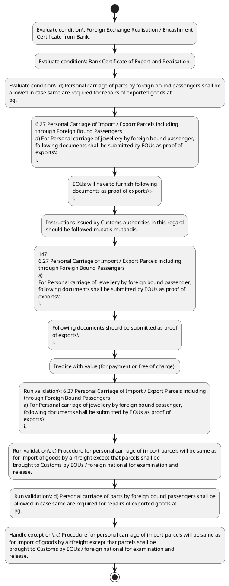

# Chapter 6 / Section 6.27: Personal Carriage of Import / Export Parcels including

**Chapter Title:** Export Oriented Units (EOUs), Electronics Hardware Technology Parks (EHTPs), Software Technology Parks (STPs) and Bio-Technology

**Pages:** 15, 16

**Purpose:** 6.27 Personal Carriage of Import / Export Parcels including
through Foreign Bound Passengers
a) For Personal carriage of jewellery by foreign bound passenger,
following documents shall be submitted by EOUs as proof of
exports:
i.

**Purpose Thanglish:** Indha Personal Carriage of Import / Export Parcels including section-la, 6.27 Personal Carriage of import / export Parcels including
through Foreign Bound Passengers
a) For Personal carriage of jewellery by foreign bound passenger,
following documents kandippa be submitted by EOUs as proof of
exports:
i.

**Summary:** 6.27 Personal Carriage of Import / Export Parcels including
through Foreign Bound Passengers
a) For Personal carriage of jewellery by foreign bound passenger,
following documents shall be submitted by EOUs as proof of
exports:
i. Copy of shipping bill filed by EOUs;
ii. A copy of Currency Declaration Form filed by Foreign
buyer with Customs at time of his arrival; and
iii.

**Business Meaning:** Personal Carriage of Import / Export Parcels including governs how DGFT business controls should be applied, validated, and enforced.

**Business Explanation:** Personal Carriage of Import / Export Parcels including explains the operating rule set that DEKAI should enforce. Key control points include 6.27 Personal Carriage of Import / Export Parcels including
through Foreign Bound Passengers
a) For Personal carriage of jewellery by foreign bound passenger,
following documents shall be submitted by EOUs as proof of
exports:
i. The section also drives actions such as 6.27 Personal Carriage of Import / Export Parcels including
through Foreign Bound Passengers
a) For Personal carriage of jewellery by foreign bound passenger,
following documents shall be submitted by EOUs as proof of
exports:
i..

**Business Explanation Thanglish:** Indha Personal Carriage of Import / Export Parcels including section-la, Personal Carriage of import / export Parcels including explains the operating rule set that DEKAI should enforce. Key control points include 6.27 Personal Carriage of import / export Parcels including
through Foreign Bound Passengers
a) For Personal carriage of jewellery by foreign bound passenger,
following documents kandippa be submitted by EOUs as proof of
exports:
i. The section also drives actions such as 6.27 Personal Carriage of import / export Parcels including
through Foreign Bound Passengers
a) For Personal carriage of jewellery by foreign bound passenger,
following documents kandippa be submitted by EOUs as proof of
exports:
i..

## Business Logic
- 6.27 Personal Carriage of Import / Export Parcels including
through Foreign Bound Passengers
a) For Personal carriage of jewellery by foreign bound passenger,
following documents shall be submitted by EOUs as proof of
exports:
i.
- c) Procedure for personal carriage of import parcels will be same as
for import of goods by airfreight except that parcels shall be
brought to Customs by EOUs / foreign national for examination and
release.
- Instructions issued by Customs authorities in this regard
should be followed mutatis mutandis.
- d) Personal carriage of parts by foreign bound passengers shall be
allowed in case same are required for repairs of exported goods at
pg.
- 147
6.27 Personal Carriage of Import / Export Parcels including
through Foreign Bound Passengers
a)
For Personal carriage of jewellery by foreign bound passenger,
following documents shall be submitted by EOUs as proof of
exports:
i.
- c)
Procedure for personal carriage of import parcels will be same as
for import of goods by airfreight except that parcels shall be
brought to Customs by EOUs / foreign national for examination and
release.
- d)
Personal carriage of parts by foreign bound passengers shall be
allowed in case same are required for repairs of exported goods at
customer site.
- Following documents should be submitted as proof
of exports:
i.

## Business Rules
- rule_id=CH6-SEC6_27-R001, rule_description=6.27 Personal Carriage of Import / Export Parcels including
through Foreign Bound Passengers
a) For Personal carriage of jewellery by foreign bound passenger,
following documents shall be submitted by EOUs as proof of
exports:
i., trigger=Personal Carriage of Import / Export Parcels including, condition=Foreign Exchange Realisation / Encashment
Certificate from Bank., validation=6.27 Personal Carriage of Import / Export Parcels including
through Foreign Bound Passengers
a) For Personal carriage of jewellery by foreign bound passenger,
following documents shall be submitted by EOUs as proof of
exports:
i., action=6.27 Personal Carriage of Import / Export Parcels including
through Foreign Bound Passengers
a) For Personal carriage of jewellery by foreign bound passenger,
following documents shall be submitted by EOUs as proof of
exports:
i., exception=c) Procedure for personal carriage of import parcels will be same as
for import of goods by airfreight except that parcels shall be
brought to Customs by EOUs / foreign national for examination and
release., output=DEKAI should produce a compliance decision for 6.27 - Personal Carriage of Import / Export Parcels including.
- rule_id=CH6-SEC6_27-R002, rule_description=c) Procedure for personal carriage of import parcels will be same as
for import of goods by airfreight except that parcels shall be
brought to Customs by EOUs / foreign national for examination and
release., trigger=Personal Carriage of Import / Export Parcels including, condition=Bank Certificate of Export and Realisation., validation=c) Procedure for personal carriage of import parcels will be same as
for import of goods by airfreight except that parcels shall be
brought to Customs by EOUs / foreign national for examination and
release., action=EOUs will have to furnish following
documents as proof of exports:-
i., exception=c)
Procedure for personal carriage of import parcels will be same as
for import of goods by airfreight except that parcels shall be
brought to Customs by EOUs / foreign national for examination and
release., output=DEKAI should produce a compliance decision for 6.27 - Personal Carriage of Import / Export Parcels including.
- rule_id=CH6-SEC6_27-R003, rule_description=Instructions issued by Customs authorities in this regard
should be followed mutatis mutandis., trigger=Personal Carriage of Import / Export Parcels including, condition=d) Personal carriage of parts by foreign bound passengers shall be
allowed in case same are required for repairs of exported goods at
pg., validation=d) Personal carriage of parts by foreign bound passengers shall be
allowed in case same are required for repairs of exported goods at
pg., action=Instructions issued by Customs authorities in this regard
should be followed mutatis mutandis., exception=c)
Procedure for personal carriage of import parcels will be same as
for import of goods by airfreight except that parcels shall be
brought to Customs by EOUs / foreign national for examination and
release., output=DEKAI should produce a compliance decision for 6.27 - Personal Carriage of Import / Export Parcels including.
- rule_id=CH6-SEC6_27-R004, rule_description=d) Personal carriage of parts by foreign bound passengers shall be
allowed in case same are required for repairs of exported goods at
pg., trigger=Personal Carriage of Import / Export Parcels including, condition=d)
Personal carriage of parts by foreign bound passengers shall be
allowed in case same are required for repairs of exported goods at
customer site., validation=147
6.27 Personal Carriage of Import / Export Parcels including
through Foreign Bound Passengers
a)
For Personal carriage of jewellery by foreign bound passenger,
following documents shall be submitted by EOUs as proof of
exports:
i., action=147
6.27 Personal Carriage of Import / Export Parcels including
through Foreign Bound Passengers
a)
For Personal carriage of jewellery by foreign bound passenger,
following documents shall be submitted by EOUs as proof of
exports:
i., exception=c)
Procedure for personal carriage of import parcels will be same as
for import of goods by airfreight except that parcels shall be
brought to Customs by EOUs / foreign national for examination and
release., output=DEKAI should produce a compliance decision for 6.27 - Personal Carriage of Import / Export Parcels including.
- rule_id=CH6-SEC6_27-R005, rule_description=147
6.27 Personal Carriage of Import / Export Parcels including
through Foreign Bound Passengers
a)
For Personal carriage of jewellery by foreign bound passenger,
following documents shall be submitted by EOUs as proof of
exports:
i., trigger=Personal Carriage of Import / Export Parcels including, condition=d)
Personal carriage of parts by foreign bound passengers shall be
allowed in case same are required for repairs of exported goods at
customer site., validation=c)
Procedure for personal carriage of import parcels will be same as
for import of goods by airfreight except that parcels shall be
brought to Customs by EOUs / foreign national for examination and
release., action=Following documents should be submitted as proof
of exports:
i., exception=c)
Procedure for personal carriage of import parcels will be same as
for import of goods by airfreight except that parcels shall be
brought to Customs by EOUs / foreign national for examination and
release., output=DEKAI should produce a compliance decision for 6.27 - Personal Carriage of Import / Export Parcels including.
- rule_id=CH6-SEC6_27-R006, rule_description=c)
Procedure for personal carriage of import parcels will be same as
for import of goods by airfreight except that parcels shall be
brought to Customs by EOUs / foreign national for examination and
release., trigger=Personal Carriage of Import / Export Parcels including, condition=d)
Personal carriage of parts by foreign bound passengers shall be
allowed in case same are required for repairs of exported goods at
customer site., validation=d)
Personal carriage of parts by foreign bound passengers shall be
allowed in case same are required for repairs of exported goods at
customer site., action=Invoice with value (for payment or free of charge)., exception=c)
Procedure for personal carriage of import parcels will be same as
for import of goods by airfreight except that parcels shall be
brought to Customs by EOUs / foreign national for examination and
release., output=DEKAI should produce a compliance decision for 6.27 - Personal Carriage of Import / Export Parcels including.
- rule_id=CH6-SEC6_27-R007, rule_description=d)
Personal carriage of parts by foreign bound passengers shall be
allowed in case same are required for repairs of exported goods at
customer site., trigger=Personal Carriage of Import / Export Parcels including, condition=d)
Personal carriage of parts by foreign bound passengers shall be
allowed in case same are required for repairs of exported goods at
customer site., validation=d)
Personal carriage of parts by foreign bound passengers shall be
allowed in case same are required for repairs of exported goods at
customer site., action=Invoice with value (for payment or free of charge)., exception=c)
Procedure for personal carriage of import parcels will be same as
for import of goods by airfreight except that parcels shall be
brought to Customs by EOUs / foreign national for examination and
release., output=DEKAI should produce a compliance decision for 6.27 - Personal Carriage of Import / Export Parcels including.
- rule_id=CH6-SEC6_27-R008, rule_description=Following documents should be submitted as proof
of exports:
i., trigger=Personal Carriage of Import / Export Parcels including, condition=d)
Personal carriage of parts by foreign bound passengers shall be
allowed in case same are required for repairs of exported goods at
customer site., validation=d)
Personal carriage of parts by foreign bound passengers shall be
allowed in case same are required for repairs of exported goods at
customer site., action=Invoice with value (for payment or free of charge)., exception=c)
Procedure for personal carriage of import parcels will be same as
for import of goods by airfreight except that parcels shall be
brought to Customs by EOUs / foreign national for examination and
release., output=DEKAI should produce a compliance decision for 6.27 - Personal Carriage of Import / Export Parcels including.

## Conditions
- Foreign Exchange Realisation / Encashment
Certificate from Bank.
- Bank Certificate of Export and Realisation.
- d) Personal carriage of parts by foreign bound passengers shall be
allowed in case same are required for repairs of exported goods at
pg.
- d)
Personal carriage of parts by foreign bound passengers shall be
allowed in case same are required for repairs of exported goods at
customer site.

## Condition Logic
- id=6.6.27.1, if=Foreign Exchange Realisation / Encashment
Certificate from Bank., then=6.27 Personal Carriage of Import / Export Parcels including
through Foreign Bound Passengers
a) For Personal carriage of jewellery by foreign bound passenger,
following documents shall be submitted by EOUs as proof of
exports:
i., source=Foreign Exchange Realisation / Encashment
Certificate from Bank.
- id=6.6.27.2, if=Bank Certificate of Export and Realisation., then=6.27 Personal Carriage of Import / Export Parcels including
through Foreign Bound Passengers
a) For Personal carriage of jewellery by foreign bound passenger,
following documents shall be submitted by EOUs as proof of
exports:
i., source=Bank Certificate of Export and Realisation.
- id=6.6.27.3, if=d) Personal carriage of parts by foreign bound passengers shall be
allowed in case same are required for repairs of exported goods at
pg., then=6.27 Personal Carriage of Import / Export Parcels including
through Foreign Bound Passengers
a) For Personal carriage of jewellery by foreign bound passenger,
following documents shall be submitted by EOUs as proof of
exports:
i., source=d) Personal carriage of parts by foreign bound passengers shall be
allowed in case same are required for repairs of exported goods at
pg.
- id=6.6.27.4, if=d)
Personal carriage of parts by foreign bound passengers shall be
allowed in case same are required for repairs of exported goods at
customer site., then=6.27 Personal Carriage of Import / Export Parcels including
through Foreign Bound Passengers
a) For Personal carriage of jewellery by foreign bound passenger,
following documents shall be submitted by EOUs as proof of
exports:
i., source=d)
Personal carriage of parts by foreign bound passengers shall be
allowed in case same are required for repairs of exported goods at
customer site.

## Validations
- 6.27 Personal Carriage of Import / Export Parcels including
through Foreign Bound Passengers
a) For Personal carriage of jewellery by foreign bound passenger,
following documents shall be submitted by EOUs as proof of
exports:
i.
- c) Procedure for personal carriage of import parcels will be same as
for import of goods by airfreight except that parcels shall be
brought to Customs by EOUs / foreign national for examination and
release.
- d) Personal carriage of parts by foreign bound passengers shall be
allowed in case same are required for repairs of exported goods at
pg.
- 147
6.27 Personal Carriage of Import / Export Parcels including
through Foreign Bound Passengers
a)
For Personal carriage of jewellery by foreign bound passenger,
following documents shall be submitted by EOUs as proof of
exports:
i.
- c)
Procedure for personal carriage of import parcels will be same as
for import of goods by airfreight except that parcels shall be
brought to Customs by EOUs / foreign national for examination and
release.
- d)
Personal carriage of parts by foreign bound passengers shall be
allowed in case same are required for repairs of exported goods at
customer site.

## Exceptions
- c) Procedure for personal carriage of import parcels will be same as
for import of goods by airfreight except that parcels shall be
brought to Customs by EOUs / foreign national for examination and
release.
- c)
Procedure for personal carriage of import parcels will be same as
for import of goods by airfreight except that parcels shall be
brought to Customs by EOUs / foreign national for examination and
release.

## Dependencies
- None identified

## Authorities
- Customs
- Instructions issued by Customs
- Permission letter from Customs

## Required Documents
- 6.27 Personal Carriage of Import / Export Parcels including
through Foreign Bound Passengers
a) For Personal carriage of jewellery by foreign bound passenger,
following documents shall be submitted by EOUs as proof of
exports:
i.
- Copy of shipping bill filed by EOUs;
ii.
- A copy of Currency Declaration
- Foreign Exchange Realisation / Encashment
Certificate from Bank.
- b) In addition to this, Personal Carriage by foreign bound passenger
on Document Against Acceptance (DA) / Cash On Delivery (COD)
basis is also allowed.
- EOUs will have to furnish following
documents as proof of exports:-
i.
- Copy of Shipping Bill
- Bank Certificate
- 147
6.27 Personal Carriage of Import / Export Parcels including
through Foreign Bound Passengers
a)
For Personal carriage of jewellery by foreign bound passenger,
following documents shall be submitted by EOUs as proof of
exports:
i.
- b)
In addition to this, Personal Carriage by foreign bound passenger
on Document Against Acceptance (DA) / Cash On Delivery (COD)
basis is also allowed.
- Following documents should be submitted as proof
of exports:
i.
- Invoice with value (for payment or free of charge).

## Timelines
- None identified

## Actions
- 6.27 Personal Carriage of Import / Export Parcels including
through Foreign Bound Passengers
a) For Personal carriage of jewellery by foreign bound passenger,
following documents shall be submitted by EOUs as proof of
exports:
i.
- EOUs will have to furnish following
documents as proof of exports:-
i.
- Instructions issued by Customs authorities in this regard
should be followed mutatis mutandis.
- 147
6.27 Personal Carriage of Import / Export Parcels including
through Foreign Bound Passengers
a)
For Personal carriage of jewellery by foreign bound passenger,
following documents shall be submitted by EOUs as proof of
exports:
i.
- Following documents should be submitted as proof
of exports:
i.
- Invoice with value (for payment or free of charge).

## Workflow
- Evaluate condition: Foreign Exchange Realisation / Encashment
Certificate from Bank.
- Evaluate condition: Bank Certificate of Export and Realisation.
- Evaluate condition: d) Personal carriage of parts by foreign bound passengers shall be
allowed in case same are required for repairs of exported goods at
pg.
- 6.27 Personal Carriage of Import / Export Parcels including
through Foreign Bound Passengers
a) For Personal carriage of jewellery by foreign bound passenger,
following documents shall be submitted by EOUs as proof of
exports:
i.
- EOUs will have to furnish following
documents as proof of exports:-
i.
- Instructions issued by Customs authorities in this regard
should be followed mutatis mutandis.
- 147
6.27 Personal Carriage of Import / Export Parcels including
through Foreign Bound Passengers
a)
For Personal carriage of jewellery by foreign bound passenger,
following documents shall be submitted by EOUs as proof of
exports:
i.
- Following documents should be submitted as proof
of exports:
i.
- Invoice with value (for payment or free of charge).
- Run validation: 6.27 Personal Carriage of Import / Export Parcels including
through Foreign Bound Passengers
a) For Personal carriage of jewellery by foreign bound passenger,
following documents shall be submitted by EOUs as proof of
exports:
i.
- Run validation: c) Procedure for personal carriage of import parcels will be same as
for import of goods by airfreight except that parcels shall be
brought to Customs by EOUs / foreign national for examination and
release.
- Run validation: d) Personal carriage of parts by foreign bound passengers shall be
allowed in case same are required for repairs of exported goods at
pg.
- Handle exception: c) Procedure for personal carriage of import parcels will be same as
for import of goods by airfreight except that parcels shall be
brought to Customs by EOUs / foreign national for examination and
release.

## Workflow ASCII
```text
Personal Carriage of Import / Export Parcels including
Evaluate condition: Foreign Exchange Realisation / Encashment
Certificate from Bank.
   |
   v
Evaluate condition: Bank Certificate of Export and Realisation.
   |
   v
Evaluate condition: d) Personal carriage of parts by foreign bound passengers shall be
allowed in case same are required for repairs of exported goods at
pg.
   |
   v
6.27 Personal Carriage of Import / Export Parcels including
through Foreign Bound Passengers
a) For Personal carriage of jewellery by foreign bound passenger,
following documents shall be submitted by EOUs as proof of
exports:
i.
   |
   v
EOUs will have to furnish following
documents as proof of exports:-
i.
   |
   v
Instructions issued by Customs authorities in this regard
should be followed mutatis mutandis.
   |
   v
147
6.27 Personal Carriage of Import / Export Parcels including
through Foreign Bound Passengers
a)
For Personal carriage of jewellery by foreign bound passenger,
following documents shall be submitted by EOUs as proof of
exports:
i.
   |
   v
Following documents should be submitted as proof
of exports:
i.
   |
   v
Invoice with value (for payment or free of charge).
   |
   v
Run validation: 6.27 Personal Carriage of Import / Export Parcels including
through Foreign Bound Passengers
a) For Personal carriage of jewellery by foreign bound passenger,
following documents shall be submitted by EOUs as proof of
exports:
i.
   |
   v
Run validation: c) Procedure for personal carriage of import parcels will be same as
for import of goods by airfreight except that parcels shall be
brought to Customs by EOUs / foreign national for examination and
release.
   |
   v
Run validation: d) Personal carriage of parts by foreign bound passengers shall be
allowed in case same are required for repairs of exported goods at
pg.
   |
   v
Handle exception: c) Procedure for personal carriage of import parcels will be same as
for import of goods by airfreight except that parcels shall be
brought to Customs by EOUs / foreign national for examination and
release.
```

## Decision Tree
- IF Foreign Exchange Realisation / Encashment
Certificate from Bank. THEN 6.27 Personal Carriage of Import / Export Parcels including
through Foreign Bound Passengers
a) For Personal carriage of jewellery by foreign bound passenger,
following documents shall be submitted by EOUs as proof of
exports:
i.
- IF Bank Certificate of Export and Realisation. THEN 6.27 Personal Carriage of Import / Export Parcels including
through Foreign Bound Passengers
a) For Personal carriage of jewellery by foreign bound passenger,
following documents shall be submitted by EOUs as proof of
exports:
i.
- IF d) Personal carriage of parts by foreign bound passengers shall be
allowed in case same are required for repairs of exported goods at
pg. THEN 6.27 Personal Carriage of Import / Export Parcels including
through Foreign Bound Passengers
a) For Personal carriage of jewellery by foreign bound passenger,
following documents shall be submitted by EOUs as proof of
exports:
i.
- IF d)
Personal carriage of parts by foreign bound passengers shall be
allowed in case same are required for repairs of exported goods at
customer site. THEN 6.27 Personal Carriage of Import / Export Parcels including
through Foreign Bound Passengers
a) For Personal carriage of jewellery by foreign bound passenger,
following documents shall be submitted by EOUs as proof of
exports:
i.
- IF exception applies (c) Procedure for personal carriage of import parcels will be same as
for import of goods by airfreight except that parcels shall be
brought to Customs by EOUs / foreign national for examination and
release.) THEN route to manual review
- IF exception applies (c)
Procedure for personal carriage of import parcels will be same as
for import of goods by airfreight except that parcels shall be
brought to Customs by EOUs / foreign national for examination and
release.) THEN route to manual review

## Decision Tree ASCII
```text
Personal Carriage of Import / Export Parcels including Decision
IF Foreign Exchange Realisation / Encashment
Certificate from Bank. THEN 6.27 Personal Carriage of Import / Export Parcels including
through Foreign Bound Passengers
a) For Personal carriage of jewellery by foreign bound passenger,
following documents shall be submitted by EOUs as proof of
exports:
i.
   |
   v
IF Bank Certificate of Export and Realisation. THEN 6.27 Personal Carriage of Import / Export Parcels including
through Foreign Bound Passengers
a) For Personal carriage of jewellery by foreign bound passenger,
following documents shall be submitted by EOUs as proof of
exports:
i.
   |
   v
IF d) Personal carriage of parts by foreign bound passengers shall be
allowed in case same are required for repairs of exported goods at
pg. THEN 6.27 Personal Carriage of Import / Export Parcels including
through Foreign Bound Passengers
a) For Personal carriage of jewellery by foreign bound passenger,
following documents shall be submitted by EOUs as proof of
exports:
i.
   |
   v
IF d)
Personal carriage of parts by foreign bound passengers shall be
allowed in case same are required for repairs of exported goods at
customer site. THEN 6.27 Personal Carriage of Import / Export Parcels including
through Foreign Bound Passengers
a) For Personal carriage of jewellery by foreign bound passenger,
following documents shall be submitted by EOUs as proof of
exports:
i.
   |
   v
IF exception applies (c) Procedure for personal carriage of import parcels will be same as
for import of goods by airfreight except that parcels shall be
brought to Customs by EOUs / foreign national for examination and
release.) THEN route to manual review
   |
   v
IF exception applies (c)
Procedure for personal carriage of import parcels will be same as
for import of goods by airfreight except that parcels shall be
brought to Customs by EOUs / foreign national for examination and
release.) THEN route to manual review
```

## Examples
- User asks to process Personal Carriage of Import / Export Parcels including; the platform checks conditions, validations, and documents before action.

**Real-world Example:** Example: an importer or exporter invokes Personal Carriage of Import / Export Parcels including, submits 6.27 Personal Carriage of Import / Export Parcels including
through Foreign Bound Passengers
a) For Personal carriage of jewellery by foreign bound passenger,
following documents shall be submitted by EOUs as proof of
exports:
i., Copy of shipping bill filed by EOUs;
ii., A copy of Currency Declaration, and DEKAI uses the extracted rules to 6.27 personal carriage of import / export parcels including
through foreign bound passengers
a) for personal carriage of jewellery by foreign bound passenger,
following documents shall be submitted by eous as proof of
exports:
i..

**Real-world Example Thanglish:** Indha Personal Carriage of Import / Export Parcels including section-la, Example: an importer or exporter invokes Personal Carriage of import / export Parcels including, submits 6.27 Personal Carriage of import / export Parcels including
through Foreign Bound Passengers
a) For Personal carriage of jewellery by foreign bound passenger,
following documents kandippa be submitted by EOUs as proof of
exports:
i., Copy of shipping bill filed by EOUs;
ii., A copy of Currency Declaration, and DEKAI uses the extracted rules to 6.27 personal carriage of import / export parcels including
through foreign bound passengers
a) for personal carriage of jewellery by foreign bound passenger,
following documents kandippa be submitted by eous as proof of
exports:
i..

## AI Rules
- IF detected context matches section rule THEN enforce: 6.27 Personal Carriage of Import / Export Parcels including
through Foreign Bound Passengers
a) For Personal carriage of jewellery by foreign bound passenger,
following documents shall be submitted by EOUs as proof of
exports:
i.
- IF detected context matches section rule THEN enforce: c) Procedure for personal carriage of import parcels will be same as
for import of goods by airfreight except that parcels shall be
brought to Customs by EOUs / foreign national for examination and
release.
- IF detected context matches section rule THEN enforce: Instructions issued by Customs authorities in this regard
should be followed mutatis mutandis.
- IF detected context matches section rule THEN enforce: d) Personal carriage of parts by foreign bound passengers shall be
allowed in case same are required for repairs of exported goods at
pg.
- IF detected context matches section rule THEN enforce: 147
6.27 Personal Carriage of Import / Export Parcels including
through Foreign Bound Passengers
a)
For Personal carriage of jewellery by foreign bound passenger,
following documents shall be submitted by EOUs as proof of
exports:
i.
- IF detected context matches section rule THEN enforce: c)
Procedure for personal carriage of import parcels will be same as
for import of goods by airfreight except that parcels shall be
brought to Customs by EOUs / foreign national for examination and
release.
- IF validations pass THEN recommend action: 6.27 Personal Carriage of Import / Export Parcels including
through Foreign Bound Passengers
a) For Personal carriage of jewellery by foreign bound passenger,
following documents shall be submitted by EOUs as proof of
exports:
i.

## Database Fields
- name=section_code, type=string, required=True, source=parsed_section_heading
- name=section_title, type=string, required=True, source=parsed_section_heading
- name=for_flag, type=boolean, required=False, source=keyword:For
- name=his_flag, type=boolean, required=False, source=keyword:his
- name=and_flag, type=boolean, required=False, source=keyword:and
- name=iii_flag, type=boolean, required=False, source=keyword:iii
- name=cod_flag, type=boolean, required=False, source=keyword:COD
- name=are_flag, type=boolean, required=False, source=keyword:are
- name=eous_flag, type=boolean, required=False, source=keyword:EOUs
- name=copy_flag, type=boolean, required=False, source=keyword:Copy
- name=document_1_submitted, type=boolean, required=True, source=6.27 Personal Carriage of Import / Export Parcels including
through Foreign Bound Passengers
a) For Personal carriage of jewellery by foreign bound passenger,
following documents shall be submitted by EOUs as proof of
exports:
i.
- name=document_2_submitted, type=boolean, required=True, source=Copy of shipping bill filed by EOUs;
ii.
- name=document_3_submitted, type=boolean, required=True, source=A copy of Currency Declaration
- name=document_4_submitted, type=boolean, required=True, source=Foreign Exchange Realisation / Encashment
Certificate from Bank.
- name=document_5_submitted, type=boolean, required=True, source=b) In addition to this, Personal Carriage by foreign bound passenger
on Document Against Acceptance (DA) / Cash On Delivery (COD)
basis is also allowed.
- name=document_6_submitted, type=boolean, required=True, source=EOUs will have to furnish following
documents as proof of exports:-
i.

## API Requirements
- method=GET, path=/api/dgft/sections/6.27, purpose=Retrieve knowledge payload for section 6.27, query_params=['include=workflow,decision_tree,validations'], response_fields=['section', 'title', 'summary', 'conditions', 'validations', 'exceptions', 'workflow', 'decision_tree']
- method=POST, path=/api/dgft/Personal-Carriage-of-Import-Export-Parcels-including/validate, purpose=Validate inputs and documents for Personal Carriage of Import / Export Parcels including, request_fields=['section_code', 'section_title', 'document_1_submitted', 'document_2_submitted', 'document_3_submitted', 'document_4_submitted', 'document_5_submitted', 'document_6_submitted'], response_fields=['status', 'errors', 'warnings', 'next_actions']
- method=POST, path=/api/dgft/Personal-Carriage-of-Import-Export-Parcels-including/execute, purpose=Trigger business action for 6.27 Personal Carriage of Import / Export Parcels including
through Foreign Bound Passengers
a) For Personal carriage of jewellery by foreign bound passenger,
following documents shall be submitted by EOUs as proof of
exports:
i., request_fields=['section_code', 'section_title', 'document_1_submitted', 'document_2_submitted', 'document_3_submitted', 'document_4_submitted', 'document_5_submitted', 'document_6_submitted'], response_fields=['reference_id', 'status', 'authority', 'timeline']

## UI Screens
- screen_id=Personal_Carriage_of_Import_Export_Parcels_including_overview, name=Personal Carriage of Import / Export Parcels including Overview, purpose=Show section summary, authority, timeline, and eligibility cues., widgets=['summary_card', 'conditions_table', 'authority_badges', 'timeline_panel']
- screen_id=Personal_Carriage_of_Import_Export_Parcels_including_submission, name=Personal Carriage of Import / Export Parcels including Submission, purpose=Capture applicant data and supporting documents., widgets=['dynamic_form', 'document_uploader', 'validation_panel', 'next_action_footer'], fields=['section_code', 'section_title', 'for_flag', 'his_flag', 'and_flag', 'iii_flag', 'cod_flag', 'are_flag']
- screen_id=Personal_Carriage_of_Import_Export_Parcels_including_exceptions, name=Personal Carriage of Import / Export Parcels including Exception Review, purpose=Explain exception handling and manual review triggers., widgets=['exception_banner', 'decision_tree', 'case_notes']

## Error Messages
- Validation failed because the section requirements were not fully met.

## FAQ
- question_en=What is the purpose of section 6.27?, answer_en=Personal Carriage of Import / Export Parcels including explains the operating rule set that DEKAI should enforce. Key control points include 6.27 Personal Carriage of Import / Export Parcels including
through Foreign Bound Passengers
a) For Personal carriage of jewellery by foreign bound passenger,
following documents shall be submitted by EOUs as proof of
exports:
i. The section also drives actions such as 6.27 Personal Carriage of Import / Export Parcels including
through Foreign Bound Passengers
a) For Personal carriage of jewellery by foreign bound passenger,
following documents shall be submitted by EOUs as proof of
exports:
i.., question_thanglish=Indha Personal Carriage of Import / Export Parcels including section-la, What is the purpose of section 6.27?, answer_thanglish=Indha Personal Carriage of Import / Export Parcels including section-la, Personal Carriage of import / export Parcels including explains the operating rule set that DEKAI should enforce. Key control points include 6.27 Personal Carriage of import / export Parcels including
through Foreign Bound Passengers
a) For Personal carriage of jewellery by foreign bound passenger,
following documents kandippa be submitted by EOUs as proof of
exports:
i. The section also drives actions such as 6.27 Personal Carriage of import / export Parcels including
through Foreign Bound Passengers
a) For Personal carriage of jewellery by foreign bound passenger,
following documents kandippa be submitted by EOUs as proof of
exports:
i..
- question_en=What documents are required under Personal Carriage of Import / Export Parcels including?, answer_en=6.27 Personal Carriage of Import / Export Parcels including
through Foreign Bound Passengers
a) For Personal carriage of jewellery by foreign bound passenger,
following documents shall be submitted by EOUs as proof of
exports:
i., Copy of shipping bill filed by EOUs;
ii., A copy of Currency Declaration, Foreign Exchange Realisation / Encashment
Certificate from Bank., b) In addition to this, Personal Carriage by foreign bound passenger
on Document Against Acceptance (DA) / Cash On Delivery (COD)
basis is also allowed., EOUs will have to furnish following
documents as proof of exports:-
i., Copy of Shipping Bill, Bank Certificate, 147
6.27 Personal Carriage of Import / Export Parcels including
through Foreign Bound Passengers
a)
For Personal carriage of jewellery by foreign bound passenger,
following documents shall be submitted by EOUs as proof of
exports:
i., b)
In addition to this, Personal Carriage by foreign bound passenger
on Document Against Acceptance (DA) / Cash On Delivery (COD)
basis is also allowed., Following documents should be submitted as proof
of exports:
i., Invoice with value (for payment or free of charge)., question_thanglish=Indha Personal Carriage of Import / Export Parcels including section-la, What documents are required under Personal Carriage of import / export Parcels including?, answer_thanglish=Indha Personal Carriage of Import / Export Parcels including section-la, 6.27 Personal Carriage of import / export Parcels including
through Foreign Bound Passengers
a) For Personal carriage of jewellery by foreign bound passenger,
following documents kandippa be submitted by EOUs as proof of
exports:
i., Copy of shipping bill filed by EOUs;
ii., A copy of Currency Declaration, Foreign Exchange Realisation / Encashment
Certificate from Bank., b) In addition to this, Personal Carriage by foreign bound passenger
on Document Against Acceptance (DA) / Cash On Delivery (COD)
basis is also allowed., EOUs will have to furnish following
documents as proof of exports:-
i., Copy of Shipping Bill, Bank Certificate, 147
6.27 Personal Carriage of import / export Parcels including
through Foreign Bound Passengers
a)
For Personal carriage of jewellery by foreign bound passenger,
following documents kandippa be submitted by EOUs as proof of
exports:
i., b)
In addition to this, Personal Carriage by foreign bound passenger
on Document Against Acceptance (DA) / Cash On Delivery (COD)
basis is also allowed., Following documents should be submitted as proof
of exports:
i., Invoice with value (for payment or free of charge).
- question_en=Which authority handles Personal Carriage of Import / Export Parcels including?, answer_en=Customs, Instructions issued by Customs, Permission letter from Customs, question_thanglish=Indha Personal Carriage of Import / Export Parcels including section-la, Which authority handles Personal Carriage of import / export Parcels including?, answer_thanglish=Indha Personal Carriage of Import / Export Parcels including section-la, Customs, Instructions issued by Customs, Permission letter from Customs

## Questions Users May Ask
- What does Personal Carriage of Import / Export Parcels including require?
- Which documents are needed for Personal Carriage of Import / Export Parcels including?
- How does DEKAI validate Personal Carriage of Import / Export Parcels including requests?
- What action should be taken for Personal Carriage of Import / Export Parcels including?

## Expected AI Answers
- Personal Carriage of Import / Export Parcels including requires the platform to interpret the section text, apply the extracted business rules, and present the correct next action.
- Required documents are inferred from the section text: 6.27 Personal Carriage of Import / Export Parcels including
through Foreign Bound Passengers
a) For Personal carriage of jewellery by foreign bound passenger,
following documents shall be submitted by EOUs as proof of
exports:
i., Copy of shipping bill filed by EOUs;
ii., A copy of Currency Declaration, Foreign Exchange Realisation / Encashment
Certificate from Bank., b) In addition to this, Personal Carriage by foreign bound passenger
on Document Against Acceptance (DA) / Cash On Delivery (COD)
basis is also allowed.
- DEKAI validates Personal Carriage of Import / Export Parcels including by checking conditions, required documents, authority references, and exception clauses before recommending an outcome.
- The primary extracted action is: 6.27 Personal Carriage of Import / Export Parcels including
through Foreign Bound Passengers
a) For Personal carriage of jewellery by foreign bound passenger,
following documents shall be submitted by EOUs as proof of
exports:
i.

## AI Q&A Examples
- question_en=User asks: How do I comply with Personal Carriage of Import / Export Parcels including?, answer_en=AI answers: DEKAI should evaluate section 6.27, apply the extracted rules, and guide the user through Evaluate condition: Foreign Exchange Realisation / Encashment
Certificate from Bank.., question_thanglish=Indha Personal Carriage of Import / Export Parcels including section-la, User asks: How do I comply with Personal Carriage of import / export Parcels including?, answer_thanglish=Indha Personal Carriage of Import / Export Parcels including section-la, AI answers: DEKAI should evaluate section 6.27, apply the extracted rules, and guide the user through Evaluate condition: Foreign Exchange Realisation / Encashment
Certificate from Bank..
- question_en=User asks: Which validations apply to Personal Carriage of Import / Export Parcels including?, answer_en=AI answers: Applicable validations are 6.27 Personal Carriage of Import / Export Parcels including
through Foreign Bound Passengers
a) For Personal carriage of jewellery by foreign bound passenger,
following documents shall be submitted by EOUs as proof of
exports:
i., c) Procedure for personal carriage of import parcels will be same as
for import of goods by airfreight except that parcels shall be
brought to Customs by EOUs / foreign national for examination and
release., d) Personal carriage of parts by foreign bound passengers shall be
allowed in case same are required for repairs of exported goods at
pg., question_thanglish=Indha Personal Carriage of Import / Export Parcels including section-la, User asks: Which validations apply to Personal Carriage of import / export Parcels including?, answer_thanglish=Indha Personal Carriage of Import / Export Parcels including section-la, AI answers: Applicable validations are 6.27 Personal Carriage of import / export Parcels including
through Foreign Bound Passengers
a) For Personal carriage of jewellery by foreign bound passenger,
following documents kandippa be submitted by EOUs as proof of
exports:
i., c) Procedure for personal carriage of import parcels will be same as
for import of goods by airfreight except that parcels kandippa be
brought to Customs by EOUs / foreign national for examination and
release., d) Personal carriage of parts by foreign bound passengers kandippa be
allowed in case same are required for repairs of exported goods at
pg.

## DEKAI AI Implementation Notes
- Capture chapter 6, section 6.27, title, and page references as immutable knowledge metadata.
- Bind validations for Personal Carriage of Import / Export Parcels including into a rule engine keyed by the rule IDs extracted for this section.
- Expose document upload controls for: 6.27 Personal Carriage of Import / Export Parcels including
through Foreign Bound Passengers
a) For Personal carriage of jewellery by foreign bound passenger,
following documents shall be submitted by EOUs as proof of
exports:
i., Copy of shipping bill filed by EOUs;
ii., A copy of Currency Declaration, Foreign Exchange Realisation / Encashment
Certificate from Bank., b) In addition to this, Personal Carriage by foreign bound passenger
on Document Against Acceptance (DA) / Cash On Delivery (COD)
basis is also allowed., EOUs will have to furnish following
documents as proof of exports:-
i..
- Route escalations or approvals to: Customs, Instructions issued by Customs, Permission letter from Customs.
- Trigger manual review when exception clauses are detected.

## DEKAI AI Implementation Notes Thanglish
- Indha Personal Carriage of Import / Export Parcels including section-la, Capture chapter 6, section 6.27, title, and page references as immutable knowledge metadata.
- Indha Personal Carriage of Import / Export Parcels including section-la, Bind validations for Personal Carriage of import / export Parcels including into a rule engine keyed by the rule IDs extracted for this section.
- Indha Personal Carriage of Import / Export Parcels including section-la, Expose document upload controls for: 6.27 Personal Carriage of import / export Parcels including
through Foreign Bound Passengers
a) For Personal carriage of jewellery by foreign bound passenger,
following documents kandippa be submitted by EOUs as proof of
exports:
i., Copy of shipping bill filed by EOUs;
ii., A copy of Currency Declaration, Foreign Exchange Realisation / Encashment
Certificate from Bank., b) In addition to this, Personal Carriage by foreign bound passenger
on Document Against Acceptance (DA) / Cash On Delivery (COD)
basis is also allowed., EOUs will have to furnish following
documents as proof of exports:-
i..
- Indha Personal Carriage of Import / Export Parcels including section-la, Route escalations or approvals to: Customs, Instructions issued by Customs, Permission letter from Customs.
- Indha Personal Carriage of Import / Export Parcels including section-la, Trigger manual review when exception clauses are detected.

## AI Metadata
- Keywords: For, his, and, iii, COD, are, EOUs, Copy, bill, Form, with, time, from, Bank, this, Cash, also, will, have, same
- Search Keywords: For, his, and, iii, COD, are, EOUs, Copy, bill, Form, with, time, from, Bank, this, Cash, also, will, have, same
- Intent: Support Personal Carriage of Import / Export Parcels including processing and compliance validation.
- Tags: 6.27, Personal Carriage of Import / Export Parcels including, business-rule, document-driven, dgft
- Related Sections: 
- Related Chapters: 
- Related Rules: 6.27 Personal Carriage of Import / Export Parcels including
through Foreign Bound Passengers
a) For Personal carriage of jewellery by foreign bound passenger,
following documents shall be submitted by EOUs as proof of
exports:
i., c) Procedure for personal carriage of import parcels will be same as
for import of goods by airfreight except that parcels shall be
brought to Customs by EOUs / foreign national for examination and
release., Instructions issued by Customs authorities in this regard
should be followed mutatis mutandis., d) Personal carriage of parts by foreign bound passengers shall be
allowed in case same are required for repairs of exported goods at
pg., 147
6.27 Personal Carriage of Import / Export Parcels including
through Foreign Bound Passengers
a)
For Personal carriage of jewellery by foreign bound passenger,
following documents shall be submitted by EOUs as proof of
exports:
i.

## Mermaid

```mermaid
flowchart TD
    S1["Evaluate condition: Foreign Exchange Realisation / Encashment
Certificate from Bank."]
    S2["Evaluate condition: Bank Certificate of Export and Realisation."]
    S1 --> S2
    S3["Evaluate condition: d) Personal carriage of parts by foreign bound passengers shall be
allowed in case same are required for repairs of exported goods at
pg."]
    S2 --> S3
    S4["6.27 Personal Carriage of Import / Export Parcels including
through Foreign Bound Passengers
a) For Personal carriage of jewellery by foreign bound passenger,
following documents shall be submitted by EOUs as proof of
exports:
i."]
    S3 --> S4
    S5["EOUs will have to furnish following
documents as proof of exports:-
i."]
    S4 --> S5
    S6["Instructions issued by Customs authorities in this regard
should be followed mutatis mutandis."]
    S5 --> S6
    S7["147
6.27 Personal Carriage of Import / Export Parcels including
through Foreign Bound Passengers
a)
For Personal carriage of jewellery by foreign bound passenger,
following documents shall be submitted by EOUs as proof of
exports:
i."]
    S6 --> S7
    S8["Following documents should be submitted as proof
of exports:
i."]
    S7 --> S8
    S9["Invoice with value (for payment or free of charge)."]
    S8 --> S9
    S10["Run validation: 6.27 Personal Carriage of Import / Export Parcels including
through Foreign Bound Passengers
a) For Personal carriage of jewellery by foreign bound passenger,
following documents shall be submitted by EOUs as proof of
exports:
i."]
    S9 --> S10
    S11["Run validation: c) Procedure for personal carriage of import parcels will be same as
for import of goods by airfreight except that parcels shall be
brought to Customs by EOUs / foreign national for examination and
release."]
    S10 --> S11
    S12["Run validation: d) Personal carriage of parts by foreign bound passengers shall be
allowed in case same are required for repairs of exported goods at
pg."]
    S11 --> S12
    S13["Handle exception: c) Procedure for personal carriage of import parcels will be same as
for import of goods by airfreight except that parcels shall be
brought to Customs by EOUs / foreign national for examination and
release."]
    S12 --> S13
```


## PlantUML

