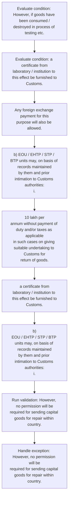

# Chapter 6 / Section 6.28: Replacement / Repair of Imported / Indigenous Goods

**Chapter Title:** Export Oriented Units (EOUs), Electronics Hardware Technology Parks (EHTPs), Software Technology Parks (STPs) and Bio-Technology

**Pages:** 16

**Purpose:** 6.28 Replacement / Repair of Imported / Indigenous Goods
a) Units may send capital goods abroad for repair with permission of
Customs authorities.

**Purpose Thanglish:** Indha Replacement / Repair of Imported / Indigenous Goods section-la, 6.28 Replacement / Repair of Imported / Indigenous Goods
a) Units may send capital goods abroad for repair with permission of
Customs authorities.

**Summary:** 6.28 Replacement / Repair of Imported / Indigenous Goods
a) Units may send capital goods abroad for repair with permission of
Customs authorities. Any foreign exchange payment for this
purpose will also be allowed. However, no permission will be
required for sending capital goods for repair within country.

**Business Meaning:** 6.28 Replacement / Repair of Imported / Indigenous Goods
a) Units may send capital goods abroad for repair with permission of
Customs authorities.

**Business Explanation:** 6.28 Replacement / Repair of Imported / Indigenous Goods
a) Units may send capital goods abroad for repair with permission of
Customs authorities. Any foreign exchange payment for this
purpose will also be allowed. However, no permission will be
required for sending capital goods for repair within country.

**Business Explanation Thanglish:** Indha Replacement / Repair of Imported / Indigenous Goods section-la, 6.28 Replacement / Repair of Imported / Indigenous Goods
a) Units may send capital goods abroad for repair with permission of
Customs authorities. Any foreign exchange payment for this
purpose will also be allowed. However, no permission will be
required for sending capital goods for repair within country.

## Business Logic
- None identified

## Business Rules
- rule_id=CH6-SEC6_28-R001, rule_description=IF validations pass THEN recommend action: Any foreign exchange payment for this
purpose will also be allowed., trigger=Replacement / Repair of Imported / Indigenous Goods, condition=However, if goods have been consumed /
destroyed in process of testing etc., validation=However, no permission will be
required for sending capital goods for repair within country., action=Any foreign exchange payment for this
purpose will also be allowed., exception=However, no permission will be
required for sending capital goods for repair within country., output=DEKAI should produce a compliance decision for 6.28 - Replacement / Repair of Imported / Indigenous Goods.

## Conditions
- However, if goods have been consumed /
destroyed in process of testing etc.
- a certificate from
laboratory / institution to this effect be furnished to
Customs.

## Condition Logic
- id=6.6.28.1, if=However, if goods have been consumed /
destroyed in process of testing etc., then=Any foreign exchange payment for this
purpose will also be allowed., source=However, if goods have been consumed /
destroyed in process of testing etc.
- id=6.6.28.2, if=a certificate from
laboratory / institution to this effect be furnished to
Customs., then=Any foreign exchange payment for this
purpose will also be allowed., source=a certificate from
laboratory / institution to this effect be furnished to
Customs.

## Validations
- However, no permission will be
required for sending capital goods for repair within country.

## Exceptions
- However, no permission will be
required for sending capital goods for repair within country.
- However, if goods have been consumed /
destroyed in process of testing etc.

## Dependencies
- None identified

## Authorities
- Customs

## Required Documents
- 10 lakh per
annum without payment of duty and/or taxes as applicable
in such cases on giving suitable undertaking to Customs for
return of goods.
- a certificate from
laboratory / institution to this effect be furnished to
Customs.

## Timelines
- However, no permission will be
required for sending capital goods for repair within country.

## Actions
- Any foreign exchange payment for this
purpose will also be allowed.
- b) EOU / EHTP / STP / BTP units may, on basis of records maintained
by them and prior intimation to Customs authorities:
i.
- 10 lakh per
annum without payment of duty and/or taxes as applicable
in such cases on giving suitable undertaking to Customs for
return of goods.
- a certificate from
laboratory / institution to this effect be furnished to
Customs.
- b)
EOU / EHTP / STP / BTP units may, on basis of records maintained
by them and prior intimation to Customs authorities:
i.

## Workflow
- Evaluate condition: However, if goods have been consumed /
destroyed in process of testing etc.
- Evaluate condition: a certificate from
laboratory / institution to this effect be furnished to
Customs.
- Any foreign exchange payment for this
purpose will also be allowed.
- b) EOU / EHTP / STP / BTP units may, on basis of records maintained
by them and prior intimation to Customs authorities:
i.
- 10 lakh per
annum without payment of duty and/or taxes as applicable
in such cases on giving suitable undertaking to Customs for
return of goods.
- a certificate from
laboratory / institution to this effect be furnished to
Customs.
- b)
EOU / EHTP / STP / BTP units may, on basis of records maintained
by them and prior intimation to Customs authorities:
i.
- Run validation: However, no permission will be
required for sending capital goods for repair within country.
- Handle exception: However, no permission will be
required for sending capital goods for repair within country.

## Workflow ASCII
```text
Replacement / Repair of Imported / Indigenous Goods
Evaluate condition: However, if goods have been consumed /
destroyed in process of testing etc.
   |
   v
Evaluate condition: a certificate from
laboratory / institution to this effect be furnished to
Customs.
   |
   v
Any foreign exchange payment for this
purpose will also be allowed.
   |
   v
b) EOU / EHTP / STP / BTP units may, on basis of records maintained
by them and prior intimation to Customs authorities:
i.
   |
   v
10 lakh per
annum without payment of duty and/or taxes as applicable
in such cases on giving suitable undertaking to Customs for
return of goods.
   |
   v
a certificate from
laboratory / institution to this effect be furnished to
Customs.
   |
   v
b)
EOU / EHTP / STP / BTP units may, on basis of records maintained
by them and prior intimation to Customs authorities:
i.
   |
   v
Run validation: However, no permission will be
required for sending capital goods for repair within country.
   |
   v
Handle exception: However, no permission will be
required for sending capital goods for repair within country.
```

## Decision Tree
- IF However, if goods have been consumed /
destroyed in process of testing etc. THEN Any foreign exchange payment for this
purpose will also be allowed.
- IF a certificate from
laboratory / institution to this effect be furnished to
Customs. THEN Any foreign exchange payment for this
purpose will also be allowed.
- IF exception applies (However, no permission will be
required for sending capital goods for repair within country.) THEN route to manual review
- IF exception applies (However, if goods have been consumed /
destroyed in process of testing etc.) THEN route to manual review

## Decision Tree ASCII
```text
Replacement / Repair of Imported / Indigenous Goods Decision
IF However, if goods have been consumed /
destroyed in process of testing etc. THEN Any foreign exchange payment for this
purpose will also be allowed.
   |
   v
IF a certificate from
laboratory / institution to this effect be furnished to
Customs. THEN Any foreign exchange payment for this
purpose will also be allowed.
   |
   v
IF exception applies (However, no permission will be
required for sending capital goods for repair within country.) THEN route to manual review
   |
   v
IF exception applies (However, if goods have been consumed /
destroyed in process of testing etc.) THEN route to manual review
```

## Examples
- User asks to process Replacement / Repair of Imported / Indigenous Goods; the platform checks conditions, validations, and documents before action.

**Real-world Example:** Example: an importer or exporter invokes Replacement / Repair of Imported / Indigenous Goods, submits 10 lakh per
annum without payment of duty and/or taxes as applicable
in such cases on giving suitable undertaking to Customs for
return of goods., a certificate from
laboratory / institution to this effect be furnished to
Customs., and DEKAI uses the extracted rules to any foreign exchange payment for this
purpose will also be allowed..

**Real-world Example Thanglish:** Indha Replacement / Repair of Imported / Indigenous Goods section-la, Example: an importer or exporter invokes Replacement / Repair of Imported / Indigenous Goods, submits 10 lakh per
annum without payment of duty and/or taxes as applicable
in such cases on giving suitable undertaking to Customs for
return of goods., a certificate from
laboratory / institution to this effect be furnished to
Customs., and DEKAI uses the extracted rules to any foreign exchange payment for this
purpose will also be allowed..

## AI Rules
- IF validations pass THEN recommend action: Any foreign exchange payment for this
purpose will also be allowed.

## Database Fields
- name=section_code, type=string, required=True, source=parsed_section_heading
- name=section_title, type=string, required=True, source=parsed_section_heading
- name=may_flag, type=boolean, required=False, source=keyword:may
- name=for_flag, type=boolean, required=False, source=keyword:for
- name=any_flag, type=boolean, required=False, source=keyword:Any
- name=eou_flag, type=boolean, required=False, source=keyword:EOU
- name=stp_flag, type=boolean, required=False, source=keyword:STP
- name=btp_flag, type=boolean, required=False, source=keyword:BTP
- name=and_flag, type=boolean, required=False, source=keyword:and
- name=dta_flag, type=boolean, required=False, source=keyword:DTA
- name=document_1_submitted, type=boolean, required=True, source=10 lakh per
annum without payment of duty and/or taxes as applicable
in such cases on giving suitable undertaking to Customs for
return of goods.
- name=document_2_submitted, type=boolean, required=True, source=a certificate from
laboratory / institution to this effect be furnished to
Customs.

## API Requirements
- method=GET, path=/api/dgft/sections/6.28, purpose=Retrieve knowledge payload for section 6.28, query_params=['include=workflow,decision_tree,validations'], response_fields=['section', 'title', 'summary', 'conditions', 'validations', 'exceptions', 'workflow', 'decision_tree']
- method=POST, path=/api/dgft/Replacement-Repair-of-Imported-Indigenous-Goods/validate, purpose=Validate inputs and documents for Replacement / Repair of Imported / Indigenous Goods, request_fields=['section_code', 'section_title', 'document_1_submitted', 'document_2_submitted'], response_fields=['status', 'errors', 'warnings', 'next_actions']
- method=POST, path=/api/dgft/Replacement-Repair-of-Imported-Indigenous-Goods/execute, purpose=Trigger business action for Any foreign exchange payment for this
purpose will also be allowed., request_fields=['section_code', 'section_title', 'document_1_submitted', 'document_2_submitted'], response_fields=['reference_id', 'status', 'authority', 'timeline']

## UI Screens
- screen_id=Replacement_Repair_of_Imported_Indigenous_Goods_overview, name=Replacement / Repair of Imported / Indigenous Goods Overview, purpose=Show section summary, authority, timeline, and eligibility cues., widgets=['summary_card', 'conditions_table', 'authority_badges', 'timeline_panel']
- screen_id=Replacement_Repair_of_Imported_Indigenous_Goods_submission, name=Replacement / Repair of Imported / Indigenous Goods Submission, purpose=Capture applicant data and supporting documents., widgets=['dynamic_form', 'document_uploader', 'validation_panel', 'next_action_footer'], fields=['section_code', 'section_title', 'may_flag', 'for_flag', 'any_flag', 'eou_flag', 'stp_flag', 'btp_flag']
- screen_id=Replacement_Repair_of_Imported_Indigenous_Goods_exceptions, name=Replacement / Repair of Imported / Indigenous Goods Exception Review, purpose=Explain exception handling and manual review triggers., widgets=['exception_banner', 'decision_tree', 'case_notes']

## Error Messages
- Validation failed because the section requirements were not fully met.

## FAQ
- question_en=What is the purpose of section 6.28?, answer_en=6.28 Replacement / Repair of Imported / Indigenous Goods
a) Units may send capital goods abroad for repair with permission of
Customs authorities. Any foreign exchange payment for this
purpose will also be allowed. However, no permission will be
required for sending capital goods for repair within country., question_thanglish=Indha Replacement / Repair of Imported / Indigenous Goods section-la, What is the purpose of section 6.28?, answer_thanglish=Indha Replacement / Repair of Imported / Indigenous Goods section-la, 6.28 Replacement / Repair of Imported / Indigenous Goods
a) Units may send capital goods abroad for repair with permission of
Customs authorities. Any foreign exchange payment for this
purpose will also be allowed. However, no permission will be
required for sending capital goods for repair within country.
- question_en=What documents are required under Replacement / Repair of Imported / Indigenous Goods?, answer_en=10 lakh per
annum without payment of duty and/or taxes as applicable
in such cases on giving suitable undertaking to Customs for
return of goods., a certificate from
laboratory / institution to this effect be furnished to
Customs., question_thanglish=Indha Replacement / Repair of Imported / Indigenous Goods section-la, What documents are required under Replacement / Repair of Imported / Indigenous Goods?, answer_thanglish=Indha Replacement / Repair of Imported / Indigenous Goods section-la, 10 lakh per
annum without payment of duty and/or taxes as applicable
in such cases on giving suitable undertaking to Customs for
return of goods., a certificate from
laboratory / institution to this effect be furnished to
Customs.
- question_en=Which authority handles Replacement / Repair of Imported / Indigenous Goods?, answer_en=Customs, question_thanglish=Indha Replacement / Repair of Imported / Indigenous Goods section-la, Which authority handles Replacement / Repair of Imported / Indigenous Goods?, answer_thanglish=Indha Replacement / Repair of Imported / Indigenous Goods section-la, Customs

## Questions Users May Ask
- What does Replacement / Repair of Imported / Indigenous Goods require?
- Which documents are needed for Replacement / Repair of Imported / Indigenous Goods?
- How does DEKAI validate Replacement / Repair of Imported / Indigenous Goods requests?
- What action should be taken for Replacement / Repair of Imported / Indigenous Goods?

## Expected AI Answers
- Replacement / Repair of Imported / Indigenous Goods requires the platform to interpret the section text, apply the extracted business rules, and present the correct next action.
- Required documents are inferred from the section text: 10 lakh per
annum without payment of duty and/or taxes as applicable
in such cases on giving suitable undertaking to Customs for
return of goods., a certificate from
laboratory / institution to this effect be furnished to
Customs.
- DEKAI validates Replacement / Repair of Imported / Indigenous Goods by checking conditions, required documents, authority references, and exception clauses before recommending an outcome.
- The primary extracted action is: Any foreign exchange payment for this
purpose will also be allowed.

## AI Q&A Examples
- question_en=User asks: How do I comply with Replacement / Repair of Imported / Indigenous Goods?, answer_en=AI answers: DEKAI should evaluate section 6.28, apply the extracted rules, and guide the user through Evaluate condition: However, if goods have been consumed /
destroyed in process of testing etc.., question_thanglish=Indha Replacement / Repair of Imported / Indigenous Goods section-la, User asks: How do I comply with Replacement / Repair of Imported / Indigenous Goods?, answer_thanglish=Indha Replacement / Repair of Imported / Indigenous Goods section-la, AI answers: DEKAI should evaluate section 6.28, apply the extracted rules, and guide the user through Evaluate condition: However, if goods have been consumed /
destroyed in process of testing etc..
- question_en=User asks: Which validations apply to Replacement / Repair of Imported / Indigenous Goods?, answer_en=AI answers: Applicable validations are However, no permission will be
required for sending capital goods for repair within country., question_thanglish=Indha Replacement / Repair of Imported / Indigenous Goods section-la, User asks: Which validations apply to Replacement / Repair of Imported / Indigenous Goods?, answer_thanglish=Indha Replacement / Repair of Imported / Indigenous Goods section-la, AI answers: Applicable validations are However, no permission will be
required for sending capital goods for repair within country.

## DEKAI AI Implementation Notes
- Capture chapter 6, section 6.28, title, and page references as immutable knowledge metadata.
- Bind validations for Replacement / Repair of Imported / Indigenous Goods into a rule engine keyed by the rule IDs extracted for this section.
- Expose document upload controls for: 10 lakh per
annum without payment of duty and/or taxes as applicable
in such cases on giving suitable undertaking to Customs for
return of goods., a certificate from
laboratory / institution to this effect be furnished to
Customs..
- Route escalations or approvals to: Customs.
- Trigger manual review when exception clauses are detected.

## DEKAI AI Implementation Notes Thanglish
- Indha Replacement / Repair of Imported / Indigenous Goods section-la, Capture chapter 6, section 6.28, title, and page references as immutable knowledge metadata.
- Indha Replacement / Repair of Imported / Indigenous Goods section-la, Bind validations for Replacement / Repair of Imported / Indigenous Goods into a rule engine keyed by the rule IDs extracted for this section.
- Indha Replacement / Repair of Imported / Indigenous Goods section-la, Expose document upload controls for: 10 lakh per
annum without payment of duty and/or taxes as applicable
in such cases on giving suitable undertaking to Customs for
return of goods., a certificate from
laboratory / institution to this effect be furnished to
Customs..
- Indha Replacement / Repair of Imported / Indigenous Goods section-la, Route escalations or approvals to: Customs.
- Indha Replacement / Repair of Imported / Indigenous Goods section-la, Trigger manual review when exception clauses are detected.

## AI Metadata
- Keywords: may, for, Any, EOU, STP, BTP, and, DTA, R&D, per, etc, send, with, this, will, also, EHTP, them, upto, lakh
- Search Keywords: may, for, Any, EOU, STP, BTP, and, DTA, R&D, per, etc, send, with, this, will, also, EHTP, them, upto, lakh
- Intent: Support Replacement / Repair of Imported / Indigenous Goods processing and compliance validation.
- Tags: 6.28, Replacement / Repair of Imported / Indigenous Goods, document-driven, dgft
- Related Sections: 
- Related Chapters: 
- Related Rules: 

## Mermaid


## PlantUML
```plantuml
@startuml
start
:Evaluate condition\: However, if goods have been consumed /
destroyed in process of testing etc.;
:Evaluate condition\: a certificate from
laboratory / institution to this effect be furnished to
Customs.;
:Any foreign exchange payment for this
purpose will also be allowed.;
:b) EOU / EHTP / STP / BTP units may, on basis of records maintained
by them and prior intimation to Customs authorities\:
i.;
:10 lakh per
annum without payment of duty and/or taxes as applicable
in such cases on giving suitable undertaking to Customs for
return of goods.;
:a certificate from
laboratory / institution to this effect be furnished to
Customs.;
:b)
EOU / EHTP / STP / BTP units may, on basis of records maintained
by them and prior intimation to Customs authorities\:
i.;
:Run validation\: However, no permission will be
required for sending capital goods for repair within country.;
:Handle exception\: However, no permission will be
required for sending capital goods for repair within country.;
stop
@enduml
```
