# Chapter 6 / Section 6.29: Samples

**Chapter Title:** Export Oriented Units (EOUs), Electronics Hardware Technology Parks (EHTPs), Software Technology Parks (STPs) and Bio-Technology

**Pages:** 16, 17

**Purpose:** 6.29 Samples
a) EOU / EHTP / STP / BTP units may on basis of records maintained
by them, and on prior intimation to Customs authority, supply or
sell samples in DTA for display / market promotion on payment of
excise duty, if applicable, and/or payment of GST and
compensation cess along with reversal of duties of Customs
leviable under First Schedule to the Customs Tariff Act, 1975, if
availed on inputs.

**Purpose Thanglish:** Indha Samples section-la, 6.29 Samples
a) EOU / EHTP / STP / BTP units may on basis of records maintained
by them, and on prior intimation to Customs authority, supply or
sell samples in DTA for display / market promotion on payment of
excise duty, if applicable, and/or payment of GST and
compensation cess along with reversal of duties of Customs
leviable under First Schedule to the Customs Tariff Act, 1975, if
availed on inputs.

**Summary:** 6.29 Samples
a) EOU / EHTP / STP / BTP units may on basis of records maintained
by them, and on prior intimation to Customs authority, supply or
sell samples in DTA for display / market promotion on payment of
excise duty, if applicable, and/or payment of GST and
compensation cess along with reversal of duties of Customs
leviable under First Schedule to the Customs Tariff Act, 1975, if
availed on inputs. b) Remove samples without payment of duty and/or taxes on
furnishing a suitable undertaking to Customs authorities for
bringing back samples within a stipulated period. c) An EOU may export free samples, without any limit, including
samples made in wax moulds, silver mould and rubber moulds
through all permissible mode of export including through courier
agencies / post.

**Business Meaning:** Samples governs how DGFT business controls should be applied, validated, and enforced.

**Business Explanation:** Samples explains the operating rule set that DEKAI should enforce. Key control points include Following documents should be submitted as proof
of exports:
i. The section also drives actions such as 6.29 Samples
a) EOU / EHTP / STP / BTP units may on basis of records maintained
by them, and on prior intimation to Customs authority, supply or
sell samples in DTA for display / market promotion on payment of
excise duty, if applicable, and/or payment of GST and
compensation cess along with reversal of duties of Customs
leviable under First Schedule to the Customs Tariff Act, 1975, if
availed on inputs..

**Business Explanation Thanglish:** Indha Samples section-la, Samples explains the operating rule set that DEKAI should enforce. Key control points include Following documents should be submitted as proof
of exports:
i. The section also drives actions such as 6.29 Samples
a) EOU / EHTP / STP / BTP units may on basis of records maintained
by them, and on prior intimation to Customs authority, supply or
sell samples in DTA for display / market promotion on payment of
excise duty, if applicable, and/or payment of GST and
compensation cess along with reversal of duties of Customs
leviable under First Schedule to the Customs Tariff Act, 1975, if
availed on inputs..

## Business Logic
- Following documents should be submitted as proof
of exports:
i.
- For statutory requirement of Stability & Retention
sample with manufacturer, an EOU / EHTP / BTP / STP
unit may re-import with or without payment of duties/taxes as
provided at para 6.01(d)(ii) of FTP those samples, which were
exported by it, under intimation to Custom Authorities, and FOB
value of such samples shall not be counted for NFE purpose and
other export benefits, if any.

## Business Rules
- rule_id=CH6-SEC6_29-R001, rule_description=Following documents should be submitted as proof
of exports:
i., trigger=Samples, condition=applicable, validation=For statutory requirement of Stability & Retention
sample with manufacturer, an EOU / EHTP / BTP / STP
unit may re-import with or without payment of duties/taxes as
provided at para 6.01(d)(ii) of FTP those samples, which were
exported by it, under intimation to Custom Authorities, and FOB
value of such samples shall not be counted for NFE purpose and
other export benefits, if any., action=6.29 Samples
a) EOU / EHTP / STP / BTP units may on basis of records maintained
by them, and on prior intimation to Customs authority, supply or
sell samples in DTA for display / market promotion on payment of
excise duty, if applicable, and/or payment of GST and
compensation cess along with reversal of duties of Customs
leviable under First Schedule to the Customs Tariff Act, 1975, if
availed on inputs., exception=No explicit exception found in uploaded documents., output=DEKAI should produce a compliance decision for 6.29 - Samples.
- rule_id=CH6-SEC6_29-R002, rule_description=For statutory requirement of Stability & Retention
sample with manufacturer, an EOU / EHTP / BTP / STP
unit may re-import with or without payment of duties/taxes as
provided at para 6.01(d)(ii) of FTP those samples, which were
exported by it, under intimation to Custom Authorities, and FOB
value of such samples shall not be counted for NFE purpose and
other export benefits, if any., trigger=Samples, condition=applicable, validation=For statutory requirement of Stability & Retention
sample with manufacturer, an EOU / EHTP / BTP / STP
unit may re-import with or without payment of duties/taxes as
provided at para 6.01(d)(ii) of FTP those samples, which were
exported by it, under intimation to Custom Authorities, and FOB
value of such samples shall not be counted for NFE purpose and
other export benefits, if any., action=b) Remove samples without payment of duty and/or taxes on
furnishing a suitable undertaking to Customs authorities for
bringing back samples within a stipulated period., exception=No explicit exception found in uploaded documents., output=DEKAI should produce a compliance decision for 6.29 - Samples.

## Conditions
- 6.29 Samples
a) EOU / EHTP / STP / BTP units may on basis of records maintained
by them, and on prior intimation to Customs authority, supply or
sell samples in DTA for display / market promotion on payment of
excise duty, if applicable, and/or payment of GST and
compensation cess along with reversal of duties of Customs
leviable under First Schedule to the Customs Tariff Act, 1975, if
availed on inputs.
- 6.29 Samples
a)
EOU / EHTP / STP / BTP units may on basis of records maintained
by them, and on prior intimation to Customs authority, supply or
sell samples in DTA for display / market promotion on payment of
excise duty, if applicable, and/or payment of GST and
compensation cess along with reversal of duties of Customs
leviable under First Schedule to the Customs Tariff Act, 1975, if
availed on inputs.
- For statutory requirement of Stability & Retention
sample with manufacturer, an EOU / EHTP / BTP / STP
unit may re-import with or without payment of duties/taxes as
provided at para 6.01(d)(ii) of FTP those samples, which were
exported by it, under intimation to Custom Authorities, and FOB
value of such samples shall not be counted for NFE purpose and
other export benefits, if any.

## Condition Logic
- id=6.6.29.1, if=applicable, then=6.29 Samples
a) EOU / EHTP / STP / BTP units may on basis of records maintained
by them, and on prior intimation to Customs authority, supply or
sell samples in DTA for display / market promotion on payment of
excise duty, if applicable, and/or payment of GST and
compensation cess along with reversal of duties of Customs
leviable under First Schedule to the Customs Tariff Act, 1975, if
availed on inputs., source=6.29 Samples
a) EOU / EHTP / STP / BTP units may on basis of records maintained
by them, and on prior intimation to Customs authority, supply or
sell samples in DTA for display / market promotion on payment of
excise duty, if applicable, and/or payment of GST and
compensation cess along with reversal of duties of Customs
leviable under First Schedule to the Customs Tariff Act, 1975, if
availed on inputs.
- id=6.6.29.2, if=applicable, then=6.29 Samples
a) EOU / EHTP / STP / BTP units may on basis of records maintained
by them, and on prior intimation to Customs authority, supply or
sell samples in DTA for display / market promotion on payment of
excise duty, if applicable, and/or payment of GST and
compensation cess along with reversal of duties of Customs
leviable under First Schedule to the Customs Tariff Act, 1975, if
availed on inputs., source=6.29 Samples
a)
EOU / EHTP / STP / BTP units may on basis of records maintained
by them, and on prior intimation to Customs authority, supply or
sell samples in DTA for display / market promotion on payment of
excise duty, if applicable, and/or payment of GST and
compensation cess along with reversal of duties of Customs
leviable under First Schedule to the Customs Tariff Act, 1975, if
availed on inputs.
- id=6.6.29.3, if=For statutory requirement of Stability & Retention
sample with manufacturer, an EOU / EHTP / BTP / STP
unit may re-import with or without payment of duties/taxes as
provided at para 6.01(d)(ii) of FTP those samples, which were
exported by it, under intimation to Custom Authorities, and FOB
value of such samples shall not be counted for NFE purpose and
other export benefits, if any., then=6.29 Samples
a) EOU / EHTP / STP / BTP units may on basis of records maintained
by them, and on prior intimation to Customs authority, supply or
sell samples in DTA for display / market promotion on payment of
excise duty, if applicable, and/or payment of GST and
compensation cess along with reversal of duties of Customs
leviable under First Schedule to the Customs Tariff Act, 1975, if
availed on inputs., source=For statutory requirement of Stability & Retention
sample with manufacturer, an EOU / EHTP / BTP / STP
unit may re-import with or without payment of duties/taxes as
provided at para 6.01(d)(ii) of FTP those samples, which were
exported by it, under intimation to Custom Authorities, and FOB
value of such samples shall not be counted for NFE purpose and
other export benefits, if any.

## Validations
- For statutory requirement of Stability & Retention
sample with manufacturer, an EOU / EHTP / BTP / STP
unit may re-import with or without payment of duties/taxes as
provided at para 6.01(d)(ii) of FTP those samples, which were
exported by it, under intimation to Custom Authorities, and FOB
value of such samples shall not be counted for NFE purpose and
other export benefits, if any.

## Exceptions
- None identified

## Dependencies
- 6.01

## Authorities
- Customs
- Customs authority
- First Schedule to the Customs
- Permission letter from Customs
- Custom Authorities

## Required Documents
- b) Remove samples without payment of duty and/or taxes on
furnishing a suitable undertaking to Customs authorities for
bringing back samples within a stipulated period.
- Following documents should be submitted as proof
of exports:
i.
- Invoice with value (for payment or free of charge).
- b)
Remove samples without payment of duty and/or taxes on
furnishing a suitable undertaking to Customs authorities for
bringing back samples within a stipulated period.

## Timelines
- b) Remove samples without payment of duty and/or taxes on
furnishing a suitable undertaking to Customs authorities for
bringing back samples within a stipulated period.
- b)
Remove samples without payment of duty and/or taxes on
furnishing a suitable undertaking to Customs authorities for
bringing back samples within a stipulated period.
- d) An EOU, on basis of records maintained by them and on prior
intimation to Customs authorities, may send samples to other EOUs
for display on returnable basis within a period of 30 days.

## Actions
- 6.29 Samples
a) EOU / EHTP / STP / BTP units may on basis of records maintained
by them, and on prior intimation to Customs authority, supply or
sell samples in DTA for display / market promotion on payment of
excise duty, if applicable, and/or payment of GST and
compensation cess along with reversal of duties of Customs
leviable under First Schedule to the Customs Tariff Act, 1975, if
availed on inputs.
- b) Remove samples without payment of duty and/or taxes on
furnishing a suitable undertaking to Customs authorities for
bringing back samples within a stipulated period.
- Following documents should be submitted as proof
of exports:
i.
- Invoice with value (for payment or free of charge).
- 6.29 Samples
a)
EOU / EHTP / STP / BTP units may on basis of records maintained
by them, and on prior intimation to Customs authority, supply or
sell samples in DTA for display / market promotion on payment of
excise duty, if applicable, and/or payment of GST and
compensation cess along with reversal of duties of Customs
leviable under First Schedule to the Customs Tariff Act, 1975, if
availed on inputs.
- b)
Remove samples without payment of duty and/or taxes on
furnishing a suitable undertaking to Customs authorities for
bringing back samples within a stipulated period.
- For statutory requirement of Stability & Retention
sample with manufacturer, an EOU / EHTP / BTP / STP
unit may re-import with or without payment of duties/taxes as
provided at para 6.01(d)(ii) of FTP those samples, which were
exported by it, under intimation to Custom Authorities, and FOB
value of such samples shall not be counted for NFE purpose and
other export benefits, if any.
- d) An EOU, on basis of records maintained by them and on prior
intimation to Customs authorities, may send samples to other EOUs
for display on returnable basis within a period of 30 days.

## Workflow
- Evaluate condition: 6.29 Samples
a) EOU / EHTP / STP / BTP units may on basis of records maintained
by them, and on prior intimation to Customs authority, supply or
sell samples in DTA for display / market promotion on payment of
excise duty, if applicable, and/or payment of GST and
compensation cess along with reversal of duties of Customs
leviable under First Schedule to the Customs Tariff Act, 1975, if
availed on inputs.
- Evaluate condition: 6.29 Samples
a)
EOU / EHTP / STP / BTP units may on basis of records maintained
by them, and on prior intimation to Customs authority, supply or
sell samples in DTA for display / market promotion on payment of
excise duty, if applicable, and/or payment of GST and
compensation cess along with reversal of duties of Customs
leviable under First Schedule to the Customs Tariff Act, 1975, if
availed on inputs.
- Evaluate condition: For statutory requirement of Stability & Retention
sample with manufacturer, an EOU / EHTP / BTP / STP
unit may re-import with or without payment of duties/taxes as
provided at para 6.01(d)(ii) of FTP those samples, which were
exported by it, under intimation to Custom Authorities, and FOB
value of such samples shall not be counted for NFE purpose and
other export benefits, if any.
- 6.29 Samples
a) EOU / EHTP / STP / BTP units may on basis of records maintained
by them, and on prior intimation to Customs authority, supply or
sell samples in DTA for display / market promotion on payment of
excise duty, if applicable, and/or payment of GST and
compensation cess along with reversal of duties of Customs
leviable under First Schedule to the Customs Tariff Act, 1975, if
availed on inputs.
- b) Remove samples without payment of duty and/or taxes on
furnishing a suitable undertaking to Customs authorities for
bringing back samples within a stipulated period.
- Following documents should be submitted as proof
of exports:
i.
- Invoice with value (for payment or free of charge).
- 6.29 Samples
a)
EOU / EHTP / STP / BTP units may on basis of records maintained
by them, and on prior intimation to Customs authority, supply or
sell samples in DTA for display / market promotion on payment of
excise duty, if applicable, and/or payment of GST and
compensation cess along with reversal of duties of Customs
leviable under First Schedule to the Customs Tariff Act, 1975, if
availed on inputs.
- b)
Remove samples without payment of duty and/or taxes on
furnishing a suitable undertaking to Customs authorities for
bringing back samples within a stipulated period.
- Run validation: For statutory requirement of Stability & Retention
sample with manufacturer, an EOU / EHTP / BTP / STP
unit may re-import with or without payment of duties/taxes as
provided at para 6.01(d)(ii) of FTP those samples, which were
exported by it, under intimation to Custom Authorities, and FOB
value of such samples shall not be counted for NFE purpose and
other export benefits, if any.

## Workflow ASCII
```text
Samples
Evaluate condition: 6.29 Samples
a) EOU / EHTP / STP / BTP units may on basis of records maintained
by them, and on prior intimation to Customs authority, supply or
sell samples in DTA for display / market promotion on payment of
excise duty, if applicable, and/or payment of GST and
compensation cess along with reversal of duties of Customs
leviable under First Schedule to the Customs Tariff Act, 1975, if
availed on inputs.
   |
   v
Evaluate condition: 6.29 Samples
a)
EOU / EHTP / STP / BTP units may on basis of records maintained
by them, and on prior intimation to Customs authority, supply or
sell samples in DTA for display / market promotion on payment of
excise duty, if applicable, and/or payment of GST and
compensation cess along with reversal of duties of Customs
leviable under First Schedule to the Customs Tariff Act, 1975, if
availed on inputs.
   |
   v
Evaluate condition: For statutory requirement of Stability & Retention
sample with manufacturer, an EOU / EHTP / BTP / STP
unit may re-import with or without payment of duties/taxes as
provided at para 6.01(d)(ii) of FTP those samples, which were
exported by it, under intimation to Custom Authorities, and FOB
value of such samples shall not be counted for NFE purpose and
other export benefits, if any.
   |
   v
6.29 Samples
a) EOU / EHTP / STP / BTP units may on basis of records maintained
by them, and on prior intimation to Customs authority, supply or
sell samples in DTA for display / market promotion on payment of
excise duty, if applicable, and/or payment of GST and
compensation cess along with reversal of duties of Customs
leviable under First Schedule to the Customs Tariff Act, 1975, if
availed on inputs.
   |
   v
b) Remove samples without payment of duty and/or taxes on
furnishing a suitable undertaking to Customs authorities for
bringing back samples within a stipulated period.
   |
   v
Following documents should be submitted as proof
of exports:
i.
   |
   v
Invoice with value (for payment or free of charge).
   |
   v
6.29 Samples
a)
EOU / EHTP / STP / BTP units may on basis of records maintained
by them, and on prior intimation to Customs authority, supply or
sell samples in DTA for display / market promotion on payment of
excise duty, if applicable, and/or payment of GST and
compensation cess along with reversal of duties of Customs
leviable under First Schedule to the Customs Tariff Act, 1975, if
availed on inputs.
   |
   v
b)
Remove samples without payment of duty and/or taxes on
furnishing a suitable undertaking to Customs authorities for
bringing back samples within a stipulated period.
   |
   v
Run validation: For statutory requirement of Stability & Retention
sample with manufacturer, an EOU / EHTP / BTP / STP
unit may re-import with or without payment of duties/taxes as
provided at para 6.01(d)(ii) of FTP those samples, which were
exported by it, under intimation to Custom Authorities, and FOB
value of such samples shall not be counted for NFE purpose and
other export benefits, if any.
```

## Decision Tree
- IF 6.29 Samples
a) EOU / EHTP / STP / BTP units may on basis of records maintained
by them, and on prior intimation to Customs authority, supply or
sell samples in DTA for display / market promotion on payment of
excise duty, if applicable, and/or payment of GST and
compensation cess along with reversal of duties of Customs
leviable under First Schedule to the Customs Tariff Act, 1975, if
availed on inputs. THEN 6.29 Samples
a) EOU / EHTP / STP / BTP units may on basis of records maintained
by them, and on prior intimation to Customs authority, supply or
sell samples in DTA for display / market promotion on payment of
excise duty, if applicable, and/or payment of GST and
compensation cess along with reversal of duties of Customs
leviable under First Schedule to the Customs Tariff Act, 1975, if
availed on inputs.
- IF 6.29 Samples
a)
EOU / EHTP / STP / BTP units may on basis of records maintained
by them, and on prior intimation to Customs authority, supply or
sell samples in DTA for display / market promotion on payment of
excise duty, if applicable, and/or payment of GST and
compensation cess along with reversal of duties of Customs
leviable under First Schedule to the Customs Tariff Act, 1975, if
availed on inputs. THEN 6.29 Samples
a) EOU / EHTP / STP / BTP units may on basis of records maintained
by them, and on prior intimation to Customs authority, supply or
sell samples in DTA for display / market promotion on payment of
excise duty, if applicable, and/or payment of GST and
compensation cess along with reversal of duties of Customs
leviable under First Schedule to the Customs Tariff Act, 1975, if
availed on inputs.
- IF For statutory requirement of Stability & Retention
sample with manufacturer, an EOU / EHTP / BTP / STP
unit may re-import with or without payment of duties/taxes as
provided at para 6.01(d)(ii) of FTP those samples, which were
exported by it, under intimation to Custom Authorities, and FOB
value of such samples shall not be counted for NFE purpose and
other export benefits, if any. THEN 6.29 Samples
a) EOU / EHTP / STP / BTP units may on basis of records maintained
by them, and on prior intimation to Customs authority, supply or
sell samples in DTA for display / market promotion on payment of
excise duty, if applicable, and/or payment of GST and
compensation cess along with reversal of duties of Customs
leviable under First Schedule to the Customs Tariff Act, 1975, if
availed on inputs.

## Decision Tree ASCII
```text
Samples Decision
IF 6.29 Samples
a) EOU / EHTP / STP / BTP units may on basis of records maintained
by them, and on prior intimation to Customs authority, supply or
sell samples in DTA for display / market promotion on payment of
excise duty, if applicable, and/or payment of GST and
compensation cess along with reversal of duties of Customs
leviable under First Schedule to the Customs Tariff Act, 1975, if
availed on inputs. THEN 6.29 Samples
a) EOU / EHTP / STP / BTP units may on basis of records maintained
by them, and on prior intimation to Customs authority, supply or
sell samples in DTA for display / market promotion on payment of
excise duty, if applicable, and/or payment of GST and
compensation cess along with reversal of duties of Customs
leviable under First Schedule to the Customs Tariff Act, 1975, if
availed on inputs.
   |
   v
IF 6.29 Samples
a)
EOU / EHTP / STP / BTP units may on basis of records maintained
by them, and on prior intimation to Customs authority, supply or
sell samples in DTA for display / market promotion on payment of
excise duty, if applicable, and/or payment of GST and
compensation cess along with reversal of duties of Customs
leviable under First Schedule to the Customs Tariff Act, 1975, if
availed on inputs. THEN 6.29 Samples
a) EOU / EHTP / STP / BTP units may on basis of records maintained
by them, and on prior intimation to Customs authority, supply or
sell samples in DTA for display / market promotion on payment of
excise duty, if applicable, and/or payment of GST and
compensation cess along with reversal of duties of Customs
leviable under First Schedule to the Customs Tariff Act, 1975, if
availed on inputs.
   |
   v
IF For statutory requirement of Stability & Retention
sample with manufacturer, an EOU / EHTP / BTP / STP
unit may re-import with or without payment of duties/taxes as
provided at para 6.01(d)(ii) of FTP those samples, which were
exported by it, under intimation to Custom Authorities, and FOB
value of such samples shall not be counted for NFE purpose and
other export benefits, if any. THEN 6.29 Samples
a) EOU / EHTP / STP / BTP units may on basis of records maintained
by them, and on prior intimation to Customs authority, supply or
sell samples in DTA for display / market promotion on payment of
excise duty, if applicable, and/or payment of GST and
compensation cess along with reversal of duties of Customs
leviable under First Schedule to the Customs Tariff Act, 1975, if
availed on inputs.
```

## Examples
- User asks to process Samples; the platform checks conditions, validations, and documents before action.

**Real-world Example:** Example: an importer or exporter invokes Samples, submits b) Remove samples without payment of duty and/or taxes on
furnishing a suitable undertaking to Customs authorities for
bringing back samples within a stipulated period., Following documents should be submitted as proof
of exports:
i., Invoice with value (for payment or free of charge)., and DEKAI uses the extracted rules to 6.29 samples
a) eou / ehtp / stp / btp units may on basis of records maintained
by them, and on prior intimation to customs authority, supply or
sell samples in dta for display / market promotion on payment of
excise duty, if applicable, and/or payment of gst and
compensation cess along with reversal of duties of customs
leviable under first schedule to the customs tariff act, 1975, if
availed on inputs..

**Real-world Example Thanglish:** Indha Samples section-la, Example: an importer or exporter invokes Samples, submits b) Remove samples without payment of duty and/or taxes on
furnishing a suitable undertaking to Customs authorities for
bringing back samples within a stipulated period., Following documents should be submitted as proof
of exports:
i., Invoice with value (for payment or free of charge)., and DEKAI uses the extracted rules to 6.29 samples
a) eou / ehtp / stp / btp units may on basis of records maintained
by them, and on prior intimation to customs authority, supply or
sell samples in dta for display / market promotion on payment of
excise duty, if applicable, and/or payment of gst and
compensation cess along with reversal of duties of customs
leviable under first schedule to the customs tariff act, 1975, if
availed on inputs..

## AI Rules
- IF detected context matches section rule THEN enforce: Following documents should be submitted as proof
of exports:
i.
- IF detected context matches section rule THEN enforce: For statutory requirement of Stability & Retention
sample with manufacturer, an EOU / EHTP / BTP / STP
unit may re-import with or without payment of duties/taxes as
provided at para 6.01(d)(ii) of FTP those samples, which were
exported by it, under intimation to Custom Authorities, and FOB
value of such samples shall not be counted for NFE purpose and
other export benefits, if any.
- IF validations pass THEN recommend action: 6.29 Samples
a) EOU / EHTP / STP / BTP units may on basis of records maintained
by them, and on prior intimation to Customs authority, supply or
sell samples in DTA for display / market promotion on payment of
excise duty, if applicable, and/or payment of GST and
compensation cess along with reversal of duties of Customs
leviable under First Schedule to the Customs Tariff Act, 1975, if
availed on inputs.

## Database Fields
- name=section_code, type=string, required=True, source=parsed_section_heading
- name=section_title, type=string, required=True, source=parsed_section_heading
- name=eou_flag, type=boolean, required=False, source=keyword:EOU
- name=stp_flag, type=boolean, required=False, source=keyword:STP
- name=btp_flag, type=boolean, required=False, source=keyword:BTP
- name=may_flag, type=boolean, required=False, source=keyword:may
- name=and_flag, type=boolean, required=False, source=keyword:and
- name=dta_flag, type=boolean, required=False, source=keyword:DTA
- name=for_flag, type=boolean, required=False, source=keyword:for
- name=gst_flag, type=boolean, required=False, source=keyword:GST
- name=document_1_submitted, type=boolean, required=True, source=b) Remove samples without payment of duty and/or taxes on
furnishing a suitable undertaking to Customs authorities for
bringing back samples within a stipulated period.
- name=document_2_submitted, type=boolean, required=True, source=Following documents should be submitted as proof
of exports:
i.
- name=document_3_submitted, type=boolean, required=True, source=Invoice with value (for payment or free of charge).
- name=document_4_submitted, type=boolean, required=True, source=b)
Remove samples without payment of duty and/or taxes on
furnishing a suitable undertaking to Customs authorities for
bringing back samples within a stipulated period.

## API Requirements
- method=GET, path=/api/dgft/sections/6.29, purpose=Retrieve knowledge payload for section 6.29, query_params=['include=workflow,decision_tree,validations'], response_fields=['section', 'title', 'summary', 'conditions', 'validations', 'exceptions', 'workflow', 'decision_tree']
- method=POST, path=/api/dgft/Samples/validate, purpose=Validate inputs and documents for Samples, request_fields=['section_code', 'section_title', 'document_1_submitted', 'document_2_submitted', 'document_3_submitted', 'document_4_submitted'], response_fields=['status', 'errors', 'warnings', 'next_actions']
- method=POST, path=/api/dgft/Samples/execute, purpose=Trigger business action for 6.29 Samples
a) EOU / EHTP / STP / BTP units may on basis of records maintained
by them, and on prior intimation to Customs authority, supply or
sell samples in DTA for display / market promotion on payment of
excise duty, if applicable, and/or payment of GST and
compensation cess along with reversal of duties of Customs
leviable under First Schedule to the Customs Tariff Act, 1975, if
availed on inputs., request_fields=['section_code', 'section_title', 'document_1_submitted', 'document_2_submitted', 'document_3_submitted', 'document_4_submitted'], response_fields=['reference_id', 'status', 'authority', 'timeline']

## UI Screens
- screen_id=Samples_overview, name=Samples Overview, purpose=Show section summary, authority, timeline, and eligibility cues., widgets=['summary_card', 'conditions_table', 'authority_badges', 'timeline_panel']
- screen_id=Samples_submission, name=Samples Submission, purpose=Capture applicant data and supporting documents., widgets=['dynamic_form', 'document_uploader', 'validation_panel', 'next_action_footer'], fields=['section_code', 'section_title', 'eou_flag', 'stp_flag', 'btp_flag', 'may_flag', 'and_flag', 'dta_flag']

## Error Messages
- Validation failed because the section requirements were not fully met.

## FAQ
- question_en=What is the purpose of section 6.29?, answer_en=Samples explains the operating rule set that DEKAI should enforce. Key control points include Following documents should be submitted as proof
of exports:
i. The section also drives actions such as 6.29 Samples
a) EOU / EHTP / STP / BTP units may on basis of records maintained
by them, and on prior intimation to Customs authority, supply or
sell samples in DTA for display / market promotion on payment of
excise duty, if applicable, and/or payment of GST and
compensation cess along with reversal of duties of Customs
leviable under First Schedule to the Customs Tariff Act, 1975, if
availed on inputs.., question_thanglish=Indha Samples section-la, What is the purpose of section 6.29?, answer_thanglish=Indha Samples section-la, Samples explains the operating rule set that DEKAI should enforce. Key control points include Following documents should be submitted as proof
of exports:
i. The section also drives actions such as 6.29 Samples
a) EOU / EHTP / STP / BTP units may on basis of records maintained
by them, and on prior intimation to Customs authority, supply or
sell samples in DTA for display / market promotion on payment of
excise duty, if applicable, and/or payment of GST and
compensation cess along with reversal of duties of Customs
leviable under First Schedule to the Customs Tariff Act, 1975, if
availed on inputs..
- question_en=What documents are required under Samples?, answer_en=b) Remove samples without payment of duty and/or taxes on
furnishing a suitable undertaking to Customs authorities for
bringing back samples within a stipulated period., Following documents should be submitted as proof
of exports:
i., Invoice with value (for payment or free of charge)., b)
Remove samples without payment of duty and/or taxes on
furnishing a suitable undertaking to Customs authorities for
bringing back samples within a stipulated period., question_thanglish=Indha Samples section-la, What documents are required under Samples?, answer_thanglish=Indha Samples section-la, b) Remove samples without payment of duty and/or taxes on
furnishing a suitable undertaking to Customs authorities for
bringing back samples within a stipulated period., Following documents should be submitted as proof
of exports:
i., Invoice with value (for payment or free of charge)., b)
Remove samples without payment of duty and/or taxes on
furnishing a suitable undertaking to Customs authorities for
bringing back samples within a stipulated period.
- question_en=Which authority handles Samples?, answer_en=Customs, Customs authority, First Schedule to the Customs, Permission letter from Customs, Custom Authorities, question_thanglish=Indha Samples section-la, Which authority handles Samples?, answer_thanglish=Indha Samples section-la, Customs, Customs authority, First Schedule to the Customs, Permission letter from Customs, Custom Authorities

## Questions Users May Ask
- What does Samples require?
- Which documents are needed for Samples?
- How does DEKAI validate Samples requests?
- What action should be taken for Samples?

## Expected AI Answers
- Samples requires the platform to interpret the section text, apply the extracted business rules, and present the correct next action.
- Required documents are inferred from the section text: b) Remove samples without payment of duty and/or taxes on
furnishing a suitable undertaking to Customs authorities for
bringing back samples within a stipulated period., Following documents should be submitted as proof
of exports:
i., Invoice with value (for payment or free of charge)., b)
Remove samples without payment of duty and/or taxes on
furnishing a suitable undertaking to Customs authorities for
bringing back samples within a stipulated period.
- DEKAI validates Samples by checking conditions, required documents, authority references, and exception clauses before recommending an outcome.
- The primary extracted action is: 6.29 Samples
a) EOU / EHTP / STP / BTP units may on basis of records maintained
by them, and on prior intimation to Customs authority, supply or
sell samples in DTA for display / market promotion on payment of
excise duty, if applicable, and/or payment of GST and
compensation cess along with reversal of duties of Customs
leviable under First Schedule to the Customs Tariff Act, 1975, if
availed on inputs.

## AI Q&A Examples
- question_en=User asks: How do I comply with Samples?, answer_en=AI answers: DEKAI should evaluate section 6.29, apply the extracted rules, and guide the user through Evaluate condition: 6.29 Samples
a) EOU / EHTP / STP / BTP units may on basis of records maintained
by them, and on prior intimation to Customs authority, supply or
sell samples in DTA for display / market promotion on payment of
excise duty, if applicable, and/or payment of GST and
compensation cess along with reversal of duties of Customs
leviable under First Schedule to the Customs Tariff Act, 1975, if
availed on inputs.., question_thanglish=Indha Samples section-la, User asks: How do I comply with Samples?, answer_thanglish=Indha Samples section-la, AI answers: DEKAI should evaluate section 6.29, apply the extracted rules, and guide the user through Evaluate condition: 6.29 Samples
a) EOU / EHTP / STP / BTP units may on basis of records maintained
by them, and on prior intimation to Customs authority, supply or
sell samples in DTA for display / market promotion on payment of
excise duty, if applicable, and/or payment of GST and
compensation cess along with reversal of duties of Customs
leviable under First Schedule to the Customs Tariff Act, 1975, if
availed on inputs..
- question_en=User asks: Which validations apply to Samples?, answer_en=AI answers: Applicable validations are For statutory requirement of Stability & Retention
sample with manufacturer, an EOU / EHTP / BTP / STP
unit may re-import with or without payment of duties/taxes as
provided at para 6.01(d)(ii) of FTP those samples, which were
exported by it, under intimation to Custom Authorities, and FOB
value of such samples shall not be counted for NFE purpose and
other export benefits, if any., question_thanglish=Indha Samples section-la, User asks: Which validations apply to Samples?, answer_thanglish=Indha Samples section-la, AI answers: Applicable validations are For statutory requirement of Stability & Retention
sample with manufacturer, an EOU / EHTP / BTP / STP
unit may re-import with or without payment of duties/taxes as
provided at para 6.01(d)(ii) of FTP those samples, which were
exported by it, under intimation to Custom Authorities, and FOB
value of such samples kandippa not be counted for NFE purpose and
other export benefits, if any.

## DEKAI AI Implementation Notes
- Capture chapter 6, section 6.29, title, and page references as immutable knowledge metadata.
- Bind validations for Samples into a rule engine keyed by the rule IDs extracted for this section.
- Expose document upload controls for: b) Remove samples without payment of duty and/or taxes on
furnishing a suitable undertaking to Customs authorities for
bringing back samples within a stipulated period., Following documents should be submitted as proof
of exports:
i., Invoice with value (for payment or free of charge)., b)
Remove samples without payment of duty and/or taxes on
furnishing a suitable undertaking to Customs authorities for
bringing back samples within a stipulated period..
- Route escalations or approvals to: Customs, Customs authority, First Schedule to the Customs, Permission letter from Customs.
- Show contextual links to related sections: 6.01.

## DEKAI AI Implementation Notes Thanglish
- Indha Samples section-la, Capture chapter 6, section 6.29, title, and page references as immutable knowledge metadata.
- Indha Samples section-la, Bind validations for Samples into a rule engine keyed by the rule IDs extracted for this section.
- Indha Samples section-la, Expose document upload controls for: b) Remove samples without payment of duty and/or taxes on
furnishing a suitable undertaking to Customs authorities for
bringing back samples within a stipulated period., Following documents should be submitted as proof
of exports:
i., Invoice with value (for payment or free of charge)., b)
Remove samples without payment of duty and/or taxes on
furnishing a suitable undertaking to Customs authorities for
bringing back samples within a stipulated period..
- Indha Samples section-la, Route escalations or approvals to: Customs, Customs authority, First Schedule to the Customs, Permission letter from Customs.
- Indha Samples section-la, Show contextual links to related sections: 6.01.

## AI Metadata
- Keywords: EOU, STP, BTP, may, and, DTA, for, GST, the, Act, any, wax, all, FTP, FOB, not, NFE, EHTP, them, sell
- Search Keywords: EOU, STP, BTP, may, and, DTA, for, GST, the, Act, any, wax, all, FTP, FOB, not, NFE, EHTP, them, sell
- Intent: Support Samples processing and compliance validation.
- Tags: 6.29, Samples, business-rule, document-driven, dgft
- Related Sections: 6.01
- Related Chapters: 
- Related Rules: Following documents should be submitted as proof
of exports:
i., For statutory requirement of Stability & Retention
sample with manufacturer, an EOU / EHTP / BTP / STP
unit may re-import with or without payment of duties/taxes as
provided at para 6.01(d)(ii) of FTP those samples, which were
exported by it, under intimation to Custom Authorities, and FOB
value of such samples shall not be counted for NFE purpose and
other export benefits, if any.

## Mermaid

```mermaid
flowchart TD
    S1["Evaluate condition: 6.29 Samples
a) EOU / EHTP / STP / BTP units may on basis of records maintained
by them, and on prior intimation to Customs authority, supply or
sell samples in DTA for display / market promotion on payment of
excise duty, if applicable, and/or payment of GST and
compensation cess along with reversal of duties of Customs
leviable under First Schedule to the Customs Tariff Act, 1975, if
availed on inputs."]
    S2["Evaluate condition: 6.29 Samples
a)
EOU / EHTP / STP / BTP units may on basis of records maintained
by them, and on prior intimation to Customs authority, supply or
sell samples in DTA for display / market promotion on payment of
excise duty, if applicable, and/or payment of GST and
compensation cess along with reversal of duties of Customs
leviable under First Schedule to the Customs Tariff Act, 1975, if
availed on inputs."]
    S1 --> S2
    S3["Evaluate condition: For statutory requirement of Stability & Retention
sample with manufacturer, an EOU / EHTP / BTP / STP
unit may re-import with or without payment of duties/taxes as
provided at para 6.01(d)(ii) of FTP those samples, which were
exported by it, under intimation to Custom Authorities, and FOB
value of such samples shall not be counted for NFE purpose and
other export benefits, if any."]
    S2 --> S3
    S4["6.29 Samples
a) EOU / EHTP / STP / BTP units may on basis of records maintained
by them, and on prior intimation to Customs authority, supply or
sell samples in DTA for display / market promotion on payment of
excise duty, if applicable, and/or payment of GST and
compensation cess along with reversal of duties of Customs
leviable under First Schedule to the Customs Tariff Act, 1975, if
availed on inputs."]
    S3 --> S4
    S5["b) Remove samples without payment of duty and/or taxes on
furnishing a suitable undertaking to Customs authorities for
bringing back samples within a stipulated period."]
    S4 --> S5
    S6["Following documents should be submitted as proof
of exports:
i."]
    S5 --> S6
    S7["Invoice with value (for payment or free of charge)."]
    S6 --> S7
    S8["6.29 Samples
a)
EOU / EHTP / STP / BTP units may on basis of records maintained
by them, and on prior intimation to Customs authority, supply or
sell samples in DTA for display / market promotion on payment of
excise duty, if applicable, and/or payment of GST and
compensation cess along with reversal of duties of Customs
leviable under First Schedule to the Customs Tariff Act, 1975, if
availed on inputs."]
    S7 --> S8
    S9["b)
Remove samples without payment of duty and/or taxes on
furnishing a suitable undertaking to Customs authorities for
bringing back samples within a stipulated period."]
    S8 --> S9
    S10["Run validation: For statutory requirement of Stability & Retention
sample with manufacturer, an EOU / EHTP / BTP / STP
unit may re-import with or without payment of duties/taxes as
provided at para 6.01(d)(ii) of FTP those samples, which were
exported by it, under intimation to Custom Authorities, and FOB
value of such samples shall not be counted for NFE purpose and
other export benefits, if any."]
    S9 --> S10
```


## PlantUML

```plantuml
@startuml
start
:Evaluate condition\: 6.29 Samples
a) EOU / EHTP / STP / BTP units may on basis of records maintained
by them, and on prior intimation to Customs authority, supply or
sell samples in DTA for display / market promotion on payment of
excise duty, if applicable, and/or payment of GST and
compensation cess along with reversal of duties of Customs
leviable under First Schedule to the Customs Tariff Act, 1975, if
availed on inputs.;
:Evaluate condition\: 6.29 Samples
a)
EOU / EHTP / STP / BTP units may on basis of records maintained
by them, and on prior intimation to Customs authority, supply or
sell samples in DTA for display / market promotion on payment of
excise duty, if applicable, and/or payment of GST and
compensation cess along with reversal of duties of Customs
leviable under First Schedule to the Customs Tariff Act, 1975, if
availed on inputs.;
:Evaluate condition\: For statutory requirement of Stability & Retention
sample with manufacturer, an EOU / EHTP / BTP / STP
unit may re-import with or without payment of duties/taxes as
provided at para 6.01(d)(ii) of FTP those samples, which were
exported by it, under intimation to Custom Authorities, and FOB
value of such samples shall not be counted for NFE purpose and
other export benefits, if any.;
:6.29 Samples
a) EOU / EHTP / STP / BTP units may on basis of records maintained
by them, and on prior intimation to Customs authority, supply or
sell samples in DTA for display / market promotion on payment of
excise duty, if applicable, and/or payment of GST and
compensation cess along with reversal of duties of Customs
leviable under First Schedule to the Customs Tariff Act, 1975, if
availed on inputs.;
:b) Remove samples without payment of duty and/or taxes on
furnishing a suitable undertaking to Customs authorities for
bringing back samples within a stipulated period.;
:Following documents should be submitted as proof
of exports\:
i.;
:Invoice with value (for payment or free of charge).;
:6.29 Samples
a)
EOU / EHTP / STP / BTP units may on basis of records maintained
by them, and on prior intimation to Customs authority, supply or
sell samples in DTA for display / market promotion on payment of
excise duty, if applicable, and/or payment of GST and
compensation cess along with reversal of duties of Customs
leviable under First Schedule to the Customs Tariff Act, 1975, if
availed on inputs.;
:b)
Remove samples without payment of duty and/or taxes on
furnishing a suitable undertaking to Customs authorities for
bringing back samples within a stipulated period.;
:Run validation\: For statutory requirement of Stability & Retention
sample with manufacturer, an EOU / EHTP / BTP / STP
unit may re-import with or without payment of duties/taxes as
provided at para 6.01(d)(ii) of FTP those samples, which were
exported by it, under intimation to Custom Authorities, and FOB
value of such samples shall not be counted for NFE purpose and
other export benefits, if any.;
stop
@enduml
```

