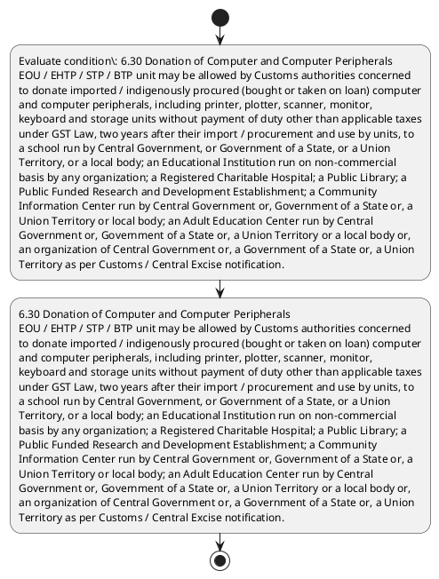

# Chapter 6 / Section 6.30: Donation of Computer and Computer Peripherals

**Chapter Title:** Export Oriented Units (EOUs), Electronics Hardware Technology Parks (EHTPs), Software Technology Parks (STPs) and Bio-Technology

**Pages:** 17

**Purpose:** 6.30 Donation of Computer and Computer Peripherals
EOU / EHTP / STP / BTP unit may be allowed by Customs authorities concerned
to donate imported / indigenously procured (bought or taken on loan) computer
and computer peripherals, including printer, plotter, scanner, monitor,
keyboard and storage units without payment of duty other than applicable taxes
under GST Law, two years after their import / procurement and use by units, to
a school run by Central Government, or Government of a State, or a Union
Territory, or a local body; an Educational Institution run on non-commercial
basis by any organization; a Registered Charitable Hospital; a Public Library; a
Public Funded Research and Development Establishment; a Community
Information Center run by Central Government or, Government of a State or, a
Union Territory or local body; an Adult Education Center run by Central
Government or, Government of a State or, a Union Territory or a local body or,
an organization of Central Government or, a Government of a State or, a Union
Territory as per Customs / Central Excise notification.

**Purpose Thanglish:** Indha Donation of Computer and Computer Peripherals section-la, 6.30 Donation of Computer and Computer Peripherals
EOU / EHTP / STP / BTP unit may be allowed by Customs authorities concerned
to donate imported / indigenously procured (bought or taken on loan) computer
and computer peripherals, including printer, plotter, scanner, monitor,
keyboard and storage units without payment of duty other than applicable taxes
under GST Law, two years after their import / procurement and use by units, to
a school run by Central Government, or Government of a State, or a Union
Territory, or a local body; an Educational Institution run on non-commercial
basis by any organization; a Registered Charitable Hospital; a Public Library; a
Public Funded Research and Development Establishment; a Community
Information Center run by Central Government or, Government of a State or, a
Union Territory or local body; an Adult Education Center run by Central
Government or, Government of a State or, a Union Territory or a local body or,
an organization of Central Government or, a Government of a State or, a Union
Territory as per Customs / Central Excise notification.

**Summary:** 6.30 Donation of Computer and Computer Peripherals
EOU / EHTP / STP / BTP unit may be allowed by Customs authorities concerned
to donate imported / indigenously procured (bought or taken on loan) computer
and computer peripherals, including printer, plotter, scanner, monitor,
keyboard and storage units without payment of duty other than applicable taxes
under GST Law, two years after their import / procurement and use by units, to
a school run by Central Government, or Government of a State, or a Union
Territory, or a local body; an Educational Institution run on non-commercial
basis by any organization; a Registered Charitable Hospital; a Public Library; a
Public Funded Research and Development Establishment; a Community
Information Center run by Central Government or, Government of a State or, a
Union Territory or local body; an Adult Education Center run by Central
Government or, Government of a State or, a Union Territory or a local body or,
an organization of Central Government or, a Government of a State or, a Union
Territory as per Customs / Central Excise notification.

**Business Meaning:** 6.30 Donation of Computer and Computer Peripherals
EOU / EHTP / STP / BTP unit may be allowed by Customs authorities concerned
to donate imported / indigenously procured (bought or taken on loan) computer
and computer peripherals, including printer, plotter, scanner, monitor,
keyboard and storage units without payment of duty other than applicable taxes
under GST Law, two years after their import / procurement and use by units, to
a school run by Central Government, or Government of a State, or a Union
Territory, or a local body; an Educational Institution run on non-commercial
basis by any organization; a Registered Charitable Hospital; a Public Library; a
Public Funded Research and Development Establishment; a Community
Information Center run by Central Government or, Government of a State or, a
Union Territory or local body; an Adult Education Center run by Central
Government or, Government of a State or, a Union Territory or a local body or,
an organization of Central Government or, a Government of a State or, a Union
Territory as per Customs / Central Excise notification.

**Business Explanation:** 6.30 Donation of Computer and Computer Peripherals
EOU / EHTP / STP / BTP unit may be allowed by Customs authorities concerned
to donate imported / indigenously procured (bought or taken on loan) computer
and computer peripherals, including printer, plotter, scanner, monitor,
keyboard and storage units without payment of duty other than applicable taxes
under GST Law, two years after their import / procurement and use by units, to
a school run by Central Government, or Government of a State, or a Union
Territory, or a local body; an Educational Institution run on non-commercial
basis by any organization; a Registered Charitable Hospital; a Public Library; a
Public Funded Research and Development Establishment; a Community
Information Center run by Central Government or, Government of a State or, a
Union Territory or local body; an Adult Education Center run by Central
Government or, Government of a State or, a Union Territory or a local body or,
an organization of Central Government or, a Government of a State or, a Union
Territory as per Customs / Central Excise notification.

**Business Explanation Thanglish:** Indha Donation of Computer and Computer Peripherals section-la, 6.30 Donation of Computer and Computer Peripherals
EOU / EHTP / STP / BTP unit may be allowed by Customs authorities concerned
to donate imported / indigenously procured (bought or taken on loan) computer
and computer peripherals, including printer, plotter, scanner, monitor,
keyboard and storage units without payment of duty other than applicable taxes
under GST Law, two years after their import / procurement and use by units, to
a school run by Central Government, or Government of a State, or a Union
Territory, or a local body; an Educational Institution run on non-commercial
basis by any organization; a Registered Charitable Hospital; a Public Library; a
Public Funded Research and Development Establishment; a Community
Information Center run by Central Government or, Government of a State or, a
Union Territory or local body; an Adult Education Center run by Central
Government or, Government of a State or, a Union Territory or a local body or,
an organization of Central Government or, a Government of a State or, a Union
Territory as per Customs / Central Excise notification.

## Business Logic
- None identified

## Business Rules
- rule_id=CH6-SEC6_30-R001, rule_description=IF validations pass THEN recommend action: 6.30 Donation of Computer and Computer Peripherals
EOU / EHTP / STP / BTP unit may be allowed by Customs authorities concerned
to donate imported / indigenously procured (bought or taken on loan) computer
and computer peripherals, including printer, plotter, scanner, monitor,
keyboard and storage units without payment of duty other than applicable taxes
under GST Law, two years after their import / procurement and use by units, to
a school run by Central Government, or Government of a State, or a Union
Territory, or a local body; an Educational Institution run on non-commercial
basis by any organization; a Registered Charitable Hospital; a Public Library; a
Public Funded Research and Development Establishment; a Community
Information Center run by Central Government or, Government of a State or, a
Union Territory or local body; an Adult Education Center run by Central
Government or, Government of a State or, a Union Territory or a local body or,
an organization of Central Government or, a Government of a State or, a Union
Territory as per Customs / Central Excise notification., trigger=Donation of Computer and Computer Peripherals, condition=6.30 Donation of Computer and Computer Peripherals
EOU / EHTP / STP / BTP unit may be allowed by Customs authorities concerned
to donate imported / indigenously procured (bought or taken on loan) computer
and computer peripherals, including printer, plotter, scanner, monitor,
keyboard and storage units without payment of duty other than applicable taxes
under GST Law, two years after their import / procurement and use by units, to
a school run by Central Government, or Government of a State, or a Union
Territory, or a local body; an Educational Institution run on non-commercial
basis by any organization; a Registered Charitable Hospital; a Public Library; a
Public Funded Research and Development Establishment; a Community
Information Center run by Central Government or, Government of a State or, a
Union Territory or local body; an Adult Education Center run by Central
Government or, Government of a State or, a Union Territory or a local body or,
an organization of Central Government or, a Government of a State or, a Union
Territory as per Customs / Central Excise notification., validation=Not explicitly covered in uploaded documents., action=6.30 Donation of Computer and Computer Peripherals
EOU / EHTP / STP / BTP unit may be allowed by Customs authorities concerned
to donate imported / indigenously procured (bought or taken on loan) computer
and computer peripherals, including printer, plotter, scanner, monitor,
keyboard and storage units without payment of duty other than applicable taxes
under GST Law, two years after their import / procurement and use by units, to
a school run by Central Government, or Government of a State, or a Union
Territory, or a local body; an Educational Institution run on non-commercial
basis by any organization; a Registered Charitable Hospital; a Public Library; a
Public Funded Research and Development Establishment; a Community
Information Center run by Central Government or, Government of a State or, a
Union Territory or local body; an Adult Education Center run by Central
Government or, Government of a State or, a Union Territory or a local body or,
an organization of Central Government or, a Government of a State or, a Union
Territory as per Customs / Central Excise notification., exception=No explicit exception found in uploaded documents., output=DEKAI should produce a compliance decision for 6.30 - Donation of Computer and Computer Peripherals.

## Conditions
- 6.30 Donation of Computer and Computer Peripherals
EOU / EHTP / STP / BTP unit may be allowed by Customs authorities concerned
to donate imported / indigenously procured (bought or taken on loan) computer
and computer peripherals, including printer, plotter, scanner, monitor,
keyboard and storage units without payment of duty other than applicable taxes
under GST Law, two years after their import / procurement and use by units, to
a school run by Central Government, or Government of a State, or a Union
Territory, or a local body; an Educational Institution run on non-commercial
basis by any organization; a Registered Charitable Hospital; a Public Library; a
Public Funded Research and Development Establishment; a Community
Information Center run by Central Government or, Government of a State or, a
Union Territory or local body; an Adult Education Center run by Central
Government or, Government of a State or, a Union Territory or a local body or,
an organization of Central Government or, a Government of a State or, a Union
Territory as per Customs / Central Excise notification.

## Condition Logic
- id=6.6.30.1, if=6.30 Donation of Computer and Computer Peripherals
EOU / EHTP / STP / BTP unit may be allowed by Customs authorities concerned
to donate imported / indigenously procured (bought or taken on loan) computer
and computer peripherals, including printer, plotter, scanner, monitor,
keyboard and storage units without payment of duty other than applicable taxes
under GST Law, two years after their import / procurement and use by units, to
a school run by Central Government, or Government of a State, or a Union
Territory, or a local body; an Educational Institution run on non-commercial
basis by any organization; a Registered Charitable Hospital; a Public Library; a
Public Funded Research and Development Establishment; a Community
Information Center run by Central Government or, Government of a State or, a
Union Territory or local body; an Adult Education Center run by Central
Government or, Government of a State or, a Union Territory or a local body or,
an organization of Central Government or, a Government of a State or, a Union
Territory as per Customs / Central Excise notification., then=6.30 Donation of Computer and Computer Peripherals
EOU / EHTP / STP / BTP unit may be allowed by Customs authorities concerned
to donate imported / indigenously procured (bought or taken on loan) computer
and computer peripherals, including printer, plotter, scanner, monitor,
keyboard and storage units without payment of duty other than applicable taxes
under GST Law, two years after their import / procurement and use by units, to
a school run by Central Government, or Government of a State, or a Union
Territory, or a local body; an Educational Institution run on non-commercial
basis by any organization; a Registered Charitable Hospital; a Public Library; a
Public Funded Research and Development Establishment; a Community
Information Center run by Central Government or, Government of a State or, a
Union Territory or local body; an Adult Education Center run by Central
Government or, Government of a State or, a Union Territory or a local body or,
an organization of Central Government or, a Government of a State or, a Union
Territory as per Customs / Central Excise notification., source=6.30 Donation of Computer and Computer Peripherals
EOU / EHTP / STP / BTP unit may be allowed by Customs authorities concerned
to donate imported / indigenously procured (bought or taken on loan) computer
and computer peripherals, including printer, plotter, scanner, monitor,
keyboard and storage units without payment of duty other than applicable taxes
under GST Law, two years after their import / procurement and use by units, to
a school run by Central Government, or Government of a State, or a Union
Territory, or a local body; an Educational Institution run on non-commercial
basis by any organization; a Registered Charitable Hospital; a Public Library; a
Public Funded Research and Development Establishment; a Community
Information Center run by Central Government or, Government of a State or, a
Union Territory or local body; an Adult Education Center run by Central
Government or, Government of a State or, a Union Territory or a local body or,
an organization of Central Government or, a Government of a State or, a Union
Territory as per Customs / Central Excise notification.

## Validations
- None identified

## Exceptions
- None identified

## Dependencies
- None identified

## Authorities
- Customs
- Central Government
- EOU / EHTP / STP / BTP unit may be allowed by Customs
- Information Center run by Central Government
- Territory as per Customs

## Required Documents
- None identified

## Timelines
- 6.30 Donation of Computer and Computer Peripherals
EOU / EHTP / STP / BTP unit may be allowed by Customs authorities concerned
to donate imported / indigenously procured (bought or taken on loan) computer
and computer peripherals, including printer, plotter, scanner, monitor,
keyboard and storage units without payment of duty other than applicable taxes
under GST Law, two years after their import / procurement and use by units, to
a school run by Central Government, or Government of a State, or a Union
Territory, or a local body; an Educational Institution run on non-commercial
basis by any organization; a Registered Charitable Hospital; a Public Library; a
Public Funded Research and Development Establishment; a Community
Information Center run by Central Government or, Government of a State or, a
Union Territory or local body; an Adult Education Center run by Central
Government or, Government of a State or, a Union Territory or a local body or,
an organization of Central Government or, a Government of a State or, a Union
Territory as per Customs / Central Excise notification.

## Actions
- 6.30 Donation of Computer and Computer Peripherals
EOU / EHTP / STP / BTP unit may be allowed by Customs authorities concerned
to donate imported / indigenously procured (bought or taken on loan) computer
and computer peripherals, including printer, plotter, scanner, monitor,
keyboard and storage units without payment of duty other than applicable taxes
under GST Law, two years after their import / procurement and use by units, to
a school run by Central Government, or Government of a State, or a Union
Territory, or a local body; an Educational Institution run on non-commercial
basis by any organization; a Registered Charitable Hospital; a Public Library; a
Public Funded Research and Development Establishment; a Community
Information Center run by Central Government or, Government of a State or, a
Union Territory or local body; an Adult Education Center run by Central
Government or, Government of a State or, a Union Territory or a local body or,
an organization of Central Government or, a Government of a State or, a Union
Territory as per Customs / Central Excise notification.

## Workflow
- Evaluate condition: 6.30 Donation of Computer and Computer Peripherals
EOU / EHTP / STP / BTP unit may be allowed by Customs authorities concerned
to donate imported / indigenously procured (bought or taken on loan) computer
and computer peripherals, including printer, plotter, scanner, monitor,
keyboard and storage units without payment of duty other than applicable taxes
under GST Law, two years after their import / procurement and use by units, to
a school run by Central Government, or Government of a State, or a Union
Territory, or a local body; an Educational Institution run on non-commercial
basis by any organization; a Registered Charitable Hospital; a Public Library; a
Public Funded Research and Development Establishment; a Community
Information Center run by Central Government or, Government of a State or, a
Union Territory or local body; an Adult Education Center run by Central
Government or, Government of a State or, a Union Territory or a local body or,
an organization of Central Government or, a Government of a State or, a Union
Territory as per Customs / Central Excise notification.
- 6.30 Donation of Computer and Computer Peripherals
EOU / EHTP / STP / BTP unit may be allowed by Customs authorities concerned
to donate imported / indigenously procured (bought or taken on loan) computer
and computer peripherals, including printer, plotter, scanner, monitor,
keyboard and storage units without payment of duty other than applicable taxes
under GST Law, two years after their import / procurement and use by units, to
a school run by Central Government, or Government of a State, or a Union
Territory, or a local body; an Educational Institution run on non-commercial
basis by any organization; a Registered Charitable Hospital; a Public Library; a
Public Funded Research and Development Establishment; a Community
Information Center run by Central Government or, Government of a State or, a
Union Territory or local body; an Adult Education Center run by Central
Government or, Government of a State or, a Union Territory or a local body or,
an organization of Central Government or, a Government of a State or, a Union
Territory as per Customs / Central Excise notification.

## Workflow ASCII
```text
Donation of Computer and Computer Peripherals
Evaluate condition: 6.30 Donation of Computer and Computer Peripherals
EOU / EHTP / STP / BTP unit may be allowed by Customs authorities concerned
to donate imported / indigenously procured (bought or taken on loan) computer
and computer peripherals, including printer, plotter, scanner, monitor,
keyboard and storage units without payment of duty other than applicable taxes
under GST Law, two years after their import / procurement and use by units, to
a school run by Central Government, or Government of a State, or a Union
Territory, or a local body; an Educational Institution run on non-commercial
basis by any organization; a Registered Charitable Hospital; a Public Library; a
Public Funded Research and Development Establishment; a Community
Information Center run by Central Government or, Government of a State or, a
Union Territory or local body; an Adult Education Center run by Central
Government or, Government of a State or, a Union Territory or a local body or,
an organization of Central Government or, a Government of a State or, a Union
Territory as per Customs / Central Excise notification.
   |
   v
6.30 Donation of Computer and Computer Peripherals
EOU / EHTP / STP / BTP unit may be allowed by Customs authorities concerned
to donate imported / indigenously procured (bought or taken on loan) computer
and computer peripherals, including printer, plotter, scanner, monitor,
keyboard and storage units without payment of duty other than applicable taxes
under GST Law, two years after their import / procurement and use by units, to
a school run by Central Government, or Government of a State, or a Union
Territory, or a local body; an Educational Institution run on non-commercial
basis by any organization; a Registered Charitable Hospital; a Public Library; a
Public Funded Research and Development Establishment; a Community
Information Center run by Central Government or, Government of a State or, a
Union Territory or local body; an Adult Education Center run by Central
Government or, Government of a State or, a Union Territory or a local body or,
an organization of Central Government or, a Government of a State or, a Union
Territory as per Customs / Central Excise notification.
```

## Decision Tree
- IF 6.30 Donation of Computer and Computer Peripherals
EOU / EHTP / STP / BTP unit may be allowed by Customs authorities concerned
to donate imported / indigenously procured (bought or taken on loan) computer
and computer peripherals, including printer, plotter, scanner, monitor,
keyboard and storage units without payment of duty other than applicable taxes
under GST Law, two years after their import / procurement and use by units, to
a school run by Central Government, or Government of a State, or a Union
Territory, or a local body; an Educational Institution run on non-commercial
basis by any organization; a Registered Charitable Hospital; a Public Library; a
Public Funded Research and Development Establishment; a Community
Information Center run by Central Government or, Government of a State or, a
Union Territory or local body; an Adult Education Center run by Central
Government or, Government of a State or, a Union Territory or a local body or,
an organization of Central Government or, a Government of a State or, a Union
Territory as per Customs / Central Excise notification. THEN 6.30 Donation of Computer and Computer Peripherals
EOU / EHTP / STP / BTP unit may be allowed by Customs authorities concerned
to donate imported / indigenously procured (bought or taken on loan) computer
and computer peripherals, including printer, plotter, scanner, monitor,
keyboard and storage units without payment of duty other than applicable taxes
under GST Law, two years after their import / procurement and use by units, to
a school run by Central Government, or Government of a State, or a Union
Territory, or a local body; an Educational Institution run on non-commercial
basis by any organization; a Registered Charitable Hospital; a Public Library; a
Public Funded Research and Development Establishment; a Community
Information Center run by Central Government or, Government of a State or, a
Union Territory or local body; an Adult Education Center run by Central
Government or, Government of a State or, a Union Territory or a local body or,
an organization of Central Government or, a Government of a State or, a Union
Territory as per Customs / Central Excise notification.

## Decision Tree ASCII
```text
Donation of Computer and Computer Peripherals Decision
IF 6.30 Donation of Computer and Computer Peripherals
EOU / EHTP / STP / BTP unit may be allowed by Customs authorities concerned
to donate imported / indigenously procured (bought or taken on loan) computer
and computer peripherals, including printer, plotter, scanner, monitor,
keyboard and storage units without payment of duty other than applicable taxes
under GST Law, two years after their import / procurement and use by units, to
a school run by Central Government, or Government of a State, or a Union
Territory, or a local body; an Educational Institution run on non-commercial
basis by any organization; a Registered Charitable Hospital; a Public Library; a
Public Funded Research and Development Establishment; a Community
Information Center run by Central Government or, Government of a State or, a
Union Territory or local body; an Adult Education Center run by Central
Government or, Government of a State or, a Union Territory or a local body or,
an organization of Central Government or, a Government of a State or, a Union
Territory as per Customs / Central Excise notification. THEN 6.30 Donation of Computer and Computer Peripherals
EOU / EHTP / STP / BTP unit may be allowed by Customs authorities concerned
to donate imported / indigenously procured (bought or taken on loan) computer
and computer peripherals, including printer, plotter, scanner, monitor,
keyboard and storage units without payment of duty other than applicable taxes
under GST Law, two years after their import / procurement and use by units, to
a school run by Central Government, or Government of a State, or a Union
Territory, or a local body; an Educational Institution run on non-commercial
basis by any organization; a Registered Charitable Hospital; a Public Library; a
Public Funded Research and Development Establishment; a Community
Information Center run by Central Government or, Government of a State or, a
Union Territory or local body; an Adult Education Center run by Central
Government or, Government of a State or, a Union Territory or a local body or,
an organization of Central Government or, a Government of a State or, a Union
Territory as per Customs / Central Excise notification.
```

## Examples
- User asks to process Donation of Computer and Computer Peripherals; the platform checks conditions, validations, and documents before action.

**Real-world Example:** Example: an importer or exporter invokes Donation of Computer and Computer Peripherals, submits the prescribed DGFT records, and DEKAI uses the extracted rules to 6.30 donation of computer and computer peripherals
eou / ehtp / stp / btp unit may be allowed by customs authorities concerned
to donate imported / indigenously procured (bought or taken on loan) computer
and computer peripherals, including printer, plotter, scanner, monitor,
keyboard and storage units without payment of duty other than applicable taxes
under gst law, two years after their import / procurement and use by units, to
a school run by central government, or government of a state, or a union
territory, or a local body; an educational institution run on non-commercial
basis by any organization; a registered charitable hospital; a public library; a
public funded research and development establishment; a community
information center run by central government or, government of a state or, a
union territory or local body; an adult education center run by central
government or, government of a state or, a union territory or a local body or,
an organization of central government or, a government of a state or, a union
territory as per customs / central excise notification..

**Real-world Example Thanglish:** Indha Donation of Computer and Computer Peripherals section-la, Example: an importer or exporter invokes Donation of Computer and Computer Peripherals, submits the prescribed DGFT records, and DEKAI uses the extracted rules to 6.30 donation of computer and computer peripherals
eou / ehtp / stp / btp unit may be allowed by customs authorities concerned
to donate imported / indigenously procured (bought or taken on loan) computer
and computer peripherals, including printer, plotter, scanner, monitor,
keyboard and storage units without payment of duty other than applicable taxes
under gst law, two years after their import / procurement and use by units, to
a school run by central government, or government of a state, or a union
territory, or a local body; an educational institution run on non-commercial
basis by any organization; a registered charitable hospital; a public library; a
public funded research and development establishment; a community
information center run by central government or, government of a state or, a
union territory or local body; an adult education center run by central
government or, government of a state or, a union territory or a local body or,
an organization of central government or, a government of a state or, a union
territory as per customs / central excise notification..

## AI Rules
- IF validations pass THEN recommend action: 6.30 Donation of Computer and Computer Peripherals
EOU / EHTP / STP / BTP unit may be allowed by Customs authorities concerned
to donate imported / indigenously procured (bought or taken on loan) computer
and computer peripherals, including printer, plotter, scanner, monitor,
keyboard and storage units without payment of duty other than applicable taxes
under GST Law, two years after their import / procurement and use by units, to
a school run by Central Government, or Government of a State, or a Union
Territory, or a local body; an Educational Institution run on non-commercial
basis by any organization; a Registered Charitable Hospital; a Public Library; a
Public Funded Research and Development Establishment; a Community
Information Center run by Central Government or, Government of a State or, a
Union Territory or local body; an Adult Education Center run by Central
Government or, Government of a State or, a Union Territory or a local body or,
an organization of Central Government or, a Government of a State or, a Union
Territory as per Customs / Central Excise notification.

## Database Fields
- name=section_code, type=string, required=True, source=parsed_section_heading
- name=section_title, type=string, required=True, source=parsed_section_heading
- name=and_flag, type=boolean, required=False, source=keyword:and
- name=eou_flag, type=boolean, required=False, source=keyword:EOU
- name=stp_flag, type=boolean, required=False, source=keyword:STP
- name=btp_flag, type=boolean, required=False, source=keyword:BTP
- name=may_flag, type=boolean, required=False, source=keyword:may
- name=gst_flag, type=boolean, required=False, source=keyword:GST
- name=law_flag, type=boolean, required=False, source=keyword:Law
- name=two_flag, type=boolean, required=False, source=keyword:two

## API Requirements
- method=GET, path=/api/dgft/sections/6.30, purpose=Retrieve knowledge payload for section 6.30, query_params=['include=workflow,decision_tree,validations'], response_fields=['section', 'title', 'summary', 'conditions', 'validations', 'exceptions', 'workflow', 'decision_tree']
- method=POST, path=/api/dgft/Donation-of-Computer-and-Computer-Peripherals/validate, purpose=Validate inputs and documents for Donation of Computer and Computer Peripherals, request_fields=['section_code', 'section_title'], response_fields=['status', 'errors', 'warnings', 'next_actions']
- method=POST, path=/api/dgft/Donation-of-Computer-and-Computer-Peripherals/execute, purpose=Trigger business action for 6.30 Donation of Computer and Computer Peripherals
EOU / EHTP / STP / BTP unit may be allowed by Customs authorities concerned
to donate imported / indigenously procured (bought or taken on loan) computer
and computer peripherals, including printer, plotter, scanner, monitor,
keyboard and storage units without payment of duty other than applicable taxes
under GST Law, two years after their import / procurement and use by units, to
a school run by Central Government, or Government of a State, or a Union
Territory, or a local body; an Educational Institution run on non-commercial
basis by any organization; a Registered Charitable Hospital; a Public Library; a
Public Funded Research and Development Establishment; a Community
Information Center run by Central Government or, Government of a State or, a
Union Territory or local body; an Adult Education Center run by Central
Government or, Government of a State or, a Union Territory or a local body or,
an organization of Central Government or, a Government of a State or, a Union
Territory as per Customs / Central Excise notification., request_fields=['section_code', 'section_title'], response_fields=['reference_id', 'status', 'authority', 'timeline']

## UI Screens
- screen_id=Donation_of_Computer_and_Computer_Peripherals_overview, name=Donation of Computer and Computer Peripherals Overview, purpose=Show section summary, authority, timeline, and eligibility cues., widgets=['summary_card', 'conditions_table', 'authority_badges', 'timeline_panel']
- screen_id=Donation_of_Computer_and_Computer_Peripherals_submission, name=Donation of Computer and Computer Peripherals Submission, purpose=Capture applicant data and supporting documents., widgets=['dynamic_form', 'document_uploader', 'validation_panel', 'next_action_footer'], fields=['section_code', 'section_title', 'and_flag', 'eou_flag', 'stp_flag', 'btp_flag', 'may_flag', 'gst_flag']

## Error Messages
- Validation failed because the section requirements were not fully met.

## FAQ
- question_en=What is the purpose of section 6.30?, answer_en=6.30 Donation of Computer and Computer Peripherals
EOU / EHTP / STP / BTP unit may be allowed by Customs authorities concerned
to donate imported / indigenously procured (bought or taken on loan) computer
and computer peripherals, including printer, plotter, scanner, monitor,
keyboard and storage units without payment of duty other than applicable taxes
under GST Law, two years after their import / procurement and use by units, to
a school run by Central Government, or Government of a State, or a Union
Territory, or a local body; an Educational Institution run on non-commercial
basis by any organization; a Registered Charitable Hospital; a Public Library; a
Public Funded Research and Development Establishment; a Community
Information Center run by Central Government or, Government of a State or, a
Union Territory or local body; an Adult Education Center run by Central
Government or, Government of a State or, a Union Territory or a local body or,
an organization of Central Government or, a Government of a State or, a Union
Territory as per Customs / Central Excise notification., question_thanglish=Indha Donation of Computer and Computer Peripherals section-la, What is the purpose of section 6.30?, answer_thanglish=Indha Donation of Computer and Computer Peripherals section-la, 6.30 Donation of Computer and Computer Peripherals
EOU / EHTP / STP / BTP unit may be allowed by Customs authorities concerned
to donate imported / indigenously procured (bought or taken on loan) computer
and computer peripherals, including printer, plotter, scanner, monitor,
keyboard and storage units without payment of duty other than applicable taxes
under GST Law, two years after their import / procurement and use by units, to
a school run by Central Government, or Government of a State, or a Union
Territory, or a local body; an Educational Institution run on non-commercial
basis by any organization; a Registered Charitable Hospital; a Public Library; a
Public Funded Research and Development Establishment; a Community
Information Center run by Central Government or, Government of a State or, a
Union Territory or local body; an Adult Education Center run by Central
Government or, Government of a State or, a Union Territory or a local body or,
an organization of Central Government or, a Government of a State or, a Union
Territory as per Customs / Central Excise notification.
- question_en=What documents are required under Donation of Computer and Computer Peripherals?, answer_en=Not explicitly covered in uploaded documents., question_thanglish=Indha Donation of Computer and Computer Peripherals section-la, What documents are required under Donation of Computer and Computer Peripherals?, answer_thanglish=Indha Donation of Computer and Computer Peripherals section-la, Not explicitly covered in uploaded documents.
- question_en=Which authority handles Donation of Computer and Computer Peripherals?, answer_en=Customs, Central Government, EOU / EHTP / STP / BTP unit may be allowed by Customs, Information Center run by Central Government, Territory as per Customs, question_thanglish=Indha Donation of Computer and Computer Peripherals section-la, Which authority handles Donation of Computer and Computer Peripherals?, answer_thanglish=Indha Donation of Computer and Computer Peripherals section-la, Customs, Central Government, EOU / EHTP / STP / BTP unit may be allowed by Customs, Information Center run by Central Government, Territory as per Customs

## Questions Users May Ask
- What does Donation of Computer and Computer Peripherals require?
- Which documents are needed for Donation of Computer and Computer Peripherals?
- How does DEKAI validate Donation of Computer and Computer Peripherals requests?
- What action should be taken for Donation of Computer and Computer Peripherals?

## Expected AI Answers
- Donation of Computer and Computer Peripherals requires the platform to interpret the section text, apply the extracted business rules, and present the correct next action.
- Required documents are inferred from the section text: no explicit documents were detected.
- DEKAI validates Donation of Computer and Computer Peripherals by checking conditions, required documents, authority references, and exception clauses before recommending an outcome.
- The primary extracted action is: 6.30 Donation of Computer and Computer Peripherals
EOU / EHTP / STP / BTP unit may be allowed by Customs authorities concerned
to donate imported / indigenously procured (bought or taken on loan) computer
and computer peripherals, including printer, plotter, scanner, monitor,
keyboard and storage units without payment of duty other than applicable taxes
under GST Law, two years after their import / procurement and use by units, to
a school run by Central Government, or Government of a State, or a Union
Territory, or a local body; an Educational Institution run on non-commercial
basis by any organization; a Registered Charitable Hospital; a Public Library; a
Public Funded Research and Development Establishment; a Community
Information Center run by Central Government or, Government of a State or, a
Union Territory or local body; an Adult Education Center run by Central
Government or, Government of a State or, a Union Territory or a local body or,
an organization of Central Government or, a Government of a State or, a Union
Territory as per Customs / Central Excise notification.

## AI Q&A Examples
- question_en=User asks: How do I comply with Donation of Computer and Computer Peripherals?, answer_en=AI answers: DEKAI should evaluate section 6.30, apply the extracted rules, and guide the user through Evaluate condition: 6.30 Donation of Computer and Computer Peripherals
EOU / EHTP / STP / BTP unit may be allowed by Customs authorities concerned
to donate imported / indigenously procured (bought or taken on loan) computer
and computer peripherals, including printer, plotter, scanner, monitor,
keyboard and storage units without payment of duty other than applicable taxes
under GST Law, two years after their import / procurement and use by units, to
a school run by Central Government, or Government of a State, or a Union
Territory, or a local body; an Educational Institution run on non-commercial
basis by any organization; a Registered Charitable Hospital; a Public Library; a
Public Funded Research and Development Establishment; a Community
Information Center run by Central Government or, Government of a State or, a
Union Territory or local body; an Adult Education Center run by Central
Government or, Government of a State or, a Union Territory or a local body or,
an organization of Central Government or, a Government of a State or, a Union
Territory as per Customs / Central Excise notification.., question_thanglish=Indha Donation of Computer and Computer Peripherals section-la, User asks: How do I comply with Donation of Computer and Computer Peripherals?, answer_thanglish=Indha Donation of Computer and Computer Peripherals section-la, AI answers: DEKAI should evaluate section 6.30, apply the extracted rules, and guide the user through Evaluate condition: 6.30 Donation of Computer and Computer Peripherals
EOU / EHTP / STP / BTP unit may be allowed by Customs authorities concerned
to donate imported / indigenously procured (bought or taken on loan) computer
and computer peripherals, including printer, plotter, scanner, monitor,
keyboard and storage units without payment of duty other than applicable taxes
under GST Law, two years after their import / procurement and use by units, to
a school run by Central Government, or Government of a State, or a Union
Territory, or a local body; an Educational Institution run on non-commercial
basis by any organization; a Registered Charitable Hospital; a Public Library; a
Public Funded Research and Development Establishment; a Community
Information Center run by Central Government or, Government of a State or, a
Union Territory or local body; an Adult Education Center run by Central
Government or, Government of a State or, a Union Territory or a local body or,
an organization of Central Government or, a Government of a State or, a Union
Territory as per Customs / Central Excise notification..
- question_en=User asks: Which validations apply to Donation of Computer and Computer Peripherals?, answer_en=AI answers: Applicable validations are not explicitly covered in the uploaded documents., question_thanglish=Indha Donation of Computer and Computer Peripherals section-la, User asks: Which validations apply to Donation of Computer and Computer Peripherals?, answer_thanglish=Indha Donation of Computer and Computer Peripherals section-la, AI answers: Applicable validations are not explicitly covered in the uploaded documents.

## DEKAI AI Implementation Notes
- Capture chapter 6, section 6.30, title, and page references as immutable knowledge metadata.
- Bind validations for Donation of Computer and Computer Peripherals into a rule engine keyed by the rule IDs extracted for this section.
- Route escalations or approvals to: Customs, Central Government, EOU / EHTP / STP / BTP unit may be allowed by Customs, Information Center run by Central Government.

## DEKAI AI Implementation Notes Thanglish
- Indha Donation of Computer and Computer Peripherals section-la, Capture chapter 6, section 6.30, title, and page references as immutable knowledge metadata.
- Indha Donation of Computer and Computer Peripherals section-la, Bind validations for Donation of Computer and Computer Peripherals into a rule engine keyed by the rule IDs extracted for this section.
- Indha Donation of Computer and Computer Peripherals section-la, Route escalations or approvals to: Customs, Central Government, EOU / EHTP / STP / BTP unit may be allowed by Customs, Information Center run by Central Government.

## AI Metadata
- Keywords: and, EOU, STP, BTP, may, GST, Law, two, use, run, any, per, EHTP, unit, loan, duty, than, body, taken, units
- Search Keywords: and, EOU, STP, BTP, may, GST, Law, two, use, run, any, per, EHTP, unit, loan, duty, than, body, taken, units
- Intent: Support Donation of Computer and Computer Peripherals processing and compliance validation.
- Tags: 6.30, Donation of Computer and Computer Peripherals, dgft
- Related Sections: 
- Related Chapters: 
- Related Rules: 

## Mermaid

```mermaid
flowchart TD
    S1["Evaluate condition: 6.30 Donation of Computer and Computer Peripherals
EOU / EHTP / STP / BTP unit may be allowed by Customs authorities concerned
to donate imported / indigenously procured (bought or taken on loan) computer
and computer peripherals, including printer, plotter, scanner, monitor,
keyboard and storage units without payment of duty other than applicable taxes
under GST Law, two years after their import / procurement and use by units, to
a school run by Central Government, or Government of a State, or a Union
Territory, or a local body; an Educational Institution run on non-commercial
basis by any organization; a Registered Charitable Hospital; a Public Library; a
Public Funded Research and Development Establishment; a Community
Information Center run by Central Government or, Government of a State or, a
Union Territory or local body; an Adult Education Center run by Central
Government or, Government of a State or, a Union Territory or a local body or,
an organization of Central Government or, a Government of a State or, a Union
Territory as per Customs / Central Excise notification."]
    S2["6.30 Donation of Computer and Computer Peripherals
EOU / EHTP / STP / BTP unit may be allowed by Customs authorities concerned
to donate imported / indigenously procured (bought or taken on loan) computer
and computer peripherals, including printer, plotter, scanner, monitor,
keyboard and storage units without payment of duty other than applicable taxes
under GST Law, two years after their import / procurement and use by units, to
a school run by Central Government, or Government of a State, or a Union
Territory, or a local body; an Educational Institution run on non-commercial
basis by any organization; a Registered Charitable Hospital; a Public Library; a
Public Funded Research and Development Establishment; a Community
Information Center run by Central Government or, Government of a State or, a
Union Territory or local body; an Adult Education Center run by Central
Government or, Government of a State or, a Union Territory or a local body or,
an organization of Central Government or, a Government of a State or, a Union
Territory as per Customs / Central Excise notification."]
    S1 --> S2
```


## PlantUML

