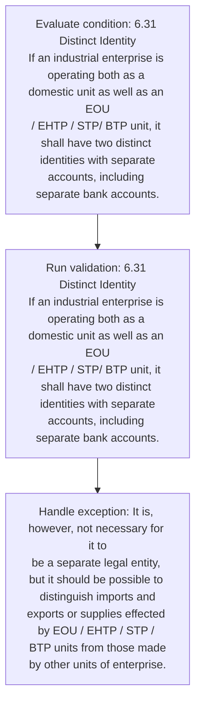
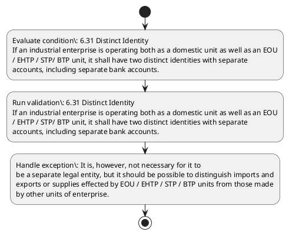

# Chapter 6 / Section 6.31: Distinct Identity

**Chapter Title:** Export Oriented Units (EOUs), Electronics Hardware Technology Parks (EHTPs), Software Technology Parks (STPs) and Bio-Technology

**Pages:** 17

**Purpose:** 6.31 Distinct Identity
If an industrial enterprise is operating both as a domestic unit as well as an EOU
/ EHTP / STP/ BTP unit, it shall have two distinct identities with separate
accounts, including separate bank accounts.

**Purpose Thanglish:** Indha Distinct Identity section-la, 6.31 Distinct Identity
If an industrial enterprise is operating both as a domestic unit as well as an EOU
/ EHTP / STP/ BTP unit, it kandippa have two distinct identities with separate
accounts, including separate bank accounts.

**Summary:** 6.31 Distinct Identity
If an industrial enterprise is operating both as a domestic unit as well as an EOU
/ EHTP / STP/ BTP unit, it shall have two distinct identities with separate
accounts, including separate bank accounts. It is, however, not necessary for it to
be a separate legal entity, but it should be possible to distinguish imports and
exports or supplies effected by EOU / EHTP / STP / BTP units from those made
by other units of enterprise.

**Business Meaning:** Distinct Identity governs how DGFT business controls should be applied, validated, and enforced.

**Business Explanation:** Distinct Identity explains the operating rule set that DEKAI should enforce. Key control points include 6.31 Distinct Identity
If an industrial enterprise is operating both as a domestic unit as well as an EOU
/ EHTP / STP/ BTP unit, it shall have two distinct identities with separate
accounts, including separate bank accounts.

**Business Explanation Thanglish:** Indha Distinct Identity section-la, Distinct Identity explains the operating rule set that DEKAI should enforce. Key control points include 6.31 Distinct Identity
If an industrial enterprise is operating both as a domestic unit as well as an EOU
/ EHTP / STP/ BTP unit, it kandippa have two distinct identities with separate
accounts, including separate bank accounts.

## Business Logic
- 6.31 Distinct Identity
If an industrial enterprise is operating both as a domestic unit as well as an EOU
/ EHTP / STP/ BTP unit, it shall have two distinct identities with separate
accounts, including separate bank accounts.
- It is, however, not necessary for it to
be a separate legal entity, but it should be possible to distinguish imports and
exports or supplies effected by EOU / EHTP / STP / BTP units from those made
by other units of enterprise.

## Business Rules
- rule_id=CH6-SEC6_31-R001, rule_description=6.31 Distinct Identity
If an industrial enterprise is operating both as a domestic unit as well as an EOU
/ EHTP / STP/ BTP unit, it shall have two distinct identities with separate
accounts, including separate bank accounts., trigger=Distinct Identity, condition=6.31 Distinct Identity
If an industrial enterprise is operating both as a domestic unit as well as an EOU
/ EHTP / STP/ BTP unit, it shall have two distinct identities with separate
accounts, including separate bank accounts., validation=6.31 Distinct Identity
If an industrial enterprise is operating both as a domestic unit as well as an EOU
/ EHTP / STP/ BTP unit, it shall have two distinct identities with separate
accounts, including separate bank accounts., action=Manual review required., exception=It is, however, not necessary for it to
be a separate legal entity, but it should be possible to distinguish imports and
exports or supplies effected by EOU / EHTP / STP / BTP units from those made
by other units of enterprise., output=DEKAI should produce a compliance decision for 6.31 - Distinct Identity.
- rule_id=CH6-SEC6_31-R002, rule_description=It is, however, not necessary for it to
be a separate legal entity, but it should be possible to distinguish imports and
exports or supplies effected by EOU / EHTP / STP / BTP units from those made
by other units of enterprise., trigger=Distinct Identity, condition=6.31 Distinct Identity
If an industrial enterprise is operating both as a domestic unit as well as an EOU
/ EHTP / STP/ BTP unit, it shall have two distinct identities with separate
accounts, including separate bank accounts., validation=6.31 Distinct Identity
If an industrial enterprise is operating both as a domestic unit as well as an EOU
/ EHTP / STP/ BTP unit, it shall have two distinct identities with separate
accounts, including separate bank accounts., action=Manual review required., exception=It is, however, not necessary for it to
be a separate legal entity, but it should be possible to distinguish imports and
exports or supplies effected by EOU / EHTP / STP / BTP units from those made
by other units of enterprise., output=DEKAI should produce a compliance decision for 6.31 - Distinct Identity.

## Conditions
- 6.31 Distinct Identity
If an industrial enterprise is operating both as a domestic unit as well as an EOU
/ EHTP / STP/ BTP unit, it shall have two distinct identities with separate
accounts, including separate bank accounts.

## Condition Logic
- id=6.6.31.1, if=6.31 Distinct Identity
If an industrial enterprise is operating both as a domestic unit as well as an EOU
/ EHTP / STP/ BTP unit, it shall have two distinct identities with separate
accounts, including separate bank accounts., then=Route for review, source=6.31 Distinct Identity
If an industrial enterprise is operating both as a domestic unit as well as an EOU
/ EHTP / STP/ BTP unit, it shall have two distinct identities with separate
accounts, including separate bank accounts.

## Validations
- 6.31 Distinct Identity
If an industrial enterprise is operating both as a domestic unit as well as an EOU
/ EHTP / STP/ BTP unit, it shall have two distinct identities with separate
accounts, including separate bank accounts.

## Exceptions
- It is, however, not necessary for it to
be a separate legal entity, but it should be possible to distinguish imports and
exports or supplies effected by EOU / EHTP / STP / BTP units from those made
by other units of enterprise.

## Dependencies
- None identified

## Authorities
- None identified

## Required Documents
- None identified

## Timelines
- None identified

## Actions
- None identified

## Workflow
- Evaluate condition: 6.31 Distinct Identity
If an industrial enterprise is operating both as a domestic unit as well as an EOU
/ EHTP / STP/ BTP unit, it shall have two distinct identities with separate
accounts, including separate bank accounts.
- Run validation: 6.31 Distinct Identity
If an industrial enterprise is operating both as a domestic unit as well as an EOU
/ EHTP / STP/ BTP unit, it shall have two distinct identities with separate
accounts, including separate bank accounts.
- Handle exception: It is, however, not necessary for it to
be a separate legal entity, but it should be possible to distinguish imports and
exports or supplies effected by EOU / EHTP / STP / BTP units from those made
by other units of enterprise.

## Workflow ASCII
```text
Distinct Identity
Evaluate condition: 6.31 Distinct Identity
If an industrial enterprise is operating both as a domestic unit as well as an EOU
/ EHTP / STP/ BTP unit, it shall have two distinct identities with separate
accounts, including separate bank accounts.
   |
   v
Run validation: 6.31 Distinct Identity
If an industrial enterprise is operating both as a domestic unit as well as an EOU
/ EHTP / STP/ BTP unit, it shall have two distinct identities with separate
accounts, including separate bank accounts.
   |
   v
Handle exception: It is, however, not necessary for it to
be a separate legal entity, but it should be possible to distinguish imports and
exports or supplies effected by EOU / EHTP / STP / BTP units from those made
by other units of enterprise.
```

## Decision Tree
- IF exception applies (It is, however, not necessary for it to
be a separate legal entity, but it should be possible to distinguish imports and
exports or supplies effected by EOU / EHTP / STP / BTP units from those made
by other units of enterprise.) THEN route to manual review

## Decision Tree ASCII
```text
Distinct Identity Decision
IF exception applies (It is, however, not necessary for it to
be a separate legal entity, but it should be possible to distinguish imports and
exports or supplies effected by EOU / EHTP / STP / BTP units from those made
by other units of enterprise.) THEN route to manual review
```

## Examples
- User asks to process Distinct Identity; the platform checks conditions, validations, and documents before action.

**Real-world Example:** Example: an importer or exporter invokes Distinct Identity, submits the prescribed DGFT records, and DEKAI uses the extracted rules to follow the distinct identity process.

**Real-world Example Thanglish:** Indha Distinct Identity section-la, Example: an importer or exporter invokes Distinct Identity, submits the prescribed DGFT records, and DEKAI uses the extracted rules to follow the distinct identity process.

## AI Rules
- IF detected context matches section rule THEN enforce: 6.31 Distinct Identity
If an industrial enterprise is operating both as a domestic unit as well as an EOU
/ EHTP / STP/ BTP unit, it shall have two distinct identities with separate
accounts, including separate bank accounts.
- IF detected context matches section rule THEN enforce: It is, however, not necessary for it to
be a separate legal entity, but it should be possible to distinguish imports and
exports or supplies effected by EOU / EHTP / STP / BTP units from those made
by other units of enterprise.

## Database Fields
- name=section_code, type=string, required=True, source=parsed_section_heading
- name=section_title, type=string, required=True, source=parsed_section_heading
- name=eou_flag, type=boolean, required=False, source=keyword:EOU
- name=stp_flag, type=boolean, required=False, source=keyword:STP
- name=btp_flag, type=boolean, required=False, source=keyword:BTP
- name=two_flag, type=boolean, required=False, source=keyword:two
- name=not_flag, type=boolean, required=False, source=keyword:not
- name=for_flag, type=boolean, required=False, source=keyword:for
- name=but_flag, type=boolean, required=False, source=keyword:but
- name=and_flag, type=boolean, required=False, source=keyword:and

## API Requirements
- method=GET, path=/api/dgft/sections/6.31, purpose=Retrieve knowledge payload for section 6.31, query_params=['include=workflow,decision_tree,validations'], response_fields=['section', 'title', 'summary', 'conditions', 'validations', 'exceptions', 'workflow', 'decision_tree']
- method=POST, path=/api/dgft/Distinct-Identity/validate, purpose=Validate inputs and documents for Distinct Identity, request_fields=['section_code', 'section_title'], response_fields=['status', 'errors', 'warnings', 'next_actions']

## UI Screens
- screen_id=Distinct_Identity_overview, name=Distinct Identity Overview, purpose=Show section summary, authority, timeline, and eligibility cues., widgets=['summary_card', 'conditions_table', 'authority_badges', 'timeline_panel']
- screen_id=Distinct_Identity_submission, name=Distinct Identity Submission, purpose=Capture applicant data and supporting documents., widgets=['dynamic_form', 'document_uploader', 'validation_panel', 'next_action_footer'], fields=['section_code', 'section_title', 'eou_flag', 'stp_flag', 'btp_flag', 'two_flag', 'not_flag', 'for_flag']
- screen_id=Distinct_Identity_exceptions, name=Distinct Identity Exception Review, purpose=Explain exception handling and manual review triggers., widgets=['exception_banner', 'decision_tree', 'case_notes']

## Error Messages
- Validation failed because the section requirements were not fully met.

## FAQ
- question_en=What is the purpose of section 6.31?, answer_en=Distinct Identity explains the operating rule set that DEKAI should enforce. Key control points include 6.31 Distinct Identity
If an industrial enterprise is operating both as a domestic unit as well as an EOU
/ EHTP / STP/ BTP unit, it shall have two distinct identities with separate
accounts, including separate bank accounts., question_thanglish=Indha Distinct Identity section-la, What is the purpose of section 6.31?, answer_thanglish=Indha Distinct Identity section-la, Distinct Identity explains the operating rule set that DEKAI should enforce. Key control points include 6.31 Distinct Identity
If an industrial enterprise is operating both as a domestic unit as well as an EOU
/ EHTP / STP/ BTP unit, it kandippa have two distinct identities with separate
accounts, including separate bank accounts.
- question_en=What documents are required under Distinct Identity?, answer_en=Not explicitly covered in uploaded documents., question_thanglish=Indha Distinct Identity section-la, What documents are required under Distinct Identity?, answer_thanglish=Indha Distinct Identity section-la, Not explicitly covered in uploaded documents.
- question_en=Which authority handles Distinct Identity?, answer_en=Not explicitly covered in uploaded documents., question_thanglish=Indha Distinct Identity section-la, Which authority handles Distinct Identity?, answer_thanglish=Indha Distinct Identity section-la, Not explicitly covered in uploaded documents.

## Questions Users May Ask
- What does Distinct Identity require?
- Which documents are needed for Distinct Identity?
- How does DEKAI validate Distinct Identity requests?

## Expected AI Answers
- Distinct Identity requires the platform to interpret the section text, apply the extracted business rules, and present the correct next action.
- Required documents are inferred from the section text: no explicit documents were detected.
- DEKAI validates Distinct Identity by checking conditions, required documents, authority references, and exception clauses before recommending an outcome.

## AI Q&A Examples
- question_en=User asks: How do I comply with Distinct Identity?, answer_en=AI answers: DEKAI should evaluate section 6.31, apply the extracted rules, and guide the user through Evaluate condition: 6.31 Distinct Identity
If an industrial enterprise is operating both as a domestic unit as well as an EOU
/ EHTP / STP/ BTP unit, it shall have two distinct identities with separate
accounts, including separate bank accounts.., question_thanglish=Indha Distinct Identity section-la, User asks: How do I comply with Distinct Identity?, answer_thanglish=Indha Distinct Identity section-la, AI answers: DEKAI should evaluate section 6.31, apply the extracted rules, and guide the user through Evaluate condition: 6.31 Distinct Identity
If an industrial enterprise is operating both as a domestic unit as well as an EOU
/ EHTP / STP/ BTP unit, it kandippa have two distinct identities with separate
accounts, including separate bank accounts..
- question_en=User asks: Which validations apply to Distinct Identity?, answer_en=AI answers: Applicable validations are 6.31 Distinct Identity
If an industrial enterprise is operating both as a domestic unit as well as an EOU
/ EHTP / STP/ BTP unit, it shall have two distinct identities with separate
accounts, including separate bank accounts., question_thanglish=Indha Distinct Identity section-la, User asks: Which validations apply to Distinct Identity?, answer_thanglish=Indha Distinct Identity section-la, AI answers: Applicable validations are 6.31 Distinct Identity
If an industrial enterprise is operating both as a domestic unit as well as an EOU
/ EHTP / STP/ BTP unit, it kandippa have two distinct identities with separate
accounts, including separate bank accounts.

## DEKAI AI Implementation Notes
- Capture chapter 6, section 6.31, title, and page references as immutable knowledge metadata.
- Bind validations for Distinct Identity into a rule engine keyed by the rule IDs extracted for this section.
- Trigger manual review when exception clauses are detected.

## DEKAI AI Implementation Notes Thanglish
- Indha Distinct Identity section-la, Capture chapter 6, section 6.31, title, and page references as immutable knowledge metadata.
- Indha Distinct Identity section-la, Bind validations for Distinct Identity into a rule engine keyed by the rule IDs extracted for this section.
- Indha Distinct Identity section-la, Trigger manual review when exception clauses are detected.

## AI Metadata
- Keywords: EOU, STP, BTP, two, not, for, but, and, both, unit, well, EHTP, have, with, bank, from, made, shall, legal, units
- Search Keywords: EOU, STP, BTP, two, not, for, but, and, both, unit, well, EHTP, have, with, bank, from, made, shall, legal, units
- Intent: Provide knowledge guidance for Distinct Identity.
- Tags: 6.31, Distinct Identity, business-rule, dgft
- Related Sections: 
- Related Chapters: 
- Related Rules: 6.31 Distinct Identity
If an industrial enterprise is operating both as a domestic unit as well as an EOU
/ EHTP / STP/ BTP unit, it shall have two distinct identities with separate
accounts, including separate bank accounts., It is, however, not necessary for it to
be a separate legal entity, but it should be possible to distinguish imports and
exports or supplies effected by EOU / EHTP / STP / BTP units from those made
by other units of enterprise.

## Mermaid


## PlantUML

