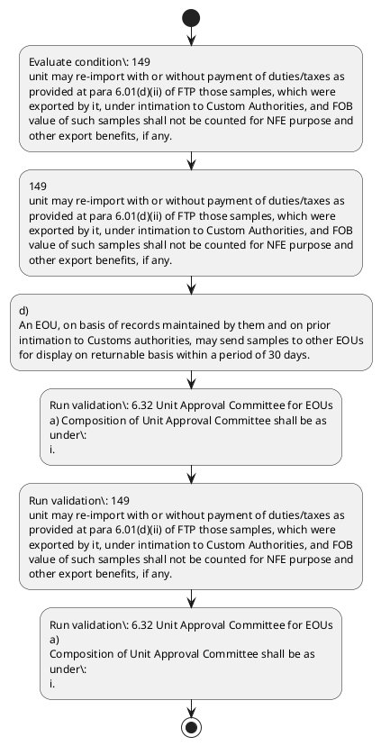

# Chapter 6 / Section 6.32: Unit Approval Committee for EOUs

**Chapter Title:** Export Oriented Units (EOUs), Electronics Hardware Technology Parks (EHTPs), Software Technology Parks (STPs) and Bio-Technology

**Pages:** 17, 18

**Purpose:** 6.32 Unit Approval Committee for EOUs
a) Composition of Unit Approval Committee shall be as
under:
i.

**Purpose Thanglish:** Indha Unit Approval Committee for EOUs section-la, 6.32 Unit Approval Committee for EOUs
a) Composition of Unit Approval Committee kandippa be as
under:
i.

**Summary:** 6.32 Unit Approval Committee for EOUs
a) Composition of Unit Approval Committee shall be as
under:
i. Development Commissioner: Chairperson
ii. Jurisdictional Commissioner of CBIC or nominee:
member
pg.

**Business Meaning:** Unit Approval Committee for EOUs governs how DGFT business controls should be applied, validated, and enforced.

**Business Explanation:** Unit Approval Committee for EOUs explains the operating rule set that DEKAI should enforce. Key control points include 6.32 Unit Approval Committee for EOUs
a) Composition of Unit Approval Committee shall be as
under:
i. The section also drives actions such as 149
unit may re-import with or without payment of duties/taxes as
provided at para 6.01(d)(ii) of FTP those samples, which were
exported by it, under intimation to Custom Authorities, and FOB
value of such samples shall not be counted for NFE purpose and
other export benefits, if any..

**Business Explanation Thanglish:** Indha Unit Approval Committee for EOUs section-la, Unit Approval Committee for EOUs explains the operating rule set that DEKAI should enforce. Key control points include 6.32 Unit Approval Committee for EOUs
a) Composition of Unit Approval Committee kandippa be as
under:
i. The section also drives actions such as 149
unit may re-import with or without payment of duties/taxes as
provided at para 6.01(d)(ii) of FTP those samples, which were
exported by it, under intimation to Custom Authorities, and FOB
value of such samples kandippa not be counted for NFE purpose and
other export benefits, if any..

## Business Logic
- 6.32 Unit Approval Committee for EOUs
a) Composition of Unit Approval Committee shall be as
under:
i.
- 149
unit may re-import with or without payment of duties/taxes as
provided at para 6.01(d)(ii) of FTP those samples, which were
exported by it, under intimation to Custom Authorities, and FOB
value of such samples shall not be counted for NFE purpose and
other export benefits, if any.
- 6.32 Unit Approval Committee for EOUs
a)
Composition of Unit Approval Committee shall be as
under:
i.
- (b) Powers and functions of Unit Approval Committee of EOUs shall be
asunder:
(i) To consider applications for setting up EOUs.
- Items of
manufacture requiring industrial licence under
Industrial (Development & Regulation) Act, 1951
shall be considered by BOA.
- (ii) to consider and permit conversion of units in SEZ to
EOU;
(iii) to monitor performance of units;
(iv) to supervise and monitor permission, clearances,
licences granted to units and take appropriate action
in accordance with law;
(v) to call for information required to monitor
performance of unit under permission, clearances,
licenses granted to it;
(vi) to perform any other function delegated by Central
Governmentor its agencies;
(vii) to perform any other function as may be
delegated by State Governments or its agencies;
and
(viii) to grant all approvals and clearances for
establishment andoperation of EOUs

## Business Rules
- rule_id=CH6-SEC6_32-R001, rule_description=6.32 Unit Approval Committee for EOUs
a) Composition of Unit Approval Committee shall be as
under:
i., trigger=Unit Approval Committee for EOUs, condition=149
unit may re-import with or without payment of duties/taxes as
provided at para 6.01(d)(ii) of FTP those samples, which were
exported by it, under intimation to Custom Authorities, and FOB
value of such samples shall not be counted for NFE purpose and
other export benefits, if any., validation=6.32 Unit Approval Committee for EOUs
a) Composition of Unit Approval Committee shall be as
under:
i., action=149
unit may re-import with or without payment of duties/taxes as
provided at para 6.01(d)(ii) of FTP those samples, which were
exported by it, under intimation to Custom Authorities, and FOB
value of such samples shall not be counted for NFE purpose and
other export benefits, if any., exception=No explicit exception found in uploaded documents., output=DEKAI should produce a compliance decision for 6.32 - Unit Approval Committee for EOUs.
- rule_id=CH6-SEC6_32-R002, rule_description=149
unit may re-import with or without payment of duties/taxes as
provided at para 6.01(d)(ii) of FTP those samples, which were
exported by it, under intimation to Custom Authorities, and FOB
value of such samples shall not be counted for NFE purpose and
other export benefits, if any., trigger=Unit Approval Committee for EOUs, condition=149
unit may re-import with or without payment of duties/taxes as
provided at para 6.01(d)(ii) of FTP those samples, which were
exported by it, under intimation to Custom Authorities, and FOB
value of such samples shall not be counted for NFE purpose and
other export benefits, if any., validation=149
unit may re-import with or without payment of duties/taxes as
provided at para 6.01(d)(ii) of FTP those samples, which were
exported by it, under intimation to Custom Authorities, and FOB
value of such samples shall not be counted for NFE purpose and
other export benefits, if any., action=d)
An EOU, on basis of records maintained by them and on prior
intimation to Customs authorities, may send samples to other EOUs
for display on returnable basis within a period of 30 days., exception=No explicit exception found in uploaded documents., output=DEKAI should produce a compliance decision for 6.32 - Unit Approval Committee for EOUs.
- rule_id=CH6-SEC6_32-R003, rule_description=6.32 Unit Approval Committee for EOUs
a)
Composition of Unit Approval Committee shall be as
under:
i., trigger=Unit Approval Committee for EOUs, condition=149
unit may re-import with or without payment of duties/taxes as
provided at para 6.01(d)(ii) of FTP those samples, which were
exported by it, under intimation to Custom Authorities, and FOB
value of such samples shall not be counted for NFE purpose and
other export benefits, if any., validation=6.32 Unit Approval Committee for EOUs
a)
Composition of Unit Approval Committee shall be as
under:
i., action=d)
An EOU, on basis of records maintained by them and on prior
intimation to Customs authorities, may send samples to other EOUs
for display on returnable basis within a period of 30 days., exception=No explicit exception found in uploaded documents., output=DEKAI should produce a compliance decision for 6.32 - Unit Approval Committee for EOUs.
- rule_id=CH6-SEC6_32-R004, rule_description=(b) Powers and functions of Unit Approval Committee of EOUs shall be
asunder:
(i) To consider applications for setting up EOUs., trigger=Unit Approval Committee for EOUs, condition=149
unit may re-import with or without payment of duties/taxes as
provided at para 6.01(d)(ii) of FTP those samples, which were
exported by it, under intimation to Custom Authorities, and FOB
value of such samples shall not be counted for NFE purpose and
other export benefits, if any., validation=(b) Powers and functions of Unit Approval Committee of EOUs shall be
asunder:
(i) To consider applications for setting up EOUs., action=d)
An EOU, on basis of records maintained by them and on prior
intimation to Customs authorities, may send samples to other EOUs
for display on returnable basis within a period of 30 days., exception=No explicit exception found in uploaded documents., output=DEKAI should produce a compliance decision for 6.32 - Unit Approval Committee for EOUs.
- rule_id=CH6-SEC6_32-R005, rule_description=Items of
manufacture requiring industrial licence under
Industrial (Development & Regulation) Act, 1951
shall be considered by BOA., trigger=Unit Approval Committee for EOUs, condition=149
unit may re-import with or without payment of duties/taxes as
provided at para 6.01(d)(ii) of FTP those samples, which were
exported by it, under intimation to Custom Authorities, and FOB
value of such samples shall not be counted for NFE purpose and
other export benefits, if any., validation=Items of
manufacture requiring industrial licence under
Industrial (Development & Regulation) Act, 1951
shall be considered by BOA., action=d)
An EOU, on basis of records maintained by them and on prior
intimation to Customs authorities, may send samples to other EOUs
for display on returnable basis within a period of 30 days., exception=No explicit exception found in uploaded documents., output=DEKAI should produce a compliance decision for 6.32 - Unit Approval Committee for EOUs.
- rule_id=CH6-SEC6_32-R006, rule_description=(ii) to consider and permit conversion of units in SEZ to
EOU;
(iii) to monitor performance of units;
(iv) to supervise and monitor permission, clearances,
licences granted to units and take appropriate action
in accordance with law;
(v) to call for information required to monitor
performance of unit under permission, clearances,
licenses granted to it;
(vi) to perform any other function delegated by Central
Governmentor its agencies;
(vii) to perform any other function as may be
delegated by State Governments or its agencies;
and
(viii) to grant all approvals and clearances for
establishment andoperation of EOUs, trigger=Unit Approval Committee for EOUs, condition=149
unit may re-import with or without payment of duties/taxes as
provided at para 6.01(d)(ii) of FTP those samples, which were
exported by it, under intimation to Custom Authorities, and FOB
value of such samples shall not be counted for NFE purpose and
other export benefits, if any., validation=(ii) to consider and permit conversion of units in SEZ to
EOU;
(iii) to monitor performance of units;
(iv) to supervise and monitor permission, clearances,
licences granted to units and take appropriate action
in accordance with law;
(v) to call for information required to monitor
performance of unit under permission, clearances,
licenses granted to it;
(vi) to perform any other function delegated by Central
Governmentor its agencies;
(vii) to perform any other function as may be
delegated by State Governments or its agencies;
and
(viii) to grant all approvals and clearances for
establishment andoperation of EOUs, action=d)
An EOU, on basis of records maintained by them and on prior
intimation to Customs authorities, may send samples to other EOUs
for display on returnable basis within a period of 30 days., exception=No explicit exception found in uploaded documents., output=DEKAI should produce a compliance decision for 6.32 - Unit Approval Committee for EOUs.

## Conditions
- 149
unit may re-import with or without payment of duties/taxes as
provided at para 6.01(d)(ii) of FTP those samples, which were
exported by it, under intimation to Custom Authorities, and FOB
value of such samples shall not be counted for NFE purpose and
other export benefits, if any.

## Condition Logic
- id=6.6.32.1, if=149
unit may re-import with or without payment of duties/taxes as
provided at para 6.01(d)(ii) of FTP those samples, which were
exported by it, under intimation to Custom Authorities, and FOB
value of such samples shall not be counted for NFE purpose and
other export benefits, if any., then=149
unit may re-import with or without payment of duties/taxes as
provided at para 6.01(d)(ii) of FTP those samples, which were
exported by it, under intimation to Custom Authorities, and FOB
value of such samples shall not be counted for NFE purpose and
other export benefits, if any., source=149
unit may re-import with or without payment of duties/taxes as
provided at para 6.01(d)(ii) of FTP those samples, which were
exported by it, under intimation to Custom Authorities, and FOB
value of such samples shall not be counted for NFE purpose and
other export benefits, if any.

## Validations
- 6.32 Unit Approval Committee for EOUs
a) Composition of Unit Approval Committee shall be as
under:
i.
- 149
unit may re-import with or without payment of duties/taxes as
provided at para 6.01(d)(ii) of FTP those samples, which were
exported by it, under intimation to Custom Authorities, and FOB
value of such samples shall not be counted for NFE purpose and
other export benefits, if any.
- 6.32 Unit Approval Committee for EOUs
a)
Composition of Unit Approval Committee shall be as
under:
i.
- (b) Powers and functions of Unit Approval Committee of EOUs shall be
asunder:
(i) To consider applications for setting up EOUs.
- Items of
manufacture requiring industrial licence under
Industrial (Development & Regulation) Act, 1951
shall be considered by BOA.
- (ii) to consider and permit conversion of units in SEZ to
EOU;
(iii) to monitor performance of units;
(iv) to supervise and monitor permission, clearances,
licences granted to units and take appropriate action
in accordance with law;
(v) to call for information required to monitor
performance of unit under permission, clearances,
licenses granted to it;
(vi) to perform any other function delegated by Central
Governmentor its agencies;
(vii) to perform any other function as may be
delegated by State Governments or its agencies;
and
(viii) to grant all approvals and clearances for
establishment andoperation of EOUs

## Exceptions
- None identified

## Dependencies
- 6.01

## Authorities
- Unit Approval Committee
- Composition of Unit Approval Committee
- Development Commissioner
- CBIC
- Jurisdictional Commissioner
- Custom Authorities
- Customs
- DGFT
- Joint DGFT
- Joint / Deputy Development Commissioner
- Powers and functions of Unit Approval Committee

## Required Documents
- (b) Powers and functions of Unit Approval Committee of EOUs shall be
asunder:
(i) To consider applications for setting up EOUs.
- Items of
manufacture requiring industrial licence under
Industrial (Development & Regulation) Act, 1951
shall be considered by BOA.
- (ii) to consider and permit conversion of units in SEZ to
EOU;
(iii) to monitor performance of units;
(iv) to supervise and monitor permission, clearances,
licences granted to units and take appropriate action
in accordance with law;
(v) to call for information required to monitor
performance of unit under permission, clearances,
licenses granted to it;
(vi) to perform any other function delegated by Central
Governmentor its agencies;
(vii) to perform any other function as may be
delegated by State Governments or its agencies;
and
(viii) to grant all approvals and clearances for
establishment andoperation of EOUs

## Timelines
- d)
An EOU, on basis of records maintained by them and on prior
intimation to Customs authorities, may send samples to other EOUs
for display on returnable basis within a period of 30 days.

## Actions
- 149
unit may re-import with or without payment of duties/taxes as
provided at para 6.01(d)(ii) of FTP those samples, which were
exported by it, under intimation to Custom Authorities, and FOB
value of such samples shall not be counted for NFE purpose and
other export benefits, if any.
- d)
An EOU, on basis of records maintained by them and on prior
intimation to Customs authorities, may send samples to other EOUs
for display on returnable basis within a period of 30 days.

## Workflow
- Evaluate condition: 149
unit may re-import with or without payment of duties/taxes as
provided at para 6.01(d)(ii) of FTP those samples, which were
exported by it, under intimation to Custom Authorities, and FOB
value of such samples shall not be counted for NFE purpose and
other export benefits, if any.
- 149
unit may re-import with or without payment of duties/taxes as
provided at para 6.01(d)(ii) of FTP those samples, which were
exported by it, under intimation to Custom Authorities, and FOB
value of such samples shall not be counted for NFE purpose and
other export benefits, if any.
- d)
An EOU, on basis of records maintained by them and on prior
intimation to Customs authorities, may send samples to other EOUs
for display on returnable basis within a period of 30 days.
- Run validation: 6.32 Unit Approval Committee for EOUs
a) Composition of Unit Approval Committee shall be as
under:
i.
- Run validation: 149
unit may re-import with or without payment of duties/taxes as
provided at para 6.01(d)(ii) of FTP those samples, which were
exported by it, under intimation to Custom Authorities, and FOB
value of such samples shall not be counted for NFE purpose and
other export benefits, if any.
- Run validation: 6.32 Unit Approval Committee for EOUs
a)
Composition of Unit Approval Committee shall be as
under:
i.

## Workflow ASCII
```text
Unit Approval Committee for EOUs
Evaluate condition: 149
unit may re-import with or without payment of duties/taxes as
provided at para 6.01(d)(ii) of FTP those samples, which were
exported by it, under intimation to Custom Authorities, and FOB
value of such samples shall not be counted for NFE purpose and
other export benefits, if any.
   |
   v
149
unit may re-import with or without payment of duties/taxes as
provided at para 6.01(d)(ii) of FTP those samples, which were
exported by it, under intimation to Custom Authorities, and FOB
value of such samples shall not be counted for NFE purpose and
other export benefits, if any.
   |
   v
d)
An EOU, on basis of records maintained by them and on prior
intimation to Customs authorities, may send samples to other EOUs
for display on returnable basis within a period of 30 days.
   |
   v
Run validation: 6.32 Unit Approval Committee for EOUs
a) Composition of Unit Approval Committee shall be as
under:
i.
   |
   v
Run validation: 149
unit may re-import with or without payment of duties/taxes as
provided at para 6.01(d)(ii) of FTP those samples, which were
exported by it, under intimation to Custom Authorities, and FOB
value of such samples shall not be counted for NFE purpose and
other export benefits, if any.
   |
   v
Run validation: 6.32 Unit Approval Committee for EOUs
a)
Composition of Unit Approval Committee shall be as
under:
i.
```

## Decision Tree
- IF 149
unit may re-import with or without payment of duties/taxes as
provided at para 6.01(d)(ii) of FTP those samples, which were
exported by it, under intimation to Custom Authorities, and FOB
value of such samples shall not be counted for NFE purpose and
other export benefits, if any. THEN 149
unit may re-import with or without payment of duties/taxes as
provided at para 6.01(d)(ii) of FTP those samples, which were
exported by it, under intimation to Custom Authorities, and FOB
value of such samples shall not be counted for NFE purpose and
other export benefits, if any.

## Decision Tree ASCII
```text
Unit Approval Committee for EOUs Decision
IF 149
unit may re-import with or without payment of duties/taxes as
provided at para 6.01(d)(ii) of FTP those samples, which were
exported by it, under intimation to Custom Authorities, and FOB
value of such samples shall not be counted for NFE purpose and
other export benefits, if any. THEN 149
unit may re-import with or without payment of duties/taxes as
provided at para 6.01(d)(ii) of FTP those samples, which were
exported by it, under intimation to Custom Authorities, and FOB
value of such samples shall not be counted for NFE purpose and
other export benefits, if any.
```

## Examples
- User asks to process Unit Approval Committee for EOUs; the platform checks conditions, validations, and documents before action.

**Real-world Example:** Example: an importer or exporter invokes Unit Approval Committee for EOUs, submits (b) Powers and functions of Unit Approval Committee of EOUs shall be
asunder:
(i) To consider applications for setting up EOUs., Items of
manufacture requiring industrial licence under
Industrial (Development & Regulation) Act, 1951
shall be considered by BOA., (ii) to consider and permit conversion of units in SEZ to
EOU;
(iii) to monitor performance of units;
(iv) to supervise and monitor permission, clearances,
licences granted to units and take appropriate action
in accordance with law;
(v) to call for information required to monitor
performance of unit under permission, clearances,
licenses granted to it;
(vi) to perform any other function delegated by Central
Governmentor its agencies;
(vii) to perform any other function as may be
delegated by State Governments or its agencies;
and
(viii) to grant all approvals and clearances for
establishment andoperation of EOUs, and DEKAI uses the extracted rules to 149
unit may re-import with or without payment of duties/taxes as
provided at para 6.01(d)(ii) of ftp those samples, which were
exported by it, under intimation to custom authorities, and fob
value of such samples shall not be counted for nfe purpose and
other export benefits, if any..

**Real-world Example Thanglish:** Indha Unit Approval Committee for EOUs section-la, Example: an importer or exporter invokes Unit Approval Committee for EOUs, submits (b) Powers and functions of Unit Approval Committee of EOUs kandippa be
asunder:
(i) To consider applications for setting up EOUs., Items of
manufacture requiring industrial licence under
Industrial (Development & Regulation) Act, 1951
kandippa be considered by BOA., (ii) to consider and permit conversion of units in SEZ to
EOU;
(iii) to monitor performance of units;
(iv) to supervise and monitor permission, clearances,
licences granted to units and take appropriate action
in accordance with law;
(v) to call for information required to monitor
performance of unit under permission, clearances,
licenses granted to it;
(vi) to perform any other function delegated by Central
Governmentor its agencies;
(vii) to perform any other function as may be
delegated by State Governments or its agencies;
and
(viii) to grant all approvals and clearances for
establishment andoperation of EOUs, and DEKAI uses the extracted rules to 149
unit may re-import with or without payment of duties/taxes as
provided at para 6.01(d)(ii) of ftp those samples, which were
exported by it, under intimation to custom authorities, and fob
value of such samples kandippa not be counted for nfe purpose and
other export benefits, if any..

## AI Rules
- IF detected context matches section rule THEN enforce: 6.32 Unit Approval Committee for EOUs
a) Composition of Unit Approval Committee shall be as
under:
i.
- IF detected context matches section rule THEN enforce: 149
unit may re-import with or without payment of duties/taxes as
provided at para 6.01(d)(ii) of FTP those samples, which were
exported by it, under intimation to Custom Authorities, and FOB
value of such samples shall not be counted for NFE purpose and
other export benefits, if any.
- IF detected context matches section rule THEN enforce: 6.32 Unit Approval Committee for EOUs
a)
Composition of Unit Approval Committee shall be as
under:
i.
- IF detected context matches section rule THEN enforce: (b) Powers and functions of Unit Approval Committee of EOUs shall be
asunder:
(i) To consider applications for setting up EOUs.
- IF detected context matches section rule THEN enforce: Items of
manufacture requiring industrial licence under
Industrial (Development & Regulation) Act, 1951
shall be considered by BOA.
- IF detected context matches section rule THEN enforce: (ii) to consider and permit conversion of units in SEZ to
EOU;
(iii) to monitor performance of units;
(iv) to supervise and monitor permission, clearances,
licences granted to units and take appropriate action
in accordance with law;
(v) to call for information required to monitor
performance of unit under permission, clearances,
licenses granted to it;
(vi) to perform any other function delegated by Central
Governmentor its agencies;
(vii) to perform any other function as may be
delegated by State Governments or its agencies;
and
(viii) to grant all approvals and clearances for
establishment andoperation of EOUs
- IF validations pass THEN recommend action: 149
unit may re-import with or without payment of duties/taxes as
provided at para 6.01(d)(ii) of FTP those samples, which were
exported by it, under intimation to Custom Authorities, and FOB
value of such samples shall not be counted for NFE purpose and
other export benefits, if any.

## Database Fields
- name=section_code, type=string, required=True, source=parsed_section_heading
- name=section_title, type=string, required=True, source=parsed_section_heading
- name=for_flag, type=boolean, required=False, source=keyword:for
- name=may_flag, type=boolean, required=False, source=keyword:may
- name=ftp_flag, type=boolean, required=False, source=keyword:FTP
- name=and_flag, type=boolean, required=False, source=keyword:and
- name=fob_flag, type=boolean, required=False, source=keyword:FOB
- name=not_flag, type=boolean, required=False, source=keyword:not
- name=nfe_flag, type=boolean, required=False, source=keyword:NFE
- name=any_flag, type=boolean, required=False, source=keyword:any
- name=document_1_submitted, type=boolean, required=True, source=(b) Powers and functions of Unit Approval Committee of EOUs shall be
asunder:
(i) To consider applications for setting up EOUs.
- name=document_2_submitted, type=boolean, required=True, source=Items of
manufacture requiring industrial licence under
Industrial (Development & Regulation) Act, 1951
shall be considered by BOA.
- name=document_3_submitted, type=boolean, required=True, source=(ii) to consider and permit conversion of units in SEZ to
EOU;
(iii) to monitor performance of units;
(iv) to supervise and monitor permission, clearances,
licences granted to units and take appropriate action
in accordance with law;
(v) to call for information required to monitor
performance of unit under permission, clearances,
licenses granted to it;
(vi) to perform any other function delegated by Central
Governmentor its agencies;
(vii) to perform any other function as may be
delegated by State Governments or its agencies;
and
(viii) to grant all approvals and clearances for
establishment andoperation of EOUs

## API Requirements
- method=GET, path=/api/dgft/sections/6.32, purpose=Retrieve knowledge payload for section 6.32, query_params=['include=workflow,decision_tree,validations'], response_fields=['section', 'title', 'summary', 'conditions', 'validations', 'exceptions', 'workflow', 'decision_tree']
- method=POST, path=/api/dgft/Unit-Approval-Committee-for-EOUs/validate, purpose=Validate inputs and documents for Unit Approval Committee for EOUs, request_fields=['section_code', 'section_title', 'document_1_submitted', 'document_2_submitted', 'document_3_submitted'], response_fields=['status', 'errors', 'warnings', 'next_actions']
- method=POST, path=/api/dgft/Unit-Approval-Committee-for-EOUs/execute, purpose=Trigger business action for 149
unit may re-import with or without payment of duties/taxes as
provided at para 6.01(d)(ii) of FTP those samples, which were
exported by it, under intimation to Custom Authorities, and FOB
value of such samples shall not be counted for NFE purpose and
other export benefits, if any., request_fields=['section_code', 'section_title', 'document_1_submitted', 'document_2_submitted', 'document_3_submitted'], response_fields=['reference_id', 'status', 'authority', 'timeline']

## UI Screens
- screen_id=Unit_Approval_Committee_for_EOUs_overview, name=Unit Approval Committee for EOUs Overview, purpose=Show section summary, authority, timeline, and eligibility cues., widgets=['summary_card', 'conditions_table', 'authority_badges', 'timeline_panel']
- screen_id=Unit_Approval_Committee_for_EOUs_submission, name=Unit Approval Committee for EOUs Submission, purpose=Capture applicant data and supporting documents., widgets=['dynamic_form', 'document_uploader', 'validation_panel', 'next_action_footer'], fields=['section_code', 'section_title', 'for_flag', 'may_flag', 'ftp_flag', 'and_flag', 'fob_flag', 'not_flag']

## Error Messages
- Validation failed because the section requirements were not fully met.

## FAQ
- question_en=What is the purpose of section 6.32?, answer_en=Unit Approval Committee for EOUs explains the operating rule set that DEKAI should enforce. Key control points include 6.32 Unit Approval Committee for EOUs
a) Composition of Unit Approval Committee shall be as
under:
i. The section also drives actions such as 149
unit may re-import with or without payment of duties/taxes as
provided at para 6.01(d)(ii) of FTP those samples, which were
exported by it, under intimation to Custom Authorities, and FOB
value of such samples shall not be counted for NFE purpose and
other export benefits, if any.., question_thanglish=Indha Unit Approval Committee for EOUs section-la, What is the purpose of section 6.32?, answer_thanglish=Indha Unit Approval Committee for EOUs section-la, Unit Approval Committee for EOUs explains the operating rule set that DEKAI should enforce. Key control points include 6.32 Unit Approval Committee for EOUs
a) Composition of Unit Approval Committee kandippa be as
under:
i. The section also drives actions such as 149
unit may re-import with or without payment of duties/taxes as
provided at para 6.01(d)(ii) of FTP those samples, which were
exported by it, under intimation to Custom Authorities, and FOB
value of such samples kandippa not be counted for NFE purpose and
other export benefits, if any..
- question_en=What documents are required under Unit Approval Committee for EOUs?, answer_en=(b) Powers and functions of Unit Approval Committee of EOUs shall be
asunder:
(i) To consider applications for setting up EOUs., Items of
manufacture requiring industrial licence under
Industrial (Development & Regulation) Act, 1951
shall be considered by BOA., (ii) to consider and permit conversion of units in SEZ to
EOU;
(iii) to monitor performance of units;
(iv) to supervise and monitor permission, clearances,
licences granted to units and take appropriate action
in accordance with law;
(v) to call for information required to monitor
performance of unit under permission, clearances,
licenses granted to it;
(vi) to perform any other function delegated by Central
Governmentor its agencies;
(vii) to perform any other function as may be
delegated by State Governments or its agencies;
and
(viii) to grant all approvals and clearances for
establishment andoperation of EOUs, question_thanglish=Indha Unit Approval Committee for EOUs section-la, What documents are required under Unit Approval Committee for EOUs?, answer_thanglish=Indha Unit Approval Committee for EOUs section-la, (b) Powers and functions of Unit Approval Committee of EOUs kandippa be
asunder:
(i) To consider applications for setting up EOUs., Items of
manufacture requiring industrial licence under
Industrial (Development & Regulation) Act, 1951
kandippa be considered by BOA., (ii) to consider and permit conversion of units in SEZ to
EOU;
(iii) to monitor performance of units;
(iv) to supervise and monitor permission, clearances,
licences granted to units and take appropriate action
in accordance with law;
(v) to call for information required to monitor
performance of unit under permission, clearances,
licenses granted to it;
(vi) to perform any other function delegated by Central
Governmentor its agencies;
(vii) to perform any other function as may be
delegated by State Governments or its agencies;
and
(viii) to grant all approvals and clearances for
establishment andoperation of EOUs
- question_en=Which authority handles Unit Approval Committee for EOUs?, answer_en=Unit Approval Committee, Composition of Unit Approval Committee, Development Commissioner, CBIC, Jurisdictional Commissioner, Custom Authorities, Customs, DGFT, Joint DGFT, Joint / Deputy Development Commissioner, Powers and functions of Unit Approval Committee, question_thanglish=Indha Unit Approval Committee for EOUs section-la, Which authority handles Unit Approval Committee for EOUs?, answer_thanglish=Indha Unit Approval Committee for EOUs section-la, Unit Approval Committee, Composition of Unit Approval Committee, Development Commissioner, CBIC, Jurisdictional Commissioner, Custom Authorities, Customs, DGFT, Joint DGFT, Joint / Deputy Development Commissioner, Powers and functions of Unit Approval Committee

## Questions Users May Ask
- What does Unit Approval Committee for EOUs require?
- Which documents are needed for Unit Approval Committee for EOUs?
- How does DEKAI validate Unit Approval Committee for EOUs requests?
- What action should be taken for Unit Approval Committee for EOUs?

## Expected AI Answers
- Unit Approval Committee for EOUs requires the platform to interpret the section text, apply the extracted business rules, and present the correct next action.
- Required documents are inferred from the section text: (b) Powers and functions of Unit Approval Committee of EOUs shall be
asunder:
(i) To consider applications for setting up EOUs., Items of
manufacture requiring industrial licence under
Industrial (Development & Regulation) Act, 1951
shall be considered by BOA., (ii) to consider and permit conversion of units in SEZ to
EOU;
(iii) to monitor performance of units;
(iv) to supervise and monitor permission, clearances,
licences granted to units and take appropriate action
in accordance with law;
(v) to call for information required to monitor
performance of unit under permission, clearances,
licenses granted to it;
(vi) to perform any other function delegated by Central
Governmentor its agencies;
(vii) to perform any other function as may be
delegated by State Governments or its agencies;
and
(viii) to grant all approvals and clearances for
establishment andoperation of EOUs
- DEKAI validates Unit Approval Committee for EOUs by checking conditions, required documents, authority references, and exception clauses before recommending an outcome.
- The primary extracted action is: 149
unit may re-import with or without payment of duties/taxes as
provided at para 6.01(d)(ii) of FTP those samples, which were
exported by it, under intimation to Custom Authorities, and FOB
value of such samples shall not be counted for NFE purpose and
other export benefits, if any.

## AI Q&A Examples
- question_en=User asks: How do I comply with Unit Approval Committee for EOUs?, answer_en=AI answers: DEKAI should evaluate section 6.32, apply the extracted rules, and guide the user through Evaluate condition: 149
unit may re-import with or without payment of duties/taxes as
provided at para 6.01(d)(ii) of FTP those samples, which were
exported by it, under intimation to Custom Authorities, and FOB
value of such samples shall not be counted for NFE purpose and
other export benefits, if any.., question_thanglish=Indha Unit Approval Committee for EOUs section-la, User asks: How do I comply with Unit Approval Committee for EOUs?, answer_thanglish=Indha Unit Approval Committee for EOUs section-la, AI answers: DEKAI should evaluate section 6.32, apply the extracted rules, and guide the user through Evaluate condition: 149
unit may re-import with or without payment of duties/taxes as
provided at para 6.01(d)(ii) of FTP those samples, which were
exported by it, under intimation to Custom Authorities, and FOB
value of such samples kandippa not be counted for NFE purpose and
other export benefits, if any..
- question_en=User asks: Which validations apply to Unit Approval Committee for EOUs?, answer_en=AI answers: Applicable validations are 6.32 Unit Approval Committee for EOUs
a) Composition of Unit Approval Committee shall be as
under:
i., 149
unit may re-import with or without payment of duties/taxes as
provided at para 6.01(d)(ii) of FTP those samples, which were
exported by it, under intimation to Custom Authorities, and FOB
value of such samples shall not be counted for NFE purpose and
other export benefits, if any., 6.32 Unit Approval Committee for EOUs
a)
Composition of Unit Approval Committee shall be as
under:
i., question_thanglish=Indha Unit Approval Committee for EOUs section-la, User asks: Which validations apply to Unit Approval Committee for EOUs?, answer_thanglish=Indha Unit Approval Committee for EOUs section-la, AI answers: Applicable validations are 6.32 Unit Approval Committee for EOUs
a) Composition of Unit Approval Committee kandippa be as
under:
i., 149
unit may re-import with or without payment of duties/taxes as
provided at para 6.01(d)(ii) of FTP those samples, which were
exported by it, under intimation to Custom Authorities, and FOB
value of such samples kandippa not be counted for NFE purpose and
other export benefits, if any., 6.32 Unit Approval Committee for EOUs
a)
Composition of Unit Approval Committee kandippa be as
under:
i.

## DEKAI AI Implementation Notes
- Capture chapter 6, section 6.32, title, and page references as immutable knowledge metadata.
- Bind validations for Unit Approval Committee for EOUs into a rule engine keyed by the rule IDs extracted for this section.
- Expose document upload controls for: (b) Powers and functions of Unit Approval Committee of EOUs shall be
asunder:
(i) To consider applications for setting up EOUs., Items of
manufacture requiring industrial licence under
Industrial (Development & Regulation) Act, 1951
shall be considered by BOA., (ii) to consider and permit conversion of units in SEZ to
EOU;
(iii) to monitor performance of units;
(iv) to supervise and monitor permission, clearances,
licences granted to units and take appropriate action
in accordance with law;
(v) to call for information required to monitor
performance of unit under permission, clearances,
licenses granted to it;
(vi) to perform any other function delegated by Central
Governmentor its agencies;
(vii) to perform any other function as may be
delegated by State Governments or its agencies;
and
(viii) to grant all approvals and clearances for
establishment andoperation of EOUs.
- Route escalations or approvals to: Unit Approval Committee, Composition of Unit Approval Committee, Development Commissioner, CBIC.
- Show contextual links to related sections: 6.01.

## DEKAI AI Implementation Notes Thanglish
- Indha Unit Approval Committee for EOUs section-la, Capture chapter 6, section 6.32, title, and page references as immutable knowledge metadata.
- Indha Unit Approval Committee for EOUs section-la, Bind validations for Unit Approval Committee for EOUs into a rule engine keyed by the rule IDs extracted for this section.
- Indha Unit Approval Committee for EOUs section-la, Expose document upload controls for: (b) Powers and functions of Unit Approval Committee of EOUs kandippa be
asunder:
(i) To consider applications for setting up EOUs., Items of
manufacture requiring industrial licence under
Industrial (Development & Regulation) Act, 1951
kandippa be considered by BOA., (ii) to consider and permit conversion of units in SEZ to
EOU;
(iii) to monitor performance of units;
(iv) to supervise and monitor permission, clearances,
licences granted to units and take appropriate action
in accordance with law;
(v) to call for information required to monitor
performance of unit under permission, clearances,
licenses granted to it;
(vi) to perform any other function delegated by Central
Governmentor its agencies;
(vii) to perform any other function as may be
delegated by State Governments or its agencies;
and
(viii) to grant all approvals and clearances for
establishment andoperation of EOUs.
- Indha Unit Approval Committee for EOUs section-la, Route escalations or approvals to: Unit Approval Committee, Composition of Unit Approval Committee, Development Commissioner, CBIC.
- Indha Unit Approval Committee for EOUs section-la, Show contextual links to related sections: 6.01.

## AI Metadata
- Keywords: for, may, FTP, and, FOB, not, NFE, any, EOU, iii, the, Act, BOA, SEZ, law, its, vii, all, Unit, EOUs
- Search Keywords: for, may, FTP, and, FOB, not, NFE, any, EOU, iii, the, Act, BOA, SEZ, law, its, vii, all, Unit, EOUs
- Intent: Support Unit Approval Committee for EOUs processing and compliance validation.
- Tags: 6.32, Unit Approval Committee for EOUs, business-rule, document-driven, dgft
- Related Sections: 6.01
- Related Chapters: 
- Related Rules: 6.32 Unit Approval Committee for EOUs
a) Composition of Unit Approval Committee shall be as
under:
i., 149
unit may re-import with or without payment of duties/taxes as
provided at para 6.01(d)(ii) of FTP those samples, which were
exported by it, under intimation to Custom Authorities, and FOB
value of such samples shall not be counted for NFE purpose and
other export benefits, if any., 6.32 Unit Approval Committee for EOUs
a)
Composition of Unit Approval Committee shall be as
under:
i., (b) Powers and functions of Unit Approval Committee of EOUs shall be
asunder:
(i) To consider applications for setting up EOUs., Items of
manufacture requiring industrial licence under
Industrial (Development & Regulation) Act, 1951
shall be considered by BOA.

## Mermaid

```mermaid
flowchart TD
    S1["Evaluate condition: 149
unit may re-import with or without payment of duties/taxes as
provided at para 6.01(d)(ii) of FTP those samples, which were
exported by it, under intimation to Custom Authorities, and FOB
value of such samples shall not be counted for NFE purpose and
other export benefits, if any."]
    S2["149
unit may re-import with or without payment of duties/taxes as
provided at para 6.01(d)(ii) of FTP those samples, which were
exported by it, under intimation to Custom Authorities, and FOB
value of such samples shall not be counted for NFE purpose and
other export benefits, if any."]
    S1 --> S2
    S3["d)
An EOU, on basis of records maintained by them and on prior
intimation to Customs authorities, may send samples to other EOUs
for display on returnable basis within a period of 30 days."]
    S2 --> S3
    S4["Run validation: 6.32 Unit Approval Committee for EOUs
a) Composition of Unit Approval Committee shall be as
under:
i."]
    S3 --> S4
    S5["Run validation: 149
unit may re-import with or without payment of duties/taxes as
provided at para 6.01(d)(ii) of FTP those samples, which were
exported by it, under intimation to Custom Authorities, and FOB
value of such samples shall not be counted for NFE purpose and
other export benefits, if any."]
    S4 --> S5
    S6["Run validation: 6.32 Unit Approval Committee for EOUs
a)
Composition of Unit Approval Committee shall be as
under:
i."]
    S5 --> S6
```


## PlantUML

