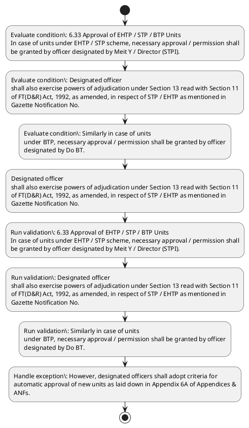

# Chapter 6 / Section 6.33: Approval of EHTP / STP / BTP Units

**Chapter Title:** Export Oriented Units (EOUs), Electronics Hardware Technology Parks (EHTPs), Software Technology Parks (STPs) and Bio-Technology

**Pages:** 18

**Purpose:** 6.33 Approval of EHTP / STP / BTP Units
In case of units under EHTP / STP scheme, necessary approval / permission shall
be granted by officer designated by Meit Y / Director (STPI).

**Purpose Thanglish:** Indha Approval of EHTP / STP / BTP Units section-la, 6.33 Approval of EHTP / STP / BTP Units
In case of units under EHTP / STP scheme, necessary approval / permission kandippa
be granted by officer designated by Meit Y / Director (STPI).

**Summary:** 6.33 Approval of EHTP / STP / BTP Units
In case of units under EHTP / STP scheme, necessary approval / permission shall
be granted by officer designated by Meit Y / Director (STPI). Designated officer
shall also exercise powers of adjudication under Section 13 read with Section 11
of FT(D&R) Act, 1992, as amended, in respect of STP / EHTP as mentioned in
Gazette Notification No. S.O.

**Business Meaning:** Approval of EHTP / STP / BTP Units governs how DGFT business controls should be applied, validated, and enforced.

**Business Explanation:** Approval of EHTP / STP / BTP Units explains the operating rule set that DEKAI should enforce. Key control points include 6.33 Approval of EHTP / STP / BTP Units
In case of units under EHTP / STP scheme, necessary approval / permission shall
be granted by officer designated by Meit Y / Director (STPI). The section also drives actions such as Designated officer
shall also exercise powers of adjudication under Section 13 read with Section 11
of FT(D&R) Act, 1992, as amended, in respect of STP / EHTP as mentioned in
Gazette Notification No..

**Business Explanation Thanglish:** Indha Approval of EHTP / STP / BTP Units section-la, Approval of EHTP / STP / BTP Units explains the operating rule set that DEKAI should enforce. Key control points include 6.33 Approval of EHTP / STP / BTP Units
In case of units under EHTP / STP scheme, necessary approval / permission kandippa
be granted by officer designated by Meit Y / Director (STPI). The section also drives actions such as Designated officer
kandippa also exercise powers of adjudication under Section 13 read with Section 11
of FT(D&R) Act, 1992, as amended, in respect of STP / EHTP as mentioned in
Gazette Notification No..

## Business Logic
- 6.33 Approval of EHTP / STP / BTP Units
In case of units under EHTP / STP scheme, necessary approval / permission shall
be granted by officer designated by Meit Y / Director (STPI).
- Designated officer
shall also exercise powers of adjudication under Section 13 read with Section 11
of FT(D&R) Act, 1992, as amended, in respect of STP / EHTP as mentioned in
Gazette Notification No.
- Similarly in case of units
under BTP, necessary approval / permission shall be granted by officer
designated by Do BT.
- However, designated officers shall adopt criteria for
automatic approval of new units as laid down in Appendix 6A of Appendices &
ANFs.
- (b) Powers and functions of Unit Approval Committee of EOUs shall be
asunder:
(i)
To consider applications for setting up EOUs.
- Items of
manufacture requiring industrial licence under
Industrial (Development & Regulation) Act, 1951
shall be considered by BOA.
- (ii)
to consider and permit conversion of units in SEZ to
EOU;
(iii)
to monitor performance of units;
(iv)
to supervise and monitor permission, clearances,
licences granted to units and take appropriate action
in accordance with law;
(v)
to call for information required to monitor
performance of unit under permission, clearances,
licenses granted to it;
(vi)
to perform any other function delegated by Central
Governmentor its agencies;
(vii)
to perform any other function as may be
delegated by State Governments or its agencies;
and
(viii) to grant all approvals and clearances for
establishment andoperation of EOUs

## Business Rules
- rule_id=CH6-SEC6_33-R001, rule_description=6.33 Approval of EHTP / STP / BTP Units
In case of units under EHTP / STP scheme, necessary approval / permission shall
be granted by officer designated by Meit Y / Director (STPI)., trigger=Approval of EHTP / STP / BTP Units, condition=6.33 Approval of EHTP / STP / BTP Units
In case of units under EHTP / STP scheme, necessary approval / permission shall
be granted by officer designated by Meit Y / Director (STPI)., validation=6.33 Approval of EHTP / STP / BTP Units
In case of units under EHTP / STP scheme, necessary approval / permission shall
be granted by officer designated by Meit Y / Director (STPI)., action=Designated officer
shall also exercise powers of adjudication under Section 13 read with Section 11
of FT(D&R) Act, 1992, as amended, in respect of STP / EHTP as mentioned in
Gazette Notification No., exception=However, designated officers shall adopt criteria for
automatic approval of new units as laid down in Appendix 6A of Appendices &
ANFs., output=DEKAI should produce a compliance decision for 6.33 - Approval of EHTP / STP / BTP Units.
- rule_id=CH6-SEC6_33-R002, rule_description=Designated officer
shall also exercise powers of adjudication under Section 13 read with Section 11
of FT(D&R) Act, 1992, as amended, in respect of STP / EHTP as mentioned in
Gazette Notification No., trigger=Approval of EHTP / STP / BTP Units, condition=Designated officer
shall also exercise powers of adjudication under Section 13 read with Section 11
of FT(D&R) Act, 1992, as amended, in respect of STP / EHTP as mentioned in
Gazette Notification No., validation=Designated officer
shall also exercise powers of adjudication under Section 13 read with Section 11
of FT(D&R) Act, 1992, as amended, in respect of STP / EHTP as mentioned in
Gazette Notification No., action=Designated officer
shall also exercise powers of adjudication under Section 13 read with Section 11
of FT(D&R) Act, 1992, as amended, in respect of STP / EHTP as mentioned in
Gazette Notification No., exception=However, designated officers shall adopt criteria for
automatic approval of new units as laid down in Appendix 6A of Appendices &
ANFs., output=DEKAI should produce a compliance decision for 6.33 - Approval of EHTP / STP / BTP Units.
- rule_id=CH6-SEC6_33-R003, rule_description=Similarly in case of units
under BTP, necessary approval / permission shall be granted by officer
designated by Do BT., trigger=Approval of EHTP / STP / BTP Units, condition=Similarly in case of units
under BTP, necessary approval / permission shall be granted by officer
designated by Do BT., validation=Similarly in case of units
under BTP, necessary approval / permission shall be granted by officer
designated by Do BT., action=Designated officer
shall also exercise powers of adjudication under Section 13 read with Section 11
of FT(D&R) Act, 1992, as amended, in respect of STP / EHTP as mentioned in
Gazette Notification No., exception=However, designated officers shall adopt criteria for
automatic approval of new units as laid down in Appendix 6A of Appendices &
ANFs., output=DEKAI should produce a compliance decision for 6.33 - Approval of EHTP / STP / BTP Units.
- rule_id=CH6-SEC6_33-R004, rule_description=However, designated officers shall adopt criteria for
automatic approval of new units as laid down in Appendix 6A of Appendices &
ANFs., trigger=Approval of EHTP / STP / BTP Units, condition=Similarly in case of units
under BTP, necessary approval / permission shall be granted by officer
designated by Do BT., validation=However, designated officers shall adopt criteria for
automatic approval of new units as laid down in Appendix 6A of Appendices &
ANFs., action=Designated officer
shall also exercise powers of adjudication under Section 13 read with Section 11
of FT(D&R) Act, 1992, as amended, in respect of STP / EHTP as mentioned in
Gazette Notification No., exception=However, designated officers shall adopt criteria for
automatic approval of new units as laid down in Appendix 6A of Appendices &
ANFs., output=DEKAI should produce a compliance decision for 6.33 - Approval of EHTP / STP / BTP Units.
- rule_id=CH6-SEC6_33-R005, rule_description=(b) Powers and functions of Unit Approval Committee of EOUs shall be
asunder:
(i)
To consider applications for setting up EOUs., trigger=Approval of EHTP / STP / BTP Units, condition=Similarly in case of units
under BTP, necessary approval / permission shall be granted by officer
designated by Do BT., validation=(b) Powers and functions of Unit Approval Committee of EOUs shall be
asunder:
(i)
To consider applications for setting up EOUs., action=Designated officer
shall also exercise powers of adjudication under Section 13 read with Section 11
of FT(D&R) Act, 1992, as amended, in respect of STP / EHTP as mentioned in
Gazette Notification No., exception=However, designated officers shall adopt criteria for
automatic approval of new units as laid down in Appendix 6A of Appendices &
ANFs., output=DEKAI should produce a compliance decision for 6.33 - Approval of EHTP / STP / BTP Units.
- rule_id=CH6-SEC6_33-R006, rule_description=Items of
manufacture requiring industrial licence under
Industrial (Development & Regulation) Act, 1951
shall be considered by BOA., trigger=Approval of EHTP / STP / BTP Units, condition=Similarly in case of units
under BTP, necessary approval / permission shall be granted by officer
designated by Do BT., validation=Items of
manufacture requiring industrial licence under
Industrial (Development & Regulation) Act, 1951
shall be considered by BOA., action=Designated officer
shall also exercise powers of adjudication under Section 13 read with Section 11
of FT(D&R) Act, 1992, as amended, in respect of STP / EHTP as mentioned in
Gazette Notification No., exception=However, designated officers shall adopt criteria for
automatic approval of new units as laid down in Appendix 6A of Appendices &
ANFs., output=DEKAI should produce a compliance decision for 6.33 - Approval of EHTP / STP / BTP Units.
- rule_id=CH6-SEC6_33-R007, rule_description=(ii)
to consider and permit conversion of units in SEZ to
EOU;
(iii)
to monitor performance of units;
(iv)
to supervise and monitor permission, clearances,
licences granted to units and take appropriate action
in accordance with law;
(v)
to call for information required to monitor
performance of unit under permission, clearances,
licenses granted to it;
(vi)
to perform any other function delegated by Central
Governmentor its agencies;
(vii)
to perform any other function as may be
delegated by State Governments or its agencies;
and
(viii) to grant all approvals and clearances for
establishment andoperation of EOUs, trigger=Approval of EHTP / STP / BTP Units, condition=Similarly in case of units
under BTP, necessary approval / permission shall be granted by officer
designated by Do BT., validation=(ii)
to consider and permit conversion of units in SEZ to
EOU;
(iii)
to monitor performance of units;
(iv)
to supervise and monitor permission, clearances,
licences granted to units and take appropriate action
in accordance with law;
(v)
to call for information required to monitor
performance of unit under permission, clearances,
licenses granted to it;
(vi)
to perform any other function delegated by Central
Governmentor its agencies;
(vii)
to perform any other function as may be
delegated by State Governments or its agencies;
and
(viii) to grant all approvals and clearances for
establishment andoperation of EOUs, action=Designated officer
shall also exercise powers of adjudication under Section 13 read with Section 11
of FT(D&R) Act, 1992, as amended, in respect of STP / EHTP as mentioned in
Gazette Notification No., exception=However, designated officers shall adopt criteria for
automatic approval of new units as laid down in Appendix 6A of Appendices &
ANFs., output=DEKAI should produce a compliance decision for 6.33 - Approval of EHTP / STP / BTP Units.

## Conditions
- 6.33 Approval of EHTP / STP / BTP Units
In case of units under EHTP / STP scheme, necessary approval / permission shall
be granted by officer designated by Meit Y / Director (STPI).
- Designated officer
shall also exercise powers of adjudication under Section 13 read with Section 11
of FT(D&R) Act, 1992, as amended, in respect of STP / EHTP as mentioned in
Gazette Notification No.
- Similarly in case of units
under BTP, necessary approval / permission shall be granted by officer
designated by Do BT.

## Condition Logic
- id=6.6.33.1, if=6.33 Approval of EHTP / STP / BTP Units
In case of units under EHTP / STP scheme, necessary approval / permission shall
be granted by officer designated by Meit Y / Director (STPI)., then=Designated officer
shall also exercise powers of adjudication under Section 13 read with Section 11
of FT(D&R) Act, 1992, as amended, in respect of STP / EHTP as mentioned in
Gazette Notification No., source=6.33 Approval of EHTP / STP / BTP Units
In case of units under EHTP / STP scheme, necessary approval / permission shall
be granted by officer designated by Meit Y / Director (STPI).
- id=6.6.33.2, if=Designated officer
shall also exercise powers of adjudication under Section 13 read with Section 11
of FT(D&R) Act, 1992, as amended, in respect of STP / EHTP as mentioned in
Gazette Notification No., then=Designated officer
shall also exercise powers of adjudication under Section 13 read with Section 11
of FT(D&R) Act, 1992, as amended, in respect of STP / EHTP as mentioned in
Gazette Notification No., source=Designated officer
shall also exercise powers of adjudication under Section 13 read with Section 11
of FT(D&R) Act, 1992, as amended, in respect of STP / EHTP as mentioned in
Gazette Notification No.
- id=6.6.33.3, if=Similarly in case of units
under BTP, necessary approval / permission shall be granted by officer
designated by Do BT., then=Designated officer
shall also exercise powers of adjudication under Section 13 read with Section 11
of FT(D&R) Act, 1992, as amended, in respect of STP / EHTP as mentioned in
Gazette Notification No., source=Similarly in case of units
under BTP, necessary approval / permission shall be granted by officer
designated by Do BT.

## Validations
- 6.33 Approval of EHTP / STP / BTP Units
In case of units under EHTP / STP scheme, necessary approval / permission shall
be granted by officer designated by Meit Y / Director (STPI).
- Designated officer
shall also exercise powers of adjudication under Section 13 read with Section 11
of FT(D&R) Act, 1992, as amended, in respect of STP / EHTP as mentioned in
Gazette Notification No.
- Similarly in case of units
under BTP, necessary approval / permission shall be granted by officer
designated by Do BT.
- However, designated officers shall adopt criteria for
automatic approval of new units as laid down in Appendix 6A of Appendices &
ANFs.
- (b) Powers and functions of Unit Approval Committee of EOUs shall be
asunder:
(i)
To consider applications for setting up EOUs.
- Items of
manufacture requiring industrial licence under
Industrial (Development & Regulation) Act, 1951
shall be considered by BOA.
- (ii)
to consider and permit conversion of units in SEZ to
EOU;
(iii)
to monitor performance of units;
(iv)
to supervise and monitor permission, clearances,
licences granted to units and take appropriate action
in accordance with law;
(v)
to call for information required to monitor
performance of unit under permission, clearances,
licenses granted to it;
(vi)
to perform any other function delegated by Central
Governmentor its agencies;
(vii)
to perform any other function as may be
delegated by State Governments or its agencies;
and
(viii) to grant all approvals and clearances for
establishment andoperation of EOUs

## Exceptions
- However, designated officers shall adopt criteria for
automatic approval of new units as laid down in Appendix 6A of Appendices &
ANFs.

## Dependencies
- 13
- 11

## Authorities
- DGFT
- Joint DGFT
- Development Commissioner
- Joint / Deputy Development Commissioner
- Powers and functions of Unit Approval Committee

## Required Documents
- (b) Powers and functions of Unit Approval Committee of EOUs shall be
asunder:
(i)
To consider applications for setting up EOUs.
- Items of
manufacture requiring industrial licence under
Industrial (Development & Regulation) Act, 1951
shall be considered by BOA.
- (ii)
to consider and permit conversion of units in SEZ to
EOU;
(iii)
to monitor performance of units;
(iv)
to supervise and monitor permission, clearances,
licences granted to units and take appropriate action
in accordance with law;
(v)
to call for information required to monitor
performance of unit under permission, clearances,
licenses granted to it;
(vi)
to perform any other function delegated by Central
Governmentor its agencies;
(vii)
to perform any other function as may be
delegated by State Governments or its agencies;
and
(viii) to grant all approvals and clearances for
establishment andoperation of EOUs

## Timelines
- None identified

## Actions
- Designated officer
shall also exercise powers of adjudication under Section 13 read with Section 11
of FT(D&R) Act, 1992, as amended, in respect of STP / EHTP as mentioned in
Gazette Notification No.

## Workflow
- Evaluate condition: 6.33 Approval of EHTP / STP / BTP Units
In case of units under EHTP / STP scheme, necessary approval / permission shall
be granted by officer designated by Meit Y / Director (STPI).
- Evaluate condition: Designated officer
shall also exercise powers of adjudication under Section 13 read with Section 11
of FT(D&R) Act, 1992, as amended, in respect of STP / EHTP as mentioned in
Gazette Notification No.
- Evaluate condition: Similarly in case of units
under BTP, necessary approval / permission shall be granted by officer
designated by Do BT.
- Designated officer
shall also exercise powers of adjudication under Section 13 read with Section 11
of FT(D&R) Act, 1992, as amended, in respect of STP / EHTP as mentioned in
Gazette Notification No.
- Run validation: 6.33 Approval of EHTP / STP / BTP Units
In case of units under EHTP / STP scheme, necessary approval / permission shall
be granted by officer designated by Meit Y / Director (STPI).
- Run validation: Designated officer
shall also exercise powers of adjudication under Section 13 read with Section 11
of FT(D&R) Act, 1992, as amended, in respect of STP / EHTP as mentioned in
Gazette Notification No.
- Run validation: Similarly in case of units
under BTP, necessary approval / permission shall be granted by officer
designated by Do BT.
- Handle exception: However, designated officers shall adopt criteria for
automatic approval of new units as laid down in Appendix 6A of Appendices &
ANFs.

## Workflow ASCII
```text
Approval of EHTP / STP / BTP Units
Evaluate condition: 6.33 Approval of EHTP / STP / BTP Units
In case of units under EHTP / STP scheme, necessary approval / permission shall
be granted by officer designated by Meit Y / Director (STPI).
   |
   v
Evaluate condition: Designated officer
shall also exercise powers of adjudication under Section 13 read with Section 11
of FT(D&R) Act, 1992, as amended, in respect of STP / EHTP as mentioned in
Gazette Notification No.
   |
   v
Evaluate condition: Similarly in case of units
under BTP, necessary approval / permission shall be granted by officer
designated by Do BT.
   |
   v
Designated officer
shall also exercise powers of adjudication under Section 13 read with Section 11
of FT(D&R) Act, 1992, as amended, in respect of STP / EHTP as mentioned in
Gazette Notification No.
   |
   v
Run validation: 6.33 Approval of EHTP / STP / BTP Units
In case of units under EHTP / STP scheme, necessary approval / permission shall
be granted by officer designated by Meit Y / Director (STPI).
   |
   v
Run validation: Designated officer
shall also exercise powers of adjudication under Section 13 read with Section 11
of FT(D&R) Act, 1992, as amended, in respect of STP / EHTP as mentioned in
Gazette Notification No.
   |
   v
Run validation: Similarly in case of units
under BTP, necessary approval / permission shall be granted by officer
designated by Do BT.
   |
   v
Handle exception: However, designated officers shall adopt criteria for
automatic approval of new units as laid down in Appendix 6A of Appendices &
ANFs.
```

## Decision Tree
- IF 6.33 Approval of EHTP / STP / BTP Units
In case of units under EHTP / STP scheme, necessary approval / permission shall
be granted by officer designated by Meit Y / Director (STPI). THEN Designated officer
shall also exercise powers of adjudication under Section 13 read with Section 11
of FT(D&R) Act, 1992, as amended, in respect of STP / EHTP as mentioned in
Gazette Notification No.
- IF Designated officer
shall also exercise powers of adjudication under Section 13 read with Section 11
of FT(D&R) Act, 1992, as amended, in respect of STP / EHTP as mentioned in
Gazette Notification No. THEN Designated officer
shall also exercise powers of adjudication under Section 13 read with Section 11
of FT(D&R) Act, 1992, as amended, in respect of STP / EHTP as mentioned in
Gazette Notification No.
- IF Similarly in case of units
under BTP, necessary approval / permission shall be granted by officer
designated by Do BT. THEN Designated officer
shall also exercise powers of adjudication under Section 13 read with Section 11
of FT(D&R) Act, 1992, as amended, in respect of STP / EHTP as mentioned in
Gazette Notification No.
- IF exception applies (However, designated officers shall adopt criteria for
automatic approval of new units as laid down in Appendix 6A of Appendices &
ANFs.) THEN route to manual review

## Decision Tree ASCII
```text
Approval of EHTP / STP / BTP Units Decision
IF 6.33 Approval of EHTP / STP / BTP Units
In case of units under EHTP / STP scheme, necessary approval / permission shall
be granted by officer designated by Meit Y / Director (STPI). THEN Designated officer
shall also exercise powers of adjudication under Section 13 read with Section 11
of FT(D&R) Act, 1992, as amended, in respect of STP / EHTP as mentioned in
Gazette Notification No.
   |
   v
IF Designated officer
shall also exercise powers of adjudication under Section 13 read with Section 11
of FT(D&R) Act, 1992, as amended, in respect of STP / EHTP as mentioned in
Gazette Notification No. THEN Designated officer
shall also exercise powers of adjudication under Section 13 read with Section 11
of FT(D&R) Act, 1992, as amended, in respect of STP / EHTP as mentioned in
Gazette Notification No.
   |
   v
IF Similarly in case of units
under BTP, necessary approval / permission shall be granted by officer
designated by Do BT. THEN Designated officer
shall also exercise powers of adjudication under Section 13 read with Section 11
of FT(D&R) Act, 1992, as amended, in respect of STP / EHTP as mentioned in
Gazette Notification No.
   |
   v
IF exception applies (However, designated officers shall adopt criteria for
automatic approval of new units as laid down in Appendix 6A of Appendices &
ANFs.) THEN route to manual review
```

## Examples
- User asks to process Approval of EHTP / STP / BTP Units; the platform checks conditions, validations, and documents before action.

**Real-world Example:** Example: an importer or exporter invokes Approval of EHTP / STP / BTP Units, submits (b) Powers and functions of Unit Approval Committee of EOUs shall be
asunder:
(i)
To consider applications for setting up EOUs., Items of
manufacture requiring industrial licence under
Industrial (Development & Regulation) Act, 1951
shall be considered by BOA., (ii)
to consider and permit conversion of units in SEZ to
EOU;
(iii)
to monitor performance of units;
(iv)
to supervise and monitor permission, clearances,
licences granted to units and take appropriate action
in accordance with law;
(v)
to call for information required to monitor
performance of unit under permission, clearances,
licenses granted to it;
(vi)
to perform any other function delegated by Central
Governmentor its agencies;
(vii)
to perform any other function as may be
delegated by State Governments or its agencies;
and
(viii) to grant all approvals and clearances for
establishment andoperation of EOUs, and DEKAI uses the extracted rules to designated officer
shall also exercise powers of adjudication under section 13 read with section 11
of ft(d&r) act, 1992, as amended, in respect of stp / ehtp as mentioned in
gazette notification no..

**Real-world Example Thanglish:** Indha Approval of EHTP / STP / BTP Units section-la, Example: an importer or exporter invokes Approval of EHTP / STP / BTP Units, submits (b) Powers and functions of Unit Approval Committee of EOUs kandippa be
asunder:
(i)
To consider applications for setting up EOUs., Items of
manufacture requiring industrial licence under
Industrial (Development & Regulation) Act, 1951
kandippa be considered by BOA., (ii)
to consider and permit conversion of units in SEZ to
EOU;
(iii)
to monitor performance of units;
(iv)
to supervise and monitor permission, clearances,
licences granted to units and take appropriate action
in accordance with law;
(v)
to call for information required to monitor
performance of unit under permission, clearances,
licenses granted to it;
(vi)
to perform any other function delegated by Central
Governmentor its agencies;
(vii)
to perform any other function as may be
delegated by State Governments or its agencies;
and
(viii) to grant all approvals and clearances for
establishment andoperation of EOUs, and DEKAI uses the extracted rules to designated officer
kandippa also exercise powers of adjudication under section 13 read with section 11
of ft(d&r) act, 1992, as amended, in respect of stp / ehtp as mentioned in
gazette notification no..

## AI Rules
- IF detected context matches section rule THEN enforce: 6.33 Approval of EHTP / STP / BTP Units
In case of units under EHTP / STP scheme, necessary approval / permission shall
be granted by officer designated by Meit Y / Director (STPI).
- IF detected context matches section rule THEN enforce: Designated officer
shall also exercise powers of adjudication under Section 13 read with Section 11
of FT(D&R) Act, 1992, as amended, in respect of STP / EHTP as mentioned in
Gazette Notification No.
- IF detected context matches section rule THEN enforce: Similarly in case of units
under BTP, necessary approval / permission shall be granted by officer
designated by Do BT.
- IF detected context matches section rule THEN enforce: However, designated officers shall adopt criteria for
automatic approval of new units as laid down in Appendix 6A of Appendices &
ANFs.
- IF detected context matches section rule THEN enforce: (b) Powers and functions of Unit Approval Committee of EOUs shall be
asunder:
(i)
To consider applications for setting up EOUs.
- IF detected context matches section rule THEN enforce: Items of
manufacture requiring industrial licence under
Industrial (Development & Regulation) Act, 1951
shall be considered by BOA.
- IF validations pass THEN recommend action: Designated officer
shall also exercise powers of adjudication under Section 13 read with Section 11
of FT(D&R) Act, 1992, as amended, in respect of STP / EHTP as mentioned in
Gazette Notification No.

## Database Fields
- name=section_code, type=string, required=True, source=parsed_section_heading
- name=section_title, type=string, required=True, source=parsed_section_heading
- name=stp_flag, type=boolean, required=False, source=keyword:STP
- name=btp_flag, type=boolean, required=False, source=keyword:BTP
- name=d&r_flag, type=boolean, required=False, source=keyword:D&R
- name=act_flag, type=boolean, required=False, source=keyword:Act
- name=for_flag, type=boolean, required=False, source=keyword:for
- name=new_flag, type=boolean, required=False, source=keyword:new
- name=iii_flag, type=boolean, required=False, source=keyword:iii
- name=the_flag, type=boolean, required=False, source=keyword:the
- name=document_1_submitted, type=boolean, required=True, source=(b) Powers and functions of Unit Approval Committee of EOUs shall be
asunder:
(i)
To consider applications for setting up EOUs.
- name=document_2_submitted, type=boolean, required=True, source=Items of
manufacture requiring industrial licence under
Industrial (Development & Regulation) Act, 1951
shall be considered by BOA.
- name=document_3_submitted, type=boolean, required=True, source=(ii)
to consider and permit conversion of units in SEZ to
EOU;
(iii)
to monitor performance of units;
(iv)
to supervise and monitor permission, clearances,
licences granted to units and take appropriate action
in accordance with law;
(v)
to call for information required to monitor
performance of unit under permission, clearances,
licenses granted to it;
(vi)
to perform any other function delegated by Central
Governmentor its agencies;
(vii)
to perform any other function as may be
delegated by State Governments or its agencies;
and
(viii) to grant all approvals and clearances for
establishment andoperation of EOUs

## API Requirements
- method=GET, path=/api/dgft/sections/6.33, purpose=Retrieve knowledge payload for section 6.33, query_params=['include=workflow,decision_tree,validations'], response_fields=['section', 'title', 'summary', 'conditions', 'validations', 'exceptions', 'workflow', 'decision_tree']
- method=POST, path=/api/dgft/Approval-of-EHTP-STP-BTP-Units/validate, purpose=Validate inputs and documents for Approval of EHTP / STP / BTP Units, request_fields=['section_code', 'section_title', 'document_1_submitted', 'document_2_submitted', 'document_3_submitted'], response_fields=['status', 'errors', 'warnings', 'next_actions']
- method=POST, path=/api/dgft/Approval-of-EHTP-STP-BTP-Units/execute, purpose=Trigger business action for Designated officer
shall also exercise powers of adjudication under Section 13 read with Section 11
of FT(D&R) Act, 1992, as amended, in respect of STP / EHTP as mentioned in
Gazette Notification No., request_fields=['section_code', 'section_title', 'document_1_submitted', 'document_2_submitted', 'document_3_submitted'], response_fields=['reference_id', 'status', 'authority', 'timeline']

## UI Screens
- screen_id=Approval_of_EHTP_STP_BTP_Units_overview, name=Approval of EHTP / STP / BTP Units Overview, purpose=Show section summary, authority, timeline, and eligibility cues., widgets=['summary_card', 'conditions_table', 'authority_badges', 'timeline_panel']
- screen_id=Approval_of_EHTP_STP_BTP_Units_submission, name=Approval of EHTP / STP / BTP Units Submission, purpose=Capture applicant data and supporting documents., widgets=['dynamic_form', 'document_uploader', 'validation_panel', 'next_action_footer'], fields=['section_code', 'section_title', 'stp_flag', 'btp_flag', 'd&r_flag', 'act_flag', 'for_flag', 'new_flag']
- screen_id=Approval_of_EHTP_STP_BTP_Units_exceptions, name=Approval of EHTP / STP / BTP Units Exception Review, purpose=Explain exception handling and manual review triggers., widgets=['exception_banner', 'decision_tree', 'case_notes']

## Error Messages
- Validation failed because the section requirements were not fully met.

## FAQ
- question_en=What is the purpose of section 6.33?, answer_en=Approval of EHTP / STP / BTP Units explains the operating rule set that DEKAI should enforce. Key control points include 6.33 Approval of EHTP / STP / BTP Units
In case of units under EHTP / STP scheme, necessary approval / permission shall
be granted by officer designated by Meit Y / Director (STPI). The section also drives actions such as Designated officer
shall also exercise powers of adjudication under Section 13 read with Section 11
of FT(D&R) Act, 1992, as amended, in respect of STP / EHTP as mentioned in
Gazette Notification No.., question_thanglish=Indha Approval of EHTP / STP / BTP Units section-la, What is the purpose of section 6.33?, answer_thanglish=Indha Approval of EHTP / STP / BTP Units section-la, Approval of EHTP / STP / BTP Units explains the operating rule set that DEKAI should enforce. Key control points include 6.33 Approval of EHTP / STP / BTP Units
In case of units under EHTP / STP scheme, necessary approval / permission kandippa
be granted by officer designated by Meit Y / Director (STPI). The section also drives actions such as Designated officer
kandippa also exercise powers of adjudication under Section 13 read with Section 11
of FT(D&R) Act, 1992, as amended, in respect of STP / EHTP as mentioned in
Gazette Notification No..
- question_en=What documents are required under Approval of EHTP / STP / BTP Units?, answer_en=(b) Powers and functions of Unit Approval Committee of EOUs shall be
asunder:
(i)
To consider applications for setting up EOUs., Items of
manufacture requiring industrial licence under
Industrial (Development & Regulation) Act, 1951
shall be considered by BOA., (ii)
to consider and permit conversion of units in SEZ to
EOU;
(iii)
to monitor performance of units;
(iv)
to supervise and monitor permission, clearances,
licences granted to units and take appropriate action
in accordance with law;
(v)
to call for information required to monitor
performance of unit under permission, clearances,
licenses granted to it;
(vi)
to perform any other function delegated by Central
Governmentor its agencies;
(vii)
to perform any other function as may be
delegated by State Governments or its agencies;
and
(viii) to grant all approvals and clearances for
establishment andoperation of EOUs, question_thanglish=Indha Approval of EHTP / STP / BTP Units section-la, What documents are required under Approval of EHTP / STP / BTP Units?, answer_thanglish=Indha Approval of EHTP / STP / BTP Units section-la, (b) Powers and functions of Unit Approval Committee of EOUs kandippa be
asunder:
(i)
To consider applications for setting up EOUs., Items of
manufacture requiring industrial licence under
Industrial (Development & Regulation) Act, 1951
kandippa be considered by BOA., (ii)
to consider and permit conversion of units in SEZ to
EOU;
(iii)
to monitor performance of units;
(iv)
to supervise and monitor permission, clearances,
licences granted to units and take appropriate action
in accordance with law;
(v)
to call for information required to monitor
performance of unit under permission, clearances,
licenses granted to it;
(vi)
to perform any other function delegated by Central
Governmentor its agencies;
(vii)
to perform any other function as may be
delegated by State Governments or its agencies;
and
(viii) to grant all approvals and clearances for
establishment andoperation of EOUs
- question_en=Which authority handles Approval of EHTP / STP / BTP Units?, answer_en=DGFT, Joint DGFT, Development Commissioner, Joint / Deputy Development Commissioner, Powers and functions of Unit Approval Committee, question_thanglish=Indha Approval of EHTP / STP / BTP Units section-la, Which authority handles Approval of EHTP / STP / BTP Units?, answer_thanglish=Indha Approval of EHTP / STP / BTP Units section-la, DGFT, Joint DGFT, Development Commissioner, Joint / Deputy Development Commissioner, Powers and functions of Unit Approval Committee

## Questions Users May Ask
- What does Approval of EHTP / STP / BTP Units require?
- Which documents are needed for Approval of EHTP / STP / BTP Units?
- How does DEKAI validate Approval of EHTP / STP / BTP Units requests?
- What action should be taken for Approval of EHTP / STP / BTP Units?

## Expected AI Answers
- Approval of EHTP / STP / BTP Units requires the platform to interpret the section text, apply the extracted business rules, and present the correct next action.
- Required documents are inferred from the section text: (b) Powers and functions of Unit Approval Committee of EOUs shall be
asunder:
(i)
To consider applications for setting up EOUs., Items of
manufacture requiring industrial licence under
Industrial (Development & Regulation) Act, 1951
shall be considered by BOA., (ii)
to consider and permit conversion of units in SEZ to
EOU;
(iii)
to monitor performance of units;
(iv)
to supervise and monitor permission, clearances,
licences granted to units and take appropriate action
in accordance with law;
(v)
to call for information required to monitor
performance of unit under permission, clearances,
licenses granted to it;
(vi)
to perform any other function delegated by Central
Governmentor its agencies;
(vii)
to perform any other function as may be
delegated by State Governments or its agencies;
and
(viii) to grant all approvals and clearances for
establishment andoperation of EOUs
- DEKAI validates Approval of EHTP / STP / BTP Units by checking conditions, required documents, authority references, and exception clauses before recommending an outcome.
- The primary extracted action is: Designated officer
shall also exercise powers of adjudication under Section 13 read with Section 11
of FT(D&R) Act, 1992, as amended, in respect of STP / EHTP as mentioned in
Gazette Notification No.

## AI Q&A Examples
- question_en=User asks: How do I comply with Approval of EHTP / STP / BTP Units?, answer_en=AI answers: DEKAI should evaluate section 6.33, apply the extracted rules, and guide the user through Evaluate condition: 6.33 Approval of EHTP / STP / BTP Units
In case of units under EHTP / STP scheme, necessary approval / permission shall
be granted by officer designated by Meit Y / Director (STPI).., question_thanglish=Indha Approval of EHTP / STP / BTP Units section-la, User asks: How do I comply with Approval of EHTP / STP / BTP Units?, answer_thanglish=Indha Approval of EHTP / STP / BTP Units section-la, AI answers: DEKAI should evaluate section 6.33, apply the extracted rules, and guide the user through Evaluate condition: 6.33 Approval of EHTP / STP / BTP Units
In case of units under EHTP / STP scheme, necessary approval / permission kandippa
be granted by officer designated by Meit Y / Director (STPI)..
- question_en=User asks: Which validations apply to Approval of EHTP / STP / BTP Units?, answer_en=AI answers: Applicable validations are 6.33 Approval of EHTP / STP / BTP Units
In case of units under EHTP / STP scheme, necessary approval / permission shall
be granted by officer designated by Meit Y / Director (STPI)., Designated officer
shall also exercise powers of adjudication under Section 13 read with Section 11
of FT(D&R) Act, 1992, as amended, in respect of STP / EHTP as mentioned in
Gazette Notification No., Similarly in case of units
under BTP, necessary approval / permission shall be granted by officer
designated by Do BT., question_thanglish=Indha Approval of EHTP / STP / BTP Units section-la, User asks: Which validations apply to Approval of EHTP / STP / BTP Units?, answer_thanglish=Indha Approval of EHTP / STP / BTP Units section-la, AI answers: Applicable validations are 6.33 Approval of EHTP / STP / BTP Units
In case of units under EHTP / STP scheme, necessary approval / permission kandippa
be granted by officer designated by Meit Y / Director (STPI)., Designated officer
kandippa also exercise powers of adjudication under Section 13 read with Section 11
of FT(D&R) Act, 1992, as amended, in respect of STP / EHTP as mentioned in
Gazette Notification No., Similarly in case of units
under BTP, necessary approval / permission kandippa be granted by officer
designated by Do BT.

## DEKAI AI Implementation Notes
- Capture chapter 6, section 6.33, title, and page references as immutable knowledge metadata.
- Bind validations for Approval of EHTP / STP / BTP Units into a rule engine keyed by the rule IDs extracted for this section.
- Expose document upload controls for: (b) Powers and functions of Unit Approval Committee of EOUs shall be
asunder:
(i)
To consider applications for setting up EOUs., Items of
manufacture requiring industrial licence under
Industrial (Development & Regulation) Act, 1951
shall be considered by BOA., (ii)
to consider and permit conversion of units in SEZ to
EOU;
(iii)
to monitor performance of units;
(iv)
to supervise and monitor permission, clearances,
licences granted to units and take appropriate action
in accordance with law;
(v)
to call for information required to monitor
performance of unit under permission, clearances,
licenses granted to it;
(vi)
to perform any other function delegated by Central
Governmentor its agencies;
(vii)
to perform any other function as may be
delegated by State Governments or its agencies;
and
(viii) to grant all approvals and clearances for
establishment andoperation of EOUs.
- Route escalations or approvals to: DGFT, Joint DGFT, Development Commissioner, Joint / Deputy Development Commissioner.
- Trigger manual review when exception clauses are detected.

## DEKAI AI Implementation Notes Thanglish
- Indha Approval of EHTP / STP / BTP Units section-la, Capture chapter 6, section 6.33, title, and page references as immutable knowledge metadata.
- Indha Approval of EHTP / STP / BTP Units section-la, Bind validations for Approval of EHTP / STP / BTP Units into a rule engine keyed by the rule IDs extracted for this section.
- Indha Approval of EHTP / STP / BTP Units section-la, Expose document upload controls for: (b) Powers and functions of Unit Approval Committee of EOUs kandippa be
asunder:
(i)
To consider applications for setting up EOUs., Items of
manufacture requiring industrial licence under
Industrial (Development & Regulation) Act, 1951
kandippa be considered by BOA., (ii)
to consider and permit conversion of units in SEZ to
EOU;
(iii)
to monitor performance of units;
(iv)
to supervise and monitor permission, clearances,
licences granted to units and take appropriate action
in accordance with law;
(v)
to call for information required to monitor
performance of unit under permission, clearances,
licenses granted to it;
(vi)
to perform any other function delegated by Central
Governmentor its agencies;
(vii)
to perform any other function as may be
delegated by State Governments or its agencies;
and
(viii) to grant all approvals and clearances for
establishment andoperation of EOUs.
- Indha Approval of EHTP / STP / BTP Units section-la, Route escalations or approvals to: DGFT, Joint DGFT, Development Commissioner, Joint / Deputy Development Commissioner.
- Indha Approval of EHTP / STP / BTP Units section-la, Trigger manual review when exception clauses are detected.

## AI Metadata
- Keywords: STP, BTP, D&R, Act, for, new, iii, the, Any, and, BOA, SEZ, EOU, law, its, vii, may, all, EHTP, case
- Search Keywords: STP, BTP, D&R, Act, for, new, iii, the, Any, and, BOA, SEZ, EOU, law, its, vii, may, all, EHTP, case
- Intent: Support Approval of EHTP / STP / BTP Units processing and compliance validation.
- Tags: 6.33, Approval of EHTP / STP / BTP Units, business-rule, document-driven, dgft
- Related Sections: 
- Related Chapters: 
- Related Rules: 6.33 Approval of EHTP / STP / BTP Units
In case of units under EHTP / STP scheme, necessary approval / permission shall
be granted by officer designated by Meit Y / Director (STPI)., Designated officer
shall also exercise powers of adjudication under Section 13 read with Section 11
of FT(D&R) Act, 1992, as amended, in respect of STP / EHTP as mentioned in
Gazette Notification No., Similarly in case of units
under BTP, necessary approval / permission shall be granted by officer
designated by Do BT., However, designated officers shall adopt criteria for
automatic approval of new units as laid down in Appendix 6A of Appendices &
ANFs., (b) Powers and functions of Unit Approval Committee of EOUs shall be
asunder:
(i)
To consider applications for setting up EOUs.

## Mermaid

```mermaid
flowchart TD
    S1["Evaluate condition: 6.33 Approval of EHTP / STP / BTP Units
In case of units under EHTP / STP scheme, necessary approval / permission shall
be granted by officer designated by Meit Y / Director (STPI)."]
    S2["Evaluate condition: Designated officer
shall also exercise powers of adjudication under Section 13 read with Section 11
of FT(D&R) Act, 1992, as amended, in respect of STP / EHTP as mentioned in
Gazette Notification No."]
    S1 --> S2
    S3["Evaluate condition: Similarly in case of units
under BTP, necessary approval / permission shall be granted by officer
designated by Do BT."]
    S2 --> S3
    S4["Designated officer
shall also exercise powers of adjudication under Section 13 read with Section 11
of FT(D&R) Act, 1992, as amended, in respect of STP / EHTP as mentioned in
Gazette Notification No."]
    S3 --> S4
    S5["Run validation: 6.33 Approval of EHTP / STP / BTP Units
In case of units under EHTP / STP scheme, necessary approval / permission shall
be granted by officer designated by Meit Y / Director (STPI)."]
    S4 --> S5
    S6["Run validation: Designated officer
shall also exercise powers of adjudication under Section 13 read with Section 11
of FT(D&R) Act, 1992, as amended, in respect of STP / EHTP as mentioned in
Gazette Notification No."]
    S5 --> S6
    S7["Run validation: Similarly in case of units
under BTP, necessary approval / permission shall be granted by officer
designated by Do BT."]
    S6 --> S7
    S8["Handle exception: However, designated officers shall adopt criteria for
automatic approval of new units as laid down in Appendix 6A of Appendices &
ANFs."]
    S7 --> S8
```


## PlantUML

