# Chapter 6 / Section 6.34: Powers of DC / Designated Officer

**Chapter Title:** Export Oriented Units (EOUs), Electronics Hardware Technology Parks (EHTPs), Software Technology Parks (STPs) and Bio-Technology

**Pages:** 19, 20

**Purpose:** 6.34 Powers of DC / Designated Officer
DC / Designated Officer shall have following powers in respect to units.

**Purpose Thanglish:** Indha Powers of DC / Designated Officer section-la, 6.34 Powers of DC / Designated Officer
DC / Designated Officer kandippa have following powers in respect to units.

**Summary:** 6.34 Powers of DC / Designated Officer
DC / Designated Officer shall have following powers in respect to units. Jurisdiction of DC is given in Appendix 6J of Appendices & ANFs. a) Conversion of sick / closed DTA unit into EOU;
b) Conversion of EOU to STP / EHTP / BTP and vice-versa as
per prescribed procedure;
c) To allow increase in value of capital goods in terms of Indian
Rupees, on accountof foreign exchange rate fluctuations;
d) To permit capacity enhancement without any limit in case of
delicensed industries only;
e) Permit broad-banding for similar goods and activities mentioned
in Lo P or to provide for backward or forward linkages to existing
line of manufacture;
f) Authorize change in name of company or implementing agency and
change from a company to another provided new implementing
agency / company undertakes to take over assets and liabilities of
existing unit;
g) Permit change of location from place mentioned in Lo P to another
and / or include or exclude additional location/space provided
that no change in other terms and conditions of approval is
envisaged and that new location/space is within territorial
jurisdiction of DC /Designated Office
h) Extend Extend as per para 6.01(c) of the HBP, the
i.

**Business Meaning:** Powers of DC / Designated Officer governs how DGFT business controls should be applied, validated, and enforced.

**Business Explanation:** Powers of DC / Designated Officer explains the operating rule set that DEKAI should enforce. Key control points include 6.34 Powers of DC / Designated Officer
DC / Designated Officer shall have following powers in respect to units. The section also drives actions such as (M.A Series) Circular AP (DIR series Circular No.9 dated
25.10.2001);
m) Issue eligibility certificates for grant of employment visa to low
level foreign technicians to be engaged by EOUs as per Ministry of
Home Affairs letter No..

**Business Explanation Thanglish:** Indha Powers of DC / Designated Officer section-la, Powers of DC / Designated Officer explains the operating rule set that DEKAI should enforce. Key control points include 6.34 Powers of DC / Designated Officer
DC / Designated Officer kandippa have following powers in respect to units. The section also drives actions such as (M.A Series) Circular AP (DIR series Circular No.9 dated
25.10.2001);
m) Issue eligibility certificates for grant of employment visa to low
level foreign technicians to be engaged by EOUs as per Ministry of
Home Affairs letter No..

## Business Logic
- 6.34 Powers of DC / Designated Officer
DC / Designated Officer shall have following powers in respect to units.
- i) Cancel Lo P wherever warranted;
j) Permit merger of two or more units into one unit provided units
fall within jurisdiction of same DC / Designated Officer subject to
condition that activities are covered under provision of broad
pg.
- 151
6.34 Powers of DC / Designated Officer
DC / Designated Officer shall have following powers in respect to units.
- i)
Cancel Lo P wherever warranted;
j)
Permit merger of two or more units into one unit provided units
fall within jurisdiction of same DC / Designated Officer subject to
condition that activities are covered under provision of broad
banding;
k) Exercise powers of adjudication under Section 13 read with Section
11 of FT (D&R) Act, in respect of EOUs as mentioned in Gazette
Notification No.
- A separate
Registration–cum–Membership Certificate shall not be required in
their cases as provided for in Paragraph 2.56 of FTP;
o) Green Card Issue of Green Card automatically after execution of LUT;
p) Grant / renewal of Status Certificate in respect of EOUs provided it
does not involve clubbing of FOB value of exports of its parent
company in DTA;
q) Publicity of EOU / EHTP / STP / BTP Scheme under their jurisdiction.

## Business Rules
- rule_id=CH6-SEC6_34-R001, rule_description=6.34 Powers of DC / Designated Officer
DC / Designated Officer shall have following powers in respect to units., trigger=Powers of DC / Designated Officer, condition=a) Conversion of sick / closed DTA unit into EOU;
b) Conversion of EOU to STP / EHTP / BTP and vice-versa as
per prescribed procedure;
c) To allow increase in value of capital goods in terms of Indian
Rupees, on accountof foreign exchange rate fluctuations;
d) To permit capacity enhancement without any limit in case of
delicensed industries only;
e) Permit broad-banding for similar goods and activities mentioned
in Lo P or to provide for backward or forward linkages to existing
line of manufacture;
f) Authorize change in name of company or implementing agency and
change from a company to another provided new implementing
agency / company undertakes to take over assets and liabilities of
existing unit;
g) Permit change of location from place mentioned in Lo P to another
and / or include or exclude additional location/space provided
that no change in other terms and conditions of approval is
envisaged and that new location/space is within territorial
jurisdiction of DC /Designated Office
h) Extend Extend as per para 6.01(c) of the HBP, the
i., validation=6.34 Powers of DC / Designated Officer
DC / Designated Officer shall have following powers in respect to units., action=(M.A Series) Circular AP (DIR series Circular No.9 dated
25.10.2001);
m) Issue eligibility certificates for grant of employment visa to low
level foreign technicians to be engaged by EOUs as per Ministry of
Home Affairs letter No., exception=The 2 years initial validity period of LOP/LOI (except in case
where there is a restriction on initial period of approval, like
setting up of oil refinery project) by one additional year for valid
reasons to be recorded in writing., output=DEKAI should produce a compliance decision for 6.34 - Powers of DC / Designated Officer.
- rule_id=CH6-SEC6_34-R002, rule_description=i) Cancel Lo P wherever warranted;
j) Permit merger of two or more units into one unit provided units
fall within jurisdiction of same DC / Designated Officer subject to
condition that activities are covered under provision of broad
pg., trigger=Powers of DC / Designated Officer, condition=The 2 years initial validity period of LOP/LOI (except in case
where there is a restriction on initial period of approval, like
setting up of oil refinery project) by one additional year for valid
reasons to be recorded in writing., validation=151
6.34 Powers of DC / Designated Officer
DC / Designated Officer shall have following powers in respect to units., action=25022/7/99-F.1 dated 20.9.1999;
n) Registration-cum-Membership Certificate Function as a
Registering authority for EOU / EHTP / STP / BTP unit., exception=The 2 years initial validity period of LOP/LOI (except in case
where there is a restriction on initial period of approval, like
setting up of oil refinery project) by one additional year for valid
reasons to be recorded in writing., output=DEKAI should produce a compliance decision for 6.34 - Powers of DC / Designated Officer.
- rule_id=CH6-SEC6_34-R003, rule_description=151
6.34 Powers of DC / Designated Officer
DC / Designated Officer shall have following powers in respect to units., trigger=Powers of DC / Designated Officer, condition=i) Cancel Lo P wherever warranted;
j) Permit merger of two or more units into one unit provided units
fall within jurisdiction of same DC / Designated Officer subject to
condition that activities are covered under provision of broad
pg., validation=A separate
Registration–cum–Membership Certificate shall not be required in
their cases as provided for in Paragraph 2.56 of FTP;
o) Green Card Issue of Green Card automatically after execution of LUT;
p) Grant / renewal of Status Certificate in respect of EOUs provided it
does not involve clubbing of FOB value of exports of its parent
company in DTA;
q) Publicity of EOU / EHTP / STP / BTP Scheme under their jurisdiction., action=A separate
Registration–cum–Membership Certificate shall not be required in
their cases as provided for in Paragraph 2.56 of FTP;
o) Green Card Issue of Green Card automatically after execution of LUT;
p) Grant / renewal of Status Certificate in respect of EOUs provided it
does not involve clubbing of FOB value of exports of its parent
company in DTA;
q) Publicity of EOU / EHTP / STP / BTP Scheme under their jurisdiction., exception=The 2 years initial validity period of LOP/LOI (except in case
where there is a restriction on initial period of approval, like
setting up of oil refinery project) by one additional year for valid
reasons to be recorded in writing., output=DEKAI should produce a compliance decision for 6.34 - Powers of DC / Designated Officer.
- rule_id=CH6-SEC6_34-R004, rule_description=i)
Cancel Lo P wherever warranted;
j)
Permit merger of two or more units into one unit provided units
fall within jurisdiction of same DC / Designated Officer subject to
condition that activities are covered under provision of broad
banding;
k) Exercise powers of adjudication under Section 13 read with Section
11 of FT (D&R) Act, in respect of EOUs as mentioned in Gazette
Notification No., trigger=Powers of DC / Designated Officer, condition=a)
Conversion of sick / closed DTA unit into EOU;
b)
Conversion of EOU to STP / EHTP / BTP and vice-versa as
per prescribed procedure;
c)
To allow increase in value of capital goods in terms of Indian
Rupees, on accountof foreign exchange rate fluctuations;
d)
To permit capacity enhancement without any limit in case of
delicensed industries only;
e)
Permit broad-banding for similar goods and activities mentioned
in Lo P or to provide for backward or forward linkages to existing
line of manufacture;
f)
Authorize change in name of company or implementing agency and
change from a company to another provided new implementing
agency / company undertakes to take over assets and liabilities of
existing unit;
g)
Permit change of location from place mentioned in Lo P to another
and / or include or exclude additional location/space provided
that no change in other terms and conditions of approval is
envisaged and that new location/space is within territorial
jurisdiction of DC /Designated Office
h)
Extend Extend as per para 6.01(c) of the HBP, the
i., validation=A separate
Registration–cum–Membership Certificate shall not be required in
their cases as provided for in Paragraph 2.56 of FTP;
o) Green Card Issue of Green Card automatically after execution of LUT;
p) Grant / renewal of Status Certificate in respect of EOUs provided it
does not involve clubbing of FOB value of exports of its parent
company in DTA;
q) Publicity of EOU / EHTP / STP / BTP Scheme under their jurisdiction., action=A separate
Registration–cum–Membership Certificate shall not be required in
their cases as provided for in Paragraph 2.56 of FTP;
o) Green Card Issue of Green Card automatically after execution of LUT;
p) Grant / renewal of Status Certificate in respect of EOUs provided it
does not involve clubbing of FOB value of exports of its parent
company in DTA;
q) Publicity of EOU / EHTP / STP / BTP Scheme under their jurisdiction., exception=The 2 years initial validity period of LOP/LOI (except in case
where there is a restriction on initial period of approval, like
setting up of oil refinery project) by one additional year for valid
reasons to be recorded in writing., output=DEKAI should produce a compliance decision for 6.34 - Powers of DC / Designated Officer.
- rule_id=CH6-SEC6_34-R005, rule_description=A separate
Registration–cum–Membership Certificate shall not be required in
their cases as provided for in Paragraph 2.56 of FTP;
o) Green Card Issue of Green Card automatically after execution of LUT;
p) Grant / renewal of Status Certificate in respect of EOUs provided it
does not involve clubbing of FOB value of exports of its parent
company in DTA;
q) Publicity of EOU / EHTP / STP / BTP Scheme under their jurisdiction., trigger=Powers of DC / Designated Officer, condition=i)
Cancel Lo P wherever warranted;
j)
Permit merger of two or more units into one unit provided units
fall within jurisdiction of same DC / Designated Officer subject to
condition that activities are covered under provision of broad
banding;
k) Exercise powers of adjudication under Section 13 read with Section
11 of FT (D&R) Act, in respect of EOUs as mentioned in Gazette
Notification No., validation=A separate
Registration–cum–Membership Certificate shall not be required in
their cases as provided for in Paragraph 2.56 of FTP;
o) Green Card Issue of Green Card automatically after execution of LUT;
p) Grant / renewal of Status Certificate in respect of EOUs provided it
does not involve clubbing of FOB value of exports of its parent
company in DTA;
q) Publicity of EOU / EHTP / STP / BTP Scheme under their jurisdiction., action=A separate
Registration–cum–Membership Certificate shall not be required in
their cases as provided for in Paragraph 2.56 of FTP;
o) Green Card Issue of Green Card automatically after execution of LUT;
p) Grant / renewal of Status Certificate in respect of EOUs provided it
does not involve clubbing of FOB value of exports of its parent
company in DTA;
q) Publicity of EOU / EHTP / STP / BTP Scheme under their jurisdiction., exception=The 2 years initial validity period of LOP/LOI (except in case
where there is a restriction on initial period of approval, like
setting up of oil refinery project) by one additional year for valid
reasons to be recorded in writing., output=DEKAI should produce a compliance decision for 6.34 - Powers of DC / Designated Officer.

## Conditions
- a) Conversion of sick / closed DTA unit into EOU;
b) Conversion of EOU to STP / EHTP / BTP and vice-versa as
per prescribed procedure;
c) To allow increase in value of capital goods in terms of Indian
Rupees, on accountof foreign exchange rate fluctuations;
d) To permit capacity enhancement without any limit in case of
delicensed industries only;
e) Permit broad-banding for similar goods and activities mentioned
in Lo P or to provide for backward or forward linkages to existing
line of manufacture;
f) Authorize change in name of company or implementing agency and
change from a company to another provided new implementing
agency / company undertakes to take over assets and liabilities of
existing unit;
g) Permit change of location from place mentioned in Lo P to another
and / or include or exclude additional location/space provided
that no change in other terms and conditions of approval is
envisaged and that new location/space is within territorial
jurisdiction of DC /Designated Office
h) Extend Extend as per para 6.01(c) of the HBP, the
i.
- The 2 years initial validity period of LOP/LOI (except in case
where there is a restriction on initial period of approval, like
setting up of oil refinery project) by one additional year for valid
reasons to be recorded in writing.
- i) Cancel Lo P wherever warranted;
j) Permit merger of two or more units into one unit provided units
fall within jurisdiction of same DC / Designated Officer subject to
condition that activities are covered under provision of broad
pg.
- a)
Conversion of sick / closed DTA unit into EOU;
b)
Conversion of EOU to STP / EHTP / BTP and vice-versa as
per prescribed procedure;
c)
To allow increase in value of capital goods in terms of Indian
Rupees, on accountof foreign exchange rate fluctuations;
d)
To permit capacity enhancement without any limit in case of
delicensed industries only;
e)
Permit broad-banding for similar goods and activities mentioned
in Lo P or to provide for backward or forward linkages to existing
line of manufacture;
f)
Authorize change in name of company or implementing agency and
change from a company to another provided new implementing
agency / company undertakes to take over assets and liabilities of
existing unit;
g)
Permit change of location from place mentioned in Lo P to another
and / or include or exclude additional location/space provided
that no change in other terms and conditions of approval is
envisaged and that new location/space is within territorial
jurisdiction of DC /Designated Office
h)
Extend Extend as per para 6.01(c) of the HBP, the
i.
- i)
Cancel Lo P wherever warranted;
j)
Permit merger of two or more units into one unit provided units
fall within jurisdiction of same DC / Designated Officer subject to
condition that activities are covered under provision of broad
banding;
k) Exercise powers of adjudication under Section 13 read with Section
11 of FT (D&R) Act, in respect of EOUs as mentioned in Gazette
Notification No.
- (M.A Series) Circular AP (DIR series Circular No.9 dated
25.10.2001);
m) Issue eligibility certificates for grant of employment visa to low
level foreign technicians to be engaged by EOUs as per Ministry of
Home Affairs letter No.
- 25022/7/99-F.1 dated 20.9.1999;
n) Registration-cum-Membership Certificate Function as a
Registering authority for EOU / EHTP / STP / BTP unit.
- A separate
Registration–cum–Membership Certificate shall not be required in
their cases as provided for in Paragraph 2.56 of FTP;
o) Green Card Issue of Green Card automatically after execution of LUT;
p) Grant / renewal of Status Certificate in respect of EOUs provided it
does not involve clubbing of FOB value of exports of its parent
company in DTA;
q) Publicity of EOU / EHTP / STP / BTP Scheme under their jurisdiction.

## Condition Logic
- id=6.6.34.1, if=a) Conversion of sick / closed DTA unit into EOU;
b) Conversion of EOU to STP / EHTP / BTP and vice-versa as
per prescribed procedure;
c) To allow increase in value of capital goods in terms of Indian
Rupees, on accountof foreign exchange rate fluctuations;
d) To permit capacity enhancement without any limit in case of
delicensed industries only;
e) Permit broad-banding for similar goods and activities mentioned
in Lo P or to provide for backward or forward linkages to existing
line of manufacture;
f) Authorize change in name of company or implementing agency and
change from a company to another provided new implementing
agency / company undertakes to take over assets and liabilities of
existing unit;
g) Permit change of location from place mentioned in Lo P to another
and / or include or exclude additional location/space provided
that no change in other terms and conditions of approval is
envisaged and that new location/space is within territorial
jurisdiction of DC /Designated Office
h) Extend Extend as per para 6.01(c) of the HBP, the
i., then=(M.A Series) Circular AP (DIR series Circular No.9 dated
25.10.2001);
m) Issue eligibility certificates for grant of employment visa to low
level foreign technicians to be engaged by EOUs as per Ministry of
Home Affairs letter No., source=a) Conversion of sick / closed DTA unit into EOU;
b) Conversion of EOU to STP / EHTP / BTP and vice-versa as
per prescribed procedure;
c) To allow increase in value of capital goods in terms of Indian
Rupees, on accountof foreign exchange rate fluctuations;
d) To permit capacity enhancement without any limit in case of
delicensed industries only;
e) Permit broad-banding for similar goods and activities mentioned
in Lo P or to provide for backward or forward linkages to existing
line of manufacture;
f) Authorize change in name of company or implementing agency and
change from a company to another provided new implementing
agency / company undertakes to take over assets and liabilities of
existing unit;
g) Permit change of location from place mentioned in Lo P to another
and / or include or exclude additional location/space provided
that no change in other terms and conditions of approval is
envisaged and that new location/space is within territorial
jurisdiction of DC /Designated Office
h) Extend Extend as per para 6.01(c) of the HBP, the
i.
- id=6.6.34.2, if=The 2 years initial validity period of LOP/LOI (except in case
where there is a restriction on initial period of approval, like
setting up of oil refinery project) by one additional year for valid
reasons to be recorded in writing., then=(M.A Series) Circular AP (DIR series Circular No.9 dated
25.10.2001);
m) Issue eligibility certificates for grant of employment visa to low
level foreign technicians to be engaged by EOUs as per Ministry of
Home Affairs letter No., source=The 2 years initial validity period of LOP/LOI (except in case
where there is a restriction on initial period of approval, like
setting up of oil refinery project) by one additional year for valid
reasons to be recorded in writing.
- id=6.6.34.3, if=i) Cancel Lo P wherever warranted;
j) Permit merger of two or more units into one unit provided units
fall within jurisdiction of same DC / Designated Officer subject to
condition that activities are covered under provision of broad
pg., then=(M.A Series) Circular AP (DIR series Circular No.9 dated
25.10.2001);
m) Issue eligibility certificates for grant of employment visa to low
level foreign technicians to be engaged by EOUs as per Ministry of
Home Affairs letter No., source=i) Cancel Lo P wherever warranted;
j) Permit merger of two or more units into one unit provided units
fall within jurisdiction of same DC / Designated Officer subject to
condition that activities are covered under provision of broad
pg.
- id=6.6.34.4, if=a)
Conversion of sick / closed DTA unit into EOU;
b)
Conversion of EOU to STP / EHTP / BTP and vice-versa as
per prescribed procedure;
c)
To allow increase in value of capital goods in terms of Indian
Rupees, on accountof foreign exchange rate fluctuations;
d)
To permit capacity enhancement without any limit in case of
delicensed industries only;
e)
Permit broad-banding for similar goods and activities mentioned
in Lo P or to provide for backward or forward linkages to existing
line of manufacture;
f)
Authorize change in name of company or implementing agency and
change from a company to another provided new implementing
agency / company undertakes to take over assets and liabilities of
existing unit;
g)
Permit change of location from place mentioned in Lo P to another
and / or include or exclude additional location/space provided
that no change in other terms and conditions of approval is
envisaged and that new location/space is within territorial
jurisdiction of DC /Designated Office
h)
Extend Extend as per para 6.01(c) of the HBP, the
i., then=(M.A Series) Circular AP (DIR series Circular No.9 dated
25.10.2001);
m) Issue eligibility certificates for grant of employment visa to low
level foreign technicians to be engaged by EOUs as per Ministry of
Home Affairs letter No., source=a)
Conversion of sick / closed DTA unit into EOU;
b)
Conversion of EOU to STP / EHTP / BTP and vice-versa as
per prescribed procedure;
c)
To allow increase in value of capital goods in terms of Indian
Rupees, on accountof foreign exchange rate fluctuations;
d)
To permit capacity enhancement without any limit in case of
delicensed industries only;
e)
Permit broad-banding for similar goods and activities mentioned
in Lo P or to provide for backward or forward linkages to existing
line of manufacture;
f)
Authorize change in name of company or implementing agency and
change from a company to another provided new implementing
agency / company undertakes to take over assets and liabilities of
existing unit;
g)
Permit change of location from place mentioned in Lo P to another
and / or include or exclude additional location/space provided
that no change in other terms and conditions of approval is
envisaged and that new location/space is within territorial
jurisdiction of DC /Designated Office
h)
Extend Extend as per para 6.01(c) of the HBP, the
i.
- id=6.6.34.5, if=i)
Cancel Lo P wherever warranted;
j)
Permit merger of two or more units into one unit provided units
fall within jurisdiction of same DC / Designated Officer subject to
condition that activities are covered under provision of broad
banding;
k) Exercise powers of adjudication under Section 13 read with Section
11 of FT (D&R) Act, in respect of EOUs as mentioned in Gazette
Notification No., then=(M.A Series) Circular AP (DIR series Circular No.9 dated
25.10.2001);
m) Issue eligibility certificates for grant of employment visa to low
level foreign technicians to be engaged by EOUs as per Ministry of
Home Affairs letter No., source=i)
Cancel Lo P wherever warranted;
j)
Permit merger of two or more units into one unit provided units
fall within jurisdiction of same DC / Designated Officer subject to
condition that activities are covered under provision of broad
banding;
k) Exercise powers of adjudication under Section 13 read with Section
11 of FT (D&R) Act, in respect of EOUs as mentioned in Gazette
Notification No.
- id=6.6.34.6, if=(M.A Series) Circular AP (DIR series Circular No.9 dated
25.10.2001);
m) Issue eligibility certificates for grant of employment visa to low
level foreign technicians to be engaged by EOUs as per Ministry of
Home Affairs letter No., then=(M.A Series) Circular AP (DIR series Circular No.9 dated
25.10.2001);
m) Issue eligibility certificates for grant of employment visa to low
level foreign technicians to be engaged by EOUs as per Ministry of
Home Affairs letter No., source=(M.A Series) Circular AP (DIR series Circular No.9 dated
25.10.2001);
m) Issue eligibility certificates for grant of employment visa to low
level foreign technicians to be engaged by EOUs as per Ministry of
Home Affairs letter No.
- id=6.6.34.7, if=25022/7/99-F.1 dated 20.9.1999;
n) Registration-cum-Membership Certificate Function as a
Registering authority for EOU / EHTP / STP / BTP unit., then=(M.A Series) Circular AP (DIR series Circular No.9 dated
25.10.2001);
m) Issue eligibility certificates for grant of employment visa to low
level foreign technicians to be engaged by EOUs as per Ministry of
Home Affairs letter No., source=25022/7/99-F.1 dated 20.9.1999;
n) Registration-cum-Membership Certificate Function as a
Registering authority for EOU / EHTP / STP / BTP unit.
- id=6.6.34.8, if=A separate
Registration–cum–Membership Certificate shall not be required in
their cases as provided for in Paragraph 2.56 of FTP;
o) Green Card Issue of Green Card automatically after execution of LUT;
p) Grant / renewal of Status Certificate in respect of EOUs provided it
does not involve clubbing of FOB value of exports of its parent
company in DTA;
q) Publicity of EOU / EHTP / STP / BTP Scheme under their jurisdiction., then=(M.A Series) Circular AP (DIR series Circular No.9 dated
25.10.2001);
m) Issue eligibility certificates for grant of employment visa to low
level foreign technicians to be engaged by EOUs as per Ministry of
Home Affairs letter No., source=A separate
Registration–cum–Membership Certificate shall not be required in
their cases as provided for in Paragraph 2.56 of FTP;
o) Green Card Issue of Green Card automatically after execution of LUT;
p) Grant / renewal of Status Certificate in respect of EOUs provided it
does not involve clubbing of FOB value of exports of its parent
company in DTA;
q) Publicity of EOU / EHTP / STP / BTP Scheme under their jurisdiction.

## Validations
- 6.34 Powers of DC / Designated Officer
DC / Designated Officer shall have following powers in respect to units.
- 151
6.34 Powers of DC / Designated Officer
DC / Designated Officer shall have following powers in respect to units.
- A separate
Registration–cum–Membership Certificate shall not be required in
their cases as provided for in Paragraph 2.56 of FTP;
o) Green Card Issue of Green Card automatically after execution of LUT;
p) Grant / renewal of Status Certificate in respect of EOUs provided it
does not involve clubbing of FOB value of exports of its parent
company in DTA;
q) Publicity of EOU / EHTP / STP / BTP Scheme under their jurisdiction.

## Exceptions
- The 2 years initial validity period of LOP/LOI (except in case
where there is a restriction on initial period of approval, like
setting up of oil refinery project) by one additional year for valid
reasons to be recorded in writing.

## Dependencies
- 6.01
- 13
- 11
- 2.56

## Authorities
- EOUs as per Ministry

## Required Documents
- a) Conversion of sick / closed DTA unit into EOU;
b) Conversion of EOU to STP / EHTP / BTP and vice-versa as
per prescribed procedure;
c) To allow increase in value of capital goods in terms of Indian
Rupees, on accountof foreign exchange rate fluctuations;
d) To permit capacity enhancement without any limit in case of
delicensed industries only;
e) Permit broad-banding for similar goods and activities mentioned
in Lo P or to provide for backward or forward linkages to existing
line of manufacture;
f) Authorize change in name of company or implementing agency and
change from a company to another provided new implementing
agency / company undertakes to take over assets and liabilities of
existing unit;
g) Permit change of location from place mentioned in Lo P to another
and / or include or exclude additional location/space provided
that no change in other terms and conditions of approval is
envisaged and that new location/space is within territorial
jurisdiction of DC /Designated Office
h) Extend Extend as per para 6.01(c) of the HBP, the
i.
- a)
Conversion of sick / closed DTA unit into EOU;
b)
Conversion of EOU to STP / EHTP / BTP and vice-versa as
per prescribed procedure;
c)
To allow increase in value of capital goods in terms of Indian
Rupees, on accountof foreign exchange rate fluctuations;
d)
To permit capacity enhancement without any limit in case of
delicensed industries only;
e)
Permit broad-banding for similar goods and activities mentioned
in Lo P or to provide for backward or forward linkages to existing
line of manufacture;
f)
Authorize change in name of company or implementing agency and
change from a company to another provided new implementing
agency / company undertakes to take over assets and liabilities of
existing unit;
g)
Permit change of location from place mentioned in Lo P to another
and / or include or exclude additional location/space provided
that no change in other terms and conditions of approval is
envisaged and that new location/space is within territorial
jurisdiction of DC /Designated Office
h)
Extend Extend as per para 6.01(c) of the HBP, the
i.
- (M.A Series) Circular AP (DIR series Circular No.9 dated
25.10.2001);
m) Issue eligibility certificates for grant of employment visa to low
level foreign technicians to be engaged by EOUs as per Ministry of
Home Affairs letter No.
- Registration-cum-Membership Certificate
- Membership Certificate
- Grant / renewal of Status Certificate

## Timelines
- a) Conversion of sick / closed DTA unit into EOU;
b) Conversion of EOU to STP / EHTP / BTP and vice-versa as
per prescribed procedure;
c) To allow increase in value of capital goods in terms of Indian
Rupees, on accountof foreign exchange rate fluctuations;
d) To permit capacity enhancement without any limit in case of
delicensed industries only;
e) Permit broad-banding for similar goods and activities mentioned
in Lo P or to provide for backward or forward linkages to existing
line of manufacture;
f) Authorize change in name of company or implementing agency and
change from a company to another provided new implementing
agency / company undertakes to take over assets and liabilities of
existing unit;
g) Permit change of location from place mentioned in Lo P to another
and / or include or exclude additional location/space provided
that no change in other terms and conditions of approval is
envisaged and that new location/space is within territorial
jurisdiction of DC /Designated Office
h) Extend Extend as per para 6.01(c) of the HBP, the
i.
- validity period of LOP/LOI once unit commences production for
a period of up to 5 years at a time or
ii.
- The 2 years initial validity period of LOP/LOI (except in case
where there is a restriction on initial period of approval, like
setting up of oil refinery project) by one additional year for valid
reasons to be recorded in writing.
- i) Cancel Lo P wherever warranted;
j) Permit merger of two or more units into one unit provided units
fall within jurisdiction of same DC / Designated Officer subject to
condition that activities are covered under provision of broad
pg.
- a)
Conversion of sick / closed DTA unit into EOU;
b)
Conversion of EOU to STP / EHTP / BTP and vice-versa as
per prescribed procedure;
c)
To allow increase in value of capital goods in terms of Indian
Rupees, on accountof foreign exchange rate fluctuations;
d)
To permit capacity enhancement without any limit in case of
delicensed industries only;
e)
Permit broad-banding for similar goods and activities mentioned
in Lo P or to provide for backward or forward linkages to existing
line of manufacture;
f)
Authorize change in name of company or implementing agency and
change from a company to another provided new implementing
agency / company undertakes to take over assets and liabilities of
existing unit;
g)
Permit change of location from place mentioned in Lo P to another
and / or include or exclude additional location/space provided
that no change in other terms and conditions of approval is
envisaged and that new location/space is within territorial
jurisdiction of DC /Designated Office
h)
Extend Extend as per para 6.01(c) of the HBP, the
i.
- i)
Cancel Lo P wherever warranted;
j)
Permit merger of two or more units into one unit provided units
fall within jurisdiction of same DC / Designated Officer subject to
condition that activities are covered under provision of broad
banding;
k) Exercise powers of adjudication under Section 13 read with Section
11 of FT (D&R) Act, in respect of EOUs as mentioned in Gazette
Notification No.
- A separate
Registration–cum–Membership Certificate shall not be required in
their cases as provided for in Paragraph 2.56 of FTP;
o) Green Card Issue of Green Card automatically after execution of LUT;
p) Grant / renewal of Status Certificate in respect of EOUs provided it
does not involve clubbing of FOB value of exports of its parent
company in DTA;
q) Publicity of EOU / EHTP / STP / BTP Scheme under their jurisdiction.

## Actions
- (M.A Series) Circular AP (DIR series Circular No.9 dated
25.10.2001);
m) Issue eligibility certificates for grant of employment visa to low
level foreign technicians to be engaged by EOUs as per Ministry of
Home Affairs letter No.
- 25022/7/99-F.1 dated 20.9.1999;
n) Registration-cum-Membership Certificate Function as a
Registering authority for EOU / EHTP / STP / BTP unit.
- A separate
Registration–cum–Membership Certificate shall not be required in
their cases as provided for in Paragraph 2.56 of FTP;
o) Green Card Issue of Green Card automatically after execution of LUT;
p) Grant / renewal of Status Certificate in respect of EOUs provided it
does not involve clubbing of FOB value of exports of its parent
company in DTA;
q) Publicity of EOU / EHTP / STP / BTP Scheme under their jurisdiction.

## Workflow
- Evaluate condition: a) Conversion of sick / closed DTA unit into EOU;
b) Conversion of EOU to STP / EHTP / BTP and vice-versa as
per prescribed procedure;
c) To allow increase in value of capital goods in terms of Indian
Rupees, on accountof foreign exchange rate fluctuations;
d) To permit capacity enhancement without any limit in case of
delicensed industries only;
e) Permit broad-banding for similar goods and activities mentioned
in Lo P or to provide for backward or forward linkages to existing
line of manufacture;
f) Authorize change in name of company or implementing agency and
change from a company to another provided new implementing
agency / company undertakes to take over assets and liabilities of
existing unit;
g) Permit change of location from place mentioned in Lo P to another
and / or include or exclude additional location/space provided
that no change in other terms and conditions of approval is
envisaged and that new location/space is within territorial
jurisdiction of DC /Designated Office
h) Extend Extend as per para 6.01(c) of the HBP, the
i.
- Evaluate condition: The 2 years initial validity period of LOP/LOI (except in case
where there is a restriction on initial period of approval, like
setting up of oil refinery project) by one additional year for valid
reasons to be recorded in writing.
- Evaluate condition: i) Cancel Lo P wherever warranted;
j) Permit merger of two or more units into one unit provided units
fall within jurisdiction of same DC / Designated Officer subject to
condition that activities are covered under provision of broad
pg.
- (M.A Series) Circular AP (DIR series Circular No.9 dated
25.10.2001);
m) Issue eligibility certificates for grant of employment visa to low
level foreign technicians to be engaged by EOUs as per Ministry of
Home Affairs letter No.
- 25022/7/99-F.1 dated 20.9.1999;
n) Registration-cum-Membership Certificate Function as a
Registering authority for EOU / EHTP / STP / BTP unit.
- A separate
Registration–cum–Membership Certificate shall not be required in
their cases as provided for in Paragraph 2.56 of FTP;
o) Green Card Issue of Green Card automatically after execution of LUT;
p) Grant / renewal of Status Certificate in respect of EOUs provided it
does not involve clubbing of FOB value of exports of its parent
company in DTA;
q) Publicity of EOU / EHTP / STP / BTP Scheme under their jurisdiction.
- Run validation: 6.34 Powers of DC / Designated Officer
DC / Designated Officer shall have following powers in respect to units.
- Run validation: 151
6.34 Powers of DC / Designated Officer
DC / Designated Officer shall have following powers in respect to units.
- Run validation: A separate
Registration–cum–Membership Certificate shall not be required in
their cases as provided for in Paragraph 2.56 of FTP;
o) Green Card Issue of Green Card automatically after execution of LUT;
p) Grant / renewal of Status Certificate in respect of EOUs provided it
does not involve clubbing of FOB value of exports of its parent
company in DTA;
q) Publicity of EOU / EHTP / STP / BTP Scheme under their jurisdiction.
- Handle exception: The 2 years initial validity period of LOP/LOI (except in case
where there is a restriction on initial period of approval, like
setting up of oil refinery project) by one additional year for valid
reasons to be recorded in writing.

## Workflow ASCII
```text
Powers of DC / Designated Officer
Evaluate condition: a) Conversion of sick / closed DTA unit into EOU;
b) Conversion of EOU to STP / EHTP / BTP and vice-versa as
per prescribed procedure;
c) To allow increase in value of capital goods in terms of Indian
Rupees, on accountof foreign exchange rate fluctuations;
d) To permit capacity enhancement without any limit in case of
delicensed industries only;
e) Permit broad-banding for similar goods and activities mentioned
in Lo P or to provide for backward or forward linkages to existing
line of manufacture;
f) Authorize change in name of company or implementing agency and
change from a company to another provided new implementing
agency / company undertakes to take over assets and liabilities of
existing unit;
g) Permit change of location from place mentioned in Lo P to another
and / or include or exclude additional location/space provided
that no change in other terms and conditions of approval is
envisaged and that new location/space is within territorial
jurisdiction of DC /Designated Office
h) Extend Extend as per para 6.01(c) of the HBP, the
i.
   |
   v
Evaluate condition: The 2 years initial validity period of LOP/LOI (except in case
where there is a restriction on initial period of approval, like
setting up of oil refinery project) by one additional year for valid
reasons to be recorded in writing.
   |
   v
Evaluate condition: i) Cancel Lo P wherever warranted;
j) Permit merger of two or more units into one unit provided units
fall within jurisdiction of same DC / Designated Officer subject to
condition that activities are covered under provision of broad
pg.
   |
   v
(M.A Series) Circular AP (DIR series Circular No.9 dated
25.10.2001);
m) Issue eligibility certificates for grant of employment visa to low
level foreign technicians to be engaged by EOUs as per Ministry of
Home Affairs letter No.
   |
   v
25022/7/99-F.1 dated 20.9.1999;
n) Registration-cum-Membership Certificate Function as a
Registering authority for EOU / EHTP / STP / BTP unit.
   |
   v
A separate
Registration–cum–Membership Certificate shall not be required in
their cases as provided for in Paragraph 2.56 of FTP;
o) Green Card Issue of Green Card automatically after execution of LUT;
p) Grant / renewal of Status Certificate in respect of EOUs provided it
does not involve clubbing of FOB value of exports of its parent
company in DTA;
q) Publicity of EOU / EHTP / STP / BTP Scheme under their jurisdiction.
   |
   v
Run validation: 6.34 Powers of DC / Designated Officer
DC / Designated Officer shall have following powers in respect to units.
   |
   v
Run validation: 151
6.34 Powers of DC / Designated Officer
DC / Designated Officer shall have following powers in respect to units.
   |
   v
Run validation: A separate
Registration–cum–Membership Certificate shall not be required in
their cases as provided for in Paragraph 2.56 of FTP;
o) Green Card Issue of Green Card automatically after execution of LUT;
p) Grant / renewal of Status Certificate in respect of EOUs provided it
does not involve clubbing of FOB value of exports of its parent
company in DTA;
q) Publicity of EOU / EHTP / STP / BTP Scheme under their jurisdiction.
   |
   v
Handle exception: The 2 years initial validity period of LOP/LOI (except in case
where there is a restriction on initial period of approval, like
setting up of oil refinery project) by one additional year for valid
reasons to be recorded in writing.
```

## Decision Tree
- IF a) Conversion of sick / closed DTA unit into EOU;
b) Conversion of EOU to STP / EHTP / BTP and vice-versa as
per prescribed procedure;
c) To allow increase in value of capital goods in terms of Indian
Rupees, on accountof foreign exchange rate fluctuations;
d) To permit capacity enhancement without any limit in case of
delicensed industries only;
e) Permit broad-banding for similar goods and activities mentioned
in Lo P or to provide for backward or forward linkages to existing
line of manufacture;
f) Authorize change in name of company or implementing agency and
change from a company to another provided new implementing
agency / company undertakes to take over assets and liabilities of
existing unit;
g) Permit change of location from place mentioned in Lo P to another
and / or include or exclude additional location/space provided
that no change in other terms and conditions of approval is
envisaged and that new location/space is within territorial
jurisdiction of DC /Designated Office
h) Extend Extend as per para 6.01(c) of the HBP, the
i. THEN (M.A Series) Circular AP (DIR series Circular No.9 dated
25.10.2001);
m) Issue eligibility certificates for grant of employment visa to low
level foreign technicians to be engaged by EOUs as per Ministry of
Home Affairs letter No.
- IF The 2 years initial validity period of LOP/LOI (except in case
where there is a restriction on initial period of approval, like
setting up of oil refinery project) by one additional year for valid
reasons to be recorded in writing. THEN (M.A Series) Circular AP (DIR series Circular No.9 dated
25.10.2001);
m) Issue eligibility certificates for grant of employment visa to low
level foreign technicians to be engaged by EOUs as per Ministry of
Home Affairs letter No.
- IF i) Cancel Lo P wherever warranted;
j) Permit merger of two or more units into one unit provided units
fall within jurisdiction of same DC / Designated Officer subject to
condition that activities are covered under provision of broad
pg. THEN (M.A Series) Circular AP (DIR series Circular No.9 dated
25.10.2001);
m) Issue eligibility certificates for grant of employment visa to low
level foreign technicians to be engaged by EOUs as per Ministry of
Home Affairs letter No.
- IF a)
Conversion of sick / closed DTA unit into EOU;
b)
Conversion of EOU to STP / EHTP / BTP and vice-versa as
per prescribed procedure;
c)
To allow increase in value of capital goods in terms of Indian
Rupees, on accountof foreign exchange rate fluctuations;
d)
To permit capacity enhancement without any limit in case of
delicensed industries only;
e)
Permit broad-banding for similar goods and activities mentioned
in Lo P or to provide for backward or forward linkages to existing
line of manufacture;
f)
Authorize change in name of company or implementing agency and
change from a company to another provided new implementing
agency / company undertakes to take over assets and liabilities of
existing unit;
g)
Permit change of location from place mentioned in Lo P to another
and / or include or exclude additional location/space provided
that no change in other terms and conditions of approval is
envisaged and that new location/space is within territorial
jurisdiction of DC /Designated Office
h)
Extend Extend as per para 6.01(c) of the HBP, the
i. THEN (M.A Series) Circular AP (DIR series Circular No.9 dated
25.10.2001);
m) Issue eligibility certificates for grant of employment visa to low
level foreign technicians to be engaged by EOUs as per Ministry of
Home Affairs letter No.
- IF i)
Cancel Lo P wherever warranted;
j)
Permit merger of two or more units into one unit provided units
fall within jurisdiction of same DC / Designated Officer subject to
condition that activities are covered under provision of broad
banding;
k) Exercise powers of adjudication under Section 13 read with Section
11 of FT (D&R) Act, in respect of EOUs as mentioned in Gazette
Notification No. THEN (M.A Series) Circular AP (DIR series Circular No.9 dated
25.10.2001);
m) Issue eligibility certificates for grant of employment visa to low
level foreign technicians to be engaged by EOUs as per Ministry of
Home Affairs letter No.
- IF exception applies (The 2 years initial validity period of LOP/LOI (except in case
where there is a restriction on initial period of approval, like
setting up of oil refinery project) by one additional year for valid
reasons to be recorded in writing.) THEN route to manual review

## Decision Tree ASCII
```text
Powers of DC / Designated Officer Decision
IF a) Conversion of sick / closed DTA unit into EOU;
b) Conversion of EOU to STP / EHTP / BTP and vice-versa as
per prescribed procedure;
c) To allow increase in value of capital goods in terms of Indian
Rupees, on accountof foreign exchange rate fluctuations;
d) To permit capacity enhancement without any limit in case of
delicensed industries only;
e) Permit broad-banding for similar goods and activities mentioned
in Lo P or to provide for backward or forward linkages to existing
line of manufacture;
f) Authorize change in name of company or implementing agency and
change from a company to another provided new implementing
agency / company undertakes to take over assets and liabilities of
existing unit;
g) Permit change of location from place mentioned in Lo P to another
and / or include or exclude additional location/space provided
that no change in other terms and conditions of approval is
envisaged and that new location/space is within territorial
jurisdiction of DC /Designated Office
h) Extend Extend as per para 6.01(c) of the HBP, the
i. THEN (M.A Series) Circular AP (DIR series Circular No.9 dated
25.10.2001);
m) Issue eligibility certificates for grant of employment visa to low
level foreign technicians to be engaged by EOUs as per Ministry of
Home Affairs letter No.
   |
   v
IF The 2 years initial validity period of LOP/LOI (except in case
where there is a restriction on initial period of approval, like
setting up of oil refinery project) by one additional year for valid
reasons to be recorded in writing. THEN (M.A Series) Circular AP (DIR series Circular No.9 dated
25.10.2001);
m) Issue eligibility certificates for grant of employment visa to low
level foreign technicians to be engaged by EOUs as per Ministry of
Home Affairs letter No.
   |
   v
IF i) Cancel Lo P wherever warranted;
j) Permit merger of two or more units into one unit provided units
fall within jurisdiction of same DC / Designated Officer subject to
condition that activities are covered under provision of broad
pg. THEN (M.A Series) Circular AP (DIR series Circular No.9 dated
25.10.2001);
m) Issue eligibility certificates for grant of employment visa to low
level foreign technicians to be engaged by EOUs as per Ministry of
Home Affairs letter No.
   |
   v
IF a)
Conversion of sick / closed DTA unit into EOU;
b)
Conversion of EOU to STP / EHTP / BTP and vice-versa as
per prescribed procedure;
c)
To allow increase in value of capital goods in terms of Indian
Rupees, on accountof foreign exchange rate fluctuations;
d)
To permit capacity enhancement without any limit in case of
delicensed industries only;
e)
Permit broad-banding for similar goods and activities mentioned
in Lo P or to provide for backward or forward linkages to existing
line of manufacture;
f)
Authorize change in name of company or implementing agency and
change from a company to another provided new implementing
agency / company undertakes to take over assets and liabilities of
existing unit;
g)
Permit change of location from place mentioned in Lo P to another
and / or include or exclude additional location/space provided
that no change in other terms and conditions of approval is
envisaged and that new location/space is within territorial
jurisdiction of DC /Designated Office
h)
Extend Extend as per para 6.01(c) of the HBP, the
i. THEN (M.A Series) Circular AP (DIR series Circular No.9 dated
25.10.2001);
m) Issue eligibility certificates for grant of employment visa to low
level foreign technicians to be engaged by EOUs as per Ministry of
Home Affairs letter No.
   |
   v
IF i)
Cancel Lo P wherever warranted;
j)
Permit merger of two or more units into one unit provided units
fall within jurisdiction of same DC / Designated Officer subject to
condition that activities are covered under provision of broad
banding;
k) Exercise powers of adjudication under Section 13 read with Section
11 of FT (D&R) Act, in respect of EOUs as mentioned in Gazette
Notification No. THEN (M.A Series) Circular AP (DIR series Circular No.9 dated
25.10.2001);
m) Issue eligibility certificates for grant of employment visa to low
level foreign technicians to be engaged by EOUs as per Ministry of
Home Affairs letter No.
   |
   v
IF exception applies (The 2 years initial validity period of LOP/LOI (except in case
where there is a restriction on initial period of approval, like
setting up of oil refinery project) by one additional year for valid
reasons to be recorded in writing.) THEN route to manual review
```

## Examples
- User asks to process Powers of DC / Designated Officer; the platform checks conditions, validations, and documents before action.

**Real-world Example:** Example: an importer or exporter invokes Powers of DC / Designated Officer, submits a) Conversion of sick / closed DTA unit into EOU;
b) Conversion of EOU to STP / EHTP / BTP and vice-versa as
per prescribed procedure;
c) To allow increase in value of capital goods in terms of Indian
Rupees, on accountof foreign exchange rate fluctuations;
d) To permit capacity enhancement without any limit in case of
delicensed industries only;
e) Permit broad-banding for similar goods and activities mentioned
in Lo P or to provide for backward or forward linkages to existing
line of manufacture;
f) Authorize change in name of company or implementing agency and
change from a company to another provided new implementing
agency / company undertakes to take over assets and liabilities of
existing unit;
g) Permit change of location from place mentioned in Lo P to another
and / or include or exclude additional location/space provided
that no change in other terms and conditions of approval is
envisaged and that new location/space is within territorial
jurisdiction of DC /Designated Office
h) Extend Extend as per para 6.01(c) of the HBP, the
i., a)
Conversion of sick / closed DTA unit into EOU;
b)
Conversion of EOU to STP / EHTP / BTP and vice-versa as
per prescribed procedure;
c)
To allow increase in value of capital goods in terms of Indian
Rupees, on accountof foreign exchange rate fluctuations;
d)
To permit capacity enhancement without any limit in case of
delicensed industries only;
e)
Permit broad-banding for similar goods and activities mentioned
in Lo P or to provide for backward or forward linkages to existing
line of manufacture;
f)
Authorize change in name of company or implementing agency and
change from a company to another provided new implementing
agency / company undertakes to take over assets and liabilities of
existing unit;
g)
Permit change of location from place mentioned in Lo P to another
and / or include or exclude additional location/space provided
that no change in other terms and conditions of approval is
envisaged and that new location/space is within territorial
jurisdiction of DC /Designated Office
h)
Extend Extend as per para 6.01(c) of the HBP, the
i., (M.A Series) Circular AP (DIR series Circular No.9 dated
25.10.2001);
m) Issue eligibility certificates for grant of employment visa to low
level foreign technicians to be engaged by EOUs as per Ministry of
Home Affairs letter No., and DEKAI uses the extracted rules to (m.a series) circular ap (dir series circular no.9 dated
25.10.2001);
m) issue eligibility certificates for grant of employment visa to low
level foreign technicians to be engaged by eous as per ministry of
home affairs letter no..

**Real-world Example Thanglish:** Indha Powers of DC / Designated Officer section-la, Example: an importer or exporter invokes Powers of DC / Designated Officer, submits a) Conversion of sick / closed DTA unit into EOU;
b) Conversion of EOU to STP / EHTP / BTP and vice-versa as
per prescribed procedure;
c) To allow increase in value of capital goods in terms of Indian
Rupees, on accountof foreign exchange rate fluctuations;
d) To permit capacity enhancement without any limit in case of
delicensed industries only;
e) Permit broad-banding for similar goods and activities mentioned
in Lo P or to provide for backward or forward linkages to existing
line of manufacture;
f) Authorize change in name of company or implementing agency and
change from a company to another provided new implementing
agency / company undertakes to take over assets and liabilities of
existing unit;
g) Permit change of location from place mentioned in Lo P to another
and / or include or exclude additional location/space provided
that no change in other terms and conditions of approval is
envisaged and that new location/space is within territorial
jurisdiction of DC /Designated Office
h) Extend Extend as per para 6.01(c) of the HBP, the
i., a)
Conversion of sick / closed DTA unit into EOU;
b)
Conversion of EOU to STP / EHTP / BTP and vice-versa as
per prescribed procedure;
c)
To allow increase in value of capital goods in terms of Indian
Rupees, on accountof foreign exchange rate fluctuations;
d)
To permit capacity enhancement without any limit in case of
delicensed industries only;
e)
Permit broad-banding for similar goods and activities mentioned
in Lo P or to provide for backward or forward linkages to existing
line of manufacture;
f)
Authorize change in name of company or implementing agency and
change from a company to another provided new implementing
agency / company undertakes to take over assets and liabilities of
existing unit;
g)
Permit change of location from place mentioned in Lo P to another
and / or include or exclude additional location/space provided
that no change in other terms and conditions of approval is
envisaged and that new location/space is within territorial
jurisdiction of DC /Designated Office
h)
Extend Extend as per para 6.01(c) of the HBP, the
i., (M.A Series) Circular AP (DIR series Circular No.9 dated
25.10.2001);
m) Issue eligibility certificates for grant of employment visa to low
level foreign technicians to be engaged by EOUs as per Ministry of
Home Affairs letter No., and DEKAI uses the extracted rules to (m.a series) circular ap (dir series circular no.9 dated
25.10.2001);
m) issue eligibility certificates for grant of employment visa to low
level foreign technicians to be engaged by eous as per ministry of
home affairs letter no..

## AI Rules
- IF detected context matches section rule THEN enforce: 6.34 Powers of DC / Designated Officer
DC / Designated Officer shall have following powers in respect to units.
- IF detected context matches section rule THEN enforce: i) Cancel Lo P wherever warranted;
j) Permit merger of two or more units into one unit provided units
fall within jurisdiction of same DC / Designated Officer subject to
condition that activities are covered under provision of broad
pg.
- IF detected context matches section rule THEN enforce: 151
6.34 Powers of DC / Designated Officer
DC / Designated Officer shall have following powers in respect to units.
- IF detected context matches section rule THEN enforce: i)
Cancel Lo P wherever warranted;
j)
Permit merger of two or more units into one unit provided units
fall within jurisdiction of same DC / Designated Officer subject to
condition that activities are covered under provision of broad
banding;
k) Exercise powers of adjudication under Section 13 read with Section
11 of FT (D&R) Act, in respect of EOUs as mentioned in Gazette
Notification No.
- IF detected context matches section rule THEN enforce: A separate
Registration–cum–Membership Certificate shall not be required in
their cases as provided for in Paragraph 2.56 of FTP;
o) Green Card Issue of Green Card automatically after execution of LUT;
p) Grant / renewal of Status Certificate in respect of EOUs provided it
does not involve clubbing of FOB value of exports of its parent
company in DTA;
q) Publicity of EOU / EHTP / STP / BTP Scheme under their jurisdiction.
- IF validations pass THEN recommend action: (M.A Series) Circular AP (DIR series Circular No.9 dated
25.10.2001);
m) Issue eligibility certificates for grant of employment visa to low
level foreign technicians to be engaged by EOUs as per Ministry of
Home Affairs letter No.

## Database Fields
- name=section_code, type=string, required=True, source=parsed_section_heading
- name=section_title, type=string, required=True, source=parsed_section_heading
- name=dta_flag, type=boolean, required=False, source=keyword:DTA
- name=eou_flag, type=boolean, required=False, source=keyword:EOU
- name=stp_flag, type=boolean, required=False, source=keyword:STP
- name=btp_flag, type=boolean, required=False, source=keyword:BTP
- name=and_flag, type=boolean, required=False, source=keyword:and
- name=per_flag, type=boolean, required=False, source=keyword:per
- name=any_flag, type=boolean, required=False, source=keyword:any
- name=for_flag, type=boolean, required=False, source=keyword:for
- name=document_1_submitted, type=boolean, required=True, source=a) Conversion of sick / closed DTA unit into EOU;
b) Conversion of EOU to STP / EHTP / BTP and vice-versa as
per prescribed procedure;
c) To allow increase in value of capital goods in terms of Indian
Rupees, on accountof foreign exchange rate fluctuations;
d) To permit capacity enhancement without any limit in case of
delicensed industries only;
e) Permit broad-banding for similar goods and activities mentioned
in Lo P or to provide for backward or forward linkages to existing
line of manufacture;
f) Authorize change in name of company or implementing agency and
change from a company to another provided new implementing
agency / company undertakes to take over assets and liabilities of
existing unit;
g) Permit change of location from place mentioned in Lo P to another
and / or include or exclude additional location/space provided
that no change in other terms and conditions of approval is
envisaged and that new location/space is within territorial
jurisdiction of DC /Designated Office
h) Extend Extend as per para 6.01(c) of the HBP, the
i.
- name=document_2_submitted, type=boolean, required=True, source=a)
Conversion of sick / closed DTA unit into EOU;
b)
Conversion of EOU to STP / EHTP / BTP and vice-versa as
per prescribed procedure;
c)
To allow increase in value of capital goods in terms of Indian
Rupees, on accountof foreign exchange rate fluctuations;
d)
To permit capacity enhancement without any limit in case of
delicensed industries only;
e)
Permit broad-banding for similar goods and activities mentioned
in Lo P or to provide for backward or forward linkages to existing
line of manufacture;
f)
Authorize change in name of company or implementing agency and
change from a company to another provided new implementing
agency / company undertakes to take over assets and liabilities of
existing unit;
g)
Permit change of location from place mentioned in Lo P to another
and / or include or exclude additional location/space provided
that no change in other terms and conditions of approval is
envisaged and that new location/space is within territorial
jurisdiction of DC /Designated Office
h)
Extend Extend as per para 6.01(c) of the HBP, the
i.
- name=document_3_submitted, type=boolean, required=True, source=(M.A Series) Circular AP (DIR series Circular No.9 dated
25.10.2001);
m) Issue eligibility certificates for grant of employment visa to low
level foreign technicians to be engaged by EOUs as per Ministry of
Home Affairs letter No.
- name=document_4_submitted, type=boolean, required=True, source=Registration-cum-Membership Certificate
- name=document_5_submitted, type=boolean, required=True, source=Membership Certificate
- name=document_6_submitted, type=boolean, required=True, source=Grant / renewal of Status Certificate

## API Requirements
- method=GET, path=/api/dgft/sections/6.34, purpose=Retrieve knowledge payload for section 6.34, query_params=['include=workflow,decision_tree,validations'], response_fields=['section', 'title', 'summary', 'conditions', 'validations', 'exceptions', 'workflow', 'decision_tree']
- method=POST, path=/api/dgft/Powers-of-DC-Designated-Officer/validate, purpose=Validate inputs and documents for Powers of DC / Designated Officer, request_fields=['section_code', 'section_title', 'document_1_submitted', 'document_2_submitted', 'document_3_submitted', 'document_4_submitted', 'document_5_submitted', 'document_6_submitted'], response_fields=['status', 'errors', 'warnings', 'next_actions']
- method=POST, path=/api/dgft/Powers-of-DC-Designated-Officer/execute, purpose=Trigger business action for (M.A Series) Circular AP (DIR series Circular No.9 dated
25.10.2001);
m) Issue eligibility certificates for grant of employment visa to low
level foreign technicians to be engaged by EOUs as per Ministry of
Home Affairs letter No., request_fields=['section_code', 'section_title', 'document_1_submitted', 'document_2_submitted', 'document_3_submitted', 'document_4_submitted', 'document_5_submitted', 'document_6_submitted'], response_fields=['reference_id', 'status', 'authority', 'timeline']

## UI Screens
- screen_id=Powers_of_DC_Designated_Officer_overview, name=Powers of DC / Designated Officer Overview, purpose=Show section summary, authority, timeline, and eligibility cues., widgets=['summary_card', 'conditions_table', 'authority_badges', 'timeline_panel']
- screen_id=Powers_of_DC_Designated_Officer_submission, name=Powers of DC / Designated Officer Submission, purpose=Capture applicant data and supporting documents., widgets=['dynamic_form', 'document_uploader', 'validation_panel', 'next_action_footer'], fields=['section_code', 'section_title', 'dta_flag', 'eou_flag', 'stp_flag', 'btp_flag', 'and_flag', 'per_flag']
- screen_id=Powers_of_DC_Designated_Officer_exceptions, name=Powers of DC / Designated Officer Exception Review, purpose=Explain exception handling and manual review triggers., widgets=['exception_banner', 'decision_tree', 'case_notes']

## Error Messages
- Validation failed because the section requirements were not fully met.

## FAQ
- question_en=What is the purpose of section 6.34?, answer_en=Powers of DC / Designated Officer explains the operating rule set that DEKAI should enforce. Key control points include 6.34 Powers of DC / Designated Officer
DC / Designated Officer shall have following powers in respect to units. The section also drives actions such as (M.A Series) Circular AP (DIR series Circular No.9 dated
25.10.2001);
m) Issue eligibility certificates for grant of employment visa to low
level foreign technicians to be engaged by EOUs as per Ministry of
Home Affairs letter No.., question_thanglish=Indha Powers of DC / Designated Officer section-la, What is the purpose of section 6.34?, answer_thanglish=Indha Powers of DC / Designated Officer section-la, Powers of DC / Designated Officer explains the operating rule set that DEKAI should enforce. Key control points include 6.34 Powers of DC / Designated Officer
DC / Designated Officer kandippa have following powers in respect to units. The section also drives actions such as (M.A Series) Circular AP (DIR series Circular No.9 dated
25.10.2001);
m) Issue eligibility certificates for grant of employment visa to low
level foreign technicians to be engaged by EOUs as per Ministry of
Home Affairs letter No..
- question_en=What documents are required under Powers of DC / Designated Officer?, answer_en=a) Conversion of sick / closed DTA unit into EOU;
b) Conversion of EOU to STP / EHTP / BTP and vice-versa as
per prescribed procedure;
c) To allow increase in value of capital goods in terms of Indian
Rupees, on accountof foreign exchange rate fluctuations;
d) To permit capacity enhancement without any limit in case of
delicensed industries only;
e) Permit broad-banding for similar goods and activities mentioned
in Lo P or to provide for backward or forward linkages to existing
line of manufacture;
f) Authorize change in name of company or implementing agency and
change from a company to another provided new implementing
agency / company undertakes to take over assets and liabilities of
existing unit;
g) Permit change of location from place mentioned in Lo P to another
and / or include or exclude additional location/space provided
that no change in other terms and conditions of approval is
envisaged and that new location/space is within territorial
jurisdiction of DC /Designated Office
h) Extend Extend as per para 6.01(c) of the HBP, the
i., a)
Conversion of sick / closed DTA unit into EOU;
b)
Conversion of EOU to STP / EHTP / BTP and vice-versa as
per prescribed procedure;
c)
To allow increase in value of capital goods in terms of Indian
Rupees, on accountof foreign exchange rate fluctuations;
d)
To permit capacity enhancement without any limit in case of
delicensed industries only;
e)
Permit broad-banding for similar goods and activities mentioned
in Lo P or to provide for backward or forward linkages to existing
line of manufacture;
f)
Authorize change in name of company or implementing agency and
change from a company to another provided new implementing
agency / company undertakes to take over assets and liabilities of
existing unit;
g)
Permit change of location from place mentioned in Lo P to another
and / or include or exclude additional location/space provided
that no change in other terms and conditions of approval is
envisaged and that new location/space is within territorial
jurisdiction of DC /Designated Office
h)
Extend Extend as per para 6.01(c) of the HBP, the
i., (M.A Series) Circular AP (DIR series Circular No.9 dated
25.10.2001);
m) Issue eligibility certificates for grant of employment visa to low
level foreign technicians to be engaged by EOUs as per Ministry of
Home Affairs letter No., Registration-cum-Membership Certificate, Membership Certificate, Grant / renewal of Status Certificate, question_thanglish=Indha Powers of DC / Designated Officer section-la, What documents are required under Powers of DC / Designated Officer?, answer_thanglish=Indha Powers of DC / Designated Officer section-la, a) Conversion of sick / closed DTA unit into EOU;
b) Conversion of EOU to STP / EHTP / BTP and vice-versa as
per prescribed procedure;
c) To allow increase in value of capital goods in terms of Indian
Rupees, on accountof foreign exchange rate fluctuations;
d) To permit capacity enhancement without any limit in case of
delicensed industries only;
e) Permit broad-banding for similar goods and activities mentioned
in Lo P or to provide for backward or forward linkages to existing
line of manufacture;
f) Authorize change in name of company or implementing agency and
change from a company to another provided new implementing
agency / company undertakes to take over assets and liabilities of
existing unit;
g) Permit change of location from place mentioned in Lo P to another
and / or include or exclude additional location/space provided
that no change in other terms and conditions of approval is
envisaged and that new location/space is within territorial
jurisdiction of DC /Designated Office
h) Extend Extend as per para 6.01(c) of the HBP, the
i., a)
Conversion of sick / closed DTA unit into EOU;
b)
Conversion of EOU to STP / EHTP / BTP and vice-versa as
per prescribed procedure;
c)
To allow increase in value of capital goods in terms of Indian
Rupees, on accountof foreign exchange rate fluctuations;
d)
To permit capacity enhancement without any limit in case of
delicensed industries only;
e)
Permit broad-banding for similar goods and activities mentioned
in Lo P or to provide for backward or forward linkages to existing
line of manufacture;
f)
Authorize change in name of company or implementing agency and
change from a company to another provided new implementing
agency / company undertakes to take over assets and liabilities of
existing unit;
g)
Permit change of location from place mentioned in Lo P to another
and / or include or exclude additional location/space provided
that no change in other terms and conditions of approval is
envisaged and that new location/space is within territorial
jurisdiction of DC /Designated Office
h)
Extend Extend as per para 6.01(c) of the HBP, the
i., (M.A Series) Circular AP (DIR series Circular No.9 dated
25.10.2001);
m) Issue eligibility certificates for grant of employment visa to low
level foreign technicians to be engaged by EOUs as per Ministry of
Home Affairs letter No., Registration-cum-Membership Certificate, Membership Certificate, Grant / renewal of Status Certificate
- question_en=Which authority handles Powers of DC / Designated Officer?, answer_en=EOUs as per Ministry, question_thanglish=Indha Powers of DC / Designated Officer section-la, Which authority handles Powers of DC / Designated Officer?, answer_thanglish=Indha Powers of DC / Designated Officer section-la, EOUs as per Ministry

## Questions Users May Ask
- What does Powers of DC / Designated Officer require?
- Which documents are needed for Powers of DC / Designated Officer?
- How does DEKAI validate Powers of DC / Designated Officer requests?
- What action should be taken for Powers of DC / Designated Officer?

## Expected AI Answers
- Powers of DC / Designated Officer requires the platform to interpret the section text, apply the extracted business rules, and present the correct next action.
- Required documents are inferred from the section text: a) Conversion of sick / closed DTA unit into EOU;
b) Conversion of EOU to STP / EHTP / BTP and vice-versa as
per prescribed procedure;
c) To allow increase in value of capital goods in terms of Indian
Rupees, on accountof foreign exchange rate fluctuations;
d) To permit capacity enhancement without any limit in case of
delicensed industries only;
e) Permit broad-banding for similar goods and activities mentioned
in Lo P or to provide for backward or forward linkages to existing
line of manufacture;
f) Authorize change in name of company or implementing agency and
change from a company to another provided new implementing
agency / company undertakes to take over assets and liabilities of
existing unit;
g) Permit change of location from place mentioned in Lo P to another
and / or include or exclude additional location/space provided
that no change in other terms and conditions of approval is
envisaged and that new location/space is within territorial
jurisdiction of DC /Designated Office
h) Extend Extend as per para 6.01(c) of the HBP, the
i., a)
Conversion of sick / closed DTA unit into EOU;
b)
Conversion of EOU to STP / EHTP / BTP and vice-versa as
per prescribed procedure;
c)
To allow increase in value of capital goods in terms of Indian
Rupees, on accountof foreign exchange rate fluctuations;
d)
To permit capacity enhancement without any limit in case of
delicensed industries only;
e)
Permit broad-banding for similar goods and activities mentioned
in Lo P or to provide for backward or forward linkages to existing
line of manufacture;
f)
Authorize change in name of company or implementing agency and
change from a company to another provided new implementing
agency / company undertakes to take over assets and liabilities of
existing unit;
g)
Permit change of location from place mentioned in Lo P to another
and / or include or exclude additional location/space provided
that no change in other terms and conditions of approval is
envisaged and that new location/space is within territorial
jurisdiction of DC /Designated Office
h)
Extend Extend as per para 6.01(c) of the HBP, the
i., (M.A Series) Circular AP (DIR series Circular No.9 dated
25.10.2001);
m) Issue eligibility certificates for grant of employment visa to low
level foreign technicians to be engaged by EOUs as per Ministry of
Home Affairs letter No., Registration-cum-Membership Certificate, Membership Certificate
- DEKAI validates Powers of DC / Designated Officer by checking conditions, required documents, authority references, and exception clauses before recommending an outcome.
- The primary extracted action is: (M.A Series) Circular AP (DIR series Circular No.9 dated
25.10.2001);
m) Issue eligibility certificates for grant of employment visa to low
level foreign technicians to be engaged by EOUs as per Ministry of
Home Affairs letter No.

## AI Q&A Examples
- question_en=User asks: How do I comply with Powers of DC / Designated Officer?, answer_en=AI answers: DEKAI should evaluate section 6.34, apply the extracted rules, and guide the user through Evaluate condition: a) Conversion of sick / closed DTA unit into EOU;
b) Conversion of EOU to STP / EHTP / BTP and vice-versa as
per prescribed procedure;
c) To allow increase in value of capital goods in terms of Indian
Rupees, on accountof foreign exchange rate fluctuations;
d) To permit capacity enhancement without any limit in case of
delicensed industries only;
e) Permit broad-banding for similar goods and activities mentioned
in Lo P or to provide for backward or forward linkages to existing
line of manufacture;
f) Authorize change in name of company or implementing agency and
change from a company to another provided new implementing
agency / company undertakes to take over assets and liabilities of
existing unit;
g) Permit change of location from place mentioned in Lo P to another
and / or include or exclude additional location/space provided
that no change in other terms and conditions of approval is
envisaged and that new location/space is within territorial
jurisdiction of DC /Designated Office
h) Extend Extend as per para 6.01(c) of the HBP, the
i.., question_thanglish=Indha Powers of DC / Designated Officer section-la, User asks: How do I comply with Powers of DC / Designated Officer?, answer_thanglish=Indha Powers of DC / Designated Officer section-la, AI answers: DEKAI should evaluate section 6.34, apply the extracted rules, and guide the user through Evaluate condition: a) Conversion of sick / closed DTA unit into EOU;
b) Conversion of EOU to STP / EHTP / BTP and vice-versa as
per prescribed procedure;
c) To allow increase in value of capital goods in terms of Indian
Rupees, on accountof foreign exchange rate fluctuations;
d) To permit capacity enhancement without any limit in case of
delicensed industries only;
e) Permit broad-banding for similar goods and activities mentioned
in Lo P or to provide for backward or forward linkages to existing
line of manufacture;
f) Authorize change in name of company or implementing agency and
change from a company to another provided new implementing
agency / company undertakes to take over assets and liabilities of
existing unit;
g) Permit change of location from place mentioned in Lo P to another
and / or include or exclude additional location/space provided
that no change in other terms and conditions of approval is
envisaged and that new location/space is within territorial
jurisdiction of DC /Designated Office
h) Extend Extend as per para 6.01(c) of the HBP, the
i..
- question_en=User asks: Which validations apply to Powers of DC / Designated Officer?, answer_en=AI answers: Applicable validations are 6.34 Powers of DC / Designated Officer
DC / Designated Officer shall have following powers in respect to units., 151
6.34 Powers of DC / Designated Officer
DC / Designated Officer shall have following powers in respect to units., A separate
Registration–cum–Membership Certificate shall not be required in
their cases as provided for in Paragraph 2.56 of FTP;
o) Green Card Issue of Green Card automatically after execution of LUT;
p) Grant / renewal of Status Certificate in respect of EOUs provided it
does not involve clubbing of FOB value of exports of its parent
company in DTA;
q) Publicity of EOU / EHTP / STP / BTP Scheme under their jurisdiction., question_thanglish=Indha Powers of DC / Designated Officer section-la, User asks: Which validations apply to Powers of DC / Designated Officer?, answer_thanglish=Indha Powers of DC / Designated Officer section-la, AI answers: Applicable validations are 6.34 Powers of DC / Designated Officer
DC / Designated Officer kandippa have following powers in respect to units., 151
6.34 Powers of DC / Designated Officer
DC / Designated Officer kandippa have following powers in respect to units., A separate
Registration–cum–Membership Certificate kandippa not be required in
their cases as provided for in Paragraph 2.56 of FTP;
o) Green Card Issue of Green Card automatically after execution of LUT;
p) Grant / renewal of Status Certificate in respect of EOUs provided it
does not involve clubbing of FOB value of exports of its parent
company in DTA;
q) Publicity of EOU / EHTP / STP / BTP Scheme under their jurisdiction.

## DEKAI AI Implementation Notes
- Capture chapter 6, section 6.34, title, and page references as immutable knowledge metadata.
- Bind validations for Powers of DC / Designated Officer into a rule engine keyed by the rule IDs extracted for this section.
- Expose document upload controls for: a) Conversion of sick / closed DTA unit into EOU;
b) Conversion of EOU to STP / EHTP / BTP and vice-versa as
per prescribed procedure;
c) To allow increase in value of capital goods in terms of Indian
Rupees, on accountof foreign exchange rate fluctuations;
d) To permit capacity enhancement without any limit in case of
delicensed industries only;
e) Permit broad-banding for similar goods and activities mentioned
in Lo P or to provide for backward or forward linkages to existing
line of manufacture;
f) Authorize change in name of company or implementing agency and
change from a company to another provided new implementing
agency / company undertakes to take over assets and liabilities of
existing unit;
g) Permit change of location from place mentioned in Lo P to another
and / or include or exclude additional location/space provided
that no change in other terms and conditions of approval is
envisaged and that new location/space is within territorial
jurisdiction of DC /Designated Office
h) Extend Extend as per para 6.01(c) of the HBP, the
i., a)
Conversion of sick / closed DTA unit into EOU;
b)
Conversion of EOU to STP / EHTP / BTP and vice-versa as
per prescribed procedure;
c)
To allow increase in value of capital goods in terms of Indian
Rupees, on accountof foreign exchange rate fluctuations;
d)
To permit capacity enhancement without any limit in case of
delicensed industries only;
e)
Permit broad-banding for similar goods and activities mentioned
in Lo P or to provide for backward or forward linkages to existing
line of manufacture;
f)
Authorize change in name of company or implementing agency and
change from a company to another provided new implementing
agency / company undertakes to take over assets and liabilities of
existing unit;
g)
Permit change of location from place mentioned in Lo P to another
and / or include or exclude additional location/space provided
that no change in other terms and conditions of approval is
envisaged and that new location/space is within territorial
jurisdiction of DC /Designated Office
h)
Extend Extend as per para 6.01(c) of the HBP, the
i., (M.A Series) Circular AP (DIR series Circular No.9 dated
25.10.2001);
m) Issue eligibility certificates for grant of employment visa to low
level foreign technicians to be engaged by EOUs as per Ministry of
Home Affairs letter No., Registration-cum-Membership Certificate, Membership Certificate, Grant / renewal of Status Certificate.
- Route escalations or approvals to: EOUs as per Ministry.
- Trigger manual review when exception clauses are detected.
- Show contextual links to related sections: 6.01.

## DEKAI AI Implementation Notes Thanglish
- Indha Powers of DC / Designated Officer section-la, Capture chapter 6, section 6.34, title, and page references as immutable knowledge metadata.
- Indha Powers of DC / Designated Officer section-la, Bind validations for Powers of DC / Designated Officer into a rule engine keyed by the rule IDs extracted for this section.
- Indha Powers of DC / Designated Officer section-la, Expose document upload controls for: a) Conversion of sick / closed DTA unit into EOU;
b) Conversion of EOU to STP / EHTP / BTP and vice-versa as
per prescribed procedure;
c) To allow increase in value of capital goods in terms of Indian
Rupees, on accountof foreign exchange rate fluctuations;
d) To permit capacity enhancement without any limit in case of
delicensed industries only;
e) Permit broad-banding for similar goods and activities mentioned
in Lo P or to provide for backward or forward linkages to existing
line of manufacture;
f) Authorize change in name of company or implementing agency and
change from a company to another provided new implementing
agency / company undertakes to take over assets and liabilities of
existing unit;
g) Permit change of location from place mentioned in Lo P to another
and / or include or exclude additional location/space provided
that no change in other terms and conditions of approval is
envisaged and that new location/space is within territorial
jurisdiction of DC /Designated Office
h) Extend Extend as per para 6.01(c) of the HBP, the
i., a)
Conversion of sick / closed DTA unit into EOU;
b)
Conversion of EOU to STP / EHTP / BTP and vice-versa as
per prescribed procedure;
c)
To allow increase in value of capital goods in terms of Indian
Rupees, on accountof foreign exchange rate fluctuations;
d)
To permit capacity enhancement without any limit in case of
delicensed industries only;
e)
Permit broad-banding for similar goods and activities mentioned
in Lo P or to provide for backward or forward linkages to existing
line of manufacture;
f)
Authorize change in name of company or implementing agency and
change from a company to another provided new implementing
agency / company undertakes to take over assets and liabilities of
existing unit;
g)
Permit change of location from place mentioned in Lo P to another
and / or include or exclude additional location/space provided
that no change in other terms and conditions of approval is
envisaged and that new location/space is within territorial
jurisdiction of DC /Designated Office
h)
Extend Extend as per para 6.01(c) of the HBP, the
i., (M.A Series) Circular AP (DIR series Circular No.9 dated
25.10.2001);
m) Issue eligibility certificates for grant of employment visa to low
level foreign technicians to be engaged by EOUs as per Ministry of
Home Affairs letter No., Registration-cum-Membership Certificate, Membership Certificate, Grant / renewal of Status Certificate.
- Indha Powers of DC / Designated Officer section-la, Route escalations or approvals to: EOUs as per Ministry.
- Indha Powers of DC / Designated Officer section-la, Trigger manual review when exception clauses are detected.
- Indha Powers of DC / Designated Officer section-la, Show contextual links to related sections: 6.01.

## AI Metadata
- Keywords: DTA, EOU, STP, BTP, and, per, any, for, new, the, HBP, oil, one, two, are, D&R, Act, RBI, DIR, low
- Search Keywords: DTA, EOU, STP, BTP, and, per, any, for, new, the, HBP, oil, one, two, are, D&R, Act, RBI, DIR, low
- Intent: Support Powers of DC / Designated Officer processing and compliance validation.
- Tags: 6.34, Powers of DC / Designated Officer, business-rule, document-driven, dgft
- Related Sections: 6.01
- Related Chapters: 
- Related Rules: 6.34 Powers of DC / Designated Officer
DC / Designated Officer shall have following powers in respect to units., i) Cancel Lo P wherever warranted;
j) Permit merger of two or more units into one unit provided units
fall within jurisdiction of same DC / Designated Officer subject to
condition that activities are covered under provision of broad
pg., 151
6.34 Powers of DC / Designated Officer
DC / Designated Officer shall have following powers in respect to units., i)
Cancel Lo P wherever warranted;
j)
Permit merger of two or more units into one unit provided units
fall within jurisdiction of same DC / Designated Officer subject to
condition that activities are covered under provision of broad
banding;
k) Exercise powers of adjudication under Section 13 read with Section
11 of FT (D&R) Act, in respect of EOUs as mentioned in Gazette
Notification No., A separate
Registration–cum–Membership Certificate shall not be required in
their cases as provided for in Paragraph 2.56 of FTP;
o) Green Card Issue of Green Card automatically after execution of LUT;
p) Grant / renewal of Status Certificate in respect of EOUs provided it
does not involve clubbing of FOB value of exports of its parent
company in DTA;
q) Publicity of EOU / EHTP / STP / BTP Scheme under their jurisdiction.

## Mermaid

```mermaid
flowchart TD
    S1["Evaluate condition: a) Conversion of sick / closed DTA unit into EOU;
b) Conversion of EOU to STP / EHTP / BTP and vice-versa as
per prescribed procedure;
c) To allow increase in value of capital goods in terms of Indian
Rupees, on accountof foreign exchange rate fluctuations;
d) To permit capacity enhancement without any limit in case of
delicensed industries only;
e) Permit broad-banding for similar goods and activities mentioned
in Lo P or to provide for backward or forward linkages to existing
line of manufacture;
f) Authorize change in name of company or implementing agency and
change from a company to another provided new implementing
agency / company undertakes to take over assets and liabilities of
existing unit;
g) Permit change of location from place mentioned in Lo P to another
and / or include or exclude additional location/space provided
that no change in other terms and conditions of approval is
envisaged and that new location/space is within territorial
jurisdiction of DC /Designated Office
h) Extend Extend as per para 6.01(c) of the HBP, the
i."]
    S2["Evaluate condition: The 2 years initial validity period of LOP/LOI (except in case
where there is a restriction on initial period of approval, like
setting up of oil refinery project) by one additional year for valid
reasons to be recorded in writing."]
    S1 --> S2
    S3["Evaluate condition: i) Cancel Lo P wherever warranted;
j) Permit merger of two or more units into one unit provided units
fall within jurisdiction of same DC / Designated Officer subject to
condition that activities are covered under provision of broad
pg."]
    S2 --> S3
    S4["(M.A Series) Circular AP (DIR series Circular No.9 dated
25.10.2001);
m) Issue eligibility certificates for grant of employment visa to low
level foreign technicians to be engaged by EOUs as per Ministry of
Home Affairs letter No."]
    S3 --> S4
    S5["25022/7/99-F.1 dated 20.9.1999;
n) Registration-cum-Membership Certificate Function as a
Registering authority for EOU / EHTP / STP / BTP unit."]
    S4 --> S5
    S6["A separate
Registration–cum–Membership Certificate shall not be required in
their cases as provided for in Paragraph 2.56 of FTP;
o) Green Card Issue of Green Card automatically after execution of LUT;
p) Grant / renewal of Status Certificate in respect of EOUs provided it
does not involve clubbing of FOB value of exports of its parent
company in DTA;
q) Publicity of EOU / EHTP / STP / BTP Scheme under their jurisdiction."]
    S5 --> S6
    S7["Run validation: 6.34 Powers of DC / Designated Officer
DC / Designated Officer shall have following powers in respect to units."]
    S6 --> S7
    S8["Run validation: 151
6.34 Powers of DC / Designated Officer
DC / Designated Officer shall have following powers in respect to units."]
    S7 --> S8
    S9["Run validation: A separate
Registration–cum–Membership Certificate shall not be required in
their cases as provided for in Paragraph 2.56 of FTP;
o) Green Card Issue of Green Card automatically after execution of LUT;
p) Grant / renewal of Status Certificate in respect of EOUs provided it
does not involve clubbing of FOB value of exports of its parent
company in DTA;
q) Publicity of EOU / EHTP / STP / BTP Scheme under their jurisdiction."]
    S8 --> S9
    S10["Handle exception: The 2 years initial validity period of LOP/LOI (except in case
where there is a restriction on initial period of approval, like
setting up of oil refinery project) by one additional year for valid
reasons to be recorded in writing."]
    S9 --> S10
```


## PlantUML
```plantuml
@startuml
start
:Evaluate condition\: a) Conversion of sick / closed DTA unit into EOU;
b) Conversion of EOU to STP / EHTP / BTP and vice-versa as
per prescribed procedure;
c) To allow increase in value of capital goods in terms of Indian
Rupees, on accountof foreign exchange rate fluctuations;
d) To permit capacity enhancement without any limit in case of
delicensed industries only;
e) Permit broad-banding for similar goods and activities mentioned
in Lo P or to provide for backward or forward linkages to existing
line of manufacture;
f) Authorize change in name of company or implementing agency and
change from a company to another provided new implementing
agency / company undertakes to take over assets and liabilities of
existing unit;
g) Permit change of location from place mentioned in Lo P to another
and / or include or exclude additional location/space provided
that no change in other terms and conditions of approval is
envisaged and that new location/space is within territorial
jurisdiction of DC /Designated Office
h) Extend Extend as per para 6.01(c) of the HBP, the
i.;
:Evaluate condition\: The 2 years initial validity period of LOP/LOI (except in case
where there is a restriction on initial period of approval, like
setting up of oil refinery project) by one additional year for valid
reasons to be recorded in writing.;
:Evaluate condition\: i) Cancel Lo P wherever warranted;
j) Permit merger of two or more units into one unit provided units
fall within jurisdiction of same DC / Designated Officer subject to
condition that activities are covered under provision of broad
pg.;
:(M.A Series) Circular AP (DIR series Circular No.9 dated
25.10.2001);
m) Issue eligibility certificates for grant of employment visa to low
level foreign technicians to be engaged by EOUs as per Ministry of
Home Affairs letter No.;
:25022/7/99-F.1 dated 20.9.1999;
n) Registration-cum-Membership Certificate Function as a
Registering authority for EOU / EHTP / STP / BTP unit.;
:A separate
Registration–cum–Membership Certificate shall not be required in
their cases as provided for in Paragraph 2.56 of FTP;
o) Green Card Issue of Green Card automatically after execution of LUT;
p) Grant / renewal of Status Certificate in respect of EOUs provided it
does not involve clubbing of FOB value of exports of its parent
company in DTA;
q) Publicity of EOU / EHTP / STP / BTP Scheme under their jurisdiction.;
:Run validation\: 6.34 Powers of DC / Designated Officer
DC / Designated Officer shall have following powers in respect to units.;
:Run validation\: 151
6.34 Powers of DC / Designated Officer
DC / Designated Officer shall have following powers in respect to units.;
:Run validation\: A separate
Registration–cum–Membership Certificate shall not be required in
their cases as provided for in Paragraph 2.56 of FTP;
o) Green Card Issue of Green Card automatically after execution of LUT;
p) Grant / renewal of Status Certificate in respect of EOUs provided it
does not involve clubbing of FOB value of exports of its parent
company in DTA;
q) Publicity of EOU / EHTP / STP / BTP Scheme under their jurisdiction.;
:Handle exception\: The 2 years initial validity period of LOP/LOI (except in case
where there is a restriction on initial period of approval, like
setting up of oil refinery project) by one additional year for valid
reasons to be recorded in writing.;
stop
@enduml
```
