# Chapter 6 / Section 6.36: Clearance of Capital Goods in DTA

**Chapter Title:** Export Oriented Units (EOUs), Electronics Hardware Technology Parks (EHTPs), Software Technology Parks (STPs) and Bio-Technology

**Pages:** 20

**Purpose:** 6.36 Clearance of Capital Goods in DTA
Clearance of capital goods, including second hand, in DTA shall be allowed as per
para 6.14(b) of FTP and import policy in force on date of such clearance.

**Purpose Thanglish:** Indha Clearance of Capital Goods in DTA section-la, 6.36 Clearance of Capital Goods in DTA
Clearance of capital goods, including second hand, in DTA kandippa be allowed as per
para 6.14(b) of FTP and import policy in force on date of such clearance.

**Summary:** 6.36 Clearance of Capital Goods in DTA
Clearance of capital goods, including second hand, in DTA shall be allowed as per
para 6.14(b) of FTP and import policy in force on date of such clearance. pg. 152
pg.

**Business Meaning:** Clearance of Capital Goods in DTA governs how DGFT business controls should be applied, validated, and enforced.

**Business Explanation:** Clearance of Capital Goods in DTA explains the operating rule set that DEKAI should enforce. Key control points include 6.36 Clearance of Capital Goods in DTA
Clearance of capital goods, including second hand, in DTA shall be allowed as per
para 6.14(b) of FTP and import policy in force on date of such clearance. The section also drives actions such as (M.A Series) Circular AP (DIR series Circular No.9 dated
25.10.2001);
m)
Issue eligibility certificates for grant of employment visa to low
level foreign technicians to be engaged by EOUs as per Ministry of
Home Affairs letter No..

**Business Explanation Thanglish:** Indha Clearance of Capital Goods in DTA section-la, Clearance of Capital Goods in DTA explains the operating rule set that DEKAI should enforce. Key control points include 6.36 Clearance of Capital Goods in DTA
Clearance of capital goods, including second hand, in DTA kandippa be allowed as per
para 6.14(b) of FTP and import policy in force on date of such clearance. The section also drives actions such as (M.A Series) Circular AP (DIR series Circular No.9 dated
25.10.2001);
m)
Issue eligibility certificates for grant of employment visa to low
level foreign technicians to be engaged by EOUs as per Ministry of
Home Affairs letter No..

## Business Logic
- 6.36 Clearance of Capital Goods in DTA
Clearance of capital goods, including second hand, in DTA shall be allowed as per
para 6.14(b) of FTP and import policy in force on date of such clearance.
- A separate
Registration–cum–Membership Certificate shall not be required in
their cases as provided for in Paragraph 2.56 of FTP;
o)
Green Card Issue of Green Card automatically after execution of LUT;
p)
Grant / renewal of Status Certificate in respect of EOUs provided it
does not involve clubbing of FOB value of exports of its parent
company in DTA;
q)
Publicity of EOU / EHTP / STP / BTP Scheme under their jurisdiction.

## Business Rules
- rule_id=CH6-SEC6_36-R001, rule_description=6.36 Clearance of Capital Goods in DTA
Clearance of capital goods, including second hand, in DTA shall be allowed as per
para 6.14(b) of FTP and import policy in force on date of such clearance., trigger=Clearance of Capital Goods in DTA, condition=152
banding;
k)
Exercise powers of adjudication under Section 13 read with Section
11 of FT (D&R) Act, in respect of EOUs as mentioned in Gazette
Notification No., validation=6.36 Clearance of Capital Goods in DTA
Clearance of capital goods, including second hand, in DTA shall be allowed as per
para 6.14(b) of FTP and import policy in force on date of such clearance., action=(M.A Series) Circular AP (DIR series Circular No.9 dated
25.10.2001);
m)
Issue eligibility certificates for grant of employment visa to low
level foreign technicians to be engaged by EOUs as per Ministry of
Home Affairs letter No., exception=No explicit exception found in uploaded documents., output=DEKAI should produce a compliance decision for 6.36 - Clearance of Capital Goods in DTA.
- rule_id=CH6-SEC6_36-R002, rule_description=A separate
Registration–cum–Membership Certificate shall not be required in
their cases as provided for in Paragraph 2.56 of FTP;
o)
Green Card Issue of Green Card automatically after execution of LUT;
p)
Grant / renewal of Status Certificate in respect of EOUs provided it
does not involve clubbing of FOB value of exports of its parent
company in DTA;
q)
Publicity of EOU / EHTP / STP / BTP Scheme under their jurisdiction., trigger=Clearance of Capital Goods in DTA, condition=(M.A Series) Circular AP (DIR series Circular No.9 dated
25.10.2001);
m)
Issue eligibility certificates for grant of employment visa to low
level foreign technicians to be engaged by EOUs as per Ministry of
Home Affairs letter No., validation=A separate
Registration–cum–Membership Certificate shall not be required in
their cases as provided for in Paragraph 2.56 of FTP;
o)
Green Card Issue of Green Card automatically after execution of LUT;
p)
Grant / renewal of Status Certificate in respect of EOUs provided it
does not involve clubbing of FOB value of exports of its parent
company in DTA;
q)
Publicity of EOU / EHTP / STP / BTP Scheme under their jurisdiction., action=25022/7/99-F.1 dated 20.9.1999;
n)
Registration-cum-Membership
Certificate
Function
as
a
Registering authority for EOU / EHTP / STP / BTP unit., exception=No explicit exception found in uploaded documents., output=DEKAI should produce a compliance decision for 6.36 - Clearance of Capital Goods in DTA.

## Conditions
- 152
banding;
k)
Exercise powers of adjudication under Section 13 read with Section
11 of FT (D&R) Act, in respect of EOUs as mentioned in Gazette
Notification No.
- (M.A Series) Circular AP (DIR series Circular No.9 dated
25.10.2001);
m)
Issue eligibility certificates for grant of employment visa to low
level foreign technicians to be engaged by EOUs as per Ministry of
Home Affairs letter No.
- 25022/7/99-F.1 dated 20.9.1999;
n)
Registration-cum-Membership
Certificate
Function
as
a
Registering authority for EOU / EHTP / STP / BTP unit.
- A separate
Registration–cum–Membership Certificate shall not be required in
their cases as provided for in Paragraph 2.56 of FTP;
o)
Green Card Issue of Green Card automatically after execution of LUT;
p)
Grant / renewal of Status Certificate in respect of EOUs provided it
does not involve clubbing of FOB value of exports of its parent
company in DTA;
q)
Publicity of EOU / EHTP / STP / BTP Scheme under their jurisdiction.

## Condition Logic
- id=6.6.36.1, if=152
banding;
k)
Exercise powers of adjudication under Section 13 read with Section
11 of FT (D&R) Act, in respect of EOUs as mentioned in Gazette
Notification No., then=(M.A Series) Circular AP (DIR series Circular No.9 dated
25.10.2001);
m)
Issue eligibility certificates for grant of employment visa to low
level foreign technicians to be engaged by EOUs as per Ministry of
Home Affairs letter No., source=152
banding;
k)
Exercise powers of adjudication under Section 13 read with Section
11 of FT (D&R) Act, in respect of EOUs as mentioned in Gazette
Notification No.
- id=6.6.36.2, if=(M.A Series) Circular AP (DIR series Circular No.9 dated
25.10.2001);
m)
Issue eligibility certificates for grant of employment visa to low
level foreign technicians to be engaged by EOUs as per Ministry of
Home Affairs letter No., then=(M.A Series) Circular AP (DIR series Circular No.9 dated
25.10.2001);
m)
Issue eligibility certificates for grant of employment visa to low
level foreign technicians to be engaged by EOUs as per Ministry of
Home Affairs letter No., source=(M.A Series) Circular AP (DIR series Circular No.9 dated
25.10.2001);
m)
Issue eligibility certificates for grant of employment visa to low
level foreign technicians to be engaged by EOUs as per Ministry of
Home Affairs letter No.
- id=6.6.36.3, if=25022/7/99-F.1 dated 20.9.1999;
n)
Registration-cum-Membership
Certificate
Function
as
a
Registering authority for EOU / EHTP / STP / BTP unit., then=(M.A Series) Circular AP (DIR series Circular No.9 dated
25.10.2001);
m)
Issue eligibility certificates for grant of employment visa to low
level foreign technicians to be engaged by EOUs as per Ministry of
Home Affairs letter No., source=25022/7/99-F.1 dated 20.9.1999;
n)
Registration-cum-Membership
Certificate
Function
as
a
Registering authority for EOU / EHTP / STP / BTP unit.
- id=6.6.36.4, if=A separate
Registration–cum–Membership Certificate shall not be required in
their cases as provided for in Paragraph 2.56 of FTP;
o)
Green Card Issue of Green Card automatically after execution of LUT;
p)
Grant / renewal of Status Certificate in respect of EOUs provided it
does not involve clubbing of FOB value of exports of its parent
company in DTA;
q)
Publicity of EOU / EHTP / STP / BTP Scheme under their jurisdiction., then=(M.A Series) Circular AP (DIR series Circular No.9 dated
25.10.2001);
m)
Issue eligibility certificates for grant of employment visa to low
level foreign technicians to be engaged by EOUs as per Ministry of
Home Affairs letter No., source=A separate
Registration–cum–Membership Certificate shall not be required in
their cases as provided for in Paragraph 2.56 of FTP;
o)
Green Card Issue of Green Card automatically after execution of LUT;
p)
Grant / renewal of Status Certificate in respect of EOUs provided it
does not involve clubbing of FOB value of exports of its parent
company in DTA;
q)
Publicity of EOU / EHTP / STP / BTP Scheme under their jurisdiction.

## Validations
- 6.36 Clearance of Capital Goods in DTA
Clearance of capital goods, including second hand, in DTA shall be allowed as per
para 6.14(b) of FTP and import policy in force on date of such clearance.
- A separate
Registration–cum–Membership Certificate shall not be required in
their cases as provided for in Paragraph 2.56 of FTP;
o)
Green Card Issue of Green Card automatically after execution of LUT;
p)
Grant / renewal of Status Certificate in respect of EOUs provided it
does not involve clubbing of FOB value of exports of its parent
company in DTA;
q)
Publicity of EOU / EHTP / STP / BTP Scheme under their jurisdiction.

## Exceptions
- None identified

## Dependencies
- 6.14
- 13
- 11
- 2.56

## Authorities
- EOUs as per Ministry

## Required Documents
- (M.A Series) Circular AP (DIR series Circular No.9 dated
25.10.2001);
m)
Issue eligibility certificates for grant of employment visa to low
level foreign technicians to be engaged by EOUs as per Ministry of
Home Affairs letter No.
- 25022/7/99-F.1 dated 20.9.1999;
n)
Registration-cum-Membership
Certificate
Function
as
a
Registering authority for EOU / EHTP / STP / BTP unit.
- Membership Certificate
- Grant / renewal of Status Certificate

## Timelines
- A separate
Registration–cum–Membership Certificate shall not be required in
their cases as provided for in Paragraph 2.56 of FTP;
o)
Green Card Issue of Green Card automatically after execution of LUT;
p)
Grant / renewal of Status Certificate in respect of EOUs provided it
does not involve clubbing of FOB value of exports of its parent
company in DTA;
q)
Publicity of EOU / EHTP / STP / BTP Scheme under their jurisdiction.

## Actions
- (M.A Series) Circular AP (DIR series Circular No.9 dated
25.10.2001);
m)
Issue eligibility certificates for grant of employment visa to low
level foreign technicians to be engaged by EOUs as per Ministry of
Home Affairs letter No.
- 25022/7/99-F.1 dated 20.9.1999;
n)
Registration-cum-Membership
Certificate
Function
as
a
Registering authority for EOU / EHTP / STP / BTP unit.
- A separate
Registration–cum–Membership Certificate shall not be required in
their cases as provided for in Paragraph 2.56 of FTP;
o)
Green Card Issue of Green Card automatically after execution of LUT;
p)
Grant / renewal of Status Certificate in respect of EOUs provided it
does not involve clubbing of FOB value of exports of its parent
company in DTA;
q)
Publicity of EOU / EHTP / STP / BTP Scheme under their jurisdiction.

## Workflow
- Evaluate condition: 152
banding;
k)
Exercise powers of adjudication under Section 13 read with Section
11 of FT (D&R) Act, in respect of EOUs as mentioned in Gazette
Notification No.
- Evaluate condition: (M.A Series) Circular AP (DIR series Circular No.9 dated
25.10.2001);
m)
Issue eligibility certificates for grant of employment visa to low
level foreign technicians to be engaged by EOUs as per Ministry of
Home Affairs letter No.
- Evaluate condition: 25022/7/99-F.1 dated 20.9.1999;
n)
Registration-cum-Membership
Certificate
Function
as
a
Registering authority for EOU / EHTP / STP / BTP unit.
- (M.A Series) Circular AP (DIR series Circular No.9 dated
25.10.2001);
m)
Issue eligibility certificates for grant of employment visa to low
level foreign technicians to be engaged by EOUs as per Ministry of
Home Affairs letter No.
- 25022/7/99-F.1 dated 20.9.1999;
n)
Registration-cum-Membership
Certificate
Function
as
a
Registering authority for EOU / EHTP / STP / BTP unit.
- A separate
Registration–cum–Membership Certificate shall not be required in
their cases as provided for in Paragraph 2.56 of FTP;
o)
Green Card Issue of Green Card automatically after execution of LUT;
p)
Grant / renewal of Status Certificate in respect of EOUs provided it
does not involve clubbing of FOB value of exports of its parent
company in DTA;
q)
Publicity of EOU / EHTP / STP / BTP Scheme under their jurisdiction.
- Run validation: 6.36 Clearance of Capital Goods in DTA
Clearance of capital goods, including second hand, in DTA shall be allowed as per
para 6.14(b) of FTP and import policy in force on date of such clearance.
- Run validation: A separate
Registration–cum–Membership Certificate shall not be required in
their cases as provided for in Paragraph 2.56 of FTP;
o)
Green Card Issue of Green Card automatically after execution of LUT;
p)
Grant / renewal of Status Certificate in respect of EOUs provided it
does not involve clubbing of FOB value of exports of its parent
company in DTA;
q)
Publicity of EOU / EHTP / STP / BTP Scheme under their jurisdiction.

## Workflow ASCII
```text
Clearance of Capital Goods in DTA
Evaluate condition: 152
banding;
k)
Exercise powers of adjudication under Section 13 read with Section
11 of FT (D&R) Act, in respect of EOUs as mentioned in Gazette
Notification No.
   |
   v
Evaluate condition: (M.A Series) Circular AP (DIR series Circular No.9 dated
25.10.2001);
m)
Issue eligibility certificates for grant of employment visa to low
level foreign technicians to be engaged by EOUs as per Ministry of
Home Affairs letter No.
   |
   v
Evaluate condition: 25022/7/99-F.1 dated 20.9.1999;
n)
Registration-cum-Membership
Certificate
Function
as
a
Registering authority for EOU / EHTP / STP / BTP unit.
   |
   v
(M.A Series) Circular AP (DIR series Circular No.9 dated
25.10.2001);
m)
Issue eligibility certificates for grant of employment visa to low
level foreign technicians to be engaged by EOUs as per Ministry of
Home Affairs letter No.
   |
   v
25022/7/99-F.1 dated 20.9.1999;
n)
Registration-cum-Membership
Certificate
Function
as
a
Registering authority for EOU / EHTP / STP / BTP unit.
   |
   v
A separate
Registration–cum–Membership Certificate shall not be required in
their cases as provided for in Paragraph 2.56 of FTP;
o)
Green Card Issue of Green Card automatically after execution of LUT;
p)
Grant / renewal of Status Certificate in respect of EOUs provided it
does not involve clubbing of FOB value of exports of its parent
company in DTA;
q)
Publicity of EOU / EHTP / STP / BTP Scheme under their jurisdiction.
   |
   v
Run validation: 6.36 Clearance of Capital Goods in DTA
Clearance of capital goods, including second hand, in DTA shall be allowed as per
para 6.14(b) of FTP and import policy in force on date of such clearance.
   |
   v
Run validation: A separate
Registration–cum–Membership Certificate shall not be required in
their cases as provided for in Paragraph 2.56 of FTP;
o)
Green Card Issue of Green Card automatically after execution of LUT;
p)
Grant / renewal of Status Certificate in respect of EOUs provided it
does not involve clubbing of FOB value of exports of its parent
company in DTA;
q)
Publicity of EOU / EHTP / STP / BTP Scheme under their jurisdiction.
```

## Decision Tree
- IF 152
banding;
k)
Exercise powers of adjudication under Section 13 read with Section
11 of FT (D&R) Act, in respect of EOUs as mentioned in Gazette
Notification No. THEN (M.A Series) Circular AP (DIR series Circular No.9 dated
25.10.2001);
m)
Issue eligibility certificates for grant of employment visa to low
level foreign technicians to be engaged by EOUs as per Ministry of
Home Affairs letter No.
- IF (M.A Series) Circular AP (DIR series Circular No.9 dated
25.10.2001);
m)
Issue eligibility certificates for grant of employment visa to low
level foreign technicians to be engaged by EOUs as per Ministry of
Home Affairs letter No. THEN (M.A Series) Circular AP (DIR series Circular No.9 dated
25.10.2001);
m)
Issue eligibility certificates for grant of employment visa to low
level foreign technicians to be engaged by EOUs as per Ministry of
Home Affairs letter No.
- IF 25022/7/99-F.1 dated 20.9.1999;
n)
Registration-cum-Membership
Certificate
Function
as
a
Registering authority for EOU / EHTP / STP / BTP unit. THEN (M.A Series) Circular AP (DIR series Circular No.9 dated
25.10.2001);
m)
Issue eligibility certificates for grant of employment visa to low
level foreign technicians to be engaged by EOUs as per Ministry of
Home Affairs letter No.
- IF A separate
Registration–cum–Membership Certificate shall not be required in
their cases as provided for in Paragraph 2.56 of FTP;
o)
Green Card Issue of Green Card automatically after execution of LUT;
p)
Grant / renewal of Status Certificate in respect of EOUs provided it
does not involve clubbing of FOB value of exports of its parent
company in DTA;
q)
Publicity of EOU / EHTP / STP / BTP Scheme under their jurisdiction. THEN (M.A Series) Circular AP (DIR series Circular No.9 dated
25.10.2001);
m)
Issue eligibility certificates for grant of employment visa to low
level foreign technicians to be engaged by EOUs as per Ministry of
Home Affairs letter No.

## Decision Tree ASCII
```text
Clearance of Capital Goods in DTA Decision
IF 152
banding;
k)
Exercise powers of adjudication under Section 13 read with Section
11 of FT (D&R) Act, in respect of EOUs as mentioned in Gazette
Notification No. THEN (M.A Series) Circular AP (DIR series Circular No.9 dated
25.10.2001);
m)
Issue eligibility certificates for grant of employment visa to low
level foreign technicians to be engaged by EOUs as per Ministry of
Home Affairs letter No.
   |
   v
IF (M.A Series) Circular AP (DIR series Circular No.9 dated
25.10.2001);
m)
Issue eligibility certificates for grant of employment visa to low
level foreign technicians to be engaged by EOUs as per Ministry of
Home Affairs letter No. THEN (M.A Series) Circular AP (DIR series Circular No.9 dated
25.10.2001);
m)
Issue eligibility certificates for grant of employment visa to low
level foreign technicians to be engaged by EOUs as per Ministry of
Home Affairs letter No.
   |
   v
IF 25022/7/99-F.1 dated 20.9.1999;
n)
Registration-cum-Membership
Certificate
Function
as
a
Registering authority for EOU / EHTP / STP / BTP unit. THEN (M.A Series) Circular AP (DIR series Circular No.9 dated
25.10.2001);
m)
Issue eligibility certificates for grant of employment visa to low
level foreign technicians to be engaged by EOUs as per Ministry of
Home Affairs letter No.
   |
   v
IF A separate
Registration–cum–Membership Certificate shall not be required in
their cases as provided for in Paragraph 2.56 of FTP;
o)
Green Card Issue of Green Card automatically after execution of LUT;
p)
Grant / renewal of Status Certificate in respect of EOUs provided it
does not involve clubbing of FOB value of exports of its parent
company in DTA;
q)
Publicity of EOU / EHTP / STP / BTP Scheme under their jurisdiction. THEN (M.A Series) Circular AP (DIR series Circular No.9 dated
25.10.2001);
m)
Issue eligibility certificates for grant of employment visa to low
level foreign technicians to be engaged by EOUs as per Ministry of
Home Affairs letter No.
```

## Examples
- User asks to process Clearance of Capital Goods in DTA; the platform checks conditions, validations, and documents before action.

**Real-world Example:** Example: an importer or exporter invokes Clearance of Capital Goods in DTA, submits (M.A Series) Circular AP (DIR series Circular No.9 dated
25.10.2001);
m)
Issue eligibility certificates for grant of employment visa to low
level foreign technicians to be engaged by EOUs as per Ministry of
Home Affairs letter No., 25022/7/99-F.1 dated 20.9.1999;
n)
Registration-cum-Membership
Certificate
Function
as
a
Registering authority for EOU / EHTP / STP / BTP unit., Membership Certificate, and DEKAI uses the extracted rules to (m.a series) circular ap (dir series circular no.9 dated
25.10.2001);
m)
issue eligibility certificates for grant of employment visa to low
level foreign technicians to be engaged by eous as per ministry of
home affairs letter no..

**Real-world Example Thanglish:** Indha Clearance of Capital Goods in DTA section-la, Example: an importer or exporter invokes Clearance of Capital Goods in DTA, submits (M.A Series) Circular AP (DIR series Circular No.9 dated
25.10.2001);
m)
Issue eligibility certificates for grant of employment visa to low
level foreign technicians to be engaged by EOUs as per Ministry of
Home Affairs letter No., 25022/7/99-F.1 dated 20.9.1999;
n)
Registration-cum-Membership
Certificate
Function
as
a
Registering authority for EOU / EHTP / STP / BTP unit., Membership Certificate, and DEKAI uses the extracted rules to (m.a series) circular ap (dir series circular no.9 dated
25.10.2001);
m)
issue eligibility certificates for grant of employment visa to low
level foreign technicians to be engaged by eous as per ministry of
home affairs letter no..

## AI Rules
- IF detected context matches section rule THEN enforce: 6.36 Clearance of Capital Goods in DTA
Clearance of capital goods, including second hand, in DTA shall be allowed as per
para 6.14(b) of FTP and import policy in force on date of such clearance.
- IF detected context matches section rule THEN enforce: A separate
Registration–cum–Membership Certificate shall not be required in
their cases as provided for in Paragraph 2.56 of FTP;
o)
Green Card Issue of Green Card automatically after execution of LUT;
p)
Grant / renewal of Status Certificate in respect of EOUs provided it
does not involve clubbing of FOB value of exports of its parent
company in DTA;
q)
Publicity of EOU / EHTP / STP / BTP Scheme under their jurisdiction.
- IF validations pass THEN recommend action: (M.A Series) Circular AP (DIR series Circular No.9 dated
25.10.2001);
m)
Issue eligibility certificates for grant of employment visa to low
level foreign technicians to be engaged by EOUs as per Ministry of
Home Affairs letter No.

## Database Fields
- name=section_code, type=string, required=True, source=parsed_section_heading
- name=section_title, type=string, required=True, source=parsed_section_heading
- name=dta_flag, type=boolean, required=False, source=keyword:DTA
- name=per_flag, type=boolean, required=False, source=keyword:per
- name=ftp_flag, type=boolean, required=False, source=keyword:FTP
- name=and_flag, type=boolean, required=False, source=keyword:and
- name=d&r_flag, type=boolean, required=False, source=keyword:D&R
- name=act_flag, type=boolean, required=False, source=keyword:Act
- name=rbi_flag, type=boolean, required=False, source=keyword:RBI
- name=dir_flag, type=boolean, required=False, source=keyword:DIR
- name=document_1_submitted, type=boolean, required=True, source=(M.A Series) Circular AP (DIR series Circular No.9 dated
25.10.2001);
m)
Issue eligibility certificates for grant of employment visa to low
level foreign technicians to be engaged by EOUs as per Ministry of
Home Affairs letter No.
- name=document_2_submitted, type=boolean, required=True, source=25022/7/99-F.1 dated 20.9.1999;
n)
Registration-cum-Membership
Certificate
Function
as
a
Registering authority for EOU / EHTP / STP / BTP unit.
- name=document_3_submitted, type=boolean, required=True, source=Membership Certificate
- name=document_4_submitted, type=boolean, required=True, source=Grant / renewal of Status Certificate

## API Requirements
- method=GET, path=/api/dgft/sections/6.36, purpose=Retrieve knowledge payload for section 6.36, query_params=['include=workflow,decision_tree,validations'], response_fields=['section', 'title', 'summary', 'conditions', 'validations', 'exceptions', 'workflow', 'decision_tree']
- method=POST, path=/api/dgft/Clearance-of-Capital-Goods-in-DTA/validate, purpose=Validate inputs and documents for Clearance of Capital Goods in DTA, request_fields=['section_code', 'section_title', 'document_1_submitted', 'document_2_submitted', 'document_3_submitted', 'document_4_submitted'], response_fields=['status', 'errors', 'warnings', 'next_actions']
- method=POST, path=/api/dgft/Clearance-of-Capital-Goods-in-DTA/execute, purpose=Trigger business action for (M.A Series) Circular AP (DIR series Circular No.9 dated
25.10.2001);
m)
Issue eligibility certificates for grant of employment visa to low
level foreign technicians to be engaged by EOUs as per Ministry of
Home Affairs letter No., request_fields=['section_code', 'section_title', 'document_1_submitted', 'document_2_submitted', 'document_3_submitted', 'document_4_submitted'], response_fields=['reference_id', 'status', 'authority', 'timeline']

## UI Screens
- screen_id=Clearance_of_Capital_Goods_in_DTA_overview, name=Clearance of Capital Goods in DTA Overview, purpose=Show section summary, authority, timeline, and eligibility cues., widgets=['summary_card', 'conditions_table', 'authority_badges', 'timeline_panel']
- screen_id=Clearance_of_Capital_Goods_in_DTA_submission, name=Clearance of Capital Goods in DTA Submission, purpose=Capture applicant data and supporting documents., widgets=['dynamic_form', 'document_uploader', 'validation_panel', 'next_action_footer'], fields=['section_code', 'section_title', 'dta_flag', 'per_flag', 'ftp_flag', 'and_flag', 'd&r_flag', 'act_flag']

## Error Messages
- Validation failed because the section requirements were not fully met.

## FAQ
- question_en=What is the purpose of section 6.36?, answer_en=Clearance of Capital Goods in DTA explains the operating rule set that DEKAI should enforce. Key control points include 6.36 Clearance of Capital Goods in DTA
Clearance of capital goods, including second hand, in DTA shall be allowed as per
para 6.14(b) of FTP and import policy in force on date of such clearance. The section also drives actions such as (M.A Series) Circular AP (DIR series Circular No.9 dated
25.10.2001);
m)
Issue eligibility certificates for grant of employment visa to low
level foreign technicians to be engaged by EOUs as per Ministry of
Home Affairs letter No.., question_thanglish=Indha Clearance of Capital Goods in DTA section-la, What is the purpose of section 6.36?, answer_thanglish=Indha Clearance of Capital Goods in DTA section-la, Clearance of Capital Goods in DTA explains the operating rule set that DEKAI should enforce. Key control points include 6.36 Clearance of Capital Goods in DTA
Clearance of capital goods, including second hand, in DTA kandippa be allowed as per
para 6.14(b) of FTP and import policy in force on date of such clearance. The section also drives actions such as (M.A Series) Circular AP (DIR series Circular No.9 dated
25.10.2001);
m)
Issue eligibility certificates for grant of employment visa to low
level foreign technicians to be engaged by EOUs as per Ministry of
Home Affairs letter No..
- question_en=What documents are required under Clearance of Capital Goods in DTA?, answer_en=(M.A Series) Circular AP (DIR series Circular No.9 dated
25.10.2001);
m)
Issue eligibility certificates for grant of employment visa to low
level foreign technicians to be engaged by EOUs as per Ministry of
Home Affairs letter No., 25022/7/99-F.1 dated 20.9.1999;
n)
Registration-cum-Membership
Certificate
Function
as
a
Registering authority for EOU / EHTP / STP / BTP unit., Membership Certificate, Grant / renewal of Status Certificate, question_thanglish=Indha Clearance of Capital Goods in DTA section-la, What documents are required under Clearance of Capital Goods in DTA?, answer_thanglish=Indha Clearance of Capital Goods in DTA section-la, (M.A Series) Circular AP (DIR series Circular No.9 dated
25.10.2001);
m)
Issue eligibility certificates for grant of employment visa to low
level foreign technicians to be engaged by EOUs as per Ministry of
Home Affairs letter No., 25022/7/99-F.1 dated 20.9.1999;
n)
Registration-cum-Membership
Certificate
Function
as
a
Registering authority for EOU / EHTP / STP / BTP unit., Membership Certificate, Grant / renewal of Status Certificate
- question_en=Which authority handles Clearance of Capital Goods in DTA?, answer_en=EOUs as per Ministry, question_thanglish=Indha Clearance of Capital Goods in DTA section-la, Which authority handles Clearance of Capital Goods in DTA?, answer_thanglish=Indha Clearance of Capital Goods in DTA section-la, EOUs as per Ministry

## Questions Users May Ask
- What does Clearance of Capital Goods in DTA require?
- Which documents are needed for Clearance of Capital Goods in DTA?
- How does DEKAI validate Clearance of Capital Goods in DTA requests?
- What action should be taken for Clearance of Capital Goods in DTA?

## Expected AI Answers
- Clearance of Capital Goods in DTA requires the platform to interpret the section text, apply the extracted business rules, and present the correct next action.
- Required documents are inferred from the section text: (M.A Series) Circular AP (DIR series Circular No.9 dated
25.10.2001);
m)
Issue eligibility certificates for grant of employment visa to low
level foreign technicians to be engaged by EOUs as per Ministry of
Home Affairs letter No., 25022/7/99-F.1 dated 20.9.1999;
n)
Registration-cum-Membership
Certificate
Function
as
a
Registering authority for EOU / EHTP / STP / BTP unit., Membership Certificate, Grant / renewal of Status Certificate
- DEKAI validates Clearance of Capital Goods in DTA by checking conditions, required documents, authority references, and exception clauses before recommending an outcome.
- The primary extracted action is: (M.A Series) Circular AP (DIR series Circular No.9 dated
25.10.2001);
m)
Issue eligibility certificates for grant of employment visa to low
level foreign technicians to be engaged by EOUs as per Ministry of
Home Affairs letter No.

## AI Q&A Examples
- question_en=User asks: How do I comply with Clearance of Capital Goods in DTA?, answer_en=AI answers: DEKAI should evaluate section 6.36, apply the extracted rules, and guide the user through Evaluate condition: 152
banding;
k)
Exercise powers of adjudication under Section 13 read with Section
11 of FT (D&R) Act, in respect of EOUs as mentioned in Gazette
Notification No.., question_thanglish=Indha Clearance of Capital Goods in DTA section-la, User asks: How do I comply with Clearance of Capital Goods in DTA?, answer_thanglish=Indha Clearance of Capital Goods in DTA section-la, AI answers: DEKAI should evaluate section 6.36, apply the extracted rules, and guide the user through Evaluate condition: 152
banding;
k)
Exercise powers of adjudication under Section 13 read with Section
11 of FT (D&R) Act, in respect of EOUs as mentioned in Gazette
Notification No..
- question_en=User asks: Which validations apply to Clearance of Capital Goods in DTA?, answer_en=AI answers: Applicable validations are 6.36 Clearance of Capital Goods in DTA
Clearance of capital goods, including second hand, in DTA shall be allowed as per
para 6.14(b) of FTP and import policy in force on date of such clearance., A separate
Registration–cum–Membership Certificate shall not be required in
their cases as provided for in Paragraph 2.56 of FTP;
o)
Green Card Issue of Green Card automatically after execution of LUT;
p)
Grant / renewal of Status Certificate in respect of EOUs provided it
does not involve clubbing of FOB value of exports of its parent
company in DTA;
q)
Publicity of EOU / EHTP / STP / BTP Scheme under their jurisdiction., question_thanglish=Indha Clearance of Capital Goods in DTA section-la, User asks: Which validations apply to Clearance of Capital Goods in DTA?, answer_thanglish=Indha Clearance of Capital Goods in DTA section-la, AI answers: Applicable validations are 6.36 Clearance of Capital Goods in DTA
Clearance of capital goods, including second hand, in DTA kandippa be allowed as per
para 6.14(b) of FTP and import policy in force on date of such clearance., A separate
Registration–cum–Membership Certificate kandippa not be required in
their cases as provided for in Paragraph 2.56 of FTP;
o)
Green Card Issue of Green Card automatically after execution of LUT;
p)
Grant / renewal of Status Certificate in respect of EOUs provided it
does not involve clubbing of FOB value of exports of its parent
company in DTA;
q)
Publicity of EOU / EHTP / STP / BTP Scheme under their jurisdiction.

## DEKAI AI Implementation Notes
- Capture chapter 6, section 6.36, title, and page references as immutable knowledge metadata.
- Bind validations for Clearance of Capital Goods in DTA into a rule engine keyed by the rule IDs extracted for this section.
- Expose document upload controls for: (M.A Series) Circular AP (DIR series Circular No.9 dated
25.10.2001);
m)
Issue eligibility certificates for grant of employment visa to low
level foreign technicians to be engaged by EOUs as per Ministry of
Home Affairs letter No., 25022/7/99-F.1 dated 20.9.1999;
n)
Registration-cum-Membership
Certificate
Function
as
a
Registering authority for EOU / EHTP / STP / BTP unit., Membership Certificate, Grant / renewal of Status Certificate.
- Route escalations or approvals to: EOUs as per Ministry.
- Show contextual links to related sections: 6.14.

## DEKAI AI Implementation Notes Thanglish
- Indha Clearance of Capital Goods in DTA section-la, Capture chapter 6, section 6.36, title, and page references as immutable knowledge metadata.
- Indha Clearance of Capital Goods in DTA section-la, Bind validations for Clearance of Capital Goods in DTA into a rule engine keyed by the rule IDs extracted for this section.
- Indha Clearance of Capital Goods in DTA section-la, Expose document upload controls for: (M.A Series) Circular AP (DIR series Circular No.9 dated
25.10.2001);
m)
Issue eligibility certificates for grant of employment visa to low
level foreign technicians to be engaged by EOUs as per Ministry of
Home Affairs letter No., 25022/7/99-F.1 dated 20.9.1999;
n)
Registration-cum-Membership
Certificate
Function
as
a
Registering authority for EOU / EHTP / STP / BTP unit., Membership Certificate, Grant / renewal of Status Certificate.
- Indha Clearance of Capital Goods in DTA section-la, Route escalations or approvals to: EOUs as per Ministry.
- Indha Clearance of Capital Goods in DTA section-la, Show contextual links to related sections: 6.14.

## AI Metadata
- Keywords: DTA, per, FTP, and, D&R, Act, RBI, DIR, for, low, EOU, STP, BTP, cum, not, LUT, FOB, its, hand, para
- Search Keywords: DTA, per, FTP, and, D&R, Act, RBI, DIR, for, low, EOU, STP, BTP, cum, not, LUT, FOB, its, hand, para
- Intent: Support Clearance of Capital Goods in DTA processing and compliance validation.
- Tags: 6.36, Clearance of Capital Goods in DTA, business-rule, document-driven, dgft
- Related Sections: 6.14
- Related Chapters: 
- Related Rules: 6.36 Clearance of Capital Goods in DTA
Clearance of capital goods, including second hand, in DTA shall be allowed as per
para 6.14(b) of FTP and import policy in force on date of such clearance., A separate
Registration–cum–Membership Certificate shall not be required in
their cases as provided for in Paragraph 2.56 of FTP;
o)
Green Card Issue of Green Card automatically after execution of LUT;
p)
Grant / renewal of Status Certificate in respect of EOUs provided it
does not involve clubbing of FOB value of exports of its parent
company in DTA;
q)
Publicity of EOU / EHTP / STP / BTP Scheme under their jurisdiction.

## Mermaid

```mermaid
flowchart TD
    S1["Evaluate condition: 152
banding;
k)
Exercise powers of adjudication under Section 13 read with Section
11 of FT (D&R) Act, in respect of EOUs as mentioned in Gazette
Notification No."]
    S2["Evaluate condition: (M.A Series) Circular AP (DIR series Circular No.9 dated
25.10.2001);
m)
Issue eligibility certificates for grant of employment visa to low
level foreign technicians to be engaged by EOUs as per Ministry of
Home Affairs letter No."]
    S1 --> S2
    S3["Evaluate condition: 25022/7/99-F.1 dated 20.9.1999;
n)
Registration-cum-Membership
Certificate
Function
as
a
Registering authority for EOU / EHTP / STP / BTP unit."]
    S2 --> S3
    S4["(M.A Series) Circular AP (DIR series Circular No.9 dated
25.10.2001);
m)
Issue eligibility certificates for grant of employment visa to low
level foreign technicians to be engaged by EOUs as per Ministry of
Home Affairs letter No."]
    S3 --> S4
    S5["25022/7/99-F.1 dated 20.9.1999;
n)
Registration-cum-Membership
Certificate
Function
as
a
Registering authority for EOU / EHTP / STP / BTP unit."]
    S4 --> S5
    S6["A separate
Registration–cum–Membership Certificate shall not be required in
their cases as provided for in Paragraph 2.56 of FTP;
o)
Green Card Issue of Green Card automatically after execution of LUT;
p)
Grant / renewal of Status Certificate in respect of EOUs provided it
does not involve clubbing of FOB value of exports of its parent
company in DTA;
q)
Publicity of EOU / EHTP / STP / BTP Scheme under their jurisdiction."]
    S5 --> S6
    S7["Run validation: 6.36 Clearance of Capital Goods in DTA
Clearance of capital goods, including second hand, in DTA shall be allowed as per
para 6.14(b) of FTP and import policy in force on date of such clearance."]
    S6 --> S7
    S8["Run validation: A separate
Registration–cum–Membership Certificate shall not be required in
their cases as provided for in Paragraph 2.56 of FTP;
o)
Green Card Issue of Green Card automatically after execution of LUT;
p)
Grant / renewal of Status Certificate in respect of EOUs provided it
does not involve clubbing of FOB value of exports of its parent
company in DTA;
q)
Publicity of EOU / EHTP / STP / BTP Scheme under their jurisdiction."]
    S7 --> S8
```


## PlantUML
```plantuml
@startuml
start
:Evaluate condition\: 152
banding;
k)
Exercise powers of adjudication under Section 13 read with Section
11 of FT (D&R) Act, in respect of EOUs as mentioned in Gazette
Notification No.;
:Evaluate condition\: (M.A Series) Circular AP (DIR series Circular No.9 dated
25.10.2001);
m)
Issue eligibility certificates for grant of employment visa to low
level foreign technicians to be engaged by EOUs as per Ministry of
Home Affairs letter No.;
:Evaluate condition\: 25022/7/99-F.1 dated 20.9.1999;
n)
Registration-cum-Membership
Certificate
Function
as
a
Registering authority for EOU / EHTP / STP / BTP unit.;
:(M.A Series) Circular AP (DIR series Circular No.9 dated
25.10.2001);
m)
Issue eligibility certificates for grant of employment visa to low
level foreign technicians to be engaged by EOUs as per Ministry of
Home Affairs letter No.;
:25022/7/99-F.1 dated 20.9.1999;
n)
Registration-cum-Membership
Certificate
Function
as
a
Registering authority for EOU / EHTP / STP / BTP unit.;
:A separate
Registration–cum–Membership Certificate shall not be required in
their cases as provided for in Paragraph 2.56 of FTP;
o)
Green Card Issue of Green Card automatically after execution of LUT;
p)
Grant / renewal of Status Certificate in respect of EOUs provided it
does not involve clubbing of FOB value of exports of its parent
company in DTA;
q)
Publicity of EOU / EHTP / STP / BTP Scheme under their jurisdiction.;
:Run validation\: 6.36 Clearance of Capital Goods in DTA
Clearance of capital goods, including second hand, in DTA shall be allowed as per
para 6.14(b) of FTP and import policy in force on date of such clearance.;
:Run validation\: A separate
Registration–cum–Membership Certificate shall not be required in
their cases as provided for in Paragraph 2.56 of FTP;
o)
Green Card Issue of Green Card automatically after execution of LUT;
p)
Grant / renewal of Status Certificate in respect of EOUs provided it
does not involve clubbing of FOB value of exports of its parent
company in DTA;
q)
Publicity of EOU / EHTP / STP / BTP Scheme under their jurisdiction.;
stop
@enduml
```
